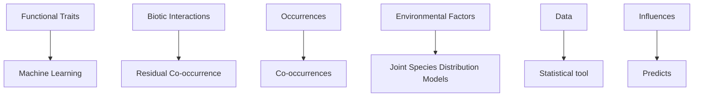

<!-- page 1 of 11 -->

0

Check for updates

Received: 18 August 2023

Accepted: 23 October 2023

DOI: 10.1002/ecs2.4732

A R T I C L E

ECOSPHERE

AN ESA OPEN ACCESS JOURNAL

# Functional traits predict species co-occurrence patterns in a North American Odonata metacommunity

Francesco Cerini 1,2 | Leonardo Vignoli 3 | Michael Blust 4 | Giovanni Strona5,6

1Dipartimento Scienze Ecologiche e Biologiche, Università della Tuscia, Viterbo, Italy
2School of Biological Sciences, University of Bristol, Bristol, UK
3Department of Science, University of Roma Tre, Rome, Italy
4Department of Biology, Green Mountain College, Poultney, Vermont, USA
5European Commission, Joint Research Centre, Ispra, Italy
6Faculty of Biological and Environmental Sciences, Organismal and Evolutionary Biology Research Programme, University of Helsinki, Helsinki, Finland

## Correspondence

Giovanni Strona

Email: [giovanni.strona@ec.europa.eu](mailto:giovanni.strona@ec.europa.eu)

Handling Editor: Robert R. Parmenter

## Abstract

The probability of occurrence of a given species in a target locality and assemblage is conditioned not only by environmental/climatic variables but also by the presence of other species (i.e., species co-occurrence). This framework, already complex in nature, becomes even more complicated if one considers the functional traits of species that, in turn, might influence the structure of metacommunities in various ways. Depending on the ecological and environmental setting, functional similarity (i.e., convergence in morphological and ecological traits) between species might either reduce their co-occurrence due to high niche overlap driving negative interactions or promote it if the similar traits are associated with local habitat suitability. Similarly, functional divergence might either promote species co-occurrence by limiting negative interactions through niche separation or reduce it through trait mediated environmental filtering. Therefore, discriminating between these alternative scenarios—predicting whether two species will tend to co-occur or not based on their traits—is extremely challenging. Here, we develop a novel protocol to tackle the challenge, and we demonstrate its effectiveness by showing that ecological species traits can predict species co-occurrence in a large dataset of North American Odonata. To this end, we first used the Hierarchical Modeling of Species Communities framework to quantify the pairwise species co-occurrence after controlling for environmental and climatic factors. Then, we used machine learning to generate models which proved capable of predict accurately the observed co-occurrence patterns from species functional traits. Our approach offers a generalizable analytical framework with the potential to clarify long-standing ecological questions.

## K E YW O RD S

assembly rules, co-occurrence, HMSC, machine learning, Odonata, species interactions, species traits

This is an open access article under the terms of the [Creative Commons Attribution](http://creativecommons.org/licenses/by/4.0/) License, which permits use, distribution and reproduction in any medium, provided the original work is properly cited.

© 2023 The Authors. Ecosphere published by Wiley Periodicals LLC on behalf of The Ecological Society of America.

Ecosphere. 2023;14:e4732.

[https://doi.org/10.1002/ecs2.4732](https://doi.org/10.1002/ecs2.4732)

[https://onlinelibrary.wiley.com/r/ecs2](https://onlinelibrary.wiley.com/r/ecs2)

1 of 11

<!-- page 2 of 11 -->

2 of 11

CERINI ET AL.

## INTRODUCTION

In community ecology, the distribution of the species in assemblages (i.e., metacommunities) is generally explained by three major ecological processes and their interactions: dispersal constrains, environmental (or habitat) filtering, and biotic interactions (Cadotte & Tucker, 2017; Hardy et al., 2012). While investigating the potential role of the latter in structuring bird communities in Melanesia, Diamond (1975) suggested that a high frequency of checkerboards (i.e., avoidance patterns in species × sites 1/0 matrices) would emerge from interspecific competition due high similarity in the ecological niche of the species (e.g., similar resource use). This idea—and the statistical approaches which led Diamond to conclude that the observed frequency of checkerboards diverged substantially from a null expectation— promoted a famous controversy which is yet to be settled (Connor & Simberloff, 1979; Connor et al., 2013; Diamond et al., 2015; Strona et al., 2018).

The issue has received renewed interest in the context of ecological network research, where the question of whether checkerboard patterns indicate competition has been translated into whether interaction links can be inferred from species co-occurrence (Blanchet et al., 2020; Freilich et al., 2018; Morales-Castilla et al., 2015; Morueta-Holme et al., 2016), and with the development of joint species distribution models (jSDMs). In jSDMs, the probability of occurrence of a given species in a target locality is assessed not only based on environmental/ climatic variables (as in standard SDMs), but also conditionally on the presence of other species (Ovaskainen et al., 2017; Tikhonov et al., 2020). One of the outputs of jSDMs is the residual co-occurrence of species after controlling for the contribution of abiotic variables and other confounding covariates, thus potentially accounting for the role of environmental filtering in the distribution patterns. It has been proposed that such residual co-occurrence could reflect ecological associations (Burner et al., 2021; Ovaskainen & Abrego, 2020; Ovaskainen et al., 2017) but, as for Diamond’s work on assembly rules, the idea has received various criticisms (Clark et al., 2014; Dormann et al., 2018).

The main caveat is that even when accounting for many environmental variables, it is virtually impossible to fully control for the effect of environmental filtering that acts also at the microhabitat scale. Hence, one cannot rule out the possibility that the observed degree of co-occurrence between species is more driven by overlap (or segregation) in some dimensions of their ecological niches not included in the model rather than by direct ecological interactions (Barner et $\mathrm { a l . }$ , 2018; Blanchet et al., 2020). When we take into consideration species

functional traits, we bring new potential information, but additional complications in the framework. Species traits play simultaneously fundamental roles in how a species interact with its habitat (environmental filtering) and with other species (biotic interactions; McGill et al., 2006). In fact, interspecific trait similarity can promote either species positive co-occurrence through consistent environmental filtering or negative co-occurrence in case the traits overlap promote species’ competition for resources (Kohli et al., 2018). Likewise, trait dissimilarity might promote not only positive co-occurrence by reducing niche overlap and enhancing species’ coexistence, but also negative co-occurrence through habitat filtering (i.e., species are best suited for living in separate locations).

In a simplified view, trait distance and co-occurrence should display a negative relationship if the traits drive primarily environmental filtering, and a positive one if the traits drive patterns of competitive exclusion (Figure 1). Clearly, in the real world (and considering multiple traits), the two processes coexist, making it hard to find a clear association. For instance, Elo et al. (2021) found no relationship between functional species similarity and negative co-occurrence on a large set of stream macroinvertebrate communities. Similarly, Burner et al. (2021) found that the difference in species traits was not a consistent predictor of the spatial associations for forest beetles. Nevertheless, it is important to consider that competitive dynamics (and species interactions in general) might be linked to functional traits in a more complex fashion than that provided by trait similarity.

| Co-occurrence | Biotic interactions (Functional distance) | Environmental filtering (Functional distance) |
| --- | --- | --- |
| -1.0 | 0.0 | 1.0 |
| 0.0 | 0.5 | 0.5 |
| 1.0 | 1.0 | 0.0 |

F I G U R E 1 Theoretical relationships between species distance in functional traits and degree of co-occurrence. In a situation where functional traits drive environmental filtering, we should expect a negative relationship between distance and co-occurrence (green line); in the opposite scenario, where functional traits drive patterns of competitive exclusion, we should expect a positive relationship between distance and co-occurrence (blue line).

21508925, 2023, 12, Downloaded from https://esajournals.onlinelibrary.wiley.com/doi/10.1002/ecs2.4732 by Faculdade Medicina De Lisboa, Wiley Online Library on [31/10/2025]. See the Terms and Conditions (https://onlinelibrary.wiley.com/terms-and-conditions) on Wiley Online Library for rules of use; OA articles are governed by the applicable Creative Commons License

<!-- page 3 of 11 -->

ECOSPHERE

3 of 11

Nonlinear combinations of traits can either promote or weaken co-occurrence, hence making it difficult to identify signs of biotic interactions or microhabitat filters just by means of correlation with traits similarity. Here, by using a large dataset of dragonflies and damselflies (Odonata), we show that machine learning can harness such complexity, making it possible to accurately predict co-occurrence patterns from species functional traits (see Figure 2 for an overview of the conceptual framework).

## METHODS

## Dataset

We focused on a large dataset of Odonata from the state of Vermont in North America. Our choice was dictated by two reasons. First, Odonata are among the most well-known insects in terms of biology, ecology, and distribution, thanks to years of scientific research (Corbet, 1999) and amateur collections and observations that

contributed to build large datasets on species detailed distribution (e.g., “OdonataCentral,” Abbott, 2006–2022). Second, various studies have suggested that, in addition to habitat preference, interspecific interactions play a fundamental role in shaping Odonata communities and metacommunities (Cerini et al., 2019, 2020; Renner et al., 2019; Suutari et al., 2004). The data represent an updated and georeferenced version of the dataset from Blust and Pfeiffer (2015), a publication which summarized more than 80 years of Odonata collection activities (both scientific and amateur) in the state of Vermont. Each local site in the dataset consists of a water body (e.g., pond, brooks, lakes, and river beds) that was visited once or multiple times over the years. We cleaned the dataset by removing species with uncertain or missing taxonomical information. Presence data represent sampling of adults and/or larvae. The final dataset includes 4995 species occurrence records for 131 species across 917 sites and 86 years (1663 combinations of sites and years). We excluded all sites hosting only 1 species (i.e., not hosting an Odonata multispecies community),

flowchart

F I G U R E 2 Diagram showing the logic behind our analytical framework. Species functional traits affect biotic interactions (e.g., competition for resources) and species habitat suitability (thus occurrences). Biotic interactions, together with climatic and environmental factors are major determinants of species distribution/occurrences. Co-occurrence patterns emerging from species occurrences are therefore simultaneously affected by biotic interactions and environmental drivers of species distribution, both mediated by functional traits. That is, species might tend to be found together (or not) because of overlap (or segregation) in their ecological niches and/or positive or negative interactions. Joint species distribution models (jSDMs) have been proposed as a potential statistical tool to distil the “residual” co-occurrence due to biotic interactions from that due to other (environmental) factors. Here we test if machine learning can use functional traits to model accurately pairwise positive and negative co-occurrence devised by jSDMs.

21508925, 2023, 12, Downloaded from https://esajournals.onlinelibrary.wiley.com/doi/10.1002/ecs2.4732 by Faculdade Medicina De Lisboa, Wiley Online Library on [31/10/2025]. See the Terms and Conditions (https://onlinelibrary.wiley.com/terms-and-conditions) on Wiley Online Library for rules of use; OA articles are governed by the applicable Creative Commons License

<!-- page 4 of 11 -->

4 of 11

CERINI ET AL.

and then we excluded all species present in less than 10 sites to avoid considering very rare species sampled just sporadically throughout the years, which can potentially create artefactual negative co-occurrence pattern with many other species just due to their rarity. This left us with 520 sites, 764 combinations of sites/years, and 95 species (3712 occurrences).

For each site/year combination, we identified and obtained information on the most important abiotic factors known to shape Odonata communities (Bried & Siepielski, 2018) and to play a fundamental role in the phenology and the beginning of adult stage for Odonata (Corbet, 1999; Flenner et al., 2010), namely, temperature, precipitation, habitat type (lotic or lentic water body), elevation, and land cover. For temperature and precipitation, we matched the exact dates of the records (month/ year) with actual temperature and precipitation data from the Global Historical Climatology Network monthly (GHCNm, freely available at [https://www.ncei.noaa.gov/products/land-based-station/global-historical-climatology-network-monthly](https://www.ncei.noaa.gov/products/land-based-station/global-historical-climatology-network-monthly)) dataset, which provides monthly climate summaries from meteorological stations. We interpolated the temperature and precipitation values using ordinary kriging between the closest stations for which data were available for a target point. For this, we started from the 10 closest stations to the target point, and then we progressively increased the number of stations until we found at least three temperature and pre-cipitation records. As for habitat type, we used information from the original data sources to classify sites into four broad categories, namely, lentic water, lotic water, wetland, and land. Additionally, we used a high-resolution dataset from the University of Vermont Spatial Analysis Laboratory (freely available at [https://geodata.vermont.gov/pages/land-cover](https://geodata.vermont.gov/pages/land-cover)) to characterize the land cover surrounding the target localities. The dataset provides data for 2016 at a resolution of 0.5 m. Instead of focusing on the exact land cover class at each sampling point, we computed the fraction of area covered, respectively, by tree canopy, grassland/shrubland, bare soil, water, or artificial structures within a square of 500 × 500 m centered on the target site. Such a measure offered the most informative picture of the environmental setting available for the sampling localities, with the assumption that the landcover surrounding the sites stayed stable during the years.

As for the species traits, we selected nine morphology-, behavior-, and habitat use-related Odonata species traits (Appendix S1: Table S1) from the online free available Odonate Phenotypic Database ([http:// www.odonatephenotypicdatabase.org](http://www.odonatephenotypicdatabase.org/)). These traits are measured on the adult stage of the species. Among the possible 33 traits available in the database, we excluded macro-geographical and location related traits (e.g., all

Odonata species of the study share the same continent, ecozone, and macroclimate), and we retained the nine traits that had the higher coverage across the study species. The information on the remaining traits for the study species were mostly missing.

## Statistical analyses

To assess pairwise species co-occurrence, we fit a latent-variable jSDM using the Hierarchical Modeling of Species Communities (HMSC) Bayesian framework. We fitted the models with a probit link function under the default prior distribution. We devised the following model (Equation 1):

$$
\begin{array}{l} \mathrm{sp\_occ} = \text {habitat} + \text {elevation} + \text {precipitation} ^ {2} \\ + \text {temperature} ^ {2} + \text {tree canopy fraction} \\ + \text { shrubland / grassland   fraction } \\ \text {+ bare soil fraction + water fraction} \\ + \text {artificial land fraction.} \tag {1} \\ \end{array}
$$

We included sites and years as random effects term, and we sampled the posterior distribution using four Markov chain Monte Carlo (MCMC) chains including 1000 samples each, with a thinning of 100 (for a total of 100k iterations), hence a burn-in of 25,000 iterations. We evaluated MCMC convergence by examining the distributions of the potential scale reduction factor over the parameters related to the fixed effects and the random effects (Gelman & Shalizi, 2013). We assessed model discriminatory power via AUC (area under the receiver operating characteristic curve, Pearce & Ferrier, 2000) and Tjur’s $R ^ { 2 }$ (2009).

We first explored the potential relationship between species trait dissimilarity and co-occurrence (i.e., theoretical framework in Figure 1). For each species pair, we assessed trait dissimilarity as the Mahalanobis distance (De Maesschalck et al., 2000) between their functional traits (using one-hot encoding of categorical variables with more levels), and we regressed such distances against the corresponding pairwise residual co-occurrence values derived from the HMSC analysis. We also explored the frequencies of correlations between pairwise species co-occurrence and the corresponding distances between individual traits (since most considered traits were categorical, such distances usually translated into 0/1 values, i.e., 0 if the target trait was shared by the two species, and 1 otherwise).

Then, we tested three different models aimed at predicting co-occurrence patterns from species functional traits: model I, a Random Forest regressor aimed at modeling the expected sign and intensity of the co-occurrence from the HMSC between any two species

21508925, 2023, 12, Downloaded from https://esajournals.onlinelibrary.wiley.com/doi/10.1002/ecs2.4732 by Faculdade Medicina De Lisboa, Wiley Online Library on [31/10/2025]. See the Terms and Conditions (https://onlinelibrary.wiley.com/terms-and-conditions) on Wiley Online Library for rules of use; OA articles are governed by the applicable Creative Commons License

<!-- page 5 of 11 -->

ECOSPHERE

5 of 11

in the dataset; model II, a Random Forest classifier aimed at predicting whether two species will have a positive (>0.5) co-occurrence; model III, a Random Forest classifier aimed at predicting whether two species will have a negative (<0.5) co-occurrence.

For all Random Forest models (Breiman, 2001), we first performed a hyper-parameter tuning to optimize model settings. For the models II and III, we performed 100 replicates by resampling the complete dataset to balance presence and absences. We also replicated the models using different thresholds for co-occurrence (0.4, $0 . 4 5 ,   0 . 5 0 ,   0 . 5 5 ,   . . . ,   0 . 9 )$ and then explored how the choice of the threshold affected model accuracy.

The three models have the following form (Equation 2):

$$
\text {cooc\_ij} \sim t 1 \_ i + t 1 \_ j + t 2 \_ i + t 2 \_ j + \dots + t n \_ i + t n \_ j, \tag {2}
$$

where cooc\_ij is the residual co-occurrence value derived from the HMSC analysis, and each entry tx\_i and tx\_j represents the xth trait of species i and j respectively (Appendix S1: Table S1).

For model I, cooc\_ij corresponded to the continuous mean co-occurrence values from the HMSC analysis (theoretically ranging from −1 to 1). For model II, we set cooc\_ij to 1 for the pairs exhibiting a strong positive co-occurrence (i.e., mean co-occurrence >0.5), and to 0 to the others. For model III, we set cooc\_ij to 1 for the pairs exhibiting a strong negative co-occurrence (i.e., mean co-occurrence <−0.5), and to 0 to the others.

To evaluate the predictive power of the Random Forest regressor (model I), we performed 100 replicates where we trained a model on a random set including 80% of the observations, testing it on the remaining 20%. We quantified the overall goodness of fit as the squared Pearson correlation coefficient between all the observed and the predicted co-occurrence values across the 100 simulations. For the Random Forest classifiers (models II and III), we assessed model quality by looking at type 1 and 2 classification errors and the resulting model accuracy based on internal out of bag validation (Janitza & Hornung, 2018; Mi et al., 2017). We performed the Random Forest analyses using the randomForest R package (Liaw & Wiener, 2002). All the code and data needed to replicate the analyses are available from Zenodo: [https://doi.org/10.5281/zenodo.10069033](https://doi.org/10.5281/zenodo.10069033) (Strona, 2023).

## RESULTS

The resulting HMSC model converged properly, with high effective sample sizes and potential scale reduction factors close to one, and showed an acceptable

performance (comparable with recent studies focusing on species’ response to environmental and climatic change, such as Antao et al., ˜ 2022), with an average AUC of 0.92 and an average Tjur $R ^ { 2 }$ of 0.17 (Appendix S1: Figure S1). On average, environmental and climatic variables accounted for 48.3% of the total explained variance, while the random year and site factors accounted, respectively, for 5.2% and 46.5% of the total explained variance. Among the environmental variables, land use (i.e., the combined contribution of the different fractions of land use categories surrounding a given site) resulted the most important factor (accounting for 20% of the total explained variance), followed by temperature (12.7%), elevation (5.4%), habitat (5.3%), and precipitation (4.9%) (Appendix S1: Figure S2). Among all possible species pairs $( n = 4 4 6 5$ for 95 species), 28.6% showed a positive co-occurrence (>0.5), while 18.4% showed a negative co-occurrence (<−0.5) (Appendix S1: Figure S3; we refer here to co-occurrence with a statistical support >0.95, see Methods).

Overall, we found no relationship between species co-occurrence and trait dissimilarity $( R ^ { 2 } = 0 . 0 0 7 ;$ Figure 3), as we recorded cases of high and low co-occurrence for both small and large functional distance (Figure 3). In most cases, however, functional distance fell into an average range. The correlations between individual trait distance and co-occurrence were very weak, but negative slopes were more common than positives (Figure 4).

Nevertheless, our machine learning approach revealed a significant potential for functional traits to predict co-occurrence patterns. Specifically, model I, that

| Co-occurrence (range) | Functional distance (range) | Counts |
| --- | --- | --- |
| -0.8~0.9 | 0.0~1.0 | 1~27 |

F I G U R E 3 Density color-coded hexplot showing the regression $( R ^ { 2 } = 0 . 0 0 3 )$ between Hierarchical Modeling of Species Communities residuals co-occurrence values and species trait dissimilarity, calculated as the Mahalanobis distance, between all pair of species in the dataset.

21508925, 2023, 12, Downloaded from https://esajournals.onlinelibrary.wiley.com/doi/10.1002/ecs2.4732 by Faculdade Medicina De Lisboa, Wiley Online Library on [31/10/2025]. See the Terms and Conditions (https://onlinelibrary.wiley.com/terms-and-conditions) on Wiley Online Library for rules of use; OA articles are governed by the applicable Creative Commons License

<!-- page 6 of 11 -->

6 of 11

CERINI ET AL.

| Slope (Bin) | Frequency |
| --- | --- |
| -0.35~-0.325 | 1 |
| -0.275~-0.25 | 2 |
| -0.25~-0.225 | 2 |
| -0.225~-0.2 | 2 |
| -0.175~-0.15 | 3 |
| -0.15~-0.125 | 8 |
| -0.125~-0.1 | 4 |
| -0.1~0.075 | 1 |

F I G U R E 4 Frequency histograms of the slopes of the regressions between pairwise species co-occurrences and individual traits distance.

is, the Random Forest regressor aiming at predicting continuous positive and negative co-occurrence values, showed a $R ^ { 2 }$ of 0.66 between all observed versus predicted co-occurrence values $( n = 6 4 { , } 8 0 0 )$ obtained from 100 models trained on random sets including 80% of observations in the dataset and tested on the remaining 20% of observations (Figure 5).

The two models looking separately at positive (model II) and negative (model III) co-occurrence performed even better, with an average accuracy of 0.82 (0.008 SD) and 0.80 (0.009 SD, Figure 6). Error rates remained low regardless of the selected co-occurrence threshold (with type 2 errors always <0.2 and type 1 errors always less than 0.3) and were lowest for thresholds around 0.5–0.6 (Figure 6). For a threshold of 0.5, model I had type 1 errors on average of 0.183 (0.011 SD) and 0.181 (0.009 SD), while model II had average type 1 and 2 errors of 0.240 (0.014 SD) and 0.154 (0.011 SD), respectively.

Among the considered traits, the adult phase morphological parameters related to body size emerged consistently as main predictors of co-occurrence (both positive and negative) (Figure 7). Specifically, the body length and hindwing length resulted by far as the major predictors, followed by the body color pattern and the type of aquatic habitat frequentation. Other traits related to flight behaviors and body pigmentation did not show strong effects (Figure 4; Appendix S1: Table S1).

## DISCUSSION

Environmental features and interspecific interactions are assumed to be the main drivers of species distribution and abundance (Chesson, 2000), often interacting in a

| Predicted Co-occurrence (range) | Observed Co-occurrence (range) |
| --- | --- |
| -1.0~1.0 | -1.0~1.0 |

F I G U R E 5 Observed residual co-occurrence from the Hierarchical Modeling of Species Communities analysis for all Odonata species pairs versus the predictions obtained from a Random Forest regressor modeling species co-occurrence based on species functional traits. The plot includes comparisons between observations and predictions for 100 models, each trained on a random sample including 80% of the available observations and tested on the remaining 20% (thus, each point in the plot correspond to test observations, not to training data). The red line is the line of equity.

complex way in shaping communities composition (Ousterhout et al., 2015). For years, the difficulties in discerning the abiotic and biotic drivers of species occurrence and abundance patterns have fueled the still ongoing debate on the potential structuring role of assembly rules (Blanchet et al., 2020; Connor et al., 2013; Diamond et al., 2015; Gotelli & McCabe, 2002). Recently, new methodological frameworks have brought promising advances on the topic (Pollock et al., 2014; Tikhonov et al., 2020; Warton et al., 2015). Among these, jSDMs provide a valuable tool to disentangle the contribution that landscape features and habitat filtering (Mazerolle & Villard, 1999), rather than species interaction processes, have in structuring species occupancy and richness (D’Amen et al., 2018; Elo et al., 2021). Ideally, nonrandom co-occurrence patterns identified by jSDMs (such as the HMSC used here) are generated taking into account the weight that environmental variables have in explaining species presence–absence. Thus, in principle, such models should be able to disregard the co-occurrence patterns generated by habitat filtering processes acting at macroscale (e.g., landcover, average temperatures, and rainfall of the region) while retaining those emerging from interspecific interactions (Ovaskainen et al., 2017) or from uncontrolled microhabitat factors (e.g., water quality; Sun et al., 2021), if not

21508925, 2023, 12, Downloaded from https://esajournals.onlinelibrary.wiley.com/doi/10.1002/ecs2.4732 by Faculdade Medicina De Lisboa, Wiley Online Library on [31/10/2025]. See the Terms and Conditions (https://onlinelibrary.wiley.com/terms-and-conditions) on Wiley Online Library for rules of use; OA articles are governed by the applicable Creative Commons License

<!-- page 7 of 11 -->

ECOSPHERE

7 of 11

included in the model. Such an ability, which has been questioned in other works (Clark et al., 2014; Dormann et al., 2018), finds support in our results, which demonstrate how species functional traits can accurately predict co-occurrence patterns identified by HMSC.

Based on the theory of limiting similarity, species occurring syntopically with similar trait values should interact more strongly (i.e., resulting in lower fitness) than dissimilar species, thus leading to possible local exclusion (e.g., competitive checkerboards; Decaëns et al., 2008) and to niche specialization within the assemblages (Macarthur & Levins, 1967; Schirmer et al., 2020). Nevertheless, as observed in previous studies (Elo et al., 2021), our first analysis exploring the direct relationship between species traits dissimilarity and pairwise residual co-occurrence derived from the HMSC did not find any relevant pattern. In general, the correlations were very weak, but mostly negative, supporting a slightly more important role of environmental filtering over interactions (Figures 1 and 4). On the one hand, this result could be ascribed to a selection of habitat variables for the HMSC not accurately representing the environmental features acting as possible assembly filters (but see Bried & Siepielski, 2018; Cerini et al., 2021); thus, the co-occurrence patterns would still be an outcome produced by macro-environmental constraints not directly reflected in the species traits. Nonetheless, it is worth emphasizing that the environmental variables used in our model made up for a good portion of the explained variance, thus suggesting that the obtained residual co-occurrence might indeed be a measure not dependent on macroscale habitat filtering. On the other hand, the idea that similarities in species traits might reflect species competition for resources, and hence possibly the degree of co-occurrence (e.g., Elo et al., 2021), in a linear fashion is likely to be an oversimplified picture of the ecological reality, especially at a macroecological scale. Species traits affect the way species interact in complex and nonlinear ways that might not be captured by a distance measure. This is further complicated by the fact that while some trait combinations might be involved in

F I G U R E 6 Model quality assessment for the Random Forest classifiers (models II and III). (A) Model accuracy based on internal out-of-bag validation. (B) Type 1 and 2 error rates for model II (classifier modeling positive co-occurrence) versus different co-occurrence threshold selected to define a significant co-occurrence (e.g., a co-occurrence value >0.5, 0.6 etc., with a statistical support of 0.95 is defined as a 1, i.e., a “positive co-occurrence”). (C) Type 1 and 2 error rates for model III (classifier modeling negative co-occurrence) versus different co-occurrence threshold selected to define a significant co-occurrence.

21508925, 2023, 12, Downloaded from https://esajournals.onlinelibrary.wiley.com/doi/10.1002/ecs2.4732 by Faculdade Medicina De Lisboa, Wiley Online Library on [31/10/2025]. See the Terms and Conditions (https://onlinelibrary.wiley.com/terms-and-conditions) on Wiley Online Library for rules of use; OA articles are governed by the applicable Creative Commons License

<!-- page 8 of 11 -->

8 of 11

CERINI ET AL.

F I G U R E 7 Importance of the species functional traits in the three Random Forest models to predict co-occurrence. (A) Traits importance calculated as the percentage increment of the mean square error (MSE) when permuting the out-of-bag data and extracting the resulting error increase when one variable is left out. (B) Traits important based on the random forest tree node purity, calculated as the reduction in sum of squared errors whenever a variable is chosen to split. Bars with whiskers show the mean scores ± SEs of the different values for the one-hot encoded traits (i.e., traits with different categorical values like “habitat preference = open versus closed”). Model I: Random Forest and regressor modeling continuous positive and negative Hierarchical Modeling of Species Communities residual co-occurrence versus Odonata functional traits. Model II: Random Forest classifier modeling positive co-occurrence (i.e., co-occurrence >0.5 with a statistical support of 0.95) versus Odonata functional traits. Model III: Random Forest classifier modeling negative co-occurrence (i.e., co-occurrence <−0.5 with a statistical support of 0.95) versus Odonata functional traits. Detailed description of the species traits can be found in Appendix S1.

competitive dynamics and hence possibly promote negative co-occurrence, other trait combinations might be related, for instance, to habitat adaptation or density dependent processes (i.e., multispecies predation avoidance; Tirok & Gaedke, 2010) and thus favor positive co-occurrence, with this being especially true in freshwater ponds communities (Wellborn et al., 1996).

Here, we showed that machine learning permits to identify such complex and nonlinear links between

species functional traits and co-occurrence patterns. Although our main finding that species functional traits predict both negative and positive co-occurrence is not direct evidence (i.e., experimental) that interspecific interactions rather than microscale habitat filtering determine species distribution patterns, it provides novel and interesting baselines to deepen both hypothesized processes. The main assumption behind our approach is that functional traits are strong determinants of species

21508925, 2023, 12, Downloaded from https://esajournals.onlinelibrary.wiley.com/doi/10.1002/ecs2.4732 by Faculdade Medicina De Lisboa, Wiley Online Library on [31/10/2025]. See the Terms and Conditions (https://onlinelibrary.wiley.com/terms-and-conditions) on Wiley Online Library for rules of use; OA articles are governed by the applicable Creative Commons License

<!-- page 9 of 11 -->

ECOSPHERE

9 of 11

interactions and habitat suitability. Once controlled for the role of macroscale environmental variables in the HMSC-derived occurrence patterns, functional traits proved to predict the residual co-occurrences. This suggests that such species distribution patterns might retain at least some signature of species interactions. Focusing on the traits identified as most important predictors of negative co-occurrence by the model (Figure 7) supports such theoretical framework, as these are known to play important roles in interspecific competition and predation processes.

In both Anisoptera and Zygoptera, the body and hindwings lengths are good representation of species thermoregulatory capacity and flight potential (i.e., proxies for dispersal, competition, and predation capacities; Corbet, 1999; De Marco & Resende, 2002) and are easily linkable to negative interspecific interactions. However, we cannot abstract from our results the “sign” of the predictive effect of the traits on the occurrence—we do not know whether two species are predicted to segregate if their body length is more or less similar—thus, we have to discuss the ecological meaning of the two opposite cases. For example, the overlap in body size can indicate for a species pair the potential to use the habitat space in a similar way and directly compete as both adults (Boucenna et al., 2018) and larvae (e.g., same ecological guild, Suutari et al., 2004), in a way to generate local competitive exclusions and thus segregation patterns (Cerini et al., 2019). Indeed, Odonata revealed systematic morphological divergence between pairs of co-occurring species, especially those most demanding of environmental conditions (i.e., zygopterans, Oliveira-Junior et al., 2021). Conversely, a big difference in size could indicate the potential for the smallest species to be predated by the biggest, thus generating avoidance patterns (Cerini et al., 2019); this being especially true with Zygoptera–Anisoptera species pairs (Priyadarshana, 2021). In both cases, the importance of morphological traits in predicting the spatial pattern is a good indicator of how those traits can mediate the interaction processes potentially creating the negative co-occurrence.

Body and hindwings length were found to be good predictors also of positive co-occurrence (Figure 7). This might underlie cases where the functional traits relation with the species occurrence may not involve direct interactions but rather niche differences at microscale: for example, morphologically similar species living in the same sites by being dietary generalist or morphologically dissimilar species targeting preys with different size (Dudgeon, 1989). Similar-sized species that co-occur in the same sites might avoid the resource competition by being temporally segregated (e.g., partitioning the emergence timings; Boucenna et al., 2018), or by spatially

segregating within the local site (e.g., differential microhabitat use; Khelifa et al., 2013).

The Random Forest models predicted species co-occurrence from functional traits despite the many different generating processes, thus revealing a high potential of the proposed approach. Besides providing new hints for the long-standing debate on the ecological relevance of assembly rules (Diamond et al., 2015), this approach might produce interesting insights into the role of specific traits in determining species co-occurrence based on their pre-dictive power in the different models. Generally speaking, as the species traits libraries keep being enriched (Jeliazkov et al., 2020), our framework could serve as an exploratory tool to identify which traits are potentially important determinants of co-occurrence, without requiring a priori knowledge of the exact mechanisms by which those functional traits affect interactions. The traits importance output might serve exactly as a basis to start formulating ecological/biological hypotheses to be tested thorough ad hoc experimental designs. The derived information from these theoretical and experimental approaches might shed light on the ecological meaning of those traits, possibly fueling investigation of phylogenetic signals of selection (Burns & Strauss, 2012). In conclusion, using machine learning to predict both positive and negative species co-occurrence patterns based on species functional traits appears as a promising tool with the potential to advance our understanding of whether, to what extent, and how species interactions and microscale environmental filters shape biodiversity patterns.

## AUTHOR CONTRIBUTIONS

Leonardo Vignoli, Giovanni Strona, and Francesco Cerini developed the idea together. Francesco Cerini and Leonardo Vignoli are to be considered as co-leading authors. Michael Blust provided the data. Giovanni Strona designed the statistical workflow and performed the analyses. Giovanni Strona, Francesco Cerini, and Leonardo Vignoli contributed equally to the first draft realization. All authors contributed to the final draft.

## CONFLICT OF INTEREST STATEMENT

The authors declare no conflicts of interest.

## DATA AVAILABILITY STATEMENT

Data and code (Strona, 2023) are available from Zenodo: [https://doi.org/10.5281/zenodo.10069033](https://doi.org/10.5281/zenodo.10069033).

## ORCID

- Francesco Cerini [https://orcid.org/0000-0002-1367-1239](https://orcid.org/0000-0002-1367-1239)
- Leonardo Vignoli [https://orcid.org/0000-0002-1599-092X](https://orcid.org/0000-0002-1599-092X)
- Giovanni Strona [https://orcid.org/0000-0003-2294-4013](https://orcid.org/0000-0003-2294-4013)

21508925, 2023, 12, Downloaded from https://esajournals.onlinelibrary.wiley.com/doi/10.1002/ecs2.4732 by Faculdade Medicina De Lisboa, Wiley Online Library on [31/10/2025]. See the Terms and Conditions (https://onlinelibrary.wiley.com/terms-and-conditions) on Wiley Online Library for rules of use; OA articles are governed by the applicable Creative Commons License

<!-- page 10 of 11 -->

10 of 11

CERINI ET AL.

## REFERENCES

- Abbott, J. C. 2006–2022. “OdonataCentral: An Online Resource for the Distribution and Identification of Odonata.” [https://www.odonatacentral.org/#/](https://www.odonatacentral.org/#/).
- Antao, L. H., B. Weigel, G. Strona, M. Hällfors, E. Kaarlejärvi, ˜ T. Dallas, Ø. H. Opedal, et al. 2022. “Climate Change Reshuffles Northern Species within Their Niches.” Nature Climate Change 12: 587–592.
- Barner, A. K., K. E. Coblentz, S. D. Hacker, and B. A. Menge. 2018. “Fundamental Contradictions among Observational and Experimental Estimates of Non-Trophic Species Interactions.” Ecology 99: 557–566.
- Blanchet, F. G., K. Cazelles, and D. Gravel. 2020. “Co-Occurrence Is Not Evidence of Ecological Interactions.” Ecology Letters 23: 1050–63.
- Blust, M., and B. Pfeiffer. 2015. “The Odonata of Vermont.” Bulletin of American Odonatology 11: 69–119.
- Boucenna, N., A. Kahalerras, N. Boukhemza-Zemmouri, M. Houhamdi, and R. Khelifa. 2018. “Niche Partitioning at Emergence of Two Sympatric Top-Predator Dragonflies, Anax imperator and A. parthenope (Odonata: Aeshnidae).” Annales de la Société entomologique de France (N.S.) 54: 73–80.
- Breiman, L. 2001. “Random Forests.” Machine Learning 45: 5–32.
- Bried, J. T., and A. M. Siepielski. 2018. “Opportunistic Data Reveal Widespread Species Turnover in Enallagma Damselflies at Biogeographical Scales.” Ecography 41: 958–970.
- Burner, R. C., J. G. Stephan, L. Drag, T. Birkemoe, J. Muller, T. Snäll, O. Ovaskainen, et al. 2021. “Traits Mediate Niches and Co-Occurrences of Forest Beetles in Ways that Differ among Bioclimatic Regions.” Journal of Biogeography 48: 3145–57.
- Burns, J. H., and S. Y. Strauss. 2012. “Effects of Competition on Phylogenetic Signal and Phenotypic Plasticity in Plant Functional Traits.” Ecology 93: S126–S137.
- Cadotte, M. W., and C. M. Tucker. 2017. “Should Environmental Filtering be Abandoned?” Trends in Ecology & Evolution 32: 429–437.
- Cerini, F., M. A. Bologna, and L. Vignoli. 2019. “Dragonflies Community Assembly in Artificial Habitats: Glimpses from Field and Manipulative Experiments.” PLoS One 14: e0214127.
- Cerini, F., P. Bombi, R. Cannings, and L. Vignoli. 2021. “Odonata Metacommunity Structure in Northern Ecosystems Is Driven by Temperature and Latitude.” Insect Conservation and Diversity 14: 675–685.
- Cerini, F., L. Stellati, and L. Vignoli. 2020. “Segregation Structure in Odonata Assemblages Follows the Latitudinal Gradient.” Oecologia 194: 15–25.
- Chesson, P. 2000. “Mechanisms of Maintenance of Species Diversity.” Annual Review of Ecology and Systematics 31: 343–366.
- Clark, J. S., A. E. Gelfand, C. W. Woodall, and K. Zhu. 2014. “More than the Sum of the Parts: Forest Climate Response from Joint Species Distribution Models.” Ecological Applications 24: 990–99.
- Connor, E. F., M. D. Collins, and D. Simberloff. 2013. “The Checkered History of Checkerboard Distributions.” Ecology 94: 2403–14.
- Connor, E. F., and D. Simberloff. 1979. “The Assembly of Species Communities: Chance or Competition?” Ecology 60: 1132–40.

- Corbet, P. S. 1999. Dragonflies: Behaviour and Ecology of Odonata. Colchester: Harley Books.
- D’Amen, M., H. K. Mod, N. J. Gotelli, and A. Guisan. 2018. “Disentangling Biotic Interactions, Environmental Filters, and Dispersal Limitation as Drivers of Species Co-Occurrence.” Ecography 41: 1233–44.
- De Maesschalck, R., D. Jouan-Rimbaud, and D. L. Massart. 2000. “The Mahalanobis Distance.” Chemometrics and Intelligent Laboratory Systems 50: 1–18.
- De Marco, P., Jr., and D. C. Resende. 2002. “Activity Patterns and Thermoregulation in a Tropical Dragonfly Assemblage.” Odonatologica 31: 129–138.
- Decaëns, T., P. Margerie, M. Aubert, M. Hedde, and F. Bureau. 2008. “Assembly Rules within Earthworm Communities in North-Western France—A Regional Analysis.” Applied Soil Ecology 39: 321–335.
- Diamond, J. M. 1975. “Assembly of Species Communities.” In Ecology and Evolution of Communities, edited by M. L. Cody and J. M. Diamond, 342–444. Cambridge: Harvard University Press.
- Diamond, J., S. L. Pimm, and J. G. Sanderson. 2015. “The Checkered History of Checkerboard Distributions: Comment.” Ecology 96: 3386–88.
- Dormann, C. F., M. Bobrowski, D. M. Dehling, D. J. Harris, F. Hartig, H. Lischke, M. D. Moretti, et al. 2018. “Biotic Interactions in Species Distribution Modelling: 10 Questions to Guide Interpretation and Avoid False Conclusions.” Global Ecology and Biogeography 27: 1004–16.
- Dudgeon, D. 1989. “Resource Partitioning among Odonata (Insecta: Anisoptera and Zygoptera) Larvae in a Hong Kong Forest Stream.” Journal of Zoology 217: 381–402.
- Elo, M., J. Jyrkänkallio-Mikkola, O. Ovaskainen, J. Soininen, K. T. Tolonen, and J. Heino. 2021. “Does Trait-Based Joint Species Distribution Modelling Reveal the Signature of Competition in Stream Macroinvertebrate Communities?” Journal of Animal Ecology 90: 1276–87.
- Flenner, I., O. Richter, and F. Suhling. 2010. “Rising Temperature and Development in Dragonfly Populations at Different Latitudes.” Freshwater Biology 55: 397–410.
- Freilich, M. A., E. Wieters, B. R. Broitman, P. A. Marquet, and S. A. Navarrete. 2018. “Species Co-Occurrence Networks: Can They Reveal Trophic and Non-Trophic Interactions in Ecological Communities?” Ecology 99: 690–99.
- Gelman, A., and C. R. Shalizi. 2013. “Philosophy and the Practice of Bayesian Statistics.” British Journal of Mathematical and Statistical Psychology 66: 8–38.
- Gotelli, N. J., and D. J. McCabe. 2002. “Species Co-Occurrence: A Meta-Analysis of J. M. Diamond’s Assembly Rules Model.” Ecology 83: 2091–96.
- Hardy, O. J., P. Couteron, F. Munoz, B. R. Ramesh, and R. Pélissier. 2012. “Phylogenetic Turnover in Tropical Tree Communities: Impact of Environmental Filtering, Biogeography and Mesoclimatic Niche Conservatism.” Global Ecology and Biogeography 21: 1007–16.
- Janitza, S., and R. Hornung. 2018. “On the Overestimation of Random Forest’s Out-of-Bag Error.” PLoS One 13: e0201904.
- Jeliazkov, A., D. Mijatovic, S. Chantepie, N. Andrew, R. Arlettaz, L. Barbaro, N. Barsoum, et al. 2020. “A Global Database for Metacommunity Ecology, Integrating Species, Traits, Environment and Space.” Scientific Data 7: 6.

21508925, 2023, 12, Downloaded from https://esajournals.onlinelibrary.wiley.com/doi/10.1002/ecs2.4732 by Faculdade Medicina De Lisboa, Wiley Online Library on [31/10/2025]. See the Terms and Conditions (https://onlinelibrary.wiley.com/terms-and-conditions) on Wiley Online Library for rules of use; OA articles are governed by the applicable Creative Commons License

<!-- page 11 of 11 -->

ECOSPHERE

11 of 11

- Khelifa, R., R. Zebsa, A. Moussaoui, A. Kahalerras, S. Bensouilah, and H. Mahdjoub. 2013. “Niche Partitioning in Three Sympatric Congeneric Species of Dragonfly, Orthetrum chrysostigma, O. coerulescens anceps, and O. nitidinerve: The Importance of Microhabitat.” Journal of Insect Science 13: 1–17.
- Kohli, B. A., R. C. Terry, and R. J. Rowe. 2018. “A Trait-Based Framework for Discerning Drivers of Species Co-Occurrence across Heterogeneous Landscapes.” Ecography 41: 1921–33.
- Liaw, A., and M. Wiener. 2002. “Classification and Regression by randomForest.” R News 2(3): 18–22. [https://CRAN.R-project.org/doc/Rnews/](https://cran.r-project.org/doc/Rnews/).
- Macarthur, R., and R. Levins. 1967. “The Limiting Similarity, Convergence, and Divergence of Coexisting Species.” The American Naturalist 101: 377–385.
- Mazerolle, M. J., and M.-A. Villard. 1999. “Patch Characteristics and Landscape Context as Predictors of Species Presence and Abundance: A Review.” Ecoscience 6: 117–124.
- McGill, B. J., B. J. Enquist, E. Weiher, and M. Westoby. 2006. “Rebuilding Community Ecology from Functional Traits.” Trends in Ecology & Evolution 21: 178–185.
- Mi, C., F. Huettmann, Y. Guo, X. Han, and L. Wen. 2017. “Why Choose Random Forest to Predict Rare Species Distribution with Few Samples in Large Undersampled Areas? Three Asian Crane Species Models Provide Supporting Evidence.” PeerJ 5: e2849.
- Morales-Castilla, I., M. G. Matias, D. Gravel, and M. B. Araújo. 2015. “Inferring Biotic Interactions from Proxies.” Trends in Ecology & Evolution 30: 347–356.
- Morueta-Holme, N., B. Blonder, B. Sandel, B. J. McGill, R. K. Peet, J. E. Ott, C. Violle, B. J. Enquist, P. M. Jørgensen, and J.-C. Svenning. 2016. “A Network Approach for Inferring Species Associations from Co-Occurrence Data.” Ecography 39: 1139–50.
- Oliveira-Junior, J. M. B., M. A. Teodosio, and L. Juen. 2021. - “Patterns of Co-Occurrence and Body Size in Dragonflies and Damselflies (Insecta: Odonata) in Preserved and Altered Amazonian Streams.” Austral Entomology 60: 436–450.
- Ousterhout, B. H., T. L. Anderson, D. L. Drake, W. E. Peterman, and R. D. Semlitsch. 2015. “Habitat Traits and Species Interactions Differentially Affect Abundance and Body Size in Pond-Breeding Amphibians.” Journal of Animal Ecology 84: 914–924.
- Ovaskainen, O., and N. Abrego. 2020. Joint Species Distribution Modelling: With Applications in R. Cambridge: Cambridge University Press.
- Ovaskainen, O., G. Tikhonov, A. Norberg, F. Guillaume Blanchet, L. Duan, D. Dunson, T. Roslin, and N. Abrego. 2017. “How to Make More Out of Community Data? A Conceptual Framework and Its Implementation as Models and Software.” Ecology Letters 20: 561–576.
- Pearce, J., and S. Ferrier. 2000. “An Evaluation of Alternative Algorithms for Fitting Species Distribution Models Using Logistic Regression.” Ecological Modelling 128: 127–147.
- Pollock, L. J., R. Tingley, W. K. Morris, N. Golding, R. B. O’Hara, K. M. Parris, P. A. Vesk, and M. A. McCarthy. 2014. “Understanding Co-Occurrence by Modelling Species Simultaneously with a Joint Species Distribution Model (JSDM).” Methods in Ecology and Evolution 5: 397–406.
- Priyadarshana, T. S. 2021. “Do Predatory Adult Odonates Estimate Their Adult Prey Odonates’ Body Size and Dispersal Ability to

- Proceed with a Successful Attack?” Journal of Threatened Taxa 13: 18949–52.
- Renner, S., E. Périco, M. S. Dalzochio, and G. Sahlén. 2019. “Ecoregions within the Brazilian Pampa Biome Reflected in Odonata Species Assemblies.” Austral Ecology 44: 461–472.
- Schirmer, A., J. Hoffmann, J. A. Eccard, and M. Dammhahn. 2020. “My Niche: Individual Spatial Niche Specialization Affects within- and between-Species Interactions.” Proceedings of the Royal Society B: Biological Sciences 287: 20192211.
- Strona, G. 2023. “giovannistrona/odonata\_cooccurrence: Code and Data Associated to the Paper ‘Functional Traits Predict Species Co-Occurrence Patterns in a North American Odonata metacommunity’ version: v1.0.0.” Zenodo. [https://doi.org/10.5281/zenodo.10069033](https://doi.org/10.5281/zenodo.10069033).
- Strona, G., W. Ulrich, and N. J. Gotelli. 2018. “Bi-Dimensional Null Model Analysis of Presence-Absence Binary Matrices.” Ecology 99(1): 103–115.
- Sun, Z., C. Zhao, W. Zhu, W. Zhu, J. Feng, S. Su, and T. Zhao. 2021. “Microhabitat Features Determine the Tadpole Diversity in Mountainous Streams.” Ecological Indicators 126: 107647.
- Suutari, E., M. J. Rantala, J. Salmela, and J. Suhonen. 2004. “Intraguild Predation and Interference Competition on the Endangered Dragonfly Aeshna viridis.” Oecologia 140: 135–39.
- Tikhonov, G., Ø. H. Opedal, N. Abrego, A. Lehikoinen, M. M. J. Jonge, J. Oksanen, and O. Ovaskainen. 2020. “Joint Species Distribution Modelling with the R-Package HMSC.” Methods in Ecology and Evolution 11: 442–47.
- Tirok, K., and U. Gaedke. 2010. “Internally Driven Alternation of Functional Traits in a Multispecies Predator–Prey System.” Ecology 91: 1748–62.
- Tjur, T. 2009. “Coefficients of Determination in Logistic Regression Models—A New Proposal: The Coefficient of Discrimination.” The American Statistician 63: 366–372.
- Warton, D. I., F. G. Blanchet, R. B. O’Hara, O. Ovaskainen, S. Taskinen, S. C. Walker, and F. K. C. Hui. 2015. “So Many Variables: Joint Modeling in Community Ecology.” Trends in Ecology & Evolution 30: 766–779.
- Wellborn, G. A., D. K. Skelly, and E. E. Werner. 1996. “Mechanisms Creating Community Structure across a Freshwater Habitat Gradient.” Annual Review of Ecology and Systematics 27: 337–363.

## SUPPORTING INFORMATION

Additional supporting information can be found online in the Supporting Information section at the end of this article.

How to cite this article: Cerini, Francesco, Leonardo Vignoli, Michael Blust, and Giovanni Strona. 2023. “Functional Traits Predict Species Co-Occurrence Patterns In a North American Odonata Metacommunity.” Ecosphere 14(12): e4732. [https://doi.org/10.1002/ecs2.4732](https://doi.org/10.1002/ecs2.4732)

21508925, 2023, 12, Downloaded from https://esajournals.onlinelibrary.wiley.com/doi/10.1002/ecs2.4732 by Faculdade Medicina De Lisboa, Wiley Online Library on [31/10/2025]. See the Terms and Conditions (https://onlinelibrary.wiley.com/terms-and-conditions) on Wiley Online Library for rules of use; OA articles are governed by the applicable Creative Commons License

<!-- ===== Complementary: Cerini2023_S1.csv ===== -->

<table>
<tr><td>GenusSpecies</td><td>Genus</td><td>Species</td><td>Family</td><td>SubOrder</td><td>Flight_season_start</td><td>Flight_season_end</td><td>body_colors</td><td>body_colortypes</td><td>body_patterns</td><td>mate_guarding</td><td>flight_mode</td><td>territoriality</td><td>aquatic_habitats</td><td>habitat_openness</td><td>body_lengths</td><td>hindwing_lengths</td><td>has_wing_pigment</td><td>wing_pigment_extent_discrete</td><td>wing_pigment_extent_continuous</td><td>wing_pigment_symmetry</td><td>wing_pigment_color</td><td>wing_pigment_placement</td></tr>
<tr><td>Aeshna.canadensis</td><td>Aeshna</td><td>canadensis</td><td>Aeshnidae</td><td>Anisoptera</td><td>6/5</td><td>20/10</td><td>NA</td><td>NA</td><td>NA</td><td>NA</td><td>flier</td><td>NA</td><td>NA</td><td>NA</td><td>NA</td><td>NA</td><td>NA</td><td>NA</td><td>NA</td><td>NA</td><td>NA</td><td>NA</td></tr>
<tr><td>Aeshna.clepsydra</td><td>Aeshna</td><td>clepsydra</td><td>Aeshnidae</td><td>Anisoptera</td><td>22/6</td><td>26/9</td><td>NA</td><td>NA</td><td>NA</td><td>NA</td><td>flier</td><td>NA</td><td>NA</td><td>NA</td><td>NA</td><td>NA</td><td>NA</td><td>NA</td><td>NA</td><td>NA</td><td>NA</td><td>NA</td></tr>
<tr><td>Aeshna.constricta</td><td>Aeshna</td><td>constricta</td><td>Aeshnidae</td><td>Anisoptera</td><td>7/8</td><td>10/3</td><td>blue</td><td>pigment</td><td>spotted</td><td>NA</td><td>flier</td><td>NA</td><td>ephemeral</td><td>open</td><td>69</td><td>43.5</td><td>no</td><td>NA</td><td>NA</td><td>NA</td><td>NA</td><td>NA</td></tr>
<tr><td>Aeshna.constricta</td><td>Aeshna</td><td>constricta</td><td>Aeshnidae</td><td>Anisoptera</td><td>7/8</td><td>10/3</td><td>blue</td><td>pigment</td><td>spotted</td><td>NA</td><td>flier</td><td>NA</td><td>ephemeral</td><td>open</td><td>69</td><td>43.5</td><td>no</td><td>NA</td><td>NA</td><td>NA</td><td>NA</td><td>NA</td></tr>
<tr><td>Aeshna.constricta</td><td>Aeshna</td><td>constricta</td><td>Aeshnidae</td><td>Anisoptera</td><td>7/8</td><td>10/3</td><td>blue</td><td>pigment</td><td>spotted</td><td>NA</td><td>flier</td><td>NA</td><td>ephemeral</td><td>open</td><td>69</td><td>43.5</td><td>no</td><td>NA</td><td>NA</td><td>NA</td><td>NA</td><td>NA</td></tr>
<tr><td>Aeshna.constricta</td><td>Aeshna</td><td>constricta</td><td>Aeshnidae</td><td>Anisoptera</td><td>7/8</td><td>10/3</td><td>blue</td><td>pigment</td><td>spotted</td><td>NA</td><td>flier</td><td>NA</td><td>ephemeral</td><td>open</td><td>69</td><td>43.5</td><td>no</td><td>NA</td><td>NA</td><td>NA</td><td>NA</td><td>NA</td></tr>
<tr><td>Aeshna.constricta</td><td>Aeshna</td><td>constricta</td><td>Aeshnidae</td><td>Anisoptera</td><td>7/8</td><td>10/3</td><td>blue</td><td>pigment</td><td>spotted</td><td>NA</td><td>flier</td><td>NA</td><td>ephemeral</td><td>open</td><td>69</td><td>43.5</td><td>no</td><td>NA</td><td>NA</td><td>NA</td><td>NA</td><td>NA</td></tr>
<tr><td>Aeshna.eremita</td><td>Aeshna</td><td>eremita</td><td>Aeshnidae</td><td>Anisoptera</td><td>7/3</td><td>20/9</td><td>black</td><td>pigment</td><td>spotted</td><td>NA</td><td>flier</td><td>non-territorial</td><td>lake</td><td>closed</td><td>72.5</td><td>46.5</td><td>no</td><td>NA</td><td>NA</td><td>NA</td><td>NA</td><td>NA</td></tr>
<tr><td>Aeshna.eremita</td><td>Aeshna</td><td>eremita</td><td>Aeshnidae</td><td>Anisoptera</td><td>7/3</td><td>20/9</td><td>black</td><td>pigment</td><td>spotted</td><td>NA</td><td>flier</td><td>non-territorial</td><td>lake</td><td>closed</td><td>72.5</td><td>46.5</td><td>no</td><td>NA</td><td>NA</td><td>NA</td><td>NA</td><td>NA</td></tr>
<tr><td>Aeshna.eremita</td><td>Aeshna</td><td>eremita</td><td>Aeshnidae</td><td>Anisoptera</td><td>7/3</td><td>20/9</td><td>black</td><td>pigment</td><td>spotted</td><td>NA</td><td>flier</td><td>non-territorial</td><td>lake</td><td>closed</td><td>72.5</td><td>46.5</td><td>no</td><td>NA</td><td>NA</td><td>NA</td><td>NA</td><td>NA</td></tr>
<tr><td>Aeshna.eremita</td><td>Aeshna</td><td>eremita</td><td>Aeshnidae</td><td>Anisoptera</td><td>7/3</td><td>20/9</td><td>black</td><td>pigment</td><td>spotted</td><td>NA</td><td>flier</td><td>non-territorial</td><td>lake</td><td>closed</td><td>72.5</td><td>46.5</td><td>no</td><td>NA</td><td>NA</td><td>NA</td><td>NA</td><td>NA</td></tr>
<tr><td>Aeshna.interrupta</td><td>Aeshna</td><td>interrupta</td><td>Aeshnidae</td><td>Anisoptera</td><td>7/9</td><td>10/1</td><td>black</td><td>pigment</td><td>spotted</td><td>NA</td><td>flier</td><td>territorial</td><td>lake</td><td>closed</td><td>66.5</td><td>43.5</td><td>no</td><td>NA</td><td>NA</td><td>NA</td><td>NA</td><td>NA</td></tr>
<tr><td>Aeshna.interrupta</td><td>Aeshna</td><td>interrupta</td><td>Aeshnidae</td><td>Anisoptera</td><td>7/9</td><td>10/1</td><td>black</td><td>pigment</td><td>spotted</td><td>NA</td><td>flier</td><td>territorial</td><td>lake</td><td>closed</td><td>66.5</td><td>43.5</td><td>no</td><td>NA</td><td>NA</td><td>NA</td><td>NA</td><td>NA</td></tr>
<tr><td>Aeshna.interrupta</td><td>Aeshna</td><td>interrupta</td><td>Aeshnidae</td><td>Anisoptera</td><td>7/9</td><td>10/1</td><td>black</td><td>pigment</td><td>spotted</td><td>NA</td><td>flier</td><td>territorial</td><td>lake</td><td>closed</td><td>66.5</td><td>43.5</td><td>no</td><td>NA</td><td>NA</td><td>NA</td><td>NA</td><td>NA</td></tr>
<tr><td>Aeshna.interrupta</td><td>Aeshna</td><td>interrupta</td><td>Aeshnidae</td><td>Anisoptera</td><td>7/9</td><td>10/1</td><td>black</td><td>pigment</td><td>spotted</td><td>NA</td><td>flier</td><td>territorial</td><td>lake</td><td>closed</td><td>66.5</td><td>43.5</td><td>no</td><td>NA</td><td>NA</td><td>NA</td><td>NA</td><td>NA</td></tr>
<tr><td>Aeshna.interrupta</td><td>Aeshna</td><td>interrupta</td><td>Aeshnidae</td><td>Anisoptera</td><td>7/9</td><td>10/1</td><td>black</td><td>pigment</td><td>spotted</td><td>NA</td><td>flier</td><td>territorial</td><td>lake</td><td>closed</td><td>66.5</td><td>43.5</td><td>no</td><td>NA</td><td>NA</td><td>NA</td><td>NA</td><td>NA</td></tr>
<tr><td>Aeshna.interrupta</td><td>Aeshna</td><td>interrupta</td><td>Aeshnidae</td><td>Anisoptera</td><td>7/9</td><td>10/1</td><td>black</td><td>pigment</td><td>spotted</td><td>NA</td><td>flier</td><td>territorial</td><td>lake</td><td>closed</td><td>66.5</td><td>43.5</td><td>no</td><td>NA</td><td>NA</td><td>NA</td><td>NA</td><td>NA</td></tr>
<tr><td>Aeshna.interrupta</td><td>Aeshna</td><td>interrupta</td><td>Aeshnidae</td><td>Anisoptera</td><td>7/9</td><td>10/1</td><td>black</td><td>pigment</td><td>spotted</td><td>NA</td><td>flier</td><td>territorial</td><td>lake</td><td>closed</td><td>66.5</td><td>43.5</td><td>no</td><td>NA</td><td>NA</td><td>NA</td><td>NA</td><td>NA</td></tr>
<tr><td>Aeshna.interrupta</td><td>Aeshna</td><td>interrupta</td><td>Aeshnidae</td><td>Anisoptera</td><td>7/9</td><td>10/1</td><td>black</td><td>pigment</td><td>spotted</td><td>NA</td><td>flier</td><td>territorial</td><td>lake</td><td>closed</td><td>66.5</td><td>43.5</td><td>no</td><td>NA</td><td>NA</td><td>NA</td><td>NA</td><td>NA</td></tr>
<tr><td>Aeshna.tuberculifera</td><td>Aeshna</td><td>tuberculifera</td><td>Aeshnidae</td><td>Anisoptera</td><td>7/3</td><td>10/9</td><td>blue</td><td>pigment</td><td>spotted</td><td>none</td><td>flier</td><td>NA</td><td>lake</td><td>closed</td><td>75.5</td><td>47</td><td>no</td><td>NA</td><td>NA</td><td>NA</td><td>NA</td><td>NA</td></tr>
<tr><td>Aeshna.tuberculifera</td><td>Aeshna</td><td>tuberculifera</td><td>Aeshnidae</td><td>Anisoptera</td><td>7/3</td><td>10/9</td><td>blue</td><td>pigment</td><td>spotted</td><td>none</td><td>flier</td><td>NA</td><td>lake</td><td>closed</td><td>75.5</td><td>47</td><td>no</td><td>NA</td><td>NA</td><td>NA</td><td>NA</td><td>NA</td></tr>
<tr><td>Aeshna.tuberculifera</td><td>Aeshna</td><td>tuberculifera</td><td>Aeshnidae</td><td>Anisoptera</td><td>7/3</td><td>10/9</td><td>blue</td><td>pigment</td><td>spotted</td><td>none</td><td>flier</td><td>NA</td><td>lake</td><td>closed</td><td>75.5</td><td>47</td><td>no</td><td>NA</td><td>NA</td><td>NA</td><td>NA</td><td>NA</td></tr>
<tr><td>Aeshna.tuberculifera</td><td>Aeshna</td><td>tuberculifera</td><td>Aeshnidae</td><td>Anisoptera</td><td>7/3</td><td>10/9</td><td>blue</td><td>pigment</td><td>spotted</td><td>none</td><td>flier</td><td>NA</td><td>lake</td><td>closed</td><td>75.5</td><td>47</td><td>no</td><td>NA</td><td>NA</td><td>NA</td><td>NA</td><td>NA</td></tr>
<tr><td>Aeshna.tuberculifera</td><td>Aeshna</td><td>tuberculifera</td><td>Aeshnidae</td><td>Anisoptera</td><td>7/3</td><td>10/9</td><td>blue</td><td>pigment</td><td>spotted</td><td>none</td><td>flier</td><td>NA</td><td>lake</td><td>closed</td><td>75.5</td><td>47</td><td>no</td><td>NA</td><td>NA</td><td>NA</td><td>NA</td><td>NA</td></tr>
<tr><td>Aeshna.tuberculifera</td><td>Aeshna</td><td>tuberculifera</td><td>Aeshnidae</td><td>Anisoptera</td><td>7/3</td><td>10/9</td><td>blue</td><td>pigment</td><td>spotted</td><td>none</td><td>flier</td><td>NA</td><td>lake</td><td>closed</td><td>75.5</td><td>47</td><td>no</td><td>NA</td><td>NA</td><td>NA</td><td>NA</td><td>NA</td></tr>
<tr><td>Aeshna.tuberculifera</td><td>Aeshna</td><td>tuberculifera</td><td>Aeshnidae</td><td>Anisoptera</td><td>7/3</td><td>10/9</td><td>blue</td><td>pigment</td><td>spotted</td><td>none</td><td>flier</td><td>NA</td><td>lake</td><td>closed</td><td>75.5</td><td>47</td><td>no</td><td>NA</td><td>NA</td><td>NA</td><td>NA</td><td>NA</td></tr>
<tr><td>Aeshna.umbrosa</td><td>Aeshna</td><td>umbrosa</td><td>Aeshnidae</td><td>Anisoptera</td><td>7/11</td><td>27/10</td><td>blue</td><td>pigment</td><td>spotted</td><td>NA</td><td>flier</td><td>NA</td><td>lake</td><td>closed</td><td>68.5</td><td>44</td><td>no</td><td>NA</td><td>NA</td><td>NA</td><td>NA</td><td>NA</td></tr>
<tr><td>Aeshna.umbrosa</td><td>Aeshna</td><td>umbrosa</td><td>Aeshnidae</td><td>Anisoptera</td><td>7/11</td><td>27/10</td><td>blue</td><td>pigment</td><td>spotted</td><td>NA</td><td>flier</td><td>NA</td><td>lake</td><td>closed</td><td>68.5</td><td>44</td><td>no</td><td>NA</td><td>NA</td><td>NA</td><td>NA</td><td>NA</td></tr>
<tr><td>Aeshna.umbrosa</td><td>Aeshna</td><td>umbrosa</td><td>Aeshnidae</td><td>Anisoptera</td><td>7/11</td><td>27/10</td><td>blue</td><td>pigment</td><td>spotted</td><td>NA</td><td>flier</td><td>NA</td><td>lake</td><td>closed</td><td>68.5</td><td>44</td><td>no</td><td>NA</td><td>NA</td><td>NA</td><td>NA</td><td>NA</td></tr>
<tr><td>Aeshna.umbrosa</td><td>Aeshna</td><td>umbrosa</td><td>Aeshnidae</td><td>Anisoptera</td><td>7/11</td><td>27/10</td><td>blue</td><td>pigment</td><td>spotted</td><td>NA</td><td>flier</td><td>NA</td><td>lake</td><td>closed</td><td>68.5</td><td>44</td><td>no</td><td>NA</td><td>NA</td><td>NA</td><td>NA</td><td>NA</td></tr>
<tr><td>Aeshna.umbrosa</td><td>Aeshna</td><td>umbrosa</td><td>Aeshnidae</td><td>Anisoptera</td><td>7/11</td><td>27/10</td><td>blue</td><td>pigment</td><td>spotted</td><td>NA</td><td>flier</td><td>NA</td><td>lake</td><td>closed</td><td>68.5</td><td>44</td><td>no</td><td>NA</td><td>NA</td><td>NA</td><td>NA</td><td>NA</td></tr>
<tr><td>Aeshna.umbrosa</td><td>Aeshna</td><td>umbrosa</td><td>Aeshnidae</td><td>Anisoptera</td><td>7/11</td><td>27/10</td><td>blue</td><td>pigment</td><td>spotted</td><td>NA</td><td>flier</td><td>NA</td><td>lake</td><td>closed</td><td>68.5</td><td>44</td><td>no</td><td>NA</td><td>NA</td><td>NA</td><td>NA</td><td>NA</td></tr>
<tr><td>Aeshna.umbrosa</td><td>Aeshna</td><td>umbrosa</td><td>Aeshnidae</td><td>Anisoptera</td><td>7/11</td><td>27/10</td><td>blue</td><td>pigment</td><td>spotted</td><td>NA</td><td>flier</td><td>NA</td><td>lake</td><td>closed</td><td>68.5</td><td>44</td><td>no</td><td>NA</td><td>NA</td><td>NA</td><td>NA</td><td>NA</td></tr>
<tr><td>Aeshna.umbrosa</td><td>Aeshna</td><td>umbrosa</td><td>Aeshnidae</td><td>Anisoptera</td><td>7/11</td><td>27/10</td><td>blue</td><td>pigment</td><td>spotted</td><td>NA</td><td>flier</td><td>NA</td><td>lake</td><td>closed</td><td>68.5</td><td>44</td><td>no</td><td>NA</td><td>NA</td><td>NA</td><td>NA</td><td>NA</td></tr>
<tr><td>Aeshna.verticalis</td><td>Aeshna</td><td>verticalis</td><td>Aeshnidae</td><td>Anisoptera</td><td>15/7</td><td>18/9</td><td>black</td><td>pigment</td><td>spotted</td><td>NA</td><td>flier</td><td>NA</td><td>lake</td><td>closed</td><td>67</td><td>44</td><td>no</td><td>NA</td><td>NA</td><td>NA</td><td>NA</td><td>NA</td></tr>
<tr><td>Aeshna.verticalis</td><td>Aeshna</td><td>verticalis</td><td>Aeshnidae</td><td>Anisoptera</td><td>15/7</td><td>18/9</td><td>black</td><td>pigment</td><td>spotted</td><td>NA</td><td>flier</td><td>NA</td><td>lake</td><td>closed</td><td>67</td><td>44</td><td>no</td><td>NA</td><td>NA</td><td>NA</td><td>NA</td><td>NA</td></tr>
<tr><td>Aeshna.verticalis</td><td>Aeshna</td><td>verticalis</td><td>Aeshnidae</td><td>Anisoptera</td><td>15/7</td><td>18/9</td><td>black</td><td>pigment</td><td>spotted</td><td>NA</td><td>flier</td><td>NA</td><td>lake</td><td>closed</td><td>67</td><td>44</td><td>no</td><td>NA</td><td>NA</td><td>NA</td><td>NA</td><td>NA</td></tr>
<tr><td>Aeshna.verticalis</td><td>Aeshna</td><td>verticalis</td><td>Aeshnidae</td><td>Anisoptera</td><td>15/7</td><td>18/9</td><td>black</td><td>pigment</td><td>spotted</td><td>NA</td><td>flier</td><td>NA</td><td>lake</td><td>closed</td><td>67</td><td>44</td><td>no</td><td>NA</td><td>NA</td><td>NA</td><td>NA</td><td>NA</td></tr>
<tr><td>Aeshna.verticalis</td><td>Aeshna</td><td>verticalis</td><td>Aeshnidae</td><td>Anisoptera</td><td>15/7</td><td>18/9</td><td>black</td><td>pigment</td><td>spotted</td><td>NA</td><td>flier</td><td>NA</td><td>lake</td><td>closed</td><td>67</td><td>44</td><td>no</td><td>NA</td><td>NA</td><td>NA</td><td>NA</td><td>NA</td></tr>
<tr><td>Amphiagrion.saucium.</td><td>Amphiagrion</td><td>saucium</td><td>Coenagrionidae</td><td>Anisoptera</td><td>22/5</td><td>27/7</td><td>NA</td><td>NA</td><td>NA</td><td>NA</td><td>NA</td><td>NA</td><td>NA</td><td>NA</td><td>NA</td><td>NA</td><td>NA</td><td>NA</td><td>NA</td><td>NA</td><td>NA</td><td>NA</td></tr>
<tr><td>Anax.junius</td><td>Anax</td><td>junius</td><td>Aeshnidae</td><td>Anisoptera</td><td>19/4</td><td>11/3</td><td>black</td><td>pigment</td><td>plain</td><td>contact</td><td>flier</td><td>NA</td><td>ephemeral</td><td>semi</td><td>74</td><td>50.5</td><td>no</td><td>NA</td><td>NA</td><td>NA</td><td>NA</td><td>NA</td></tr>
<tr><td>Anax.junius</td><td>Anax</td><td>junius</td><td>Aeshnidae</td><td>Anisoptera</td><td>19/4</td><td>11/3</td><td>black</td><td>pigment</td><td>plain</td><td>contact</td><td>flier</td><td>NA</td><td>ephemeral</td><td>semi</td><td>74</td><td>50.5</td><td>no</td><td>NA</td><td>NA</td><td>NA</td><td>NA</td><td>NA</td></tr>
<tr><td>Anax.junius</td><td>Anax</td><td>junius</td><td>Aeshnidae</td><td>Anisoptera</td><td>19/4</td><td>11/3</td><td>black</td><td>pigment</td><td>plain</td><td>contact</td><td>flier</td><td>NA</td><td>ephemeral</td><td>semi</td><td>74</td><td>50.5</td><td>no</td><td>NA</td><td>NA</td><td>NA</td><td>NA</td><td>NA</td></tr>
<tr><td>Anax.junius</td><td>Anax</td><td>junius</td><td>Aeshnidae</td><td>Anisoptera</td><td>19/4</td><td>11/3</td><td>black</td><td>pigment</td><td>plain</td><td>contact</td><td>flier</td><td>NA</td><td>ephemeral</td><td>semi</td><td>74</td><td>50.5</td><td>no</td><td>NA</td><td>NA</td><td>NA</td><td>NA</td><td>NA</td></tr>
<tr><td>Anax.junius</td><td>Anax</td><td>junius</td><td>Aeshnidae</td><td>Anisoptera</td><td>19/4</td><td>11/3</td><td>black</td><td>pigment</td><td>plain</td><td>contact</td><td>flier</td><td>NA</td><td>ephemeral</td><td>semi</td><td>74</td><td>50.5</td><td>no</td><td>NA</td><td>NA</td><td>NA</td><td>NA</td><td>NA</td></tr>
<tr><td>Anax.junius</td><td>Anax</td><td>junius</td><td>Aeshnidae</td><td>Anisoptera</td><td>19/4</td><td>11/3</td><td>black</td><td>pigment</td><td>plain</td><td>contact</td><td>flier</td><td>NA</td><td>ephemeral</td><td>semi</td><td>74</td><td>50.5</td><td>no</td><td>NA</td><td>NA</td><td>NA</td><td>NA</td><td>NA</td></tr>
<tr><td>Anax.junius</td><td>Anax</td><td>junius</td><td>Aeshnidae</td><td>Anisoptera</td><td>19/4</td><td>11/3</td><td>black</td><td>pigment</td><td>plain</td><td>contact</td><td>flier</td><td>NA</td><td>ephemeral</td><td>semi</td><td>74</td><td>50.5</td><td>no</td><td>NA</td><td>NA</td><td>NA</td><td>NA</td><td>NA</td></tr>
<tr><td>Anax.junius</td><td>Anax</td><td>junius</td><td>Aeshnidae</td><td>Anisoptera</td><td>19/4</td><td>11/3</td><td>black</td><td>pigment</td><td>plain</td><td>contact</td><td>flier</td><td>NA</td><td>ephemeral</td><td>semi</td><td>74</td><td>50.5</td><td>no</td><td>NA</td><td>NA</td><td>NA</td><td>NA</td><td>NA</td></tr>
<tr><td>Anax.junius</td><td>Anax</td><td>junius</td><td>Aeshnidae</td><td>Anisoptera</td><td>19/4</td><td>11/3</td><td>black</td><td>pigment</td><td>plain</td><td>contact</td><td>flier</td><td>NA</td><td>ephemeral</td><td>semi</td><td>74</td><td>50.5</td><td>no</td><td>NA</td><td>NA</td><td>NA</td><td>NA</td><td>NA</td></tr>
<tr><td>Anax.junius</td><td>Anax</td><td>junius</td><td>Aeshnidae</td><td>Anisoptera</td><td>19/4</td><td>11/3</td><td>black</td><td>pigment</td><td>plain</td><td>contact</td><td>flier</td><td>NA</td><td>ephemeral</td><td>semi</td><td>74</td><td>50.5</td><td>no</td><td>NA</td><td>NA</td><td>NA</td><td>NA</td><td>NA</td></tr>
<tr><td>Anax.junius</td><td>Anax</td><td>junius</td><td>Aeshnidae</td><td>Anisoptera</td><td>19/4</td><td>11/3</td><td>black</td><td>pigment</td><td>plain</td><td>contact</td><td>flier</td><td>NA</td><td>ephemeral</td><td>semi</td><td>74</td><td>50.5</td><td>no</td><td>NA</td><td>NA</td><td>NA</td><td>NA</td><td>NA</td></tr>
<tr><td>Anax.junius</td><td>Anax</td><td>junius</td><td>Aeshnidae</td><td>Anisoptera</td><td>19/4</td><td>11/3</td><td>black</td><td>pigment</td><td>plain</td><td>contact</td><td>flier</td><td>NA</td><td>ephemeral</td><td>semi</td><td>74</td><td>50.5</td><td>no</td><td>NA</td><td>NA</td><td>NA</td><td>NA</td><td>NA</td></tr>
<tr><td>Argia.apicalis</td><td>Argia</td><td>apicalis</td><td>Coenagrionidae</td><td>Zygoptera</td><td>7/8</td><td>19/8</td><td>black</td><td>pigment</td><td>plain</td><td>contact</td><td>percher</td><td>territorial</td><td>lake</td><td>closed</td><td>36.5</td><td>22.5</td><td>no</td><td>NA</td><td>NA</td><td>NA</td><td>NA</td><td>NA</td></tr>
<tr><td>Argia.apicalis</td><td>Argia</td><td>apicalis</td><td>Coenagrionidae</td><td>Zygoptera</td><td>7/8</td><td>19/8</td><td>black</td><td>pigment</td><td>plain</td><td>contact</td><td>percher</td><td>territorial</td><td>lake</td><td>closed</td><td>36.5</td><td>22.5</td><td>no</td><td>NA</td><td>NA</td><td>NA</td><td>NA</td><td>NA</td></tr>
<tr><td>Argia.apicalis</td><td>Argia</td><td>apicalis</td><td>Coenagrionidae</td><td>Zygoptera</td><td>7/8</td><td>19/8</td><td>black</td><td>pigment</td><td>plain</td><td>contact</td><td>percher</td><td>territorial</td><td>lake</td><td>closed</td><td>36.5</td><td>22.5</td><td>no</td><td>NA</td><td>NA</td><td>NA</td><td>NA</td><td>NA</td></tr>
<tr><td>Argia.apicalis</td><td>Argia</td><td>apicalis</td><td>Coenagrionidae</td><td>Zygoptera</td><td>7/8</td><td>19/8</td><td>black</td><td>pigment</td><td>plain</td><td>contact</td><td>percher</td><td>territorial</td><td>lake</td><td>closed</td><td>36.5</td><td>22.5</td><td>no</td><td>NA</td><td>NA</td><td>NA</td><td>NA</td><td>NA</td></tr>
<tr><td>Argia.apicalis</td><td>Argia</td><td>apicalis</td><td>Coenagrionidae</td><td>Zygoptera</td><td>7/8</td><td>19/8</td><td>black</td><td>pigment</td><td>plain</td><td>contact</td><td>percher</td><td>territorial</td><td>lake</td><td>closed</td><td>36.5</td><td>22.5</td><td>no</td><td>NA</td><td>NA</td><td>NA</td><td>NA</td><td>NA</td></tr>
<tr><td>Argia.fumipennis</td><td>Argia</td><td>fumipennis</td><td>Coenagrionidae</td><td>Zygoptera</td><td>7/9</td><td>10/2</td><td>black</td><td>pigment</td><td>spotted</td><td>contact</td><td>percher</td><td>NA</td><td>lake</td><td>open</td><td>31.5</td><td>20.5</td><td>yes</td><td>100</td><td>1</td><td>symmetric pigment</td><td>black</td><td>full</td></tr>
<tr><td>Argia.fumipennis</td><td>Argia</td><td>fumipennis</td><td>Coenagrionidae</td><td>Zygoptera</td><td>7/9</td><td>10/2</td><td>black</td><td>pigment</td><td>spotted</td><td>contact</td><td>percher</td><td>NA</td><td>lake</td><td>open</td><td>31.5</td><td>20.5</td><td>yes</td><td>100</td><td>1</td><td>symmetric pigment</td><td>black</td><td>full</td></tr>
<tr><td>Argia.fumipennis</td><td>Argia</td><td>fumipennis</td><td>Coenagrionidae</td><td>Zygoptera</td><td>7/9</td><td>10/2</td><td>black</td><td>pigment</td><td>spotted</td><td>contact</td><td>percher</td><td>NA</td><td>lake</td><td>open</td><td>31.5</td><td>20.5</td><td>yes</td><td>100</td><td>1</td><td>symmetric pigment</td><td>black</td><td>full</td></tr>
<tr><td>Argia.fumipennis</td><td>Argia</td><td>fumipennis</td><td>Coenagrionidae</td><td>Zygoptera</td><td>7/9</td><td>10/2</td><td>black</td><td>pigment</td><td>spotted</td><td>contact</td><td>percher</td><td>NA</td><td>lake</td><td>open</td><td>31.5</td><td>20.5</td><td>yes</td><td>100</td><td>1</td><td>symmetric pigment</td><td>black</td><td>full</td></tr>
<tr><td>Argia.fumipennis</td><td>Argia</td><td>fumipennis</td><td>Coenagrionidae</td><td>Zygoptera</td><td>7/9</td><td>10/2</td><td>black</td><td>pigment</td><td>spotted</td><td>contact</td><td>percher</td><td>NA</td><td>lake</td><td>open</td><td>31.5</td><td>20.5</td><td>yes</td><td>100</td><td>1</td><td>symmetric pigment</td><td>black</td><td>full</td></tr>
<tr><td>Argia.fumipennis</td><td>Argia</td><td>fumipennis</td><td>Coenagrionidae</td><td>Zygoptera</td><td>7/9</td><td>10/2</td><td>black</td><td>pigment</td><td>spotted</td><td>contact</td><td>percher</td><td>NA</td><td>lake</td><td>open</td><td>31.5</td><td>20.5</td><td>yes</td><td>100</td><td>1</td><td>symmetric pigment</td><td>black</td><td>full</td></tr>
<tr><td>Argia.fumipennis</td><td>Argia</td><td>fumipennis</td><td>Coenagrionidae</td><td>Zygoptera</td><td>7/9</td><td>10/2</td><td>black</td><td>pigment</td><td>spotted</td><td>contact</td><td>percher</td><td>NA</td><td>lake</td><td>open</td><td>31.5</td><td>20.5</td><td>yes</td><td>100</td><td>1</td><td>symmetric pigment</td><td>black</td><td>full</td></tr>
<tr><td>Argia.fumipennis</td><td>Argia</td><td>fumipennis</td><td>Coenagrionidae</td><td>Zygoptera</td><td>7/9</td><td>10/2</td><td>black</td><td>pigment</td><td>spotted</td><td>contact</td><td>percher</td><td>NA</td><td>lake</td><td>open</td><td>31.5</td><td>20.5</td><td>yes</td><td>100</td><td>1</td><td>symmetric pigment</td><td>black</td><td>full</td></tr>
<tr><td>Argia.moesta</td><td>Argia</td><td>moesta</td><td>Coenagrionidae</td><td>Zygoptera</td><td>30/5</td><td>20/9</td><td>black</td><td>pigment</td><td>plain</td><td>contact</td><td>percher</td><td>NA</td><td>river</td><td>closed</td><td>39.5</td><td>25.5</td><td>no</td><td>NA</td><td>NA</td><td>NA</td><td>NA</td><td>NA</td></tr>
<tr><td>Argia.moesta</td><td>Argia</td><td>moesta</td><td>Coenagrionidae</td><td>Zygoptera</td><td>30/5</td><td>20/9</td><td>black</td><td>pigment</td><td>plain</td><td>contact</td><td>percher</td><td>NA</td><td>river</td><td>closed</td><td>39.5</td><td>25.5</td><td>no</td><td>NA</td><td>NA</td><td>NA</td><td>NA</td><td>NA</td></tr>
<tr><td>Argia.moesta</td><td>Argia</td><td>moesta</td><td>Coenagrionidae</td><td>Zygoptera</td><td>30/5</td><td>20/9</td><td>black</td><td>pigment</td><td>plain</td><td>contact</td><td>percher</td><td>NA</td><td>river</td><td>closed</td><td>39.5</td><td>25.5</td><td>no</td><td>NA</td><td>NA</td><td>NA</td><td>NA</td><td>NA</td></tr>
<tr><td>Argia.moesta</td><td>Argia</td><td>moesta</td><td>Coenagrionidae</td><td>Zygoptera</td><td>30/5</td><td>20/9</td><td>black</td><td>pigment</td><td>plain</td><td>contact</td><td>percher</td><td>NA</td><td>river</td><td>closed</td><td>39.5</td><td>25.5</td><td>no</td><td>NA</td><td>NA</td><td>NA</td><td>NA</td><td>NA</td></tr>
<tr><td>Argia.moesta</td><td>Argia</td><td>moesta</td><td>Coenagrionidae</td><td>Zygoptera</td><td>30/5</td><td>20/9</td><td>black</td><td>pigment</td><td>plain</td><td>contact</td><td>percher</td><td>NA</td><td>river</td><td>closed</td><td>39.5</td><td>25.5</td><td>no</td><td>NA</td><td>NA</td><td>NA</td><td>NA</td><td>NA</td></tr>
<tr><td>Argia.moesta</td><td>Argia</td><td>moesta</td><td>Coenagrionidae</td><td>Zygoptera</td><td>30/5</td><td>20/9</td><td>black</td><td>pigment</td><td>plain</td><td>contact</td><td>percher</td><td>NA</td><td>river</td><td>closed</td><td>39.5</td><td>25.5</td><td>no</td><td>NA</td><td>NA</td><td>NA</td><td>NA</td><td>NA</td></tr>
<tr><td>Argia.moesta</td><td>Argia</td><td>moesta</td><td>Coenagrionidae</td><td>Zygoptera</td><td>30/5</td><td>20/9</td><td>black</td><td>pigment</td><td>plain</td><td>contact</td><td>percher</td><td>NA</td><td>river</td><td>closed</td><td>39.5</td><td>25.5</td><td>no</td><td>NA</td><td>NA</td><td>NA</td><td>NA</td><td>NA</td></tr>
<tr><td>Argia.moesta</td><td>Argia</td><td>moesta</td><td>Coenagrionidae</td><td>Zygoptera</td><td>30/5</td><td>20/9</td><td>black</td><td>pigment</td><td>plain</td><td>contact</td><td>percher</td><td>NA</td><td>river</td><td>closed</td><td>39.5</td><td>25.5</td><td>no</td><td>NA</td><td>NA</td><td>NA</td><td>NA</td><td>NA</td></tr>
<tr><td>Argia.moesta</td><td>Argia</td><td>moesta</td><td>Coenagrionidae</td><td>Zygoptera</td><td>30/5</td><td>20/9</td><td>black</td><td>pigment</td><td>plain</td><td>contact</td><td>percher</td><td>NA</td><td>river</td><td>closed</td><td>39.5</td><td>25.5</td><td>no</td><td>NA</td><td>NA</td><td>NA</td><td>NA</td><td>NA</td></tr>
<tr><td>Argia.moesta</td><td>Argia</td><td>moesta</td><td>Coenagrionidae</td><td>Zygoptera</td><td>30/5</td><td>20/9</td><td>black</td><td>pigment</td><td>plain</td><td>contact</td><td>percher</td><td>NA</td><td>river</td><td>closed</td><td>39.5</td><td>25.5</td><td>no</td><td>NA</td><td>NA</td><td>NA</td><td>NA</td><td>NA</td></tr>
<tr><td>Arigomphus.furcifer</td><td>Arigomphus</td><td>furcifer</td><td>Gomphidae</td><td>Anisoptera</td><td>29/5</td><td>17/7</td><td>black</td><td>pigment</td><td>striped</td><td>NA</td><td>percher</td><td>NA</td><td>lake</td><td>NA</td><td>50</td><td>29</td><td>no</td><td>NA</td><td>NA</td><td>NA</td><td>NA</td><td>NA</td></tr>
<tr><td>Arigomphus.furcifer</td><td>Arigomphus</td><td>furcifer</td><td>Gomphidae</td><td>Anisoptera</td><td>29/5</td><td>17/7</td><td>black</td><td>pigment</td><td>striped</td><td>NA</td><td>percher</td><td>NA</td><td>lake</td><td>NA</td><td>50</td><td>29</td><td>no</td><td>NA</td><td>NA</td><td>NA</td><td>NA</td><td>NA</td></tr>
<tr><td>Arigomphus.furcifer</td><td>Arigomphus</td><td>furcifer</td><td>Gomphidae</td><td>Anisoptera</td><td>29/5</td><td>17/7</td><td>black</td><td>pigment</td><td>striped</td><td>NA</td><td>percher</td><td>NA</td><td>lake</td><td>NA</td><td>50</td><td>29</td><td>no</td><td>NA</td><td>NA</td><td>NA</td><td>NA</td><td>NA</td></tr>
<tr><td>Arigomphus.furcifer</td><td>Arigomphus</td><td>furcifer</td><td>Gomphidae</td><td>Anisoptera</td><td>29/5</td><td>17/7</td><td>black</td><td>pigment</td><td>striped</td><td>NA</td><td>percher</td><td>NA</td><td>lake</td><td>NA</td><td>50</td><td>29</td><td>no</td><td>NA</td><td>NA</td><td>NA</td><td>NA</td><td>NA</td></tr>
<tr><td>Arigomphus.villosipes</td><td>Arigomphus</td><td>villosipes</td><td>Gomphidae</td><td>Anisoptera</td><td>7/8</td><td>15/7</td><td>black</td><td>pigment</td><td>striped</td><td>NA</td><td>flier</td><td>NA</td><td>lake</td><td>NA</td><td>54</td><td>32.5</td><td>no</td><td>NA</td><td>NA</td><td>NA</td><td>NA</td><td>NA</td></tr>
<tr><td>Arigomphus.villosipes</td><td>Arigomphus</td><td>villosipes</td><td>Gomphidae</td><td>Anisoptera</td><td>7/8</td><td>15/7</td><td>black</td><td>pigment</td><td>striped</td><td>NA</td><td>flier</td><td>NA</td><td>lake</td><td>NA</td><td>54</td><td>32.5</td><td>no</td><td>NA</td><td>NA</td><td>NA</td><td>NA</td><td>NA</td></tr>
<tr><td>Arigomphus.villosipes</td><td>Arigomphus</td><td>villosipes</td><td>Gomphidae</td><td>Anisoptera</td><td>7/8</td><td>15/7</td><td>black</td><td>pigment</td><td>striped</td><td>NA</td><td>flier</td><td>NA</td><td>lake</td><td>NA</td><td>54</td><td>32.5</td><td>no</td><td>NA</td><td>NA</td><td>NA</td><td>NA</td><td>NA</td></tr>
<tr><td>Basiaeschna.janata</td><td>Basiaeschna</td><td>janata</td><td>Aeshnidae</td><td>Anisoptera</td><td>5/11</td><td>17/7</td><td>blue</td><td>pigment</td><td>spotted</td><td>none</td><td>flier</td><td>NA</td><td>lake</td><td>closed</td><td>59</td><td>36</td><td>yes</td><td>10</td><td>0.02</td><td>symmetric pigment</td><td>black</td><td>basal</td></tr>
<tr><td>Basiaeschna.janata</td><td>Basiaeschna</td><td>janata</td><td>Aeshnidae</td><td>Anisoptera</td><td>5/11</td><td>17/7</td><td>blue</td><td>pigment</td><td>spotted</td><td>none</td><td>flier</td><td>NA</td><td>lake</td><td>closed</td><td>59</td><td>36</td><td>yes</td><td>10</td><td>0.02</td><td>symmetric pigment</td><td>black</td><td>basal</td></tr>
<tr><td>Basiaeschna.janata</td><td>Basiaeschna</td><td>janata</td><td>Aeshnidae</td><td>Anisoptera</td><td>5/11</td><td>17/7</td><td>blue</td><td>pigment</td><td>spotted</td><td>none</td><td>flier</td><td>NA</td><td>lake</td><td>closed</td><td>59</td><td>36</td><td>yes</td><td>10</td><td>0.02</td><td>symmetric pigment</td><td>black</td><td>basal</td></tr>
<tr><td>Basiaeschna.janata</td><td>Basiaeschna</td><td>janata</td><td>Aeshnidae</td><td>Anisoptera</td><td>5/11</td><td>17/7</td><td>blue</td><td>pigment</td><td>spotted</td><td>none</td><td>flier</td><td>NA</td><td>lake</td><td>closed</td><td>59</td><td>36</td><td>yes</td><td>10</td><td>0.02</td><td>symmetric pigment</td><td>black</td><td>basal</td></tr>
<tr><td>Basiaeschna.janata</td><td>Basiaeschna</td><td>janata</td><td>Aeshnidae</td><td>Anisoptera</td><td>5/11</td><td>17/7</td><td>blue</td><td>pigment</td><td>spotted</td><td>none</td><td>flier</td><td>NA</td><td>lake</td><td>closed</td><td>59</td><td>36</td><td>yes</td><td>10</td><td>0.02</td><td>symmetric pigment</td><td>black</td><td>basal</td></tr>
<tr><td>Basiaeschna.janata</td><td>Basiaeschna</td><td>janata</td><td>Aeshnidae</td><td>Anisoptera</td><td>5/11</td><td>17/7</td><td>blue</td><td>pigment</td><td>spotted</td><td>none</td><td>flier</td><td>NA</td><td>lake</td><td>closed</td><td>59</td><td>36</td><td>yes</td><td>10</td><td>0.02</td><td>symmetric pigment</td><td>black</td><td>basal</td></tr>
<tr><td>Boyeria.grafiana</td><td>Boyeria</td><td>grafiana</td><td>Aeshnidae</td><td>Anisoptera</td><td>7/12</td><td>24/9</td><td>brown</td><td>pigment</td><td>spotted</td><td>NA</td><td>flier</td><td>NA</td><td>stream</td><td>closed</td><td>64</td><td>42.5</td><td>yes</td><td>10</td><td>NA</td><td>symmetric pigment</td><td>brown</td><td>basal</td></tr>
<tr><td>Boyeria.grafiana</td><td>Boyeria</td><td>grafiana</td><td>Aeshnidae</td><td>Anisoptera</td><td>7/12</td><td>24/9</td><td>brown</td><td>pigment</td><td>spotted</td><td>NA</td><td>flier</td><td>NA</td><td>stream</td><td>closed</td><td>64</td><td>42.5</td><td>yes</td><td>10</td><td>NA</td><td>symmetric pigment</td><td>brown</td><td>basal</td></tr>
<tr><td>Boyeria.grafiana</td><td>Boyeria</td><td>grafiana</td><td>Aeshnidae</td><td>Anisoptera</td><td>7/12</td><td>24/9</td><td>brown</td><td>pigment</td><td>spotted</td><td>NA</td><td>flier</td><td>NA</td><td>stream</td><td>closed</td><td>64</td><td>42.5</td><td>yes</td><td>10</td><td>NA</td><td>symmetric pigment</td><td>brown</td><td>basal</td></tr>
<tr><td>Boyeria.grafiana</td><td>Boyeria</td><td>grafiana</td><td>Aeshnidae</td><td>Anisoptera</td><td>7/12</td><td>24/9</td><td>brown</td><td>pigment</td><td>spotted</td><td>NA</td><td>flier</td><td>NA</td><td>stream</td><td>closed</td><td>64</td><td>42.5</td><td>yes</td><td>10</td><td>NA</td><td>symmetric pigment</td><td>brown</td><td>basal</td></tr>
<tr><td>Boyeria.grafiana</td><td>Boyeria</td><td>grafiana</td><td>Aeshnidae</td><td>Anisoptera</td><td>7/12</td><td>24/9</td><td>brown</td><td>pigment</td><td>spotted</td><td>NA</td><td>flier</td><td>NA</td><td>stream</td><td>closed</td><td>64</td><td>42.5</td><td>yes</td><td>10</td><td>NA</td><td>symmetric pigment</td><td>brown</td><td>basal</td></tr>
<tr><td>Boyeria.sp.</td><td>Boyeria</td><td>NA</td><td>Aeshnidae</td><td>Anisoptera</td><td>NA</td><td>NA</td><td>NA</td><td>NA</td><td>NA</td><td>NA</td><td>NA</td><td>NA</td><td>NA</td><td>NA</td><td>NA</td><td>NA</td><td>NA</td><td>NA</td><td>NA</td><td>NA</td><td>NA</td><td>NA</td></tr>
<tr><td>Boyeria.vinosa</td><td>Boyeria</td><td>vinosa</td><td>Aeshnidae</td><td>Anisoptera</td><td>7/4</td><td>10/11</td><td>brown</td><td>pigment</td><td>plain</td><td>none</td><td>flier</td><td>NA</td><td>lake</td><td>closed</td><td>65.5</td><td>42.5</td><td>no</td><td>NA</td><td>NA</td><td>NA</td><td>NA</td><td>NA</td></tr>
<tr><td>Boyeria.vinosa</td><td>Boyeria</td><td>vinosa</td><td>Aeshnidae</td><td>Anisoptera</td><td>7/4</td><td>10/11</td><td>brown</td><td>pigment</td><td>plain</td><td>none</td><td>flier</td><td>NA</td><td>lake</td><td>closed</td><td>65.5</td><td>42.5</td><td>no</td><td>NA</td><td>NA</td><td>NA</td><td>NA</td><td>NA</td></tr>
<tr><td>Boyeria.vinosa</td><td>Boyeria</td><td>vinosa</td><td>Aeshnidae</td><td>Anisoptera</td><td>7/4</td><td>10/11</td><td>brown</td><td>pigment</td><td>plain</td><td>none</td><td>flier</td><td>NA</td><td>lake</td><td>closed</td><td>65.5</td><td>42.5</td><td>no</td><td>NA</td><td>NA</td><td>NA</td><td>NA</td><td>NA</td></tr>
<tr><td>Boyeria.vinosa</td><td>Boyeria</td><td>vinosa</td><td>Aeshnidae</td><td>Anisoptera</td><td>7/4</td><td>10/11</td><td>brown</td><td>pigment</td><td>plain</td><td>none</td><td>flier</td><td>NA</td><td>lake</td><td>closed</td><td>65.5</td><td>42.5</td><td>no</td><td>NA</td><td>NA</td><td>NA</td><td>NA</td><td>NA</td></tr>
<tr><td>Boyeria.vinosa</td><td>Boyeria</td><td>vinosa</td><td>Aeshnidae</td><td>Anisoptera</td><td>7/4</td><td>10/11</td><td>brown</td><td>pigment</td><td>plain</td><td>none</td><td>flier</td><td>NA</td><td>lake</td><td>closed</td><td>65.5</td><td>42.5</td><td>no</td><td>NA</td><td>NA</td><td>NA</td><td>NA</td><td>NA</td></tr>
<tr><td>Boyeria.vinosa</td><td>Boyeria</td><td>vinosa</td><td>Aeshnidae</td><td>Anisoptera</td><td>7/4</td><td>10/11</td><td>brown</td><td>pigment</td><td>plain</td><td>none</td><td>flier</td><td>NA</td><td>lake</td><td>closed</td><td>65.5</td><td>42.5</td><td>no</td><td>NA</td><td>NA</td><td>NA</td><td>NA</td><td>NA</td></tr>
<tr><td>Calopteryx.aequabilis</td><td>Calopteryx</td><td>aequabilis</td><td>Calopterygidae</td><td>Zygoptera</td><td>28/5</td><td>18/8</td><td>green</td><td>structural</td><td>plain</td><td>noncontact</td><td>percher</td><td>territorial</td><td>river</td><td>closed</td><td>48.5</td><td>32</td><td>yes</td><td>50</td><td>0.45</td><td>symmetric pigment</td><td>black</td><td>tip</td></tr>
<tr><td>Calopteryx.aequabilis</td><td>Calopteryx</td><td>aequabilis</td><td>Calopterygidae</td><td>Zygoptera</td><td>28/5</td><td>18/8</td><td>green</td><td>structural</td><td>plain</td><td>noncontact</td><td>percher</td><td>territorial</td><td>river</td><td>closed</td><td>48.5</td><td>32</td><td>yes</td><td>50</td><td>0.45</td><td>symmetric pigment</td><td>black</td><td>tip</td></tr>
<tr><td>Calopteryx.aequabilis</td><td>Calopteryx</td><td>aequabilis</td><td>Calopterygidae</td><td>Zygoptera</td><td>28/5</td><td>18/8</td><td>green</td><td>structural</td><td>plain</td><td>noncontact</td><td>percher</td><td>territorial</td><td>river</td><td>closed</td><td>48.5</td><td>32</td><td>yes</td><td>50</td><td>0.45</td><td>symmetric pigment</td><td>black</td><td>tip</td></tr>
<tr><td>Calopteryx.aequabilis</td><td>Calopteryx</td><td>aequabilis</td><td>Calopterygidae</td><td>Zygoptera</td><td>28/5</td><td>18/8</td><td>green</td><td>structural</td><td>plain</td><td>noncontact</td><td>percher</td><td>territorial</td><td>river</td><td>closed</td><td>48.5</td><td>32</td><td>yes</td><td>50</td><td>0.45</td><td>symmetric pigment</td><td>black</td><td>tip</td></tr>
<tr><td>Calopteryx.amata</td><td>NA</td><td>NA</td><td>NA</td><td>NA</td><td>7/5</td><td>8/10</td><td>NA</td><td>NA</td><td>NA</td><td>NA</td><td>NA</td><td>NA</td><td>NA</td><td>closed</td><td>54.5</td><td>37.5</td><td>yes</td><td>25</td><td>0.28</td><td>hindwing more pigment</td><td>brown</td><td>tip</td></tr>
<tr><td>Calopteryx.amata</td><td>NA</td><td>NA</td><td>NA</td><td>NA</td><td>7/5</td><td>8/10</td><td>NA</td><td>NA</td><td>NA</td><td>NA</td><td>NA</td><td>NA</td><td>NA</td><td>closed</td><td>54.5</td><td>37.5</td><td>yes</td><td>25</td><td>0.28</td><td>hindwing more pigment</td><td>brown</td><td>tip</td></tr>
<tr><td>Calopteryx.amata</td><td>NA</td><td>NA</td><td>NA</td><td>NA</td><td>7/5</td><td>8/10</td><td>NA</td><td>NA</td><td>NA</td><td>NA</td><td>NA</td><td>NA</td><td>NA</td><td>closed</td><td>54.5</td><td>37.5</td><td>yes</td><td>25</td><td>0.28</td><td>hindwing more pigment</td><td>brown</td><td>tip</td></tr>
<tr><td>Calopteryx.amata</td><td>NA</td><td>NA</td><td>NA</td><td>NA</td><td>7/5</td><td>8/10</td><td>NA</td><td>NA</td><td>NA</td><td>NA</td><td>NA</td><td>NA</td><td>NA</td><td>closed</td><td>54.5</td><td>37.5</td><td>yes</td><td>25</td><td>0.28</td><td>hindwing more pigment</td><td>brown</td><td>tip</td></tr>
<tr><td>Calopteryx.amata</td><td>NA</td><td>NA</td><td>NA</td><td>NA</td><td>7/5</td><td>8/10</td><td>NA</td><td>NA</td><td>NA</td><td>NA</td><td>NA</td><td>NA</td><td>NA</td><td>closed</td><td>54.5</td><td>37.5</td><td>yes</td><td>25</td><td>0.28</td><td>hindwing more pigment</td><td>brown</td><td>tip</td></tr>
<tr><td>Calopteryx.maculata</td><td>Calopteryx</td><td>maculata</td><td>Calopterygidae</td><td>Zygoptera</td><td>25/5</td><td>19/9</td><td>black</td><td>structural</td><td>plain</td><td>noncontact</td><td>percher</td><td>territorial</td><td>stream</td><td>closed</td><td>48</td><td>30.5</td><td>yes</td><td>100</td><td>1</td><td>symmetric pigment</td><td>black</td><td>full</td></tr>
<tr><td>Calopteryx.maculata</td><td>Calopteryx</td><td>maculata</td><td>Calopterygidae</td><td>Zygoptera</td><td>25/5</td><td>19/9</td><td>black</td><td>structural</td><td>plain</td><td>noncontact</td><td>percher</td><td>territorial</td><td>stream</td><td>closed</td><td>48</td><td>30.5</td><td>yes</td><td>100</td><td>1</td><td>symmetric pigment</td><td>black</td><td>full</td></tr>
<tr><td>Calopteryx.maculata</td><td>Calopteryx</td><td>maculata</td><td>Calopterygidae</td><td>Zygoptera</td><td>25/5</td><td>19/9</td><td>black</td><td>structural</td><td>plain</td><td>noncontact</td><td>percher</td><td>territorial</td><td>stream</td><td>closed</td><td>48</td><td>30.5</td><td>yes</td><td>100</td><td>1</td><td>symmetric pigment</td><td>black</td><td>full</td></tr>
<tr><td>Calopteryx.maculata</td><td>Calopteryx</td><td>maculata</td><td>Calopterygidae</td><td>Zygoptera</td><td>25/5</td><td>19/9</td><td>black</td><td>structural</td><td>plain</td><td>noncontact</td><td>percher</td><td>territorial</td><td>stream</td><td>closed</td><td>48</td><td>30.5</td><td>yes</td><td>100</td><td>1</td><td>symmetric pigment</td><td>black</td><td>full</td></tr>
<tr><td>Calopteryx.maculata</td><td>Calopteryx</td><td>maculata</td><td>Calopterygidae</td><td>Zygoptera</td><td>25/5</td><td>19/9</td><td>black</td><td>structural</td><td>plain</td><td>noncontact</td><td>percher</td><td>territorial</td><td>stream</td><td>closed</td><td>48</td><td>30.5</td><td>yes</td><td>100</td><td>1</td><td>symmetric pigment</td><td>black</td><td>full</td></tr>
<tr><td>Calopteryx.maculata</td><td>Calopteryx</td><td>maculata</td><td>Calopterygidae</td><td>Zygoptera</td><td>25/5</td><td>19/9</td><td>black</td><td>structural</td><td>plain</td><td>noncontact</td><td>percher</td><td>territorial</td><td>stream</td><td>closed</td><td>48</td><td>30.5</td><td>yes</td><td>100</td><td>1</td><td>symmetric pigment</td><td>black</td><td>full</td></tr>
<tr><td>Celithemis.elisa</td><td>Celithemis</td><td>elisa</td><td>Libellulidae</td><td>Anisoptera</td><td>31/5</td><td>9/6</td><td>black</td><td>pigment</td><td>spotted</td><td>contact</td><td>percher</td><td>non-territorial</td><td>lake</td><td>open</td><td>31.5</td><td>27.5</td><td>yes</td><td>50</td><td>0.32</td><td>hindwing more pigment</td><td>black</td><td>basal</td></tr>
<tr><td>Celithemis.elisa</td><td>Celithemis</td><td>elisa</td><td>Libellulidae</td><td>Anisoptera</td><td>31/5</td><td>9/6</td><td>black</td><td>pigment</td><td>spotted</td><td>contact</td><td>percher</td><td>non-territorial</td><td>lake</td><td>open</td><td>31.5</td><td>27.5</td><td>yes</td><td>50</td><td>0.32</td><td>hindwing more pigment</td><td>black</td><td>basal</td></tr>
<tr><td>Celithemis.elisa</td><td>Celithemis</td><td>elisa</td><td>Libellulidae</td><td>Anisoptera</td><td>31/5</td><td>9/6</td><td>black</td><td>pigment</td><td>spotted</td><td>contact</td><td>percher</td><td>non-territorial</td><td>lake</td><td>open</td><td>31.5</td><td>27.5</td><td>yes</td><td>50</td><td>0.32</td><td>hindwing more pigment</td><td>black</td><td>basal</td></tr>
<tr><td>Celithemis.elisa</td><td>Celithemis</td><td>elisa</td><td>Libellulidae</td><td>Anisoptera</td><td>31/5</td><td>9/6</td><td>black</td><td>pigment</td><td>spotted</td><td>contact</td><td>percher</td><td>non-territorial</td><td>lake</td><td>open</td><td>31.5</td><td>27.5</td><td>yes</td><td>50</td><td>0.32</td><td>hindwing more pigment</td><td>black</td><td>basal</td></tr>
<tr><td>Celithemis.elisa</td><td>Celithemis</td><td>elisa</td><td>Libellulidae</td><td>Anisoptera</td><td>31/5</td><td>9/6</td><td>black</td><td>pigment</td><td>spotted</td><td>contact</td><td>percher</td><td>non-territorial</td><td>lake</td><td>open</td><td>31.5</td><td>27.5</td><td>yes</td><td>50</td><td>0.32</td><td>hindwing more pigment</td><td>black</td><td>basal</td></tr>
<tr><td>Celithemis.eponina</td><td>Celithemis</td><td>eponina</td><td>Libellulidae</td><td>Anisoptera</td><td>14/7</td><td>31/8</td><td>black</td><td>pigment</td><td>striped</td><td>contact</td><td>percher</td><td>territorial</td><td>lake</td><td>open</td><td>39</td><td>33</td><td>yes</td><td>100</td><td>1</td><td>symmetric pigment</td><td>amber</td><td>full</td></tr>
<tr><td>Celithemis.eponina</td><td>Celithemis</td><td>eponina</td><td>Libellulidae</td><td>Anisoptera</td><td>14/7</td><td>31/8</td><td>black</td><td>pigment</td><td>striped</td><td>contact</td><td>percher</td><td>territorial</td><td>lake</td><td>open</td><td>39</td><td>33</td><td>yes</td><td>100</td><td>1</td><td>symmetric pigment</td><td>amber</td><td>full</td></tr>
<tr><td>Celithemis.eponina</td><td>Celithemis</td><td>eponina</td><td>Libellulidae</td><td>Anisoptera</td><td>14/7</td><td>31/8</td><td>black</td><td>pigment</td><td>striped</td><td>contact</td><td>percher</td><td>territorial</td><td>lake</td><td>open</td><td>39</td><td>33</td><td>yes</td><td>100</td><td>1</td><td>symmetric pigment</td><td>amber</td><td>full</td></tr>
<tr><td>Celithemis.eponina</td><td>Celithemis</td><td>eponina</td><td>Libellulidae</td><td>Anisoptera</td><td>14/7</td><td>31/8</td><td>black</td><td>pigment</td><td>striped</td><td>contact</td><td>percher</td><td>territorial</td><td>lake</td><td>open</td><td>39</td><td>33</td><td>yes</td><td>100</td><td>1</td><td>symmetric pigment</td><td>amber</td><td>full</td></tr>
<tr><td>Celithemis.eponina</td><td>Celithemis</td><td>eponina</td><td>Libellulidae</td><td>Anisoptera</td><td>14/7</td><td>31/8</td><td>black</td><td>pigment</td><td>striped</td><td>contact</td><td>percher</td><td>territorial</td><td>lake</td><td>open</td><td>39</td><td>33</td><td>yes</td><td>100</td><td>1</td><td>symmetric pigment</td><td>amber</td><td>full</td></tr>
<tr><td>Celithemis.eponina</td><td>Celithemis</td><td>eponina</td><td>Libellulidae</td><td>Anisoptera</td><td>14/7</td><td>31/8</td><td>black</td><td>pigment</td><td>striped</td><td>contact</td><td>percher</td><td>territorial</td><td>lake</td><td>open</td><td>39</td><td>33</td><td>yes</td><td>100</td><td>1</td><td>symmetric pigment</td><td>amber</td><td>full</td></tr>
<tr><td>Celithemis.eponina</td><td>Celithemis</td><td>eponina</td><td>Libellulidae</td><td>Anisoptera</td><td>14/7</td><td>31/8</td><td>black</td><td>pigment</td><td>striped</td><td>contact</td><td>percher</td><td>territorial</td><td>lake</td><td>open</td><td>39</td><td>33</td><td>yes</td><td>100</td><td>1</td><td>symmetric pigment</td><td>amber</td><td>full</td></tr>
<tr><td>Celithemis.eponina</td><td>Celithemis</td><td>eponina</td><td>Libellulidae</td><td>Anisoptera</td><td>14/7</td><td>31/8</td><td>black</td><td>pigment</td><td>striped</td><td>contact</td><td>percher</td><td>territorial</td><td>lake</td><td>open</td><td>39</td><td>33</td><td>yes</td><td>100</td><td>1</td><td>symmetric pigment</td><td>amber</td><td>full</td></tr>
<tr><td>Chromagrion.conditum</td><td>Chromagrion</td><td>conditum</td><td>Coenagrionidae</td><td>Zygoptera</td><td>5/6</td><td>8/8</td><td>black</td><td>pigment</td><td>spotted</td><td>contact</td><td>flier</td><td>non-territorial</td><td>pond</td><td>closed</td><td>35</td><td>23</td><td>no</td><td>NA</td><td>NA</td><td>NA</td><td>NA</td><td>NA</td></tr>
<tr><td>Chromagrion.conditum</td><td>Chromagrion</td><td>conditum</td><td>Coenagrionidae</td><td>Zygoptera</td><td>5/6</td><td>8/8</td><td>black</td><td>pigment</td><td>spotted</td><td>contact</td><td>flier</td><td>non-territorial</td><td>pond</td><td>closed</td><td>35</td><td>23</td><td>no</td><td>NA</td><td>NA</td><td>NA</td><td>NA</td><td>NA</td></tr>
<tr><td>Chromagrion.conditum</td><td>Chromagrion</td><td>conditum</td><td>Coenagrionidae</td><td>Zygoptera</td><td>5/6</td><td>8/8</td><td>black</td><td>pigment</td><td>spotted</td><td>contact</td><td>flier</td><td>non-territorial</td><td>pond</td><td>closed</td><td>35</td><td>23</td><td>no</td><td>NA</td><td>NA</td><td>NA</td><td>NA</td><td>NA</td></tr>
<tr><td>Chromagrion.conditum</td><td>Chromagrion</td><td>conditum</td><td>Coenagrionidae</td><td>Zygoptera</td><td>5/6</td><td>8/8</td><td>black</td><td>pigment</td><td>spotted</td><td>contact</td><td>flier</td><td>non-territorial</td><td>pond</td><td>closed</td><td>35</td><td>23</td><td>no</td><td>NA</td><td>NA</td><td>NA</td><td>NA</td><td>NA</td></tr>
<tr><td>Chromagrion.conditum</td><td>Chromagrion</td><td>conditum</td><td>Coenagrionidae</td><td>Zygoptera</td><td>5/6</td><td>8/8</td><td>black</td><td>pigment</td><td>spotted</td><td>contact</td><td>flier</td><td>non-territorial</td><td>pond</td><td>closed</td><td>35</td><td>23</td><td>no</td><td>NA</td><td>NA</td><td>NA</td><td>NA</td><td>NA</td></tr>
<tr><td>Coenagrion.resolutum</td><td>Coenagrion</td><td>resolutum</td><td>Coenagrionidae</td><td>Zygoptera</td><td>19/5</td><td>8/8</td><td>black</td><td>pigment</td><td>spotted</td><td>contact</td><td>percher</td><td>NA</td><td>lake</td><td>semi</td><td>30</td><td>17.5</td><td>no</td><td>NA</td><td>NA</td><td>NA</td><td>NA</td><td>NA</td></tr>
<tr><td>Coenagrion.resolutum</td><td>Coenagrion</td><td>resolutum</td><td>Coenagrionidae</td><td>Zygoptera</td><td>19/5</td><td>8/8</td><td>black</td><td>pigment</td><td>spotted</td><td>contact</td><td>percher</td><td>NA</td><td>lake</td><td>semi</td><td>30</td><td>17.5</td><td>no</td><td>NA</td><td>NA</td><td>NA</td><td>NA</td><td>NA</td></tr>
<tr><td>Coenagrion.resolutum</td><td>Coenagrion</td><td>resolutum</td><td>Coenagrionidae</td><td>Zygoptera</td><td>19/5</td><td>8/8</td><td>black</td><td>pigment</td><td>spotted</td><td>contact</td><td>percher</td><td>NA</td><td>lake</td><td>semi</td><td>30</td><td>17.5</td><td>no</td><td>NA</td><td>NA</td><td>NA</td><td>NA</td><td>NA</td></tr>
<tr><td>Coenagrion.resolutum</td><td>Coenagrion</td><td>resolutum</td><td>Coenagrionidae</td><td>Zygoptera</td><td>19/5</td><td>8/8</td><td>black</td><td>pigment</td><td>spotted</td><td>contact</td><td>percher</td><td>NA</td><td>lake</td><td>semi</td><td>30</td><td>17.5</td><td>no</td><td>NA</td><td>NA</td><td>NA</td><td>NA</td><td>NA</td></tr>
<tr><td>Coenagrion.resolutum</td><td>Coenagrion</td><td>resolutum</td><td>Coenagrionidae</td><td>Zygoptera</td><td>19/5</td><td>8/8</td><td>black</td><td>pigment</td><td>spotted</td><td>contact</td><td>percher</td><td>NA</td><td>lake</td><td>semi</td><td>30</td><td>17.5</td><td>no</td><td>NA</td><td>NA</td><td>NA</td><td>NA</td><td>NA</td></tr>
<tr><td>Cordulegaster.diastatops</td><td>Cordulegaster</td><td>diastatops</td><td>Cordulegastridae</td><td>Anisoptera</td><td>25/5</td><td>26/7</td><td>black</td><td>pigment</td><td>spotted</td><td>NA</td><td>flier</td><td>NA</td><td>stream</td><td>open</td><td>62</td><td>39</td><td>no</td><td>NA</td><td>NA</td><td>NA</td><td>NA</td><td>NA</td></tr>
<tr><td>Cordulegaster.diastatops</td><td>Cordulegaster</td><td>diastatops</td><td>Cordulegastridae</td><td>Anisoptera</td><td>25/5</td><td>26/7</td><td>black</td><td>pigment</td><td>spotted</td><td>NA</td><td>flier</td><td>NA</td><td>stream</td><td>open</td><td>62</td><td>39</td><td>no</td><td>NA</td><td>NA</td><td>NA</td><td>NA</td><td>NA</td></tr>
<tr><td>Cordulegaster.diastatops</td><td>Cordulegaster</td><td>diastatops</td><td>Cordulegastridae</td><td>Anisoptera</td><td>25/5</td><td>26/7</td><td>black</td><td>pigment</td><td>spotted</td><td>NA</td><td>flier</td><td>NA</td><td>stream</td><td>open</td><td>62</td><td>39</td><td>no</td><td>NA</td><td>NA</td><td>NA</td><td>NA</td><td>NA</td></tr>
<tr><td>Cordulegaster.maculata</td><td>Cordulegaster</td><td>maculata</td><td>Cordulegastridae</td><td>Anisoptera</td><td>5/9</td><td>31/7</td><td>black</td><td>pigment</td><td>spotted</td><td>NA</td><td>flier</td><td>territorial</td><td>pond</td><td>closed</td><td>70</td><td>43.5</td><td>no</td><td>NA</td><td>NA</td><td>NA</td><td>NA</td><td>NA</td></tr>
<tr><td>Cordulegaster.maculata</td><td>Cordulegaster</td><td>maculata</td><td>Cordulegastridae</td><td>Anisoptera</td><td>5/9</td><td>31/7</td><td>black</td><td>pigment</td><td>spotted</td><td>NA</td><td>flier</td><td>territorial</td><td>pond</td><td>closed</td><td>70</td><td>43.5</td><td>no</td><td>NA</td><td>NA</td><td>NA</td><td>NA</td><td>NA</td></tr>
<tr><td>Cordulegaster.maculata</td><td>Cordulegaster</td><td>maculata</td><td>Cordulegastridae</td><td>Anisoptera</td><td>5/9</td><td>31/7</td><td>black</td><td>pigment</td><td>spotted</td><td>NA</td><td>flier</td><td>territorial</td><td>pond</td><td>closed</td><td>70</td><td>43.5</td><td>no</td><td>NA</td><td>NA</td><td>NA</td><td>NA</td><td>NA</td></tr>
<tr><td>Cordulegaster.maculata</td><td>Cordulegaster</td><td>maculata</td><td>Cordulegastridae</td><td>Anisoptera</td><td>5/9</td><td>31/7</td><td>black</td><td>pigment</td><td>spotted</td><td>NA</td><td>flier</td><td>territorial</td><td>pond</td><td>closed</td><td>70</td><td>43.5</td><td>no</td><td>NA</td><td>NA</td><td>NA</td><td>NA</td><td>NA</td></tr>
<tr><td>Cordulegaster.maculata</td><td>Cordulegaster</td><td>maculata</td><td>Cordulegastridae</td><td>Anisoptera</td><td>5/9</td><td>31/7</td><td>black</td><td>pigment</td><td>spotted</td><td>NA</td><td>flier</td><td>territorial</td><td>pond</td><td>closed</td><td>70</td><td>43.5</td><td>no</td><td>NA</td><td>NA</td><td>NA</td><td>NA</td><td>NA</td></tr>
<tr><td>Cordulegaster.maculata</td><td>Cordulegaster</td><td>maculata</td><td>Cordulegastridae</td><td>Anisoptera</td><td>5/9</td><td>31/7</td><td>black</td><td>pigment</td><td>spotted</td><td>NA</td><td>flier</td><td>territorial</td><td>pond</td><td>closed</td><td>70</td><td>43.5</td><td>no</td><td>NA</td><td>NA</td><td>NA</td><td>NA</td><td>NA</td></tr>
<tr><td>Cordulia.shurtleffii</td><td>Cordulia</td><td>shurtleffii</td><td>Corduliidae</td><td>Anisoptera</td><td>5/12</td><td>22/7</td><td>black</td><td>pigment</td><td>plain</td><td>NA</td><td>flier</td><td>NA</td><td>lake</td><td>closed</td><td>46</td><td>30.5</td><td>no</td><td>NA</td><td>NA</td><td>NA</td><td>NA</td><td>NA</td></tr>
<tr><td>Cordulia.shurtleffii</td><td>Cordulia</td><td>shurtleffii</td><td>Corduliidae</td><td>Anisoptera</td><td>5/12</td><td>22/7</td><td>black</td><td>pigment</td><td>plain</td><td>NA</td><td>flier</td><td>NA</td><td>lake</td><td>closed</td><td>46</td><td>30.5</td><td>no</td><td>NA</td><td>NA</td><td>NA</td><td>NA</td><td>NA</td></tr>
<tr><td>Cordulia.shurtleffii</td><td>Cordulia</td><td>shurtleffii</td><td>Corduliidae</td><td>Anisoptera</td><td>5/12</td><td>22/7</td><td>black</td><td>pigment</td><td>plain</td><td>NA</td><td>flier</td><td>NA</td><td>lake</td><td>closed</td><td>46</td><td>30.5</td><td>no</td><td>NA</td><td>NA</td><td>NA</td><td>NA</td><td>NA</td></tr>
<tr><td>Cordulia.shurtleffii</td><td>Cordulia</td><td>shurtleffii</td><td>Corduliidae</td><td>Anisoptera</td><td>5/12</td><td>22/7</td><td>black</td><td>pigment</td><td>plain</td><td>NA</td><td>flier</td><td>NA</td><td>lake</td><td>closed</td><td>46</td><td>30.5</td><td>no</td><td>NA</td><td>NA</td><td>NA</td><td>NA</td><td>NA</td></tr>
<tr><td>Cordulia.shurtleffii</td><td>Cordulia</td><td>shurtleffii</td><td>Corduliidae</td><td>Anisoptera</td><td>5/12</td><td>22/7</td><td>black</td><td>pigment</td><td>plain</td><td>NA</td><td>flier</td><td>NA</td><td>lake</td><td>closed</td><td>46</td><td>30.5</td><td>no</td><td>NA</td><td>NA</td><td>NA</td><td>NA</td><td>NA</td></tr>
<tr><td>Cordulia.shurtleffii</td><td>Cordulia</td><td>shurtleffii</td><td>Corduliidae</td><td>Anisoptera</td><td>5/12</td><td>22/7</td><td>black</td><td>pigment</td><td>plain</td><td>NA</td><td>flier</td><td>NA</td><td>lake</td><td>closed</td><td>46</td><td>30.5</td><td>no</td><td>NA</td><td>NA</td><td>NA</td><td>NA</td><td>NA</td></tr>
<tr><td>Cordulia.shurtleffii</td><td>Cordulia</td><td>shurtleffii</td><td>Corduliidae</td><td>Anisoptera</td><td>5/12</td><td>22/7</td><td>black</td><td>pigment</td><td>plain</td><td>NA</td><td>flier</td><td>NA</td><td>lake</td><td>closed</td><td>46</td><td>30.5</td><td>no</td><td>NA</td><td>NA</td><td>NA</td><td>NA</td><td>NA</td></tr>
<tr><td>Cordulia.shurtleffii</td><td>Cordulia</td><td>shurtleffii</td><td>Corduliidae</td><td>Anisoptera</td><td>5/12</td><td>22/7</td><td>black</td><td>pigment</td><td>plain</td><td>NA</td><td>flier</td><td>NA</td><td>lake</td><td>closed</td><td>46</td><td>30.5</td><td>no</td><td>NA</td><td>NA</td><td>NA</td><td>NA</td><td>NA</td></tr>
<tr><td>Cordulia.shurtleffii</td><td>Cordulia</td><td>shurtleffii</td><td>Corduliidae</td><td>Anisoptera</td><td>5/12</td><td>22/7</td><td>black</td><td>pigment</td><td>plain</td><td>NA</td><td>flier</td><td>NA</td><td>lake</td><td>closed</td><td>46</td><td>30.5</td><td>no</td><td>NA</td><td>NA</td><td>NA</td><td>NA</td><td>NA</td></tr>
<tr><td>Didymops.transversa</td><td>Didymops</td><td>transversa</td><td>Macromiidae</td><td>Anisoptera</td><td>15/5</td><td>8/9</td><td>brown</td><td>pigment</td><td>spotted</td><td>NA</td><td>flier</td><td>NA</td><td>lake</td><td>closed</td><td>58</td><td>36</td><td>no</td><td>NA</td><td>NA</td><td>NA</td><td>NA</td><td>NA</td></tr>
<tr><td>Didymops.transversa</td><td>Didymops</td><td>transversa</td><td>Macromiidae</td><td>Anisoptera</td><td>15/5</td><td>8/9</td><td>brown</td><td>pigment</td><td>spotted</td><td>NA</td><td>flier</td><td>NA</td><td>lake</td><td>closed</td><td>58</td><td>36</td><td>no</td><td>NA</td><td>NA</td><td>NA</td><td>NA</td><td>NA</td></tr>
<tr><td>Didymops.transversa</td><td>Didymops</td><td>transversa</td><td>Macromiidae</td><td>Anisoptera</td><td>15/5</td><td>8/9</td><td>brown</td><td>pigment</td><td>spotted</td><td>NA</td><td>flier</td><td>NA</td><td>lake</td><td>closed</td><td>58</td><td>36</td><td>no</td><td>NA</td><td>NA</td><td>NA</td><td>NA</td><td>NA</td></tr>
<tr><td>Didymops.transversa</td><td>Didymops</td><td>transversa</td><td>Macromiidae</td><td>Anisoptera</td><td>15/5</td><td>8/9</td><td>brown</td><td>pigment</td><td>spotted</td><td>NA</td><td>flier</td><td>NA</td><td>lake</td><td>closed</td><td>58</td><td>36</td><td>no</td><td>NA</td><td>NA</td><td>NA</td><td>NA</td><td>NA</td></tr>
<tr><td>Didymops.transversa</td><td>Didymops</td><td>transversa</td><td>Macromiidae</td><td>Anisoptera</td><td>15/5</td><td>8/9</td><td>brown</td><td>pigment</td><td>spotted</td><td>NA</td><td>flier</td><td>NA</td><td>lake</td><td>closed</td><td>58</td><td>36</td><td>no</td><td>NA</td><td>NA</td><td>NA</td><td>NA</td><td>NA</td></tr>
<tr><td>Didymops.transversa</td><td>Didymops</td><td>transversa</td><td>Macromiidae</td><td>Anisoptera</td><td>15/5</td><td>8/9</td><td>brown</td><td>pigment</td><td>spotted</td><td>NA</td><td>flier</td><td>NA</td><td>lake</td><td>closed</td><td>58</td><td>36</td><td>no</td><td>NA</td><td>NA</td><td>NA</td><td>NA</td><td>NA</td></tr>
<tr><td>Didymops.transversa</td><td>Didymops</td><td>transversa</td><td>Macromiidae</td><td>Anisoptera</td><td>15/5</td><td>8/9</td><td>brown</td><td>pigment</td><td>spotted</td><td>NA</td><td>flier</td><td>NA</td><td>lake</td><td>closed</td><td>58</td><td>36</td><td>no</td><td>NA</td><td>NA</td><td>NA</td><td>NA</td><td>NA</td></tr>
<tr><td>Dorocordulia.lepida</td><td>Dorocordulia</td><td>lepida</td><td>Corduliidae</td><td>Anisoptera</td><td>21/7</td><td>8/5</td><td>black</td><td>pigment</td><td>spotted</td><td>NA</td><td>flier</td><td>NA</td><td>lake</td><td>NA</td><td>40</td><td>27.5</td><td>no</td><td>NA</td><td>NA</td><td>NA</td><td>NA</td><td>NA</td></tr>
<tr><td>Dorocordulia.lepida</td><td>Dorocordulia</td><td>lepida</td><td>Corduliidae</td><td>Anisoptera</td><td>21/7</td><td>8/5</td><td>black</td><td>pigment</td><td>spotted</td><td>NA</td><td>flier</td><td>NA</td><td>lake</td><td>NA</td><td>40</td><td>27.5</td><td>no</td><td>NA</td><td>NA</td><td>NA</td><td>NA</td><td>NA</td></tr>
<tr><td>Dorocordulia.lepida</td><td>Dorocordulia</td><td>lepida</td><td>Corduliidae</td><td>Anisoptera</td><td>21/7</td><td>8/5</td><td>black</td><td>pigment</td><td>spotted</td><td>NA</td><td>flier</td><td>NA</td><td>lake</td><td>NA</td><td>40</td><td>27.5</td><td>no</td><td>NA</td><td>NA</td><td>NA</td><td>NA</td><td>NA</td></tr>
<tr><td>Dorocordulia.lepida</td><td>Dorocordulia</td><td>lepida</td><td>Corduliidae</td><td>Anisoptera</td><td>21/7</td><td>8/5</td><td>black</td><td>pigment</td><td>spotted</td><td>NA</td><td>flier</td><td>NA</td><td>lake</td><td>NA</td><td>40</td><td>27.5</td><td>no</td><td>NA</td><td>NA</td><td>NA</td><td>NA</td><td>NA</td></tr>
<tr><td>Dorocordulia.libera</td><td>Dorocordulia</td><td>libera</td><td>Corduliidae</td><td>Anisoptera</td><td>29/5</td><td>22/8</td><td>black</td><td>pigment</td><td>plain</td><td>NA</td><td>flier</td><td>NA</td><td>lake</td><td>open</td><td>40</td><td>28.5</td><td>no</td><td>NA</td><td>NA</td><td>NA</td><td>NA</td><td>NA</td></tr>
<tr><td>Dorocordulia.libera</td><td>Dorocordulia</td><td>libera</td><td>Corduliidae</td><td>Anisoptera</td><td>29/5</td><td>22/8</td><td>black</td><td>pigment</td><td>plain</td><td>NA</td><td>flier</td><td>NA</td><td>lake</td><td>open</td><td>40</td><td>28.5</td><td>no</td><td>NA</td><td>NA</td><td>NA</td><td>NA</td><td>NA</td></tr>
<tr><td>Dorocordulia.libera</td><td>Dorocordulia</td><td>libera</td><td>Corduliidae</td><td>Anisoptera</td><td>29/5</td><td>22/8</td><td>black</td><td>pigment</td><td>plain</td><td>NA</td><td>flier</td><td>NA</td><td>lake</td><td>open</td><td>40</td><td>28.5</td><td>no</td><td>NA</td><td>NA</td><td>NA</td><td>NA</td><td>NA</td></tr>
<tr><td>Dorocordulia.libera</td><td>Dorocordulia</td><td>libera</td><td>Corduliidae</td><td>Anisoptera</td><td>29/5</td><td>22/8</td><td>black</td><td>pigment</td><td>plain</td><td>NA</td><td>flier</td><td>NA</td><td>lake</td><td>open</td><td>40</td><td>28.5</td><td>no</td><td>NA</td><td>NA</td><td>NA</td><td>NA</td><td>NA</td></tr>
<tr><td>Dromogomphus.spinosus</td><td>Dromogomphus</td><td>spinosus</td><td>Gomphidae</td><td>Anisoptera</td><td>13/7</td><td>16/9</td><td>black</td><td>pigment</td><td>spotted</td><td>NA</td><td>flier</td><td>NA</td><td>lake</td><td>closed</td><td>60.5</td><td>36</td><td>no</td><td>NA</td><td>NA</td><td>NA</td><td>NA</td><td>NA</td></tr>
<tr><td>Dromogomphus.spinosus</td><td>Dromogomphus</td><td>spinosus</td><td>Gomphidae</td><td>Anisoptera</td><td>13/7</td><td>16/9</td><td>black</td><td>pigment</td><td>spotted</td><td>NA</td><td>flier</td><td>NA</td><td>lake</td><td>closed</td><td>60.5</td><td>36</td><td>no</td><td>NA</td><td>NA</td><td>NA</td><td>NA</td><td>NA</td></tr>
<tr><td>Dromogomphus.spinosus</td><td>Dromogomphus</td><td>spinosus</td><td>Gomphidae</td><td>Anisoptera</td><td>13/7</td><td>16/9</td><td>black</td><td>pigment</td><td>spotted</td><td>NA</td><td>flier</td><td>NA</td><td>lake</td><td>closed</td><td>60.5</td><td>36</td><td>no</td><td>NA</td><td>NA</td><td>NA</td><td>NA</td><td>NA</td></tr>
<tr><td>Dromogomphus.spinosus</td><td>Dromogomphus</td><td>spinosus</td><td>Gomphidae</td><td>Anisoptera</td><td>13/7</td><td>16/9</td><td>black</td><td>pigment</td><td>spotted</td><td>NA</td><td>flier</td><td>NA</td><td>lake</td><td>closed</td><td>60.5</td><td>36</td><td>no</td><td>NA</td><td>NA</td><td>NA</td><td>NA</td><td>NA</td></tr>
<tr><td>Dromogomphus.spinosus</td><td>Dromogomphus</td><td>spinosus</td><td>Gomphidae</td><td>Anisoptera</td><td>13/7</td><td>16/9</td><td>black</td><td>pigment</td><td>spotted</td><td>NA</td><td>flier</td><td>NA</td><td>lake</td><td>closed</td><td>60.5</td><td>36</td><td>no</td><td>NA</td><td>NA</td><td>NA</td><td>NA</td><td>NA</td></tr>
<tr><td>Enallagma.annexum</td><td>Enallagma</td><td>annexum</td><td>Coenagrionidae</td><td>Zygoptera</td><td>24/5</td><td>17/7</td><td>black</td><td>pigment</td><td>spotted</td><td>noncontact</td><td>percher</td><td>NA</td><td>lake</td><td>open</td><td>34.5</td><td>20.5</td><td>no</td><td>NA</td><td>NA</td><td>NA</td><td>NA</td><td>NA</td></tr>
<tr><td>Enallagma.annexum</td><td>Enallagma</td><td>annexum</td><td>Coenagrionidae</td><td>Zygoptera</td><td>24/5</td><td>17/7</td><td>black</td><td>pigment</td><td>spotted</td><td>noncontact</td><td>percher</td><td>NA</td><td>lake</td><td>open</td><td>34.5</td><td>20.5</td><td>no</td><td>NA</td><td>NA</td><td>NA</td><td>NA</td><td>NA</td></tr>
<tr><td>Enallagma.annexum</td><td>Enallagma</td><td>annexum</td><td>Coenagrionidae</td><td>Zygoptera</td><td>24/5</td><td>17/7</td><td>black</td><td>pigment</td><td>spotted</td><td>noncontact</td><td>percher</td><td>NA</td><td>lake</td><td>open</td><td>34.5</td><td>20.5</td><td>no</td><td>NA</td><td>NA</td><td>NA</td><td>NA</td><td>NA</td></tr>
<tr><td>Enallagma.annexum</td><td>Enallagma</td><td>annexum</td><td>Coenagrionidae</td><td>Zygoptera</td><td>24/5</td><td>17/7</td><td>black</td><td>pigment</td><td>spotted</td><td>noncontact</td><td>percher</td><td>NA</td><td>lake</td><td>open</td><td>34.5</td><td>20.5</td><td>no</td><td>NA</td><td>NA</td><td>NA</td><td>NA</td><td>NA</td></tr>
<tr><td>Enallagma.annexum</td><td>Enallagma</td><td>annexum</td><td>Coenagrionidae</td><td>Zygoptera</td><td>24/5</td><td>17/7</td><td>black</td><td>pigment</td><td>spotted</td><td>noncontact</td><td>percher</td><td>NA</td><td>lake</td><td>open</td><td>34.5</td><td>20.5</td><td>no</td><td>NA</td><td>NA</td><td>NA</td><td>NA</td><td>NA</td></tr>
<tr><td>Enallagma.annexum</td><td>Enallagma</td><td>annexum</td><td>Coenagrionidae</td><td>Zygoptera</td><td>24/5</td><td>17/7</td><td>black</td><td>pigment</td><td>spotted</td><td>noncontact</td><td>percher</td><td>NA</td><td>lake</td><td>open</td><td>34.5</td><td>20.5</td><td>no</td><td>NA</td><td>NA</td><td>NA</td><td>NA</td><td>NA</td></tr>
<tr><td>Enallagma.annexum</td><td>Enallagma</td><td>annexum</td><td>Coenagrionidae</td><td>Zygoptera</td><td>24/5</td><td>17/7</td><td>black</td><td>pigment</td><td>spotted</td><td>noncontact</td><td>percher</td><td>NA</td><td>lake</td><td>open</td><td>34.5</td><td>20.5</td><td>no</td><td>NA</td><td>NA</td><td>NA</td><td>NA</td><td>NA</td></tr>
<tr><td>Enallagma.antennatum</td><td>Enallagma</td><td>antennatum</td><td>Coenagrionidae</td><td>Zygoptera</td><td>31/5</td><td>14/8</td><td>black</td><td>pigment</td><td>plain</td><td>contact</td><td>percher</td><td>NA</td><td>pond</td><td>open</td><td>30</td><td>18</td><td>no</td><td>NA</td><td>NA</td><td>NA</td><td>NA</td><td>NA</td></tr>
<tr><td>Enallagma.antennatum</td><td>Enallagma</td><td>antennatum</td><td>Coenagrionidae</td><td>Zygoptera</td><td>31/5</td><td>14/8</td><td>black</td><td>pigment</td><td>plain</td><td>contact</td><td>percher</td><td>NA</td><td>pond</td><td>open</td><td>30</td><td>18</td><td>no</td><td>NA</td><td>NA</td><td>NA</td><td>NA</td><td>NA</td></tr>
<tr><td>Enallagma.antennatum</td><td>Enallagma</td><td>antennatum</td><td>Coenagrionidae</td><td>Zygoptera</td><td>31/5</td><td>14/8</td><td>black</td><td>pigment</td><td>plain</td><td>contact</td><td>percher</td><td>NA</td><td>pond</td><td>open</td><td>30</td><td>18</td><td>no</td><td>NA</td><td>NA</td><td>NA</td><td>NA</td><td>NA</td></tr>
<tr><td>Enallagma.antennatum</td><td>Enallagma</td><td>antennatum</td><td>Coenagrionidae</td><td>Zygoptera</td><td>31/5</td><td>14/8</td><td>black</td><td>pigment</td><td>plain</td><td>contact</td><td>percher</td><td>NA</td><td>pond</td><td>open</td><td>30</td><td>18</td><td>no</td><td>NA</td><td>NA</td><td>NA</td><td>NA</td><td>NA</td></tr>
<tr><td>Enallagma.antennatum</td><td>Enallagma</td><td>antennatum</td><td>Coenagrionidae</td><td>Zygoptera</td><td>31/5</td><td>14/8</td><td>black</td><td>pigment</td><td>plain</td><td>contact</td><td>percher</td><td>NA</td><td>pond</td><td>open</td><td>30</td><td>18</td><td>no</td><td>NA</td><td>NA</td><td>NA</td><td>NA</td><td>NA</td></tr>
<tr><td>Enallagma.aspersum</td><td>Enallagma</td><td>aspersum</td><td>Coenagrionidae</td><td>Zygoptera</td><td>29/5</td><td>9/8</td><td>black</td><td>pigment</td><td>plain</td><td>noncontact</td><td>percher</td><td>NA</td><td>lake</td><td>semi</td><td>30.5</td><td>17.5</td><td>no</td><td>NA</td><td>NA</td><td>NA</td><td>NA</td><td>NA</td></tr>
<tr><td>Enallagma.aspersum</td><td>Enallagma</td><td>aspersum</td><td>Coenagrionidae</td><td>Zygoptera</td><td>29/5</td><td>9/8</td><td>black</td><td>pigment</td><td>plain</td><td>noncontact</td><td>percher</td><td>NA</td><td>lake</td><td>semi</td><td>30.5</td><td>17.5</td><td>no</td><td>NA</td><td>NA</td><td>NA</td><td>NA</td><td>NA</td></tr>
<tr><td>Enallagma.aspersum</td><td>Enallagma</td><td>aspersum</td><td>Coenagrionidae</td><td>Zygoptera</td><td>29/5</td><td>9/8</td><td>black</td><td>pigment</td><td>plain</td><td>noncontact</td><td>percher</td><td>NA</td><td>lake</td><td>semi</td><td>30.5</td><td>17.5</td><td>no</td><td>NA</td><td>NA</td><td>NA</td><td>NA</td><td>NA</td></tr>
<tr><td>Enallagma.aspersum</td><td>Enallagma</td><td>aspersum</td><td>Coenagrionidae</td><td>Zygoptera</td><td>29/5</td><td>9/8</td><td>black</td><td>pigment</td><td>plain</td><td>noncontact</td><td>percher</td><td>NA</td><td>lake</td><td>semi</td><td>30.5</td><td>17.5</td><td>no</td><td>NA</td><td>NA</td><td>NA</td><td>NA</td><td>NA</td></tr>
<tr><td>Enallagma.aspersum</td><td>Enallagma</td><td>aspersum</td><td>Coenagrionidae</td><td>Zygoptera</td><td>29/5</td><td>9/8</td><td>black</td><td>pigment</td><td>plain</td><td>noncontact</td><td>percher</td><td>NA</td><td>lake</td><td>semi</td><td>30.5</td><td>17.5</td><td>no</td><td>NA</td><td>NA</td><td>NA</td><td>NA</td><td>NA</td></tr>
<tr><td>Enallagma.boreale</td><td>Enallagma</td><td>boreale</td><td>Coenagrionidae</td><td>Zygoptera</td><td>5/11</td><td>17/7</td><td>black</td><td>pigment</td><td>spotted</td><td>contact</td><td>percher</td><td>non-territorial</td><td>lake</td><td>semi</td><td>32</td><td>19.5</td><td>no</td><td>NA</td><td>NA</td><td>NA</td><td>NA</td><td>NA</td></tr>
<tr><td>Enallagma.boreale</td><td>Enallagma</td><td>boreale</td><td>Coenagrionidae</td><td>Zygoptera</td><td>5/11</td><td>17/7</td><td>black</td><td>pigment</td><td>spotted</td><td>contact</td><td>percher</td><td>non-territorial</td><td>lake</td><td>semi</td><td>32</td><td>19.5</td><td>no</td><td>NA</td><td>NA</td><td>NA</td><td>NA</td><td>NA</td></tr>
<tr><td>Enallagma.boreale</td><td>Enallagma</td><td>boreale</td><td>Coenagrionidae</td><td>Zygoptera</td><td>5/11</td><td>17/7</td><td>black</td><td>pigment</td><td>spotted</td><td>contact</td><td>percher</td><td>non-territorial</td><td>lake</td><td>semi</td><td>32</td><td>19.5</td><td>no</td><td>NA</td><td>NA</td><td>NA</td><td>NA</td><td>NA</td></tr>
<tr><td>Enallagma.boreale</td><td>Enallagma</td><td>boreale</td><td>Coenagrionidae</td><td>Zygoptera</td><td>5/11</td><td>17/7</td><td>black</td><td>pigment</td><td>spotted</td><td>contact</td><td>percher</td><td>non-territorial</td><td>lake</td><td>semi</td><td>32</td><td>19.5</td><td>no</td><td>NA</td><td>NA</td><td>NA</td><td>NA</td><td>NA</td></tr>
<tr><td>Enallagma.boreale</td><td>Enallagma</td><td>boreale</td><td>Coenagrionidae</td><td>Zygoptera</td><td>5/11</td><td>17/7</td><td>black</td><td>pigment</td><td>spotted</td><td>contact</td><td>percher</td><td>non-territorial</td><td>lake</td><td>semi</td><td>32</td><td>19.5</td><td>no</td><td>NA</td><td>NA</td><td>NA</td><td>NA</td><td>NA</td></tr>
<tr><td>Enallagma.boreale</td><td>Enallagma</td><td>boreale</td><td>Coenagrionidae</td><td>Zygoptera</td><td>5/11</td><td>17/7</td><td>black</td><td>pigment</td><td>spotted</td><td>contact</td><td>percher</td><td>non-territorial</td><td>lake</td><td>semi</td><td>32</td><td>19.5</td><td>no</td><td>NA</td><td>NA</td><td>NA</td><td>NA</td><td>NA</td></tr>
<tr><td>Enallagma.carunculatum</td><td>Enallagma</td><td>carunculatum</td><td>Coenagrionidae</td><td>Zygoptera</td><td>18/7</td><td>10/6</td><td>black</td><td>pigment</td><td>spotted</td><td>contact</td><td>percher</td><td>NA</td><td>lake</td><td>open</td><td>31.5</td><td>18</td><td>no</td><td>NA</td><td>NA</td><td>NA</td><td>NA</td><td>NA</td></tr>
<tr><td>Enallagma.carunculatum</td><td>Enallagma</td><td>carunculatum</td><td>Coenagrionidae</td><td>Zygoptera</td><td>18/7</td><td>10/6</td><td>black</td><td>pigment</td><td>spotted</td><td>contact</td><td>percher</td><td>NA</td><td>lake</td><td>open</td><td>31.5</td><td>18</td><td>no</td><td>NA</td><td>NA</td><td>NA</td><td>NA</td><td>NA</td></tr>
<tr><td>Enallagma.carunculatum</td><td>Enallagma</td><td>carunculatum</td><td>Coenagrionidae</td><td>Zygoptera</td><td>18/7</td><td>10/6</td><td>black</td><td>pigment</td><td>spotted</td><td>contact</td><td>percher</td><td>NA</td><td>lake</td><td>open</td><td>31.5</td><td>18</td><td>no</td><td>NA</td><td>NA</td><td>NA</td><td>NA</td><td>NA</td></tr>
<tr><td>Enallagma.carunculatum</td><td>Enallagma</td><td>carunculatum</td><td>Coenagrionidae</td><td>Zygoptera</td><td>18/7</td><td>10/6</td><td>black</td><td>pigment</td><td>spotted</td><td>contact</td><td>percher</td><td>NA</td><td>lake</td><td>open</td><td>31.5</td><td>18</td><td>no</td><td>NA</td><td>NA</td><td>NA</td><td>NA</td><td>NA</td></tr>
<tr><td>Enallagma.carunculatum</td><td>Enallagma</td><td>carunculatum</td><td>Coenagrionidae</td><td>Zygoptera</td><td>18/7</td><td>10/6</td><td>black</td><td>pigment</td><td>spotted</td><td>contact</td><td>percher</td><td>NA</td><td>lake</td><td>open</td><td>31.5</td><td>18</td><td>no</td><td>NA</td><td>NA</td><td>NA</td><td>NA</td><td>NA</td></tr>
<tr><td>Enallagma.carunculatum</td><td>Enallagma</td><td>carunculatum</td><td>Coenagrionidae</td><td>Zygoptera</td><td>18/7</td><td>10/6</td><td>black</td><td>pigment</td><td>spotted</td><td>contact</td><td>percher</td><td>NA</td><td>lake</td><td>open</td><td>31.5</td><td>18</td><td>no</td><td>NA</td><td>NA</td><td>NA</td><td>NA</td><td>NA</td></tr>
<tr><td>Enallagma.civile</td><td>Enallagma</td><td>civile</td><td>Coenagrionidae</td><td>Zygoptera</td><td>25/7</td><td>10/11</td><td>black</td><td>pigment</td><td>spotted</td><td>noncontact</td><td>percher</td><td>NA</td><td>lake</td><td>open</td><td>33.5</td><td>18.5</td><td>no</td><td>NA</td><td>NA</td><td>NA</td><td>NA</td><td>NA</td></tr>
<tr><td>Enallagma.civile</td><td>Enallagma</td><td>civile</td><td>Coenagrionidae</td><td>Zygoptera</td><td>25/7</td><td>10/11</td><td>black</td><td>pigment</td><td>spotted</td><td>noncontact</td><td>percher</td><td>NA</td><td>lake</td><td>open</td><td>33.5</td><td>18.5</td><td>no</td><td>NA</td><td>NA</td><td>NA</td><td>NA</td><td>NA</td></tr>
<tr><td>Enallagma.civile</td><td>Enallagma</td><td>civile</td><td>Coenagrionidae</td><td>Zygoptera</td><td>25/7</td><td>10/11</td><td>black</td><td>pigment</td><td>spotted</td><td>noncontact</td><td>percher</td><td>NA</td><td>lake</td><td>open</td><td>33.5</td><td>18.5</td><td>no</td><td>NA</td><td>NA</td><td>NA</td><td>NA</td><td>NA</td></tr>
<tr><td>Enallagma.civile</td><td>Enallagma</td><td>civile</td><td>Coenagrionidae</td><td>Zygoptera</td><td>25/7</td><td>10/11</td><td>black</td><td>pigment</td><td>spotted</td><td>noncontact</td><td>percher</td><td>NA</td><td>lake</td><td>open</td><td>33.5</td><td>18.5</td><td>no</td><td>NA</td><td>NA</td><td>NA</td><td>NA</td><td>NA</td></tr>
<tr><td>Enallagma.civile</td><td>Enallagma</td><td>civile</td><td>Coenagrionidae</td><td>Zygoptera</td><td>25/7</td><td>10/11</td><td>black</td><td>pigment</td><td>spotted</td><td>noncontact</td><td>percher</td><td>NA</td><td>lake</td><td>open</td><td>33.5</td><td>18.5</td><td>no</td><td>NA</td><td>NA</td><td>NA</td><td>NA</td><td>NA</td></tr>
<tr><td>Enallagma.civile</td><td>Enallagma</td><td>civile</td><td>Coenagrionidae</td><td>Zygoptera</td><td>25/7</td><td>10/11</td><td>black</td><td>pigment</td><td>spotted</td><td>noncontact</td><td>percher</td><td>NA</td><td>lake</td><td>open</td><td>33.5</td><td>18.5</td><td>no</td><td>NA</td><td>NA</td><td>NA</td><td>NA</td><td>NA</td></tr>
<tr><td>Enallagma.civile</td><td>Enallagma</td><td>civile</td><td>Coenagrionidae</td><td>Zygoptera</td><td>25/7</td><td>10/11</td><td>black</td><td>pigment</td><td>spotted</td><td>noncontact</td><td>percher</td><td>NA</td><td>lake</td><td>open</td><td>33.5</td><td>18.5</td><td>no</td><td>NA</td><td>NA</td><td>NA</td><td>NA</td><td>NA</td></tr>
<tr><td>Enallagma.civile</td><td>Enallagma</td><td>civile</td><td>Coenagrionidae</td><td>Zygoptera</td><td>25/7</td><td>10/11</td><td>black</td><td>pigment</td><td>spotted</td><td>noncontact</td><td>percher</td><td>NA</td><td>lake</td><td>open</td><td>33.5</td><td>18.5</td><td>no</td><td>NA</td><td>NA</td><td>NA</td><td>NA</td><td>NA</td></tr>
<tr><td>Enallagma.civile</td><td>Enallagma</td><td>civile</td><td>Coenagrionidae</td><td>Zygoptera</td><td>25/7</td><td>10/11</td><td>black</td><td>pigment</td><td>spotted</td><td>noncontact</td><td>percher</td><td>NA</td><td>lake</td><td>open</td><td>33.5</td><td>18.5</td><td>no</td><td>NA</td><td>NA</td><td>NA</td><td>NA</td><td>NA</td></tr>
<tr><td>Enallagma.civile</td><td>Enallagma</td><td>civile</td><td>Coenagrionidae</td><td>Zygoptera</td><td>25/7</td><td>10/11</td><td>black</td><td>pigment</td><td>spotted</td><td>noncontact</td><td>percher</td><td>NA</td><td>lake</td><td>open</td><td>33.5</td><td>18.5</td><td>no</td><td>NA</td><td>NA</td><td>NA</td><td>NA</td><td>NA</td></tr>
<tr><td>Enallagma.civile</td><td>Enallagma</td><td>civile</td><td>Coenagrionidae</td><td>Zygoptera</td><td>25/7</td><td>10/11</td><td>black</td><td>pigment</td><td>spotted</td><td>noncontact</td><td>percher</td><td>NA</td><td>lake</td><td>open</td><td>33.5</td><td>18.5</td><td>no</td><td>NA</td><td>NA</td><td>NA</td><td>NA</td><td>NA</td></tr>
<tr><td>Enallagma.durum</td><td>Enallagma</td><td>durum</td><td>Coenagrionidae</td><td>Zygoptera</td><td>14/7</td><td>9/4</td><td>black</td><td>pigment</td><td>spotted</td><td>noncontact</td><td>percher</td><td>NA</td><td>lake</td><td>open</td><td>39</td><td>21</td><td>no</td><td>NA</td><td>NA</td><td>NA</td><td>NA</td><td>NA</td></tr>
<tr><td>Enallagma.durum</td><td>Enallagma</td><td>durum</td><td>Coenagrionidae</td><td>Zygoptera</td><td>14/7</td><td>9/4</td><td>black</td><td>pigment</td><td>spotted</td><td>noncontact</td><td>percher</td><td>NA</td><td>lake</td><td>open</td><td>39</td><td>21</td><td>no</td><td>NA</td><td>NA</td><td>NA</td><td>NA</td><td>NA</td></tr>
<tr><td>Enallagma.durum</td><td>Enallagma</td><td>durum</td><td>Coenagrionidae</td><td>Zygoptera</td><td>14/7</td><td>9/4</td><td>black</td><td>pigment</td><td>spotted</td><td>noncontact</td><td>percher</td><td>NA</td><td>lake</td><td>open</td><td>39</td><td>21</td><td>no</td><td>NA</td><td>NA</td><td>NA</td><td>NA</td><td>NA</td></tr>
<tr><td>Enallagma.durum</td><td>Enallagma</td><td>durum</td><td>Coenagrionidae</td><td>Zygoptera</td><td>14/7</td><td>9/4</td><td>black</td><td>pigment</td><td>spotted</td><td>noncontact</td><td>percher</td><td>NA</td><td>lake</td><td>open</td><td>39</td><td>21</td><td>no</td><td>NA</td><td>NA</td><td>NA</td><td>NA</td><td>NA</td></tr>
<tr><td>Enallagma.ebrium</td><td>Enallagma</td><td>ebrium</td><td>Coenagrionidae</td><td>Zygoptera</td><td>29/5</td><td>27/8</td><td>black</td><td>pigment</td><td>spotted</td><td>noncontact</td><td>percher</td><td>NA</td><td>lake</td><td>open</td><td>31</td><td>18.5</td><td>no</td><td>NA</td><td>NA</td><td>NA</td><td>NA</td><td>NA</td></tr>
<tr><td>Enallagma.ebrium</td><td>Enallagma</td><td>ebrium</td><td>Coenagrionidae</td><td>Zygoptera</td><td>29/5</td><td>27/8</td><td>black</td><td>pigment</td><td>spotted</td><td>noncontact</td><td>percher</td><td>NA</td><td>lake</td><td>open</td><td>31</td><td>18.5</td><td>no</td><td>NA</td><td>NA</td><td>NA</td><td>NA</td><td>NA</td></tr>
<tr><td>Enallagma.ebrium</td><td>Enallagma</td><td>ebrium</td><td>Coenagrionidae</td><td>Zygoptera</td><td>29/5</td><td>27/8</td><td>black</td><td>pigment</td><td>spotted</td><td>noncontact</td><td>percher</td><td>NA</td><td>lake</td><td>open</td><td>31</td><td>18.5</td><td>no</td><td>NA</td><td>NA</td><td>NA</td><td>NA</td><td>NA</td></tr>
<tr><td>Enallagma.ebrium</td><td>Enallagma</td><td>ebrium</td><td>Coenagrionidae</td><td>Zygoptera</td><td>29/5</td><td>27/8</td><td>black</td><td>pigment</td><td>spotted</td><td>noncontact</td><td>percher</td><td>NA</td><td>lake</td><td>open</td><td>31</td><td>18.5</td><td>no</td><td>NA</td><td>NA</td><td>NA</td><td>NA</td><td>NA</td></tr>
<tr><td>Enallagma.ebrium</td><td>Enallagma</td><td>ebrium</td><td>Coenagrionidae</td><td>Zygoptera</td><td>29/5</td><td>27/8</td><td>black</td><td>pigment</td><td>spotted</td><td>noncontact</td><td>percher</td><td>NA</td><td>lake</td><td>open</td><td>31</td><td>18.5</td><td>no</td><td>NA</td><td>NA</td><td>NA</td><td>NA</td><td>NA</td></tr>
<tr><td>Enallagma.exsulans</td><td>Enallagma</td><td>exsulans</td><td>Coenagrionidae</td><td>Zygoptera</td><td>7/9</td><td>9/7</td><td>black</td><td>pigment</td><td>spotted</td><td>contact</td><td>percher</td><td>NA</td><td>lake</td><td>open</td><td>34</td><td>19</td><td>no</td><td>NA</td><td>NA</td><td>NA</td><td>NA</td><td>NA</td></tr>
<tr><td>Enallagma.exsulans</td><td>Enallagma</td><td>exsulans</td><td>Coenagrionidae</td><td>Zygoptera</td><td>7/9</td><td>9/7</td><td>black</td><td>pigment</td><td>spotted</td><td>contact</td><td>percher</td><td>NA</td><td>lake</td><td>open</td><td>34</td><td>19</td><td>no</td><td>NA</td><td>NA</td><td>NA</td><td>NA</td><td>NA</td></tr>
<tr><td>Enallagma.exsulans</td><td>Enallagma</td><td>exsulans</td><td>Coenagrionidae</td><td>Zygoptera</td><td>7/9</td><td>9/7</td><td>black</td><td>pigment</td><td>spotted</td><td>contact</td><td>percher</td><td>NA</td><td>lake</td><td>open</td><td>34</td><td>19</td><td>no</td><td>NA</td><td>NA</td><td>NA</td><td>NA</td><td>NA</td></tr>
<tr><td>Enallagma.exsulans</td><td>Enallagma</td><td>exsulans</td><td>Coenagrionidae</td><td>Zygoptera</td><td>7/9</td><td>9/7</td><td>black</td><td>pigment</td><td>spotted</td><td>contact</td><td>percher</td><td>NA</td><td>lake</td><td>open</td><td>34</td><td>19</td><td>no</td><td>NA</td><td>NA</td><td>NA</td><td>NA</td><td>NA</td></tr>
<tr><td>Enallagma.exsulans</td><td>Enallagma</td><td>exsulans</td><td>Coenagrionidae</td><td>Zygoptera</td><td>7/9</td><td>9/7</td><td>black</td><td>pigment</td><td>spotted</td><td>contact</td><td>percher</td><td>NA</td><td>lake</td><td>open</td><td>34</td><td>19</td><td>no</td><td>NA</td><td>NA</td><td>NA</td><td>NA</td><td>NA</td></tr>
<tr><td>Enallagma.exsulans</td><td>Enallagma</td><td>exsulans</td><td>Coenagrionidae</td><td>Zygoptera</td><td>7/9</td><td>9/7</td><td>black</td><td>pigment</td><td>spotted</td><td>contact</td><td>percher</td><td>NA</td><td>lake</td><td>open</td><td>34</td><td>19</td><td>no</td><td>NA</td><td>NA</td><td>NA</td><td>NA</td><td>NA</td></tr>
<tr><td>Enallagma.exsulans</td><td>Enallagma</td><td>exsulans</td><td>Coenagrionidae</td><td>Zygoptera</td><td>7/9</td><td>9/7</td><td>black</td><td>pigment</td><td>spotted</td><td>contact</td><td>percher</td><td>NA</td><td>lake</td><td>open</td><td>34</td><td>19</td><td>no</td><td>NA</td><td>NA</td><td>NA</td><td>NA</td><td>NA</td></tr>
<tr><td>Enallagma.exsulans</td><td>Enallagma</td><td>exsulans</td><td>Coenagrionidae</td><td>Zygoptera</td><td>7/9</td><td>9/7</td><td>black</td><td>pigment</td><td>spotted</td><td>contact</td><td>percher</td><td>NA</td><td>lake</td><td>open</td><td>34</td><td>19</td><td>no</td><td>NA</td><td>NA</td><td>NA</td><td>NA</td><td>NA</td></tr>
<tr><td>Enallagma.geminatum</td><td>Enallagma</td><td>geminatum</td><td>Coenagrionidae</td><td>Zygoptera</td><td>16/7</td><td>15/9</td><td>black</td><td>pigment</td><td>plain</td><td>none</td><td>percher</td><td>NA</td><td>lake</td><td>semi</td><td>23.5</td><td>14.5</td><td>no</td><td>NA</td><td>NA</td><td>NA</td><td>NA</td><td>NA</td></tr>
<tr><td>Enallagma.geminatum</td><td>Enallagma</td><td>geminatum</td><td>Coenagrionidae</td><td>Zygoptera</td><td>16/7</td><td>15/9</td><td>black</td><td>pigment</td><td>plain</td><td>none</td><td>percher</td><td>NA</td><td>lake</td><td>semi</td><td>23.5</td><td>14.5</td><td>no</td><td>NA</td><td>NA</td><td>NA</td><td>NA</td><td>NA</td></tr>
<tr><td>Enallagma.geminatum</td><td>Enallagma</td><td>geminatum</td><td>Coenagrionidae</td><td>Zygoptera</td><td>16/7</td><td>15/9</td><td>black</td><td>pigment</td><td>plain</td><td>none</td><td>percher</td><td>NA</td><td>lake</td><td>semi</td><td>23.5</td><td>14.5</td><td>no</td><td>NA</td><td>NA</td><td>NA</td><td>NA</td><td>NA</td></tr>
<tr><td>Enallagma.geminatum</td><td>Enallagma</td><td>geminatum</td><td>Coenagrionidae</td><td>Zygoptera</td><td>16/7</td><td>15/9</td><td>black</td><td>pigment</td><td>plain</td><td>none</td><td>percher</td><td>NA</td><td>lake</td><td>semi</td><td>23.5</td><td>14.5</td><td>no</td><td>NA</td><td>NA</td><td>NA</td><td>NA</td><td>NA</td></tr>
<tr><td>Enallagma.geminatum</td><td>Enallagma</td><td>geminatum</td><td>Coenagrionidae</td><td>Zygoptera</td><td>16/7</td><td>15/9</td><td>black</td><td>pigment</td><td>plain</td><td>none</td><td>percher</td><td>NA</td><td>lake</td><td>semi</td><td>23.5</td><td>14.5</td><td>no</td><td>NA</td><td>NA</td><td>NA</td><td>NA</td><td>NA</td></tr>
<tr><td>Enallagma.hageni</td><td>Enallagma</td><td>hageni</td><td>Coenagrionidae</td><td>Zygoptera</td><td>7/4</td><td>14/8</td><td>black</td><td>pigment</td><td>spotted</td><td>noncontact</td><td>percher</td><td>NA</td><td>lake</td><td>open</td><td>30</td><td>18</td><td>no</td><td>NA</td><td>NA</td><td>NA</td><td>NA</td><td>NA</td></tr>
<tr><td>Enallagma.hageni</td><td>Enallagma</td><td>hageni</td><td>Coenagrionidae</td><td>Zygoptera</td><td>7/4</td><td>14/8</td><td>black</td><td>pigment</td><td>spotted</td><td>noncontact</td><td>percher</td><td>NA</td><td>lake</td><td>open</td><td>30</td><td>18</td><td>no</td><td>NA</td><td>NA</td><td>NA</td><td>NA</td><td>NA</td></tr>
<tr><td>Enallagma.hageni</td><td>Enallagma</td><td>hageni</td><td>Coenagrionidae</td><td>Zygoptera</td><td>7/4</td><td>14/8</td><td>black</td><td>pigment</td><td>spotted</td><td>noncontact</td><td>percher</td><td>NA</td><td>lake</td><td>open</td><td>30</td><td>18</td><td>no</td><td>NA</td><td>NA</td><td>NA</td><td>NA</td><td>NA</td></tr>
<tr><td>Enallagma.hageni</td><td>Enallagma</td><td>hageni</td><td>Coenagrionidae</td><td>Zygoptera</td><td>7/4</td><td>14/8</td><td>black</td><td>pigment</td><td>spotted</td><td>noncontact</td><td>percher</td><td>NA</td><td>lake</td><td>open</td><td>30</td><td>18</td><td>no</td><td>NA</td><td>NA</td><td>NA</td><td>NA</td><td>NA</td></tr>
<tr><td>Enallagma.hageni</td><td>Enallagma</td><td>hageni</td><td>Coenagrionidae</td><td>Zygoptera</td><td>7/4</td><td>14/8</td><td>black</td><td>pigment</td><td>spotted</td><td>noncontact</td><td>percher</td><td>NA</td><td>lake</td><td>open</td><td>30</td><td>18</td><td>no</td><td>NA</td><td>NA</td><td>NA</td><td>NA</td><td>NA</td></tr>
<tr><td>Enallagma.hageni</td><td>Enallagma</td><td>hageni</td><td>Coenagrionidae</td><td>Zygoptera</td><td>7/4</td><td>14/8</td><td>black</td><td>pigment</td><td>spotted</td><td>noncontact</td><td>percher</td><td>NA</td><td>lake</td><td>open</td><td>30</td><td>18</td><td>no</td><td>NA</td><td>NA</td><td>NA</td><td>NA</td><td>NA</td></tr>
<tr><td>Enallagma.laterale</td><td>Enallagma</td><td>laterale</td><td>Coenagrionidae</td><td>Zygoptera</td><td>NA</td><td>NA</td><td>black</td><td>pigment</td><td>spotted</td><td>noncontact</td><td>NA</td><td>NA</td><td>lake</td><td>NA</td><td>26.5</td><td>15.5</td><td>no</td><td>NA</td><td>NA</td><td>NA</td><td>NA</td><td>NA</td></tr>
<tr><td>Enallagma.laterale</td><td>Enallagma</td><td>laterale</td><td>Coenagrionidae</td><td>Zygoptera</td><td>NA</td><td>NA</td><td>black</td><td>pigment</td><td>spotted</td><td>noncontact</td><td>NA</td><td>NA</td><td>lake</td><td>NA</td><td>26.5</td><td>15.5</td><td>no</td><td>NA</td><td>NA</td><td>NA</td><td>NA</td><td>NA</td></tr>
<tr><td>Enallagma.signatum</td><td>Enallagma</td><td>signatum</td><td>Coenagrionidae</td><td>Zygoptera</td><td>7/9</td><td>9/2</td><td>black</td><td>pigment</td><td>spotted</td><td>contact</td><td>percher</td><td>NA</td><td>lake</td><td>closed</td><td>32.5</td><td>18</td><td>no</td><td>NA</td><td>NA</td><td>NA</td><td>NA</td><td>NA</td></tr>
<tr><td>Enallagma.signatum</td><td>Enallagma</td><td>signatum</td><td>Coenagrionidae</td><td>Zygoptera</td><td>7/9</td><td>9/2</td><td>black</td><td>pigment</td><td>spotted</td><td>contact</td><td>percher</td><td>NA</td><td>lake</td><td>closed</td><td>32.5</td><td>18</td><td>no</td><td>NA</td><td>NA</td><td>NA</td><td>NA</td><td>NA</td></tr>
<tr><td>Enallagma.signatum</td><td>Enallagma</td><td>signatum</td><td>Coenagrionidae</td><td>Zygoptera</td><td>7/9</td><td>9/2</td><td>black</td><td>pigment</td><td>spotted</td><td>contact</td><td>percher</td><td>NA</td><td>lake</td><td>closed</td><td>32.5</td><td>18</td><td>no</td><td>NA</td><td>NA</td><td>NA</td><td>NA</td><td>NA</td></tr>
<tr><td>Enallagma.signatum</td><td>Enallagma</td><td>signatum</td><td>Coenagrionidae</td><td>Zygoptera</td><td>7/9</td><td>9/2</td><td>black</td><td>pigment</td><td>spotted</td><td>contact</td><td>percher</td><td>NA</td><td>lake</td><td>closed</td><td>32.5</td><td>18</td><td>no</td><td>NA</td><td>NA</td><td>NA</td><td>NA</td><td>NA</td></tr>
<tr><td>Enallagma.signatum</td><td>Enallagma</td><td>signatum</td><td>Coenagrionidae</td><td>Zygoptera</td><td>7/9</td><td>9/2</td><td>black</td><td>pigment</td><td>spotted</td><td>contact</td><td>percher</td><td>NA</td><td>lake</td><td>closed</td><td>32.5</td><td>18</td><td>no</td><td>NA</td><td>NA</td><td>NA</td><td>NA</td><td>NA</td></tr>
<tr><td>Enallagma.traviatum</td><td>Enallagma</td><td>traviatum</td><td>Coenagrionidae</td><td>Zygoptera</td><td>7/9</td><td>31/8</td><td>black</td><td>pigment</td><td>spotted</td><td>contact</td><td>percher</td><td>NA</td><td>lake</td><td>open</td><td>30.5</td><td>17</td><td>no</td><td>NA</td><td>NA</td><td>NA</td><td>NA</td><td>NA</td></tr>
<tr><td>Enallagma.traviatum</td><td>Enallagma</td><td>traviatum</td><td>Coenagrionidae</td><td>Zygoptera</td><td>7/9</td><td>31/8</td><td>black</td><td>pigment</td><td>spotted</td><td>contact</td><td>percher</td><td>NA</td><td>lake</td><td>open</td><td>30.5</td><td>17</td><td>no</td><td>NA</td><td>NA</td><td>NA</td><td>NA</td><td>NA</td></tr>
<tr><td>Enallagma.traviatum</td><td>Enallagma</td><td>traviatum</td><td>Coenagrionidae</td><td>Zygoptera</td><td>7/9</td><td>31/8</td><td>black</td><td>pigment</td><td>spotted</td><td>contact</td><td>percher</td><td>NA</td><td>lake</td><td>open</td><td>30.5</td><td>17</td><td>no</td><td>NA</td><td>NA</td><td>NA</td><td>NA</td><td>NA</td></tr>
<tr><td>Enallagma.traviatum</td><td>Enallagma</td><td>traviatum</td><td>Coenagrionidae</td><td>Zygoptera</td><td>7/9</td><td>31/8</td><td>black</td><td>pigment</td><td>spotted</td><td>contact</td><td>percher</td><td>NA</td><td>lake</td><td>open</td><td>30.5</td><td>17</td><td>no</td><td>NA</td><td>NA</td><td>NA</td><td>NA</td><td>NA</td></tr>
<tr><td>Enallagma.vernale</td><td>Enallagma</td><td>vernale</td><td>Coenagrionidae</td><td>Zygoptera</td><td>16/5</td><td>17/7</td><td>black</td><td>pigment</td><td>spotted</td><td>contact</td><td>percher</td><td>non-territorial</td><td>lake</td><td>NA</td><td>32</td><td>19</td><td>no</td><td>NA</td><td>NA</td><td>NA</td><td>NA</td><td>NA</td></tr>
<tr><td>Enallagma.vernale</td><td>Enallagma</td><td>vernale</td><td>Coenagrionidae</td><td>Zygoptera</td><td>16/5</td><td>17/7</td><td>black</td><td>pigment</td><td>spotted</td><td>contact</td><td>percher</td><td>non-territorial</td><td>lake</td><td>NA</td><td>32</td><td>19</td><td>no</td><td>NA</td><td>NA</td><td>NA</td><td>NA</td><td>NA</td></tr>
<tr><td>Enallagma.vesperum</td><td>Enallagma</td><td>vesperum</td><td>Coenagrionidae</td><td>Zygoptera</td><td>16/7</td><td>17/9</td><td>black</td><td>pigment</td><td>spotted</td><td>contact</td><td>percher</td><td>NA</td><td>lake</td><td>closed</td><td>33.5</td><td>18</td><td>no</td><td>NA</td><td>NA</td><td>NA</td><td>NA</td><td>NA</td></tr>
<tr><td>Enallagma.vesperum</td><td>Enallagma</td><td>vesperum</td><td>Coenagrionidae</td><td>Zygoptera</td><td>16/7</td><td>17/9</td><td>black</td><td>pigment</td><td>spotted</td><td>contact</td><td>percher</td><td>NA</td><td>lake</td><td>closed</td><td>33.5</td><td>18</td><td>no</td><td>NA</td><td>NA</td><td>NA</td><td>NA</td><td>NA</td></tr>
<tr><td>Enallagma.vesperum</td><td>Enallagma</td><td>vesperum</td><td>Coenagrionidae</td><td>Zygoptera</td><td>16/7</td><td>17/9</td><td>black</td><td>pigment</td><td>spotted</td><td>contact</td><td>percher</td><td>NA</td><td>lake</td><td>closed</td><td>33.5</td><td>18</td><td>no</td><td>NA</td><td>NA</td><td>NA</td><td>NA</td><td>NA</td></tr>
<tr><td>Enallagma.vesperum</td><td>Enallagma</td><td>vesperum</td><td>Coenagrionidae</td><td>Zygoptera</td><td>16/7</td><td>17/9</td><td>black</td><td>pigment</td><td>spotted</td><td>contact</td><td>percher</td><td>NA</td><td>lake</td><td>closed</td><td>33.5</td><td>18</td><td>no</td><td>NA</td><td>NA</td><td>NA</td><td>NA</td><td>NA</td></tr>
<tr><td>Enallagma.vesperum</td><td>Enallagma</td><td>vesperum</td><td>Coenagrionidae</td><td>Zygoptera</td><td>16/7</td><td>17/9</td><td>black</td><td>pigment</td><td>spotted</td><td>contact</td><td>percher</td><td>NA</td><td>lake</td><td>closed</td><td>33.5</td><td>18</td><td>no</td><td>NA</td><td>NA</td><td>NA</td><td>NA</td><td>NA</td></tr>
<tr><td>Epiaeschna.heros</td><td>Epiaeschna</td><td>heros</td><td>Aeshnidae</td><td>Anisoptera</td><td>7/7</td><td>17/8</td><td>blue</td><td>pigment</td><td>spotted</td><td>none</td><td>flier</td><td>NA</td><td>stream</td><td>closed</td><td>87</td><td>56</td><td>no</td><td>NA</td><td>NA</td><td>NA</td><td>NA</td><td>NA</td></tr>
<tr><td>Epiaeschna.heros</td><td>Epiaeschna</td><td>heros</td><td>Aeshnidae</td><td>Anisoptera</td><td>7/7</td><td>17/8</td><td>blue</td><td>pigment</td><td>spotted</td><td>none</td><td>flier</td><td>NA</td><td>stream</td><td>closed</td><td>87</td><td>56</td><td>no</td><td>NA</td><td>NA</td><td>NA</td><td>NA</td><td>NA</td></tr>
<tr><td>Epiaeschna.heros</td><td>Epiaeschna</td><td>heros</td><td>Aeshnidae</td><td>Anisoptera</td><td>7/7</td><td>17/8</td><td>blue</td><td>pigment</td><td>spotted</td><td>none</td><td>flier</td><td>NA</td><td>stream</td><td>closed</td><td>87</td><td>56</td><td>no</td><td>NA</td><td>NA</td><td>NA</td><td>NA</td><td>NA</td></tr>
<tr><td>Epiaeschna.heros</td><td>Epiaeschna</td><td>heros</td><td>Aeshnidae</td><td>Anisoptera</td><td>7/7</td><td>17/8</td><td>blue</td><td>pigment</td><td>spotted</td><td>none</td><td>flier</td><td>NA</td><td>stream</td><td>closed</td><td>87</td><td>56</td><td>no</td><td>NA</td><td>NA</td><td>NA</td><td>NA</td><td>NA</td></tr>
<tr><td>Epiaeschna.heros</td><td>Epiaeschna</td><td>heros</td><td>Aeshnidae</td><td>Anisoptera</td><td>7/7</td><td>17/8</td><td>blue</td><td>pigment</td><td>spotted</td><td>none</td><td>flier</td><td>NA</td><td>stream</td><td>closed</td><td>87</td><td>56</td><td>no</td><td>NA</td><td>NA</td><td>NA</td><td>NA</td><td>NA</td></tr>
<tr><td>Epitheca.canis</td><td>Epitheca</td><td>canis</td><td>Corduliidae</td><td>NA</td><td>5/5</td><td>19/8</td><td>NA</td><td>NA</td><td>NA</td><td>NA</td><td>NA</td><td>NA</td><td>NA</td><td>NA</td><td>NA</td><td>NA</td><td>NA</td><td>NA</td><td>NA</td><td>NA</td><td>NA</td><td>NA</td></tr>
<tr><td>Epitheca.cynosura</td><td>Epitheca</td><td>cynosura</td><td>Corduliidae</td><td>NA</td><td>15/5</td><td>21/9</td><td>NA</td><td>NA</td><td>NA</td><td>NA</td><td>NA</td><td>NA</td><td>NA</td><td>NA</td><td>NA</td><td>NA</td><td>NA</td><td>NA</td><td>NA</td><td>NA</td><td>NA</td><td>NA</td></tr>
<tr><td>Epitheca.princeps</td><td>Epitheca</td><td>princeps</td><td>Corduliidae</td><td>NA</td><td>13/7</td><td>31/8</td><td>NA</td><td>NA</td><td>NA</td><td>NA</td><td>NA</td><td>NA</td><td>NA</td><td>NA</td><td>NA</td><td>NA</td><td>NA</td><td>NA</td><td>NA</td><td>NA</td><td>NA</td><td>NA</td></tr>
<tr><td>Epitheca.spinigera</td><td>Epitheca</td><td>spinigera</td><td>Corduliidae</td><td>NA</td><td>5/2</td><td>13/7</td><td>NA</td><td>NA</td><td>NA</td><td>NA</td><td>NA</td><td>NA</td><td>NA</td><td>NA</td><td>NA</td><td>NA</td><td>NA</td><td>NA</td><td>NA</td><td>NA</td><td>NA</td><td>NA</td></tr>
<tr><td>Erythemis.simplicicollis</td><td>Erythemis</td><td>simplicicollis</td><td>Libellulidae</td><td>Anisoptera</td><td>31/5</td><td>23/8</td><td>blue</td><td>pruinescence</td><td>plain</td><td>noncontact</td><td>percher</td><td>territorial</td><td>lake</td><td>closed</td><td>41</td><td>31.5</td><td>no</td><td>NA</td><td>NA</td><td>NA</td><td>NA</td><td>NA</td></tr>
<tr><td>Erythemis.simplicicollis</td><td>Erythemis</td><td>simplicicollis</td><td>Libellulidae</td><td>Anisoptera</td><td>31/5</td><td>23/8</td><td>blue</td><td>pruinescence</td><td>plain</td><td>noncontact</td><td>percher</td><td>territorial</td><td>lake</td><td>closed</td><td>41</td><td>31.5</td><td>no</td><td>NA</td><td>NA</td><td>NA</td><td>NA</td><td>NA</td></tr>
<tr><td>Erythemis.simplicicollis</td><td>Erythemis</td><td>simplicicollis</td><td>Libellulidae</td><td>Anisoptera</td><td>31/5</td><td>23/8</td><td>blue</td><td>pruinescence</td><td>plain</td><td>noncontact</td><td>percher</td><td>territorial</td><td>lake</td><td>closed</td><td>41</td><td>31.5</td><td>no</td><td>NA</td><td>NA</td><td>NA</td><td>NA</td><td>NA</td></tr>
<tr><td>Erythemis.simplicicollis</td><td>Erythemis</td><td>simplicicollis</td><td>Libellulidae</td><td>Anisoptera</td><td>31/5</td><td>23/8</td><td>blue</td><td>pruinescence</td><td>plain</td><td>noncontact</td><td>percher</td><td>territorial</td><td>lake</td><td>closed</td><td>41</td><td>31.5</td><td>no</td><td>NA</td><td>NA</td><td>NA</td><td>NA</td><td>NA</td></tr>
<tr><td>Erythemis.simplicicollis</td><td>Erythemis</td><td>simplicicollis</td><td>Libellulidae</td><td>Anisoptera</td><td>31/5</td><td>23/8</td><td>blue</td><td>pruinescence</td><td>plain</td><td>noncontact</td><td>percher</td><td>territorial</td><td>lake</td><td>closed</td><td>41</td><td>31.5</td><td>no</td><td>NA</td><td>NA</td><td>NA</td><td>NA</td><td>NA</td></tr>
<tr><td>Erythemis.simplicicollis</td><td>Erythemis</td><td>simplicicollis</td><td>Libellulidae</td><td>Anisoptera</td><td>31/5</td><td>23/8</td><td>blue</td><td>pruinescence</td><td>plain</td><td>noncontact</td><td>percher</td><td>territorial</td><td>lake</td><td>closed</td><td>41</td><td>31.5</td><td>no</td><td>NA</td><td>NA</td><td>NA</td><td>NA</td><td>NA</td></tr>
<tr><td>Erythemis.simplicicollis</td><td>Erythemis</td><td>simplicicollis</td><td>Libellulidae</td><td>Anisoptera</td><td>31/5</td><td>23/8</td><td>blue</td><td>pruinescence</td><td>plain</td><td>noncontact</td><td>percher</td><td>territorial</td><td>lake</td><td>closed</td><td>41</td><td>31.5</td><td>no</td><td>NA</td><td>NA</td><td>NA</td><td>NA</td><td>NA</td></tr>
<tr><td>Erythemis.simplicicollis</td><td>Erythemis</td><td>simplicicollis</td><td>Libellulidae</td><td>Anisoptera</td><td>31/5</td><td>23/8</td><td>blue</td><td>pruinescence</td><td>plain</td><td>noncontact</td><td>percher</td><td>territorial</td><td>lake</td><td>closed</td><td>41</td><td>31.5</td><td>no</td><td>NA</td><td>NA</td><td>NA</td><td>NA</td><td>NA</td></tr>
<tr><td>Gomphaeschna.furcillata</td><td>Gomphaeschna</td><td>furcillata</td><td>Aeshnidae</td><td>Anisoptera</td><td>23/5</td><td>7/5</td><td>black</td><td>pigment</td><td>spotted</td><td>none</td><td>flier</td><td>NA</td><td>pond</td><td>closed</td><td>56.5</td><td>32.5</td><td>no</td><td>NA</td><td>NA</td><td>NA</td><td>NA</td><td>NA</td></tr>
<tr><td>Gomphaeschna.furcillata</td><td>Gomphaeschna</td><td>furcillata</td><td>Aeshnidae</td><td>Anisoptera</td><td>23/5</td><td>7/5</td><td>black</td><td>pigment</td><td>spotted</td><td>none</td><td>flier</td><td>NA</td><td>pond</td><td>closed</td><td>56.5</td><td>32.5</td><td>no</td><td>NA</td><td>NA</td><td>NA</td><td>NA</td><td>NA</td></tr>
<tr><td>Gomphaeschna.furcillata</td><td>Gomphaeschna</td><td>furcillata</td><td>Aeshnidae</td><td>Anisoptera</td><td>23/5</td><td>7/5</td><td>black</td><td>pigment</td><td>spotted</td><td>none</td><td>flier</td><td>NA</td><td>pond</td><td>closed</td><td>56.5</td><td>32.5</td><td>no</td><td>NA</td><td>NA</td><td>NA</td><td>NA</td><td>NA</td></tr>
<tr><td>Gomphaeschna.furcillata</td><td>Gomphaeschna</td><td>furcillata</td><td>Aeshnidae</td><td>Anisoptera</td><td>23/5</td><td>7/5</td><td>black</td><td>pigment</td><td>spotted</td><td>none</td><td>flier</td><td>NA</td><td>pond</td><td>closed</td><td>56.5</td><td>32.5</td><td>no</td><td>NA</td><td>NA</td><td>NA</td><td>NA</td><td>NA</td></tr>
<tr><td>Gomphaeschna.furcillata</td><td>Gomphaeschna</td><td>furcillata</td><td>Aeshnidae</td><td>Anisoptera</td><td>23/5</td><td>7/5</td><td>black</td><td>pigment</td><td>spotted</td><td>none</td><td>flier</td><td>NA</td><td>pond</td><td>closed</td><td>56.5</td><td>32.5</td><td>no</td><td>NA</td><td>NA</td><td>NA</td><td>NA</td><td>NA</td></tr>
<tr><td>Gomphaeschna.furcillata</td><td>Gomphaeschna</td><td>furcillata</td><td>Aeshnidae</td><td>Anisoptera</td><td>23/5</td><td>7/5</td><td>black</td><td>pigment</td><td>spotted</td><td>none</td><td>flier</td><td>NA</td><td>pond</td><td>closed</td><td>56.5</td><td>32.5</td><td>no</td><td>NA</td><td>NA</td><td>NA</td><td>NA</td><td>NA</td></tr>
<tr><td>Gomphus.abbreviatus</td><td>Gomphus</td><td>abbreviatus</td><td>Gomphidae</td><td>Anisoptera</td><td>21/5</td><td>7/4</td><td>black</td><td>pigment</td><td>spotted</td><td>NA</td><td>flier</td><td>NA</td><td>river</td><td>closed</td><td>34.5</td><td>23.5</td><td>no</td><td>NA</td><td>NA</td><td>NA</td><td>NA</td><td>NA</td></tr>
<tr><td>Gomphus.abbreviatus</td><td>Gomphus</td><td>abbreviatus</td><td>Gomphidae</td><td>Anisoptera</td><td>21/5</td><td>7/4</td><td>black</td><td>pigment</td><td>spotted</td><td>NA</td><td>flier</td><td>NA</td><td>river</td><td>closed</td><td>34.5</td><td>23.5</td><td>no</td><td>NA</td><td>NA</td><td>NA</td><td>NA</td><td>NA</td></tr>
<tr><td>Gomphus.abbreviatus</td><td>Gomphus</td><td>abbreviatus</td><td>Gomphidae</td><td>Anisoptera</td><td>21/5</td><td>7/4</td><td>black</td><td>pigment</td><td>spotted</td><td>NA</td><td>flier</td><td>NA</td><td>river</td><td>closed</td><td>34.5</td><td>23.5</td><td>no</td><td>NA</td><td>NA</td><td>NA</td><td>NA</td><td>NA</td></tr>
<tr><td>Gomphus.adelphus</td><td>Gomphus</td><td>adelphus</td><td>Gomphidae</td><td>Anisoptera</td><td>27/5</td><td>15/7</td><td>black</td><td>pigment</td><td>spotted</td><td>NA</td><td>percher</td><td>NA</td><td>lake</td><td>semi</td><td>42</td><td>26</td><td>no</td><td>NA</td><td>NA</td><td>NA</td><td>NA</td><td>NA</td></tr>
<tr><td>Gomphus.adelphus</td><td>Gomphus</td><td>adelphus</td><td>Gomphidae</td><td>Anisoptera</td><td>27/5</td><td>15/7</td><td>black</td><td>pigment</td><td>spotted</td><td>NA</td><td>percher</td><td>NA</td><td>lake</td><td>semi</td><td>42</td><td>26</td><td>no</td><td>NA</td><td>NA</td><td>NA</td><td>NA</td><td>NA</td></tr>
<tr><td>Gomphus.adelphus</td><td>Gomphus</td><td>adelphus</td><td>Gomphidae</td><td>Anisoptera</td><td>27/5</td><td>15/7</td><td>black</td><td>pigment</td><td>spotted</td><td>NA</td><td>percher</td><td>NA</td><td>lake</td><td>semi</td><td>42</td><td>26</td><td>no</td><td>NA</td><td>NA</td><td>NA</td><td>NA</td><td>NA</td></tr>
<tr><td>Gomphus.adelphus</td><td>Gomphus</td><td>adelphus</td><td>Gomphidae</td><td>Anisoptera</td><td>27/5</td><td>15/7</td><td>black</td><td>pigment</td><td>spotted</td><td>NA</td><td>percher</td><td>NA</td><td>lake</td><td>semi</td><td>42</td><td>26</td><td>no</td><td>NA</td><td>NA</td><td>NA</td><td>NA</td><td>NA</td></tr>
<tr><td>Gomphus.borealis</td><td>Gomphus</td><td>borealis</td><td>Gomphidae</td><td>Anisoptera</td><td>22/5</td><td>22/7</td><td>black</td><td>pigment</td><td>spotted</td><td>NA</td><td>flier</td><td>NA</td><td>pond</td><td>NA</td><td>46.5</td><td>27</td><td>no</td><td>NA</td><td>NA</td><td>NA</td><td>NA</td><td>NA</td></tr>
<tr><td>Gomphus.borealis</td><td>Gomphus</td><td>borealis</td><td>Gomphidae</td><td>Anisoptera</td><td>22/5</td><td>22/7</td><td>black</td><td>pigment</td><td>spotted</td><td>NA</td><td>flier</td><td>NA</td><td>pond</td><td>NA</td><td>46.5</td><td>27</td><td>no</td><td>NA</td><td>NA</td><td>NA</td><td>NA</td><td>NA</td></tr>
<tr><td>Gomphus.borealis</td><td>Gomphus</td><td>borealis</td><td>Gomphidae</td><td>Anisoptera</td><td>22/5</td><td>22/7</td><td>black</td><td>pigment</td><td>spotted</td><td>NA</td><td>flier</td><td>NA</td><td>pond</td><td>NA</td><td>46.5</td><td>27</td><td>no</td><td>NA</td><td>NA</td><td>NA</td><td>NA</td><td>NA</td></tr>
<tr><td>Gomphus.descriptus</td><td>Gomphus</td><td>descriptus</td><td>Gomphidae</td><td>Anisoptera</td><td>24/5</td><td>15/7</td><td>black</td><td>pigment</td><td>spotted</td><td>NA</td><td>percher</td><td>NA</td><td>river</td><td>NA</td><td>50</td><td>30.5</td><td>no</td><td>NA</td><td>NA</td><td>NA</td><td>NA</td><td>NA</td></tr>
<tr><td>Gomphus.descriptus</td><td>Gomphus</td><td>descriptus</td><td>Gomphidae</td><td>Anisoptera</td><td>24/5</td><td>15/7</td><td>black</td><td>pigment</td><td>spotted</td><td>NA</td><td>percher</td><td>NA</td><td>river</td><td>NA</td><td>50</td><td>30.5</td><td>no</td><td>NA</td><td>NA</td><td>NA</td><td>NA</td><td>NA</td></tr>
<tr><td>Gomphus.descriptus</td><td>Gomphus</td><td>descriptus</td><td>Gomphidae</td><td>Anisoptera</td><td>24/5</td><td>15/7</td><td>black</td><td>pigment</td><td>spotted</td><td>NA</td><td>percher</td><td>NA</td><td>river</td><td>NA</td><td>50</td><td>30.5</td><td>no</td><td>NA</td><td>NA</td><td>NA</td><td>NA</td><td>NA</td></tr>
<tr><td>Gomphus.exilis</td><td>Gomphus</td><td>exilis</td><td>Gomphidae</td><td>Anisoptera</td><td>25/5</td><td>13/8</td><td>black</td><td>pigment</td><td>striped</td><td>NA</td><td>percher</td><td>NA</td><td>lake</td><td>semi</td><td>43.5</td><td>25</td><td>no</td><td>NA</td><td>NA</td><td>NA</td><td>NA</td><td>NA</td></tr>
<tr><td>Gomphus.exilis</td><td>Gomphus</td><td>exilis</td><td>Gomphidae</td><td>Anisoptera</td><td>25/5</td><td>13/8</td><td>black</td><td>pigment</td><td>striped</td><td>NA</td><td>percher</td><td>NA</td><td>lake</td><td>semi</td><td>43.5</td><td>25</td><td>no</td><td>NA</td><td>NA</td><td>NA</td><td>NA</td><td>NA</td></tr>
<tr><td>Gomphus.exilis</td><td>Gomphus</td><td>exilis</td><td>Gomphidae</td><td>Anisoptera</td><td>25/5</td><td>13/8</td><td>black</td><td>pigment</td><td>striped</td><td>NA</td><td>percher</td><td>NA</td><td>lake</td><td>semi</td><td>43.5</td><td>25</td><td>no</td><td>NA</td><td>NA</td><td>NA</td><td>NA</td><td>NA</td></tr>
<tr><td>Gomphus.exilis</td><td>Gomphus</td><td>exilis</td><td>Gomphidae</td><td>Anisoptera</td><td>25/5</td><td>13/8</td><td>black</td><td>pigment</td><td>striped</td><td>NA</td><td>percher</td><td>NA</td><td>lake</td><td>semi</td><td>43.5</td><td>25</td><td>no</td><td>NA</td><td>NA</td><td>NA</td><td>NA</td><td>NA</td></tr>
<tr><td>Gomphus.lividus</td><td>Gomphus</td><td>lividus</td><td>Gomphidae</td><td>Anisoptera</td><td>17/5</td><td>16/7</td><td>black</td><td>pigment</td><td>plain</td><td>NA</td><td>percher</td><td>NA</td><td>lake</td><td>closed</td><td>52</td><td>31.5</td><td>no</td><td>NA</td><td>NA</td><td>NA</td><td>NA</td><td>NA</td></tr>
<tr><td>Gomphus.lividus</td><td>Gomphus</td><td>lividus</td><td>Gomphidae</td><td>Anisoptera</td><td>17/5</td><td>16/7</td><td>black</td><td>pigment</td><td>plain</td><td>NA</td><td>percher</td><td>NA</td><td>lake</td><td>closed</td><td>52</td><td>31.5</td><td>no</td><td>NA</td><td>NA</td><td>NA</td><td>NA</td><td>NA</td></tr>
<tr><td>Gomphus.lividus</td><td>Gomphus</td><td>lividus</td><td>Gomphidae</td><td>Anisoptera</td><td>17/5</td><td>16/7</td><td>black</td><td>pigment</td><td>plain</td><td>NA</td><td>percher</td><td>NA</td><td>lake</td><td>closed</td><td>52</td><td>31.5</td><td>no</td><td>NA</td><td>NA</td><td>NA</td><td>NA</td><td>NA</td></tr>
<tr><td>Gomphus.lividus</td><td>Gomphus</td><td>lividus</td><td>Gomphidae</td><td>Anisoptera</td><td>17/5</td><td>16/7</td><td>black</td><td>pigment</td><td>plain</td><td>NA</td><td>percher</td><td>NA</td><td>lake</td><td>closed</td><td>52</td><td>31.5</td><td>no</td><td>NA</td><td>NA</td><td>NA</td><td>NA</td><td>NA</td></tr>
<tr><td>Gomphus.lividus</td><td>Gomphus</td><td>lividus</td><td>Gomphidae</td><td>Anisoptera</td><td>17/5</td><td>16/7</td><td>black</td><td>pigment</td><td>plain</td><td>NA</td><td>percher</td><td>NA</td><td>lake</td><td>closed</td><td>52</td><td>31.5</td><td>no</td><td>NA</td><td>NA</td><td>NA</td><td>NA</td><td>NA</td></tr>
<tr><td>Gomphus.quadricolor</td><td>Gomphus</td><td>quadricolor</td><td>Gomphidae</td><td>Anisoptera</td><td>21/5</td><td>7/2</td><td>black</td><td>pigment</td><td>spotted</td><td>NA</td><td>percher</td><td>NA</td><td>river</td><td>open</td><td>43.5</td><td>26</td><td>no</td><td>NA</td><td>NA</td><td>NA</td><td>NA</td><td>NA</td></tr>
<tr><td>Gomphus.quadricolor</td><td>Gomphus</td><td>quadricolor</td><td>Gomphidae</td><td>Anisoptera</td><td>21/5</td><td>7/2</td><td>black</td><td>pigment</td><td>spotted</td><td>NA</td><td>percher</td><td>NA</td><td>river</td><td>open</td><td>43.5</td><td>26</td><td>no</td><td>NA</td><td>NA</td><td>NA</td><td>NA</td><td>NA</td></tr>
<tr><td>Gomphus.quadricolor</td><td>Gomphus</td><td>quadricolor</td><td>Gomphidae</td><td>Anisoptera</td><td>21/5</td><td>7/2</td><td>black</td><td>pigment</td><td>spotted</td><td>NA</td><td>percher</td><td>NA</td><td>river</td><td>open</td><td>43.5</td><td>26</td><td>no</td><td>NA</td><td>NA</td><td>NA</td><td>NA</td><td>NA</td></tr>
<tr><td>Gomphus.quadricolor</td><td>Gomphus</td><td>quadricolor</td><td>Gomphidae</td><td>Anisoptera</td><td>21/5</td><td>7/2</td><td>black</td><td>pigment</td><td>spotted</td><td>NA</td><td>percher</td><td>NA</td><td>river</td><td>open</td><td>43.5</td><td>26</td><td>no</td><td>NA</td><td>NA</td><td>NA</td><td>NA</td><td>NA</td></tr>
<tr><td>Gomphus.spicatus</td><td>Gomphus</td><td>spicatus</td><td>Gomphidae</td><td>Anisoptera</td><td>5/7</td><td>8/8</td><td>black</td><td>pigment</td><td>striped</td><td>NA</td><td>percher</td><td>NA</td><td>lake</td><td>semi</td><td>48</td><td>28</td><td>no</td><td>NA</td><td>NA</td><td>NA</td><td>NA</td><td>NA</td></tr>
<tr><td>Gomphus.spicatus</td><td>Gomphus</td><td>spicatus</td><td>Gomphidae</td><td>Anisoptera</td><td>5/7</td><td>8/8</td><td>black</td><td>pigment</td><td>striped</td><td>NA</td><td>percher</td><td>NA</td><td>lake</td><td>semi</td><td>48</td><td>28</td><td>no</td><td>NA</td><td>NA</td><td>NA</td><td>NA</td><td>NA</td></tr>
<tr><td>Gomphus.spicatus</td><td>Gomphus</td><td>spicatus</td><td>Gomphidae</td><td>Anisoptera</td><td>5/7</td><td>8/8</td><td>black</td><td>pigment</td><td>striped</td><td>NA</td><td>percher</td><td>NA</td><td>lake</td><td>semi</td><td>48</td><td>28</td><td>no</td><td>NA</td><td>NA</td><td>NA</td><td>NA</td><td>NA</td></tr>
<tr><td>Gomphus.spicatus</td><td>Gomphus</td><td>spicatus</td><td>Gomphidae</td><td>Anisoptera</td><td>5/7</td><td>8/8</td><td>black</td><td>pigment</td><td>striped</td><td>NA</td><td>percher</td><td>NA</td><td>lake</td><td>semi</td><td>48</td><td>28</td><td>no</td><td>NA</td><td>NA</td><td>NA</td><td>NA</td><td>NA</td></tr>
<tr><td>Hagenius.brevistylus</td><td>Hagenius</td><td>brevistylus</td><td>Gomphidae</td><td>Anisoptera</td><td>7/9</td><td>31/8</td><td>black</td><td>pigment</td><td>spotted</td><td>NA</td><td>flier</td><td>NA</td><td>lake</td><td>semi</td><td>81.5</td><td>52.5</td><td>no</td><td>NA</td><td>NA</td><td>NA</td><td>NA</td><td>NA</td></tr>
<tr><td>Hagenius.brevistylus</td><td>Hagenius</td><td>brevistylus</td><td>Gomphidae</td><td>Anisoptera</td><td>7/9</td><td>31/8</td><td>black</td><td>pigment</td><td>spotted</td><td>NA</td><td>flier</td><td>NA</td><td>lake</td><td>semi</td><td>81.5</td><td>52.5</td><td>no</td><td>NA</td><td>NA</td><td>NA</td><td>NA</td><td>NA</td></tr>
<tr><td>Hagenius.brevistylus</td><td>Hagenius</td><td>brevistylus</td><td>Gomphidae</td><td>Anisoptera</td><td>7/9</td><td>31/8</td><td>black</td><td>pigment</td><td>spotted</td><td>NA</td><td>flier</td><td>NA</td><td>lake</td><td>semi</td><td>81.5</td><td>52.5</td><td>no</td><td>NA</td><td>NA</td><td>NA</td><td>NA</td><td>NA</td></tr>
<tr><td>Hagenius.brevistylus</td><td>Hagenius</td><td>brevistylus</td><td>Gomphidae</td><td>Anisoptera</td><td>7/9</td><td>31/8</td><td>black</td><td>pigment</td><td>spotted</td><td>NA</td><td>flier</td><td>NA</td><td>lake</td><td>semi</td><td>81.5</td><td>52.5</td><td>no</td><td>NA</td><td>NA</td><td>NA</td><td>NA</td><td>NA</td></tr>
<tr><td>Hagenius.brevistylus</td><td>Hagenius</td><td>brevistylus</td><td>Gomphidae</td><td>Anisoptera</td><td>7/9</td><td>31/8</td><td>black</td><td>pigment</td><td>spotted</td><td>NA</td><td>flier</td><td>NA</td><td>lake</td><td>semi</td><td>81.5</td><td>52.5</td><td>no</td><td>NA</td><td>NA</td><td>NA</td><td>NA</td><td>NA</td></tr>
<tr><td>Hagenius.brevistylus</td><td>Hagenius</td><td>brevistylus</td><td>Gomphidae</td><td>Anisoptera</td><td>7/9</td><td>31/8</td><td>black</td><td>pigment</td><td>spotted</td><td>NA</td><td>flier</td><td>NA</td><td>lake</td><td>semi</td><td>81.5</td><td>52.5</td><td>no</td><td>NA</td><td>NA</td><td>NA</td><td>NA</td><td>NA</td></tr>
<tr><td>Helocordulia.uhleri</td><td>Helocordulia</td><td>uhleri</td><td>Corduliidae</td><td>Anisoptera</td><td>18/5</td><td>16/7</td><td>black</td><td>pigment</td><td>plain</td><td>NA</td><td>flier</td><td>NA</td><td>river</td><td>closed</td><td>43.5</td><td>27</td><td>yes</td><td>10</td><td>0.03</td><td>symmetric pigment</td><td>black</td><td>basal</td></tr>
<tr><td>Helocordulia.uhleri</td><td>Helocordulia</td><td>uhleri</td><td>Corduliidae</td><td>Anisoptera</td><td>18/5</td><td>16/7</td><td>black</td><td>pigment</td><td>plain</td><td>NA</td><td>flier</td><td>NA</td><td>river</td><td>closed</td><td>43.5</td><td>27</td><td>yes</td><td>10</td><td>0.03</td><td>symmetric pigment</td><td>black</td><td>basal</td></tr>
<tr><td>Helocordulia.uhleri</td><td>Helocordulia</td><td>uhleri</td><td>Corduliidae</td><td>Anisoptera</td><td>18/5</td><td>16/7</td><td>black</td><td>pigment</td><td>plain</td><td>NA</td><td>flier</td><td>NA</td><td>river</td><td>closed</td><td>43.5</td><td>27</td><td>yes</td><td>10</td><td>0.03</td><td>symmetric pigment</td><td>black</td><td>basal</td></tr>
<tr><td>Helocordulia.uhleri</td><td>Helocordulia</td><td>uhleri</td><td>Corduliidae</td><td>Anisoptera</td><td>18/5</td><td>16/7</td><td>black</td><td>pigment</td><td>plain</td><td>NA</td><td>flier</td><td>NA</td><td>river</td><td>closed</td><td>43.5</td><td>27</td><td>yes</td><td>10</td><td>0.03</td><td>symmetric pigment</td><td>black</td><td>basal</td></tr>
<tr><td>Hetaerina.americana</td><td>Hetaerina</td><td>americana</td><td>Calopterygidae</td><td>Zygoptera</td><td>23/8</td><td>10/5</td><td>green</td><td>pigment</td><td>spotted</td><td>noncontact</td><td>percher</td><td>territorial</td><td>river</td><td>closed</td><td>42</td><td>28</td><td>yes</td><td>25</td><td>0.23</td><td>symmetric pigment</td><td>red</td><td>basal</td></tr>
<tr><td>Hetaerina.americana</td><td>Hetaerina</td><td>americana</td><td>Calopterygidae</td><td>Zygoptera</td><td>23/8</td><td>10/5</td><td>green</td><td>pigment</td><td>spotted</td><td>noncontact</td><td>percher</td><td>territorial</td><td>river</td><td>closed</td><td>42</td><td>28</td><td>yes</td><td>25</td><td>0.23</td><td>symmetric pigment</td><td>red</td><td>basal</td></tr>
<tr><td>Hetaerina.americana</td><td>Hetaerina</td><td>americana</td><td>Calopterygidae</td><td>Zygoptera</td><td>23/8</td><td>10/5</td><td>green</td><td>pigment</td><td>spotted</td><td>noncontact</td><td>percher</td><td>territorial</td><td>river</td><td>closed</td><td>42</td><td>28</td><td>yes</td><td>25</td><td>0.23</td><td>symmetric pigment</td><td>red</td><td>basal</td></tr>
<tr><td>Hetaerina.americana</td><td>Hetaerina</td><td>americana</td><td>Calopterygidae</td><td>Zygoptera</td><td>23/8</td><td>10/5</td><td>green</td><td>pigment</td><td>spotted</td><td>noncontact</td><td>percher</td><td>territorial</td><td>river</td><td>closed</td><td>42</td><td>28</td><td>yes</td><td>25</td><td>0.23</td><td>symmetric pigment</td><td>red</td><td>basal</td></tr>
<tr><td>Hetaerina.americana</td><td>Hetaerina</td><td>americana</td><td>Calopterygidae</td><td>Zygoptera</td><td>23/8</td><td>10/5</td><td>green</td><td>pigment</td><td>spotted</td><td>noncontact</td><td>percher</td><td>territorial</td><td>river</td><td>closed</td><td>42</td><td>28</td><td>yes</td><td>25</td><td>0.23</td><td>symmetric pigment</td><td>red</td><td>basal</td></tr>
<tr><td>Hetaerina.americana</td><td>Hetaerina</td><td>americana</td><td>Calopterygidae</td><td>Zygoptera</td><td>23/8</td><td>10/5</td><td>green</td><td>pigment</td><td>spotted</td><td>noncontact</td><td>percher</td><td>territorial</td><td>river</td><td>closed</td><td>42</td><td>28</td><td>yes</td><td>25</td><td>0.23</td><td>symmetric pigment</td><td>red</td><td>basal</td></tr>
<tr><td>Hetaerina.americana</td><td>Hetaerina</td><td>americana</td><td>Calopterygidae</td><td>Zygoptera</td><td>23/8</td><td>10/5</td><td>green</td><td>pigment</td><td>spotted</td><td>noncontact</td><td>percher</td><td>territorial</td><td>river</td><td>closed</td><td>42</td><td>28</td><td>yes</td><td>25</td><td>0.23</td><td>symmetric pigment</td><td>red</td><td>basal</td></tr>
<tr><td>Hetaerina.americana</td><td>Hetaerina</td><td>americana</td><td>Calopterygidae</td><td>Zygoptera</td><td>23/8</td><td>10/5</td><td>green</td><td>pigment</td><td>spotted</td><td>noncontact</td><td>percher</td><td>territorial</td><td>river</td><td>closed</td><td>42</td><td>28</td><td>yes</td><td>25</td><td>0.23</td><td>symmetric pigment</td><td>red</td><td>basal</td></tr>
<tr><td>Hetaerina.americana</td><td>Hetaerina</td><td>americana</td><td>Calopterygidae</td><td>Zygoptera</td><td>23/8</td><td>10/5</td><td>green</td><td>pigment</td><td>spotted</td><td>noncontact</td><td>percher</td><td>territorial</td><td>river</td><td>closed</td><td>42</td><td>28</td><td>yes</td><td>25</td><td>0.23</td><td>symmetric pigment</td><td>red</td><td>basal</td></tr>
<tr><td>Hetaerina.americana</td><td>Hetaerina</td><td>americana</td><td>Calopterygidae</td><td>Zygoptera</td><td>23/8</td><td>10/5</td><td>green</td><td>pigment</td><td>spotted</td><td>noncontact</td><td>percher</td><td>territorial</td><td>river</td><td>closed</td><td>42</td><td>28</td><td>yes</td><td>25</td><td>0.23</td><td>symmetric pigment</td><td>red</td><td>basal</td></tr>
<tr><td>Ischnura.hastata</td><td>Ischnura</td><td>hastata</td><td>Coenagrionidae</td><td>Zygoptera</td><td>7/5</td><td>8/11</td><td>black</td><td>pigment</td><td>spotted</td><td>none</td><td>percher</td><td>NA</td><td>lake</td><td>closed</td><td>24</td><td>12</td><td>no</td><td>NA</td><td>NA</td><td>NA</td><td>NA</td><td>NA</td></tr>
<tr><td>Ischnura.hastata</td><td>Ischnura</td><td>hastata</td><td>Coenagrionidae</td><td>Zygoptera</td><td>7/5</td><td>8/11</td><td>black</td><td>pigment</td><td>spotted</td><td>none</td><td>percher</td><td>NA</td><td>lake</td><td>closed</td><td>24</td><td>12</td><td>no</td><td>NA</td><td>NA</td><td>NA</td><td>NA</td><td>NA</td></tr>
<tr><td>Ischnura.hastata</td><td>Ischnura</td><td>hastata</td><td>Coenagrionidae</td><td>Zygoptera</td><td>7/5</td><td>8/11</td><td>black</td><td>pigment</td><td>spotted</td><td>none</td><td>percher</td><td>NA</td><td>lake</td><td>closed</td><td>24</td><td>12</td><td>no</td><td>NA</td><td>NA</td><td>NA</td><td>NA</td><td>NA</td></tr>
<tr><td>Ischnura.hastata</td><td>Ischnura</td><td>hastata</td><td>Coenagrionidae</td><td>Zygoptera</td><td>7/5</td><td>8/11</td><td>black</td><td>pigment</td><td>spotted</td><td>none</td><td>percher</td><td>NA</td><td>lake</td><td>closed</td><td>24</td><td>12</td><td>no</td><td>NA</td><td>NA</td><td>NA</td><td>NA</td><td>NA</td></tr>
<tr><td>Ischnura.hastata</td><td>Ischnura</td><td>hastata</td><td>Coenagrionidae</td><td>Zygoptera</td><td>7/5</td><td>8/11</td><td>black</td><td>pigment</td><td>spotted</td><td>none</td><td>percher</td><td>NA</td><td>lake</td><td>closed</td><td>24</td><td>12</td><td>no</td><td>NA</td><td>NA</td><td>NA</td><td>NA</td><td>NA</td></tr>
<tr><td>Ischnura.hastata</td><td>Ischnura</td><td>hastata</td><td>Coenagrionidae</td><td>Zygoptera</td><td>7/5</td><td>8/11</td><td>black</td><td>pigment</td><td>spotted</td><td>none</td><td>percher</td><td>NA</td><td>lake</td><td>closed</td><td>24</td><td>12</td><td>no</td><td>NA</td><td>NA</td><td>NA</td><td>NA</td><td>NA</td></tr>
<tr><td>Ischnura.hastata</td><td>Ischnura</td><td>hastata</td><td>Coenagrionidae</td><td>Zygoptera</td><td>7/5</td><td>8/11</td><td>black</td><td>pigment</td><td>spotted</td><td>none</td><td>percher</td><td>NA</td><td>lake</td><td>closed</td><td>24</td><td>12</td><td>no</td><td>NA</td><td>NA</td><td>NA</td><td>NA</td><td>NA</td></tr>
<tr><td>Ischnura.hastata</td><td>Ischnura</td><td>hastata</td><td>Coenagrionidae</td><td>Zygoptera</td><td>7/5</td><td>8/11</td><td>black</td><td>pigment</td><td>spotted</td><td>none</td><td>percher</td><td>NA</td><td>lake</td><td>closed</td><td>24</td><td>12</td><td>no</td><td>NA</td><td>NA</td><td>NA</td><td>NA</td><td>NA</td></tr>
<tr><td>Ischnura.kellicotti</td><td>Ischnura</td><td>kellicotti</td><td>Coenagrionidae</td><td>Zygoptera</td><td>7/12</td><td>8/1</td><td>black</td><td>pigment</td><td>plain</td><td>none</td><td>percher</td><td>NA</td><td>lake</td><td>open</td><td>27.5</td><td>15</td><td>no</td><td>NA</td><td>NA</td><td>NA</td><td>NA</td><td>NA</td></tr>
<tr><td>Ischnura.kellicotti</td><td>Ischnura</td><td>kellicotti</td><td>Coenagrionidae</td><td>Zygoptera</td><td>7/12</td><td>8/1</td><td>black</td><td>pigment</td><td>plain</td><td>none</td><td>percher</td><td>NA</td><td>lake</td><td>open</td><td>27.5</td><td>15</td><td>no</td><td>NA</td><td>NA</td><td>NA</td><td>NA</td><td>NA</td></tr>
<tr><td>Ischnura.kellicotti</td><td>Ischnura</td><td>kellicotti</td><td>Coenagrionidae</td><td>Zygoptera</td><td>7/12</td><td>8/1</td><td>black</td><td>pigment</td><td>plain</td><td>none</td><td>percher</td><td>NA</td><td>lake</td><td>open</td><td>27.5</td><td>15</td><td>no</td><td>NA</td><td>NA</td><td>NA</td><td>NA</td><td>NA</td></tr>
<tr><td>Ischnura.posita</td><td>Ischnura</td><td>posita</td><td>Coenagrionidae</td><td>Zygoptera</td><td>15/5</td><td>16/9</td><td>black</td><td>pigment</td><td>plain</td><td>none</td><td>percher</td><td>non-territorial</td><td>lake</td><td>closed</td><td>25</td><td>13</td><td>no</td><td>NA</td><td>NA</td><td>NA</td><td>NA</td><td>NA</td></tr>
<tr><td>Ischnura.posita</td><td>Ischnura</td><td>posita</td><td>Coenagrionidae</td><td>Zygoptera</td><td>15/5</td><td>16/9</td><td>black</td><td>pigment</td><td>plain</td><td>none</td><td>percher</td><td>non-territorial</td><td>lake</td><td>closed</td><td>25</td><td>13</td><td>no</td><td>NA</td><td>NA</td><td>NA</td><td>NA</td><td>NA</td></tr>
<tr><td>Ischnura.posita</td><td>Ischnura</td><td>posita</td><td>Coenagrionidae</td><td>Zygoptera</td><td>15/5</td><td>16/9</td><td>black</td><td>pigment</td><td>plain</td><td>none</td><td>percher</td><td>non-territorial</td><td>lake</td><td>closed</td><td>25</td><td>13</td><td>no</td><td>NA</td><td>NA</td><td>NA</td><td>NA</td><td>NA</td></tr>
<tr><td>Ischnura.posita</td><td>Ischnura</td><td>posita</td><td>Coenagrionidae</td><td>Zygoptera</td><td>15/5</td><td>16/9</td><td>black</td><td>pigment</td><td>plain</td><td>none</td><td>percher</td><td>non-territorial</td><td>lake</td><td>closed</td><td>25</td><td>13</td><td>no</td><td>NA</td><td>NA</td><td>NA</td><td>NA</td><td>NA</td></tr>
<tr><td>Ischnura.posita</td><td>Ischnura</td><td>posita</td><td>Coenagrionidae</td><td>Zygoptera</td><td>15/5</td><td>16/9</td><td>black</td><td>pigment</td><td>plain</td><td>none</td><td>percher</td><td>non-territorial</td><td>lake</td><td>closed</td><td>25</td><td>13</td><td>no</td><td>NA</td><td>NA</td><td>NA</td><td>NA</td><td>NA</td></tr>
<tr><td>Ischnura.posita</td><td>Ischnura</td><td>posita</td><td>Coenagrionidae</td><td>Zygoptera</td><td>15/5</td><td>16/9</td><td>black</td><td>pigment</td><td>plain</td><td>none</td><td>percher</td><td>non-territorial</td><td>lake</td><td>closed</td><td>25</td><td>13</td><td>no</td><td>NA</td><td>NA</td><td>NA</td><td>NA</td><td>NA</td></tr>
<tr><td>Ischnura.verticalis</td><td>Ischnura</td><td>verticalis</td><td>Coenagrionidae</td><td>Zygoptera</td><td>29/4</td><td>20/10</td><td>black</td><td>pigment</td><td>plain</td><td>none</td><td>percher</td><td>NA</td><td>lake</td><td>semi</td><td>26.5</td><td>15</td><td>no</td><td>NA</td><td>NA</td><td>NA</td><td>NA</td><td>NA</td></tr>
<tr><td>Ischnura.verticalis</td><td>Ischnura</td><td>verticalis</td><td>Coenagrionidae</td><td>Zygoptera</td><td>29/4</td><td>20/10</td><td>black</td><td>pigment</td><td>plain</td><td>none</td><td>percher</td><td>NA</td><td>lake</td><td>semi</td><td>26.5</td><td>15</td><td>no</td><td>NA</td><td>NA</td><td>NA</td><td>NA</td><td>NA</td></tr>
<tr><td>Ischnura.verticalis</td><td>Ischnura</td><td>verticalis</td><td>Coenagrionidae</td><td>Zygoptera</td><td>29/4</td><td>20/10</td><td>black</td><td>pigment</td><td>plain</td><td>none</td><td>percher</td><td>NA</td><td>lake</td><td>semi</td><td>26.5</td><td>15</td><td>no</td><td>NA</td><td>NA</td><td>NA</td><td>NA</td><td>NA</td></tr>
<tr><td>Ischnura.verticalis</td><td>Ischnura</td><td>verticalis</td><td>Coenagrionidae</td><td>Zygoptera</td><td>29/4</td><td>20/10</td><td>black</td><td>pigment</td><td>plain</td><td>none</td><td>percher</td><td>NA</td><td>lake</td><td>semi</td><td>26.5</td><td>15</td><td>no</td><td>NA</td><td>NA</td><td>NA</td><td>NA</td><td>NA</td></tr>
<tr><td>Ischnura.verticalis</td><td>Ischnura</td><td>verticalis</td><td>Coenagrionidae</td><td>Zygoptera</td><td>29/4</td><td>20/10</td><td>black</td><td>pigment</td><td>plain</td><td>none</td><td>percher</td><td>NA</td><td>lake</td><td>semi</td><td>26.5</td><td>15</td><td>no</td><td>NA</td><td>NA</td><td>NA</td><td>NA</td><td>NA</td></tr>
<tr><td>Ladona.julia</td><td>Ladona</td><td>julia</td><td>Libellulidae</td><td>Anisoptera</td><td>16/5</td><td>8/12</td><td>black</td><td>pigment</td><td>plain</td><td>noncontact</td><td>percher</td><td>territorial</td><td>lake</td><td>closed</td><td>41.5</td><td>31</td><td>yes</td><td>10</td><td>0.06</td><td>hindwing more pigment</td><td>black</td><td>basal</td></tr>
<tr><td>Ladona.julia</td><td>Ladona</td><td>julia</td><td>Libellulidae</td><td>Anisoptera</td><td>16/5</td><td>8/12</td><td>black</td><td>pigment</td><td>plain</td><td>noncontact</td><td>percher</td><td>territorial</td><td>lake</td><td>closed</td><td>41.5</td><td>31</td><td>yes</td><td>10</td><td>0.06</td><td>hindwing more pigment</td><td>black</td><td>basal</td></tr>
<tr><td>Ladona.julia</td><td>Ladona</td><td>julia</td><td>Libellulidae</td><td>Anisoptera</td><td>16/5</td><td>8/12</td><td>black</td><td>pigment</td><td>plain</td><td>noncontact</td><td>percher</td><td>territorial</td><td>lake</td><td>closed</td><td>41.5</td><td>31</td><td>yes</td><td>10</td><td>0.06</td><td>hindwing more pigment</td><td>black</td><td>basal</td></tr>
<tr><td>Ladona.julia</td><td>Ladona</td><td>julia</td><td>Libellulidae</td><td>Anisoptera</td><td>16/5</td><td>8/12</td><td>black</td><td>pigment</td><td>plain</td><td>noncontact</td><td>percher</td><td>territorial</td><td>lake</td><td>closed</td><td>41.5</td><td>31</td><td>yes</td><td>10</td><td>0.06</td><td>hindwing more pigment</td><td>black</td><td>basal</td></tr>
<tr><td>Ladona.julia</td><td>Ladona</td><td>julia</td><td>Libellulidae</td><td>Anisoptera</td><td>16/5</td><td>8/12</td><td>black</td><td>pigment</td><td>plain</td><td>noncontact</td><td>percher</td><td>territorial</td><td>lake</td><td>closed</td><td>41.5</td><td>31</td><td>yes</td><td>10</td><td>0.06</td><td>hindwing more pigment</td><td>black</td><td>basal</td></tr>
<tr><td>Ladona.julia</td><td>Ladona</td><td>julia</td><td>Libellulidae</td><td>Anisoptera</td><td>16/5</td><td>8/12</td><td>black</td><td>pigment</td><td>plain</td><td>noncontact</td><td>percher</td><td>territorial</td><td>lake</td><td>closed</td><td>41.5</td><td>31</td><td>yes</td><td>10</td><td>0.06</td><td>hindwing more pigment</td><td>black</td><td>basal</td></tr>
<tr><td>Ladona.julia</td><td>Ladona</td><td>julia</td><td>Libellulidae</td><td>Anisoptera</td><td>16/5</td><td>8/12</td><td>black</td><td>pigment</td><td>plain</td><td>noncontact</td><td>percher</td><td>territorial</td><td>lake</td><td>closed</td><td>41.5</td><td>31</td><td>yes</td><td>10</td><td>0.06</td><td>hindwing more pigment</td><td>black</td><td>basal</td></tr>
<tr><td>Ladona.julia</td><td>Ladona</td><td>julia</td><td>Libellulidae</td><td>Anisoptera</td><td>16/5</td><td>8/12</td><td>black</td><td>pigment</td><td>plain</td><td>noncontact</td><td>percher</td><td>territorial</td><td>lake</td><td>closed</td><td>41.5</td><td>31</td><td>yes</td><td>10</td><td>0.06</td><td>hindwing more pigment</td><td>black</td><td>basal</td></tr>
<tr><td>Ladona.julia</td><td>Ladona</td><td>julia</td><td>Libellulidae</td><td>Anisoptera</td><td>16/5</td><td>8/12</td><td>black</td><td>pigment</td><td>plain</td><td>noncontact</td><td>percher</td><td>territorial</td><td>lake</td><td>closed</td><td>41.5</td><td>31</td><td>yes</td><td>10</td><td>0.06</td><td>hindwing more pigment</td><td>black</td><td>basal</td></tr>
<tr><td>Lanthus.parvulus</td><td>Lanthus</td><td>parvulus</td><td>Gomphidae</td><td>Anisoptera</td><td>7/1</td><td>17/7</td><td>black</td><td>pigment</td><td>spotted</td><td>NA</td><td>percher</td><td>NA</td><td>stream</td><td>closed</td><td>36.5</td><td>23.5</td><td>no</td><td>NA</td><td>NA</td><td>NA</td><td>NA</td><td>NA</td></tr>
<tr><td>Lanthus.parvulus</td><td>Lanthus</td><td>parvulus</td><td>Gomphidae</td><td>Anisoptera</td><td>7/1</td><td>17/7</td><td>black</td><td>pigment</td><td>spotted</td><td>NA</td><td>percher</td><td>NA</td><td>stream</td><td>closed</td><td>36.5</td><td>23.5</td><td>no</td><td>NA</td><td>NA</td><td>NA</td><td>NA</td><td>NA</td></tr>
<tr><td>Lanthus.parvulus</td><td>Lanthus</td><td>parvulus</td><td>Gomphidae</td><td>Anisoptera</td><td>7/1</td><td>17/7</td><td>black</td><td>pigment</td><td>spotted</td><td>NA</td><td>percher</td><td>NA</td><td>stream</td><td>closed</td><td>36.5</td><td>23.5</td><td>no</td><td>NA</td><td>NA</td><td>NA</td><td>NA</td><td>NA</td></tr>
<tr><td>Lanthus.vernalis</td><td>Lanthus</td><td>vernalis</td><td>Gomphidae</td><td>Anisoptera</td><td>7/2</td><td>27/7</td><td>black</td><td>pigment</td><td>spotted</td><td>NA</td><td>percher</td><td>NA</td><td>stream</td><td>NA</td><td>34.5</td><td>23.5</td><td>no</td><td>NA</td><td>NA</td><td>NA</td><td>NA</td><td>NA</td></tr>
<tr><td>Lanthus.vernalis</td><td>Lanthus</td><td>vernalis</td><td>Gomphidae</td><td>Anisoptera</td><td>7/2</td><td>27/7</td><td>black</td><td>pigment</td><td>spotted</td><td>NA</td><td>percher</td><td>NA</td><td>stream</td><td>NA</td><td>34.5</td><td>23.5</td><td>no</td><td>NA</td><td>NA</td><td>NA</td><td>NA</td><td>NA</td></tr>
<tr><td>Lanthus.vernalis</td><td>Lanthus</td><td>vernalis</td><td>Gomphidae</td><td>Anisoptera</td><td>7/2</td><td>27/7</td><td>black</td><td>pigment</td><td>spotted</td><td>NA</td><td>percher</td><td>NA</td><td>stream</td><td>NA</td><td>34.5</td><td>23.5</td><td>no</td><td>NA</td><td>NA</td><td>NA</td><td>NA</td><td>NA</td></tr>
<tr><td>Lanthus.vernalis</td><td>Lanthus</td><td>vernalis</td><td>Gomphidae</td><td>Anisoptera</td><td>7/2</td><td>27/7</td><td>black</td><td>pigment</td><td>spotted</td><td>NA</td><td>percher</td><td>NA</td><td>stream</td><td>NA</td><td>34.5</td><td>23.5</td><td>no</td><td>NA</td><td>NA</td><td>NA</td><td>NA</td><td>NA</td></tr>
<tr><td>Lestes.congener</td><td>Lestes</td><td>congener</td><td>Lestidae</td><td>Zygoptera</td><td>7/12</td><td>11/2</td><td>black</td><td>pigment</td><td>spotted</td><td>contact</td><td>percher</td><td>NA</td><td>lake</td><td>closed</td><td>36.5</td><td>20.5</td><td>no</td><td>NA</td><td>NA</td><td>NA</td><td>NA</td><td>NA</td></tr>
<tr><td>Lestes.congener</td><td>Lestes</td><td>congener</td><td>Lestidae</td><td>Zygoptera</td><td>7/12</td><td>11/2</td><td>black</td><td>pigment</td><td>spotted</td><td>contact</td><td>percher</td><td>NA</td><td>lake</td><td>closed</td><td>36.5</td><td>20.5</td><td>no</td><td>NA</td><td>NA</td><td>NA</td><td>NA</td><td>NA</td></tr>
<tr><td>Lestes.congener</td><td>Lestes</td><td>congener</td><td>Lestidae</td><td>Zygoptera</td><td>7/12</td><td>11/2</td><td>black</td><td>pigment</td><td>spotted</td><td>contact</td><td>percher</td><td>NA</td><td>lake</td><td>closed</td><td>36.5</td><td>20.5</td><td>no</td><td>NA</td><td>NA</td><td>NA</td><td>NA</td><td>NA</td></tr>
<tr><td>Lestes.congener</td><td>Lestes</td><td>congener</td><td>Lestidae</td><td>Zygoptera</td><td>7/12</td><td>11/2</td><td>black</td><td>pigment</td><td>spotted</td><td>contact</td><td>percher</td><td>NA</td><td>lake</td><td>closed</td><td>36.5</td><td>20.5</td><td>no</td><td>NA</td><td>NA</td><td>NA</td><td>NA</td><td>NA</td></tr>
<tr><td>Lestes.congener</td><td>Lestes</td><td>congener</td><td>Lestidae</td><td>Zygoptera</td><td>7/12</td><td>11/2</td><td>black</td><td>pigment</td><td>spotted</td><td>contact</td><td>percher</td><td>NA</td><td>lake</td><td>closed</td><td>36.5</td><td>20.5</td><td>no</td><td>NA</td><td>NA</td><td>NA</td><td>NA</td><td>NA</td></tr>
<tr><td>Lestes.congener</td><td>Lestes</td><td>congener</td><td>Lestidae</td><td>Zygoptera</td><td>7/12</td><td>11/2</td><td>black</td><td>pigment</td><td>spotted</td><td>contact</td><td>percher</td><td>NA</td><td>lake</td><td>closed</td><td>36.5</td><td>20.5</td><td>no</td><td>NA</td><td>NA</td><td>NA</td><td>NA</td><td>NA</td></tr>
<tr><td>Lestes.congener</td><td>Lestes</td><td>congener</td><td>Lestidae</td><td>Zygoptera</td><td>7/12</td><td>11/2</td><td>black</td><td>pigment</td><td>spotted</td><td>contact</td><td>percher</td><td>NA</td><td>lake</td><td>closed</td><td>36.5</td><td>20.5</td><td>no</td><td>NA</td><td>NA</td><td>NA</td><td>NA</td><td>NA</td></tr>
<tr><td>Lestes.congener</td><td>Lestes</td><td>congener</td><td>Lestidae</td><td>Zygoptera</td><td>7/12</td><td>11/2</td><td>black</td><td>pigment</td><td>spotted</td><td>contact</td><td>percher</td><td>NA</td><td>lake</td><td>closed</td><td>36.5</td><td>20.5</td><td>no</td><td>NA</td><td>NA</td><td>NA</td><td>NA</td><td>NA</td></tr>
<tr><td>Lestes.disjunctus</td><td>Lestes</td><td>disjunctus</td><td>Lestidae</td><td>Zygoptera</td><td>29/7</td><td>10/5</td><td>blue</td><td>pigment</td><td>plain</td><td>contact</td><td>percher</td><td>NA</td><td>lake</td><td>closed</td><td>37.5</td><td>20.5</td><td>no</td><td>NA</td><td>NA</td><td>NA</td><td>NA</td><td>NA</td></tr>
<tr><td>Lestes.disjunctus</td><td>Lestes</td><td>disjunctus</td><td>Lestidae</td><td>Zygoptera</td><td>29/7</td><td>10/5</td><td>blue</td><td>pigment</td><td>plain</td><td>contact</td><td>percher</td><td>NA</td><td>lake</td><td>closed</td><td>37.5</td><td>20.5</td><td>no</td><td>NA</td><td>NA</td><td>NA</td><td>NA</td><td>NA</td></tr>
<tr><td>Lestes.disjunctus</td><td>Lestes</td><td>disjunctus</td><td>Lestidae</td><td>Zygoptera</td><td>29/7</td><td>10/5</td><td>blue</td><td>pigment</td><td>plain</td><td>contact</td><td>percher</td><td>NA</td><td>lake</td><td>closed</td><td>37.5</td><td>20.5</td><td>no</td><td>NA</td><td>NA</td><td>NA</td><td>NA</td><td>NA</td></tr>
<tr><td>Lestes.disjunctus</td><td>Lestes</td><td>disjunctus</td><td>Lestidae</td><td>Zygoptera</td><td>29/7</td><td>10/5</td><td>blue</td><td>pigment</td><td>plain</td><td>contact</td><td>percher</td><td>NA</td><td>lake</td><td>closed</td><td>37.5</td><td>20.5</td><td>no</td><td>NA</td><td>NA</td><td>NA</td><td>NA</td><td>NA</td></tr>
<tr><td>Lestes.disjunctus</td><td>Lestes</td><td>disjunctus</td><td>Lestidae</td><td>Zygoptera</td><td>29/7</td><td>10/5</td><td>blue</td><td>pigment</td><td>plain</td><td>contact</td><td>percher</td><td>NA</td><td>lake</td><td>closed</td><td>37.5</td><td>20.5</td><td>no</td><td>NA</td><td>NA</td><td>NA</td><td>NA</td><td>NA</td></tr>
<tr><td>Lestes.disjunctus</td><td>Lestes</td><td>disjunctus</td><td>Lestidae</td><td>Zygoptera</td><td>29/7</td><td>10/5</td><td>blue</td><td>pigment</td><td>plain</td><td>contact</td><td>percher</td><td>NA</td><td>lake</td><td>closed</td><td>37.5</td><td>20.5</td><td>no</td><td>NA</td><td>NA</td><td>NA</td><td>NA</td><td>NA</td></tr>
<tr><td>Lestes.dryas</td><td>Lestes</td><td>dryas</td><td>Lestidae</td><td>Zygoptera</td><td>7/11</td><td>23/8</td><td>blue</td><td>pruinescence</td><td>plain</td><td>contact</td><td>percher</td><td>NA</td><td>ephemeral</td><td>semi</td><td>37.5</td><td>22.5</td><td>no</td><td>NA</td><td>NA</td><td>NA</td><td>NA</td><td>NA</td></tr>
<tr><td>Lestes.dryas</td><td>Lestes</td><td>dryas</td><td>Lestidae</td><td>Zygoptera</td><td>7/11</td><td>23/8</td><td>blue</td><td>pruinescence</td><td>plain</td><td>contact</td><td>percher</td><td>NA</td><td>ephemeral</td><td>semi</td><td>37.5</td><td>22.5</td><td>no</td><td>NA</td><td>NA</td><td>NA</td><td>NA</td><td>NA</td></tr>
<tr><td>Lestes.dryas</td><td>Lestes</td><td>dryas</td><td>Lestidae</td><td>Zygoptera</td><td>7/11</td><td>23/8</td><td>blue</td><td>pruinescence</td><td>plain</td><td>contact</td><td>percher</td><td>NA</td><td>ephemeral</td><td>semi</td><td>37.5</td><td>22.5</td><td>no</td><td>NA</td><td>NA</td><td>NA</td><td>NA</td><td>NA</td></tr>
<tr><td>Lestes.dryas</td><td>Lestes</td><td>dryas</td><td>Lestidae</td><td>Zygoptera</td><td>7/11</td><td>23/8</td><td>blue</td><td>pruinescence</td><td>plain</td><td>contact</td><td>percher</td><td>NA</td><td>ephemeral</td><td>semi</td><td>37.5</td><td>22.5</td><td>no</td><td>NA</td><td>NA</td><td>NA</td><td>NA</td><td>NA</td></tr>
<tr><td>Lestes.dryas</td><td>Lestes</td><td>dryas</td><td>Lestidae</td><td>Zygoptera</td><td>7/11</td><td>23/8</td><td>blue</td><td>pruinescence</td><td>plain</td><td>contact</td><td>percher</td><td>NA</td><td>ephemeral</td><td>semi</td><td>37.5</td><td>22.5</td><td>no</td><td>NA</td><td>NA</td><td>NA</td><td>NA</td><td>NA</td></tr>
<tr><td>Lestes.dryas</td><td>Lestes</td><td>dryas</td><td>Lestidae</td><td>Zygoptera</td><td>7/11</td><td>23/8</td><td>blue</td><td>pruinescence</td><td>plain</td><td>contact</td><td>percher</td><td>NA</td><td>ephemeral</td><td>semi</td><td>37.5</td><td>22.5</td><td>no</td><td>NA</td><td>NA</td><td>NA</td><td>NA</td><td>NA</td></tr>
<tr><td>Lestes.eurinus</td><td>Lestes</td><td>eurinus</td><td>Lestidae</td><td>Zygoptera</td><td>29/5</td><td>8/12</td><td>blue</td><td>pigment</td><td>plain</td><td>contact</td><td>percher</td><td>NA</td><td>lake</td><td>semi</td><td>47</td><td>28</td><td>no</td><td>NA</td><td>NA</td><td>NA</td><td>NA</td><td>NA</td></tr>
<tr><td>Lestes.eurinus</td><td>Lestes</td><td>eurinus</td><td>Lestidae</td><td>Zygoptera</td><td>29/5</td><td>8/12</td><td>blue</td><td>pigment</td><td>plain</td><td>contact</td><td>percher</td><td>NA</td><td>lake</td><td>semi</td><td>47</td><td>28</td><td>no</td><td>NA</td><td>NA</td><td>NA</td><td>NA</td><td>NA</td></tr>
<tr><td>Lestes.eurinus</td><td>Lestes</td><td>eurinus</td><td>Lestidae</td><td>Zygoptera</td><td>29/5</td><td>8/12</td><td>blue</td><td>pigment</td><td>plain</td><td>contact</td><td>percher</td><td>NA</td><td>lake</td><td>semi</td><td>47</td><td>28</td><td>no</td><td>NA</td><td>NA</td><td>NA</td><td>NA</td><td>NA</td></tr>
<tr><td>Lestes.eurinus</td><td>Lestes</td><td>eurinus</td><td>Lestidae</td><td>Zygoptera</td><td>29/5</td><td>8/12</td><td>blue</td><td>pigment</td><td>plain</td><td>contact</td><td>percher</td><td>NA</td><td>lake</td><td>semi</td><td>47</td><td>28</td><td>no</td><td>NA</td><td>NA</td><td>NA</td><td>NA</td><td>NA</td></tr>
<tr><td>Lestes.eurinus</td><td>Lestes</td><td>eurinus</td><td>Lestidae</td><td>Zygoptera</td><td>29/5</td><td>8/12</td><td>blue</td><td>pigment</td><td>plain</td><td>contact</td><td>percher</td><td>NA</td><td>lake</td><td>semi</td><td>47</td><td>28</td><td>no</td><td>NA</td><td>NA</td><td>NA</td><td>NA</td><td>NA</td></tr>
<tr><td>Lestes.forcipatus</td><td>Lestes</td><td>forcipatus</td><td>Lestidae</td><td>Zygoptera</td><td>24/7</td><td>27/9</td><td>black</td><td>pruinescence</td><td>striped</td><td>contact</td><td>percher</td><td>NA</td><td>lake</td><td>semi</td><td>37.5</td><td>23</td><td>no</td><td>NA</td><td>NA</td><td>NA</td><td>NA</td><td>NA</td></tr>
<tr><td>Lestes.forcipatus</td><td>Lestes</td><td>forcipatus</td><td>Lestidae</td><td>Zygoptera</td><td>24/7</td><td>27/9</td><td>black</td><td>pruinescence</td><td>striped</td><td>contact</td><td>percher</td><td>NA</td><td>lake</td><td>semi</td><td>37.5</td><td>23</td><td>no</td><td>NA</td><td>NA</td><td>NA</td><td>NA</td><td>NA</td></tr>
<tr><td>Lestes.forcipatus</td><td>Lestes</td><td>forcipatus</td><td>Lestidae</td><td>Zygoptera</td><td>24/7</td><td>27/9</td><td>black</td><td>pruinescence</td><td>striped</td><td>contact</td><td>percher</td><td>NA</td><td>lake</td><td>semi</td><td>37.5</td><td>23</td><td>no</td><td>NA</td><td>NA</td><td>NA</td><td>NA</td><td>NA</td></tr>
<tr><td>Lestes.forcipatus</td><td>Lestes</td><td>forcipatus</td><td>Lestidae</td><td>Zygoptera</td><td>24/7</td><td>27/9</td><td>black</td><td>pruinescence</td><td>striped</td><td>contact</td><td>percher</td><td>NA</td><td>lake</td><td>semi</td><td>37.5</td><td>23</td><td>no</td><td>NA</td><td>NA</td><td>NA</td><td>NA</td><td>NA</td></tr>
<tr><td>Lestes.forcipatus</td><td>Lestes</td><td>forcipatus</td><td>Lestidae</td><td>Zygoptera</td><td>24/7</td><td>27/9</td><td>black</td><td>pruinescence</td><td>striped</td><td>contact</td><td>percher</td><td>NA</td><td>lake</td><td>semi</td><td>37.5</td><td>23</td><td>no</td><td>NA</td><td>NA</td><td>NA</td><td>NA</td><td>NA</td></tr>
<tr><td>Lestes.forcipatus</td><td>Lestes</td><td>forcipatus</td><td>Lestidae</td><td>Zygoptera</td><td>24/7</td><td>27/9</td><td>black</td><td>pruinescence</td><td>striped</td><td>contact</td><td>percher</td><td>NA</td><td>lake</td><td>semi</td><td>37.5</td><td>23</td><td>no</td><td>NA</td><td>NA</td><td>NA</td><td>NA</td><td>NA</td></tr>
<tr><td>Lestes.forcipatus</td><td>Lestes</td><td>forcipatus</td><td>Lestidae</td><td>Zygoptera</td><td>24/7</td><td>27/9</td><td>black</td><td>pruinescence</td><td>striped</td><td>contact</td><td>percher</td><td>NA</td><td>lake</td><td>semi</td><td>37.5</td><td>23</td><td>no</td><td>NA</td><td>NA</td><td>NA</td><td>NA</td><td>NA</td></tr>
<tr><td>Lestes.inaequalis</td><td>Lestes</td><td>inaequalis</td><td>Lestidae</td><td>Zygoptera</td><td>7/4</td><td>8/10</td><td>blue</td><td>pigment</td><td>plain</td><td>contact</td><td>percher</td><td>NA</td><td>lake</td><td>closed</td><td>51.5</td><td>28</td><td>no</td><td>NA</td><td>NA</td><td>NA</td><td>NA</td><td>NA</td></tr>
<tr><td>Lestes.inaequalis</td><td>Lestes</td><td>inaequalis</td><td>Lestidae</td><td>Zygoptera</td><td>7/4</td><td>8/10</td><td>blue</td><td>pigment</td><td>plain</td><td>contact</td><td>percher</td><td>NA</td><td>lake</td><td>closed</td><td>51.5</td><td>28</td><td>no</td><td>NA</td><td>NA</td><td>NA</td><td>NA</td><td>NA</td></tr>
<tr><td>Lestes.inaequalis</td><td>Lestes</td><td>inaequalis</td><td>Lestidae</td><td>Zygoptera</td><td>7/4</td><td>8/10</td><td>blue</td><td>pigment</td><td>plain</td><td>contact</td><td>percher</td><td>NA</td><td>lake</td><td>closed</td><td>51.5</td><td>28</td><td>no</td><td>NA</td><td>NA</td><td>NA</td><td>NA</td><td>NA</td></tr>
<tr><td>Lestes.inaequalis</td><td>Lestes</td><td>inaequalis</td><td>Lestidae</td><td>Zygoptera</td><td>7/4</td><td>8/10</td><td>blue</td><td>pigment</td><td>plain</td><td>contact</td><td>percher</td><td>NA</td><td>lake</td><td>closed</td><td>51.5</td><td>28</td><td>no</td><td>NA</td><td>NA</td><td>NA</td><td>NA</td><td>NA</td></tr>
<tr><td>Lestes.inaequalis</td><td>Lestes</td><td>inaequalis</td><td>Lestidae</td><td>Zygoptera</td><td>7/4</td><td>8/10</td><td>blue</td><td>pigment</td><td>plain</td><td>contact</td><td>percher</td><td>NA</td><td>lake</td><td>closed</td><td>51.5</td><td>28</td><td>no</td><td>NA</td><td>NA</td><td>NA</td><td>NA</td><td>NA</td></tr>
<tr><td>Lestes.rectangularis</td><td>Lestes</td><td>rectangularis</td><td>Lestidae</td><td>Zygoptera</td><td>16/7</td><td>29/9</td><td>black</td><td>pigment</td><td>plain</td><td>noncontact</td><td>percher</td><td>NA</td><td>lake</td><td>closed</td><td>45</td><td>22.5</td><td>no</td><td>NA</td><td>NA</td><td>NA</td><td>NA</td><td>NA</td></tr>
<tr><td>Lestes.rectangularis</td><td>Lestes</td><td>rectangularis</td><td>Lestidae</td><td>Zygoptera</td><td>16/7</td><td>29/9</td><td>black</td><td>pigment</td><td>plain</td><td>noncontact</td><td>percher</td><td>NA</td><td>lake</td><td>closed</td><td>45</td><td>22.5</td><td>no</td><td>NA</td><td>NA</td><td>NA</td><td>NA</td><td>NA</td></tr>
<tr><td>Lestes.rectangularis</td><td>Lestes</td><td>rectangularis</td><td>Lestidae</td><td>Zygoptera</td><td>16/7</td><td>29/9</td><td>black</td><td>pigment</td><td>plain</td><td>noncontact</td><td>percher</td><td>NA</td><td>lake</td><td>closed</td><td>45</td><td>22.5</td><td>no</td><td>NA</td><td>NA</td><td>NA</td><td>NA</td><td>NA</td></tr>
<tr><td>Lestes.rectangularis</td><td>Lestes</td><td>rectangularis</td><td>Lestidae</td><td>Zygoptera</td><td>16/7</td><td>29/9</td><td>black</td><td>pigment</td><td>plain</td><td>noncontact</td><td>percher</td><td>NA</td><td>lake</td><td>closed</td><td>45</td><td>22.5</td><td>no</td><td>NA</td><td>NA</td><td>NA</td><td>NA</td><td>NA</td></tr>
<tr><td>Lestes.rectangularis</td><td>Lestes</td><td>rectangularis</td><td>Lestidae</td><td>Zygoptera</td><td>16/7</td><td>29/9</td><td>black</td><td>pigment</td><td>plain</td><td>noncontact</td><td>percher</td><td>NA</td><td>lake</td><td>closed</td><td>45</td><td>22.5</td><td>no</td><td>NA</td><td>NA</td><td>NA</td><td>NA</td><td>NA</td></tr>
<tr><td>Lestes.rectangularis</td><td>Lestes</td><td>rectangularis</td><td>Lestidae</td><td>Zygoptera</td><td>16/7</td><td>29/9</td><td>black</td><td>pigment</td><td>plain</td><td>noncontact</td><td>percher</td><td>NA</td><td>lake</td><td>closed</td><td>45</td><td>22.5</td><td>no</td><td>NA</td><td>NA</td><td>NA</td><td>NA</td><td>NA</td></tr>
<tr><td>Lestes.unguiculatus</td><td>Lestes</td><td>unguiculatus</td><td>Lestidae</td><td>Zygoptera</td><td>7/11</td><td>22/9</td><td>blue</td><td>pigment</td><td>spotted</td><td>contact</td><td>percher</td><td>non-territorial</td><td>ephemeral</td><td>open</td><td>37.5</td><td>20.5</td><td>no</td><td>NA</td><td>NA</td><td>NA</td><td>NA</td><td>NA</td></tr>
<tr><td>Lestes.unguiculatus</td><td>Lestes</td><td>unguiculatus</td><td>Lestidae</td><td>Zygoptera</td><td>7/11</td><td>22/9</td><td>blue</td><td>pigment</td><td>spotted</td><td>contact</td><td>percher</td><td>non-territorial</td><td>ephemeral</td><td>open</td><td>37.5</td><td>20.5</td><td>no</td><td>NA</td><td>NA</td><td>NA</td><td>NA</td><td>NA</td></tr>
<tr><td>Lestes.unguiculatus</td><td>Lestes</td><td>unguiculatus</td><td>Lestidae</td><td>Zygoptera</td><td>7/11</td><td>22/9</td><td>blue</td><td>pigment</td><td>spotted</td><td>contact</td><td>percher</td><td>non-territorial</td><td>ephemeral</td><td>open</td><td>37.5</td><td>20.5</td><td>no</td><td>NA</td><td>NA</td><td>NA</td><td>NA</td><td>NA</td></tr>
<tr><td>Lestes.unguiculatus</td><td>Lestes</td><td>unguiculatus</td><td>Lestidae</td><td>Zygoptera</td><td>7/11</td><td>22/9</td><td>blue</td><td>pigment</td><td>spotted</td><td>contact</td><td>percher</td><td>non-territorial</td><td>ephemeral</td><td>open</td><td>37.5</td><td>20.5</td><td>no</td><td>NA</td><td>NA</td><td>NA</td><td>NA</td><td>NA</td></tr>
<tr><td>Lestes.unguiculatus</td><td>Lestes</td><td>unguiculatus</td><td>Lestidae</td><td>Zygoptera</td><td>7/11</td><td>22/9</td><td>blue</td><td>pigment</td><td>spotted</td><td>contact</td><td>percher</td><td>non-territorial</td><td>ephemeral</td><td>open</td><td>37.5</td><td>20.5</td><td>no</td><td>NA</td><td>NA</td><td>NA</td><td>NA</td><td>NA</td></tr>
<tr><td>Lestes.unguiculatus</td><td>Lestes</td><td>unguiculatus</td><td>Lestidae</td><td>Zygoptera</td><td>7/11</td><td>22/9</td><td>blue</td><td>pigment</td><td>spotted</td><td>contact</td><td>percher</td><td>non-territorial</td><td>ephemeral</td><td>open</td><td>37.5</td><td>20.5</td><td>no</td><td>NA</td><td>NA</td><td>NA</td><td>NA</td><td>NA</td></tr>
<tr><td>Lestes.vigilax</td><td>Lestes</td><td>vigilax</td><td>Lestidae</td><td>Zygoptera</td><td>20/7</td><td>9/12</td><td>blue</td><td>pigment</td><td>plain</td><td>contact</td><td>percher</td><td>NA</td><td>lake</td><td>closed</td><td>48.5</td><td>25</td><td>no</td><td>NA</td><td>NA</td><td>NA</td><td>NA</td><td>NA</td></tr>
<tr><td>Lestes.vigilax</td><td>Lestes</td><td>vigilax</td><td>Lestidae</td><td>Zygoptera</td><td>20/7</td><td>9/12</td><td>blue</td><td>pigment</td><td>plain</td><td>contact</td><td>percher</td><td>NA</td><td>lake</td><td>closed</td><td>48.5</td><td>25</td><td>no</td><td>NA</td><td>NA</td><td>NA</td><td>NA</td><td>NA</td></tr>
<tr><td>Lestes.vigilax</td><td>Lestes</td><td>vigilax</td><td>Lestidae</td><td>Zygoptera</td><td>20/7</td><td>9/12</td><td>blue</td><td>pigment</td><td>plain</td><td>contact</td><td>percher</td><td>NA</td><td>lake</td><td>closed</td><td>48.5</td><td>25</td><td>no</td><td>NA</td><td>NA</td><td>NA</td><td>NA</td><td>NA</td></tr>
<tr><td>Lestes.vigilax</td><td>Lestes</td><td>vigilax</td><td>Lestidae</td><td>Zygoptera</td><td>20/7</td><td>9/12</td><td>blue</td><td>pigment</td><td>plain</td><td>contact</td><td>percher</td><td>NA</td><td>lake</td><td>closed</td><td>48.5</td><td>25</td><td>no</td><td>NA</td><td>NA</td><td>NA</td><td>NA</td><td>NA</td></tr>
<tr><td>Lestes.vigilax</td><td>Lestes</td><td>vigilax</td><td>Lestidae</td><td>Zygoptera</td><td>20/7</td><td>9/12</td><td>blue</td><td>pigment</td><td>plain</td><td>contact</td><td>percher</td><td>NA</td><td>lake</td><td>closed</td><td>48.5</td><td>25</td><td>no</td><td>NA</td><td>NA</td><td>NA</td><td>NA</td><td>NA</td></tr>
<tr><td>Leucorrhinia.frigida</td><td>Leucorrhinia</td><td>frigida</td><td>Libellulidae</td><td>Anisoptera</td><td>31/5</td><td>8/10</td><td>black</td><td>pigment</td><td>plain</td><td>noncontact</td><td>percher</td><td>territorial</td><td>lake</td><td>open</td><td>30</td><td>22.5</td><td>yes</td><td>10</td><td>0.01</td><td>hindwing more pigment</td><td>black</td><td>basal</td></tr>
<tr><td>Leucorrhinia.frigida</td><td>Leucorrhinia</td><td>frigida</td><td>Libellulidae</td><td>Anisoptera</td><td>31/5</td><td>8/10</td><td>black</td><td>pigment</td><td>plain</td><td>noncontact</td><td>percher</td><td>territorial</td><td>lake</td><td>open</td><td>30</td><td>22.5</td><td>yes</td><td>10</td><td>0.01</td><td>hindwing more pigment</td><td>black</td><td>basal</td></tr>
<tr><td>Leucorrhinia.frigida</td><td>Leucorrhinia</td><td>frigida</td><td>Libellulidae</td><td>Anisoptera</td><td>31/5</td><td>8/10</td><td>black</td><td>pigment</td><td>plain</td><td>noncontact</td><td>percher</td><td>territorial</td><td>lake</td><td>open</td><td>30</td><td>22.5</td><td>yes</td><td>10</td><td>0.01</td><td>hindwing more pigment</td><td>black</td><td>basal</td></tr>
<tr><td>Leucorrhinia.frigida</td><td>Leucorrhinia</td><td>frigida</td><td>Libellulidae</td><td>Anisoptera</td><td>31/5</td><td>8/10</td><td>black</td><td>pigment</td><td>plain</td><td>noncontact</td><td>percher</td><td>territorial</td><td>lake</td><td>open</td><td>30</td><td>22.5</td><td>yes</td><td>10</td><td>0.01</td><td>hindwing more pigment</td><td>black</td><td>basal</td></tr>
<tr><td>Leucorrhinia.glacialis</td><td>Leucorrhinia</td><td>glacialis</td><td>Libellulidae</td><td>Anisoptera</td><td>17/5</td><td>8/9</td><td>black</td><td>pigment</td><td>plain</td><td>NA</td><td>percher</td><td>NA</td><td>lake</td><td>closed</td><td>33.5</td><td>27.5</td><td>yes</td><td>10</td><td>0.03</td><td>hindwing more pigment</td><td>black</td><td>basal</td></tr>
<tr><td>Leucorrhinia.glacialis</td><td>Leucorrhinia</td><td>glacialis</td><td>Libellulidae</td><td>Anisoptera</td><td>17/5</td><td>8/9</td><td>black</td><td>pigment</td><td>plain</td><td>NA</td><td>percher</td><td>NA</td><td>lake</td><td>closed</td><td>33.5</td><td>27.5</td><td>yes</td><td>10</td><td>0.03</td><td>hindwing more pigment</td><td>black</td><td>basal</td></tr>
<tr><td>Leucorrhinia.glacialis</td><td>Leucorrhinia</td><td>glacialis</td><td>Libellulidae</td><td>Anisoptera</td><td>17/5</td><td>8/9</td><td>black</td><td>pigment</td><td>plain</td><td>NA</td><td>percher</td><td>NA</td><td>lake</td><td>closed</td><td>33.5</td><td>27.5</td><td>yes</td><td>10</td><td>0.03</td><td>hindwing more pigment</td><td>black</td><td>basal</td></tr>
<tr><td>Leucorrhinia.glacialis</td><td>Leucorrhinia</td><td>glacialis</td><td>Libellulidae</td><td>Anisoptera</td><td>17/5</td><td>8/9</td><td>black</td><td>pigment</td><td>plain</td><td>NA</td><td>percher</td><td>NA</td><td>lake</td><td>closed</td><td>33.5</td><td>27.5</td><td>yes</td><td>10</td><td>0.03</td><td>hindwing more pigment</td><td>black</td><td>basal</td></tr>
<tr><td>Leucorrhinia.glacialis</td><td>Leucorrhinia</td><td>glacialis</td><td>Libellulidae</td><td>Anisoptera</td><td>17/5</td><td>8/9</td><td>black</td><td>pigment</td><td>plain</td><td>NA</td><td>percher</td><td>NA</td><td>lake</td><td>closed</td><td>33.5</td><td>27.5</td><td>yes</td><td>10</td><td>0.03</td><td>hindwing more pigment</td><td>black</td><td>basal</td></tr>
<tr><td>Leucorrhinia.hudsonica</td><td>Leucorrhinia</td><td>hudsonica</td><td>Libellulidae</td><td>Anisoptera</td><td>29/4</td><td>22/7</td><td>black</td><td>pigment</td><td>spotted</td><td>noncontact</td><td>percher</td><td>territorial</td><td>pond</td><td>open</td><td>29.5</td><td>24</td><td>yes</td><td>10</td><td>0.03</td><td>hindwing more pigment</td><td>black</td><td>basal</td></tr>
<tr><td>Leucorrhinia.hudsonica</td><td>Leucorrhinia</td><td>hudsonica</td><td>Libellulidae</td><td>Anisoptera</td><td>29/4</td><td>22/7</td><td>black</td><td>pigment</td><td>spotted</td><td>noncontact</td><td>percher</td><td>territorial</td><td>pond</td><td>open</td><td>29.5</td><td>24</td><td>yes</td><td>10</td><td>0.03</td><td>hindwing more pigment</td><td>black</td><td>basal</td></tr>
<tr><td>Leucorrhinia.hudsonica</td><td>Leucorrhinia</td><td>hudsonica</td><td>Libellulidae</td><td>Anisoptera</td><td>29/4</td><td>22/7</td><td>black</td><td>pigment</td><td>spotted</td><td>noncontact</td><td>percher</td><td>territorial</td><td>pond</td><td>open</td><td>29.5</td><td>24</td><td>yes</td><td>10</td><td>0.03</td><td>hindwing more pigment</td><td>black</td><td>basal</td></tr>
<tr><td>Leucorrhinia.hudsonica</td><td>Leucorrhinia</td><td>hudsonica</td><td>Libellulidae</td><td>Anisoptera</td><td>29/4</td><td>22/7</td><td>black</td><td>pigment</td><td>spotted</td><td>noncontact</td><td>percher</td><td>territorial</td><td>pond</td><td>open</td><td>29.5</td><td>24</td><td>yes</td><td>10</td><td>0.03</td><td>hindwing more pigment</td><td>black</td><td>basal</td></tr>
<tr><td>Leucorrhinia.hudsonica</td><td>Leucorrhinia</td><td>hudsonica</td><td>Libellulidae</td><td>Anisoptera</td><td>29/4</td><td>22/7</td><td>black</td><td>pigment</td><td>spotted</td><td>noncontact</td><td>percher</td><td>territorial</td><td>pond</td><td>open</td><td>29.5</td><td>24</td><td>yes</td><td>10</td><td>0.03</td><td>hindwing more pigment</td><td>black</td><td>basal</td></tr>
<tr><td>Leucorrhinia.hudsonica</td><td>Leucorrhinia</td><td>hudsonica</td><td>Libellulidae</td><td>Anisoptera</td><td>29/4</td><td>22/7</td><td>black</td><td>pigment</td><td>spotted</td><td>noncontact</td><td>percher</td><td>territorial</td><td>pond</td><td>open</td><td>29.5</td><td>24</td><td>yes</td><td>10</td><td>0.03</td><td>hindwing more pigment</td><td>black</td><td>basal</td></tr>
<tr><td>Leucorrhinia.hudsonica</td><td>Leucorrhinia</td><td>hudsonica</td><td>Libellulidae</td><td>Anisoptera</td><td>29/4</td><td>22/7</td><td>black</td><td>pigment</td><td>spotted</td><td>noncontact</td><td>percher</td><td>territorial</td><td>pond</td><td>open</td><td>29.5</td><td>24</td><td>yes</td><td>10</td><td>0.03</td><td>hindwing more pigment</td><td>black</td><td>basal</td></tr>
<tr><td>Leucorrhinia.hudsonica</td><td>Leucorrhinia</td><td>hudsonica</td><td>Libellulidae</td><td>Anisoptera</td><td>29/4</td><td>22/7</td><td>black</td><td>pigment</td><td>spotted</td><td>noncontact</td><td>percher</td><td>territorial</td><td>pond</td><td>open</td><td>29.5</td><td>24</td><td>yes</td><td>10</td><td>0.03</td><td>hindwing more pigment</td><td>black</td><td>basal</td></tr>
<tr><td>Leucorrhinia.hudsonica</td><td>Leucorrhinia</td><td>hudsonica</td><td>Libellulidae</td><td>Anisoptera</td><td>29/4</td><td>22/7</td><td>black</td><td>pigment</td><td>spotted</td><td>noncontact</td><td>percher</td><td>territorial</td><td>pond</td><td>open</td><td>29.5</td><td>24</td><td>yes</td><td>10</td><td>0.03</td><td>hindwing more pigment</td><td>black</td><td>basal</td></tr>
<tr><td>Leucorrhinia.hudsonica</td><td>Leucorrhinia</td><td>hudsonica</td><td>Libellulidae</td><td>Anisoptera</td><td>29/4</td><td>22/7</td><td>black</td><td>pigment</td><td>spotted</td><td>noncontact</td><td>percher</td><td>territorial</td><td>pond</td><td>open</td><td>29.5</td><td>24</td><td>yes</td><td>10</td><td>0.03</td><td>hindwing more pigment</td><td>black</td><td>basal</td></tr>
<tr><td>Leucorrhinia.intacta</td><td>Leucorrhinia</td><td>intacta</td><td>Libellulidae</td><td>Anisoptera</td><td>5/6</td><td>9/12</td><td>black</td><td>pigment</td><td>plain</td><td>noncontact</td><td>percher</td><td>territorial</td><td>lake</td><td>open</td><td>31</td><td>24</td><td>yes</td><td>25</td><td>0.01</td><td>hindwing more pigment</td><td>black</td><td>basal</td></tr>
<tr><td>Leucorrhinia.intacta</td><td>Leucorrhinia</td><td>intacta</td><td>Libellulidae</td><td>Anisoptera</td><td>5/6</td><td>9/12</td><td>black</td><td>pigment</td><td>plain</td><td>noncontact</td><td>percher</td><td>territorial</td><td>lake</td><td>open</td><td>31</td><td>24</td><td>yes</td><td>25</td><td>0.01</td><td>hindwing more pigment</td><td>black</td><td>basal</td></tr>
<tr><td>Leucorrhinia.intacta</td><td>Leucorrhinia</td><td>intacta</td><td>Libellulidae</td><td>Anisoptera</td><td>5/6</td><td>9/12</td><td>black</td><td>pigment</td><td>plain</td><td>noncontact</td><td>percher</td><td>territorial</td><td>lake</td><td>open</td><td>31</td><td>24</td><td>yes</td><td>25</td><td>0.01</td><td>hindwing more pigment</td><td>black</td><td>basal</td></tr>
<tr><td>Leucorrhinia.intacta</td><td>Leucorrhinia</td><td>intacta</td><td>Libellulidae</td><td>Anisoptera</td><td>5/6</td><td>9/12</td><td>black</td><td>pigment</td><td>plain</td><td>noncontact</td><td>percher</td><td>territorial</td><td>lake</td><td>open</td><td>31</td><td>24</td><td>yes</td><td>25</td><td>0.01</td><td>hindwing more pigment</td><td>black</td><td>basal</td></tr>
<tr><td>Leucorrhinia.intacta</td><td>Leucorrhinia</td><td>intacta</td><td>Libellulidae</td><td>Anisoptera</td><td>5/6</td><td>9/12</td><td>black</td><td>pigment</td><td>plain</td><td>noncontact</td><td>percher</td><td>territorial</td><td>lake</td><td>open</td><td>31</td><td>24</td><td>yes</td><td>25</td><td>0.01</td><td>hindwing more pigment</td><td>black</td><td>basal</td></tr>
<tr><td>Leucorrhinia.intacta</td><td>Leucorrhinia</td><td>intacta</td><td>Libellulidae</td><td>Anisoptera</td><td>5/6</td><td>9/12</td><td>black</td><td>pigment</td><td>plain</td><td>noncontact</td><td>percher</td><td>territorial</td><td>lake</td><td>open</td><td>31</td><td>24</td><td>yes</td><td>25</td><td>0.01</td><td>hindwing more pigment</td><td>black</td><td>basal</td></tr>
<tr><td>Leucorrhinia.intacta</td><td>Leucorrhinia</td><td>intacta</td><td>Libellulidae</td><td>Anisoptera</td><td>5/6</td><td>9/12</td><td>black</td><td>pigment</td><td>plain</td><td>noncontact</td><td>percher</td><td>territorial</td><td>lake</td><td>open</td><td>31</td><td>24</td><td>yes</td><td>25</td><td>0.01</td><td>hindwing more pigment</td><td>black</td><td>basal</td></tr>
<tr><td>Leucorrhinia.proxima</td><td>Leucorrhinia</td><td>proxima</td><td>Libellulidae</td><td>Anisoptera</td><td>26/5</td><td>9/12</td><td>black</td><td>pigment</td><td>spotted</td><td>NA</td><td>percher</td><td>territorial</td><td>lake</td><td>closed</td><td>34.5</td><td>25.5</td><td>yes</td><td>10</td><td>0.02</td><td>hindwing more pigment</td><td>black</td><td>basal</td></tr>
<tr><td>Leucorrhinia.proxima</td><td>Leucorrhinia</td><td>proxima</td><td>Libellulidae</td><td>Anisoptera</td><td>26/5</td><td>9/12</td><td>black</td><td>pigment</td><td>spotted</td><td>NA</td><td>percher</td><td>territorial</td><td>lake</td><td>closed</td><td>34.5</td><td>25.5</td><td>yes</td><td>10</td><td>0.02</td><td>hindwing more pigment</td><td>black</td><td>basal</td></tr>
<tr><td>Leucorrhinia.proxima</td><td>Leucorrhinia</td><td>proxima</td><td>Libellulidae</td><td>Anisoptera</td><td>26/5</td><td>9/12</td><td>black</td><td>pigment</td><td>spotted</td><td>NA</td><td>percher</td><td>territorial</td><td>lake</td><td>closed</td><td>34.5</td><td>25.5</td><td>yes</td><td>10</td><td>0.02</td><td>hindwing more pigment</td><td>black</td><td>basal</td></tr>
<tr><td>Leucorrhinia.proxima</td><td>Leucorrhinia</td><td>proxima</td><td>Libellulidae</td><td>Anisoptera</td><td>26/5</td><td>9/12</td><td>black</td><td>pigment</td><td>spotted</td><td>NA</td><td>percher</td><td>territorial</td><td>lake</td><td>closed</td><td>34.5</td><td>25.5</td><td>yes</td><td>10</td><td>0.02</td><td>hindwing more pigment</td><td>black</td><td>basal</td></tr>
<tr><td>Leucorrhinia.proxima</td><td>Leucorrhinia</td><td>proxima</td><td>Libellulidae</td><td>Anisoptera</td><td>26/5</td><td>9/12</td><td>black</td><td>pigment</td><td>spotted</td><td>NA</td><td>percher</td><td>territorial</td><td>lake</td><td>closed</td><td>34.5</td><td>25.5</td><td>yes</td><td>10</td><td>0.02</td><td>hindwing more pigment</td><td>black</td><td>basal</td></tr>
<tr><td>Leucorrhinia.proxima</td><td>Leucorrhinia</td><td>proxima</td><td>Libellulidae</td><td>Anisoptera</td><td>26/5</td><td>9/12</td><td>black</td><td>pigment</td><td>spotted</td><td>NA</td><td>percher</td><td>territorial</td><td>lake</td><td>closed</td><td>34.5</td><td>25.5</td><td>yes</td><td>10</td><td>0.02</td><td>hindwing more pigment</td><td>black</td><td>basal</td></tr>
<tr><td>Leucorrhinia.proxima</td><td>Leucorrhinia</td><td>proxima</td><td>Libellulidae</td><td>Anisoptera</td><td>26/5</td><td>9/12</td><td>black</td><td>pigment</td><td>spotted</td><td>NA</td><td>percher</td><td>territorial</td><td>lake</td><td>closed</td><td>34.5</td><td>25.5</td><td>yes</td><td>10</td><td>0.02</td><td>hindwing more pigment</td><td>black</td><td>basal</td></tr>
<tr><td>Libellula.cyanea</td><td>Libellula</td><td>cyanea</td><td>Libellulidae</td><td>Anisoptera</td><td>15/7</td><td>8/10</td><td>black</td><td>pruinescence</td><td>plain</td><td>NA</td><td>percher</td><td>NA</td><td>lake</td><td>closed</td><td>43.5</td><td>34</td><td>yes</td><td>NA</td><td>NA</td><td>NA</td><td>black</td><td>NA</td></tr>
<tr><td>Libellula.cyanea</td><td>Libellula</td><td>cyanea</td><td>Libellulidae</td><td>Anisoptera</td><td>15/7</td><td>8/10</td><td>black</td><td>pruinescence</td><td>plain</td><td>NA</td><td>percher</td><td>NA</td><td>lake</td><td>closed</td><td>43.5</td><td>34</td><td>yes</td><td>NA</td><td>NA</td><td>NA</td><td>black</td><td>NA</td></tr>
<tr><td>Libellula.cyanea</td><td>Libellula</td><td>cyanea</td><td>Libellulidae</td><td>Anisoptera</td><td>15/7</td><td>8/10</td><td>black</td><td>pruinescence</td><td>plain</td><td>NA</td><td>percher</td><td>NA</td><td>lake</td><td>closed</td><td>43.5</td><td>34</td><td>yes</td><td>NA</td><td>NA</td><td>NA</td><td>black</td><td>NA</td></tr>
<tr><td>Libellula.cyanea</td><td>Libellula</td><td>cyanea</td><td>Libellulidae</td><td>Anisoptera</td><td>15/7</td><td>8/10</td><td>black</td><td>pruinescence</td><td>plain</td><td>NA</td><td>percher</td><td>NA</td><td>lake</td><td>closed</td><td>43.5</td><td>34</td><td>yes</td><td>NA</td><td>NA</td><td>NA</td><td>black</td><td>NA</td></tr>
<tr><td>Libellula.cyanea</td><td>Libellula</td><td>cyanea</td><td>Libellulidae</td><td>Anisoptera</td><td>15/7</td><td>8/10</td><td>black</td><td>pruinescence</td><td>plain</td><td>NA</td><td>percher</td><td>NA</td><td>lake</td><td>closed</td><td>43.5</td><td>34</td><td>yes</td><td>NA</td><td>NA</td><td>NA</td><td>black</td><td>NA</td></tr>
<tr><td>Libellula.incesta</td><td>Libellula</td><td>incesta</td><td>Libellulidae</td><td>Anisoptera</td><td>14/7</td><td>10/11</td><td>black</td><td>pigment</td><td>plain</td><td>noncontact</td><td>percher</td><td>territorial</td><td>lake</td><td>closed</td><td>51</td><td>39</td><td>yes</td><td>10</td><td>0.01</td><td>symmetric pigment</td><td>black</td><td>tip</td></tr>
<tr><td>Libellula.incesta</td><td>Libellula</td><td>incesta</td><td>Libellulidae</td><td>Anisoptera</td><td>14/7</td><td>10/11</td><td>black</td><td>pigment</td><td>plain</td><td>noncontact</td><td>percher</td><td>territorial</td><td>lake</td><td>closed</td><td>51</td><td>39</td><td>yes</td><td>10</td><td>0.01</td><td>symmetric pigment</td><td>black</td><td>tip</td></tr>
<tr><td>Libellula.incesta</td><td>Libellula</td><td>incesta</td><td>Libellulidae</td><td>Anisoptera</td><td>14/7</td><td>10/11</td><td>black</td><td>pigment</td><td>plain</td><td>noncontact</td><td>percher</td><td>territorial</td><td>lake</td><td>closed</td><td>51</td><td>39</td><td>yes</td><td>10</td><td>0.01</td><td>symmetric pigment</td><td>black</td><td>tip</td></tr>
<tr><td>Libellula.incesta</td><td>Libellula</td><td>incesta</td><td>Libellulidae</td><td>Anisoptera</td><td>14/7</td><td>10/11</td><td>black</td><td>pigment</td><td>plain</td><td>noncontact</td><td>percher</td><td>territorial</td><td>lake</td><td>closed</td><td>51</td><td>39</td><td>yes</td><td>10</td><td>0.01</td><td>symmetric pigment</td><td>black</td><td>tip</td></tr>
<tr><td>Libellula.incesta</td><td>Libellula</td><td>incesta</td><td>Libellulidae</td><td>Anisoptera</td><td>14/7</td><td>10/11</td><td>black</td><td>pigment</td><td>plain</td><td>noncontact</td><td>percher</td><td>territorial</td><td>lake</td><td>closed</td><td>51</td><td>39</td><td>yes</td><td>10</td><td>0.01</td><td>symmetric pigment</td><td>black</td><td>tip</td></tr>
<tr><td>Libellula.luctuosa</td><td>Libellula</td><td>luctuosa</td><td>Libellulidae</td><td>Anisoptera</td><td>29/5</td><td>9/6</td><td>brown</td><td>pigment</td><td>plain</td><td>noncontact</td><td>flier</td><td>territorial</td><td>lake</td><td>closed</td><td>46</td><td>39</td><td>yes</td><td>75</td><td>0.74</td><td>symmetric pigment</td><td>black</td><td>basal</td></tr>
<tr><td>Libellula.luctuosa</td><td>Libellula</td><td>luctuosa</td><td>Libellulidae</td><td>Anisoptera</td><td>29/5</td><td>9/6</td><td>brown</td><td>pigment</td><td>plain</td><td>noncontact</td><td>flier</td><td>territorial</td><td>lake</td><td>closed</td><td>46</td><td>39</td><td>yes</td><td>75</td><td>0.74</td><td>symmetric pigment</td><td>black</td><td>basal</td></tr>
<tr><td>Libellula.luctuosa</td><td>Libellula</td><td>luctuosa</td><td>Libellulidae</td><td>Anisoptera</td><td>29/5</td><td>9/6</td><td>brown</td><td>pigment</td><td>plain</td><td>noncontact</td><td>flier</td><td>territorial</td><td>lake</td><td>closed</td><td>46</td><td>39</td><td>yes</td><td>75</td><td>0.74</td><td>symmetric pigment</td><td>black</td><td>basal</td></tr>
<tr><td>Libellula.luctuosa</td><td>Libellula</td><td>luctuosa</td><td>Libellulidae</td><td>Anisoptera</td><td>29/5</td><td>9/6</td><td>brown</td><td>pigment</td><td>plain</td><td>noncontact</td><td>flier</td><td>territorial</td><td>lake</td><td>closed</td><td>46</td><td>39</td><td>yes</td><td>75</td><td>0.74</td><td>symmetric pigment</td><td>black</td><td>basal</td></tr>
<tr><td>Libellula.luctuosa</td><td>Libellula</td><td>luctuosa</td><td>Libellulidae</td><td>Anisoptera</td><td>29/5</td><td>9/6</td><td>brown</td><td>pigment</td><td>plain</td><td>noncontact</td><td>flier</td><td>territorial</td><td>lake</td><td>closed</td><td>46</td><td>39</td><td>yes</td><td>75</td><td>0.74</td><td>symmetric pigment</td><td>black</td><td>basal</td></tr>
<tr><td>Libellula.luctuosa</td><td>Libellula</td><td>luctuosa</td><td>Libellulidae</td><td>Anisoptera</td><td>29/5</td><td>9/6</td><td>brown</td><td>pigment</td><td>plain</td><td>noncontact</td><td>flier</td><td>territorial</td><td>lake</td><td>closed</td><td>46</td><td>39</td><td>yes</td><td>75</td><td>0.74</td><td>symmetric pigment</td><td>black</td><td>basal</td></tr>
<tr><td>Libellula.luctuosa</td><td>Libellula</td><td>luctuosa</td><td>Libellulidae</td><td>Anisoptera</td><td>29/5</td><td>9/6</td><td>brown</td><td>pigment</td><td>plain</td><td>noncontact</td><td>flier</td><td>territorial</td><td>lake</td><td>closed</td><td>46</td><td>39</td><td>yes</td><td>75</td><td>0.74</td><td>symmetric pigment</td><td>black</td><td>basal</td></tr>
<tr><td>Libellula.luctuosa</td><td>Libellula</td><td>luctuosa</td><td>Libellulidae</td><td>Anisoptera</td><td>29/5</td><td>9/6</td><td>brown</td><td>pigment</td><td>plain</td><td>noncontact</td><td>flier</td><td>territorial</td><td>lake</td><td>closed</td><td>46</td><td>39</td><td>yes</td><td>75</td><td>0.74</td><td>symmetric pigment</td><td>black</td><td>basal</td></tr>
<tr><td>Libellula.luctuosa</td><td>Libellula</td><td>luctuosa</td><td>Libellulidae</td><td>Anisoptera</td><td>29/5</td><td>9/6</td><td>brown</td><td>pigment</td><td>plain</td><td>noncontact</td><td>flier</td><td>territorial</td><td>lake</td><td>closed</td><td>46</td><td>39</td><td>yes</td><td>75</td><td>0.74</td><td>symmetric pigment</td><td>black</td><td>basal</td></tr>
<tr><td>Libellula.luctuosa</td><td>Libellula</td><td>luctuosa</td><td>Libellulidae</td><td>Anisoptera</td><td>29/5</td><td>9/6</td><td>brown</td><td>pigment</td><td>plain</td><td>noncontact</td><td>flier</td><td>territorial</td><td>lake</td><td>closed</td><td>46</td><td>39</td><td>yes</td><td>75</td><td>0.74</td><td>symmetric pigment</td><td>black</td><td>basal</td></tr>
<tr><td>Libellula.pulchella</td><td>Libellula</td><td>pulchella</td><td>Libellulidae</td><td>Anisoptera</td><td>29/5</td><td>9/9</td><td>brown</td><td>pigment</td><td>plain</td><td>noncontact</td><td>flier</td><td>territorial</td><td>lake</td><td>open</td><td>54.5</td><td>44</td><td>yes</td><td>50</td><td>0.46</td><td>symmetric pigment</td><td>black</td><td>basal</td></tr>
<tr><td>Libellula.pulchella</td><td>Libellula</td><td>pulchella</td><td>Libellulidae</td><td>Anisoptera</td><td>29/5</td><td>9/9</td><td>brown</td><td>pigment</td><td>plain</td><td>noncontact</td><td>flier</td><td>territorial</td><td>lake</td><td>open</td><td>54.5</td><td>44</td><td>yes</td><td>50</td><td>0.46</td><td>symmetric pigment</td><td>black</td><td>basal</td></tr>
<tr><td>Libellula.pulchella</td><td>Libellula</td><td>pulchella</td><td>Libellulidae</td><td>Anisoptera</td><td>29/5</td><td>9/9</td><td>brown</td><td>pigment</td><td>plain</td><td>noncontact</td><td>flier</td><td>territorial</td><td>lake</td><td>open</td><td>54.5</td><td>44</td><td>yes</td><td>50</td><td>0.46</td><td>symmetric pigment</td><td>black</td><td>basal</td></tr>
<tr><td>Libellula.pulchella</td><td>Libellula</td><td>pulchella</td><td>Libellulidae</td><td>Anisoptera</td><td>29/5</td><td>9/9</td><td>brown</td><td>pigment</td><td>plain</td><td>noncontact</td><td>flier</td><td>territorial</td><td>lake</td><td>open</td><td>54.5</td><td>44</td><td>yes</td><td>50</td><td>0.46</td><td>symmetric pigment</td><td>black</td><td>basal</td></tr>
<tr><td>Libellula.pulchella</td><td>Libellula</td><td>pulchella</td><td>Libellulidae</td><td>Anisoptera</td><td>29/5</td><td>9/9</td><td>brown</td><td>pigment</td><td>plain</td><td>noncontact</td><td>flier</td><td>territorial</td><td>lake</td><td>open</td><td>54.5</td><td>44</td><td>yes</td><td>50</td><td>0.46</td><td>symmetric pigment</td><td>black</td><td>basal</td></tr>
<tr><td>Libellula.pulchella</td><td>Libellula</td><td>pulchella</td><td>Libellulidae</td><td>Anisoptera</td><td>29/5</td><td>9/9</td><td>brown</td><td>pigment</td><td>plain</td><td>noncontact</td><td>flier</td><td>territorial</td><td>lake</td><td>open</td><td>54.5</td><td>44</td><td>yes</td><td>50</td><td>0.46</td><td>symmetric pigment</td><td>black</td><td>basal</td></tr>
<tr><td>Libellula.pulchella</td><td>Libellula</td><td>pulchella</td><td>Libellulidae</td><td>Anisoptera</td><td>29/5</td><td>9/9</td><td>brown</td><td>pigment</td><td>plain</td><td>noncontact</td><td>flier</td><td>territorial</td><td>lake</td><td>open</td><td>54.5</td><td>44</td><td>yes</td><td>50</td><td>0.46</td><td>symmetric pigment</td><td>black</td><td>basal</td></tr>
<tr><td>Libellula.pulchella</td><td>Libellula</td><td>pulchella</td><td>Libellulidae</td><td>Anisoptera</td><td>29/5</td><td>9/9</td><td>brown</td><td>pigment</td><td>plain</td><td>noncontact</td><td>flier</td><td>territorial</td><td>lake</td><td>open</td><td>54.5</td><td>44</td><td>yes</td><td>50</td><td>0.46</td><td>symmetric pigment</td><td>black</td><td>basal</td></tr>
<tr><td>Libellula.pulchella</td><td>Libellula</td><td>pulchella</td><td>Libellulidae</td><td>Anisoptera</td><td>29/5</td><td>9/9</td><td>brown</td><td>pigment</td><td>plain</td><td>noncontact</td><td>flier</td><td>territorial</td><td>lake</td><td>open</td><td>54.5</td><td>44</td><td>yes</td><td>50</td><td>0.46</td><td>symmetric pigment</td><td>black</td><td>basal</td></tr>
<tr><td>Libellula.pulchella</td><td>Libellula</td><td>pulchella</td><td>Libellulidae</td><td>Anisoptera</td><td>29/5</td><td>9/9</td><td>brown</td><td>pigment</td><td>plain</td><td>noncontact</td><td>flier</td><td>territorial</td><td>lake</td><td>open</td><td>54.5</td><td>44</td><td>yes</td><td>50</td><td>0.46</td><td>symmetric pigment</td><td>black</td><td>basal</td></tr>
<tr><td>Libellula.pulchella</td><td>Libellula</td><td>pulchella</td><td>Libellulidae</td><td>Anisoptera</td><td>29/5</td><td>9/9</td><td>brown</td><td>pigment</td><td>plain</td><td>noncontact</td><td>flier</td><td>territorial</td><td>lake</td><td>open</td><td>54.5</td><td>44</td><td>yes</td><td>50</td><td>0.46</td><td>symmetric pigment</td><td>black</td><td>basal</td></tr>
<tr><td>Libellula.pulchella</td><td>Libellula</td><td>pulchella</td><td>Libellulidae</td><td>Anisoptera</td><td>29/5</td><td>9/9</td><td>brown</td><td>pigment</td><td>plain</td><td>noncontact</td><td>flier</td><td>territorial</td><td>lake</td><td>open</td><td>54.5</td><td>44</td><td>yes</td><td>50</td><td>0.46</td><td>symmetric pigment</td><td>black</td><td>basal</td></tr>
<tr><td>Libellula.pulchella</td><td>Libellula</td><td>pulchella</td><td>Libellulidae</td><td>Anisoptera</td><td>29/5</td><td>9/9</td><td>brown</td><td>pigment</td><td>plain</td><td>noncontact</td><td>flier</td><td>territorial</td><td>lake</td><td>open</td><td>54.5</td><td>44</td><td>yes</td><td>50</td><td>0.46</td><td>symmetric pigment</td><td>black</td><td>basal</td></tr>
<tr><td>Libellula.quadrimaculata</td><td>Libellula</td><td>quadrimaculata</td><td>Libellulidae</td><td>Anisoptera</td><td>9/5</td><td>9/12</td><td>black</td><td>pigment</td><td>plain</td><td>noncontact</td><td>percher</td><td>territorial</td><td>lake</td><td>closed</td><td>44</td><td>35.5</td><td>yes</td><td>25</td><td>0.13</td><td>hindwing more pigment</td><td>black</td><td>basal</td></tr>
<tr><td>Libellula.quadrimaculata</td><td>Libellula</td><td>quadrimaculata</td><td>Libellulidae</td><td>Anisoptera</td><td>9/5</td><td>9/12</td><td>black</td><td>pigment</td><td>plain</td><td>noncontact</td><td>percher</td><td>territorial</td><td>lake</td><td>closed</td><td>44</td><td>35.5</td><td>yes</td><td>25</td><td>0.13</td><td>hindwing more pigment</td><td>black</td><td>basal</td></tr>
<tr><td>Libellula.quadrimaculata</td><td>Libellula</td><td>quadrimaculata</td><td>Libellulidae</td><td>Anisoptera</td><td>9/5</td><td>9/12</td><td>black</td><td>pigment</td><td>plain</td><td>noncontact</td><td>percher</td><td>territorial</td><td>lake</td><td>closed</td><td>44</td><td>35.5</td><td>yes</td><td>25</td><td>0.13</td><td>hindwing more pigment</td><td>black</td><td>basal</td></tr>
<tr><td>Libellula.quadrimaculata</td><td>Libellula</td><td>quadrimaculata</td><td>Libellulidae</td><td>Anisoptera</td><td>9/5</td><td>9/12</td><td>black</td><td>pigment</td><td>plain</td><td>noncontact</td><td>percher</td><td>territorial</td><td>lake</td><td>closed</td><td>44</td><td>35.5</td><td>yes</td><td>25</td><td>0.13</td><td>hindwing more pigment</td><td>black</td><td>basal</td></tr>
<tr><td>Libellula.quadrimaculata</td><td>Libellula</td><td>quadrimaculata</td><td>Libellulidae</td><td>Anisoptera</td><td>9/5</td><td>9/12</td><td>black</td><td>pigment</td><td>plain</td><td>noncontact</td><td>percher</td><td>territorial</td><td>lake</td><td>closed</td><td>44</td><td>35.5</td><td>yes</td><td>25</td><td>0.13</td><td>hindwing more pigment</td><td>black</td><td>basal</td></tr>
<tr><td>Libellula.quadrimaculata</td><td>Libellula</td><td>quadrimaculata</td><td>Libellulidae</td><td>Anisoptera</td><td>9/5</td><td>9/12</td><td>black</td><td>pigment</td><td>plain</td><td>noncontact</td><td>percher</td><td>territorial</td><td>lake</td><td>closed</td><td>44</td><td>35.5</td><td>yes</td><td>25</td><td>0.13</td><td>hindwing more pigment</td><td>black</td><td>basal</td></tr>
<tr><td>Libellula.quadrimaculata</td><td>Libellula</td><td>quadrimaculata</td><td>Libellulidae</td><td>Anisoptera</td><td>9/5</td><td>9/12</td><td>black</td><td>pigment</td><td>plain</td><td>noncontact</td><td>percher</td><td>territorial</td><td>lake</td><td>closed</td><td>44</td><td>35.5</td><td>yes</td><td>25</td><td>0.13</td><td>hindwing more pigment</td><td>black</td><td>basal</td></tr>
<tr><td>Libellula.quadrimaculata</td><td>Libellula</td><td>quadrimaculata</td><td>Libellulidae</td><td>Anisoptera</td><td>9/5</td><td>9/12</td><td>black</td><td>pigment</td><td>plain</td><td>noncontact</td><td>percher</td><td>territorial</td><td>lake</td><td>closed</td><td>44</td><td>35.5</td><td>yes</td><td>25</td><td>0.13</td><td>hindwing more pigment</td><td>black</td><td>basal</td></tr>
<tr><td>Libellula.quadrimaculata</td><td>Libellula</td><td>quadrimaculata</td><td>Libellulidae</td><td>Anisoptera</td><td>9/5</td><td>9/12</td><td>black</td><td>pigment</td><td>plain</td><td>noncontact</td><td>percher</td><td>territorial</td><td>lake</td><td>closed</td><td>44</td><td>35.5</td><td>yes</td><td>25</td><td>0.13</td><td>hindwing more pigment</td><td>black</td><td>basal</td></tr>
<tr><td>Libellula.quadrimaculata</td><td>Libellula</td><td>quadrimaculata</td><td>Libellulidae</td><td>Anisoptera</td><td>9/5</td><td>9/12</td><td>black</td><td>pigment</td><td>plain</td><td>noncontact</td><td>percher</td><td>territorial</td><td>lake</td><td>closed</td><td>44</td><td>35.5</td><td>yes</td><td>25</td><td>0.13</td><td>hindwing more pigment</td><td>black</td><td>basal</td></tr>
<tr><td>Libellula.quadrimaculata</td><td>Libellula</td><td>quadrimaculata</td><td>Libellulidae</td><td>Anisoptera</td><td>9/5</td><td>9/12</td><td>black</td><td>pigment</td><td>plain</td><td>noncontact</td><td>percher</td><td>territorial</td><td>lake</td><td>closed</td><td>44</td><td>35.5</td><td>yes</td><td>25</td><td>0.13</td><td>hindwing more pigment</td><td>black</td><td>basal</td></tr>
<tr><td>Libellula.semifasciata</td><td>Libellula</td><td>semifasciata</td><td>Libellulidae</td><td>Anisoptera</td><td>7/3</td><td>16/7</td><td>black</td><td>pigment</td><td>plain</td><td>noncontact</td><td>percher</td><td>territorial</td><td>pond</td><td>closed</td><td>46.5</td><td>34</td><td>yes</td><td>25</td><td>0.23</td><td>symmetric pigment</td><td>brown</td><td>basal</td></tr>
<tr><td>Libellula.semifasciata</td><td>Libellula</td><td>semifasciata</td><td>Libellulidae</td><td>Anisoptera</td><td>7/3</td><td>16/7</td><td>black</td><td>pigment</td><td>plain</td><td>noncontact</td><td>percher</td><td>territorial</td><td>pond</td><td>closed</td><td>46.5</td><td>34</td><td>yes</td><td>25</td><td>0.23</td><td>symmetric pigment</td><td>brown</td><td>basal</td></tr>
<tr><td>Libellula.semifasciata</td><td>Libellula</td><td>semifasciata</td><td>Libellulidae</td><td>Anisoptera</td><td>7/3</td><td>16/7</td><td>black</td><td>pigment</td><td>plain</td><td>noncontact</td><td>percher</td><td>territorial</td><td>pond</td><td>closed</td><td>46.5</td><td>34</td><td>yes</td><td>25</td><td>0.23</td><td>symmetric pigment</td><td>brown</td><td>basal</td></tr>
<tr><td>Libellula.semifasciata</td><td>Libellula</td><td>semifasciata</td><td>Libellulidae</td><td>Anisoptera</td><td>7/3</td><td>16/7</td><td>black</td><td>pigment</td><td>plain</td><td>noncontact</td><td>percher</td><td>territorial</td><td>pond</td><td>closed</td><td>46.5</td><td>34</td><td>yes</td><td>25</td><td>0.23</td><td>symmetric pigment</td><td>brown</td><td>basal</td></tr>
<tr><td>Libellula.semifasciata</td><td>Libellula</td><td>semifasciata</td><td>Libellulidae</td><td>Anisoptera</td><td>7/3</td><td>16/7</td><td>black</td><td>pigment</td><td>plain</td><td>noncontact</td><td>percher</td><td>territorial</td><td>pond</td><td>closed</td><td>46.5</td><td>34</td><td>yes</td><td>25</td><td>0.23</td><td>symmetric pigment</td><td>brown</td><td>basal</td></tr>
<tr><td>Macromia.illinoiensis</td><td>Macromia</td><td>illinoiensis</td><td>Macromiidae</td><td>Anisoptera</td><td>7/2</td><td>31/8</td><td>black</td><td>pigment</td><td>spotted</td><td>NA</td><td>flier</td><td>territorial</td><td>lake</td><td>open</td><td>70.5</td><td>46.5</td><td>no</td><td>NA</td><td>NA</td><td>NA</td><td>NA</td><td>NA</td></tr>
<tr><td>Macromia.illinoiensis</td><td>Macromia</td><td>illinoiensis</td><td>Macromiidae</td><td>Anisoptera</td><td>7/2</td><td>31/8</td><td>black</td><td>pigment</td><td>spotted</td><td>NA</td><td>flier</td><td>territorial</td><td>lake</td><td>open</td><td>70.5</td><td>46.5</td><td>no</td><td>NA</td><td>NA</td><td>NA</td><td>NA</td><td>NA</td></tr>
<tr><td>Macromia.illinoiensis</td><td>Macromia</td><td>illinoiensis</td><td>Macromiidae</td><td>Anisoptera</td><td>7/2</td><td>31/8</td><td>black</td><td>pigment</td><td>spotted</td><td>NA</td><td>flier</td><td>territorial</td><td>lake</td><td>open</td><td>70.5</td><td>46.5</td><td>no</td><td>NA</td><td>NA</td><td>NA</td><td>NA</td><td>NA</td></tr>
<tr><td>Macromia.illinoiensis</td><td>Macromia</td><td>illinoiensis</td><td>Macromiidae</td><td>Anisoptera</td><td>7/2</td><td>31/8</td><td>black</td><td>pigment</td><td>spotted</td><td>NA</td><td>flier</td><td>territorial</td><td>lake</td><td>open</td><td>70.5</td><td>46.5</td><td>no</td><td>NA</td><td>NA</td><td>NA</td><td>NA</td><td>NA</td></tr>
<tr><td>Macromia.illinoiensis</td><td>Macromia</td><td>illinoiensis</td><td>Macromiidae</td><td>Anisoptera</td><td>7/2</td><td>31/8</td><td>black</td><td>pigment</td><td>spotted</td><td>NA</td><td>flier</td><td>territorial</td><td>lake</td><td>open</td><td>70.5</td><td>46.5</td><td>no</td><td>NA</td><td>NA</td><td>NA</td><td>NA</td><td>NA</td></tr>
<tr><td>Macromia.illinoiensis</td><td>Macromia</td><td>illinoiensis</td><td>Macromiidae</td><td>Anisoptera</td><td>7/2</td><td>31/8</td><td>black</td><td>pigment</td><td>spotted</td><td>NA</td><td>flier</td><td>territorial</td><td>lake</td><td>open</td><td>70.5</td><td>46.5</td><td>no</td><td>NA</td><td>NA</td><td>NA</td><td>NA</td><td>NA</td></tr>
<tr><td>Nannothemis.bella</td><td>Nannothemis</td><td>bella</td><td>Libellulidae</td><td>Anisoptera</td><td>26/5</td><td>13/7</td><td>black</td><td>pigment</td><td>plain</td><td>none</td><td>percher</td><td>territorial</td><td>lake</td><td>NA</td><td>19</td><td>12.5</td><td>no</td><td>NA</td><td>NA</td><td>NA</td><td>NA</td><td>NA</td></tr>
<tr><td>Nannothemis.bella</td><td>Nannothemis</td><td>bella</td><td>Libellulidae</td><td>Anisoptera</td><td>26/5</td><td>13/7</td><td>black</td><td>pigment</td><td>plain</td><td>none</td><td>percher</td><td>territorial</td><td>lake</td><td>NA</td><td>19</td><td>12.5</td><td>no</td><td>NA</td><td>NA</td><td>NA</td><td>NA</td><td>NA</td></tr>
<tr><td>Nannothemis.bella</td><td>Nannothemis</td><td>bella</td><td>Libellulidae</td><td>Anisoptera</td><td>26/5</td><td>13/7</td><td>black</td><td>pigment</td><td>plain</td><td>none</td><td>percher</td><td>territorial</td><td>lake</td><td>NA</td><td>19</td><td>12.5</td><td>no</td><td>NA</td><td>NA</td><td>NA</td><td>NA</td><td>NA</td></tr>
<tr><td>Nannothemis.bella</td><td>Nannothemis</td><td>bella</td><td>Libellulidae</td><td>Anisoptera</td><td>26/5</td><td>13/7</td><td>black</td><td>pigment</td><td>plain</td><td>none</td><td>percher</td><td>territorial</td><td>lake</td><td>NA</td><td>19</td><td>12.5</td><td>no</td><td>NA</td><td>NA</td><td>NA</td><td>NA</td><td>NA</td></tr>
<tr><td>Nehalennia.gracilis</td><td>Nehalennia</td><td>gracilis</td><td>Coenagrionidae</td><td>Zygoptera</td><td>30/5</td><td>13/8</td><td>black</td><td>pigment</td><td>spotted</td><td>contact</td><td>percher</td><td>NA</td><td>lake</td><td>NA</td><td>27.5</td><td>15</td><td>no</td><td>NA</td><td>NA</td><td>NA</td><td>NA</td><td>NA</td></tr>
<tr><td>Nehalennia.gracilis</td><td>Nehalennia</td><td>gracilis</td><td>Coenagrionidae</td><td>Zygoptera</td><td>30/5</td><td>13/8</td><td>black</td><td>pigment</td><td>spotted</td><td>contact</td><td>percher</td><td>NA</td><td>lake</td><td>NA</td><td>27.5</td><td>15</td><td>no</td><td>NA</td><td>NA</td><td>NA</td><td>NA</td><td>NA</td></tr>
<tr><td>Nehalennia.gracilis</td><td>Nehalennia</td><td>gracilis</td><td>Coenagrionidae</td><td>Zygoptera</td><td>30/5</td><td>13/8</td><td>black</td><td>pigment</td><td>spotted</td><td>contact</td><td>percher</td><td>NA</td><td>lake</td><td>NA</td><td>27.5</td><td>15</td><td>no</td><td>NA</td><td>NA</td><td>NA</td><td>NA</td><td>NA</td></tr>
<tr><td>Nehalennia.gracilis</td><td>Nehalennia</td><td>gracilis</td><td>Coenagrionidae</td><td>Zygoptera</td><td>30/5</td><td>13/8</td><td>black</td><td>pigment</td><td>spotted</td><td>contact</td><td>percher</td><td>NA</td><td>lake</td><td>NA</td><td>27.5</td><td>15</td><td>no</td><td>NA</td><td>NA</td><td>NA</td><td>NA</td><td>NA</td></tr>
<tr><td>Nehalennia.gracilis</td><td>Nehalennia</td><td>gracilis</td><td>Coenagrionidae</td><td>Zygoptera</td><td>30/5</td><td>13/8</td><td>black</td><td>pigment</td><td>spotted</td><td>contact</td><td>percher</td><td>NA</td><td>lake</td><td>NA</td><td>27.5</td><td>15</td><td>no</td><td>NA</td><td>NA</td><td>NA</td><td>NA</td><td>NA</td></tr>
<tr><td>Nehalennia.irene</td><td>Nehalennia</td><td>irene</td><td>Coenagrionidae</td><td>Zygoptera</td><td>27/5</td><td>27/8</td><td>black</td><td>pigment</td><td>plain</td><td>contact</td><td>percher</td><td>NA</td><td>lake</td><td>closed</td><td>26.5</td><td>15</td><td>no</td><td>NA</td><td>NA</td><td>NA</td><td>NA</td><td>NA</td></tr>
<tr><td>Nehalennia.irene</td><td>Nehalennia</td><td>irene</td><td>Coenagrionidae</td><td>Zygoptera</td><td>27/5</td><td>27/8</td><td>black</td><td>pigment</td><td>plain</td><td>contact</td><td>percher</td><td>NA</td><td>lake</td><td>closed</td><td>26.5</td><td>15</td><td>no</td><td>NA</td><td>NA</td><td>NA</td><td>NA</td><td>NA</td></tr>
<tr><td>Nehalennia.irene</td><td>Nehalennia</td><td>irene</td><td>Coenagrionidae</td><td>Zygoptera</td><td>27/5</td><td>27/8</td><td>black</td><td>pigment</td><td>plain</td><td>contact</td><td>percher</td><td>NA</td><td>lake</td><td>closed</td><td>26.5</td><td>15</td><td>no</td><td>NA</td><td>NA</td><td>NA</td><td>NA</td><td>NA</td></tr>
<tr><td>Nehalennia.irene</td><td>Nehalennia</td><td>irene</td><td>Coenagrionidae</td><td>Zygoptera</td><td>27/5</td><td>27/8</td><td>black</td><td>pigment</td><td>plain</td><td>contact</td><td>percher</td><td>NA</td><td>lake</td><td>closed</td><td>26.5</td><td>15</td><td>no</td><td>NA</td><td>NA</td><td>NA</td><td>NA</td><td>NA</td></tr>
<tr><td>Nehalennia.irene</td><td>Nehalennia</td><td>irene</td><td>Coenagrionidae</td><td>Zygoptera</td><td>27/5</td><td>27/8</td><td>black</td><td>pigment</td><td>plain</td><td>contact</td><td>percher</td><td>NA</td><td>lake</td><td>closed</td><td>26.5</td><td>15</td><td>no</td><td>NA</td><td>NA</td><td>NA</td><td>NA</td><td>NA</td></tr>
<tr><td>Nehalennia.irene</td><td>Nehalennia</td><td>irene</td><td>Coenagrionidae</td><td>Zygoptera</td><td>27/5</td><td>27/8</td><td>black</td><td>pigment</td><td>plain</td><td>contact</td><td>percher</td><td>NA</td><td>lake</td><td>closed</td><td>26.5</td><td>15</td><td>no</td><td>NA</td><td>NA</td><td>NA</td><td>NA</td><td>NA</td></tr>
<tr><td>Neurocordulia.yamaskanensis</td><td>Neurocordulia</td><td>yamaskanensis</td><td>Corduliidae</td><td>Anisoptera</td><td>31/5</td><td>21/7</td><td>brown</td><td>pigment</td><td>striped</td><td>NA</td><td>flier</td><td>NA</td><td>lake</td><td>NA</td><td>50</td><td>34</td><td>yes</td><td>25</td><td>NA</td><td>NA</td><td>NA</td><td>basal</td></tr>
<tr><td>Neurocordulia.yamaskanensis</td><td>Neurocordulia</td><td>yamaskanensis</td><td>Corduliidae</td><td>Anisoptera</td><td>31/5</td><td>21/7</td><td>brown</td><td>pigment</td><td>striped</td><td>NA</td><td>flier</td><td>NA</td><td>lake</td><td>NA</td><td>50</td><td>34</td><td>yes</td><td>25</td><td>NA</td><td>NA</td><td>NA</td><td>basal</td></tr>
<tr><td>Neurocordulia.yamaskanensis</td><td>Neurocordulia</td><td>yamaskanensis</td><td>Corduliidae</td><td>Anisoptera</td><td>31/5</td><td>21/7</td><td>brown</td><td>pigment</td><td>striped</td><td>NA</td><td>flier</td><td>NA</td><td>lake</td><td>NA</td><td>50</td><td>34</td><td>yes</td><td>25</td><td>NA</td><td>NA</td><td>NA</td><td>basal</td></tr>
<tr><td>Neurocordulia.yamaskanensis</td><td>Neurocordulia</td><td>yamaskanensis</td><td>Corduliidae</td><td>Anisoptera</td><td>31/5</td><td>21/7</td><td>brown</td><td>pigment</td><td>striped</td><td>NA</td><td>flier</td><td>NA</td><td>lake</td><td>NA</td><td>50</td><td>34</td><td>yes</td><td>25</td><td>NA</td><td>NA</td><td>NA</td><td>basal</td></tr>
<tr><td>Ophiogomphus.aspersus</td><td>Ophiogomphus</td><td>aspersus</td><td>Gomphidae</td><td>Anisoptera</td><td>30/5</td><td>18/8</td><td>black</td><td>pigment</td><td>spotted</td><td>NA</td><td>flier</td><td>NA</td><td>stream</td><td>closed</td><td>46.5</td><td>28</td><td>no</td><td>NA</td><td>NA</td><td>NA</td><td>NA</td><td>NA</td></tr>
<tr><td>Ophiogomphus.aspersus</td><td>Ophiogomphus</td><td>aspersus</td><td>Gomphidae</td><td>Anisoptera</td><td>30/5</td><td>18/8</td><td>black</td><td>pigment</td><td>spotted</td><td>NA</td><td>flier</td><td>NA</td><td>stream</td><td>closed</td><td>46.5</td><td>28</td><td>no</td><td>NA</td><td>NA</td><td>NA</td><td>NA</td><td>NA</td></tr>
<tr><td>Ophiogomphus.aspersus</td><td>Ophiogomphus</td><td>aspersus</td><td>Gomphidae</td><td>Anisoptera</td><td>30/5</td><td>18/8</td><td>black</td><td>pigment</td><td>spotted</td><td>NA</td><td>flier</td><td>NA</td><td>stream</td><td>closed</td><td>46.5</td><td>28</td><td>no</td><td>NA</td><td>NA</td><td>NA</td><td>NA</td><td>NA</td></tr>
<tr><td>Ophiogomphus.carolus</td><td>Ophiogomphus</td><td>carolus</td><td>Gomphidae</td><td>Anisoptera</td><td>25/5</td><td>13/7</td><td>black</td><td>pigment</td><td>spotted</td><td>NA</td><td>flier</td><td>NA</td><td>river</td><td>closed</td><td>42.5</td><td>26</td><td>no</td><td>NA</td><td>NA</td><td>NA</td><td>NA</td><td>NA</td></tr>
<tr><td>Ophiogomphus.carolus</td><td>Ophiogomphus</td><td>carolus</td><td>Gomphidae</td><td>Anisoptera</td><td>25/5</td><td>13/7</td><td>black</td><td>pigment</td><td>spotted</td><td>NA</td><td>flier</td><td>NA</td><td>river</td><td>closed</td><td>42.5</td><td>26</td><td>no</td><td>NA</td><td>NA</td><td>NA</td><td>NA</td><td>NA</td></tr>
<tr><td>Ophiogomphus.carolus</td><td>Ophiogomphus</td><td>carolus</td><td>Gomphidae</td><td>Anisoptera</td><td>25/5</td><td>13/7</td><td>black</td><td>pigment</td><td>spotted</td><td>NA</td><td>flier</td><td>NA</td><td>river</td><td>closed</td><td>42.5</td><td>26</td><td>no</td><td>NA</td><td>NA</td><td>NA</td><td>NA</td><td>NA</td></tr>
<tr><td>Ophiogomphus.carolus</td><td>Ophiogomphus</td><td>carolus</td><td>Gomphidae</td><td>Anisoptera</td><td>25/5</td><td>13/7</td><td>black</td><td>pigment</td><td>spotted</td><td>NA</td><td>flier</td><td>NA</td><td>river</td><td>closed</td><td>42.5</td><td>26</td><td>no</td><td>NA</td><td>NA</td><td>NA</td><td>NA</td><td>NA</td></tr>
<tr><td>Ophiogomphus.carolus</td><td>Ophiogomphus</td><td>carolus</td><td>Gomphidae</td><td>Anisoptera</td><td>25/5</td><td>13/7</td><td>black</td><td>pigment</td><td>spotted</td><td>NA</td><td>flier</td><td>NA</td><td>river</td><td>closed</td><td>42.5</td><td>26</td><td>no</td><td>NA</td><td>NA</td><td>NA</td><td>NA</td><td>NA</td></tr>
<tr><td>Ophiogomphus.mainensis</td><td>Ophiogomphus</td><td>mainensis</td><td>Gomphidae</td><td>Anisoptera</td><td>18/7</td><td>16/7</td><td>black</td><td>pigment</td><td>spotted</td><td>NA</td><td>percher</td><td>NA</td><td>river</td><td>closed</td><td>44</td><td>28</td><td>no</td><td>NA</td><td>NA</td><td>NA</td><td>NA</td><td>NA</td></tr>
<tr><td>Ophiogomphus.mainensis</td><td>Ophiogomphus</td><td>mainensis</td><td>Gomphidae</td><td>Anisoptera</td><td>18/7</td><td>16/7</td><td>black</td><td>pigment</td><td>spotted</td><td>NA</td><td>percher</td><td>NA</td><td>river</td><td>closed</td><td>44</td><td>28</td><td>no</td><td>NA</td><td>NA</td><td>NA</td><td>NA</td><td>NA</td></tr>
<tr><td>Ophiogomphus.mainensis</td><td>Ophiogomphus</td><td>mainensis</td><td>Gomphidae</td><td>Anisoptera</td><td>18/7</td><td>16/7</td><td>black</td><td>pigment</td><td>spotted</td><td>NA</td><td>percher</td><td>NA</td><td>river</td><td>closed</td><td>44</td><td>28</td><td>no</td><td>NA</td><td>NA</td><td>NA</td><td>NA</td><td>NA</td></tr>
<tr><td>Ophiogomphus.mainensis</td><td>Ophiogomphus</td><td>mainensis</td><td>Gomphidae</td><td>Anisoptera</td><td>18/7</td><td>16/7</td><td>black</td><td>pigment</td><td>spotted</td><td>NA</td><td>percher</td><td>NA</td><td>river</td><td>closed</td><td>44</td><td>28</td><td>no</td><td>NA</td><td>NA</td><td>NA</td><td>NA</td><td>NA</td></tr>
<tr><td>Ophiogomphus.mainensis</td><td>Ophiogomphus</td><td>mainensis</td><td>Gomphidae</td><td>Anisoptera</td><td>18/7</td><td>16/7</td><td>black</td><td>pigment</td><td>spotted</td><td>NA</td><td>percher</td><td>NA</td><td>river</td><td>closed</td><td>44</td><td>28</td><td>no</td><td>NA</td><td>NA</td><td>NA</td><td>NA</td><td>NA</td></tr>
<tr><td>Ophiogomphus.rupinsulensis</td><td>Ophiogomphus</td><td>rupinsulensis</td><td>Gomphidae</td><td>Anisoptera</td><td>4/7</td><td>24/8</td><td>black</td><td>pigment</td><td>plain</td><td>NA</td><td>flier</td><td>NA</td><td>river</td><td>open</td><td>49.5</td><td>29.5</td><td>no</td><td>NA</td><td>NA</td><td>NA</td><td>NA</td><td>NA</td></tr>
<tr><td>Ophiogomphus.rupinsulensis</td><td>Ophiogomphus</td><td>rupinsulensis</td><td>Gomphidae</td><td>Anisoptera</td><td>4/7</td><td>24/8</td><td>black</td><td>pigment</td><td>plain</td><td>NA</td><td>flier</td><td>NA</td><td>river</td><td>open</td><td>49.5</td><td>29.5</td><td>no</td><td>NA</td><td>NA</td><td>NA</td><td>NA</td><td>NA</td></tr>
<tr><td>Ophiogomphus.rupinsulensis</td><td>Ophiogomphus</td><td>rupinsulensis</td><td>Gomphidae</td><td>Anisoptera</td><td>4/7</td><td>24/8</td><td>black</td><td>pigment</td><td>plain</td><td>NA</td><td>flier</td><td>NA</td><td>river</td><td>open</td><td>49.5</td><td>29.5</td><td>no</td><td>NA</td><td>NA</td><td>NA</td><td>NA</td><td>NA</td></tr>
<tr><td>Ophiogomphus.rupinsulensis</td><td>Ophiogomphus</td><td>rupinsulensis</td><td>Gomphidae</td><td>Anisoptera</td><td>4/7</td><td>24/8</td><td>black</td><td>pigment</td><td>plain</td><td>NA</td><td>flier</td><td>NA</td><td>river</td><td>open</td><td>49.5</td><td>29.5</td><td>no</td><td>NA</td><td>NA</td><td>NA</td><td>NA</td><td>NA</td></tr>
<tr><td>Ophiogomphus.rupinsulensis</td><td>Ophiogomphus</td><td>rupinsulensis</td><td>Gomphidae</td><td>Anisoptera</td><td>4/7</td><td>24/8</td><td>black</td><td>pigment</td><td>plain</td><td>NA</td><td>flier</td><td>NA</td><td>river</td><td>open</td><td>49.5</td><td>29.5</td><td>no</td><td>NA</td><td>NA</td><td>NA</td><td>NA</td><td>NA</td></tr>
<tr><td>Ophiogomphus.rupinsulensis</td><td>Ophiogomphus</td><td>rupinsulensis</td><td>Gomphidae</td><td>Anisoptera</td><td>4/7</td><td>24/8</td><td>black</td><td>pigment</td><td>plain</td><td>NA</td><td>flier</td><td>NA</td><td>river</td><td>open</td><td>49.5</td><td>29.5</td><td>no</td><td>NA</td><td>NA</td><td>NA</td><td>NA</td><td>NA</td></tr>
<tr><td>Ophiogomphus.rupinsulensis</td><td>Ophiogomphus</td><td>rupinsulensis</td><td>Gomphidae</td><td>Anisoptera</td><td>4/7</td><td>24/8</td><td>black</td><td>pigment</td><td>plain</td><td>NA</td><td>flier</td><td>NA</td><td>river</td><td>open</td><td>49.5</td><td>29.5</td><td>no</td><td>NA</td><td>NA</td><td>NA</td><td>NA</td><td>NA</td></tr>
<tr><td>Pachydiplax.longipennis</td><td>Pachydiplax</td><td>longipennis</td><td>Libellulidae</td><td>Anisoptera</td><td>31/5</td><td>9/6</td><td>blue</td><td>pigment</td><td>plain</td><td>noncontact</td><td>percher</td><td>territorial</td><td>ephemeral</td><td>semi</td><td>35.5</td><td>36.5</td><td>yes</td><td>10</td><td>0.04</td><td>hindwing more pigment</td><td>brown</td><td>basal</td></tr>
<tr><td>Pachydiplax.longipennis</td><td>Pachydiplax</td><td>longipennis</td><td>Libellulidae</td><td>Anisoptera</td><td>31/5</td><td>9/6</td><td>blue</td><td>pigment</td><td>plain</td><td>noncontact</td><td>percher</td><td>territorial</td><td>ephemeral</td><td>semi</td><td>35.5</td><td>36.5</td><td>yes</td><td>10</td><td>0.04</td><td>hindwing more pigment</td><td>brown</td><td>basal</td></tr>
<tr><td>Pachydiplax.longipennis</td><td>Pachydiplax</td><td>longipennis</td><td>Libellulidae</td><td>Anisoptera</td><td>31/5</td><td>9/6</td><td>blue</td><td>pigment</td><td>plain</td><td>noncontact</td><td>percher</td><td>territorial</td><td>ephemeral</td><td>semi</td><td>35.5</td><td>36.5</td><td>yes</td><td>10</td><td>0.04</td><td>hindwing more pigment</td><td>brown</td><td>basal</td></tr>
<tr><td>Pachydiplax.longipennis</td><td>Pachydiplax</td><td>longipennis</td><td>Libellulidae</td><td>Anisoptera</td><td>31/5</td><td>9/6</td><td>blue</td><td>pigment</td><td>plain</td><td>noncontact</td><td>percher</td><td>territorial</td><td>ephemeral</td><td>semi</td><td>35.5</td><td>36.5</td><td>yes</td><td>10</td><td>0.04</td><td>hindwing more pigment</td><td>brown</td><td>basal</td></tr>
<tr><td>Pachydiplax.longipennis</td><td>Pachydiplax</td><td>longipennis</td><td>Libellulidae</td><td>Anisoptera</td><td>31/5</td><td>9/6</td><td>blue</td><td>pigment</td><td>plain</td><td>noncontact</td><td>percher</td><td>territorial</td><td>ephemeral</td><td>semi</td><td>35.5</td><td>36.5</td><td>yes</td><td>10</td><td>0.04</td><td>hindwing more pigment</td><td>brown</td><td>basal</td></tr>
<tr><td>Pachydiplax.longipennis</td><td>Pachydiplax</td><td>longipennis</td><td>Libellulidae</td><td>Anisoptera</td><td>31/5</td><td>9/6</td><td>blue</td><td>pigment</td><td>plain</td><td>noncontact</td><td>percher</td><td>territorial</td><td>ephemeral</td><td>semi</td><td>35.5</td><td>36.5</td><td>yes</td><td>10</td><td>0.04</td><td>hindwing more pigment</td><td>brown</td><td>basal</td></tr>
<tr><td>Pachydiplax.longipennis</td><td>Pachydiplax</td><td>longipennis</td><td>Libellulidae</td><td>Anisoptera</td><td>31/5</td><td>9/6</td><td>blue</td><td>pigment</td><td>plain</td><td>noncontact</td><td>percher</td><td>territorial</td><td>ephemeral</td><td>semi</td><td>35.5</td><td>36.5</td><td>yes</td><td>10</td><td>0.04</td><td>hindwing more pigment</td><td>brown</td><td>basal</td></tr>
<tr><td>Pachydiplax.longipennis</td><td>Pachydiplax</td><td>longipennis</td><td>Libellulidae</td><td>Anisoptera</td><td>31/5</td><td>9/6</td><td>blue</td><td>pigment</td><td>plain</td><td>noncontact</td><td>percher</td><td>territorial</td><td>ephemeral</td><td>semi</td><td>35.5</td><td>36.5</td><td>yes</td><td>10</td><td>0.04</td><td>hindwing more pigment</td><td>brown</td><td>basal</td></tr>
<tr><td>Pachydiplax.longipennis</td><td>Pachydiplax</td><td>longipennis</td><td>Libellulidae</td><td>Anisoptera</td><td>31/5</td><td>9/6</td><td>blue</td><td>pigment</td><td>plain</td><td>noncontact</td><td>percher</td><td>territorial</td><td>ephemeral</td><td>semi</td><td>35.5</td><td>36.5</td><td>yes</td><td>10</td><td>0.04</td><td>hindwing more pigment</td><td>brown</td><td>basal</td></tr>
<tr><td>Pachydiplax.longipennis</td><td>Pachydiplax</td><td>longipennis</td><td>Libellulidae</td><td>Anisoptera</td><td>31/5</td><td>9/6</td><td>blue</td><td>pigment</td><td>plain</td><td>noncontact</td><td>percher</td><td>territorial</td><td>ephemeral</td><td>semi</td><td>35.5</td><td>36.5</td><td>yes</td><td>10</td><td>0.04</td><td>hindwing more pigment</td><td>brown</td><td>basal</td></tr>
<tr><td>Pachydiplax.longipennis</td><td>Pachydiplax</td><td>longipennis</td><td>Libellulidae</td><td>Anisoptera</td><td>31/5</td><td>9/6</td><td>blue</td><td>pigment</td><td>plain</td><td>noncontact</td><td>percher</td><td>territorial</td><td>ephemeral</td><td>semi</td><td>35.5</td><td>36.5</td><td>yes</td><td>10</td><td>0.04</td><td>hindwing more pigment</td><td>brown</td><td>basal</td></tr>
<tr><td>Pachydiplax.longipennis</td><td>Pachydiplax</td><td>longipennis</td><td>Libellulidae</td><td>Anisoptera</td><td>31/5</td><td>9/6</td><td>blue</td><td>pigment</td><td>plain</td><td>noncontact</td><td>percher</td><td>territorial</td><td>ephemeral</td><td>semi</td><td>35.5</td><td>36.5</td><td>yes</td><td>10</td><td>0.04</td><td>hindwing more pigment</td><td>brown</td><td>basal</td></tr>
<tr><td>Pachydiplax.longipennis</td><td>Pachydiplax</td><td>longipennis</td><td>Libellulidae</td><td>Anisoptera</td><td>31/5</td><td>9/6</td><td>blue</td><td>pigment</td><td>plain</td><td>noncontact</td><td>percher</td><td>territorial</td><td>ephemeral</td><td>semi</td><td>35.5</td><td>36.5</td><td>yes</td><td>10</td><td>0.04</td><td>hindwing more pigment</td><td>brown</td><td>basal</td></tr>
<tr><td>Pachydiplax.longipennis</td><td>Pachydiplax</td><td>longipennis</td><td>Libellulidae</td><td>Anisoptera</td><td>31/5</td><td>9/6</td><td>blue</td><td>pigment</td><td>plain</td><td>noncontact</td><td>percher</td><td>territorial</td><td>ephemeral</td><td>semi</td><td>35.5</td><td>36.5</td><td>yes</td><td>10</td><td>0.04</td><td>hindwing more pigment</td><td>brown</td><td>basal</td></tr>
<tr><td>Pantala.flavescens</td><td>Pantala</td><td>flavescens</td><td>Libellulidae</td><td>Anisoptera</td><td>7/12</td><td>10/4</td><td>black</td><td>pigment</td><td>spotted</td><td>contact</td><td>flier</td><td>non-territorial</td><td>ephemeral</td><td>closed</td><td>48.5</td><td>38.5</td><td>yes</td><td>10</td><td>0.04</td><td>hindwing more pigment</td><td>yellow</td><td>basal</td></tr>
<tr><td>Pantala.flavescens</td><td>Pantala</td><td>flavescens</td><td>Libellulidae</td><td>Anisoptera</td><td>7/12</td><td>10/4</td><td>black</td><td>pigment</td><td>spotted</td><td>contact</td><td>flier</td><td>non-territorial</td><td>ephemeral</td><td>closed</td><td>48.5</td><td>38.5</td><td>yes</td><td>10</td><td>0.04</td><td>hindwing more pigment</td><td>yellow</td><td>basal</td></tr>
<tr><td>Pantala.flavescens</td><td>Pantala</td><td>flavescens</td><td>Libellulidae</td><td>Anisoptera</td><td>7/12</td><td>10/4</td><td>black</td><td>pigment</td><td>spotted</td><td>contact</td><td>flier</td><td>non-territorial</td><td>ephemeral</td><td>closed</td><td>48.5</td><td>38.5</td><td>yes</td><td>10</td><td>0.04</td><td>hindwing more pigment</td><td>yellow</td><td>basal</td></tr>
<tr><td>Pantala.flavescens</td><td>Pantala</td><td>flavescens</td><td>Libellulidae</td><td>Anisoptera</td><td>7/12</td><td>10/4</td><td>black</td><td>pigment</td><td>spotted</td><td>contact</td><td>flier</td><td>non-territorial</td><td>ephemeral</td><td>closed</td><td>48.5</td><td>38.5</td><td>yes</td><td>10</td><td>0.04</td><td>hindwing more pigment</td><td>yellow</td><td>basal</td></tr>
<tr><td>Pantala.flavescens</td><td>Pantala</td><td>flavescens</td><td>Libellulidae</td><td>Anisoptera</td><td>7/12</td><td>10/4</td><td>black</td><td>pigment</td><td>spotted</td><td>contact</td><td>flier</td><td>non-territorial</td><td>ephemeral</td><td>closed</td><td>48.5</td><td>38.5</td><td>yes</td><td>10</td><td>0.04</td><td>hindwing more pigment</td><td>yellow</td><td>basal</td></tr>
<tr><td>Pantala.flavescens</td><td>Pantala</td><td>flavescens</td><td>Libellulidae</td><td>Anisoptera</td><td>7/12</td><td>10/4</td><td>black</td><td>pigment</td><td>spotted</td><td>contact</td><td>flier</td><td>non-territorial</td><td>ephemeral</td><td>closed</td><td>48.5</td><td>38.5</td><td>yes</td><td>10</td><td>0.04</td><td>hindwing more pigment</td><td>yellow</td><td>basal</td></tr>
<tr><td>Pantala.flavescens</td><td>Pantala</td><td>flavescens</td><td>Libellulidae</td><td>Anisoptera</td><td>7/12</td><td>10/4</td><td>black</td><td>pigment</td><td>spotted</td><td>contact</td><td>flier</td><td>non-territorial</td><td>ephemeral</td><td>closed</td><td>48.5</td><td>38.5</td><td>yes</td><td>10</td><td>0.04</td><td>hindwing more pigment</td><td>yellow</td><td>basal</td></tr>
<tr><td>Pantala.flavescens</td><td>Pantala</td><td>flavescens</td><td>Libellulidae</td><td>Anisoptera</td><td>7/12</td><td>10/4</td><td>black</td><td>pigment</td><td>spotted</td><td>contact</td><td>flier</td><td>non-territorial</td><td>ephemeral</td><td>closed</td><td>48.5</td><td>38.5</td><td>yes</td><td>10</td><td>0.04</td><td>hindwing more pigment</td><td>yellow</td><td>basal</td></tr>
<tr><td>Pantala.flavescens</td><td>Pantala</td><td>flavescens</td><td>Libellulidae</td><td>Anisoptera</td><td>7/12</td><td>10/4</td><td>black</td><td>pigment</td><td>spotted</td><td>contact</td><td>flier</td><td>non-territorial</td><td>ephemeral</td><td>closed</td><td>48.5</td><td>38.5</td><td>yes</td><td>10</td><td>0.04</td><td>hindwing more pigment</td><td>yellow</td><td>basal</td></tr>
<tr><td>Pantala.flavescens</td><td>Pantala</td><td>flavescens</td><td>Libellulidae</td><td>Anisoptera</td><td>7/12</td><td>10/4</td><td>black</td><td>pigment</td><td>spotted</td><td>contact</td><td>flier</td><td>non-territorial</td><td>ephemeral</td><td>closed</td><td>48.5</td><td>38.5</td><td>yes</td><td>10</td><td>0.04</td><td>hindwing more pigment</td><td>yellow</td><td>basal</td></tr>
<tr><td>Pantala.flavescens</td><td>Pantala</td><td>flavescens</td><td>Libellulidae</td><td>Anisoptera</td><td>7/12</td><td>10/4</td><td>black</td><td>pigment</td><td>spotted</td><td>contact</td><td>flier</td><td>non-territorial</td><td>ephemeral</td><td>closed</td><td>48.5</td><td>38.5</td><td>yes</td><td>10</td><td>0.04</td><td>hindwing more pigment</td><td>yellow</td><td>basal</td></tr>
<tr><td>Pantala.flavescens</td><td>Pantala</td><td>flavescens</td><td>Libellulidae</td><td>Anisoptera</td><td>7/12</td><td>10/4</td><td>black</td><td>pigment</td><td>spotted</td><td>contact</td><td>flier</td><td>non-territorial</td><td>ephemeral</td><td>closed</td><td>48.5</td><td>38.5</td><td>yes</td><td>10</td><td>0.04</td><td>hindwing more pigment</td><td>yellow</td><td>basal</td></tr>
<tr><td>Pantala.flavescens</td><td>Pantala</td><td>flavescens</td><td>Libellulidae</td><td>Anisoptera</td><td>7/12</td><td>10/4</td><td>black</td><td>pigment</td><td>spotted</td><td>contact</td><td>flier</td><td>non-territorial</td><td>ephemeral</td><td>closed</td><td>48.5</td><td>38.5</td><td>yes</td><td>10</td><td>0.04</td><td>hindwing more pigment</td><td>yellow</td><td>basal</td></tr>
<tr><td>Pantala.flavescens</td><td>Pantala</td><td>flavescens</td><td>Libellulidae</td><td>Anisoptera</td><td>7/12</td><td>10/4</td><td>black</td><td>pigment</td><td>spotted</td><td>contact</td><td>flier</td><td>non-territorial</td><td>ephemeral</td><td>closed</td><td>48.5</td><td>38.5</td><td>yes</td><td>10</td><td>0.04</td><td>hindwing more pigment</td><td>yellow</td><td>basal</td></tr>
<tr><td>Pantala.flavescens</td><td>Pantala</td><td>flavescens</td><td>Libellulidae</td><td>Anisoptera</td><td>7/12</td><td>10/4</td><td>black</td><td>pigment</td><td>spotted</td><td>contact</td><td>flier</td><td>non-territorial</td><td>ephemeral</td><td>closed</td><td>48.5</td><td>38.5</td><td>yes</td><td>10</td><td>0.04</td><td>hindwing more pigment</td><td>yellow</td><td>basal</td></tr>
<tr><td>Pantala.hymenaea</td><td>Pantala</td><td>hymenaea</td><td>Libellulidae</td><td>Anisoptera</td><td>7/6</td><td>9/6</td><td>black</td><td>pigment</td><td>plain</td><td>contact</td><td>flier</td><td>territorial</td><td>ephemeral</td><td>open</td><td>47.5</td><td>42.5</td><td>yes</td><td>10</td><td>0.03</td><td>hindwing more pigment</td><td>brown</td><td>basal</td></tr>
<tr><td>Pantala.hymenaea</td><td>Pantala</td><td>hymenaea</td><td>Libellulidae</td><td>Anisoptera</td><td>7/6</td><td>9/6</td><td>black</td><td>pigment</td><td>plain</td><td>contact</td><td>flier</td><td>territorial</td><td>ephemeral</td><td>open</td><td>47.5</td><td>42.5</td><td>yes</td><td>10</td><td>0.03</td><td>hindwing more pigment</td><td>brown</td><td>basal</td></tr>
<tr><td>Pantala.hymenaea</td><td>Pantala</td><td>hymenaea</td><td>Libellulidae</td><td>Anisoptera</td><td>7/6</td><td>9/6</td><td>black</td><td>pigment</td><td>plain</td><td>contact</td><td>flier</td><td>territorial</td><td>ephemeral</td><td>open</td><td>47.5</td><td>42.5</td><td>yes</td><td>10</td><td>0.03</td><td>hindwing more pigment</td><td>brown</td><td>basal</td></tr>
<tr><td>Pantala.hymenaea</td><td>Pantala</td><td>hymenaea</td><td>Libellulidae</td><td>Anisoptera</td><td>7/6</td><td>9/6</td><td>black</td><td>pigment</td><td>plain</td><td>contact</td><td>flier</td><td>territorial</td><td>ephemeral</td><td>open</td><td>47.5</td><td>42.5</td><td>yes</td><td>10</td><td>0.03</td><td>hindwing more pigment</td><td>brown</td><td>basal</td></tr>
<tr><td>Pantala.hymenaea</td><td>Pantala</td><td>hymenaea</td><td>Libellulidae</td><td>Anisoptera</td><td>7/6</td><td>9/6</td><td>black</td><td>pigment</td><td>plain</td><td>contact</td><td>flier</td><td>territorial</td><td>ephemeral</td><td>open</td><td>47.5</td><td>42.5</td><td>yes</td><td>10</td><td>0.03</td><td>hindwing more pigment</td><td>brown</td><td>basal</td></tr>
<tr><td>Pantala.hymenaea</td><td>Pantala</td><td>hymenaea</td><td>Libellulidae</td><td>Anisoptera</td><td>7/6</td><td>9/6</td><td>black</td><td>pigment</td><td>plain</td><td>contact</td><td>flier</td><td>territorial</td><td>ephemeral</td><td>open</td><td>47.5</td><td>42.5</td><td>yes</td><td>10</td><td>0.03</td><td>hindwing more pigment</td><td>brown</td><td>basal</td></tr>
<tr><td>Pantala.hymenaea</td><td>Pantala</td><td>hymenaea</td><td>Libellulidae</td><td>Anisoptera</td><td>7/6</td><td>9/6</td><td>black</td><td>pigment</td><td>plain</td><td>contact</td><td>flier</td><td>territorial</td><td>ephemeral</td><td>open</td><td>47.5</td><td>42.5</td><td>yes</td><td>10</td><td>0.03</td><td>hindwing more pigment</td><td>brown</td><td>basal</td></tr>
<tr><td>Pantala.hymenaea</td><td>Pantala</td><td>hymenaea</td><td>Libellulidae</td><td>Anisoptera</td><td>7/6</td><td>9/6</td><td>black</td><td>pigment</td><td>plain</td><td>contact</td><td>flier</td><td>territorial</td><td>ephemeral</td><td>open</td><td>47.5</td><td>42.5</td><td>yes</td><td>10</td><td>0.03</td><td>hindwing more pigment</td><td>brown</td><td>basal</td></tr>
<tr><td>Pantala.hymenaea</td><td>Pantala</td><td>hymenaea</td><td>Libellulidae</td><td>Anisoptera</td><td>7/6</td><td>9/6</td><td>black</td><td>pigment</td><td>plain</td><td>contact</td><td>flier</td><td>territorial</td><td>ephemeral</td><td>open</td><td>47.5</td><td>42.5</td><td>yes</td><td>10</td><td>0.03</td><td>hindwing more pigment</td><td>brown</td><td>basal</td></tr>
<tr><td>Pantala.hymenaea</td><td>Pantala</td><td>hymenaea</td><td>Libellulidae</td><td>Anisoptera</td><td>7/6</td><td>9/6</td><td>black</td><td>pigment</td><td>plain</td><td>contact</td><td>flier</td><td>territorial</td><td>ephemeral</td><td>open</td><td>47.5</td><td>42.5</td><td>yes</td><td>10</td><td>0.03</td><td>hindwing more pigment</td><td>brown</td><td>basal</td></tr>
<tr><td>Perithemis.tenera</td><td>Perithemis</td><td>tenera</td><td>Libellulidae</td><td>Anisoptera</td><td>7/9</td><td>31/8</td><td>black</td><td>pigment</td><td>spotted</td><td>NA</td><td>percher</td><td>territorial</td><td>lake</td><td>closed</td><td>22.5</td><td>17.5</td><td>yes</td><td>100</td><td>1</td><td>symmetric pigment</td><td>amber</td><td>full</td></tr>
<tr><td>Perithemis.tenera</td><td>Perithemis</td><td>tenera</td><td>Libellulidae</td><td>Anisoptera</td><td>7/9</td><td>31/8</td><td>black</td><td>pigment</td><td>spotted</td><td>NA</td><td>percher</td><td>territorial</td><td>lake</td><td>closed</td><td>22.5</td><td>17.5</td><td>yes</td><td>100</td><td>1</td><td>symmetric pigment</td><td>amber</td><td>full</td></tr>
<tr><td>Perithemis.tenera</td><td>Perithemis</td><td>tenera</td><td>Libellulidae</td><td>Anisoptera</td><td>7/9</td><td>31/8</td><td>black</td><td>pigment</td><td>spotted</td><td>NA</td><td>percher</td><td>territorial</td><td>lake</td><td>closed</td><td>22.5</td><td>17.5</td><td>yes</td><td>100</td><td>1</td><td>symmetric pigment</td><td>amber</td><td>full</td></tr>
<tr><td>Perithemis.tenera</td><td>Perithemis</td><td>tenera</td><td>Libellulidae</td><td>Anisoptera</td><td>7/9</td><td>31/8</td><td>black</td><td>pigment</td><td>spotted</td><td>NA</td><td>percher</td><td>territorial</td><td>lake</td><td>closed</td><td>22.5</td><td>17.5</td><td>yes</td><td>100</td><td>1</td><td>symmetric pigment</td><td>amber</td><td>full</td></tr>
<tr><td>Perithemis.tenera</td><td>Perithemis</td><td>tenera</td><td>Libellulidae</td><td>Anisoptera</td><td>7/9</td><td>31/8</td><td>black</td><td>pigment</td><td>spotted</td><td>NA</td><td>percher</td><td>territorial</td><td>lake</td><td>closed</td><td>22.5</td><td>17.5</td><td>yes</td><td>100</td><td>1</td><td>symmetric pigment</td><td>amber</td><td>full</td></tr>
<tr><td>Perithemis.tenera</td><td>Perithemis</td><td>tenera</td><td>Libellulidae</td><td>Anisoptera</td><td>7/9</td><td>31/8</td><td>black</td><td>pigment</td><td>spotted</td><td>NA</td><td>percher</td><td>territorial</td><td>lake</td><td>closed</td><td>22.5</td><td>17.5</td><td>yes</td><td>100</td><td>1</td><td>symmetric pigment</td><td>amber</td><td>full</td></tr>
<tr><td>Perithemis.tenera</td><td>Perithemis</td><td>tenera</td><td>Libellulidae</td><td>Anisoptera</td><td>7/9</td><td>31/8</td><td>black</td><td>pigment</td><td>spotted</td><td>NA</td><td>percher</td><td>territorial</td><td>lake</td><td>closed</td><td>22.5</td><td>17.5</td><td>yes</td><td>100</td><td>1</td><td>symmetric pigment</td><td>amber</td><td>full</td></tr>
<tr><td>Perithemis.tenera</td><td>Perithemis</td><td>tenera</td><td>Libellulidae</td><td>Anisoptera</td><td>7/9</td><td>31/8</td><td>black</td><td>pigment</td><td>spotted</td><td>NA</td><td>percher</td><td>territorial</td><td>lake</td><td>closed</td><td>22.5</td><td>17.5</td><td>yes</td><td>100</td><td>1</td><td>symmetric pigment</td><td>amber</td><td>full</td></tr>
<tr><td>Perithemis.tenera</td><td>Perithemis</td><td>tenera</td><td>Libellulidae</td><td>Anisoptera</td><td>7/9</td><td>31/8</td><td>black</td><td>pigment</td><td>spotted</td><td>NA</td><td>percher</td><td>territorial</td><td>lake</td><td>closed</td><td>22.5</td><td>17.5</td><td>yes</td><td>100</td><td>1</td><td>symmetric pigment</td><td>amber</td><td>full</td></tr>
<tr><td>Plathemis.lydia</td><td>Plathemis</td><td>lydia</td><td>Libellulidae</td><td>Anisoptera</td><td>5/8</td><td>18/9</td><td>brown</td><td>pigment</td><td>plain</td><td>noncontact</td><td>percher</td><td>territorial</td><td>lake</td><td>open</td><td>45</td><td>32.5</td><td>yes</td><td>50</td><td>0.51</td><td>symmetric pigment</td><td>black</td><td>basal</td></tr>
<tr><td>Plathemis.lydia</td><td>Plathemis</td><td>lydia</td><td>Libellulidae</td><td>Anisoptera</td><td>5/8</td><td>18/9</td><td>brown</td><td>pigment</td><td>plain</td><td>noncontact</td><td>percher</td><td>territorial</td><td>lake</td><td>open</td><td>45</td><td>32.5</td><td>yes</td><td>50</td><td>0.51</td><td>symmetric pigment</td><td>black</td><td>basal</td></tr>
<tr><td>Plathemis.lydia</td><td>Plathemis</td><td>lydia</td><td>Libellulidae</td><td>Anisoptera</td><td>5/8</td><td>18/9</td><td>brown</td><td>pigment</td><td>plain</td><td>noncontact</td><td>percher</td><td>territorial</td><td>lake</td><td>open</td><td>45</td><td>32.5</td><td>yes</td><td>50</td><td>0.51</td><td>symmetric pigment</td><td>black</td><td>basal</td></tr>
<tr><td>Plathemis.lydia</td><td>Plathemis</td><td>lydia</td><td>Libellulidae</td><td>Anisoptera</td><td>5/8</td><td>18/9</td><td>brown</td><td>pigment</td><td>plain</td><td>noncontact</td><td>percher</td><td>territorial</td><td>lake</td><td>open</td><td>45</td><td>32.5</td><td>yes</td><td>50</td><td>0.51</td><td>symmetric pigment</td><td>black</td><td>basal</td></tr>
<tr><td>Plathemis.lydia</td><td>Plathemis</td><td>lydia</td><td>Libellulidae</td><td>Anisoptera</td><td>5/8</td><td>18/9</td><td>brown</td><td>pigment</td><td>plain</td><td>noncontact</td><td>percher</td><td>territorial</td><td>lake</td><td>open</td><td>45</td><td>32.5</td><td>yes</td><td>50</td><td>0.51</td><td>symmetric pigment</td><td>black</td><td>basal</td></tr>
<tr><td>Plathemis.lydia</td><td>Plathemis</td><td>lydia</td><td>Libellulidae</td><td>Anisoptera</td><td>5/8</td><td>18/9</td><td>brown</td><td>pigment</td><td>plain</td><td>noncontact</td><td>percher</td><td>territorial</td><td>lake</td><td>open</td><td>45</td><td>32.5</td><td>yes</td><td>50</td><td>0.51</td><td>symmetric pigment</td><td>black</td><td>basal</td></tr>
<tr><td>Plathemis.lydia</td><td>Plathemis</td><td>lydia</td><td>Libellulidae</td><td>Anisoptera</td><td>5/8</td><td>18/9</td><td>brown</td><td>pigment</td><td>plain</td><td>noncontact</td><td>percher</td><td>territorial</td><td>lake</td><td>open</td><td>45</td><td>32.5</td><td>yes</td><td>50</td><td>0.51</td><td>symmetric pigment</td><td>black</td><td>basal</td></tr>
<tr><td>Plathemis.lydia</td><td>Plathemis</td><td>lydia</td><td>Libellulidae</td><td>Anisoptera</td><td>5/8</td><td>18/9</td><td>brown</td><td>pigment</td><td>plain</td><td>noncontact</td><td>percher</td><td>territorial</td><td>lake</td><td>open</td><td>45</td><td>32.5</td><td>yes</td><td>50</td><td>0.51</td><td>symmetric pigment</td><td>black</td><td>basal</td></tr>
<tr><td>Plathemis.lydia</td><td>Plathemis</td><td>lydia</td><td>Libellulidae</td><td>Anisoptera</td><td>5/8</td><td>18/9</td><td>brown</td><td>pigment</td><td>plain</td><td>noncontact</td><td>percher</td><td>territorial</td><td>lake</td><td>open</td><td>45</td><td>32.5</td><td>yes</td><td>50</td><td>0.51</td><td>symmetric pigment</td><td>black</td><td>basal</td></tr>
<tr><td>Plathemis.lydia</td><td>Plathemis</td><td>lydia</td><td>Libellulidae</td><td>Anisoptera</td><td>5/8</td><td>18/9</td><td>brown</td><td>pigment</td><td>plain</td><td>noncontact</td><td>percher</td><td>territorial</td><td>lake</td><td>open</td><td>45</td><td>32.5</td><td>yes</td><td>50</td><td>0.51</td><td>symmetric pigment</td><td>black</td><td>basal</td></tr>
<tr><td>Plathemis.lydia</td><td>Plathemis</td><td>lydia</td><td>Libellulidae</td><td>Anisoptera</td><td>5/8</td><td>18/9</td><td>brown</td><td>pigment</td><td>plain</td><td>noncontact</td><td>percher</td><td>territorial</td><td>lake</td><td>open</td><td>45</td><td>32.5</td><td>yes</td><td>50</td><td>0.51</td><td>symmetric pigment</td><td>black</td><td>basal</td></tr>
<tr><td>Rhionaeschna.mutata</td><td>Rhionaeschna</td><td>mutata</td><td>Aeshnidae</td><td>Anisoptera</td><td>7/4</td><td>25/7</td><td>black</td><td>pigment</td><td>spotted</td><td>NA</td><td>flier</td><td>territorial</td><td>pond</td><td>closed</td><td>75</td><td>47.5</td><td>no</td><td>NA</td><td>NA</td><td>NA</td><td>NA</td><td>NA</td></tr>
<tr><td>Rhionaeschna.mutata</td><td>Rhionaeschna</td><td>mutata</td><td>Aeshnidae</td><td>Anisoptera</td><td>7/4</td><td>25/7</td><td>black</td><td>pigment</td><td>spotted</td><td>NA</td><td>flier</td><td>territorial</td><td>pond</td><td>closed</td><td>75</td><td>47.5</td><td>no</td><td>NA</td><td>NA</td><td>NA</td><td>NA</td><td>NA</td></tr>
<tr><td>Rhionaeschna.mutata</td><td>Rhionaeschna</td><td>mutata</td><td>Aeshnidae</td><td>Anisoptera</td><td>7/4</td><td>25/7</td><td>black</td><td>pigment</td><td>spotted</td><td>NA</td><td>flier</td><td>territorial</td><td>pond</td><td>closed</td><td>75</td><td>47.5</td><td>no</td><td>NA</td><td>NA</td><td>NA</td><td>NA</td><td>NA</td></tr>
<tr><td>Somatochlora.albicincta</td><td>Somatochlora</td><td>albicincta</td><td>Corduliidae</td><td>Anisoptera</td><td>7/11</td><td>7/3</td><td>black</td><td>pigment</td><td>spotted</td><td>NA</td><td>flier</td><td>NA</td><td>lake</td><td>closed</td><td>48.5</td><td>30.5</td><td>no</td><td>NA</td><td>NA</td><td>NA</td><td>NA</td><td>NA</td></tr>
<tr><td>Somatochlora.albicincta</td><td>Somatochlora</td><td>albicincta</td><td>Corduliidae</td><td>Anisoptera</td><td>7/11</td><td>7/3</td><td>black</td><td>pigment</td><td>spotted</td><td>NA</td><td>flier</td><td>NA</td><td>lake</td><td>closed</td><td>48.5</td><td>30.5</td><td>no</td><td>NA</td><td>NA</td><td>NA</td><td>NA</td><td>NA</td></tr>
<tr><td>Somatochlora.albicincta</td><td>Somatochlora</td><td>albicincta</td><td>Corduliidae</td><td>Anisoptera</td><td>7/11</td><td>7/3</td><td>black</td><td>pigment</td><td>spotted</td><td>NA</td><td>flier</td><td>NA</td><td>lake</td><td>closed</td><td>48.5</td><td>30.5</td><td>no</td><td>NA</td><td>NA</td><td>NA</td><td>NA</td><td>NA</td></tr>
<tr><td>Somatochlora.albicincta</td><td>Somatochlora</td><td>albicincta</td><td>Corduliidae</td><td>Anisoptera</td><td>7/11</td><td>7/3</td><td>black</td><td>pigment</td><td>spotted</td><td>NA</td><td>flier</td><td>NA</td><td>lake</td><td>closed</td><td>48.5</td><td>30.5</td><td>no</td><td>NA</td><td>NA</td><td>NA</td><td>NA</td><td>NA</td></tr>
<tr><td>Somatochlora.albicincta</td><td>Somatochlora</td><td>albicincta</td><td>Corduliidae</td><td>Anisoptera</td><td>7/11</td><td>7/3</td><td>black</td><td>pigment</td><td>spotted</td><td>NA</td><td>flier</td><td>NA</td><td>lake</td><td>closed</td><td>48.5</td><td>30.5</td><td>no</td><td>NA</td><td>NA</td><td>NA</td><td>NA</td><td>NA</td></tr>
<tr><td>Somatochlora.albicincta</td><td>Somatochlora</td><td>albicincta</td><td>Corduliidae</td><td>Anisoptera</td><td>7/11</td><td>7/3</td><td>black</td><td>pigment</td><td>spotted</td><td>NA</td><td>flier</td><td>NA</td><td>lake</td><td>closed</td><td>48.5</td><td>30.5</td><td>no</td><td>NA</td><td>NA</td><td>NA</td><td>NA</td><td>NA</td></tr>
<tr><td>Somatochlora.albicincta</td><td>Somatochlora</td><td>albicincta</td><td>Corduliidae</td><td>Anisoptera</td><td>7/11</td><td>7/3</td><td>black</td><td>pigment</td><td>spotted</td><td>NA</td><td>flier</td><td>NA</td><td>lake</td><td>closed</td><td>48.5</td><td>30.5</td><td>no</td><td>NA</td><td>NA</td><td>NA</td><td>NA</td><td>NA</td></tr>
<tr><td>Somatochlora.albicincta</td><td>Somatochlora</td><td>albicincta</td><td>Corduliidae</td><td>Anisoptera</td><td>7/11</td><td>7/3</td><td>black</td><td>pigment</td><td>spotted</td><td>NA</td><td>flier</td><td>NA</td><td>lake</td><td>closed</td><td>48.5</td><td>30.5</td><td>no</td><td>NA</td><td>NA</td><td>NA</td><td>NA</td><td>NA</td></tr>
<tr><td>Somatochlora.albicincta</td><td>Somatochlora</td><td>albicincta</td><td>Corduliidae</td><td>Anisoptera</td><td>7/11</td><td>7/3</td><td>black</td><td>pigment</td><td>spotted</td><td>NA</td><td>flier</td><td>NA</td><td>lake</td><td>closed</td><td>48.5</td><td>30.5</td><td>no</td><td>NA</td><td>NA</td><td>NA</td><td>NA</td><td>NA</td></tr>
<tr><td>Somatochlora.cingulata</td><td>Somatochlora</td><td>cingulata</td><td>Corduliidae</td><td>Anisoptera</td><td>28/7</td><td>29/7</td><td>black</td><td>pigment</td><td>plain</td><td>NA</td><td>flier</td><td>NA</td><td>lake</td><td>closed</td><td>61.5</td><td>37</td><td>no</td><td>NA</td><td>NA</td><td>NA</td><td>NA</td><td>NA</td></tr>
<tr><td>Somatochlora.cingulata</td><td>Somatochlora</td><td>cingulata</td><td>Corduliidae</td><td>Anisoptera</td><td>28/7</td><td>29/7</td><td>black</td><td>pigment</td><td>plain</td><td>NA</td><td>flier</td><td>NA</td><td>lake</td><td>closed</td><td>61.5</td><td>37</td><td>no</td><td>NA</td><td>NA</td><td>NA</td><td>NA</td><td>NA</td></tr>
<tr><td>Somatochlora.cingulata</td><td>Somatochlora</td><td>cingulata</td><td>Corduliidae</td><td>Anisoptera</td><td>28/7</td><td>29/7</td><td>black</td><td>pigment</td><td>plain</td><td>NA</td><td>flier</td><td>NA</td><td>lake</td><td>closed</td><td>61.5</td><td>37</td><td>no</td><td>NA</td><td>NA</td><td>NA</td><td>NA</td><td>NA</td></tr>
<tr><td>Somatochlora.cingulata</td><td>Somatochlora</td><td>cingulata</td><td>Corduliidae</td><td>Anisoptera</td><td>28/7</td><td>29/7</td><td>black</td><td>pigment</td><td>plain</td><td>NA</td><td>flier</td><td>NA</td><td>lake</td><td>closed</td><td>61.5</td><td>37</td><td>no</td><td>NA</td><td>NA</td><td>NA</td><td>NA</td><td>NA</td></tr>
<tr><td>Somatochlora.cingulata</td><td>Somatochlora</td><td>cingulata</td><td>Corduliidae</td><td>Anisoptera</td><td>28/7</td><td>29/7</td><td>black</td><td>pigment</td><td>plain</td><td>NA</td><td>flier</td><td>NA</td><td>lake</td><td>closed</td><td>61.5</td><td>37</td><td>no</td><td>NA</td><td>NA</td><td>NA</td><td>NA</td><td>NA</td></tr>
<tr><td>Somatochlora.elongata</td><td>Somatochlora</td><td>elongata</td><td>Corduliidae</td><td>Anisoptera</td><td>7/6</td><td>9/1</td><td>black</td><td>pigment</td><td>plain</td><td>NA</td><td>flier</td><td>NA</td><td>stream</td><td>open</td><td>57</td><td>36</td><td>no</td><td>NA</td><td>NA</td><td>NA</td><td>NA</td><td>NA</td></tr>
<tr><td>Somatochlora.elongata</td><td>Somatochlora</td><td>elongata</td><td>Corduliidae</td><td>Anisoptera</td><td>7/6</td><td>9/1</td><td>black</td><td>pigment</td><td>plain</td><td>NA</td><td>flier</td><td>NA</td><td>stream</td><td>open</td><td>57</td><td>36</td><td>no</td><td>NA</td><td>NA</td><td>NA</td><td>NA</td><td>NA</td></tr>
<tr><td>Somatochlora.elongata</td><td>Somatochlora</td><td>elongata</td><td>Corduliidae</td><td>Anisoptera</td><td>7/6</td><td>9/1</td><td>black</td><td>pigment</td><td>plain</td><td>NA</td><td>flier</td><td>NA</td><td>stream</td><td>open</td><td>57</td><td>36</td><td>no</td><td>NA</td><td>NA</td><td>NA</td><td>NA</td><td>NA</td></tr>
<tr><td>Somatochlora.elongata</td><td>Somatochlora</td><td>elongata</td><td>Corduliidae</td><td>Anisoptera</td><td>7/6</td><td>9/1</td><td>black</td><td>pigment</td><td>plain</td><td>NA</td><td>flier</td><td>NA</td><td>stream</td><td>open</td><td>57</td><td>36</td><td>no</td><td>NA</td><td>NA</td><td>NA</td><td>NA</td><td>NA</td></tr>
<tr><td>Somatochlora.forcipata</td><td>Somatochlora</td><td>forcipata</td><td>Corduliidae</td><td>Anisoptera</td><td>7/6</td><td>30/7</td><td>black</td><td>pigment</td><td>spotted</td><td>NA</td><td>flier</td><td>NA</td><td>stream</td><td>closed</td><td>47</td><td>31</td><td>no</td><td>NA</td><td>NA</td><td>NA</td><td>NA</td><td>NA</td></tr>
<tr><td>Somatochlora.forcipata</td><td>Somatochlora</td><td>forcipata</td><td>Corduliidae</td><td>Anisoptera</td><td>7/6</td><td>30/7</td><td>black</td><td>pigment</td><td>spotted</td><td>NA</td><td>flier</td><td>NA</td><td>stream</td><td>closed</td><td>47</td><td>31</td><td>no</td><td>NA</td><td>NA</td><td>NA</td><td>NA</td><td>NA</td></tr>
<tr><td>Somatochlora.forcipata</td><td>Somatochlora</td><td>forcipata</td><td>Corduliidae</td><td>Anisoptera</td><td>7/6</td><td>30/7</td><td>black</td><td>pigment</td><td>spotted</td><td>NA</td><td>flier</td><td>NA</td><td>stream</td><td>closed</td><td>47</td><td>31</td><td>no</td><td>NA</td><td>NA</td><td>NA</td><td>NA</td><td>NA</td></tr>
<tr><td>Somatochlora.forcipata</td><td>Somatochlora</td><td>forcipata</td><td>Corduliidae</td><td>Anisoptera</td><td>7/6</td><td>30/7</td><td>black</td><td>pigment</td><td>spotted</td><td>NA</td><td>flier</td><td>NA</td><td>stream</td><td>closed</td><td>47</td><td>31</td><td>no</td><td>NA</td><td>NA</td><td>NA</td><td>NA</td><td>NA</td></tr>
<tr><td>Somatochlora.forcipata</td><td>Somatochlora</td><td>forcipata</td><td>Corduliidae</td><td>Anisoptera</td><td>7/6</td><td>30/7</td><td>black</td><td>pigment</td><td>spotted</td><td>NA</td><td>flier</td><td>NA</td><td>stream</td><td>closed</td><td>47</td><td>31</td><td>no</td><td>NA</td><td>NA</td><td>NA</td><td>NA</td><td>NA</td></tr>
<tr><td>Somatochlora.forcipata</td><td>Somatochlora</td><td>forcipata</td><td>Corduliidae</td><td>Anisoptera</td><td>7/6</td><td>30/7</td><td>black</td><td>pigment</td><td>spotted</td><td>NA</td><td>flier</td><td>NA</td><td>stream</td><td>closed</td><td>47</td><td>31</td><td>no</td><td>NA</td><td>NA</td><td>NA</td><td>NA</td><td>NA</td></tr>
<tr><td>Somatochlora.franklini</td><td>Somatochlora</td><td>franklini</td><td>Corduliidae</td><td>Anisoptera</td><td>31/5</td><td>29/7</td><td>black</td><td>pigment</td><td>plain</td><td>NA</td><td>flier</td><td>NA</td><td>wetland</td><td>open</td><td>49</td><td>27.5</td><td>yes</td><td>10</td><td>0.02</td><td>hindwing more pigment</td><td>brown</td><td>basal</td></tr>
<tr><td>Somatochlora.franklini</td><td>Somatochlora</td><td>franklini</td><td>Corduliidae</td><td>Anisoptera</td><td>31/5</td><td>29/7</td><td>black</td><td>pigment</td><td>plain</td><td>NA</td><td>flier</td><td>NA</td><td>wetland</td><td>open</td><td>49</td><td>27.5</td><td>yes</td><td>10</td><td>0.02</td><td>hindwing more pigment</td><td>brown</td><td>basal</td></tr>
<tr><td>Somatochlora.franklini</td><td>Somatochlora</td><td>franklini</td><td>Corduliidae</td><td>Anisoptera</td><td>31/5</td><td>29/7</td><td>black</td><td>pigment</td><td>plain</td><td>NA</td><td>flier</td><td>NA</td><td>wetland</td><td>open</td><td>49</td><td>27.5</td><td>yes</td><td>10</td><td>0.02</td><td>hindwing more pigment</td><td>brown</td><td>basal</td></tr>
<tr><td>Somatochlora.franklini</td><td>Somatochlora</td><td>franklini</td><td>Corduliidae</td><td>Anisoptera</td><td>31/5</td><td>29/7</td><td>black</td><td>pigment</td><td>plain</td><td>NA</td><td>flier</td><td>NA</td><td>wetland</td><td>open</td><td>49</td><td>27.5</td><td>yes</td><td>10</td><td>0.02</td><td>hindwing more pigment</td><td>brown</td><td>basal</td></tr>
<tr><td>Somatochlora.franklini</td><td>Somatochlora</td><td>franklini</td><td>Corduliidae</td><td>Anisoptera</td><td>31/5</td><td>29/7</td><td>black</td><td>pigment</td><td>plain</td><td>NA</td><td>flier</td><td>NA</td><td>wetland</td><td>open</td><td>49</td><td>27.5</td><td>yes</td><td>10</td><td>0.02</td><td>hindwing more pigment</td><td>brown</td><td>basal</td></tr>
<tr><td>Somatochlora.franklini</td><td>Somatochlora</td><td>franklini</td><td>Corduliidae</td><td>Anisoptera</td><td>31/5</td><td>29/7</td><td>black</td><td>pigment</td><td>plain</td><td>NA</td><td>flier</td><td>NA</td><td>wetland</td><td>open</td><td>49</td><td>27.5</td><td>yes</td><td>10</td><td>0.02</td><td>hindwing more pigment</td><td>brown</td><td>basal</td></tr>
<tr><td>Somatochlora.franklini</td><td>Somatochlora</td><td>franklini</td><td>Corduliidae</td><td>Anisoptera</td><td>31/5</td><td>29/7</td><td>black</td><td>pigment</td><td>plain</td><td>NA</td><td>flier</td><td>NA</td><td>wetland</td><td>open</td><td>49</td><td>27.5</td><td>yes</td><td>10</td><td>0.02</td><td>hindwing more pigment</td><td>brown</td><td>basal</td></tr>
<tr><td>Somatochlora.franklini</td><td>Somatochlora</td><td>franklini</td><td>Corduliidae</td><td>Anisoptera</td><td>31/5</td><td>29/7</td><td>black</td><td>pigment</td><td>plain</td><td>NA</td><td>flier</td><td>NA</td><td>wetland</td><td>open</td><td>49</td><td>27.5</td><td>yes</td><td>10</td><td>0.02</td><td>hindwing more pigment</td><td>brown</td><td>basal</td></tr>
<tr><td>Somatochlora.kennedyi</td><td>Somatochlora</td><td>kennedyi</td><td>Corduliidae</td><td>Anisoptera</td><td>7/6</td><td>7/5</td><td>black</td><td>pigment</td><td>plain</td><td>NA</td><td>flier</td><td>NA</td><td>pond</td><td>open</td><td>51</td><td>31.5</td><td>no</td><td>NA</td><td>NA</td><td>NA</td><td>NA</td><td>NA</td></tr>
<tr><td>Somatochlora.kennedyi</td><td>Somatochlora</td><td>kennedyi</td><td>Corduliidae</td><td>Anisoptera</td><td>7/6</td><td>7/5</td><td>black</td><td>pigment</td><td>plain</td><td>NA</td><td>flier</td><td>NA</td><td>pond</td><td>open</td><td>51</td><td>31.5</td><td>no</td><td>NA</td><td>NA</td><td>NA</td><td>NA</td><td>NA</td></tr>
<tr><td>Somatochlora.kennedyi</td><td>Somatochlora</td><td>kennedyi</td><td>Corduliidae</td><td>Anisoptera</td><td>7/6</td><td>7/5</td><td>black</td><td>pigment</td><td>plain</td><td>NA</td><td>flier</td><td>NA</td><td>pond</td><td>open</td><td>51</td><td>31.5</td><td>no</td><td>NA</td><td>NA</td><td>NA</td><td>NA</td><td>NA</td></tr>
<tr><td>Somatochlora.kennedyi</td><td>Somatochlora</td><td>kennedyi</td><td>Corduliidae</td><td>Anisoptera</td><td>7/6</td><td>7/5</td><td>black</td><td>pigment</td><td>plain</td><td>NA</td><td>flier</td><td>NA</td><td>pond</td><td>open</td><td>51</td><td>31.5</td><td>no</td><td>NA</td><td>NA</td><td>NA</td><td>NA</td><td>NA</td></tr>
<tr><td>Somatochlora.kennedyi</td><td>Somatochlora</td><td>kennedyi</td><td>Corduliidae</td><td>Anisoptera</td><td>7/6</td><td>7/5</td><td>black</td><td>pigment</td><td>plain</td><td>NA</td><td>flier</td><td>NA</td><td>pond</td><td>open</td><td>51</td><td>31.5</td><td>no</td><td>NA</td><td>NA</td><td>NA</td><td>NA</td><td>NA</td></tr>
<tr><td>Somatochlora.minor</td><td>Somatochlora</td><td>minor</td><td>Corduliidae</td><td>Anisoptera</td><td>7/11</td><td>26/7</td><td>black</td><td>pigment</td><td>plain</td><td>NA</td><td>flier</td><td>NA</td><td>stream</td><td>closed</td><td>46</td><td>32</td><td>no</td><td>NA</td><td>NA</td><td>NA</td><td>NA</td><td>NA</td></tr>
<tr><td>Somatochlora.minor</td><td>Somatochlora</td><td>minor</td><td>Corduliidae</td><td>Anisoptera</td><td>7/11</td><td>26/7</td><td>black</td><td>pigment</td><td>plain</td><td>NA</td><td>flier</td><td>NA</td><td>stream</td><td>closed</td><td>46</td><td>32</td><td>no</td><td>NA</td><td>NA</td><td>NA</td><td>NA</td><td>NA</td></tr>
<tr><td>Somatochlora.minor</td><td>Somatochlora</td><td>minor</td><td>Corduliidae</td><td>Anisoptera</td><td>7/11</td><td>26/7</td><td>black</td><td>pigment</td><td>plain</td><td>NA</td><td>flier</td><td>NA</td><td>stream</td><td>closed</td><td>46</td><td>32</td><td>no</td><td>NA</td><td>NA</td><td>NA</td><td>NA</td><td>NA</td></tr>
<tr><td>Somatochlora.minor</td><td>Somatochlora</td><td>minor</td><td>Corduliidae</td><td>Anisoptera</td><td>7/11</td><td>26/7</td><td>black</td><td>pigment</td><td>plain</td><td>NA</td><td>flier</td><td>NA</td><td>stream</td><td>closed</td><td>46</td><td>32</td><td>no</td><td>NA</td><td>NA</td><td>NA</td><td>NA</td><td>NA</td></tr>
<tr><td>Somatochlora.minor</td><td>Somatochlora</td><td>minor</td><td>Corduliidae</td><td>Anisoptera</td><td>7/11</td><td>26/7</td><td>black</td><td>pigment</td><td>plain</td><td>NA</td><td>flier</td><td>NA</td><td>stream</td><td>closed</td><td>46</td><td>32</td><td>no</td><td>NA</td><td>NA</td><td>NA</td><td>NA</td><td>NA</td></tr>
<tr><td>Somatochlora.tenebrosa</td><td>Somatochlora</td><td>tenebrosa</td><td>Corduliidae</td><td>Anisoptera</td><td>7/9</td><td>17/8</td><td>black</td><td>pigment</td><td>plain</td><td>NA</td><td>flier</td><td>NA</td><td>stream</td><td>closed</td><td>51</td><td>37</td><td>no</td><td>NA</td><td>NA</td><td>NA</td><td>NA</td><td>NA</td></tr>
<tr><td>Somatochlora.tenebrosa</td><td>Somatochlora</td><td>tenebrosa</td><td>Corduliidae</td><td>Anisoptera</td><td>7/9</td><td>17/8</td><td>black</td><td>pigment</td><td>plain</td><td>NA</td><td>flier</td><td>NA</td><td>stream</td><td>closed</td><td>51</td><td>37</td><td>no</td><td>NA</td><td>NA</td><td>NA</td><td>NA</td><td>NA</td></tr>
<tr><td>Somatochlora.tenebrosa</td><td>Somatochlora</td><td>tenebrosa</td><td>Corduliidae</td><td>Anisoptera</td><td>7/9</td><td>17/8</td><td>black</td><td>pigment</td><td>plain</td><td>NA</td><td>flier</td><td>NA</td><td>stream</td><td>closed</td><td>51</td><td>37</td><td>no</td><td>NA</td><td>NA</td><td>NA</td><td>NA</td><td>NA</td></tr>
<tr><td>Somatochlora.tenebrosa</td><td>Somatochlora</td><td>tenebrosa</td><td>Corduliidae</td><td>Anisoptera</td><td>7/9</td><td>17/8</td><td>black</td><td>pigment</td><td>plain</td><td>NA</td><td>flier</td><td>NA</td><td>stream</td><td>closed</td><td>51</td><td>37</td><td>no</td><td>NA</td><td>NA</td><td>NA</td><td>NA</td><td>NA</td></tr>
<tr><td>Somatochlora.walshii</td><td>Somatochlora</td><td>walshii</td><td>Corduliidae</td><td>Anisoptera</td><td>7/6</td><td>29/8</td><td>black</td><td>pigment</td><td>spotted</td><td>NA</td><td>flier</td><td>NA</td><td>stream</td><td>open</td><td>46.5</td><td>29.5</td><td>no</td><td>NA</td><td>NA</td><td>NA</td><td>NA</td><td>NA</td></tr>
<tr><td>Somatochlora.walshii</td><td>Somatochlora</td><td>walshii</td><td>Corduliidae</td><td>Anisoptera</td><td>7/6</td><td>29/8</td><td>black</td><td>pigment</td><td>spotted</td><td>NA</td><td>flier</td><td>NA</td><td>stream</td><td>open</td><td>46.5</td><td>29.5</td><td>no</td><td>NA</td><td>NA</td><td>NA</td><td>NA</td><td>NA</td></tr>
<tr><td>Somatochlora.walshii</td><td>Somatochlora</td><td>walshii</td><td>Corduliidae</td><td>Anisoptera</td><td>7/6</td><td>29/8</td><td>black</td><td>pigment</td><td>spotted</td><td>NA</td><td>flier</td><td>NA</td><td>stream</td><td>open</td><td>46.5</td><td>29.5</td><td>no</td><td>NA</td><td>NA</td><td>NA</td><td>NA</td><td>NA</td></tr>
<tr><td>Somatochlora.walshii</td><td>Somatochlora</td><td>walshii</td><td>Corduliidae</td><td>Anisoptera</td><td>7/6</td><td>29/8</td><td>black</td><td>pigment</td><td>spotted</td><td>NA</td><td>flier</td><td>NA</td><td>stream</td><td>open</td><td>46.5</td><td>29.5</td><td>no</td><td>NA</td><td>NA</td><td>NA</td><td>NA</td><td>NA</td></tr>
<tr><td>Somatochlora.walshii</td><td>Somatochlora</td><td>walshii</td><td>Corduliidae</td><td>Anisoptera</td><td>7/6</td><td>29/8</td><td>black</td><td>pigment</td><td>spotted</td><td>NA</td><td>flier</td><td>NA</td><td>stream</td><td>open</td><td>46.5</td><td>29.5</td><td>no</td><td>NA</td><td>NA</td><td>NA</td><td>NA</td><td>NA</td></tr>
<tr><td>Somatochlora.walshii</td><td>Somatochlora</td><td>walshii</td><td>Corduliidae</td><td>Anisoptera</td><td>7/6</td><td>29/8</td><td>black</td><td>pigment</td><td>spotted</td><td>NA</td><td>flier</td><td>NA</td><td>stream</td><td>open</td><td>46.5</td><td>29.5</td><td>no</td><td>NA</td><td>NA</td><td>NA</td><td>NA</td><td>NA</td></tr>
<tr><td>Somatochlora.williamsoni</td><td>Somatochlora</td><td>williamsoni</td><td>Corduliidae</td><td>Anisoptera</td><td>28/7</td><td>9/7</td><td>black</td><td>pigment</td><td>plain</td><td>NA</td><td>flier</td><td>NA</td><td>lake</td><td>closed</td><td>56</td><td>37.5</td><td>no</td><td>NA</td><td>NA</td><td>NA</td><td>NA</td><td>NA</td></tr>
<tr><td>Somatochlora.williamsoni</td><td>Somatochlora</td><td>williamsoni</td><td>Corduliidae</td><td>Anisoptera</td><td>28/7</td><td>9/7</td><td>black</td><td>pigment</td><td>plain</td><td>NA</td><td>flier</td><td>NA</td><td>lake</td><td>closed</td><td>56</td><td>37.5</td><td>no</td><td>NA</td><td>NA</td><td>NA</td><td>NA</td><td>NA</td></tr>
<tr><td>Somatochlora.williamsoni</td><td>Somatochlora</td><td>williamsoni</td><td>Corduliidae</td><td>Anisoptera</td><td>28/7</td><td>9/7</td><td>black</td><td>pigment</td><td>plain</td><td>NA</td><td>flier</td><td>NA</td><td>lake</td><td>closed</td><td>56</td><td>37.5</td><td>no</td><td>NA</td><td>NA</td><td>NA</td><td>NA</td><td>NA</td></tr>
<tr><td>Somatochlora.williamsoni</td><td>Somatochlora</td><td>williamsoni</td><td>Corduliidae</td><td>Anisoptera</td><td>28/7</td><td>9/7</td><td>black</td><td>pigment</td><td>plain</td><td>NA</td><td>flier</td><td>NA</td><td>lake</td><td>closed</td><td>56</td><td>37.5</td><td>no</td><td>NA</td><td>NA</td><td>NA</td><td>NA</td><td>NA</td></tr>
<tr><td>Stylogomphus.albistylus</td><td>Stylogomphus</td><td>albistylus</td><td>Gomphidae</td><td>Anisoptera</td><td>29/5</td><td>8/8</td><td>black</td><td>pigment</td><td>spotted</td><td>NA</td><td>flier</td><td>NA</td><td>river</td><td>closed</td><td>33.5</td><td>21.5</td><td>no</td><td>NA</td><td>NA</td><td>NA</td><td>NA</td><td>NA</td></tr>
<tr><td>Stylogomphus.albistylus</td><td>Stylogomphus</td><td>albistylus</td><td>Gomphidae</td><td>Anisoptera</td><td>29/5</td><td>8/8</td><td>black</td><td>pigment</td><td>spotted</td><td>NA</td><td>flier</td><td>NA</td><td>river</td><td>closed</td><td>33.5</td><td>21.5</td><td>no</td><td>NA</td><td>NA</td><td>NA</td><td>NA</td><td>NA</td></tr>
<tr><td>Stylogomphus.albistylus</td><td>Stylogomphus</td><td>albistylus</td><td>Gomphidae</td><td>Anisoptera</td><td>29/5</td><td>8/8</td><td>black</td><td>pigment</td><td>spotted</td><td>NA</td><td>flier</td><td>NA</td><td>river</td><td>closed</td><td>33.5</td><td>21.5</td><td>no</td><td>NA</td><td>NA</td><td>NA</td><td>NA</td><td>NA</td></tr>
<tr><td>Stylogomphus.albistylus</td><td>Stylogomphus</td><td>albistylus</td><td>Gomphidae</td><td>Anisoptera</td><td>29/5</td><td>8/8</td><td>black</td><td>pigment</td><td>spotted</td><td>NA</td><td>flier</td><td>NA</td><td>river</td><td>closed</td><td>33.5</td><td>21.5</td><td>no</td><td>NA</td><td>NA</td><td>NA</td><td>NA</td><td>NA</td></tr>
<tr><td>Stylogomphus.albistylus</td><td>Stylogomphus</td><td>albistylus</td><td>Gomphidae</td><td>Anisoptera</td><td>29/5</td><td>8/8</td><td>black</td><td>pigment</td><td>spotted</td><td>NA</td><td>flier</td><td>NA</td><td>river</td><td>closed</td><td>33.5</td><td>21.5</td><td>no</td><td>NA</td><td>NA</td><td>NA</td><td>NA</td><td>NA</td></tr>
<tr><td>Stylurus.scudderi</td><td>Stylurus</td><td>scudderi</td><td>Gomphidae</td><td>Anisoptera</td><td>7/5</td><td>9/1</td><td>black</td><td>pigment</td><td>spotted</td><td>NA</td><td>flier</td><td>territorial</td><td>river</td><td>closed</td><td>57.5</td><td>37</td><td>no</td><td>NA</td><td>NA</td><td>NA</td><td>NA</td><td>NA</td></tr>
<tr><td>Stylurus.scudderi</td><td>Stylurus</td><td>scudderi</td><td>Gomphidae</td><td>Anisoptera</td><td>7/5</td><td>9/1</td><td>black</td><td>pigment</td><td>spotted</td><td>NA</td><td>flier</td><td>territorial</td><td>river</td><td>closed</td><td>57.5</td><td>37</td><td>no</td><td>NA</td><td>NA</td><td>NA</td><td>NA</td><td>NA</td></tr>
<tr><td>Stylurus.scudderi</td><td>Stylurus</td><td>scudderi</td><td>Gomphidae</td><td>Anisoptera</td><td>7/5</td><td>9/1</td><td>black</td><td>pigment</td><td>spotted</td><td>NA</td><td>flier</td><td>territorial</td><td>river</td><td>closed</td><td>57.5</td><td>37</td><td>no</td><td>NA</td><td>NA</td><td>NA</td><td>NA</td><td>NA</td></tr>
<tr><td>Stylurus.scudderi</td><td>Stylurus</td><td>scudderi</td><td>Gomphidae</td><td>Anisoptera</td><td>7/5</td><td>9/1</td><td>black</td><td>pigment</td><td>spotted</td><td>NA</td><td>flier</td><td>territorial</td><td>river</td><td>closed</td><td>57.5</td><td>37</td><td>no</td><td>NA</td><td>NA</td><td>NA</td><td>NA</td><td>NA</td></tr>
<tr><td>Stylurus.scudderi</td><td>Stylurus</td><td>scudderi</td><td>Gomphidae</td><td>Anisoptera</td><td>7/5</td><td>9/1</td><td>black</td><td>pigment</td><td>spotted</td><td>NA</td><td>flier</td><td>territorial</td><td>river</td><td>closed</td><td>57.5</td><td>37</td><td>no</td><td>NA</td><td>NA</td><td>NA</td><td>NA</td><td>NA</td></tr>
<tr><td>Stylurus.spiniceps</td><td>Stylurus</td><td>spiniceps</td><td>Gomphidae</td><td>Anisoptera</td><td>24/7</td><td>22/9</td><td>black</td><td>pigment</td><td>spotted</td><td>NA</td><td>flier</td><td>NA</td><td>river</td><td>NA</td><td>62.5</td><td>37</td><td>no</td><td>NA</td><td>NA</td><td>NA</td><td>NA</td><td>NA</td></tr>
<tr><td>Stylurus.spiniceps</td><td>Stylurus</td><td>spiniceps</td><td>Gomphidae</td><td>Anisoptera</td><td>24/7</td><td>22/9</td><td>black</td><td>pigment</td><td>spotted</td><td>NA</td><td>flier</td><td>NA</td><td>river</td><td>NA</td><td>62.5</td><td>37</td><td>no</td><td>NA</td><td>NA</td><td>NA</td><td>NA</td><td>NA</td></tr>
<tr><td>Stylurus.spiniceps</td><td>Stylurus</td><td>spiniceps</td><td>Gomphidae</td><td>Anisoptera</td><td>24/7</td><td>22/9</td><td>black</td><td>pigment</td><td>spotted</td><td>NA</td><td>flier</td><td>NA</td><td>river</td><td>NA</td><td>62.5</td><td>37</td><td>no</td><td>NA</td><td>NA</td><td>NA</td><td>NA</td><td>NA</td></tr>
<tr><td>Sympetrum.costiferum</td><td>Sympetrum</td><td>costiferum</td><td>Libellulidae</td><td>Anisoptera</td><td>22/7</td><td>26/9</td><td>black</td><td>pigment</td><td>plain</td><td>contact</td><td>flier</td><td>NA</td><td>lake</td><td>NA</td><td>34</td><td>26.5</td><td>no</td><td>NA</td><td>NA</td><td>NA</td><td>NA</td><td>NA</td></tr>
<tr><td>Sympetrum.costiferum</td><td>Sympetrum</td><td>costiferum</td><td>Libellulidae</td><td>Anisoptera</td><td>22/7</td><td>26/9</td><td>black</td><td>pigment</td><td>plain</td><td>contact</td><td>flier</td><td>NA</td><td>lake</td><td>NA</td><td>34</td><td>26.5</td><td>no</td><td>NA</td><td>NA</td><td>NA</td><td>NA</td><td>NA</td></tr>
<tr><td>Sympetrum.costiferum</td><td>Sympetrum</td><td>costiferum</td><td>Libellulidae</td><td>Anisoptera</td><td>22/7</td><td>26/9</td><td>black</td><td>pigment</td><td>plain</td><td>contact</td><td>flier</td><td>NA</td><td>lake</td><td>NA</td><td>34</td><td>26.5</td><td>no</td><td>NA</td><td>NA</td><td>NA</td><td>NA</td><td>NA</td></tr>
<tr><td>Sympetrum.costiferum</td><td>Sympetrum</td><td>costiferum</td><td>Libellulidae</td><td>Anisoptera</td><td>22/7</td><td>26/9</td><td>black</td><td>pigment</td><td>plain</td><td>contact</td><td>flier</td><td>NA</td><td>lake</td><td>NA</td><td>34</td><td>26.5</td><td>no</td><td>NA</td><td>NA</td><td>NA</td><td>NA</td><td>NA</td></tr>
<tr><td>Sympetrum.costiferum</td><td>Sympetrum</td><td>costiferum</td><td>Libellulidae</td><td>Anisoptera</td><td>22/7</td><td>26/9</td><td>black</td><td>pigment</td><td>plain</td><td>contact</td><td>flier</td><td>NA</td><td>lake</td><td>NA</td><td>34</td><td>26.5</td><td>no</td><td>NA</td><td>NA</td><td>NA</td><td>NA</td><td>NA</td></tr>
<tr><td>Sympetrum.costiferum</td><td>Sympetrum</td><td>costiferum</td><td>Libellulidae</td><td>Anisoptera</td><td>22/7</td><td>26/9</td><td>black</td><td>pigment</td><td>plain</td><td>contact</td><td>flier</td><td>NA</td><td>lake</td><td>NA</td><td>34</td><td>26.5</td><td>no</td><td>NA</td><td>NA</td><td>NA</td><td>NA</td><td>NA</td></tr>
<tr><td>Sympetrum.costiferum</td><td>Sympetrum</td><td>costiferum</td><td>Libellulidae</td><td>Anisoptera</td><td>22/7</td><td>26/9</td><td>black</td><td>pigment</td><td>plain</td><td>contact</td><td>flier</td><td>NA</td><td>lake</td><td>NA</td><td>34</td><td>26.5</td><td>no</td><td>NA</td><td>NA</td><td>NA</td><td>NA</td><td>NA</td></tr>
<tr><td>Sympetrum.costiferum</td><td>Sympetrum</td><td>costiferum</td><td>Libellulidae</td><td>Anisoptera</td><td>22/7</td><td>26/9</td><td>black</td><td>pigment</td><td>plain</td><td>contact</td><td>flier</td><td>NA</td><td>lake</td><td>NA</td><td>34</td><td>26.5</td><td>no</td><td>NA</td><td>NA</td><td>NA</td><td>NA</td><td>NA</td></tr>
<tr><td>Sympetrum.danae</td><td>Sympetrum</td><td>danae</td><td>Libellulidae</td><td>Anisoptera</td><td>8/9</td><td>20/9</td><td>black</td><td>pigment</td><td>plain</td><td>contact</td><td>percher</td><td>non-territorial</td><td>lake</td><td>semi</td><td>31.5</td><td>25</td><td>yes</td><td>NA</td><td>NA</td><td>symmetric pigment</td><td>brown</td><td>NA</td></tr>
<tr><td>Sympetrum.danae</td><td>Sympetrum</td><td>danae</td><td>Libellulidae</td><td>Anisoptera</td><td>8/9</td><td>20/9</td><td>black</td><td>pigment</td><td>plain</td><td>contact</td><td>percher</td><td>non-territorial</td><td>lake</td><td>semi</td><td>31.5</td><td>25</td><td>yes</td><td>NA</td><td>NA</td><td>symmetric pigment</td><td>brown</td><td>NA</td></tr>
<tr><td>Sympetrum.danae</td><td>Sympetrum</td><td>danae</td><td>Libellulidae</td><td>Anisoptera</td><td>8/9</td><td>20/9</td><td>black</td><td>pigment</td><td>plain</td><td>contact</td><td>percher</td><td>non-territorial</td><td>lake</td><td>semi</td><td>31.5</td><td>25</td><td>yes</td><td>NA</td><td>NA</td><td>symmetric pigment</td><td>brown</td><td>NA</td></tr>
<tr><td>Sympetrum.danae</td><td>Sympetrum</td><td>danae</td><td>Libellulidae</td><td>Anisoptera</td><td>8/9</td><td>20/9</td><td>black</td><td>pigment</td><td>plain</td><td>contact</td><td>percher</td><td>non-territorial</td><td>lake</td><td>semi</td><td>31.5</td><td>25</td><td>yes</td><td>NA</td><td>NA</td><td>symmetric pigment</td><td>brown</td><td>NA</td></tr>
<tr><td>Sympetrum.danae</td><td>Sympetrum</td><td>danae</td><td>Libellulidae</td><td>Anisoptera</td><td>8/9</td><td>20/9</td><td>black</td><td>pigment</td><td>plain</td><td>contact</td><td>percher</td><td>non-territorial</td><td>lake</td><td>semi</td><td>31.5</td><td>25</td><td>yes</td><td>NA</td><td>NA</td><td>symmetric pigment</td><td>brown</td><td>NA</td></tr>
<tr><td>Sympetrum.danae</td><td>Sympetrum</td><td>danae</td><td>Libellulidae</td><td>Anisoptera</td><td>8/9</td><td>20/9</td><td>black</td><td>pigment</td><td>plain</td><td>contact</td><td>percher</td><td>non-territorial</td><td>lake</td><td>semi</td><td>31.5</td><td>25</td><td>yes</td><td>NA</td><td>NA</td><td>symmetric pigment</td><td>brown</td><td>NA</td></tr>
<tr><td>Sympetrum.danae</td><td>Sympetrum</td><td>danae</td><td>Libellulidae</td><td>Anisoptera</td><td>8/9</td><td>20/9</td><td>black</td><td>pigment</td><td>plain</td><td>contact</td><td>percher</td><td>non-territorial</td><td>lake</td><td>semi</td><td>31.5</td><td>25</td><td>yes</td><td>NA</td><td>NA</td><td>symmetric pigment</td><td>brown</td><td>NA</td></tr>
<tr><td>Sympetrum.danae</td><td>Sympetrum</td><td>danae</td><td>Libellulidae</td><td>Anisoptera</td><td>8/9</td><td>20/9</td><td>black</td><td>pigment</td><td>plain</td><td>contact</td><td>percher</td><td>non-territorial</td><td>lake</td><td>semi</td><td>31.5</td><td>25</td><td>yes</td><td>NA</td><td>NA</td><td>symmetric pigment</td><td>brown</td><td>NA</td></tr>
<tr><td>Sympetrum.danae</td><td>Sympetrum</td><td>danae</td><td>Libellulidae</td><td>Anisoptera</td><td>8/9</td><td>20/9</td><td>black</td><td>pigment</td><td>plain</td><td>contact</td><td>percher</td><td>non-territorial</td><td>lake</td><td>semi</td><td>31.5</td><td>25</td><td>yes</td><td>NA</td><td>NA</td><td>symmetric pigment</td><td>brown</td><td>NA</td></tr>
<tr><td>Sympetrum.internum</td><td>Sympetrum</td><td>internum</td><td>Libellulidae</td><td>Anisoptera</td><td>14/7</td><td>10/12</td><td>black</td><td>pigment</td><td>plain</td><td>contact</td><td>percher</td><td>territorial</td><td>ephemeral</td><td>semi</td><td>33.5</td><td>25.5</td><td>no</td><td>NA</td><td>NA</td><td>NA</td><td>NA</td><td>NA</td></tr>
<tr><td>Sympetrum.internum</td><td>Sympetrum</td><td>internum</td><td>Libellulidae</td><td>Anisoptera</td><td>14/7</td><td>10/12</td><td>black</td><td>pigment</td><td>plain</td><td>contact</td><td>percher</td><td>territorial</td><td>ephemeral</td><td>semi</td><td>33.5</td><td>25.5</td><td>no</td><td>NA</td><td>NA</td><td>NA</td><td>NA</td><td>NA</td></tr>
<tr><td>Sympetrum.internum</td><td>Sympetrum</td><td>internum</td><td>Libellulidae</td><td>Anisoptera</td><td>14/7</td><td>10/12</td><td>black</td><td>pigment</td><td>plain</td><td>contact</td><td>percher</td><td>territorial</td><td>ephemeral</td><td>semi</td><td>33.5</td><td>25.5</td><td>no</td><td>NA</td><td>NA</td><td>NA</td><td>NA</td><td>NA</td></tr>
<tr><td>Sympetrum.internum</td><td>Sympetrum</td><td>internum</td><td>Libellulidae</td><td>Anisoptera</td><td>14/7</td><td>10/12</td><td>black</td><td>pigment</td><td>plain</td><td>contact</td><td>percher</td><td>territorial</td><td>ephemeral</td><td>semi</td><td>33.5</td><td>25.5</td><td>no</td><td>NA</td><td>NA</td><td>NA</td><td>NA</td><td>NA</td></tr>
<tr><td>Sympetrum.internum</td><td>Sympetrum</td><td>internum</td><td>Libellulidae</td><td>Anisoptera</td><td>14/7</td><td>10/12</td><td>black</td><td>pigment</td><td>plain</td><td>contact</td><td>percher</td><td>territorial</td><td>ephemeral</td><td>semi</td><td>33.5</td><td>25.5</td><td>no</td><td>NA</td><td>NA</td><td>NA</td><td>NA</td><td>NA</td></tr>
<tr><td>Sympetrum.internum</td><td>Sympetrum</td><td>internum</td><td>Libellulidae</td><td>Anisoptera</td><td>14/7</td><td>10/12</td><td>black</td><td>pigment</td><td>plain</td><td>contact</td><td>percher</td><td>territorial</td><td>ephemeral</td><td>semi</td><td>33.5</td><td>25.5</td><td>no</td><td>NA</td><td>NA</td><td>NA</td><td>NA</td><td>NA</td></tr>
<tr><td>Sympetrum.internum</td><td>Sympetrum</td><td>internum</td><td>Libellulidae</td><td>Anisoptera</td><td>14/7</td><td>10/12</td><td>black</td><td>pigment</td><td>plain</td><td>contact</td><td>percher</td><td>territorial</td><td>ephemeral</td><td>semi</td><td>33.5</td><td>25.5</td><td>no</td><td>NA</td><td>NA</td><td>NA</td><td>NA</td><td>NA</td></tr>
<tr><td>Sympetrum.internum</td><td>Sympetrum</td><td>internum</td><td>Libellulidae</td><td>Anisoptera</td><td>14/7</td><td>10/12</td><td>black</td><td>pigment</td><td>plain</td><td>contact</td><td>percher</td><td>territorial</td><td>ephemeral</td><td>semi</td><td>33.5</td><td>25.5</td><td>no</td><td>NA</td><td>NA</td><td>NA</td><td>NA</td><td>NA</td></tr>
<tr><td>Sympetrum.internum</td><td>Sympetrum</td><td>internum</td><td>Libellulidae</td><td>Anisoptera</td><td>14/7</td><td>10/12</td><td>black</td><td>pigment</td><td>plain</td><td>contact</td><td>percher</td><td>territorial</td><td>ephemeral</td><td>semi</td><td>33.5</td><td>25.5</td><td>no</td><td>NA</td><td>NA</td><td>NA</td><td>NA</td><td>NA</td></tr>
<tr><td>Sympetrum.internum</td><td>Sympetrum</td><td>internum</td><td>Libellulidae</td><td>Anisoptera</td><td>14/7</td><td>10/12</td><td>black</td><td>pigment</td><td>plain</td><td>contact</td><td>percher</td><td>territorial</td><td>ephemeral</td><td>semi</td><td>33.5</td><td>25.5</td><td>no</td><td>NA</td><td>NA</td><td>NA</td><td>NA</td><td>NA</td></tr>
<tr><td>Sympetrum.obtrusum</td><td>Sympetrum</td><td>obtrusum</td><td>Libellulidae</td><td>Anisoptera</td><td>7/5</td><td>10/3</td><td>black</td><td>pigment</td><td>spotted</td><td>noncontact</td><td>percher</td><td>NA</td><td>ephemeral</td><td>closed</td><td>35</td><td>24.5</td><td>no</td><td>NA</td><td>NA</td><td>NA</td><td>NA</td><td>NA</td></tr>
<tr><td>Sympetrum.obtrusum</td><td>Sympetrum</td><td>obtrusum</td><td>Libellulidae</td><td>Anisoptera</td><td>7/5</td><td>10/3</td><td>black</td><td>pigment</td><td>spotted</td><td>noncontact</td><td>percher</td><td>NA</td><td>ephemeral</td><td>closed</td><td>35</td><td>24.5</td><td>no</td><td>NA</td><td>NA</td><td>NA</td><td>NA</td><td>NA</td></tr>
<tr><td>Sympetrum.obtrusum</td><td>Sympetrum</td><td>obtrusum</td><td>Libellulidae</td><td>Anisoptera</td><td>7/5</td><td>10/3</td><td>black</td><td>pigment</td><td>spotted</td><td>noncontact</td><td>percher</td><td>NA</td><td>ephemeral</td><td>closed</td><td>35</td><td>24.5</td><td>no</td><td>NA</td><td>NA</td><td>NA</td><td>NA</td><td>NA</td></tr>
<tr><td>Sympetrum.obtrusum</td><td>Sympetrum</td><td>obtrusum</td><td>Libellulidae</td><td>Anisoptera</td><td>7/5</td><td>10/3</td><td>black</td><td>pigment</td><td>spotted</td><td>noncontact</td><td>percher</td><td>NA</td><td>ephemeral</td><td>closed</td><td>35</td><td>24.5</td><td>no</td><td>NA</td><td>NA</td><td>NA</td><td>NA</td><td>NA</td></tr>
<tr><td>Sympetrum.obtrusum</td><td>Sympetrum</td><td>obtrusum</td><td>Libellulidae</td><td>Anisoptera</td><td>7/5</td><td>10/3</td><td>black</td><td>pigment</td><td>spotted</td><td>noncontact</td><td>percher</td><td>NA</td><td>ephemeral</td><td>closed</td><td>35</td><td>24.5</td><td>no</td><td>NA</td><td>NA</td><td>NA</td><td>NA</td><td>NA</td></tr>
<tr><td>Sympetrum.obtrusum</td><td>Sympetrum</td><td>obtrusum</td><td>Libellulidae</td><td>Anisoptera</td><td>7/5</td><td>10/3</td><td>black</td><td>pigment</td><td>spotted</td><td>noncontact</td><td>percher</td><td>NA</td><td>ephemeral</td><td>closed</td><td>35</td><td>24.5</td><td>no</td><td>NA</td><td>NA</td><td>NA</td><td>NA</td><td>NA</td></tr>
<tr><td>Sympetrum.obtrusum</td><td>Sympetrum</td><td>obtrusum</td><td>Libellulidae</td><td>Anisoptera</td><td>7/5</td><td>10/3</td><td>black</td><td>pigment</td><td>spotted</td><td>noncontact</td><td>percher</td><td>NA</td><td>ephemeral</td><td>closed</td><td>35</td><td>24.5</td><td>no</td><td>NA</td><td>NA</td><td>NA</td><td>NA</td><td>NA</td></tr>
<tr><td>Sympetrum.obtrusum</td><td>Sympetrum</td><td>obtrusum</td><td>Libellulidae</td><td>Anisoptera</td><td>7/5</td><td>10/3</td><td>black</td><td>pigment</td><td>spotted</td><td>noncontact</td><td>percher</td><td>NA</td><td>ephemeral</td><td>closed</td><td>35</td><td>24.5</td><td>no</td><td>NA</td><td>NA</td><td>NA</td><td>NA</td><td>NA</td></tr>
<tr><td>Sympetrum.semicinctum</td><td>Sympetrum</td><td>semicinctum</td><td>Libellulidae</td><td>Anisoptera</td><td>28/7</td><td>15/10</td><td>black</td><td>pigment</td><td>striped</td><td>contact</td><td>flier</td><td>NA</td><td>pond</td><td>open</td><td>34</td><td>25</td><td>yes</td><td>50</td><td>0.56</td><td>symmetric pigment</td><td>red</td><td>basal</td></tr>
<tr><td>Sympetrum.semicinctum</td><td>Sympetrum</td><td>semicinctum</td><td>Libellulidae</td><td>Anisoptera</td><td>28/7</td><td>15/10</td><td>black</td><td>pigment</td><td>striped</td><td>contact</td><td>flier</td><td>NA</td><td>pond</td><td>open</td><td>34</td><td>25</td><td>yes</td><td>50</td><td>0.56</td><td>symmetric pigment</td><td>red</td><td>basal</td></tr>
<tr><td>Sympetrum.semicinctum</td><td>Sympetrum</td><td>semicinctum</td><td>Libellulidae</td><td>Anisoptera</td><td>28/7</td><td>15/10</td><td>black</td><td>pigment</td><td>striped</td><td>contact</td><td>flier</td><td>NA</td><td>pond</td><td>open</td><td>34</td><td>25</td><td>yes</td><td>50</td><td>0.56</td><td>symmetric pigment</td><td>red</td><td>basal</td></tr>
<tr><td>Sympetrum.semicinctum</td><td>Sympetrum</td><td>semicinctum</td><td>Libellulidae</td><td>Anisoptera</td><td>28/7</td><td>15/10</td><td>black</td><td>pigment</td><td>striped</td><td>contact</td><td>flier</td><td>NA</td><td>pond</td><td>open</td><td>34</td><td>25</td><td>yes</td><td>50</td><td>0.56</td><td>symmetric pigment</td><td>red</td><td>basal</td></tr>
<tr><td>Sympetrum.semicinctum</td><td>Sympetrum</td><td>semicinctum</td><td>Libellulidae</td><td>Anisoptera</td><td>28/7</td><td>15/10</td><td>black</td><td>pigment</td><td>striped</td><td>contact</td><td>flier</td><td>NA</td><td>pond</td><td>open</td><td>34</td><td>25</td><td>yes</td><td>50</td><td>0.56</td><td>symmetric pigment</td><td>red</td><td>basal</td></tr>
<tr><td>Sympetrum.semicinctum</td><td>Sympetrum</td><td>semicinctum</td><td>Libellulidae</td><td>Anisoptera</td><td>28/7</td><td>15/10</td><td>black</td><td>pigment</td><td>striped</td><td>contact</td><td>flier</td><td>NA</td><td>pond</td><td>open</td><td>34</td><td>25</td><td>yes</td><td>50</td><td>0.56</td><td>symmetric pigment</td><td>red</td><td>basal</td></tr>
<tr><td>Sympetrum.semicinctum</td><td>Sympetrum</td><td>semicinctum</td><td>Libellulidae</td><td>Anisoptera</td><td>28/7</td><td>15/10</td><td>black</td><td>pigment</td><td>striped</td><td>contact</td><td>flier</td><td>NA</td><td>pond</td><td>open</td><td>34</td><td>25</td><td>yes</td><td>50</td><td>0.56</td><td>symmetric pigment</td><td>red</td><td>basal</td></tr>
<tr><td>Sympetrum.semicinctum</td><td>Sympetrum</td><td>semicinctum</td><td>Libellulidae</td><td>Anisoptera</td><td>28/7</td><td>15/10</td><td>black</td><td>pigment</td><td>striped</td><td>contact</td><td>flier</td><td>NA</td><td>pond</td><td>open</td><td>34</td><td>25</td><td>yes</td><td>50</td><td>0.56</td><td>symmetric pigment</td><td>red</td><td>basal</td></tr>
<tr><td>Sympetrum.vicinum</td><td>Sympetrum</td><td>vicinum</td><td>Libellulidae</td><td>Anisoptera</td><td>7/5</td><td>26/11</td><td>black</td><td>pigment</td><td>plain</td><td>contact</td><td>percher</td><td>non-territorial</td><td>lake</td><td>closed</td><td>33</td><td>22</td><td>no</td><td>NA</td><td>NA</td><td>NA</td><td>NA</td><td>NA</td></tr>
<tr><td>Sympetrum.vicinum</td><td>Sympetrum</td><td>vicinum</td><td>Libellulidae</td><td>Anisoptera</td><td>7/5</td><td>26/11</td><td>black</td><td>pigment</td><td>plain</td><td>contact</td><td>percher</td><td>non-territorial</td><td>lake</td><td>closed</td><td>33</td><td>22</td><td>no</td><td>NA</td><td>NA</td><td>NA</td><td>NA</td><td>NA</td></tr>
<tr><td>Sympetrum.vicinum</td><td>Sympetrum</td><td>vicinum</td><td>Libellulidae</td><td>Anisoptera</td><td>7/5</td><td>26/11</td><td>black</td><td>pigment</td><td>plain</td><td>contact</td><td>percher</td><td>non-territorial</td><td>lake</td><td>closed</td><td>33</td><td>22</td><td>no</td><td>NA</td><td>NA</td><td>NA</td><td>NA</td><td>NA</td></tr>
<tr><td>Sympetrum.vicinum</td><td>Sympetrum</td><td>vicinum</td><td>Libellulidae</td><td>Anisoptera</td><td>7/5</td><td>26/11</td><td>black</td><td>pigment</td><td>plain</td><td>contact</td><td>percher</td><td>non-territorial</td><td>lake</td><td>closed</td><td>33</td><td>22</td><td>no</td><td>NA</td><td>NA</td><td>NA</td><td>NA</td><td>NA</td></tr>
<tr><td>Sympetrum.vicinum</td><td>Sympetrum</td><td>vicinum</td><td>Libellulidae</td><td>Anisoptera</td><td>7/5</td><td>26/11</td><td>black</td><td>pigment</td><td>plain</td><td>contact</td><td>percher</td><td>non-territorial</td><td>lake</td><td>closed</td><td>33</td><td>22</td><td>no</td><td>NA</td><td>NA</td><td>NA</td><td>NA</td><td>NA</td></tr>
<tr><td>Sympetrum.vicinum</td><td>Sympetrum</td><td>vicinum</td><td>Libellulidae</td><td>Anisoptera</td><td>7/5</td><td>26/11</td><td>black</td><td>pigment</td><td>plain</td><td>contact</td><td>percher</td><td>non-territorial</td><td>lake</td><td>closed</td><td>33</td><td>22</td><td>no</td><td>NA</td><td>NA</td><td>NA</td><td>NA</td><td>NA</td></tr>
<tr><td>Sympetrum.vicinum</td><td>Sympetrum</td><td>vicinum</td><td>Libellulidae</td><td>Anisoptera</td><td>7/5</td><td>26/11</td><td>black</td><td>pigment</td><td>plain</td><td>contact</td><td>percher</td><td>non-territorial</td><td>lake</td><td>closed</td><td>33</td><td>22</td><td>no</td><td>NA</td><td>NA</td><td>NA</td><td>NA</td><td>NA</td></tr>
<tr><td>Sympetrum.vicinum</td><td>Sympetrum</td><td>vicinum</td><td>Libellulidae</td><td>Anisoptera</td><td>7/5</td><td>26/11</td><td>black</td><td>pigment</td><td>plain</td><td>contact</td><td>percher</td><td>non-territorial</td><td>lake</td><td>closed</td><td>33</td><td>22</td><td>no</td><td>NA</td><td>NA</td><td>NA</td><td>NA</td><td>NA</td></tr>
<tr><td>Sympetrum.vicinum</td><td>Sympetrum</td><td>vicinum</td><td>Libellulidae</td><td>Anisoptera</td><td>7/5</td><td>26/11</td><td>black</td><td>pigment</td><td>plain</td><td>contact</td><td>percher</td><td>non-territorial</td><td>lake</td><td>closed</td><td>33</td><td>22</td><td>no</td><td>NA</td><td>NA</td><td>NA</td><td>NA</td><td>NA</td></tr>
<tr><td>Sympetrum.vicinum</td><td>Sympetrum</td><td>vicinum</td><td>Libellulidae</td><td>Anisoptera</td><td>7/5</td><td>26/11</td><td>black</td><td>pigment</td><td>plain</td><td>contact</td><td>percher</td><td>non-territorial</td><td>lake</td><td>closed</td><td>33</td><td>22</td><td>no</td><td>NA</td><td>NA</td><td>NA</td><td>NA</td><td>NA</td></tr>
<tr><td>Tramea.carolina</td><td>Tramea</td><td>carolina</td><td>Libellulidae</td><td>Anisoptera</td><td>23/7</td><td>8/6</td><td>black</td><td>pigment</td><td>plain</td><td>noncontact</td><td>flier</td><td>NA</td><td>lake</td><td>NA</td><td>50.5</td><td>44.5</td><td>yes</td><td>50</td><td>0.36</td><td>hindwing more pigment</td><td>brown</td><td>basal</td></tr>
<tr><td>Tramea.carolina</td><td>Tramea</td><td>carolina</td><td>Libellulidae</td><td>Anisoptera</td><td>23/7</td><td>8/6</td><td>black</td><td>pigment</td><td>plain</td><td>noncontact</td><td>flier</td><td>NA</td><td>lake</td><td>NA</td><td>50.5</td><td>44.5</td><td>yes</td><td>50</td><td>0.36</td><td>hindwing more pigment</td><td>brown</td><td>basal</td></tr>
<tr><td>Tramea.carolina</td><td>Tramea</td><td>carolina</td><td>Libellulidae</td><td>Anisoptera</td><td>23/7</td><td>8/6</td><td>black</td><td>pigment</td><td>plain</td><td>noncontact</td><td>flier</td><td>NA</td><td>lake</td><td>NA</td><td>50.5</td><td>44.5</td><td>yes</td><td>50</td><td>0.36</td><td>hindwing more pigment</td><td>brown</td><td>basal</td></tr>
<tr><td>Tramea.lacerata</td><td>Tramea</td><td>lacerata</td><td>Libellulidae</td><td>Anisoptera</td><td>7/11</td><td>10/5</td><td>black</td><td>pigment</td><td>plain</td><td>noncontact</td><td>flier</td><td>territorial</td><td>lake</td><td>NA</td><td>53</td><td>46</td><td>yes</td><td>25</td><td>0.22</td><td>hindwing more pigment</td><td>black</td><td>basal</td></tr>
<tr><td>Tramea.lacerata</td><td>Tramea</td><td>lacerata</td><td>Libellulidae</td><td>Anisoptera</td><td>7/11</td><td>10/5</td><td>black</td><td>pigment</td><td>plain</td><td>noncontact</td><td>flier</td><td>territorial</td><td>lake</td><td>NA</td><td>53</td><td>46</td><td>yes</td><td>25</td><td>0.22</td><td>hindwing more pigment</td><td>black</td><td>basal</td></tr>
<tr><td>Tramea.lacerata</td><td>Tramea</td><td>lacerata</td><td>Libellulidae</td><td>Anisoptera</td><td>7/11</td><td>10/5</td><td>black</td><td>pigment</td><td>plain</td><td>noncontact</td><td>flier</td><td>territorial</td><td>lake</td><td>NA</td><td>53</td><td>46</td><td>yes</td><td>25</td><td>0.22</td><td>hindwing more pigment</td><td>black</td><td>basal</td></tr>
<tr><td>Tramea.lacerata</td><td>Tramea</td><td>lacerata</td><td>Libellulidae</td><td>Anisoptera</td><td>7/11</td><td>10/5</td><td>black</td><td>pigment</td><td>plain</td><td>noncontact</td><td>flier</td><td>territorial</td><td>lake</td><td>NA</td><td>53</td><td>46</td><td>yes</td><td>25</td><td>0.22</td><td>hindwing more pigment</td><td>black</td><td>basal</td></tr>
<tr><td>Tramea.lacerata</td><td>Tramea</td><td>lacerata</td><td>Libellulidae</td><td>Anisoptera</td><td>7/11</td><td>10/5</td><td>black</td><td>pigment</td><td>plain</td><td>noncontact</td><td>flier</td><td>territorial</td><td>lake</td><td>NA</td><td>53</td><td>46</td><td>yes</td><td>25</td><td>0.22</td><td>hindwing more pigment</td><td>black</td><td>basal</td></tr>
<tr><td>Tramea.lacerata</td><td>Tramea</td><td>lacerata</td><td>Libellulidae</td><td>Anisoptera</td><td>7/11</td><td>10/5</td><td>black</td><td>pigment</td><td>plain</td><td>noncontact</td><td>flier</td><td>territorial</td><td>lake</td><td>NA</td><td>53</td><td>46</td><td>yes</td><td>25</td><td>0.22</td><td>hindwing more pigment</td><td>black</td><td>basal</td></tr>
<tr><td>Tramea.lacerata</td><td>Tramea</td><td>lacerata</td><td>Libellulidae</td><td>Anisoptera</td><td>7/11</td><td>10/5</td><td>black</td><td>pigment</td><td>plain</td><td>noncontact</td><td>flier</td><td>territorial</td><td>lake</td><td>NA</td><td>53</td><td>46</td><td>yes</td><td>25</td><td>0.22</td><td>hindwing more pigment</td><td>black</td><td>basal</td></tr>
<tr><td>Tramea.lacerata</td><td>Tramea</td><td>lacerata</td><td>Libellulidae</td><td>Anisoptera</td><td>7/11</td><td>10/5</td><td>black</td><td>pigment</td><td>plain</td><td>noncontact</td><td>flier</td><td>territorial</td><td>lake</td><td>NA</td><td>53</td><td>46</td><td>yes</td><td>25</td><td>0.22</td><td>hindwing more pigment</td><td>black</td><td>basal</td></tr>
<tr><td>Tramea.lacerata</td><td>Tramea</td><td>lacerata</td><td>Libellulidae</td><td>Anisoptera</td><td>7/11</td><td>10/5</td><td>black</td><td>pigment</td><td>plain</td><td>noncontact</td><td>flier</td><td>territorial</td><td>lake</td><td>NA</td><td>53</td><td>46</td><td>yes</td><td>25</td><td>0.22</td><td>hindwing more pigment</td><td>black</td><td>basal</td></tr>
<tr><td>Tramea.lacerata</td><td>Tramea</td><td>lacerata</td><td>Libellulidae</td><td>Anisoptera</td><td>7/11</td><td>10/5</td><td>black</td><td>pigment</td><td>plain</td><td>noncontact</td><td>flier</td><td>territorial</td><td>lake</td><td>NA</td><td>53</td><td>46</td><td>yes</td><td>25</td><td>0.22</td><td>hindwing more pigment</td><td>black</td><td>basal</td></tr>
<tr><td>Tramea.lacerata</td><td>Tramea</td><td>lacerata</td><td>Libellulidae</td><td>Anisoptera</td><td>7/11</td><td>10/5</td><td>black</td><td>pigment</td><td>plain</td><td>noncontact</td><td>flier</td><td>territorial</td><td>lake</td><td>NA</td><td>53</td><td>46</td><td>yes</td><td>25</td><td>0.22</td><td>hindwing more pigment</td><td>black</td><td>basal</td></tr>
<tr><td>Tramea.lacerata</td><td>Tramea</td><td>lacerata</td><td>Libellulidae</td><td>Anisoptera</td><td>7/11</td><td>10/5</td><td>black</td><td>pigment</td><td>plain</td><td>noncontact</td><td>flier</td><td>territorial</td><td>lake</td><td>NA</td><td>53</td><td>46</td><td>yes</td><td>25</td><td>0.22</td><td>hindwing more pigment</td><td>black</td><td>basal</td></tr>
<tr><td>Williamsonia.fletcheri</td><td>Williamsonia</td><td>fletcheri</td><td>Corduliidae</td><td>Anisoptera</td><td>5/9</td><td>18/7</td><td>black</td><td>pigment</td><td>plain</td><td>NA</td><td>percher</td><td>NA</td><td>wetland</td><td>open</td><td>32</td><td>22</td><td>no</td><td>NA</td><td>NA</td><td>NA</td><td>NA</td><td>NA</td></tr>
<tr><td>Williamsonia.fletcheri</td><td>Williamsonia</td><td>fletcheri</td><td>Corduliidae</td><td>Anisoptera</td><td>5/9</td><td>18/7</td><td>black</td><td>pigment</td><td>plain</td><td>NA</td><td>percher</td><td>NA</td><td>wetland</td><td>open</td><td>32</td><td>22</td><td>no</td><td>NA</td><td>NA</td><td>NA</td><td>NA</td><td>NA</td></tr>
<tr><td>Williamsonia.fletcheri</td><td>Williamsonia</td><td>fletcheri</td><td>Corduliidae</td><td>Anisoptera</td><td>5/9</td><td>18/7</td><td>black</td><td>pigment</td><td>plain</td><td>NA</td><td>percher</td><td>NA</td><td>wetland</td><td>open</td><td>32</td><td>22</td><td>no</td><td>NA</td><td>NA</td><td>NA</td><td>NA</td><td>NA</td></tr>
<tr><td>Williamsonia.fletcheri</td><td>Williamsonia</td><td>fletcheri</td><td>Corduliidae</td><td>Anisoptera</td><td>5/9</td><td>18/7</td><td>black</td><td>pigment</td><td>plain</td><td>NA</td><td>percher</td><td>NA</td><td>wetland</td><td>open</td><td>32</td><td>22</td><td>no</td><td>NA</td><td>NA</td><td>NA</td><td>NA</td><td>NA</td></tr>
</table>

<!-- ===== Complementary: Cerini2023_S1.xlsx.md ===== -->

<!-- page 1 of 1 -->

| GenusSpecies | Genus | Species | Family | SubOrder | Flight_season_start | Flight_season_end | body_colors | body_colortypes | body_patterns | mate_guarding | flight_mode | territoriality | aquatic_habitats | habitat_openness | body_lengths | hindwing_lengths | has_wing_pigment | wing_pigment_extent_discrete | wing_pigment_extent_continuous | wing_pigment_symmetry | wing_pigment_color | wing_pigment_placement |
| --- | --- | --- | --- | --- | --- | --- | --- | --- | --- | --- | --- | --- | --- | --- | --- | --- | --- | --- | --- | --- | --- | --- |
| Aeshna.canadensis | Aeshna | canadensis | Aeshnidae | Anisoptera | 5.06 | 10.2 | NA | NA | NA | NA | flier | NA | NA | NA | NA | NA | NA | NA | NA | NA | NA | NA |
| Aeshna.clepsydra | Aeshna | clepsydra | Aeshnidae | Anisoptera | 6.22 | 9.26 | NA | NA | NA | NA | flier | NA | NA | NA | NA | NA | NA | NA | NA | NA | NA | NA |
| Aeshna.constricta | Aeshna | constricta | Aeshnidae | Anisoptera | 8.07 | 3.1 | blue | pigment | spotted | NA | flier | NA | ephemeral | open | 69 | 43.5 | no | NA | NA | NA | NA | NA |
| Aeshna.constricta | Aeshna | constricta | Aeshnidae | Anisoptera | 8.07 | 3.1 | blue | pigment | spotted | NA | flier | NA | ephemeral | open | 69 | 43.5 | no | NA | NA | NA | NA | NA |
| Aeshna.constricta | Aeshna | constricta | Aeshnidae | Anisoptera | 8.07 | 3.1 | blue | pigment | spotted | NA | flier | NA | ephemeral | open | 69 | 43.5 | no | NA | NA | NA | NA | NA |
| Aeshna.constricta | Aeshna | constricta | Aeshnidae | Anisoptera | 8.07 | 3.1 | blue | pigment | spotted | NA | flier | NA | ephemeral | open | 69 | 43.5 | no | NA | NA | NA | NA | NA |
| Aeshna.constricta | Aeshna | constricta | Aeshnidae | Anisoptera | 8.07 | 3.1 | blue | pigment | spotted | NA | flier | NA | ephemeral | open | 69 | 43.5 | no | NA | NA | NA | NA | NA |
| Aeshna.eremita | Aeshna | eremita | Aeshnidae | Anisoptera | 3.07 | 9.2 | black | pigment | spotted | NA | flier | non-territorial | lake | closed | 72.5 | 46.5 | no | NA | NA | NA | NA | NA |
| Aeshna.eremita | Aeshna | eremita | Aeshnidae | Anisoptera | 3.07 | 9.2 | black | pigment | spotted | NA | flier | non-territorial | lake | closed | 72.5 | 46.5 | no | NA | NA | NA | NA | NA |
| Aeshna.eremita | Aeshna | eremita | Aeshnidae | Anisoptera | 3.07 | 9.2 | black | pigment | spotted | NA | flier | non-territorial | lake | closed | 72.5 | 46.5 | no | NA | NA | NA | NA | NA |
| Aeshna.eremita | Aeshna | eremita | Aeshnidae | Anisoptera | 3.07 | 9.2 | black | pigment | spotted | NA | flier | non-territorial | lake | closed | 72.5 | 46.5 | no | NA | NA | NA | NA | NA |
| Aeshna.interrupta | Aeshna | interrupta | Aeshnidae | Anisoptera | 9.07 | 1.1 | black | pigment | spotted | NA | flier | territorial | lake | closed | 66.5 | 43.5 | no | NA | NA | NA | NA | NA |
| Aeshna.interrupta | Aeshna | interrupta | Aeshnidae | Anisoptera | 9.07 | 1.1 | black | pigment | spotted | NA | flier | territorial | lake | closed | 66.5 | 43.5 | no | NA | NA | NA | NA | NA |
| Aeshna.interrupta | Aeshna | interrupta | Aeshnidae | Anisoptera | 9.07 | 1.1 | black | pigment | spotted | NA | flier | territorial | lake | closed | 66.5 | 43.5 | no | NA | NA | NA | NA | NA |
| Aeshna.interrupta | Aeshna | interrupta | Aeshnidae | Anisoptera | 9.07 | 1.1 | black | pigment | spotted | NA | flier | territorial | lake | closed | 66.5 | 43.5 | no | NA | NA | NA | NA | NA |
| Aeshna.interrupta | Aeshna | interrupta | Aeshnidae | Anisoptera | 9.07 | 1.1 | black | pigment | spotted | NA | flier | territorial | lake | closed | 66.5 | 43.5 | no | NA | NA | NA | NA | NA |
| Aeshna.interrupta | Aeshna | interrupta | Aeshnidae | Anisoptera | 9.07 | 1.1 | black | pigment | spotted | NA | flier | territorial | lake | closed | 66.5 | 43.5 | no | NA | NA | NA | NA | NA |
| Aeshna.interrupta | Aeshna | interrupta | Aeshnidae | Anisoptera | 9.07 | 1.1 | black | pigment | spotted | NA | flier | territorial | lake | closed | 66.5 | 43.5 | no | NA | NA | NA | NA | NA |
| Aeshna.interrupta | Aeshna | interrupta | Aeshnidae | Anisoptera | 9.07 | 1.1 | black | pigment | spotted | NA | flier | territorial | lake | closed | 66.5 | 43.5 | no | NA | NA | NA | NA | NA |
| Aeshna.tuberculifera | Aeshna | tuberculifera | Aeshnidae | Anisoptera | 3.07 | 9.1 | blue | pigment | spotted | none | flier | NA | lake | closed | 75.5 | 47 | no | NA | NA | NA | NA | NA |
| Aeshna.tuberculifera | Aeshna | tuberculifera | Aeshnidae | Anisoptera | 3.07 | 9.1 | blue | pigment | spotted | none | flier | NA | lake | closed | 75.5 | 47 | no | NA | NA | NA | NA | NA |
| Aeshna.tuberculifera | Aeshna | tuberculifera | Aeshnidae | Anisoptera | 3.07 | 9.1 | blue | pigment | spotted | none | flier | NA | lake | closed | 75.5 | 47 | no | NA | NA | NA | NA | NA |
| Aeshna.tuberculifera | Aeshna | tuberculifera | Aeshnidae | Anisoptera | 3.07 | 9.1 | blue | pigment | spotted | none | flier | NA | lake | closed | 75.5 | 47 | no | NA | NA | NA | NA | NA |
| Aeshna.tuberculifera | Aeshna | tuberculifera | Aeshnidae | Anisoptera | 3.07 | 9.1 | blue | pigment | spotted | none | flier | NA | lake | closed | 75.5 | 47 | no | NA | NA | NA | NA | NA |
| Aeshna.tuberculifera | Aeshna | tuberculifera | Aeshnidae | Anisoptera | 3.07 | 9.1 | blue | pigment | spotted | none | flier | NA | lake | closed | 75.5 | 47 | no | NA | NA | NA | NA | NA |
| Aeshna.tuberculifera | Aeshna | tuberculifera | Aeshnidae | Anisoptera | 3.07 | 9.1 | blue | pigment | spotted | none | flier | NA | lake | closed | 75.5 | 47 | no | NA | NA | NA | NA | NA |
| Aeshna.umbrosa | Aeshna | umbrosa | Aeshnidae | Anisoptera | 11.07 | 10.27 | blue | pigment | spotted | NA | flier | NA | lake | closed | 68.5 | 44 | no | NA | NA | NA | NA | NA |
| Aeshna.umbrosa | Aeshna | umbrosa | Aeshnidae | Anisoptera | 11.07 | 10.27 | blue | pigment | spotted | NA | flier | NA | lake | closed | 68.5 | 44 | no | NA | NA | NA | NA | NA |
| Aeshna.umbrosa | Aeshna | umbrosa | Aeshnidae | Anisoptera | 11.07 | 10.27 | blue | pigment | spotted | NA | flier | NA | lake | closed | 68.5 | 44 | no | NA | NA | NA | NA | NA |
| Aeshna.umbrosa | Aeshna | umbrosa | Aeshnidae | Anisoptera | 11.07 | 10.27 | blue | pigment | spotted | NA | flier | NA | lake | closed | 68.5 | 44 | no | NA | NA | NA | NA | NA |
| Aeshna.umbrosa | Aeshna | umbrosa | Aeshnidae | Anisoptera | 11.07 | 10.27 | blue | pigment | spotted | NA | flier | NA | lake | closed | 68.5 | 44 | no | NA | NA | NA | NA | NA |
| Aeshna.umbrosa | Aeshna | umbrosa | Aeshnidae | Anisoptera | 11.07 | 10.27 | blue | pigment | spotted | NA | flier | NA | lake | closed | 68.5 | 44 | no | NA | NA | NA | NA | NA |
| Aeshna.umbrosa | Aeshna | umbrosa | Aeshnidae | Anisoptera | 11.07 | 10.27 | blue | pigment | spotted | NA | flier | NA | lake | closed | 68.5 | 44 | no | NA | NA | NA | NA | NA |
| Aeshna.umbrosa | Aeshna | umbrosa | Aeshnidae | Anisoptera | 11.07 | 10.27 | blue | pigment | spotted | NA | flier | NA | lake | closed | 68.5 | 44 | no | NA | NA | NA | NA | NA |
| Aeshna.verticalis | Aeshna | verticalis | Aeshnidae | Anisoptera | 7.15 | 9.18 | black | pigment | spotted | NA | flier | NA | lake | closed | 67 | 44 | no | NA | NA | NA | NA | NA |
| Aeshna.verticalis | Aeshna | verticalis | Aeshnidae | Anisoptera | 7.15 | 9.18 | black | pigment | spotted | NA | flier | NA | lake | closed | 67 | 44 | no | NA | NA | NA | NA | NA |
| Aeshna.verticalis | Aeshna | verticalis | Aeshnidae | Anisoptera | 7.15 | 9.18 | black | pigment | spotted | NA | flier | NA | lake | closed | 67 | 44 | no | NA | NA | NA | NA | NA |
| Aeshna.verticalis | Aeshna | verticalis | Aeshnidae | Anisoptera | 7.15 | 9.18 | black | pigment | spotted | NA | flier | NA | lake | closed | 67 | 44 | no | NA | NA | NA | NA | NA |
| Aeshna.verticalis | Aeshna | verticalis | Aeshnidae | Anisoptera | 7.15 | 9.18 | black | pigment | spotted | NA | flier | NA | lake | closed | 67 | 44 | no | NA | NA | NA | NA | NA |
| Amphiagrion.saucium. | Amphiagrion | saucium | Coenagrionidae | Anisoptera | 5.22 | 7.27 | NA | NA | NA | NA | NA | NA | NA | NA | NA | NA | NA | NA | NA | NA | NA | NA |
| Anax.junius | Anax | junius | Aeshnidae | Anisoptera | 4.19 | 3.11 | black | pigment | plain | contact | flier | NA | ephemeral | semi | 74 | 50.5 | no | NA | NA | NA | NA | NA |
| Anax.junius | Anax | junius | Aeshnidae | Anisoptera | 4.19 | 3.11 | black | pigment | plain | contact | flier | NA | ephemeral | semi | 74 | 50.5 | no | NA | NA | NA | NA | NA |
| Anax.junius | Anax | junius | Aeshnidae | Anisoptera | 4.19 | 3.11 | black | pigment | plain | contact | flier | NA | ephemeral | semi | 74 | 50.5 | no | NA | NA | NA | NA | NA |
| Anax.junius | Anax | junius | Aeshnidae | Anisoptera | 4.19 | 3.11 | black | pigment | plain | contact | flier | NA | ephemeral | semi | 74 | 50.5 | no | NA | NA | NA | NA | NA |
| Anax.junius | Anax | junius | Aeshnidae | Anisoptera | 4.19 | 3.11 | black | pigment | plain | contact | flier | NA | ephemeral | semi | 74 | 50.5 | no | NA | NA | NA | NA | NA |
| Anax.junius | Anax | junius | Aeshnidae | Anisoptera | 4.19 | 3.11 | black | pigment | plain | contact | flier | NA | ephemeral | semi | 74 | 50.5 | no | NA | NA | NA | NA | NA |
| Anax.junius | Anax | junius | Aeshnidae | Anisoptera | 4.19 | 3.11 | black | pigment | plain | contact | flier | NA | ephemeral | semi | 74 | 50.5 | no | NA | NA | NA | NA | NA |
| Anax.junius | Anax | junius | Aeshnidae | Anisoptera | 4.19 | 3.11 | black | pigment | plain | contact | flier | NA | ephemeral | semi | 74 | 50.5 | no | NA | NA | NA | NA | NA |
| Anax.junius | Anax | junius | Aeshnidae | Anisoptera | 4.19 | 3.11 | black | pigment | plain | contact | flier | NA | ephemeral | semi | 74 | 50.5 | no | NA | NA | NA | NA | NA |
| Anax.junius | Anax | junius | Aeshnidae | Anisoptera | 4.19 | 3.11 | black | pigment | plain | contact | flier | NA | ephemeral | semi | 74 | 50.5 | no | NA | NA | NA | NA | NA |
| Anax.junius | Anax | junius | Aeshnidae | Anisoptera | 4.19 | 3.11 | black | pigment | plain | contact | flier | NA | ephemeral | semi | 74 | 50.5 | no | NA | NA | NA | NA | NA |
| Anax.junius | Anax | junius | Aeshnidae | Anisoptera | 4.19 | 3.11 | black | pigment | plain | contact | flier | NA | ephemeral | semi | 74 | 50.5 | no | NA | NA | NA | NA | NA |
| Argia.apicalis | Argia | apicalis | Coenagrionidae | Zygoptera | 8.07 | 8.19 | black | pigment | plain | contact | percher | territorial | lake | closed | 36.5 | 22.5 | no | NA | NA | NA | NA | NA |
| Argia.apicalis | Argia | apicalis | Coenagrionidae | Zygoptera | 8.07 | 8.19 | black | pigment | plain | contact | percher | territorial | lake | closed | 36.5 | 22.5 | no | NA | NA | NA | NA | NA |
| Argia.apicalis | Argia | apicalis | Coenagrionidae | Zygoptera | 8.07 | 8.19 | black | pigment | plain | contact | percher | territorial | lake | closed | 36.5 | 22.5 | no | NA | NA | NA | NA | NA |
| Argia.apicalis | Argia | apicalis | Coenagrionidae | Zygoptera | 8.07 | 8.19 | black | pigment | plain | contact | percher | territorial | lake | closed | 36.5 | 22.5 | no | NA | NA | NA | NA | NA |
| Argia.apicalis | Argia | apicalis | Coenagrionidae | Zygoptera | 8.07 | 8.19 | black | pigment | plain | contact | percher | territorial | lake | closed | 36.5 | 22.5 | no | NA | NA | NA | NA | NA |
| Argia.fumipennis | Argia | fumipennis | Coenagrionidae | Zygoptera | 9.07 | 2.1 | black | pigment | spotted | contact | percher | NA | lake | open | 31.5 | 20.5 | yes | 100 | 1 | symmetric pigment | black | full |
| Argia.fumipennis | Argia | fumipennis | Coenagrionidae | Zygoptera | 9.07 | 2.1 | black | pigment | spotted | contact | percher | NA | lake | open | 31.5 | 20.5 | yes | 100 | 1 | symmetric pigment | black | full |
| Argia.fumipennis | Argia | fumipennis | Coenagrionidae | Zygoptera | 9.07 | 2.1 | black | pigment | spotted | contact | percher | NA | lake | open | 31.5 | 20.5 | yes | 100 | 1 | symmetric pigment | black | full |
| Argia.fumipennis | Argia | fumipennis | Coenagrionidae | Zygoptera | 9.07 | 2.1 | black | pigment | spotted | contact | percher | NA | lake | open | 31.5 | 20.5 | yes | 100 | 1 | symmetric pigment | black | full |
| Argia.fumipennis | Argia | fumipennis | Coenagrionidae | Zygoptera | 9.07 | 2.1 | black | pigment | spotted | contact | percher | NA | lake | open | 31.5 | 20.5 | yes | 100 | 1 | symmetric pigment | black | full |
| Argia.fumipennis | Argia | fumipennis | Coenagrionidae | Zygoptera | 9.07 | 2.1 | black | pigment | spotted | contact | percher | NA | lake | open | 31.5 | 20.5 | yes | 100 | 1 | symmetric pigment | black | full |
| Argia.fumipennis | Argia | fumipennis | Coenagrionidae | Zygoptera | 9.07 | 2.1 | black | pigment | spotted | contact | percher | NA | lake | open | 31.5 | 20.5 | yes | 100 | 1 | symmetric pigment | black | full |
| Argia.fumipennis | Argia | fumipennis | Coenagrionidae | Zygoptera | 9.07 | 2.1 | black | pigment | spotted | contact | percher | NA | lake | open | 31.5 | 20.5 | yes | 100 | 1 | symmetric pigment | black | full |
| Argia.moesta | Argia | moesta | Coenagrionidae | Zygoptera | 5.3 | 9.2 | black | pigment | plain | contact | percher | NA | river | closed | 39.5 | 25.5 | no | NA | NA | NA | NA | NA |
| Argia.moesta | Argia | moesta | Coenagrionidae | Zygoptera | 5.3 | 9.2 | black | pigment | plain | contact | percher | NA | river | closed | 39.5 | 25.5 | no | NA | NA | NA | NA | NA |
| Argia.moesta | Argia | moesta | Coenagrionidae | Zygoptera | 5.3 | 9.2 | black | pigment | plain | contact | percher | NA | river | closed | 39.5 | 25.5 | no | NA | NA | NA | NA | NA |
| Argia.moesta | Argia | moesta | Coenagrionidae | Zygoptera | 5.3 | 9.2 | black | pigment | plain | contact | percher | NA | river | closed | 39.5 | 25.5 | no | NA | NA | NA | NA | NA |
| Argia.moesta | Argia | moesta | Coenagrionidae | Zygoptera | 5.3 | 9.2 | black | pigment | plain | contact | percher | NA | river | closed | 39.5 | 25.5 | no | NA | NA | NA | NA | NA |
| Argia.moesta | Argia | moesta | Coenagrionidae | Zygoptera | 5.3 | 9.2 | black | pigment | plain | contact | percher | NA | river | closed | 39.5 | 25.5 | no | NA | NA | NA | NA | NA |
| Argia.moesta | Argia | moesta | Coenagrionidae | Zygoptera | 5.3 | 9.2 | black | pigment | plain | contact | percher | NA | river | closed | 39.5 | 25.5 | no | NA | NA | NA | NA | NA |
| Argia.moesta | Argia | moesta | Coenagrionidae | Zygoptera | 5.3 | 9.2 | black | pigment | plain | contact | percher | NA | river | closed | 39.5 | 25.5 | no | NA | NA | NA | NA | NA |
| Argia.moesta | Argia | moesta | Coenagrionidae | Zygoptera | 5.3 | 9.2 | black | pigment | plain | contact | percher | NA | river | closed | 39.5 | 25.5 | no | NA | NA | NA | NA | NA |
| Argia.moesta | Argia | moesta | Coenagrionidae | Zygoptera | 5.3 | 9.2 | black | pigment | plain | contact | percher | NA | river | closed | 39.5 | 25.5 | no | NA | NA | NA | NA | NA |
| Arigomphus.furcifer | Arigomphus | furcifer | Gomphidae | Anisoptera | 5.29 | 7.17 | black | pigment | striped | NA | percher | NA | lake | NA | 50 | 29 | no | NA | NA | NA | NA | NA |
| Arigomphus.furcifer | Arigomphus | furcifer | Gomphidae | Anisoptera | 5.29 | 7.17 | black | pigment | striped | NA | percher | NA | lake | NA | 50 | 29 | no | NA | NA | NA | NA | NA |
| Arigomphus.furcifer | Arigomphus | furcifer | Gomphidae | Anisoptera | 5.29 | 7.17 | black | pigment | striped | NA | percher | NA | lake | NA | 50 | 29 | no | NA | NA | NA | NA | NA |
| Arigomphus.furcifer | Arigomphus | furcifer | Gomphidae | Anisoptera | 5.29 | 7.17 | black | pigment | striped | NA | percher | NA | lake | NA | 50 | 29 | no | NA | NA | NA | NA | NA |
| Arigomphus.villosipes | Arigomphus | villosipes | Gomphidae | Anisoptera | 8.07 | 7.15 | black | pigment | striped | NA | flier | NA | lake | NA | 54 | 32.5 | no | NA | NA | NA | NA | NA |
| Arigomphus.villosipes | Arigomphus | villosipes | Gomphidae | Anisoptera | 8.07 | 7.15 | black | pigment | striped | NA | flier | NA | lake | NA | 54 | 32.5 | no | NA | NA | NA | NA | NA |
| Arigomphus.villosipes | Arigomphus | villosipes | Gomphidae | Anisoptera | 8.07 | 7.15 | black | pigment | striped | NA | flier | NA | lake | NA | 54 | 32.5 | no | NA | NA | NA | NA | NA |
| Basiaeschna.janata | Basiaeschna | janata | Aeshnidae | Anisoptera | 11.05 | 7.17 | blue | pigment | spotted | none | flier | NA | lake | closed | 59 | 36 | yes | 10 | 0.02 | symmetric pigment | black | basal |
| Basiaeschna.janata | Basiaeschna | janata | Aeshnidae | Anisoptera | 11.05 | 7.17 | blue | pigment | spotted | none | flier | NA | lake | closed | 59 | 36 | yes | 10 | 0.02 | symmetric pigment | black | basal |
| Basiaeschna.janata | Basiaeschna | janata | Aeshnidae | Anisoptera | 11.05 | 7.17 | blue | pigment | spotted | none | flier | NA | lake | closed | 59 | 36 | yes | 10 | 0.02 | symmetric pigment | black | basal |
| Basiaeschna.janata | Basiaeschna | janata | Aeshnidae | Anisoptera | 11.05 | 7.17 | blue | pigment | spotted | none | flier | NA | lake | closed | 59 | 36 | yes | 10 | 0.02 | symmetric pigment | black | basal |
| Basiaeschna.janata | Basiaeschna | janata | Aeshnidae | Anisoptera | 11.05 | 7.17 | blue | pigment | spotted | none | flier | NA | lake | closed | 59 | 36 | yes | 10 | 0.02 | symmetric pigment | black | basal |
| Basiaeschna.janata | Basiaeschna | janata | Aeshnidae | Anisoptera | 11.05 | 7.17 | blue | pigment | spotted | none | flier | NA | lake | closed | 59 | 36 | yes | 10 | 0.02 | symmetric pigment | black | basal |
| Boyeria.grafiana | Boyeria | grafiana | Aeshnidae | Anisoptera | 12.07 | 9.24 | brown | pigment | spotted | NA | flier | NA | stream | closed | 64 | 42.5 | yes | 10 | NA | symmetric pigment | brown | basal |
| Boyeria.grafiana | Boyeria | grafiana | Aeshnidae | Anisoptera | 12.07 | 9.24 | brown | pigment | spotted | NA | flier | NA | stream | closed | 64 | 42.5 | yes | 10 | NA | symmetric pigment | brown | basal |
| Boyeria.grafiana | Boyeria | grafiana | Aeshnidae | Anisoptera | 12.07 | 9.24 | brown | pigment | spotted | NA | flier | NA | stream | closed | 64 | 42.5 | yes | 10 | NA | symmetric pigment | brown | basal |
| Boyeria.grafiana | Boyeria | grafiana | Aeshnidae | Anisoptera | 12.07 | 9.24 | brown | pigment | spotted | NA | flier | NA | stream | closed | 64 | 42.5 | yes | 10 | NA | symmetric pigment | brown | basal |
| Boyeria.grafiana | Boyeria | grafiana | Aeshnidae | Anisoptera | 12.07 | 9.24 | brown | pigment | spotted | NA | flier | NA | stream | closed | 64 | 42.5 | yes | 10 | NA | symmetric pigment | brown | basal |
| Boyeria.sp. | Boyeria | NA | Aeshnidae | Anisoptera | NA | NA | NA | NA | NA | NA | NA | NA | NA | NA | NA | NA | NA | NA | NA | NA | NA | NA |
| Boyeria.vinosa | Boyeria | vinosa | Aeshnidae | Anisoptera | 4.07 | 11.1 | brown | pigment | plain | none | flier | NA | lake | closed | 65.5 | 42.5 | no | NA | NA | NA | NA | NA |
| Boyeria.vinosa | Boyeria | vinosa | Aeshnidae | Anisoptera | 4.07 | 11.1 | brown | pigment | plain | none | flier | NA | lake | closed | 65.5 | 42.5 | no | NA | NA | NA | NA | NA |
| Boyeria.vinosa | Boyeria | vinosa | Aeshnidae | Anisoptera | 4.07 | 11.1 | brown | pigment | plain | none | flier | NA | lake | closed | 65.5 | 42.5 | no | NA | NA | NA | NA | NA |
| Boyeria.vinosa | Boyeria | vinosa | Aeshnidae | Anisoptera | 4.07 | 11.1 | brown | pigment | plain | none | flier | NA | lake | closed | 65.5 | 42.5 | no | NA | NA | NA | NA | NA |
| Boyeria.vinosa | Boyeria | vinosa | Aeshnidae | Anisoptera | 4.07 | 11.1 | brown | pigment | plain | none | flier | NA | lake | closed | 65.5 | 42.5 | no | NA | NA | NA | NA | NA |
| Boyeria.vinosa | Boyeria | vinosa | Aeshnidae | Anisoptera | 4.07 | 11.1 | brown | pigment | plain | none | flier | NA | lake | closed | 65.5 | 42.5 | no | NA | NA | NA | NA | NA |
| Calopteryx.aequabilis | Calopteryx | aequabilis | Calopterygidae | Zygoptera | 5.28 | 8.18 | green | structural | plain | noncontact | percher | territorial | river | closed | 48.5 | 32 | yes | 50 | 0.45 | symmetric pigment | black | tip |
| Calopteryx.aequabilis | Calopteryx | aequabilis | Calopterygidae | Zygoptera | 5.28 | 8.18 | green | structural | plain | noncontact | percher | territorial | river | closed | 48.5 | 32 | yes | 50 | 0.45 | symmetric pigment | black | tip |
| Calopteryx.aequabilis | Calopteryx | aequabilis | Calopterygidae | Zygoptera | 5.28 | 8.18 | green | structural | plain | noncontact | percher | territorial | river | closed | 48.5 | 32 | yes | 50 | 0.45 | symmetric pigment | black | tip |
| Calopteryx.aequabilis | Calopteryx | aequabilis | Calopterygidae | Zygoptera | 5.28 | 8.18 | green | structural | plain | noncontact | percher | territorial | river | closed | 48.5 | 32 | yes | 50 | 0.45 | symmetric pigment | black | tip |
| Calopteryx.amata | NA | NA | NA | NA | 5.07 | 10.08 | NA | NA | NA | NA | NA | NA | NA | closed | 54.5 | 37.5 | yes | 25 | 0.28 | hindwing more pigment | brown | tip |
| Calopteryx.amata | NA | NA | NA | NA | 5.07 | 10.08 | NA | NA | NA | NA | NA | NA | NA | closed | 54.5 | 37.5 | yes | 25 | 0.28 | hindwing more pigment | brown | tip |
| Calopteryx.amata | NA | NA | NA | NA | 5.07 | 10.08 | NA | NA | NA | NA | NA | NA | NA | closed | 54.5 | 37.5 | yes | 25 | 0.28 | hindwing more pigment | brown | tip |
| Calopteryx.amata | NA | NA | NA | NA | 5.07 | 10.08 | NA | NA | NA | NA | NA | NA | NA | closed | 54.5 | 37.5 | yes | 25 | 0.28 | hindwing more pigment | brown | tip |
| Calopteryx.amata | NA | NA | NA | NA | 5.07 | 10.08 | NA | NA | NA | NA | NA | NA | NA | closed | 54.5 | 37.5 | yes | 25 | 0.28 | hindwing more pigment | brown | tip |
| Calopteryx.maculata | Calopteryx | maculata | Calopterygidae | Zygoptera | 5.25 | 9.19 | black | structural | plain | noncontact | percher | territorial | stream | closed | 48 | 30.5 | yes | 100 | 1 | symmetric pigment | black | full |
| Calopteryx.maculata | Calopteryx | maculata | Calopterygidae | Zygoptera | 5.25 | 9.19 | black | structural | plain | noncontact | percher | territorial | stream | closed | 48 | 30.5 | yes | 100 | 1 | symmetric pigment | black | full |
| Calopteryx.maculata | Calopteryx | maculata | Calopterygidae | Zygoptera | 5.25 | 9.19 | black | structural | plain | noncontact | percher | territorial | stream | closed | 48 | 30.5 | yes | 100 | 1 | symmetric pigment | black | full |
| Calopteryx.maculata | Calopteryx | maculata | Calopterygidae | Zygoptera | 5.25 | 9.19 | black | structural | plain | noncontact | percher | territorial | stream | closed | 48 | 30.5 | yes | 100 | 1 | symmetric pigment | black | full |
| Calopteryx.maculata | Calopteryx | maculata | Calopterygidae | Zygoptera | 5.25 | 9.19 | black | structural | plain | noncontact | percher | territorial | stream | closed | 48 | 30.5 | yes | 100 | 1 | symmetric pigment | black | full |
| Calopteryx.maculata | Calopteryx | maculata | Calopterygidae | Zygoptera | 5.25 | 9.19 | black | structural | plain | noncontact | percher | territorial | stream | closed | 48 | 30.5 | yes | 100 | 1 | symmetric pigment | black | full |
| Celithemis.elisa | Celithemis | elisa | Libellulidae | Anisoptera | 5.31 | 6.09 | black | pigment | spotted | contact | percher | non-territorial | lake | open | 31.5 | 27.5 | yes | 50 | 0.32 | hindwing more pigment | black | basal |
| Celithemis.elisa | Celithemis | elisa | Libellulidae | Anisoptera | 5.31 | 6.09 | black | pigment | spotted | contact | percher | non-territorial | lake | open | 31.5 | 27.5 | yes | 50 | 0.32 | hindwing more pigment | black | basal |
| Celithemis.elisa | Celithemis | elisa | Libellulidae | Anisoptera | 5.31 | 6.09 | black | pigment | spotted | contact | percher | non-territorial | lake | open | 31.5 | 27.5 | yes | 50 | 0.32 | hindwing more pigment | black | basal |
| Celithemis.elisa | Celithemis | elisa | Libellulidae | Anisoptera | 5.31 | 6.09 | black | pigment | spotted | contact | percher | non-territorial | lake | open | 31.5 | 27.5 | yes | 50 | 0.32 | hindwing more pigment | black | basal |
| Celithemis.elisa | Celithemis | elisa | Libellulidae | Anisoptera | 5.31 | 6.09 | black | pigment | spotted | contact | percher | non-territorial | lake | open | 31.5 | 27.5 | yes | 50 | 0.32 | hindwing more pigment | black | basal |
| Celithemis.eponina | Celithemis | eponina | Libellulidae | Anisoptera | 7.14 | 8.31 | black | pigment | striped | contact | percher | territorial | lake | open | 39 | 33 | yes | 100 | 1 | symmetric pigment | amber | full |
| Celithemis.eponina | Celithemis | eponina | Libellulidae | Anisoptera | 7.14 | 8.31 | black | pigment | striped | contact | percher | territorial | lake | open | 39 | 33 | yes | 100 | 1 | symmetric pigment | amber | full |
| Celithemis.eponina | Celithemis | eponina | Libellulidae | Anisoptera | 7.14 | 8.31 | black | pigment | striped | contact | percher | territorial | lake | open | 39 | 33 | yes | 100 | 1 | symmetric pigment | amber | full |
| Celithemis.eponina | Celithemis | eponina | Libellulidae | Anisoptera | 7.14 | 8.31 | black | pigment | striped | contact | percher | territorial | lake | open | 39 | 33 | yes | 100 | 1 | symmetric pigment | amber | full |
| Celithemis.eponina | Celithemis | eponina | Libellulidae | Anisoptera | 7.14 | 8.31 | black | pigment | striped | contact | percher | territorial | lake | open | 39 | 33 | yes | 100 | 1 | symmetric pigment | amber | full |
| Celithemis.eponina | Celithemis | eponina | Libellulidae | Anisoptera | 7.14 | 8.31 | black | pigment | striped | contact | percher | territorial | lake | open | 39 | 33 | yes | 100 | 1 | symmetric pigment | amber | full |
| Celithemis.eponina | Celithemis | eponina | Libellulidae | Anisoptera | 7.14 | 8.31 | black | pigment | striped | contact | percher | territorial | lake | open | 39 | 33 | yes | 100 | 1 | symmetric pigment | amber | full |
| Celithemis.eponina | Celithemis | eponina | Libellulidae | Anisoptera | 7.14 | 8.31 | black | pigment | striped | contact | percher | territorial | lake | open | 39 | 33 | yes | 100 | 1 | symmetric pigment | amber | full |
| Chromagrion.conditum | Chromagrion | conditum | Coenagrionidae | Zygoptera | 6.05 | 8.08 | black | pigment | spotted | contact | flier | non-territorial | pond | closed | 35 | 23 | no | NA | NA | NA | NA | NA |
| Chromagrion.conditum | Chromagrion | conditum | Coenagrionidae | Zygoptera | 6.05 | 8.08 | black | pigment | spotted | contact | flier | non-territorial | pond | closed | 35 | 23 | no | NA | NA | NA | NA | NA |
| Chromagrion.conditum | Chromagrion | conditum | Coenagrionidae | Zygoptera | 6.05 | 8.08 | black | pigment | spotted | contact | flier | non-territorial | pond | closed | 35 | 23 | no | NA | NA | NA | NA | NA |
| Chromagrion.conditum | Chromagrion | conditum | Coenagrionidae | Zygoptera | 6.05 | 8.08 | black | pigment | spotted | contact | flier | non-territorial | pond | closed | 35 | 23 | no | NA | NA | NA | NA | NA |
| Chromagrion.conditum | Chromagrion | conditum | Coenagrionidae | Zygoptera | 6.05 | 8.08 | black | pigment | spotted | contact | flier | non-territorial | pond | closed | 35 | 23 | no | NA | NA | NA | NA | NA |
| Coenagrion.resolutum | Coenagrion | resolutum | Coenagrionidae | Zygoptera | 5.19 | 8.08 | black | pigment | spotted | contact | percher | NA | lake | semi | 30 | 17.5 | no | NA | NA | NA | NA | NA |
| Coenagrion.resolutum | Coenagrion | resolutum | Coenagrionidae | Zygoptera | 5.19 | 8.08 | black | pigment | spotted | contact | percher | NA | lake | semi | 30 | 17.5 | no | NA | NA | NA | NA | NA |
| Coenagrion.resolutum | Coenagrion | resolutum | Coenagrionidae | Zygoptera | 5.19 | 8.08 | black | pigment | spotted | contact | percher | NA | lake | semi | 30 | 17.5 | no | NA | NA | NA | NA | NA |
| Coenagrion.resolutum | Coenagrion | resolutum | Coenagrionidae | Zygoptera | 5.19 | 8.08 | black | pigment | spotted | contact | percher | NA | lake | semi | 30 | 17.5 | no | NA | NA | NA | NA | NA |
| Coenagrion.resolutum | Coenagrion | resolutum | Coenagrionidae | Zygoptera | 5.19 | 8.08 | black | pigment | spotted | contact | percher | NA | lake | semi | 30 | 17.5 | no | NA | NA | NA | NA | NA |
| Cordulegaster.diastatops | Cordulegaster | diastatops | Cordulegastridae | Anisoptera | 5.25 | 7.26 | black | pigment | spotted | NA | flier | NA | stream | open | 62 | 39 | no | NA | NA | NA | NA | NA |
| Cordulegaster.diastatops | Cordulegaster | diastatops | Cordulegastridae | Anisoptera | 5.25 | 7.26 | black | pigment | spotted | NA | flier | NA | stream | open | 62 | 39 | no | NA | NA | NA | NA | NA |
| Cordulegaster.diastatops | Cordulegaster | diastatops | Cordulegastridae | Anisoptera | 5.25 | 7.26 | black | pigment | spotted | NA | flier | NA | stream | open | 62 | 39 | no | NA | NA | NA | NA | NA |
| Cordulegaster.maculata | Cordulegaster | maculata | Cordulegastridae | Anisoptera | 9.05 | 7.31 | black | pigment | spotted | NA | flier | territorial | pond | closed | 70 | 43.5 | no | NA | NA | NA | NA | NA |
| Cordulegaster.maculata | Cordulegaster | maculata | Cordulegastridae | Anisoptera | 9.05 | 7.31 | black | pigment | spotted | NA | flier | territorial | pond | closed | 70 | 43.5 | no | NA | NA | NA | NA | NA |
| Cordulegaster.maculata | Cordulegaster | maculata | Cordulegastridae | Anisoptera | 9.05 | 7.31 | black | pigment | spotted | NA | flier | territorial | pond | closed | 70 | 43.5 | no | NA | NA | NA | NA | NA |
| Cordulegaster.maculata | Cordulegaster | maculata | Cordulegastridae | Anisoptera | 9.05 | 7.31 | black | pigment | spotted | NA | flier | territorial | pond | closed | 70 | 43.5 | no | NA | NA | NA | NA | NA |
| Cordulegaster.maculata | Cordulegaster | maculata | Cordulegastridae | Anisoptera | 9.05 | 7.31 | black | pigment | spotted | NA | flier | territorial | pond | closed | 70 | 43.5 | no | NA | NA | NA | NA | NA |
| Cordulegaster.maculata | Cordulegaster | maculata | Cordulegastridae | Anisoptera | 9.05 | 7.31 | black | pigment | spotted | NA | flier | territorial | pond | closed | 70 | 43.5 | no | NA | NA | NA | NA | NA |
| Cordulia.shurtleffii | Cordulia | shurtleffii | Corduliidae | Anisoptera | 12.05 | 7.22 | black | pigment | plain | NA | flier | NA | lake | closed | 46 | 30.5 | no | NA | NA | NA | NA | NA |
| Cordulia.shurtleffii | Cordulia | shurtleffii | Corduliidae | Anisoptera | 12.05 | 7.22 | black | pigment | plain | NA | flier | NA | lake | closed | 46 | 30.5 | no | NA | NA | NA | NA | NA |
| Cordulia.shurtleffii | Cordulia | shurtleffii | Corduliidae | Anisoptera | 12.05 | 7.22 | black | pigment | plain | NA | flier | NA | lake | closed | 46 | 30.5 | no | NA | NA | NA | NA | NA |
| Cordulia.shurtleffii | Cordulia | shurtleffii | Corduliidae | Anisoptera | 12.05 | 7.22 | black | pigment | plain | NA | flier | NA | lake | closed | 46 | 30.5 | no | NA | NA | NA | NA | NA |
| Cordulia.shurtleffii | Cordulia | shurtleffii | Corduliidae | Anisoptera | 12.05 | 7.22 | black | pigment | plain | NA | flier | NA | lake | closed | 46 | 30.5 | no | NA | NA | NA | NA | NA |
| Cordulia.shurtleffii | Cordulia | shurtleffii | Corduliidae | Anisoptera | 12.05 | 7.22 | black | pigment | plain | NA | flier | NA | lake | closed | 46 | 30.5 | no | NA | NA | NA | NA | NA |
| Cordulia.shurtleffii | Cordulia | shurtleffii | Corduliidae | Anisoptera | 12.05 | 7.22 | black | pigment | plain | NA | flier | NA | lake | closed | 46 | 30.5 | no | NA | NA | NA | NA | NA |
| Cordulia.shurtleffii | Cordulia | shurtleffii | Corduliidae | Anisoptera | 12.05 | 7.22 | black | pigment | plain | NA | flier | NA | lake | closed | 46 | 30.5 | no | NA | NA | NA | NA | NA |
| Cordulia.shurtleffii | Cordulia | shurtleffii | Corduliidae | Anisoptera | 12.05 | 7.22 | black | pigment | plain | NA | flier | NA | lake | closed | 46 | 30.5 | no | NA | NA | NA | NA | NA |
| Didymops.transversa | Didymops | transversa | Macromiidae | Anisoptera | 5.15 | 9.08 | brown | pigment | spotted | NA | flier | NA | lake | closed | 58 | 36 | no | NA | NA | NA | NA | NA |
| Didymops.transversa | Didymops | transversa | Macromiidae | Anisoptera | 5.15 | 9.08 | brown | pigment | spotted | NA | flier | NA | lake | closed | 58 | 36 | no | NA | NA | NA | NA | NA |
| Didymops.transversa | Didymops | transversa | Macromiidae | Anisoptera | 5.15 | 9.08 | brown | pigment | spotted | NA | flier | NA | lake | closed | 58 | 36 | no | NA | NA | NA | NA | NA |
| Didymops.transversa | Didymops | transversa | Macromiidae | Anisoptera | 5.15 | 9.08 | brown | pigment | spotted | NA | flier | NA | lake | closed | 58 | 36 | no | NA | NA | NA | NA | NA |
| Didymops.transversa | Didymops | transversa | Macromiidae | Anisoptera | 5.15 | 9.08 | brown | pigment | spotted | NA | flier | NA | lake | closed | 58 | 36 | no | NA | NA | NA | NA | NA |
| Didymops.transversa | Didymops | transversa | Macromiidae | Anisoptera | 5.15 | 9.08 | brown | pigment | spotted | NA | flier | NA | lake | closed | 58 | 36 | no | NA | NA | NA | NA | NA |
| Didymops.transversa | Didymops | transversa | Macromiidae | Anisoptera | 5.15 | 9.08 | brown | pigment | spotted | NA | flier | NA | lake | closed | 58 | 36 | no | NA | NA | NA | NA | NA |
| Dorocordulia.lepida | Dorocordulia | lepida | Corduliidae | Anisoptera | 7.21 | 5.08 | black | pigment | spotted | NA | flier | NA | lake | NA | 40 | 27.5 | no | NA | NA | NA | NA | NA |
| Dorocordulia.lepida | Dorocordulia | lepida | Corduliidae | Anisoptera | 7.21 | 5.08 | black | pigment | spotted | NA | flier | NA | lake | NA | 40 | 27.5 | no | NA | NA | NA | NA | NA |
| Dorocordulia.lepida | Dorocordulia | lepida | Corduliidae | Anisoptera | 7.21 | 5.08 | black | pigment | spotted | NA | flier | NA | lake | NA | 40 | 27.5 | no | NA | NA | NA | NA | NA |
| Dorocordulia.lepida | Dorocordulia | lepida | Corduliidae | Anisoptera | 7.21 | 5.08 | black | pigment | spotted | NA | flier | NA | lake | NA | 40 | 27.5 | no | NA | NA | NA | NA | NA |
| Dorocordulia.libera | Dorocordulia | libera | Corduliidae | Anisoptera | 5.29 | 8.22 | black | pigment | plain | NA | flier | NA | lake | open | 40 | 28.5 | no | NA | NA | NA | NA | NA |
| Dorocordulia.libera | Dorocordulia | libera | Corduliidae | Anisoptera | 5.29 | 8.22 | black | pigment | plain | NA | flier | NA | lake | open | 40 | 28.5 | no | NA | NA | NA | NA | NA |
| Dorocordulia.libera | Dorocordulia | libera | Corduliidae | Anisoptera | 5.29 | 8.22 | black | pigment | plain | NA | flier | NA | lake | open | 40 | 28.5 | no | NA | NA | NA | NA | NA |
| Dorocordulia.libera | Dorocordulia | libera | Corduliidae | Anisoptera | 5.29 | 8.22 | black | pigment | plain | NA | flier | NA | lake | open | 40 | 28.5 | no | NA | NA | NA | NA | NA |
| Dromogomphus.spinosus | Dromogomphus | spinosus | Gomphidae | Anisoptera | 7.13 | 9.16 | black | pigment | spotted | NA | flier | NA | lake | closed | 60.5 | 36 | no | NA | NA | NA | NA | NA |
| Dromogomphus.spinosus | Dromogomphus | spinosus | Gomphidae | Anisoptera | 7.13 | 9.16 | black | pigment | spotted | NA | flier | NA | lake | closed | 60.5 | 36 | no | NA | NA | NA | NA | NA |
| Dromogomphus.spinosus | Dromogomphus | spinosus | Gomphidae | Anisoptera | 7.13 | 9.16 | black | pigment | spotted | NA | flier | NA | lake | closed | 60.5 | 36 | no | NA | NA | NA | NA | NA |
| Dromogomphus.spinosus | Dromogomphus | spinosus | Gomphidae | Anisoptera | 7.13 | 9.16 | black | pigment | spotted | NA | flier | NA | lake | closed | 60.5 | 36 | no | NA | NA | NA | NA | NA |
| Dromogomphus.spinosus | Dromogomphus | spinosus | Gomphidae | Anisoptera | 7.13 | 9.16 | black | pigment | spotted | NA | flier | NA | lake | closed | 60.5 | 36 | no | NA | NA | NA | NA | NA |
| Enallagma.annexum | Enallagma | annexum | Coenagrionidae | Zygoptera | 5.24 | 7.17 | black | pigment | spotted | noncontact | percher | NA | lake | open | 34.5 | 20.5 | no | NA | NA | NA | NA | NA |
| Enallagma.annexum | Enallagma | annexum | Coenagrionidae | Zygoptera | 5.24 | 7.17 | black | pigment | spotted | noncontact | percher | NA | lake | open | 34.5 | 20.5 | no | NA | NA | NA | NA | NA |
| Enallagma.annexum | Enallagma | annexum | Coenagrionidae | Zygoptera | 5.24 | 7.17 | black | pigment | spotted | noncontact | percher | NA | lake | open | 34.5 | 20.5 | no | NA | NA | NA | NA | NA |
| Enallagma.annexum | Enallagma | annexum | Coenagrionidae | Zygoptera | 5.24 | 7.17 | black | pigment | spotted | noncontact | percher | NA | lake | open | 34.5 | 20.5 | no | NA | NA | NA | NA | NA |
| Enallagma.annexum | Enallagma | annexum | Coenagrionidae | Zygoptera | 5.24 | 7.17 | black | pigment | spotted | noncontact | percher | NA | lake | open | 34.5 | 20.5 | no | NA | NA | NA | NA | NA |
| Enallagma.annexum | Enallagma | annexum | Coenagrionidae | Zygoptera | 5.24 | 7.17 | black | pigment | spotted | noncontact | percher | NA | lake | open | 34.5 | 20.5 | no | NA | NA | NA | NA | NA |
| Enallagma.annexum | Enallagma | annexum | Coenagrionidae | Zygoptera | 5.24 | 7.17 | black | pigment | spotted | noncontact | percher | NA | lake | open | 34.5 | 20.5 | no | NA | NA | NA | NA | NA |
| Enallagma.antennatum | Enallagma | antennatum | Coenagrionidae | Zygoptera | 5.31 | 8.14 | black | pigment | plain | contact | percher | NA | pond | open | 30 | 18 | no | NA | NA | NA | NA | NA |
| Enallagma.antennatum | Enallagma | antennatum | Coenagrionidae | Zygoptera | 5.31 | 8.14 | black | pigment | plain | contact | percher | NA | pond | open | 30 | 18 | no | NA | NA | NA | NA | NA |
| Enallagma.antennatum | Enallagma | antennatum | Coenagrionidae | Zygoptera | 5.31 | 8.14 | black | pigment | plain | contact | percher | NA | pond | open | 30 | 18 | no | NA | NA | NA | NA | NA |
| Enallagma.antennatum | Enallagma | antennatum | Coenagrionidae | Zygoptera | 5.31 | 8.14 | black | pigment | plain | contact | percher | NA | pond | open | 30 | 18 | no | NA | NA | NA | NA | NA |
| Enallagma.antennatum | Enallagma | antennatum | Coenagrionidae | Zygoptera | 5.31 | 8.14 | black | pigment | plain | contact | percher | NA | pond | open | 30 | 18 | no | NA | NA | NA | NA | NA |
| Enallagma.aspersum | Enallagma | aspersum | Coenagrionidae | Zygoptera | 5.29 | 8.09 | black | pigment | plain | noncontact | percher | NA | lake | semi | 30.5 | 17.5 | no | NA | NA | NA | NA | NA |
| Enallagma.aspersum | Enallagma | aspersum | Coenagrionidae | Zygoptera | 5.29 | 8.09 | black | pigment | plain | noncontact | percher | NA | lake | semi | 30.5 | 17.5 | no | NA | NA | NA | NA | NA |
| Enallagma.aspersum | Enallagma | aspersum | Coenagrionidae | Zygoptera | 5.29 | 8.09 | black | pigment | plain | noncontact | percher | NA | lake | semi | 30.5 | 17.5 | no | NA | NA | NA | NA | NA |
| Enallagma.aspersum | Enallagma | aspersum | Coenagrionidae | Zygoptera | 5.29 | 8.09 | black | pigment | plain | noncontact | percher | NA | lake | semi | 30.5 | 17.5 | no | NA | NA | NA | NA | NA |
| Enallagma.aspersum | Enallagma | aspersum | Coenagrionidae | Zygoptera | 5.29 | 8.09 | black | pigment | plain | noncontact | percher | NA | lake | semi | 30.5 | 17.5 | no | NA | NA | NA | NA | NA |
| Enallagma.boreale | Enallagma | boreale | Coenagrionidae | Zygoptera | 11.05 | 7.17 | black | pigment | spotted | contact | percher | non-territorial | lake | semi | 32 | 19.5 | no | NA | NA | NA | NA | NA |
| Enallagma.boreale | Enallagma | boreale | Coenagrionidae | Zygoptera | 11.05 | 7.17 | black | pigment | spotted | contact | percher | non-territorial | lake | semi | 32 | 19.5 | no | NA | NA | NA | NA | NA |
| Enallagma.boreale | Enallagma | boreale | Coenagrionidae | Zygoptera | 11.05 | 7.17 | black | pigment | spotted | contact | percher | non-territorial | lake | semi | 32 | 19.5 | no | NA | NA | NA | NA | NA |
| Enallagma.boreale | Enallagma | boreale | Coenagrionidae | Zygoptera | 11.05 | 7.17 | black | pigment | spotted | contact | percher | non-territorial | lake | semi | 32 | 19.5 | no | NA | NA | NA | NA | NA |
| Enallagma.boreale | Enallagma | boreale | Coenagrionidae | Zygoptera | 11.05 | 7.17 | black | pigment | spotted | contact | percher | non-territorial | lake | semi | 32 | 19.5 | no | NA | NA | NA | NA | NA |
| Enallagma.boreale | Enallagma | boreale | Coenagrionidae | Zygoptera | 11.05 | 7.17 | black | pigment | spotted | contact | percher | non-territorial | lake | semi | 32 | 19.5 | no | NA | NA | NA | NA | NA |
| Enallagma.carunculatum | Enallagma | carunculatum | Coenagrionidae | Zygoptera | 7.18 | 6.1 | black | pigment | spotted | contact | percher | NA | lake | open | 31.5 | 18 | no | NA | NA | NA | NA | NA |
| Enallagma.carunculatum | Enallagma | carunculatum | Coenagrionidae | Zygoptera | 7.18 | 6.1 | black | pigment | spotted | contact | percher | NA | lake | open | 31.5 | 18 | no | NA | NA | NA | NA | NA |
| Enallagma.carunculatum | Enallagma | carunculatum | Coenagrionidae | Zygoptera | 7.18 | 6.1 | black | pigment | spotted | contact | percher | NA | lake | open | 31.5 | 18 | no | NA | NA | NA | NA | NA |
| Enallagma.carunculatum | Enallagma | carunculatum | Coenagrionidae | Zygoptera | 7.18 | 6.1 | black | pigment | spotted | contact | percher | NA | lake | open | 31.5 | 18 | no | NA | NA | NA | NA | NA |
| Enallagma.carunculatum | Enallagma | carunculatum | Coenagrionidae | Zygoptera | 7.18 | 6.1 | black | pigment | spotted | contact | percher | NA | lake | open | 31.5 | 18 | no | NA | NA | NA | NA | NA |
| Enallagma.carunculatum | Enallagma | carunculatum | Coenagrionidae | Zygoptera | 7.18 | 6.1 | black | pigment | spotted | contact | percher | NA | lake | open | 31.5 | 18 | no | NA | NA | NA | NA | NA |
| Enallagma.civile | Enallagma | civile | Coenagrionidae | Zygoptera | 7.25 | 11.1 | black | pigment | spotted | noncontact | percher | NA | lake | open | 33.5 | 18.5 | no | NA | NA | NA | NA | NA |
| Enallagma.civile | Enallagma | civile | Coenagrionidae | Zygoptera | 7.25 | 11.1 | black | pigment | spotted | noncontact | percher | NA | lake | open | 33.5 | 18.5 | no | NA | NA | NA | NA | NA |
| Enallagma.civile | Enallagma | civile | Coenagrionidae | Zygoptera | 7.25 | 11.1 | black | pigment | spotted | noncontact | percher | NA | lake | open | 33.5 | 18.5 | no | NA | NA | NA | NA | NA |
| Enallagma.civile | Enallagma | civile | Coenagrionidae | Zygoptera | 7.25 | 11.1 | black | pigment | spotted | noncontact | percher | NA | lake | open | 33.5 | 18.5 | no | NA | NA | NA | NA | NA |
| Enallagma.civile | Enallagma | civile | Coenagrionidae | Zygoptera | 7.25 | 11.1 | black | pigment | spotted | noncontact | percher | NA | lake | open | 33.5 | 18.5 | no | NA | NA | NA | NA | NA |
| Enallagma.civile | Enallagma | civile | Coenagrionidae | Zygoptera | 7.25 | 11.1 | black | pigment | spotted | noncontact | percher | NA | lake | open | 33.5 | 18.5 | no | NA | NA | NA | NA | NA |
| Enallagma.civile | Enallagma | civile | Coenagrionidae | Zygoptera | 7.25 | 11.1 | black | pigment | spotted | noncontact | percher | NA | lake | open | 33.5 | 18.5 | no | NA | NA | NA | NA | NA |
| Enallagma.civile | Enallagma | civile | Coenagrionidae | Zygoptera | 7.25 | 11.1 | black | pigment | spotted | noncontact | percher | NA | lake | open | 33.5 | 18.5 | no | NA | NA | NA | NA | NA |
| Enallagma.civile | Enallagma | civile | Coenagrionidae | Zygoptera | 7.25 | 11.1 | black | pigment | spotted | noncontact | percher | NA | lake | open | 33.5 | 18.5 | no | NA | NA | NA | NA | NA |
| Enallagma.civile | Enallagma | civile | Coenagrionidae | Zygoptera | 7.25 | 11.1 | black | pigment | spotted | noncontact | percher | NA | lake | open | 33.5 | 18.5 | no | NA | NA | NA | NA | NA |
| Enallagma.civile | Enallagma | civile | Coenagrionidae | Zygoptera | 7.25 | 11.1 | black | pigment | spotted | noncontact | percher | NA | lake | open | 33.5 | 18.5 | no | NA | NA | NA | NA | NA |
| Enallagma.durum | Enallagma | durum | Coenagrionidae | Zygoptera | 7.14 | 4.09 | black | pigment | spotted | noncontact | percher | NA | lake | open | 39 | 21 | no | NA | NA | NA | NA | NA |
| Enallagma.durum | Enallagma | durum | Coenagrionidae | Zygoptera | 7.14 | 4.09 | black | pigment | spotted | noncontact | percher | NA | lake | open | 39 | 21 | no | NA | NA | NA | NA | NA |
| Enallagma.durum | Enallagma | durum | Coenagrionidae | Zygoptera | 7.14 | 4.09 | black | pigment | spotted | noncontact | percher | NA | lake | open | 39 | 21 | no | NA | NA | NA | NA | NA |
| Enallagma.durum | Enallagma | durum | Coenagrionidae | Zygoptera | 7.14 | 4.09 | black | pigment | spotted | noncontact | percher | NA | lake | open | 39 | 21 | no | NA | NA | NA | NA | NA |
| Enallagma.ebrium | Enallagma | ebrium | Coenagrionidae | Zygoptera | 5.29 | 8.27 | black | pigment | spotted | noncontact | percher | NA | lake | open | 31 | 18.5 | no | NA | NA | NA | NA | NA |
| Enallagma.ebrium | Enallagma | ebrium | Coenagrionidae | Zygoptera | 5.29 | 8.27 | black | pigment | spotted | noncontact | percher | NA | lake | open | 31 | 18.5 | no | NA | NA | NA | NA | NA |
| Enallagma.ebrium | Enallagma | ebrium | Coenagrionidae | Zygoptera | 5.29 | 8.27 | black | pigment | spotted | noncontact | percher | NA | lake | open | 31 | 18.5 | no | NA | NA | NA | NA | NA |
| Enallagma.ebrium | Enallagma | ebrium | Coenagrionidae | Zygoptera | 5.29 | 8.27 | black | pigment | spotted | noncontact | percher | NA | lake | open | 31 | 18.5 | no | NA | NA | NA | NA | NA |
| Enallagma.ebrium | Enallagma | ebrium | Coenagrionidae | Zygoptera | 5.29 | 8.27 | black | pigment | spotted | noncontact | percher | NA | lake | open | 31 | 18.5 | no | NA | NA | NA | NA | NA |
| Enallagma.exsulans | Enallagma | exsulans | Coenagrionidae | Zygoptera | 9.07 | 7.09 | black | pigment | spotted | contact | percher | NA | lake | open | 34 | 19 | no | NA | NA | NA | NA | NA |
| Enallagma.exsulans | Enallagma | exsulans | Coenagrionidae | Zygoptera | 9.07 | 7.09 | black | pigment | spotted | contact | percher | NA | lake | open | 34 | 19 | no | NA | NA | NA | NA | NA |
| Enallagma.exsulans | Enallagma | exsulans | Coenagrionidae | Zygoptera | 9.07 | 7.09 | black | pigment | spotted | contact | percher | NA | lake | open | 34 | 19 | no | NA | NA | NA | NA | NA |
| Enallagma.exsulans | Enallagma | exsulans | Coenagrionidae | Zygoptera | 9.07 | 7.09 | black | pigment | spotted | contact | percher | NA | lake | open | 34 | 19 | no | NA | NA | NA | NA | NA |
| Enallagma.exsulans | Enallagma | exsulans | Coenagrionidae | Zygoptera | 9.07 | 7.09 | black | pigment | spotted | contact | percher | NA | lake | open | 34 | 19 | no | NA | NA | NA | NA | NA |
| Enallagma.exsulans | Enallagma | exsulans | Coenagrionidae | Zygoptera | 9.07 | 7.09 | black | pigment | spotted | contact | percher | NA | lake | open | 34 | 19 | no | NA | NA | NA | NA | NA |
| Enallagma.exsulans | Enallagma | exsulans | Coenagrionidae | Zygoptera | 9.07 | 7.09 | black | pigment | spotted | contact | percher | NA | lake | open | 34 | 19 | no | NA | NA | NA | NA | NA |
| Enallagma.exsulans | Enallagma | exsulans | Coenagrionidae | Zygoptera | 9.07 | 7.09 | black | pigment | spotted | contact | percher | NA | lake | open | 34 | 19 | no | NA | NA | NA | NA | NA |
| Enallagma.geminatum | Enallagma | geminatum | Coenagrionidae | Zygoptera | 7.16 | 9.15 | black | pigment | plain | none | percher | NA | lake | semi | 23.5 | 14.5 | no | NA | NA | NA | NA | NA |
| Enallagma.geminatum | Enallagma | geminatum | Coenagrionidae | Zygoptera | 7.16 | 9.15 | black | pigment | plain | none | percher | NA | lake | semi | 23.5 | 14.5 | no | NA | NA | NA | NA | NA |
| Enallagma.geminatum | Enallagma | geminatum | Coenagrionidae | Zygoptera | 7.16 | 9.15 | black | pigment | plain | none | percher | NA | lake | semi | 23.5 | 14.5 | no | NA | NA | NA | NA | NA |
| Enallagma.geminatum | Enallagma | geminatum | Coenagrionidae | Zygoptera | 7.16 | 9.15 | black | pigment | plain | none | percher | NA | lake | semi | 23.5 | 14.5 | no | NA | NA | NA | NA | NA |
| Enallagma.geminatum | Enallagma | geminatum | Coenagrionidae | Zygoptera | 7.16 | 9.15 | black | pigment | plain | none | percher | NA | lake | semi | 23.5 | 14.5 | no | NA | NA | NA | NA | NA |
| Enallagma.hageni | Enallagma | hageni | Coenagrionidae | Zygoptera | 4.07 | 8.14 | black | pigment | spotted | noncontact | percher | NA | lake | open | 30 | 18 | no | NA | NA | NA | NA | NA |
| Enallagma.hageni | Enallagma | hageni | Coenagrionidae | Zygoptera | 4.07 | 8.14 | black | pigment | spotted | noncontact | percher | NA | lake | open | 30 | 18 | no | NA | NA | NA | NA | NA |
| Enallagma.hageni | Enallagma | hageni | Coenagrionidae | Zygoptera | 4.07 | 8.14 | black | pigment | spotted | noncontact | percher | NA | lake | open | 30 | 18 | no | NA | NA | NA | NA | NA |
| Enallagma.hageni | Enallagma | hageni | Coenagrionidae | Zygoptera | 4.07 | 8.14 | black | pigment | spotted | noncontact | percher | NA | lake | open | 30 | 18 | no | NA | NA | NA | NA | NA |
| Enallagma.hageni | Enallagma | hageni | Coenagrionidae | Zygoptera | 4.07 | 8.14 | black | pigment | spotted | noncontact | percher | NA | lake | open | 30 | 18 | no | NA | NA | NA | NA | NA |
| Enallagma.hageni | Enallagma | hageni | Coenagrionidae | Zygoptera | 4.07 | 8.14 | black | pigment | spotted | noncontact | percher | NA | lake | open | 30 | 18 | no | NA | NA | NA | NA | NA |
| Enallagma.laterale | Enallagma | laterale | Coenagrionidae | Zygoptera | NA | NA | black | pigment | spotted | noncontact | NA | NA | lake | NA | 26.5 | 15.5 | no | NA | NA | NA | NA | NA |
| Enallagma.laterale | Enallagma | laterale | Coenagrionidae | Zygoptera | NA | NA | black | pigment | spotted | noncontact | NA | NA | lake | NA | 26.5 | 15.5 | no | NA | NA | NA | NA | NA |
| Enallagma.signatum | Enallagma | signatum | Coenagrionidae | Zygoptera | 9.07 | 2.09 | black | pigment | spotted | contact | percher | NA | lake | closed | 32.5 | 18 | no | NA | NA | NA | NA | NA |
| Enallagma.signatum | Enallagma | signatum | Coenagrionidae | Zygoptera | 9.07 | 2.09 | black | pigment | spotted | contact | percher | NA | lake | closed | 32.5 | 18 | no | NA | NA | NA | NA | NA |
| Enallagma.signatum | Enallagma | signatum | Coenagrionidae | Zygoptera | 9.07 | 2.09 | black | pigment | spotted | contact | percher | NA | lake | closed | 32.5 | 18 | no | NA | NA | NA | NA | NA |
| Enallagma.signatum | Enallagma | signatum | Coenagrionidae | Zygoptera | 9.07 | 2.09 | black | pigment | spotted | contact | percher | NA | lake | closed | 32.5 | 18 | no | NA | NA | NA | NA | NA |
| Enallagma.signatum | Enallagma | signatum | Coenagrionidae | Zygoptera | 9.07 | 2.09 | black | pigment | spotted | contact | percher | NA | lake | closed | 32.5 | 18 | no | NA | NA | NA | NA | NA |
| Enallagma.traviatum | Enallagma | traviatum | Coenagrionidae | Zygoptera | 9.07 | 8.31 | black | pigment | spotted | contact | percher | NA | lake | open | 30.5 | 17 | no | NA | NA | NA | NA | NA |
| Enallagma.traviatum | Enallagma | traviatum | Coenagrionidae | Zygoptera | 9.07 | 8.31 | black | pigment | spotted | contact | percher | NA | lake | open | 30.5 | 17 | no | NA | NA | NA | NA | NA |
| Enallagma.traviatum | Enallagma | traviatum | Coenagrionidae | Zygoptera | 9.07 | 8.31 | black | pigment | spotted | contact | percher | NA | lake | open | 30.5 | 17 | no | NA | NA | NA | NA | NA |
| Enallagma.traviatum | Enallagma | traviatum | Coenagrionidae | Zygoptera | 9.07 | 8.31 | black | pigment | spotted | contact | percher | NA | lake | open | 30.5 | 17 | no | NA | NA | NA | NA | NA |
| Enallagma.vernale | Enallagma | vernale | Coenagrionidae | Zygoptera | 5.16 | 7.17 | black | pigment | spotted | contact | percher | non-territorial | lake | NA | 32 | 19 | no | NA | NA | NA | NA | NA |
| Enallagma.vernale | Enallagma | vernale | Coenagrionidae | Zygoptera | 5.16 | 7.17 | black | pigment | spotted | contact | percher | non-territorial | lake | NA | 32 | 19 | no | NA | NA | NA | NA | NA |
| Enallagma.vesperum | Enallagma | vesperum | Coenagrionidae | Zygoptera | 7.16 | 9.17 | black | pigment | spotted | contact | percher | NA | lake | closed | 33.5 | 18 | no | NA | NA | NA | NA | NA |
| Enallagma.vesperum | Enallagma | vesperum | Coenagrionidae | Zygoptera | 7.16 | 9.17 | black | pigment | spotted | contact | percher | NA | lake | closed | 33.5 | 18 | no | NA | NA | NA | NA | NA |
| Enallagma.vesperum | Enallagma | vesperum | Coenagrionidae | Zygoptera | 7.16 | 9.17 | black | pigment | spotted | contact | percher | NA | lake | closed | 33.5 | 18 | no | NA | NA | NA | NA | NA |
| Enallagma.vesperum | Enallagma | vesperum | Coenagrionidae | Zygoptera | 7.16 | 9.17 | black | pigment | spotted | contact | percher | NA | lake | closed | 33.5 | 18 | no | NA | NA | NA | NA | NA |
| Enallagma.vesperum | Enallagma | vesperum | Coenagrionidae | Zygoptera | 7.16 | 9.17 | black | pigment | spotted | contact | percher | NA | lake | closed | 33.5 | 18 | no | NA | NA | NA | NA | NA |
| Epiaeschna.heros | Epiaeschna | heros | Aeshnidae | Anisoptera | 7.07 | 8.17 | blue | pigment | spotted | none | flier | NA | stream | closed | 87 | 56 | no | NA | NA | NA | NA | NA |
| Epiaeschna.heros | Epiaeschna | heros | Aeshnidae | Anisoptera | 7.07 | 8.17 | blue | pigment | spotted | none | flier | NA | stream | closed | 87 | 56 | no | NA | NA | NA | NA | NA |
| Epiaeschna.heros | Epiaeschna | heros | Aeshnidae | Anisoptera | 7.07 | 8.17 | blue | pigment | spotted | none | flier | NA | stream | closed | 87 | 56 | no | NA | NA | NA | NA | NA |
| Epiaeschna.heros | Epiaeschna | heros | Aeshnidae | Anisoptera | 7.07 | 8.17 | blue | pigment | spotted | none | flier | NA | stream | closed | 87 | 56 | no | NA | NA | NA | NA | NA |
| Epiaeschna.heros | Epiaeschna | heros | Aeshnidae | Anisoptera | 7.07 | 8.17 | blue | pigment | spotted | none | flier | NA | stream | closed | 87 | 56 | no | NA | NA | NA | NA | NA |
| Epitheca.canis | Epitheca | canis | Corduliidae | NA | 5.05 | 8.19 | NA | NA | NA | NA | NA | NA | NA | NA | NA | NA | NA | NA | NA | NA | NA | NA |
| Epitheca.cynosura | Epitheca | cynosura | Corduliidae | NA | 5.15 | 9.21 | NA | NA | NA | NA | NA | NA | NA | NA | NA | NA | NA | NA | NA | NA | NA | NA |
| Epitheca.princeps | Epitheca | princeps | Corduliidae | NA | 7.13 | 8.31 | NA | NA | NA | NA | NA | NA | NA | NA | NA | NA | NA | NA | NA | NA | NA | NA |
| Epitheca.spinigera | Epitheca | spinigera | Corduliidae | NA | 2.05 | 7.13 | NA | NA | NA | NA | NA | NA | NA | NA | NA | NA | NA | NA | NA | NA | NA | NA |
| Erythemis.simplicicollis | Erythemis | simplicicollis | Libellulidae | Anisoptera | 5.31 | 8.23 | blue | pruinescence | plain | noncontact | percher | territorial | lake | closed | 41 | 31.5 | no | NA | NA | NA | NA | NA |
| Erythemis.simplicicollis | Erythemis | simplicicollis | Libellulidae | Anisoptera | 5.31 | 8.23 | blue | pruinescence | plain | noncontact | percher | territorial | lake | closed | 41 | 31.5 | no | NA | NA | NA | NA | NA |
| Erythemis.simplicicollis | Erythemis | simplicicollis | Libellulidae | Anisoptera | 5.31 | 8.23 | blue | pruinescence | plain | noncontact | percher | territorial | lake | closed | 41 | 31.5 | no | NA | NA | NA | NA | NA |
| Erythemis.simplicicollis | Erythemis | simplicicollis | Libellulidae | Anisoptera | 5.31 | 8.23 | blue | pruinescence | plain | noncontact | percher | territorial | lake | closed | 41 | 31.5 | no | NA | NA | NA | NA | NA |
| Erythemis.simplicicollis | Erythemis | simplicicollis | Libellulidae | Anisoptera | 5.31 | 8.23 | blue | pruinescence | plain | noncontact | percher | territorial | lake | closed | 41 | 31.5 | no | NA | NA | NA | NA | NA |
| Erythemis.simplicicollis | Erythemis | simplicicollis | Libellulidae | Anisoptera | 5.31 | 8.23 | blue | pruinescence | plain | noncontact | percher | territorial | lake | closed | 41 | 31.5 | no | NA | NA | NA | NA | NA |
| Erythemis.simplicicollis | Erythemis | simplicicollis | Libellulidae | Anisoptera | 5.31 | 8.23 | blue | pruinescence | plain | noncontact | percher | territorial | lake | closed | 41 | 31.5 | no | NA | NA | NA | NA | NA |
| Erythemis.simplicicollis | Erythemis | simplicicollis | Libellulidae | Anisoptera | 5.31 | 8.23 | blue | pruinescence | plain | noncontact | percher | territorial | lake | closed | 41 | 31.5 | no | NA | NA | NA | NA | NA |
| Gomphaeschna.furcillata | Gomphaeschna | furcillata | Aeshnidae | Anisoptera | 5.23 | 5.07 | black | pigment | spotted | none | flier | NA | pond | closed | 56.5 | 32.5 | no | NA | NA | NA | NA | NA |
| Gomphaeschna.furcillata | Gomphaeschna | furcillata | Aeshnidae | Anisoptera | 5.23 | 5.07 | black | pigment | spotted | none | flier | NA | pond | closed | 56.5 | 32.5 | no | NA | NA | NA | NA | NA |
| Gomphaeschna.furcillata | Gomphaeschna | furcillata | Aeshnidae | Anisoptera | 5.23 | 5.07 | black | pigment | spotted | none | flier | NA | pond | closed | 56.5 | 32.5 | no | NA | NA | NA | NA | NA |
| Gomphaeschna.furcillata | Gomphaeschna | furcillata | Aeshnidae | Anisoptera | 5.23 | 5.07 | black | pigment | spotted | none | flier | NA | pond | closed | 56.5 | 32.5 | no | NA | NA | NA | NA | NA |
| Gomphaeschna.furcillata | Gomphaeschna | furcillata | Aeshnidae | Anisoptera | 5.23 | 5.07 | black | pigment | spotted | none | flier | NA | pond | closed | 56.5 | 32.5 | no | NA | NA | NA | NA | NA |
| Gomphaeschna.furcillata | Gomphaeschna | furcillata | Aeshnidae | Anisoptera | 5.23 | 5.07 | black | pigment | spotted | none | flier | NA | pond | closed | 56.5 | 32.5 | no | NA | NA | NA | NA | NA |
| Gomphus.abbreviatus | Gomphus | abbreviatus | Gomphidae | Anisoptera | 5.21 | 4.07 | black | pigment | spotted | NA | flier | NA | river | closed | 34.5 | 23.5 | no | NA | NA | NA | NA | NA |
| Gomphus.abbreviatus | Gomphus | abbreviatus | Gomphidae | Anisoptera | 5.21 | 4.07 | black | pigment | spotted | NA | flier | NA | river | closed | 34.5 | 23.5 | no | NA | NA | NA | NA | NA |
| Gomphus.abbreviatus | Gomphus | abbreviatus | Gomphidae | Anisoptera | 5.21 | 4.07 | black | pigment | spotted | NA | flier | NA | river | closed | 34.5 | 23.5 | no | NA | NA | NA | NA | NA |
| Gomphus.adelphus | Gomphus | adelphus | Gomphidae | Anisoptera | 5.27 | 7.15 | black | pigment | spotted | NA | percher | NA | lake | semi | 42 | 26 | no | NA | NA | NA | NA | NA |
| Gomphus.adelphus | Gomphus | adelphus | Gomphidae | Anisoptera | 5.27 | 7.15 | black | pigment | spotted | NA | percher | NA | lake | semi | 42 | 26 | no | NA | NA | NA | NA | NA |
| Gomphus.adelphus | Gomphus | adelphus | Gomphidae | Anisoptera | 5.27 | 7.15 | black | pigment | spotted | NA | percher | NA | lake | semi | 42 | 26 | no | NA | NA | NA | NA | NA |
| Gomphus.adelphus | Gomphus | adelphus | Gomphidae | Anisoptera | 5.27 | 7.15 | black | pigment | spotted | NA | percher | NA | lake | semi | 42 | 26 | no | NA | NA | NA | NA | NA |
| Gomphus.borealis | Gomphus | borealis | Gomphidae | Anisoptera | 5.22 | 7.22 | black | pigment | spotted | NA | flier | NA | pond | NA | 46.5 | 27 | no | NA | NA | NA | NA | NA |
| Gomphus.borealis | Gomphus | borealis | Gomphidae | Anisoptera | 5.22 | 7.22 | black | pigment | spotted | NA | flier | NA | pond | NA | 46.5 | 27 | no | NA | NA | NA | NA | NA |
| Gomphus.borealis | Gomphus | borealis | Gomphidae | Anisoptera | 5.22 | 7.22 | black | pigment | spotted | NA | flier | NA | pond | NA | 46.5 | 27 | no | NA | NA | NA | NA | NA |
| Gomphus.descriptus | Gomphus | descriptus | Gomphidae | Anisoptera | 5.24 | 7.15 | black | pigment | spotted | NA | percher | NA | river | NA | 50 | 30.5 | no | NA | NA | NA | NA | NA |
| Gomphus.descriptus | Gomphus | descriptus | Gomphidae | Anisoptera | 5.24 | 7.15 | black | pigment | spotted | NA | percher | NA | river | NA | 50 | 30.5 | no | NA | NA | NA | NA | NA |
| Gomphus.descriptus | Gomphus | descriptus | Gomphidae | Anisoptera | 5.24 | 7.15 | black | pigment | spotted | NA | percher | NA | river | NA | 50 | 30.5 | no | NA | NA | NA | NA | NA |
| Gomphus.exilis | Gomphus | exilis | Gomphidae | Anisoptera | 5.25 | 8.13 | black | pigment | striped | NA | percher | NA | lake | semi | 43.5 | 25 | no | NA | NA | NA | NA | NA |
| Gomphus.exilis | Gomphus | exilis | Gomphidae | Anisoptera | 5.25 | 8.13 | black | pigment | striped | NA | percher | NA | lake | semi | 43.5 | 25 | no | NA | NA | NA | NA | NA |
| Gomphus.exilis | Gomphus | exilis | Gomphidae | Anisoptera | 5.25 | 8.13 | black | pigment | striped | NA | percher | NA | lake | semi | 43.5 | 25 | no | NA | NA | NA | NA | NA |
| Gomphus.exilis | Gomphus | exilis | Gomphidae | Anisoptera | 5.25 | 8.13 | black | pigment | striped | NA | percher | NA | lake | semi | 43.5 | 25 | no | NA | NA | NA | NA | NA |
| Gomphus.lividus | Gomphus | lividus | Gomphidae | Anisoptera | 5.17 | 7.16 | black | pigment | plain | NA | percher | NA | lake | closed | 52 | 31.5 | no | NA | NA | NA | NA | NA |
| Gomphus.lividus | Gomphus | lividus | Gomphidae | Anisoptera | 5.17 | 7.16 | black | pigment | plain | NA | percher | NA | lake | closed | 52 | 31.5 | no | NA | NA | NA | NA | NA |
| Gomphus.lividus | Gomphus | lividus | Gomphidae | Anisoptera | 5.17 | 7.16 | black | pigment | plain | NA | percher | NA | lake | closed | 52 | 31.5 | no | NA | NA | NA | NA | NA |
| Gomphus.lividus | Gomphus | lividus | Gomphidae | Anisoptera | 5.17 | 7.16 | black | pigment | plain | NA | percher | NA | lake | closed | 52 | 31.5 | no | NA | NA | NA | NA | NA |
| Gomphus.lividus | Gomphus | lividus | Gomphidae | Anisoptera | 5.17 | 7.16 | black | pigment | plain | NA | percher | NA | lake | closed | 52 | 31.5 | no | NA | NA | NA | NA | NA |
| Gomphus.quadricolor | Gomphus | quadricolor | Gomphidae | Anisoptera | 5.21 | 2.07 | black | pigment | spotted | NA | percher | NA | river | open | 43.5 | 26 | no | NA | NA | NA | NA | NA |
| Gomphus.quadricolor | Gomphus | quadricolor | Gomphidae | Anisoptera | 5.21 | 2.07 | black | pigment | spotted | NA | percher | NA | river | open | 43.5 | 26 | no | NA | NA | NA | NA | NA |
| Gomphus.quadricolor | Gomphus | quadricolor | Gomphidae | Anisoptera | 5.21 | 2.07 | black | pigment | spotted | NA | percher | NA | river | open | 43.5 | 26 | no | NA | NA | NA | NA | NA |
| Gomphus.quadricolor | Gomphus | quadricolor | Gomphidae | Anisoptera | 5.21 | 2.07 | black | pigment | spotted | NA | percher | NA | river | open | 43.5 | 26 | no | NA | NA | NA | NA | NA |
| Gomphus.spicatus | Gomphus | spicatus | Gomphidae | Anisoptera | 7.05 | 8.08 | black | pigment | striped | NA | percher | NA | lake | semi | 48 | 28 | no | NA | NA | NA | NA | NA |
| Gomphus.spicatus | Gomphus | spicatus | Gomphidae | Anisoptera | 7.05 | 8.08 | black | pigment | striped | NA | percher | NA | lake | semi | 48 | 28 | no | NA | NA | NA | NA | NA |
| Gomphus.spicatus | Gomphus | spicatus | Gomphidae | Anisoptera | 7.05 | 8.08 | black | pigment | striped | NA | percher | NA | lake | semi | 48 | 28 | no | NA | NA | NA | NA | NA |
| Gomphus.spicatus | Gomphus | spicatus | Gomphidae | Anisoptera | 7.05 | 8.08 | black | pigment | striped | NA | percher | NA | lake | semi | 48 | 28 | no | NA | NA | NA | NA | NA |
| Hagenius.brevistylus | Hagenius | brevistylus | Gomphidae | Anisoptera | 9.07 | 8.31 | black | pigment | spotted | NA | flier | NA | lake | semi | 81.5 | 52.5 | no | NA | NA | NA | NA | NA |
| Hagenius.brevistylus | Hagenius | brevistylus | Gomphidae | Anisoptera | 9.07 | 8.31 | black | pigment | spotted | NA | flier | NA | lake | semi | 81.5 | 52.5 | no | NA | NA | NA | NA | NA |
| Hagenius.brevistylus | Hagenius | brevistylus | Gomphidae | Anisoptera | 9.07 | 8.31 | black | pigment | spotted | NA | flier | NA | lake | semi | 81.5 | 52.5 | no | NA | NA | NA | NA | NA |
| Hagenius.brevistylus | Hagenius | brevistylus | Gomphidae | Anisoptera | 9.07 | 8.31 | black | pigment | spotted | NA | flier | NA | lake | semi | 81.5 | 52.5 | no | NA | NA | NA | NA | NA |
| Hagenius.brevistylus | Hagenius | brevistylus | Gomphidae | Anisoptera | 9.07 | 8.31 | black | pigment | spotted | NA | flier | NA | lake | semi | 81.5 | 52.5 | no | NA | NA | NA | NA | NA |
| Hagenius.brevistylus | Hagenius | brevistylus | Gomphidae | Anisoptera | 9.07 | 8.31 | black | pigment | spotted | NA | flier | NA | lake | semi | 81.5 | 52.5 | no | NA | NA | NA | NA | NA |
| Helocordulia.uhleri | Helocordulia | uhleri | Corduliidae | Anisoptera | 5.18 | 7.16 | black | pigment | plain | NA | flier | NA | river | closed | 43.5 | 27 | yes | 10 | 0.03 | symmetric pigment | black | basal |
| Helocordulia.uhleri | Helocordulia | uhleri | Corduliidae | Anisoptera | 5.18 | 7.16 | black | pigment | plain | NA | flier | NA | river | closed | 43.5 | 27 | yes | 10 | 0.03 | symmetric pigment | black | basal |
| Helocordulia.uhleri | Helocordulia | uhleri | Corduliidae | Anisoptera | 5.18 | 7.16 | black | pigment | plain | NA | flier | NA | river | closed | 43.5 | 27 | yes | 10 | 0.03 | symmetric pigment | black | basal |
| Helocordulia.uhleri | Helocordulia | uhleri | Corduliidae | Anisoptera | 5.18 | 7.16 | black | pigment | plain | NA | flier | NA | river | closed | 43.5 | 27 | yes | 10 | 0.03 | symmetric pigment | black | basal |
| Hetaerina.americana | Hetaerina | americana | Calopterygidae | Zygoptera | 8.23 | 5.1 | green | pigment | spotted | noncontact | percher | territorial | river | closed | 42 | 28 | yes | 25 | 0.23 | symmetric pigment | red | basal |
| Hetaerina.americana | Hetaerina | americana | Calopterygidae | Zygoptera | 8.23 | 5.1 | green | pigment | spotted | noncontact | percher | territorial | river | closed | 42 | 28 | yes | 25 | 0.23 | symmetric pigment | red | basal |
| Hetaerina.americana | Hetaerina | americana | Calopterygidae | Zygoptera | 8.23 | 5.1 | green | pigment | spotted | noncontact | percher | territorial | river | closed | 42 | 28 | yes | 25 | 0.23 | symmetric pigment | red | basal |
| Hetaerina.americana | Hetaerina | americana | Calopterygidae | Zygoptera | 8.23 | 5.1 | green | pigment | spotted | noncontact | percher | territorial | river | closed | 42 | 28 | yes | 25 | 0.23 | symmetric pigment | red | basal |
| Hetaerina.americana | Hetaerina | americana | Calopterygidae | Zygoptera | 8.23 | 5.1 | green | pigment | spotted | noncontact | percher | territorial | river | closed | 42 | 28 | yes | 25 | 0.23 | symmetric pigment | red | basal |
| Hetaerina.americana | Hetaerina | americana | Calopterygidae | Zygoptera | 8.23 | 5.1 | green | pigment | spotted | noncontact | percher | territorial | river | closed | 42 | 28 | yes | 25 | 0.23 | symmetric pigment | red | basal |
| Hetaerina.americana | Hetaerina | americana | Calopterygidae | Zygoptera | 8.23 | 5.1 | green | pigment | spotted | noncontact | percher | territorial | river | closed | 42 | 28 | yes | 25 | 0.23 | symmetric pigment | red | basal |
| Hetaerina.americana | Hetaerina | americana | Calopterygidae | Zygoptera | 8.23 | 5.1 | green | pigment | spotted | noncontact | percher | territorial | river | closed | 42 | 28 | yes | 25 | 0.23 | symmetric pigment | red | basal |
| Hetaerina.americana | Hetaerina | americana | Calopterygidae | Zygoptera | 8.23 | 5.1 | green | pigment | spotted | noncontact | percher | territorial | river | closed | 42 | 28 | yes | 25 | 0.23 | symmetric pigment | red | basal |
| Hetaerina.americana | Hetaerina | americana | Calopterygidae | Zygoptera | 8.23 | 5.1 | green | pigment | spotted | noncontact | percher | territorial | river | closed | 42 | 28 | yes | 25 | 0.23 | symmetric pigment | red | basal |
| Ischnura.hastata | Ischnura | hastata | Coenagrionidae | Zygoptera | 5.07 | 11.08 | black | pigment | spotted | none | percher | NA | lake | closed | 24 | 12 | no | NA | NA | NA | NA | NA |
| Ischnura.hastata | Ischnura | hastata | Coenagrionidae | Zygoptera | 5.07 | 11.08 | black | pigment | spotted | none | percher | NA | lake | closed | 24 | 12 | no | NA | NA | NA | NA | NA |
| Ischnura.hastata | Ischnura | hastata | Coenagrionidae | Zygoptera | 5.07 | 11.08 | black | pigment | spotted | none | percher | NA | lake | closed | 24 | 12 | no | NA | NA | NA | NA | NA |
| Ischnura.hastata | Ischnura | hastata | Coenagrionidae | Zygoptera | 5.07 | 11.08 | black | pigment | spotted | none | percher | NA | lake | closed | 24 | 12 | no | NA | NA | NA | NA | NA |
| Ischnura.hastata | Ischnura | hastata | Coenagrionidae | Zygoptera | 5.07 | 11.08 | black | pigment | spotted | none | percher | NA | lake | closed | 24 | 12 | no | NA | NA | NA | NA | NA |
| Ischnura.hastata | Ischnura | hastata | Coenagrionidae | Zygoptera | 5.07 | 11.08 | black | pigment | spotted | none | percher | NA | lake | closed | 24 | 12 | no | NA | NA | NA | NA | NA |
| Ischnura.hastata | Ischnura | hastata | Coenagrionidae | Zygoptera | 5.07 | 11.08 | black | pigment | spotted | none | percher | NA | lake | closed | 24 | 12 | no | NA | NA | NA | NA | NA |
| Ischnura.hastata | Ischnura | hastata | Coenagrionidae | Zygoptera | 5.07 | 11.08 | black | pigment | spotted | none | percher | NA | lake | closed | 24 | 12 | no | NA | NA | NA | NA | NA |
| Ischnura.kellicotti | Ischnura | kellicotti | Coenagrionidae | Zygoptera | 12.07 | 1.08 | black | pigment | plain | none | percher | NA | lake | open | 27.5 | 15 | no | NA | NA | NA | NA | NA |
| Ischnura.kellicotti | Ischnura | kellicotti | Coenagrionidae | Zygoptera | 12.07 | 1.08 | black | pigment | plain | none | percher | NA | lake | open | 27.5 | 15 | no | NA | NA | NA | NA | NA |
| Ischnura.kellicotti | Ischnura | kellicotti | Coenagrionidae | Zygoptera | 12.07 | 1.08 | black | pigment | plain | none | percher | NA | lake | open | 27.5 | 15 | no | NA | NA | NA | NA | NA |
| Ischnura.posita | Ischnura | posita | Coenagrionidae | Zygoptera | 5.15 | 9.16 | black | pigment | plain | none | percher | non-territorial | lake | closed | 25 | 13 | no | NA | NA | NA | NA | NA |
| Ischnura.posita | Ischnura | posita | Coenagrionidae | Zygoptera | 5.15 | 9.16 | black | pigment | plain | none | percher | non-territorial | lake | closed | 25 | 13 | no | NA | NA | NA | NA | NA |
| Ischnura.posita | Ischnura | posita | Coenagrionidae | Zygoptera | 5.15 | 9.16 | black | pigment | plain | none | percher | non-territorial | lake | closed | 25 | 13 | no | NA | NA | NA | NA | NA |
| Ischnura.posita | Ischnura | posita | Coenagrionidae | Zygoptera | 5.15 | 9.16 | black | pigment | plain | none | percher | non-territorial | lake | closed | 25 | 13 | no | NA | NA | NA | NA | NA |
| Ischnura.posita | Ischnura | posita | Coenagrionidae | Zygoptera | 5.15 | 9.16 | black | pigment | plain | none | percher | non-territorial | lake | closed | 25 | 13 | no | NA | NA | NA | NA | NA |
| Ischnura.posita | Ischnura | posita | Coenagrionidae | Zygoptera | 5.15 | 9.16 | black | pigment | plain | none | percher | non-territorial | lake | closed | 25 | 13 | no | NA | NA | NA | NA | NA |
| Ischnura.verticalis | Ischnura | verticalis | Coenagrionidae | Zygoptera | 4.29 | 10.2 | black | pigment | plain | none | percher | NA | lake | semi | 26.5 | 15 | no | NA | NA | NA | NA | NA |
| Ischnura.verticalis | Ischnura | verticalis | Coenagrionidae | Zygoptera | 4.29 | 10.2 | black | pigment | plain | none | percher | NA | lake | semi | 26.5 | 15 | no | NA | NA | NA | NA | NA |
| Ischnura.verticalis | Ischnura | verticalis | Coenagrionidae | Zygoptera | 4.29 | 10.2 | black | pigment | plain | none | percher | NA | lake | semi | 26.5 | 15 | no | NA | NA | NA | NA | NA |
| Ischnura.verticalis | Ischnura | verticalis | Coenagrionidae | Zygoptera | 4.29 | 10.2 | black | pigment | plain | none | percher | NA | lake | semi | 26.5 | 15 | no | NA | NA | NA | NA | NA |
| Ischnura.verticalis | Ischnura | verticalis | Coenagrionidae | Zygoptera | 4.29 | 10.2 | black | pigment | plain | none | percher | NA | lake | semi | 26.5 | 15 | no | NA | NA | NA | NA | NA |
| Ladona.julia | Ladona | julia | Libellulidae | Anisoptera | 5.16 | 12.08 | black | pigment | plain | noncontact | percher | territorial | lake | closed | 41.5 | 31 | yes | 10 | 0.06 | hindwing more pigment | black | basal |
| Ladona.julia | Ladona | julia | Libellulidae | Anisoptera | 5.16 | 12.08 | black | pigment | plain | noncontact | percher | territorial | lake | closed | 41.5 | 31 | yes | 10 | 0.06 | hindwing more pigment | black | basal |
| Ladona.julia | Ladona | julia | Libellulidae | Anisoptera | 5.16 | 12.08 | black | pigment | plain | noncontact | percher | territorial | lake | closed | 41.5 | 31 | yes | 10 | 0.06 | hindwing more pigment | black | basal |
| Ladona.julia | Ladona | julia | Libellulidae | Anisoptera | 5.16 | 12.08 | black | pigment | plain | noncontact | percher | territorial | lake | closed | 41.5 | 31 | yes | 10 | 0.06 | hindwing more pigment | black | basal |
| Ladona.julia | Ladona | julia | Libellulidae | Anisoptera | 5.16 | 12.08 | black | pigment | plain | noncontact | percher | territorial | lake | closed | 41.5 | 31 | yes | 10 | 0.06 | hindwing more pigment | black | basal |
| Ladona.julia | Ladona | julia | Libellulidae | Anisoptera | 5.16 | 12.08 | black | pigment | plain | noncontact | percher | territorial | lake | closed | 41.5 | 31 | yes | 10 | 0.06 | hindwing more pigment | black | basal |
| Ladona.julia | Ladona | julia | Libellulidae | Anisoptera | 5.16 | 12.08 | black | pigment | plain | noncontact | percher | territorial | lake | closed | 41.5 | 31 | yes | 10 | 0.06 | hindwing more pigment | black | basal |
| Ladona.julia | Ladona | julia | Libellulidae | Anisoptera | 5.16 | 12.08 | black | pigment | plain | noncontact | percher | territorial | lake | closed | 41.5 | 31 | yes | 10 | 0.06 | hindwing more pigment | black | basal |
| Ladona.julia | Ladona | julia | Libellulidae | Anisoptera | 5.16 | 12.08 | black | pigment | plain | noncontact | percher | territorial | lake | closed | 41.5 | 31 | yes | 10 | 0.06 | hindwing more pigment | black | basal |
| Lanthus.parvulus | Lanthus | parvulus | Gomphidae | Anisoptera | 1.07 | 7.17 | black | pigment | spotted | NA | percher | NA | stream | closed | 36.5 | 23.5 | no | NA | NA | NA | NA | NA |
| Lanthus.parvulus | Lanthus | parvulus | Gomphidae | Anisoptera | 1.07 | 7.17 | black | pigment | spotted | NA | percher | NA | stream | closed | 36.5 | 23.5 | no | NA | NA | NA | NA | NA |
| Lanthus.parvulus | Lanthus | parvulus | Gomphidae | Anisoptera | 1.07 | 7.17 | black | pigment | spotted | NA | percher | NA | stream | closed | 36.5 | 23.5 | no | NA | NA | NA | NA | NA |
| Lanthus.vernalis | Lanthus | vernalis | Gomphidae | Anisoptera | 2.07 | 7.27 | black | pigment | spotted | NA | percher | NA | stream | NA | 34.5 | 23.5 | no | NA | NA | NA | NA | NA |
| Lanthus.vernalis | Lanthus | vernalis | Gomphidae | Anisoptera | 2.07 | 7.27 | black | pigment | spotted | NA | percher | NA | stream | NA | 34.5 | 23.5 | no | NA | NA | NA | NA | NA |
| Lanthus.vernalis | Lanthus | vernalis | Gomphidae | Anisoptera | 2.07 | 7.27 | black | pigment | spotted | NA | percher | NA | stream | NA | 34.5 | 23.5 | no | NA | NA | NA | NA | NA |
| Lanthus.vernalis | Lanthus | vernalis | Gomphidae | Anisoptera | 2.07 | 7.27 | black | pigment | spotted | NA | percher | NA | stream | NA | 34.5 | 23.5 | no | NA | NA | NA | NA | NA |
| Lestes.congener | Lestes | congener | Lestidae | Zygoptera | 12.07 | 2.11 | black | pigment | spotted | contact | percher | NA | lake | closed | 36.5 | 20.5 | no | NA | NA | NA | NA | NA |
| Lestes.congener | Lestes | congener | Lestidae | Zygoptera | 12.07 | 2.11 | black | pigment | spotted | contact | percher | NA | lake | closed | 36.5 | 20.5 | no | NA | NA | NA | NA | NA |
| Lestes.congener | Lestes | congener | Lestidae | Zygoptera | 12.07 | 2.11 | black | pigment | spotted | contact | percher | NA | lake | closed | 36.5 | 20.5 | no | NA | NA | NA | NA | NA |
| Lestes.congener | Lestes | congener | Lestidae | Zygoptera | 12.07 | 2.11 | black | pigment | spotted | contact | percher | NA | lake | closed | 36.5 | 20.5 | no | NA | NA | NA | NA | NA |
| Lestes.congener | Lestes | congener | Lestidae | Zygoptera | 12.07 | 2.11 | black | pigment | spotted | contact | percher | NA | lake | closed | 36.5 | 20.5 | no | NA | NA | NA | NA | NA |
| Lestes.congener | Lestes | congener | Lestidae | Zygoptera | 12.07 | 2.11 | black | pigment | spotted | contact | percher | NA | lake | closed | 36.5 | 20.5 | no | NA | NA | NA | NA | NA |
| Lestes.congener | Lestes | congener | Lestidae | Zygoptera | 12.07 | 2.11 | black | pigment | spotted | contact | percher | NA | lake | closed | 36.5 | 20.5 | no | NA | NA | NA | NA | NA |
| Lestes.congener | Lestes | congener | Lestidae | Zygoptera | 12.07 | 2.11 | black | pigment | spotted | contact | percher | NA | lake | closed | 36.5 | 20.5 | no | NA | NA | NA | NA | NA |
| Lestes.disjunctus | Lestes | disjunctus | Lestidae | Zygoptera | 7.29 | 5.1 | blue | pigment | plain | contact | percher | NA | lake | closed | 37.5 | 20.5 | no | NA | NA | NA | NA | NA |
| Lestes.disjunctus | Lestes | disjunctus | Lestidae | Zygoptera | 7.29 | 5.1 | blue | pigment | plain | contact | percher | NA | lake | closed | 37.5 | 20.5 | no | NA | NA | NA | NA | NA |
| Lestes.disjunctus | Lestes | disjunctus | Lestidae | Zygoptera | 7.29 | 5.1 | blue | pigment | plain | contact | percher | NA | lake | closed | 37.5 | 20.5 | no | NA | NA | NA | NA | NA |
| Lestes.disjunctus | Lestes | disjunctus | Lestidae | Zygoptera | 7.29 | 5.1 | blue | pigment | plain | contact | percher | NA | lake | closed | 37.5 | 20.5 | no | NA | NA | NA | NA | NA |
| Lestes.disjunctus | Lestes | disjunctus | Lestidae | Zygoptera | 7.29 | 5.1 | blue | pigment | plain | contact | percher | NA | lake | closed | 37.5 | 20.5 | no | NA | NA | NA | NA | NA |
| Lestes.disjunctus | Lestes | disjunctus | Lestidae | Zygoptera | 7.29 | 5.1 | blue | pigment | plain | contact | percher | NA | lake | closed | 37.5 | 20.5 | no | NA | NA | NA | NA | NA |
| Lestes.dryas | Lestes | dryas | Lestidae | Zygoptera | 11.07 | 8.23 | blue | pruinescence | plain | contact | percher | NA | ephemeral | semi | 37.5 | 22.5 | no | NA | NA | NA | NA | NA |
| Lestes.dryas | Lestes | dryas | Lestidae | Zygoptera | 11.07 | 8.23 | blue | pruinescence | plain | contact | percher | NA | ephemeral | semi | 37.5 | 22.5 | no | NA | NA | NA | NA | NA |
| Lestes.dryas | Lestes | dryas | Lestidae | Zygoptera | 11.07 | 8.23 | blue | pruinescence | plain | contact | percher | NA | ephemeral | semi | 37.5 | 22.5 | no | NA | NA | NA | NA | NA |
| Lestes.dryas | Lestes | dryas | Lestidae | Zygoptera | 11.07 | 8.23 | blue | pruinescence | plain | contact | percher | NA | ephemeral | semi | 37.5 | 22.5 | no | NA | NA | NA | NA | NA |
| Lestes.dryas | Lestes | dryas | Lestidae | Zygoptera | 11.07 | 8.23 | blue | pruinescence | plain | contact | percher | NA | ephemeral | semi | 37.5 | 22.5 | no | NA | NA | NA | NA | NA |
| Lestes.dryas | Lestes | dryas | Lestidae | Zygoptera | 11.07 | 8.23 | blue | pruinescence | plain | contact | percher | NA | ephemeral | semi | 37.5 | 22.5 | no | NA | NA | NA | NA | NA |
| Lestes.eurinus | Lestes | eurinus | Lestidae | Zygoptera | 5.29 | 12.08 | blue | pigment | plain | contact | percher | NA | lake | semi | 47 | 28 | no | NA | NA | NA | NA | NA |
| Lestes.eurinus | Lestes | eurinus | Lestidae | Zygoptera | 5.29 | 12.08 | blue | pigment | plain | contact | percher | NA | lake | semi | 47 | 28 | no | NA | NA | NA | NA | NA |
| Lestes.eurinus | Lestes | eurinus | Lestidae | Zygoptera | 5.29 | 12.08 | blue | pigment | plain | contact | percher | NA | lake | semi | 47 | 28 | no | NA | NA | NA | NA | NA |
| Lestes.eurinus | Lestes | eurinus | Lestidae | Zygoptera | 5.29 | 12.08 | blue | pigment | plain | contact | percher | NA | lake | semi | 47 | 28 | no | NA | NA | NA | NA | NA |
| Lestes.eurinus | Lestes | eurinus | Lestidae | Zygoptera | 5.29 | 12.08 | blue | pigment | plain | contact | percher | NA | lake | semi | 47 | 28 | no | NA | NA | NA | NA | NA |
| Lestes.forcipatus | Lestes | forcipatus | Lestidae | Zygoptera | 7.24 | 9.27 | black | pruinescence | striped | contact | percher | NA | lake | semi | 37.5 | 23 | no | NA | NA | NA | NA | NA |
| Lestes.forcipatus | Lestes | forcipatus | Lestidae | Zygoptera | 7.24 | 9.27 | black | pruinescence | striped | contact | percher | NA | lake | semi | 37.5 | 23 | no | NA | NA | NA | NA | NA |
| Lestes.forcipatus | Lestes | forcipatus | Lestidae | Zygoptera | 7.24 | 9.27 | black | pruinescence | striped | contact | percher | NA | lake | semi | 37.5 | 23 | no | NA | NA | NA | NA | NA |
| Lestes.forcipatus | Lestes | forcipatus | Lestidae | Zygoptera | 7.24 | 9.27 | black | pruinescence | striped | contact | percher | NA | lake | semi | 37.5 | 23 | no | NA | NA | NA | NA | NA |
| Lestes.forcipatus | Lestes | forcipatus | Lestidae | Zygoptera | 7.24 | 9.27 | black | pruinescence | striped | contact | percher | NA | lake | semi | 37.5 | 23 | no | NA | NA | NA | NA | NA |
| Lestes.forcipatus | Lestes | forcipatus | Lestidae | Zygoptera | 7.24 | 9.27 | black | pruinescence | striped | contact | percher | NA | lake | semi | 37.5 | 23 | no | NA | NA | NA | NA | NA |
| Lestes.forcipatus | Lestes | forcipatus | Lestidae | Zygoptera | 7.24 | 9.27 | black | pruinescence | striped | contact | percher | NA | lake | semi | 37.5 | 23 | no | NA | NA | NA | NA | NA |
| Lestes.inaequalis | Lestes | inaequalis | Lestidae | Zygoptera | 4.07 | 10.08 | blue | pigment | plain | contact | percher | NA | lake | closed | 51.5 | 28 | no | NA | NA | NA | NA | NA |
| Lestes.inaequalis | Lestes | inaequalis | Lestidae | Zygoptera | 4.07 | 10.08 | blue | pigment | plain | contact | percher | NA | lake | closed | 51.5 | 28 | no | NA | NA | NA | NA | NA |
| Lestes.inaequalis | Lestes | inaequalis | Lestidae | Zygoptera | 4.07 | 10.08 | blue | pigment | plain | contact | percher | NA | lake | closed | 51.5 | 28 | no | NA | NA | NA | NA | NA |
| Lestes.inaequalis | Lestes | inaequalis | Lestidae | Zygoptera | 4.07 | 10.08 | blue | pigment | plain | contact | percher | NA | lake | closed | 51.5 | 28 | no | NA | NA | NA | NA | NA |
| Lestes.inaequalis | Lestes | inaequalis | Lestidae | Zygoptera | 4.07 | 10.08 | blue | pigment | plain | contact | percher | NA | lake | closed | 51.5 | 28 | no | NA | NA | NA | NA | NA |
| Lestes.rectangularis | Lestes | rectangularis | Lestidae | Zygoptera | 7.16 | 9.29 | black | pigment | plain | noncontact | percher | NA | lake | closed | 45 | 22.5 | no | NA | NA | NA | NA | NA |
| Lestes.rectangularis | Lestes | rectangularis | Lestidae | Zygoptera | 7.16 | 9.29 | black | pigment | plain | noncontact | percher | NA | lake | closed | 45 | 22.5 | no | NA | NA | NA | NA | NA |
| Lestes.rectangularis | Lestes | rectangularis | Lestidae | Zygoptera | 7.16 | 9.29 | black | pigment | plain | noncontact | percher | NA | lake | closed | 45 | 22.5 | no | NA | NA | NA | NA | NA |
| Lestes.rectangularis | Lestes | rectangularis | Lestidae | Zygoptera | 7.16 | 9.29 | black | pigment | plain | noncontact | percher | NA | lake | closed | 45 | 22.5 | no | NA | NA | NA | NA | NA |
| Lestes.rectangularis | Lestes | rectangularis | Lestidae | Zygoptera | 7.16 | 9.29 | black | pigment | plain | noncontact | percher | NA | lake | closed | 45 | 22.5 | no | NA | NA | NA | NA | NA |
| Lestes.rectangularis | Lestes | rectangularis | Lestidae | Zygoptera | 7.16 | 9.29 | black | pigment | plain | noncontact | percher | NA | lake | closed | 45 | 22.5 | no | NA | NA | NA | NA | NA |
| Lestes.unguiculatus | Lestes | unguiculatus | Lestidae | Zygoptera | 11.07 | 9.22 | blue | pigment | spotted | contact | percher | non-territorial | ephemeral | open | 37.5 | 20.5 | no | NA | NA | NA | NA | NA |
| Lestes.unguiculatus | Lestes | unguiculatus | Lestidae | Zygoptera | 11.07 | 9.22 | blue | pigment | spotted | contact | percher | non-territorial | ephemeral | open | 37.5 | 20.5 | no | NA | NA | NA | NA | NA |
| Lestes.unguiculatus | Lestes | unguiculatus | Lestidae | Zygoptera | 11.07 | 9.22 | blue | pigment | spotted | contact | percher | non-territorial | ephemeral | open | 37.5 | 20.5 | no | NA | NA | NA | NA | NA |
| Lestes.unguiculatus | Lestes | unguiculatus | Lestidae | Zygoptera | 11.07 | 9.22 | blue | pigment | spotted | contact | percher | non-territorial | ephemeral | open | 37.5 | 20.5 | no | NA | NA | NA | NA | NA |
| Lestes.unguiculatus | Lestes | unguiculatus | Lestidae | Zygoptera | 11.07 | 9.22 | blue | pigment | spotted | contact | percher | non-territorial | ephemeral | open | 37.5 | 20.5 | no | NA | NA | NA | NA | NA |
| Lestes.unguiculatus | Lestes | unguiculatus | Lestidae | Zygoptera | 11.07 | 9.22 | blue | pigment | spotted | contact | percher | non-territorial | ephemeral | open | 37.5 | 20.5 | no | NA | NA | NA | NA | NA |
| Lestes.vigilax | Lestes | vigilax | Lestidae | Zygoptera | 7.2 | 12.09 | blue | pigment | plain | contact | percher | NA | lake | closed | 48.5 | 25 | no | NA | NA | NA | NA | NA |
| Lestes.vigilax | Lestes | vigilax | Lestidae | Zygoptera | 7.2 | 12.09 | blue | pigment | plain | contact | percher | NA | lake | closed | 48.5 | 25 | no | NA | NA | NA | NA | NA |
| Lestes.vigilax | Lestes | vigilax | Lestidae | Zygoptera | 7.2 | 12.09 | blue | pigment | plain | contact | percher | NA | lake | closed | 48.5 | 25 | no | NA | NA | NA | NA | NA |
| Lestes.vigilax | Lestes | vigilax | Lestidae | Zygoptera | 7.2 | 12.09 | blue | pigment | plain | contact | percher | NA | lake | closed | 48.5 | 25 | no | NA | NA | NA | NA | NA |
| Lestes.vigilax | Lestes | vigilax | Lestidae | Zygoptera | 7.2 | 12.09 | blue | pigment | plain | contact | percher | NA | lake | closed | 48.5 | 25 | no | NA | NA | NA | NA | NA |
| Leucorrhinia.frigida | Leucorrhinia | frigida | Libellulidae | Anisoptera | 5.31 | 10.08 | black | pigment | plain | noncontact | percher | territorial | lake | open | 30 | 22.5 | yes | 10 | 0.01 | hindwing more pigment | black | basal |
| Leucorrhinia.frigida | Leucorrhinia | frigida | Libellulidae | Anisoptera | 5.31 | 10.08 | black | pigment | plain | noncontact | percher | territorial | lake | open | 30 | 22.5 | yes | 10 | 0.01 | hindwing more pigment | black | basal |
| Leucorrhinia.frigida | Leucorrhinia | frigida | Libellulidae | Anisoptera | 5.31 | 10.08 | black | pigment | plain | noncontact | percher | territorial | lake | open | 30 | 22.5 | yes | 10 | 0.01 | hindwing more pigment | black | basal |
| Leucorrhinia.frigida | Leucorrhinia | frigida | Libellulidae | Anisoptera | 5.31 | 10.08 | black | pigment | plain | noncontact | percher | territorial | lake | open | 30 | 22.5 | yes | 10 | 0.01 | hindwing more pigment | black | basal |
| Leucorrhinia.glacialis | Leucorrhinia | glacialis | Libellulidae | Anisoptera | 5.17 | 9.08 | black | pigment | plain | NA | percher | NA | lake | closed | 33.5 | 27.5 | yes | 10 | 0.03 | hindwing more pigment | black | basal |
| Leucorrhinia.glacialis | Leucorrhinia | glacialis | Libellulidae | Anisoptera | 5.17 | 9.08 | black | pigment | plain | NA | percher | NA | lake | closed | 33.5 | 27.5 | yes | 10 | 0.03 | hindwing more pigment | black | basal |
| Leucorrhinia.glacialis | Leucorrhinia | glacialis | Libellulidae | Anisoptera | 5.17 | 9.08 | black | pigment | plain | NA | percher | NA | lake | closed | 33.5 | 27.5 | yes | 10 | 0.03 | hindwing more pigment | black | basal |
| Leucorrhinia.glacialis | Leucorrhinia | glacialis | Libellulidae | Anisoptera | 5.17 | 9.08 | black | pigment | plain | NA | percher | NA | lake | closed | 33.5 | 27.5 | yes | 10 | 0.03 | hindwing more pigment | black | basal |
| Leucorrhinia.glacialis | Leucorrhinia | glacialis | Libellulidae | Anisoptera | 5.17 | 9.08 | black | pigment | plain | NA | percher | NA | lake | closed | 33.5 | 27.5 | yes | 10 | 0.03 | hindwing more pigment | black | basal |
| Leucorrhinia.hudsonica | Leucorrhinia | hudsonica | Libellulidae | Anisoptera | 4.29 | 7.22 | black | pigment | spotted | noncontact | percher | territorial | pond | open | 29.5 | 24 | yes | 10 | 0.03 | hindwing more pigment | black | basal |
| Leucorrhinia.hudsonica | Leucorrhinia | hudsonica | Libellulidae | Anisoptera | 4.29 | 7.22 | black | pigment | spotted | noncontact | percher | territorial | pond | open | 29.5 | 24 | yes | 10 | 0.03 | hindwing more pigment | black | basal |
| Leucorrhinia.hudsonica | Leucorrhinia | hudsonica | Libellulidae | Anisoptera | 4.29 | 7.22 | black | pigment | spotted | noncontact | percher | territorial | pond | open | 29.5 | 24 | yes | 10 | 0.03 | hindwing more pigment | black | basal |
| Leucorrhinia.hudsonica | Leucorrhinia | hudsonica | Libellulidae | Anisoptera | 4.29 | 7.22 | black | pigment | spotted | noncontact | percher | territorial | pond | open | 29.5 | 24 | yes | 10 | 0.03 | hindwing more pigment | black | basal |
| Leucorrhinia.hudsonica | Leucorrhinia | hudsonica | Libellulidae | Anisoptera | 4.29 | 7.22 | black | pigment | spotted | noncontact | percher | territorial | pond | open | 29.5 | 24 | yes | 10 | 0.03 | hindwing more pigment | black | basal |
| Leucorrhinia.hudsonica | Leucorrhinia | hudsonica | Libellulidae | Anisoptera | 4.29 | 7.22 | black | pigment | spotted | noncontact | percher | territorial | pond | open | 29.5 | 24 | yes | 10 | 0.03 | hindwing more pigment | black | basal |
| Leucorrhinia.hudsonica | Leucorrhinia | hudsonica | Libellulidae | Anisoptera | 4.29 | 7.22 | black | pigment | spotted | noncontact | percher | territorial | pond | open | 29.5 | 24 | yes | 10 | 0.03 | hindwing more pigment | black | basal |
| Leucorrhinia.hudsonica | Leucorrhinia | hudsonica | Libellulidae | Anisoptera | 4.29 | 7.22 | black | pigment | spotted | noncontact | percher | territorial | pond | open | 29.5 | 24 | yes | 10 | 0.03 | hindwing more pigment | black | basal |
| Leucorrhinia.hudsonica | Leucorrhinia | hudsonica | Libellulidae | Anisoptera | 4.29 | 7.22 | black | pigment | spotted | noncontact | percher | territorial | pond | open | 29.5 | 24 | yes | 10 | 0.03 | hindwing more pigment | black | basal |
| Leucorrhinia.hudsonica | Leucorrhinia | hudsonica | Libellulidae | Anisoptera | 4.29 | 7.22 | black | pigment | spotted | noncontact | percher | territorial | pond | open | 29.5 | 24 | yes | 10 | 0.03 | hindwing more pigment | black | basal |
| Leucorrhinia.intacta | Leucorrhinia | intacta | Libellulidae | Anisoptera | 6.05 | 12.09 | black | pigment | plain | noncontact | percher | territorial | lake | open | 31 | 24 | yes | 25 | 0.01 | hindwing more pigment | black | basal |
| Leucorrhinia.intacta | Leucorrhinia | intacta | Libellulidae | Anisoptera | 6.05 | 12.09 | black | pigment | plain | noncontact | percher | territorial | lake | open | 31 | 24 | yes | 25 | 0.01 | hindwing more pigment | black | basal |
| Leucorrhinia.intacta | Leucorrhinia | intacta | Libellulidae | Anisoptera | 6.05 | 12.09 | black | pigment | plain | noncontact | percher | territorial | lake | open | 31 | 24 | yes | 25 | 0.01 | hindwing more pigment | black | basal |
| Leucorrhinia.intacta | Leucorrhinia | intacta | Libellulidae | Anisoptera | 6.05 | 12.09 | black | pigment | plain | noncontact | percher | territorial | lake | open | 31 | 24 | yes | 25 | 0.01 | hindwing more pigment | black | basal |
| Leucorrhinia.intacta | Leucorrhinia | intacta | Libellulidae | Anisoptera | 6.05 | 12.09 | black | pigment | plain | noncontact | percher | territorial | lake | open | 31 | 24 | yes | 25 | 0.01 | hindwing more pigment | black | basal |
| Leucorrhinia.intacta | Leucorrhinia | intacta | Libellulidae | Anisoptera | 6.05 | 12.09 | black | pigment | plain | noncontact | percher | territorial | lake | open | 31 | 24 | yes | 25 | 0.01 | hindwing more pigment | black | basal |
| Leucorrhinia.intacta | Leucorrhinia | intacta | Libellulidae | Anisoptera | 6.05 | 12.09 | black | pigment | plain | noncontact | percher | territorial | lake | open | 31 | 24 | yes | 25 | 0.01 | hindwing more pigment | black | basal |
| Leucorrhinia.proxima | Leucorrhinia | proxima | Libellulidae | Anisoptera | 5.26 | 12.09 | black | pigment | spotted | NA | percher | territorial | lake | closed | 34.5 | 25.5 | yes | 10 | 0.02 | hindwing more pigment | black | basal |
| Leucorrhinia.proxima | Leucorrhinia | proxima | Libellulidae | Anisoptera | 5.26 | 12.09 | black | pigment | spotted | NA | percher | territorial | lake | closed | 34.5 | 25.5 | yes | 10 | 0.02 | hindwing more pigment | black | basal |
| Leucorrhinia.proxima | Leucorrhinia | proxima | Libellulidae | Anisoptera | 5.26 | 12.09 | black | pigment | spotted | NA | percher | territorial | lake | closed | 34.5 | 25.5 | yes | 10 | 0.02 | hindwing more pigment | black | basal |
| Leucorrhinia.proxima | Leucorrhinia | proxima | Libellulidae | Anisoptera | 5.26 | 12.09 | black | pigment | spotted | NA | percher | territorial | lake | closed | 34.5 | 25.5 | yes | 10 | 0.02 | hindwing more pigment | black | basal |
| Leucorrhinia.proxima | Leucorrhinia | proxima | Libellulidae | Anisoptera | 5.26 | 12.09 | black | pigment | spotted | NA | percher | territorial | lake | closed | 34.5 | 25.5 | yes | 10 | 0.02 | hindwing more pigment | black | basal |
| Leucorrhinia.proxima | Leucorrhinia | proxima | Libellulidae | Anisoptera | 5.26 | 12.09 | black | pigment | spotted | NA | percher | territorial | lake | closed | 34.5 | 25.5 | yes | 10 | 0.02 | hindwing more pigment | black | basal |
| Leucorrhinia.proxima | Leucorrhinia | proxima | Libellulidae | Anisoptera | 5.26 | 12.09 | black | pigment | spotted | NA | percher | territorial | lake | closed | 34.5 | 25.5 | yes | 10 | 0.02 | hindwing more pigment | black | basal |
| Libellula.cyanea | Libellula | cyanea | Libellulidae | Anisoptera | 7.15 | 10.08 | black | pruinescence | plain | NA | percher | NA | lake | closed | 43.5 | 34 | yes | NA | NA | NA | black | NA |
| Libellula.cyanea | Libellula | cyanea | Libellulidae | Anisoptera | 7.15 | 10.08 | black | pruinescence | plain | NA | percher | NA | lake | closed | 43.5 | 34 | yes | NA | NA | NA | black | NA |
| Libellula.cyanea | Libellula | cyanea | Libellulidae | Anisoptera | 7.15 | 10.08 | black | pruinescence | plain | NA | percher | NA | lake | closed | 43.5 | 34 | yes | NA | NA | NA | black | NA |
| Libellula.cyanea | Libellula | cyanea | Libellulidae | Anisoptera | 7.15 | 10.08 | black | pruinescence | plain | NA | percher | NA | lake | closed | 43.5 | 34 | yes | NA | NA | NA | black | NA |
| Libellula.cyanea | Libellula | cyanea | Libellulidae | Anisoptera | 7.15 | 10.08 | black | pruinescence | plain | NA | percher | NA | lake | closed | 43.5 | 34 | yes | NA | NA | NA | black | NA |
| Libellula.incesta | Libellula | incesta | Libellulidae | Anisoptera | 7.14 | 11.1 | black | pigment | plain | noncontact | percher | territorial | lake | closed | 51 | 39 | yes | 10 | 0.01 | symmetric pigment | black | tip |
| Libellula.incesta | Libellula | incesta | Libellulidae | Anisoptera | 7.14 | 11.1 | black | pigment | plain | noncontact | percher | territorial | lake | closed | 51 | 39 | yes | 10 | 0.01 | symmetric pigment | black | tip |
| Libellula.incesta | Libellula | incesta | Libellulidae | Anisoptera | 7.14 | 11.1 | black | pigment | plain | noncontact | percher | territorial | lake | closed | 51 | 39 | yes | 10 | 0.01 | symmetric pigment | black | tip |
| Libellula.incesta | Libellula | incesta | Libellulidae | Anisoptera | 7.14 | 11.1 | black | pigment | plain | noncontact | percher | territorial | lake | closed | 51 | 39 | yes | 10 | 0.01 | symmetric pigment | black | tip |
| Libellula.incesta | Libellula | incesta | Libellulidae | Anisoptera | 7.14 | 11.1 | black | pigment | plain | noncontact | percher | territorial | lake | closed | 51 | 39 | yes | 10 | 0.01 | symmetric pigment | black | tip |
| Libellula.luctuosa | Libellula | luctuosa | Libellulidae | Anisoptera | 5.29 | 6.09 | brown | pigment | plain | noncontact | flier | territorial | lake | closed | 46 | 39 | yes | 75 | 0.74 | symmetric pigment | black | basal |
| Libellula.luctuosa | Libellula | luctuosa | Libellulidae | Anisoptera | 5.29 | 6.09 | brown | pigment | plain | noncontact | flier | territorial | lake | closed | 46 | 39 | yes | 75 | 0.74 | symmetric pigment | black | basal |
| Libellula.luctuosa | Libellula | luctuosa | Libellulidae | Anisoptera | 5.29 | 6.09 | brown | pigment | plain | noncontact | flier | territorial | lake | closed | 46 | 39 | yes | 75 | 0.74 | symmetric pigment | black | basal |
| Libellula.luctuosa | Libellula | luctuosa | Libellulidae | Anisoptera | 5.29 | 6.09 | brown | pigment | plain | noncontact | flier | territorial | lake | closed | 46 | 39 | yes | 75 | 0.74 | symmetric pigment | black | basal |
| Libellula.luctuosa | Libellula | luctuosa | Libellulidae | Anisoptera | 5.29 | 6.09 | brown | pigment | plain | noncontact | flier | territorial | lake | closed | 46 | 39 | yes | 75 | 0.74 | symmetric pigment | black | basal |
| Libellula.luctuosa | Libellula | luctuosa | Libellulidae | Anisoptera | 5.29 | 6.09 | brown | pigment | plain | noncontact | flier | territorial | lake | closed | 46 | 39 | yes | 75 | 0.74 | symmetric pigment | black | basal |
| Libellula.luctuosa | Libellula | luctuosa | Libellulidae | Anisoptera | 5.29 | 6.09 | brown | pigment | plain | noncontact | flier | territorial | lake | closed | 46 | 39 | yes | 75 | 0.74 | symmetric pigment | black | basal |
| Libellula.luctuosa | Libellula | luctuosa | Libellulidae | Anisoptera | 5.29 | 6.09 | brown | pigment | plain | noncontact | flier | territorial | lake | closed | 46 | 39 | yes | 75 | 0.74 | symmetric pigment | black | basal |
| Libellula.luctuosa | Libellula | luctuosa | Libellulidae | Anisoptera | 5.29 | 6.09 | brown | pigment | plain | noncontact | flier | territorial | lake | closed | 46 | 39 | yes | 75 | 0.74 | symmetric pigment | black | basal |
| Libellula.luctuosa | Libellula | luctuosa | Libellulidae | Anisoptera | 5.29 | 6.09 | brown | pigment | plain | noncontact | flier | territorial | lake | closed | 46 | 39 | yes | 75 | 0.74 | symmetric pigment | black | basal |
| Libellula.pulchella | Libellula | pulchella | Libellulidae | Anisoptera | 5.29 | 9.09 | brown | pigment | plain | noncontact | flier | territorial | lake | open | 54.5 | 44 | yes | 50 | 0.46 | symmetric pigment | black | basal |
| Libellula.pulchella | Libellula | pulchella | Libellulidae | Anisoptera | 5.29 | 9.09 | brown | pigment | plain | noncontact | flier | territorial | lake | open | 54.5 | 44 | yes | 50 | 0.46 | symmetric pigment | black | basal |
| Libellula.pulchella | Libellula | pulchella | Libellulidae | Anisoptera | 5.29 | 9.09 | brown | pigment | plain | noncontact | flier | territorial | lake | open | 54.5 | 44 | yes | 50 | 0.46 | symmetric pigment | black | basal |
| Libellula.pulchella | Libellula | pulchella | Libellulidae | Anisoptera | 5.29 | 9.09 | brown | pigment | plain | noncontact | flier | territorial | lake | open | 54.5 | 44 | yes | 50 | 0.46 | symmetric pigment | black | basal |
| Libellula.pulchella | Libellula | pulchella | Libellulidae | Anisoptera | 5.29 | 9.09 | brown | pigment | plain | noncontact | flier | territorial | lake | open | 54.5 | 44 | yes | 50 | 0.46 | symmetric pigment | black | basal |
| Libellula.pulchella | Libellula | pulchella | Libellulidae | Anisoptera | 5.29 | 9.09 | brown | pigment | plain | noncontact | flier | territorial | lake | open | 54.5 | 44 | yes | 50 | 0.46 | symmetric pigment | black | basal |
| Libellula.pulchella | Libellula | pulchella | Libellulidae | Anisoptera | 5.29 | 9.09 | brown | pigment | plain | noncontact | flier | territorial | lake | open | 54.5 | 44 | yes | 50 | 0.46 | symmetric pigment | black | basal |
| Libellula.pulchella | Libellula | pulchella | Libellulidae | Anisoptera | 5.29 | 9.09 | brown | pigment | plain | noncontact | flier | territorial | lake | open | 54.5 | 44 | yes | 50 | 0.46 | symmetric pigment | black | basal |
| Libellula.pulchella | Libellula | pulchella | Libellulidae | Anisoptera | 5.29 | 9.09 | brown | pigment | plain | noncontact | flier | territorial | lake | open | 54.5 | 44 | yes | 50 | 0.46 | symmetric pigment | black | basal |
| Libellula.pulchella | Libellula | pulchella | Libellulidae | Anisoptera | 5.29 | 9.09 | brown | pigment | plain | noncontact | flier | territorial | lake | open | 54.5 | 44 | yes | 50 | 0.46 | symmetric pigment | black | basal |
| Libellula.pulchella | Libellula | pulchella | Libellulidae | Anisoptera | 5.29 | 9.09 | brown | pigment | plain | noncontact | flier | territorial | lake | open | 54.5 | 44 | yes | 50 | 0.46 | symmetric pigment | black | basal |
| Libellula.pulchella | Libellula | pulchella | Libellulidae | Anisoptera | 5.29 | 9.09 | brown | pigment | plain | noncontact | flier | territorial | lake | open | 54.5 | 44 | yes | 50 | 0.46 | symmetric pigment | black | basal |
| Libellula.pulchella | Libellula | pulchella | Libellulidae | Anisoptera | 5.29 | 9.09 | brown | pigment | plain | noncontact | flier | territorial | lake | open | 54.5 | 44 | yes | 50 | 0.46 | symmetric pigment | black | basal |
| Libellula.quadrimaculata | Libellula | quadrimaculata | Libellulidae | Anisoptera | 5.09 | 12.09 | black | pigment | plain | noncontact | percher | territorial | lake | closed | 44 | 35.5 | yes | 25 | 0.13 | hindwing more pigment | black | basal |
| Libellula.quadrimaculata | Libellula | quadrimaculata | Libellulidae | Anisoptera | 5.09 | 12.09 | black | pigment | plain | noncontact | percher | territorial | lake | closed | 44 | 35.5 | yes | 25 | 0.13 | hindwing more pigment | black | basal |
| Libellula.quadrimaculata | Libellula | quadrimaculata | Libellulidae | Anisoptera | 5.09 | 12.09 | black | pigment | plain | noncontact | percher | territorial | lake | closed | 44 | 35.5 | yes | 25 | 0.13 | hindwing more pigment | black | basal |
| Libellula.quadrimaculata | Libellula | quadrimaculata | Libellulidae | Anisoptera | 5.09 | 12.09 | black | pigment | plain | noncontact | percher | territorial | lake | closed | 44 | 35.5 | yes | 25 | 0.13 | hindwing more pigment | black | basal |
| Libellula.quadrimaculata | Libellula | quadrimaculata | Libellulidae | Anisoptera | 5.09 | 12.09 | black | pigment | plain | noncontact | percher | territorial | lake | closed | 44 | 35.5 | yes | 25 | 0.13 | hindwing more pigment | black | basal |
| Libellula.quadrimaculata | Libellula | quadrimaculata | Libellulidae | Anisoptera | 5.09 | 12.09 | black | pigment | plain | noncontact | percher | territorial | lake | closed | 44 | 35.5 | yes | 25 | 0.13 | hindwing more pigment | black | basal |
| Libellula.quadrimaculata | Libellula | quadrimaculata | Libellulidae | Anisoptera | 5.09 | 12.09 | black | pigment | plain | noncontact | percher | territorial | lake | closed | 44 | 35.5 | yes | 25 | 0.13 | hindwing more pigment | black | basal |
| Libellula.quadrimaculata | Libellula | quadrimaculata | Libellulidae | Anisoptera | 5.09 | 12.09 | black | pigment | plain | noncontact | percher | territorial | lake | closed | 44 | 35.5 | yes | 25 | 0.13 | hindwing more pigment | black | basal |
| Libellula.quadrimaculata | Libellula | quadrimaculata | Libellulidae | Anisoptera | 5.09 | 12.09 | black | pigment | plain | noncontact | percher | territorial | lake | closed | 44 | 35.5 | yes | 25 | 0.13 | hindwing more pigment | black | basal |
| Libellula.quadrimaculata | Libellula | quadrimaculata | Libellulidae | Anisoptera | 5.09 | 12.09 | black | pigment | plain | noncontact | percher | territorial | lake | closed | 44 | 35.5 | yes | 25 | 0.13 | hindwing more pigment | black | basal |
| Libellula.quadrimaculata | Libellula | quadrimaculata | Libellulidae | Anisoptera | 5.09 | 12.09 | black | pigment | plain | noncontact | percher | territorial | lake | closed | 44 | 35.5 | yes | 25 | 0.13 | hindwing more pigment | black | basal |
| Libellula.semifasciata | Libellula | semifasciata | Libellulidae | Anisoptera | 3.07 | 7.16 | black | pigment | plain | noncontact | percher | territorial | pond | closed | 46.5 | 34 | yes | 25 | 0.23 | symmetric pigment | brown | basal |
| Libellula.semifasciata | Libellula | semifasciata | Libellulidae | Anisoptera | 3.07 | 7.16 | black | pigment | plain | noncontact | percher | territorial | pond | closed | 46.5 | 34 | yes | 25 | 0.23 | symmetric pigment | brown | basal |
| Libellula.semifasciata | Libellula | semifasciata | Libellulidae | Anisoptera | 3.07 | 7.16 | black | pigment | plain | noncontact | percher | territorial | pond | closed | 46.5 | 34 | yes | 25 | 0.23 | symmetric pigment | brown | basal |
| Libellula.semifasciata | Libellula | semifasciata | Libellulidae | Anisoptera | 3.07 | 7.16 | black | pigment | plain | noncontact | percher | territorial | pond | closed | 46.5 | 34 | yes | 25 | 0.23 | symmetric pigment | brown | basal |
| Libellula.semifasciata | Libellula | semifasciata | Libellulidae | Anisoptera | 3.07 | 7.16 | black | pigment | plain | noncontact | percher | territorial | pond | closed | 46.5 | 34 | yes | 25 | 0.23 | symmetric pigment | brown | basal |
| Macromia.illinoiensis | Macromia | illinoiensis | Macromiidae | Anisoptera | 2.07 | 8.31 | black | pigment | spotted | NA | flier | territorial | lake | open | 70.5 | 46.5 | no | NA | NA | NA | NA | NA |
| Macromia.illinoiensis | Macromia | illinoiensis | Macromiidae | Anisoptera | 2.07 | 8.31 | black | pigment | spotted | NA | flier | territorial | lake | open | 70.5 | 46.5 | no | NA | NA | NA | NA | NA |
| Macromia.illinoiensis | Macromia | illinoiensis | Macromiidae | Anisoptera | 2.07 | 8.31 | black | pigment | spotted | NA | flier | territorial | lake | open | 70.5 | 46.5 | no | NA | NA | NA | NA | NA |
| Macromia.illinoiensis | Macromia | illinoiensis | Macromiidae | Anisoptera | 2.07 | 8.31 | black | pigment | spotted | NA | flier | territorial | lake | open | 70.5 | 46.5 | no | NA | NA | NA | NA | NA |
| Macromia.illinoiensis | Macromia | illinoiensis | Macromiidae | Anisoptera | 2.07 | 8.31 | black | pigment | spotted | NA | flier | territorial | lake | open | 70.5 | 46.5 | no | NA | NA | NA | NA | NA |
| Macromia.illinoiensis | Macromia | illinoiensis | Macromiidae | Anisoptera | 2.07 | 8.31 | black | pigment | spotted | NA | flier | territorial | lake | open | 70.5 | 46.5 | no | NA | NA | NA | NA | NA |
| Nannothemis.bella | Nannothemis | bella | Libellulidae | Anisoptera | 5.26 | 7.13 | black | pigment | plain | none | percher | territorial | lake | NA | 19 | 12.5 | no | NA | NA | NA | NA | NA |
| Nannothemis.bella | Nannothemis | bella | Libellulidae | Anisoptera | 5.26 | 7.13 | black | pigment | plain | none | percher | territorial | lake | NA | 19 | 12.5 | no | NA | NA | NA | NA | NA |
| Nannothemis.bella | Nannothemis | bella | Libellulidae | Anisoptera | 5.26 | 7.13 | black | pigment | plain | none | percher | territorial | lake | NA | 19 | 12.5 | no | NA | NA | NA | NA | NA |
| Nannothemis.bella | Nannothemis | bella | Libellulidae | Anisoptera | 5.26 | 7.13 | black | pigment | plain | none | percher | territorial | lake | NA | 19 | 12.5 | no | NA | NA | NA | NA | NA |
| Nehalennia.gracilis | Nehalennia | gracilis | Coenagrionidae | Zygoptera | 5.3 | 8.13 | black | pigment | spotted | contact | percher | NA | lake | NA | 27.5 | 15 | no | NA | NA | NA | NA | NA |
| Nehalennia.gracilis | Nehalennia | gracilis | Coenagrionidae | Zygoptera | 5.3 | 8.13 | black | pigment | spotted | contact | percher | NA | lake | NA | 27.5 | 15 | no | NA | NA | NA | NA | NA |
| Nehalennia.gracilis | Nehalennia | gracilis | Coenagrionidae | Zygoptera | 5.3 | 8.13 | black | pigment | spotted | contact | percher | NA | lake | NA | 27.5 | 15 | no | NA | NA | NA | NA | NA |
| Nehalennia.gracilis | Nehalennia | gracilis | Coenagrionidae | Zygoptera | 5.3 | 8.13 | black | pigment | spotted | contact | percher | NA | lake | NA | 27.5 | 15 | no | NA | NA | NA | NA | NA |
| Nehalennia.gracilis | Nehalennia | gracilis | Coenagrionidae | Zygoptera | 5.3 | 8.13 | black | pigment | spotted | contact | percher | NA | lake | NA | 27.5 | 15 | no | NA | NA | NA | NA | NA |
| Nehalennia.irene | Nehalennia | irene | Coenagrionidae | Zygoptera | 5.27 | 8.27 | black | pigment | plain | contact | percher | NA | lake | closed | 26.5 | 15 | no | NA | NA | NA | NA | NA |
| Nehalennia.irene | Nehalennia | irene | Coenagrionidae | Zygoptera | 5.27 | 8.27 | black | pigment | plain | contact | percher | NA | lake | closed | 26.5 | 15 | no | NA | NA | NA | NA | NA |
| Nehalennia.irene | Nehalennia | irene | Coenagrionidae | Zygoptera | 5.27 | 8.27 | black | pigment | plain | contact | percher | NA | lake | closed | 26.5 | 15 | no | NA | NA | NA | NA | NA |
| Nehalennia.irene | Nehalennia | irene | Coenagrionidae | Zygoptera | 5.27 | 8.27 | black | pigment | plain | contact | percher | NA | lake | closed | 26.5 | 15 | no | NA | NA | NA | NA | NA |
| Nehalennia.irene | Nehalennia | irene | Coenagrionidae | Zygoptera | 5.27 | 8.27 | black | pigment | plain | contact | percher | NA | lake | closed | 26.5 | 15 | no | NA | NA | NA | NA | NA |
| Nehalennia.irene | Nehalennia | irene | Coenagrionidae | Zygoptera | 5.27 | 8.27 | black | pigment | plain | contact | percher | NA | lake | closed | 26.5 | 15 | no | NA | NA | NA | NA | NA |
| Neurocordulia.yamaskanensis | Neurocordulia | yamaskanensis | Corduliidae | Anisoptera | 5.31 | 7.21 | brown | pigment | striped | NA | flier | NA | lake | NA | 50 | 34 | yes | 25 | NA | NA | NA | basal |
| Neurocordulia.yamaskanensis | Neurocordulia | yamaskanensis | Corduliidae | Anisoptera | 5.31 | 7.21 | brown | pigment | striped | NA | flier | NA | lake | NA | 50 | 34 | yes | 25 | NA | NA | NA | basal |
| Neurocordulia.yamaskanensis | Neurocordulia | yamaskanensis | Corduliidae | Anisoptera | 5.31 | 7.21 | brown | pigment | striped | NA | flier | NA | lake | NA | 50 | 34 | yes | 25 | NA | NA | NA | basal |
| Neurocordulia.yamaskanensis | Neurocordulia | yamaskanensis | Corduliidae | Anisoptera | 5.31 | 7.21 | brown | pigment | striped | NA | flier | NA | lake | NA | 50 | 34 | yes | 25 | NA | NA | NA | basal |
| Ophiogomphus.aspersus | Ophiogomphus | aspersus | Gomphidae | Anisoptera | 5.3 | 8.18 | black | pigment | spotted | NA | flier | NA | stream | closed | 46.5 | 28 | no | NA | NA | NA | NA | NA |
| Ophiogomphus.aspersus | Ophiogomphus | aspersus | Gomphidae | Anisoptera | 5.3 | 8.18 | black | pigment | spotted | NA | flier | NA | stream | closed | 46.5 | 28 | no | NA | NA | NA | NA | NA |
| Ophiogomphus.aspersus | Ophiogomphus | aspersus | Gomphidae | Anisoptera | 5.3 | 8.18 | black | pigment | spotted | NA | flier | NA | stream | closed | 46.5 | 28 | no | NA | NA | NA | NA | NA |
| Ophiogomphus.carolus | Ophiogomphus | carolus | Gomphidae | Anisoptera | 5.25 | 7.13 | black | pigment | spotted | NA | flier | NA | river | closed | 42.5 | 26 | no | NA | NA | NA | NA | NA |
| Ophiogomphus.carolus | Ophiogomphus | carolus | Gomphidae | Anisoptera | 5.25 | 7.13 | black | pigment | spotted | NA | flier | NA | river | closed | 42.5 | 26 | no | NA | NA | NA | NA | NA |
| Ophiogomphus.carolus | Ophiogomphus | carolus | Gomphidae | Anisoptera | 5.25 | 7.13 | black | pigment | spotted | NA | flier | NA | river | closed | 42.5 | 26 | no | NA | NA | NA | NA | NA |
| Ophiogomphus.carolus | Ophiogomphus | carolus | Gomphidae | Anisoptera | 5.25 | 7.13 | black | pigment | spotted | NA | flier | NA | river | closed | 42.5 | 26 | no | NA | NA | NA | NA | NA |
| Ophiogomphus.carolus | Ophiogomphus | carolus | Gomphidae | Anisoptera | 5.25 | 7.13 | black | pigment | spotted | NA | flier | NA | river | closed | 42.5 | 26 | no | NA | NA | NA | NA | NA |
| Ophiogomphus.mainensis | Ophiogomphus | mainensis | Gomphidae | Anisoptera | 7.18 | 7.16 | black | pigment | spotted | NA | percher | NA | river | closed | 44 | 28 | no | NA | NA | NA | NA | NA |
| Ophiogomphus.mainensis | Ophiogomphus | mainensis | Gomphidae | Anisoptera | 7.18 | 7.16 | black | pigment | spotted | NA | percher | NA | river | closed | 44 | 28 | no | NA | NA | NA | NA | NA |
| Ophiogomphus.mainensis | Ophiogomphus | mainensis | Gomphidae | Anisoptera | 7.18 | 7.16 | black | pigment | spotted | NA | percher | NA | river | closed | 44 | 28 | no | NA | NA | NA | NA | NA |
| Ophiogomphus.mainensis | Ophiogomphus | mainensis | Gomphidae | Anisoptera | 7.18 | 7.16 | black | pigment | spotted | NA | percher | NA | river | closed | 44 | 28 | no | NA | NA | NA | NA | NA |
| Ophiogomphus.mainensis | Ophiogomphus | mainensis | Gomphidae | Anisoptera | 7.18 | 7.16 | black | pigment | spotted | NA | percher | NA | river | closed | 44 | 28 | no | NA | NA | NA | NA | NA |
| Ophiogomphus.rupinsulensis | Ophiogomphus | rupinsulensis | Gomphidae | Anisoptera | 7.04 | 8.24 | black | pigment | plain | NA | flier | NA | river | open | 49.5 | 29.5 | no | NA | NA | NA | NA | NA |
| Ophiogomphus.rupinsulensis | Ophiogomphus | rupinsulensis | Gomphidae | Anisoptera | 7.04 | 8.24 | black | pigment | plain | NA | flier | NA | river | open | 49.5 | 29.5 | no | NA | NA | NA | NA | NA |
| Ophiogomphus.rupinsulensis | Ophiogomphus | rupinsulensis | Gomphidae | Anisoptera | 7.04 | 8.24 | black | pigment | plain | NA | flier | NA | river | open | 49.5 | 29.5 | no | NA | NA | NA | NA | NA |
| Ophiogomphus.rupinsulensis | Ophiogomphus | rupinsulensis | Gomphidae | Anisoptera | 7.04 | 8.24 | black | pigment | plain | NA | flier | NA | river | open | 49.5 | 29.5 | no | NA | NA | NA | NA | NA |
| Ophiogomphus.rupinsulensis | Ophiogomphus | rupinsulensis | Gomphidae | Anisoptera | 7.04 | 8.24 | black | pigment | plain | NA | flier | NA | river | open | 49.5 | 29.5 | no | NA | NA | NA | NA | NA |
| Ophiogomphus.rupinsulensis | Ophiogomphus | rupinsulensis | Gomphidae | Anisoptera | 7.04 | 8.24 | black | pigment | plain | NA | flier | NA | river | open | 49.5 | 29.5 | no | NA | NA | NA | NA | NA |
| Ophiogomphus.rupinsulensis | Ophiogomphus | rupinsulensis | Gomphidae | Anisoptera | 7.04 | 8.24 | black | pigment | plain | NA | flier | NA | river | open | 49.5 | 29.5 | no | NA | NA | NA | NA | NA |
| Pachydiplax.longipennis | Pachydiplax | longipennis | Libellulidae | Anisoptera | 5.31 | 6.09 | blue | pigment | plain | noncontact | percher | territorial | ephemeral | semi | 35.5 | 36.5 | yes | 10 | 0.04 | hindwing more pigment | brown | basal |
| Pachydiplax.longipennis | Pachydiplax | longipennis | Libellulidae | Anisoptera | 5.31 | 6.09 | blue | pigment | plain | noncontact | percher | territorial | ephemeral | semi | 35.5 | 36.5 | yes | 10 | 0.04 | hindwing more pigment | brown | basal |
| Pachydiplax.longipennis | Pachydiplax | longipennis | Libellulidae | Anisoptera | 5.31 | 6.09 | blue | pigment | plain | noncontact | percher | territorial | ephemeral | semi | 35.5 | 36.5 | yes | 10 | 0.04 | hindwing more pigment | brown | basal |
| Pachydiplax.longipennis | Pachydiplax | longipennis | Libellulidae | Anisoptera | 5.31 | 6.09 | blue | pigment | plain | noncontact | percher | territorial | ephemeral | semi | 35.5 | 36.5 | yes | 10 | 0.04 | hindwing more pigment | brown | basal |
| Pachydiplax.longipennis | Pachydiplax | longipennis | Libellulidae | Anisoptera | 5.31 | 6.09 | blue | pigment | plain | noncontact | percher | territorial | ephemeral | semi | 35.5 | 36.5 | yes | 10 | 0.04 | hindwing more pigment | brown | basal |
| Pachydiplax.longipennis | Pachydiplax | longipennis | Libellulidae | Anisoptera | 5.31 | 6.09 | blue | pigment | plain | noncontact | percher | territorial | ephemeral | semi | 35.5 | 36.5 | yes | 10 | 0.04 | hindwing more pigment | brown | basal |
| Pachydiplax.longipennis | Pachydiplax | longipennis | Libellulidae | Anisoptera | 5.31 | 6.09 | blue | pigment | plain | noncontact | percher | territorial | ephemeral | semi | 35.5 | 36.5 | yes | 10 | 0.04 | hindwing more pigment | brown | basal |
| Pachydiplax.longipennis | Pachydiplax | longipennis | Libellulidae | Anisoptera | 5.31 | 6.09 | blue | pigment | plain | noncontact | percher | territorial | ephemeral | semi | 35.5 | 36.5 | yes | 10 | 0.04 | hindwing more pigment | brown | basal |
| Pachydiplax.longipennis | Pachydiplax | longipennis | Libellulidae | Anisoptera | 5.31 | 6.09 | blue | pigment | plain | noncontact | percher | territorial | ephemeral | semi | 35.5 | 36.5 | yes | 10 | 0.04 | hindwing more pigment | brown | basal |
| Pachydiplax.longipennis | Pachydiplax | longipennis | Libellulidae | Anisoptera | 5.31 | 6.09 | blue | pigment | plain | noncontact | percher | territorial | ephemeral | semi | 35.5 | 36.5 | yes | 10 | 0.04 | hindwing more pigment | brown | basal |
| Pachydiplax.longipennis | Pachydiplax | longipennis | Libellulidae | Anisoptera | 5.31 | 6.09 | blue | pigment | plain | noncontact | percher | territorial | ephemeral | semi | 35.5 | 36.5 | yes | 10 | 0.04 | hindwing more pigment | brown | basal |
| Pachydiplax.longipennis | Pachydiplax | longipennis | Libellulidae | Anisoptera | 5.31 | 6.09 | blue | pigment | plain | noncontact | percher | territorial | ephemeral | semi | 35.5 | 36.5 | yes | 10 | 0.04 | hindwing more pigment | brown | basal |
| Pachydiplax.longipennis | Pachydiplax | longipennis | Libellulidae | Anisoptera | 5.31 | 6.09 | blue | pigment | plain | noncontact | percher | territorial | ephemeral | semi | 35.5 | 36.5 | yes | 10 | 0.04 | hindwing more pigment | brown | basal |
| Pachydiplax.longipennis | Pachydiplax | longipennis | Libellulidae | Anisoptera | 5.31 | 6.09 | blue | pigment | plain | noncontact | percher | territorial | ephemeral | semi | 35.5 | 36.5 | yes | 10 | 0.04 | hindwing more pigment | brown | basal |
| Pantala.flavescens | Pantala | flavescens | Libellulidae | Anisoptera | 12.07 | 4.1 | black | pigment | spotted | contact | flier | non-territorial | ephemeral | closed | 48.5 | 38.5 | yes | 10 | 0.04 | hindwing more pigment | yellow | basal |
| Pantala.flavescens | Pantala | flavescens | Libellulidae | Anisoptera | 12.07 | 4.1 | black | pigment | spotted | contact | flier | non-territorial | ephemeral | closed | 48.5 | 38.5 | yes | 10 | 0.04 | hindwing more pigment | yellow | basal |
| Pantala.flavescens | Pantala | flavescens | Libellulidae | Anisoptera | 12.07 | 4.1 | black | pigment | spotted | contact | flier | non-territorial | ephemeral | closed | 48.5 | 38.5 | yes | 10 | 0.04 | hindwing more pigment | yellow | basal |
| Pantala.flavescens | Pantala | flavescens | Libellulidae | Anisoptera | 12.07 | 4.1 | black | pigment | spotted | contact | flier | non-territorial | ephemeral | closed | 48.5 | 38.5 | yes | 10 | 0.04 | hindwing more pigment | yellow | basal |
| Pantala.flavescens | Pantala | flavescens | Libellulidae | Anisoptera | 12.07 | 4.1 | black | pigment | spotted | contact | flier | non-territorial | ephemeral | closed | 48.5 | 38.5 | yes | 10 | 0.04 | hindwing more pigment | yellow | basal |
| Pantala.flavescens | Pantala | flavescens | Libellulidae | Anisoptera | 12.07 | 4.1 | black | pigment | spotted | contact | flier | non-territorial | ephemeral | closed | 48.5 | 38.5 | yes | 10 | 0.04 | hindwing more pigment | yellow | basal |
| Pantala.flavescens | Pantala | flavescens | Libellulidae | Anisoptera | 12.07 | 4.1 | black | pigment | spotted | contact | flier | non-territorial | ephemeral | closed | 48.5 | 38.5 | yes | 10 | 0.04 | hindwing more pigment | yellow | basal |
| Pantala.flavescens | Pantala | flavescens | Libellulidae | Anisoptera | 12.07 | 4.1 | black | pigment | spotted | contact | flier | non-territorial | ephemeral | closed | 48.5 | 38.5 | yes | 10 | 0.04 | hindwing more pigment | yellow | basal |
| Pantala.flavescens | Pantala | flavescens | Libellulidae | Anisoptera | 12.07 | 4.1 | black | pigment | spotted | contact | flier | non-territorial | ephemeral | closed | 48.5 | 38.5 | yes | 10 | 0.04 | hindwing more pigment | yellow | basal |
| Pantala.flavescens | Pantala | flavescens | Libellulidae | Anisoptera | 12.07 | 4.1 | black | pigment | spotted | contact | flier | non-territorial | ephemeral | closed | 48.5 | 38.5 | yes | 10 | 0.04 | hindwing more pigment | yellow | basal |
| Pantala.flavescens | Pantala | flavescens | Libellulidae | Anisoptera | 12.07 | 4.1 | black | pigment | spotted | contact | flier | non-territorial | ephemeral | closed | 48.5 | 38.5 | yes | 10 | 0.04 | hindwing more pigment | yellow | basal |
| Pantala.flavescens | Pantala | flavescens | Libellulidae | Anisoptera | 12.07 | 4.1 | black | pigment | spotted | contact | flier | non-territorial | ephemeral | closed | 48.5 | 38.5 | yes | 10 | 0.04 | hindwing more pigment | yellow | basal |
| Pantala.flavescens | Pantala | flavescens | Libellulidae | Anisoptera | 12.07 | 4.1 | black | pigment | spotted | contact | flier | non-territorial | ephemeral | closed | 48.5 | 38.5 | yes | 10 | 0.04 | hindwing more pigment | yellow | basal |
| Pantala.flavescens | Pantala | flavescens | Libellulidae | Anisoptera | 12.07 | 4.1 | black | pigment | spotted | contact | flier | non-territorial | ephemeral | closed | 48.5 | 38.5 | yes | 10 | 0.04 | hindwing more pigment | yellow | basal |
| Pantala.flavescens | Pantala | flavescens | Libellulidae | Anisoptera | 12.07 | 4.1 | black | pigment | spotted | contact | flier | non-territorial | ephemeral | closed | 48.5 | 38.5 | yes | 10 | 0.04 | hindwing more pigment | yellow | basal |
| Pantala.hymenaea | Pantala | hymenaea | Libellulidae | Anisoptera | 6.07 | 6.09 | black | pigment | plain | contact | flier | territorial | ephemeral | open | 47.5 | 42.5 | yes | 10 | 0.03 | hindwing more pigment | brown | basal |
| Pantala.hymenaea | Pantala | hymenaea | Libellulidae | Anisoptera | 6.07 | 6.09 | black | pigment | plain | contact | flier | territorial | ephemeral | open | 47.5 | 42.5 | yes | 10 | 0.03 | hindwing more pigment | brown | basal |
| Pantala.hymenaea | Pantala | hymenaea | Libellulidae | Anisoptera | 6.07 | 6.09 | black | pigment | plain | contact | flier | territorial | ephemeral | open | 47.5 | 42.5 | yes | 10 | 0.03 | hindwing more pigment | brown | basal |
| Pantala.hymenaea | Pantala | hymenaea | Libellulidae | Anisoptera | 6.07 | 6.09 | black | pigment | plain | contact | flier | territorial | ephemeral | open | 47.5 | 42.5 | yes | 10 | 0.03 | hindwing more pigment | brown | basal |
| Pantala.hymenaea | Pantala | hymenaea | Libellulidae | Anisoptera | 6.07 | 6.09 | black | pigment | plain | contact | flier | territorial | ephemeral | open | 47.5 | 42.5 | yes | 10 | 0.03 | hindwing more pigment | brown | basal |
| Pantala.hymenaea | Pantala | hymenaea | Libellulidae | Anisoptera | 6.07 | 6.09 | black | pigment | plain | contact | flier | territorial | ephemeral | open | 47.5 | 42.5 | yes | 10 | 0.03 | hindwing more pigment | brown | basal |
| Pantala.hymenaea | Pantala | hymenaea | Libellulidae | Anisoptera | 6.07 | 6.09 | black | pigment | plain | contact | flier | territorial | ephemeral | open | 47.5 | 42.5 | yes | 10 | 0.03 | hindwing more pigment | brown | basal |
| Pantala.hymenaea | Pantala | hymenaea | Libellulidae | Anisoptera | 6.07 | 6.09 | black | pigment | plain | contact | flier | territorial | ephemeral | open | 47.5 | 42.5 | yes | 10 | 0.03 | hindwing more pigment | brown | basal |
| Pantala.hymenaea | Pantala | hymenaea | Libellulidae | Anisoptera | 6.07 | 6.09 | black | pigment | plain | contact | flier | territorial | ephemeral | open | 47.5 | 42.5 | yes | 10 | 0.03 | hindwing more pigment | brown | basal |
| Pantala.hymenaea | Pantala | hymenaea | Libellulidae | Anisoptera | 6.07 | 6.09 | black | pigment | plain | contact | flier | territorial | ephemeral | open | 47.5 | 42.5 | yes | 10 | 0.03 | hindwing more pigment | brown | basal |
| Perithemis.tenera | Perithemis | tenera | Libellulidae | Anisoptera | 9.07 | 8.31 | black | pigment | spotted | NA | percher | territorial | lake | closed | 22.5 | 17.5 | yes | 100 | 1 | symmetric pigment | amber | full |
| Perithemis.tenera | Perithemis | tenera | Libellulidae | Anisoptera | 9.07 | 8.31 | black | pigment | spotted | NA | percher | territorial | lake | closed | 22.5 | 17.5 | yes | 100 | 1 | symmetric pigment | amber | full |
| Perithemis.tenera | Perithemis | tenera | Libellulidae | Anisoptera | 9.07 | 8.31 | black | pigment | spotted | NA | percher | territorial | lake | closed | 22.5 | 17.5 | yes | 100 | 1 | symmetric pigment | amber | full |
| Perithemis.tenera | Perithemis | tenera | Libellulidae | Anisoptera | 9.07 | 8.31 | black | pigment | spotted | NA | percher | territorial | lake | closed | 22.5 | 17.5 | yes | 100 | 1 | symmetric pigment | amber | full |
| Perithemis.tenera | Perithemis | tenera | Libellulidae | Anisoptera | 9.07 | 8.31 | black | pigment | spotted | NA | percher | territorial | lake | closed | 22.5 | 17.5 | yes | 100 | 1 | symmetric pigment | amber | full |
| Perithemis.tenera | Perithemis | tenera | Libellulidae | Anisoptera | 9.07 | 8.31 | black | pigment | spotted | NA | percher | territorial | lake | closed | 22.5 | 17.5 | yes | 100 | 1 | symmetric pigment | amber | full |
| Perithemis.tenera | Perithemis | tenera | Libellulidae | Anisoptera | 9.07 | 8.31 | black | pigment | spotted | NA | percher | territorial | lake | closed | 22.5 | 17.5 | yes | 100 | 1 | symmetric pigment | amber | full |
| Perithemis.tenera | Perithemis | tenera | Libellulidae | Anisoptera | 9.07 | 8.31 | black | pigment | spotted | NA | percher | territorial | lake | closed | 22.5 | 17.5 | yes | 100 | 1 | symmetric pigment | amber | full |
| Perithemis.tenera | Perithemis | tenera | Libellulidae | Anisoptera | 9.07 | 8.31 | black | pigment | spotted | NA | percher | territorial | lake | closed | 22.5 | 17.5 | yes | 100 | 1 | symmetric pigment | amber | full |
| Plathemis.lydia | Plathemis | lydia | Libellulidae | Anisoptera | 8.05 | 9.18 | brown | pigment | plain | noncontact | percher | territorial | lake | open | 45 | 32.5 | yes | 50 | 0.51 | symmetric pigment | black | basal |
| Plathemis.lydia | Plathemis | lydia | Libellulidae | Anisoptera | 8.05 | 9.18 | brown | pigment | plain | noncontact | percher | territorial | lake | open | 45 | 32.5 | yes | 50 | 0.51 | symmetric pigment | black | basal |
| Plathemis.lydia | Plathemis | lydia | Libellulidae | Anisoptera | 8.05 | 9.18 | brown | pigment | plain | noncontact | percher | territorial | lake | open | 45 | 32.5 | yes | 50 | 0.51 | symmetric pigment | black | basal |
| Plathemis.lydia | Plathemis | lydia | Libellulidae | Anisoptera | 8.05 | 9.18 | brown | pigment | plain | noncontact | percher | territorial | lake | open | 45 | 32.5 | yes | 50 | 0.51 | symmetric pigment | black | basal |
| Plathemis.lydia | Plathemis | lydia | Libellulidae | Anisoptera | 8.05 | 9.18 | brown | pigment | plain | noncontact | percher | territorial | lake | open | 45 | 32.5 | yes | 50 | 0.51 | symmetric pigment | black | basal |
| Plathemis.lydia | Plathemis | lydia | Libellulidae | Anisoptera | 8.05 | 9.18 | brown | pigment | plain | noncontact | percher | territorial | lake | open | 45 | 32.5 | yes | 50 | 0.51 | symmetric pigment | black | basal |
| Plathemis.lydia | Plathemis | lydia | Libellulidae | Anisoptera | 8.05 | 9.18 | brown | pigment | plain | noncontact | percher | territorial | lake | open | 45 | 32.5 | yes | 50 | 0.51 | symmetric pigment | black | basal |
| Plathemis.lydia | Plathemis | lydia | Libellulidae | Anisoptera | 8.05 | 9.18 | brown | pigment | plain | noncontact | percher | territorial | lake | open | 45 | 32.5 | yes | 50 | 0.51 | symmetric pigment | black | basal |
| Plathemis.lydia | Plathemis | lydia | Libellulidae | Anisoptera | 8.05 | 9.18 | brown | pigment | plain | noncontact | percher | territorial | lake | open | 45 | 32.5 | yes | 50 | 0.51 | symmetric pigment | black | basal |
| Plathemis.lydia | Plathemis | lydia | Libellulidae | Anisoptera | 8.05 | 9.18 | brown | pigment | plain | noncontact | percher | territorial | lake | open | 45 | 32.5 | yes | 50 | 0.51 | symmetric pigment | black | basal |
| Plathemis.lydia | Plathemis | lydia | Libellulidae | Anisoptera | 8.05 | 9.18 | brown | pigment | plain | noncontact | percher | territorial | lake | open | 45 | 32.5 | yes | 50 | 0.51 | symmetric pigment | black | basal |
| Rhionaeschna.mutata | Rhionaeschna | mutata | Aeshnidae | Anisoptera | 4.07 | 7.25 | black | pigment | spotted | NA | flier | territorial | pond | closed | 75 | 47.5 | no | NA | NA | NA | NA | NA |
| Rhionaeschna.mutata | Rhionaeschna | mutata | Aeshnidae | Anisoptera | 4.07 | 7.25 | black | pigment | spotted | NA | flier | territorial | pond | closed | 75 | 47.5 | no | NA | NA | NA | NA | NA |
| Rhionaeschna.mutata | Rhionaeschna | mutata | Aeshnidae | Anisoptera | 4.07 | 7.25 | black | pigment | spotted | NA | flier | territorial | pond | closed | 75 | 47.5 | no | NA | NA | NA | NA | NA |
| Somatochlora.albicincta | Somatochlora | albicincta | Corduliidae | Anisoptera | 11.07 | 3.07 | black | pigment | spotted | NA | flier | NA | lake | closed | 48.5 | 30.5 | no | NA | NA | NA | NA | NA |
| Somatochlora.albicincta | Somatochlora | albicincta | Corduliidae | Anisoptera | 11.07 | 3.07 | black | pigment | spotted | NA | flier | NA | lake | closed | 48.5 | 30.5 | no | NA | NA | NA | NA | NA |
| Somatochlora.albicincta | Somatochlora | albicincta | Corduliidae | Anisoptera | 11.07 | 3.07 | black | pigment | spotted | NA | flier | NA | lake | closed | 48.5 | 30.5 | no | NA | NA | NA | NA | NA |
| Somatochlora.albicincta | Somatochlora | albicincta | Corduliidae | Anisoptera | 11.07 | 3.07 | black | pigment | spotted | NA | flier | NA | lake | closed | 48.5 | 30.5 | no | NA | NA | NA | NA | NA |
| Somatochlora.albicincta | Somatochlora | albicincta | Corduliidae | Anisoptera | 11.07 | 3.07 | black | pigment | spotted | NA | flier | NA | lake | closed | 48.5 | 30.5 | no | NA | NA | NA | NA | NA |
| Somatochlora.albicincta | Somatochlora | albicincta | Corduliidae | Anisoptera | 11.07 | 3.07 | black | pigment | spotted | NA | flier | NA | lake | closed | 48.5 | 30.5 | no | NA | NA | NA | NA | NA |
| Somatochlora.albicincta | Somatochlora | albicincta | Corduliidae | Anisoptera | 11.07 | 3.07 | black | pigment | spotted | NA | flier | NA | lake | closed | 48.5 | 30.5 | no | NA | NA | NA | NA | NA |
| Somatochlora.albicincta | Somatochlora | albicincta | Corduliidae | Anisoptera | 11.07 | 3.07 | black | pigment | spotted | NA | flier | NA | lake | closed | 48.5 | 30.5 | no | NA | NA | NA | NA | NA |
| Somatochlora.albicincta | Somatochlora | albicincta | Corduliidae | Anisoptera | 11.07 | 3.07 | black | pigment | spotted | NA | flier | NA | lake | closed | 48.5 | 30.5 | no | NA | NA | NA | NA | NA |
| Somatochlora.cingulata | Somatochlora | cingulata | Corduliidae | Anisoptera | 7.28 | 7.29 | black | pigment | plain | NA | flier | NA | lake | closed | 61.5 | 37 | no | NA | NA | NA | NA | NA |
| Somatochlora.cingulata | Somatochlora | cingulata | Corduliidae | Anisoptera | 7.28 | 7.29 | black | pigment | plain | NA | flier | NA | lake | closed | 61.5 | 37 | no | NA | NA | NA | NA | NA |
| Somatochlora.cingulata | Somatochlora | cingulata | Corduliidae | Anisoptera | 7.28 | 7.29 | black | pigment | plain | NA | flier | NA | lake | closed | 61.5 | 37 | no | NA | NA | NA | NA | NA |
| Somatochlora.cingulata | Somatochlora | cingulata | Corduliidae | Anisoptera | 7.28 | 7.29 | black | pigment | plain | NA | flier | NA | lake | closed | 61.5 | 37 | no | NA | NA | NA | NA | NA |
| Somatochlora.cingulata | Somatochlora | cingulata | Corduliidae | Anisoptera | 7.28 | 7.29 | black | pigment | plain | NA | flier | NA | lake | closed | 61.5 | 37 | no | NA | NA | NA | NA | NA |
| Somatochlora.elongata | Somatochlora | elongata | Corduliidae | Anisoptera | 6.07 | 1.09 | black | pigment | plain | NA | flier | NA | stream | open | 57 | 36 | no | NA | NA | NA | NA | NA |
| Somatochlora.elongata | Somatochlora | elongata | Corduliidae | Anisoptera | 6.07 | 1.09 | black | pigment | plain | NA | flier | NA | stream | open | 57 | 36 | no | NA | NA | NA | NA | NA |
| Somatochlora.elongata | Somatochlora | elongata | Corduliidae | Anisoptera | 6.07 | 1.09 | black | pigment | plain | NA | flier | NA | stream | open | 57 | 36 | no | NA | NA | NA | NA | NA |
| Somatochlora.elongata | Somatochlora | elongata | Corduliidae | Anisoptera | 6.07 | 1.09 | black | pigment | plain | NA | flier | NA | stream | open | 57 | 36 | no | NA | NA | NA | NA | NA |
| Somatochlora.forcipata | Somatochlora | forcipata | Corduliidae | Anisoptera | 6.07 | 7.3 | black | pigment | spotted | NA | flier | NA | stream | closed | 47 | 31 | no | NA | NA | NA | NA | NA |
| Somatochlora.forcipata | Somatochlora | forcipata | Corduliidae | Anisoptera | 6.07 | 7.3 | black | pigment | spotted | NA | flier | NA | stream | closed | 47 | 31 | no | NA | NA | NA | NA | NA |
| Somatochlora.forcipata | Somatochlora | forcipata | Corduliidae | Anisoptera | 6.07 | 7.3 | black | pigment | spotted | NA | flier | NA | stream | closed | 47 | 31 | no | NA | NA | NA | NA | NA |
| Somatochlora.forcipata | Somatochlora | forcipata | Corduliidae | Anisoptera | 6.07 | 7.3 | black | pigment | spotted | NA | flier | NA | stream | closed | 47 | 31 | no | NA | NA | NA | NA | NA |
| Somatochlora.forcipata | Somatochlora | forcipata | Corduliidae | Anisoptera | 6.07 | 7.3 | black | pigment | spotted | NA | flier | NA | stream | closed | 47 | 31 | no | NA | NA | NA | NA | NA |
| Somatochlora.forcipata | Somatochlora | forcipata | Corduliidae | Anisoptera | 6.07 | 7.3 | black | pigment | spotted | NA | flier | NA | stream | closed | 47 | 31 | no | NA | NA | NA | NA | NA |
| Somatochlora.franklini | Somatochlora | franklini | Corduliidae | Anisoptera | 5.31 | 7.29 | black | pigment | plain | NA | flier | NA | wetland | open | 49 | 27.5 | yes | 10 | 0.02 | hindwing more pigment | brown | basal |
| Somatochlora.franklini | Somatochlora | franklini | Corduliidae | Anisoptera | 5.31 | 7.29 | black | pigment | plain | NA | flier | NA | wetland | open | 49 | 27.5 | yes | 10 | 0.02 | hindwing more pigment | brown | basal |
| Somatochlora.franklini | Somatochlora | franklini | Corduliidae | Anisoptera | 5.31 | 7.29 | black | pigment | plain | NA | flier | NA | wetland | open | 49 | 27.5 | yes | 10 | 0.02 | hindwing more pigment | brown | basal |
| Somatochlora.franklini | Somatochlora | franklini | Corduliidae | Anisoptera | 5.31 | 7.29 | black | pigment | plain | NA | flier | NA | wetland | open | 49 | 27.5 | yes | 10 | 0.02 | hindwing more pigment | brown | basal |
| Somatochlora.franklini | Somatochlora | franklini | Corduliidae | Anisoptera | 5.31 | 7.29 | black | pigment | plain | NA | flier | NA | wetland | open | 49 | 27.5 | yes | 10 | 0.02 | hindwing more pigment | brown | basal |
| Somatochlora.franklini | Somatochlora | franklini | Corduliidae | Anisoptera | 5.31 | 7.29 | black | pigment | plain | NA | flier | NA | wetland | open | 49 | 27.5 | yes | 10 | 0.02 | hindwing more pigment | brown | basal |
| Somatochlora.franklini | Somatochlora | franklini | Corduliidae | Anisoptera | 5.31 | 7.29 | black | pigment | plain | NA | flier | NA | wetland | open | 49 | 27.5 | yes | 10 | 0.02 | hindwing more pigment | brown | basal |
| Somatochlora.franklini | Somatochlora | franklini | Corduliidae | Anisoptera | 5.31 | 7.29 | black | pigment | plain | NA | flier | NA | wetland | open | 49 | 27.5 | yes | 10 | 0.02 | hindwing more pigment | brown | basal |
| Somatochlora.kennedyi | Somatochlora | kennedyi | Corduliidae | Anisoptera | 6.07 | 5.07 | black | pigment | plain | NA | flier | NA | pond | open | 51 | 31.5 | no | NA | NA | NA | NA | NA |
| Somatochlora.kennedyi | Somatochlora | kennedyi | Corduliidae | Anisoptera | 6.07 | 5.07 | black | pigment | plain | NA | flier | NA | pond | open | 51 | 31.5 | no | NA | NA | NA | NA | NA |
| Somatochlora.kennedyi | Somatochlora | kennedyi | Corduliidae | Anisoptera | 6.07 | 5.07 | black | pigment | plain | NA | flier | NA | pond | open | 51 | 31.5 | no | NA | NA | NA | NA | NA |
| Somatochlora.kennedyi | Somatochlora | kennedyi | Corduliidae | Anisoptera | 6.07 | 5.07 | black | pigment | plain | NA | flier | NA | pond | open | 51 | 31.5 | no | NA | NA | NA | NA | NA |
| Somatochlora.kennedyi | Somatochlora | kennedyi | Corduliidae | Anisoptera | 6.07 | 5.07 | black | pigment | plain | NA | flier | NA | pond | open | 51 | 31.5 | no | NA | NA | NA | NA | NA |
| Somatochlora.minor | Somatochlora | minor | Corduliidae | Anisoptera | 11.07 | 7.26 | black | pigment | plain | NA | flier | NA | stream | closed | 46 | 32 | no | NA | NA | NA | NA | NA |
| Somatochlora.minor | Somatochlora | minor | Corduliidae | Anisoptera | 11.07 | 7.26 | black | pigment | plain | NA | flier | NA | stream | closed | 46 | 32 | no | NA | NA | NA | NA | NA |
| Somatochlora.minor | Somatochlora | minor | Corduliidae | Anisoptera | 11.07 | 7.26 | black | pigment | plain | NA | flier | NA | stream | closed | 46 | 32 | no | NA | NA | NA | NA | NA |
| Somatochlora.minor | Somatochlora | minor | Corduliidae | Anisoptera | 11.07 | 7.26 | black | pigment | plain | NA | flier | NA | stream | closed | 46 | 32 | no | NA | NA | NA | NA | NA |
| Somatochlora.minor | Somatochlora | minor | Corduliidae | Anisoptera | 11.07 | 7.26 | black | pigment | plain | NA | flier | NA | stream | closed | 46 | 32 | no | NA | NA | NA | NA | NA |
| Somatochlora.tenebrosa | Somatochlora | tenebrosa | Corduliidae | Anisoptera | 9.07 | 8.17 | black | pigment | plain | NA | flier | NA | stream | closed | 51 | 37 | no | NA | NA | NA | NA | NA |
| Somatochlora.tenebrosa | Somatochlora | tenebrosa | Corduliidae | Anisoptera | 9.07 | 8.17 | black | pigment | plain | NA | flier | NA | stream | closed | 51 | 37 | no | NA | NA | NA | NA | NA |
| Somatochlora.tenebrosa | Somatochlora | tenebrosa | Corduliidae | Anisoptera | 9.07 | 8.17 | black | pigment | plain | NA | flier | NA | stream | closed | 51 | 37 | no | NA | NA | NA | NA | NA |
| Somatochlora.tenebrosa | Somatochlora | tenebrosa | Corduliidae | Anisoptera | 9.07 | 8.17 | black | pigment | plain | NA | flier | NA | stream | closed | 51 | 37 | no | NA | NA | NA | NA | NA |
| Somatochlora.walshii | Somatochlora | walshii | Corduliidae | Anisoptera | 6.07 | 8.29 | black | pigment | spotted | NA | flier | NA | stream | open | 46.5 | 29.5 | no | NA | NA | NA | NA | NA |
| Somatochlora.walshii | Somatochlora | walshii | Corduliidae | Anisoptera | 6.07 | 8.29 | black | pigment | spotted | NA | flier | NA | stream | open | 46.5 | 29.5 | no | NA | NA | NA | NA | NA |
| Somatochlora.walshii | Somatochlora | walshii | Corduliidae | Anisoptera | 6.07 | 8.29 | black | pigment | spotted | NA | flier | NA | stream | open | 46.5 | 29.5 | no | NA | NA | NA | NA | NA |
| Somatochlora.walshii | Somatochlora | walshii | Corduliidae | Anisoptera | 6.07 | 8.29 | black | pigment | spotted | NA | flier | NA | stream | open | 46.5 | 29.5 | no | NA | NA | NA | NA | NA |
| Somatochlora.walshii | Somatochlora | walshii | Corduliidae | Anisoptera | 6.07 | 8.29 | black | pigment | spotted | NA | flier | NA | stream | open | 46.5 | 29.5 | no | NA | NA | NA | NA | NA |
| Somatochlora.walshii | Somatochlora | walshii | Corduliidae | Anisoptera | 6.07 | 8.29 | black | pigment | spotted | NA | flier | NA | stream | open | 46.5 | 29.5 | no | NA | NA | NA | NA | NA |
| Somatochlora.williamsoni | Somatochlora | williamsoni | Corduliidae | Anisoptera | 7.28 | 7.09 | black | pigment | plain | NA | flier | NA | lake | closed | 56 | 37.5 | no | NA | NA | NA | NA | NA |
| Somatochlora.williamsoni | Somatochlora | williamsoni | Corduliidae | Anisoptera | 7.28 | 7.09 | black | pigment | plain | NA | flier | NA | lake | closed | 56 | 37.5 | no | NA | NA | NA | NA | NA |
| Somatochlora.williamsoni | Somatochlora | williamsoni | Corduliidae | Anisoptera | 7.28 | 7.09 | black | pigment | plain | NA | flier | NA | lake | closed | 56 | 37.5 | no | NA | NA | NA | NA | NA |
| Somatochlora.williamsoni | Somatochlora | williamsoni | Corduliidae | Anisoptera | 7.28 | 7.09 | black | pigment | plain | NA | flier | NA | lake | closed | 56 | 37.5 | no | NA | NA | NA | NA | NA |
| Stylogomphus.albistylus | Stylogomphus | albistylus | Gomphidae | Anisoptera | 5.29 | 8.08 | black | pigment | spotted | NA | flier | NA | river | closed | 33.5 | 21.5 | no | NA | NA | NA | NA | NA |
| Stylogomphus.albistylus | Stylogomphus | albistylus | Gomphidae | Anisoptera | 5.29 | 8.08 | black | pigment | spotted | NA | flier | NA | river | closed | 33.5 | 21.5 | no | NA | NA | NA | NA | NA |
| Stylogomphus.albistylus | Stylogomphus | albistylus | Gomphidae | Anisoptera | 5.29 | 8.08 | black | pigment | spotted | NA | flier | NA | river | closed | 33.5 | 21.5 | no | NA | NA | NA | NA | NA |
| Stylogomphus.albistylus | Stylogomphus | albistylus | Gomphidae | Anisoptera | 5.29 | 8.08 | black | pigment | spotted | NA | flier | NA | river | closed | 33.5 | 21.5 | no | NA | NA | NA | NA | NA |
| Stylogomphus.albistylus | Stylogomphus | albistylus | Gomphidae | Anisoptera | 5.29 | 8.08 | black | pigment | spotted | NA | flier | NA | river | closed | 33.5 | 21.5 | no | NA | NA | NA | NA | NA |
| Stylurus.scudderi | Stylurus | scudderi | Gomphidae | Anisoptera | 5.07 | 1.09 | black | pigment | spotted | NA | flier | territorial | river | closed | 57.5 | 37 | no | NA | NA | NA | NA | NA |
| Stylurus.scudderi | Stylurus | scudderi | Gomphidae | Anisoptera | 5.07 | 1.09 | black | pigment | spotted | NA | flier | territorial | river | closed | 57.5 | 37 | no | NA | NA | NA | NA | NA |
| Stylurus.scudderi | Stylurus | scudderi | Gomphidae | Anisoptera | 5.07 | 1.09 | black | pigment | spotted | NA | flier | territorial | river | closed | 57.5 | 37 | no | NA | NA | NA | NA | NA |
| Stylurus.scudderi | Stylurus | scudderi | Gomphidae | Anisoptera | 5.07 | 1.09 | black | pigment | spotted | NA | flier | territorial | river | closed | 57.5 | 37 | no | NA | NA | NA | NA | NA |
| Stylurus.scudderi | Stylurus | scudderi | Gomphidae | Anisoptera | 5.07 | 1.09 | black | pigment | spotted | NA | flier | territorial | river | closed | 57.5 | 37 | no | NA | NA | NA | NA | NA |
| Stylurus.spiniceps | Stylurus | spiniceps | Gomphidae | Anisoptera | 7.24 | 9.22 | black | pigment | spotted | NA | flier | NA | river | NA | 62.5 | 37 | no | NA | NA | NA | NA | NA |
| Stylurus.spiniceps | Stylurus | spiniceps | Gomphidae | Anisoptera | 7.24 | 9.22 | black | pigment | spotted | NA | flier | NA | river | NA | 62.5 | 37 | no | NA | NA | NA | NA | NA |
| Stylurus.spiniceps | Stylurus | spiniceps | Gomphidae | Anisoptera | 7.24 | 9.22 | black | pigment | spotted | NA | flier | NA | river | NA | 62.5 | 37 | no | NA | NA | NA | NA | NA |
| Sympetrum.costiferum | Sympetrum | costiferum | Libellulidae | Anisoptera | 7.22 | 9.26 | black | pigment | plain | contact | flier | NA | lake | NA | 34 | 26.5 | no | NA | NA | NA | NA | NA |
| Sympetrum.costiferum | Sympetrum | costiferum | Libellulidae | Anisoptera | 7.22 | 9.26 | black | pigment | plain | contact | flier | NA | lake | NA | 34 | 26.5 | no | NA | NA | NA | NA | NA |
| Sympetrum.costiferum | Sympetrum | costiferum | Libellulidae | Anisoptera | 7.22 | 9.26 | black | pigment | plain | contact | flier | NA | lake | NA | 34 | 26.5 | no | NA | NA | NA | NA | NA |
| Sympetrum.costiferum | Sympetrum | costiferum | Libellulidae | Anisoptera | 7.22 | 9.26 | black | pigment | plain | contact | flier | NA | lake | NA | 34 | 26.5 | no | NA | NA | NA | NA | NA |
| Sympetrum.costiferum | Sympetrum | costiferum | Libellulidae | Anisoptera | 7.22 | 9.26 | black | pigment | plain | contact | flier | NA | lake | NA | 34 | 26.5 | no | NA | NA | NA | NA | NA |
| Sympetrum.costiferum | Sympetrum | costiferum | Libellulidae | Anisoptera | 7.22 | 9.26 | black | pigment | plain | contact | flier | NA | lake | NA | 34 | 26.5 | no | NA | NA | NA | NA | NA |
| Sympetrum.costiferum | Sympetrum | costiferum | Libellulidae | Anisoptera | 7.22 | 9.26 | black | pigment | plain | contact | flier | NA | lake | NA | 34 | 26.5 | no | NA | NA | NA | NA | NA |
| Sympetrum.costiferum | Sympetrum | costiferum | Libellulidae | Anisoptera | 7.22 | 9.26 | black | pigment | plain | contact | flier | NA | lake | NA | 34 | 26.5 | no | NA | NA | NA | NA | NA |
| Sympetrum.danae | Sympetrum | danae | Libellulidae | Anisoptera | 9.08 | 9.2 | black | pigment | plain | contact | percher | non-territorial | lake | semi | 31.5 | 25 | yes | NA | NA | symmetric pigment | brown | NA |
| Sympetrum.danae | Sympetrum | danae | Libellulidae | Anisoptera | 9.08 | 9.2 | black | pigment | plain | contact | percher | non-territorial | lake | semi | 31.5 | 25 | yes | NA | NA | symmetric pigment | brown | NA |
| Sympetrum.danae | Sympetrum | danae | Libellulidae | Anisoptera | 9.08 | 9.2 | black | pigment | plain | contact | percher | non-territorial | lake | semi | 31.5 | 25 | yes | NA | NA | symmetric pigment | brown | NA |
| Sympetrum.danae | Sympetrum | danae | Libellulidae | Anisoptera | 9.08 | 9.2 | black | pigment | plain | contact | percher | non-territorial | lake | semi | 31.5 | 25 | yes | NA | NA | symmetric pigment | brown | NA |
| Sympetrum.danae | Sympetrum | danae | Libellulidae | Anisoptera | 9.08 | 9.2 | black | pigment | plain | contact | percher | non-territorial | lake | semi | 31.5 | 25 | yes | NA | NA | symmetric pigment | brown | NA |
| Sympetrum.danae | Sympetrum | danae | Libellulidae | Anisoptera | 9.08 | 9.2 | black | pigment | plain | contact | percher | non-territorial | lake | semi | 31.5 | 25 | yes | NA | NA | symmetric pigment | brown | NA |
| Sympetrum.danae | Sympetrum | danae | Libellulidae | Anisoptera | 9.08 | 9.2 | black | pigment | plain | contact | percher | non-territorial | lake | semi | 31.5 | 25 | yes | NA | NA | symmetric pigment | brown | NA |
| Sympetrum.danae | Sympetrum | danae | Libellulidae | Anisoptera | 9.08 | 9.2 | black | pigment | plain | contact | percher | non-territorial | lake | semi | 31.5 | 25 | yes | NA | NA | symmetric pigment | brown | NA |
| Sympetrum.danae | Sympetrum | danae | Libellulidae | Anisoptera | 9.08 | 9.2 | black | pigment | plain | contact | percher | non-territorial | lake | semi | 31.5 | 25 | yes | NA | NA | symmetric pigment | brown | NA |
| Sympetrum.internum | Sympetrum | internum | Libellulidae | Anisoptera | 7.14 | 12.1 | black | pigment | plain | contact | percher | territorial | ephemeral | semi | 33.5 | 25.5 | no | NA | NA | NA | NA | NA |
| Sympetrum.internum | Sympetrum | internum | Libellulidae | Anisoptera | 7.14 | 12.1 | black | pigment | plain | contact | percher | territorial | ephemeral | semi | 33.5 | 25.5 | no | NA | NA | NA | NA | NA |
| Sympetrum.internum | Sympetrum | internum | Libellulidae | Anisoptera | 7.14 | 12.1 | black | pigment | plain | contact | percher | territorial | ephemeral | semi | 33.5 | 25.5 | no | NA | NA | NA | NA | NA |
| Sympetrum.internum | Sympetrum | internum | Libellulidae | Anisoptera | 7.14 | 12.1 | black | pigment | plain | contact | percher | territorial | ephemeral | semi | 33.5 | 25.5 | no | NA | NA | NA | NA | NA |
| Sympetrum.internum | Sympetrum | internum | Libellulidae | Anisoptera | 7.14 | 12.1 | black | pigment | plain | contact | percher | territorial | ephemeral | semi | 33.5 | 25.5 | no | NA | NA | NA | NA | NA |
| Sympetrum.internum | Sympetrum | internum | Libellulidae | Anisoptera | 7.14 | 12.1 | black | pigment | plain | contact | percher | territorial | ephemeral | semi | 33.5 | 25.5 | no | NA | NA | NA | NA | NA |
| Sympetrum.internum | Sympetrum | internum | Libellulidae | Anisoptera | 7.14 | 12.1 | black | pigment | plain | contact | percher | territorial | ephemeral | semi | 33.5 | 25.5 | no | NA | NA | NA | NA | NA |
| Sympetrum.internum | Sympetrum | internum | Libellulidae | Anisoptera | 7.14 | 12.1 | black | pigment | plain | contact | percher | territorial | ephemeral | semi | 33.5 | 25.5 | no | NA | NA | NA | NA | NA |
| Sympetrum.internum | Sympetrum | internum | Libellulidae | Anisoptera | 7.14 | 12.1 | black | pigment | plain | contact | percher | territorial | ephemeral | semi | 33.5 | 25.5 | no | NA | NA | NA | NA | NA |
| Sympetrum.internum | Sympetrum | internum | Libellulidae | Anisoptera | 7.14 | 12.1 | black | pigment | plain | contact | percher | territorial | ephemeral | semi | 33.5 | 25.5 | no | NA | NA | NA | NA | NA |
| Sympetrum.obtrusum | Sympetrum | obtrusum | Libellulidae | Anisoptera | 5.07 | 3.1 | black | pigment | spotted | noncontact | percher | NA | ephemeral | closed | 35 | 24.5 | no | NA | NA | NA | NA | NA |
| Sympetrum.obtrusum | Sympetrum | obtrusum | Libellulidae | Anisoptera | 5.07 | 3.1 | black | pigment | spotted | noncontact | percher | NA | ephemeral | closed | 35 | 24.5 | no | NA | NA | NA | NA | NA |
| Sympetrum.obtrusum | Sympetrum | obtrusum | Libellulidae | Anisoptera | 5.07 | 3.1 | black | pigment | spotted | noncontact | percher | NA | ephemeral | closed | 35 | 24.5 | no | NA | NA | NA | NA | NA |
| Sympetrum.obtrusum | Sympetrum | obtrusum | Libellulidae | Anisoptera | 5.07 | 3.1 | black | pigment | spotted | noncontact | percher | NA | ephemeral | closed | 35 | 24.5 | no | NA | NA | NA | NA | NA |
| Sympetrum.obtrusum | Sympetrum | obtrusum | Libellulidae | Anisoptera | 5.07 | 3.1 | black | pigment | spotted | noncontact | percher | NA | ephemeral | closed | 35 | 24.5 | no | NA | NA | NA | NA | NA |
| Sympetrum.obtrusum | Sympetrum | obtrusum | Libellulidae | Anisoptera | 5.07 | 3.1 | black | pigment | spotted | noncontact | percher | NA | ephemeral | closed | 35 | 24.5 | no | NA | NA | NA | NA | NA |
| Sympetrum.obtrusum | Sympetrum | obtrusum | Libellulidae | Anisoptera | 5.07 | 3.1 | black | pigment | spotted | noncontact | percher | NA | ephemeral | closed | 35 | 24.5 | no | NA | NA | NA | NA | NA |
| Sympetrum.obtrusum | Sympetrum | obtrusum | Libellulidae | Anisoptera | 5.07 | 3.1 | black | pigment | spotted | noncontact | percher | NA | ephemeral | closed | 35 | 24.5 | no | NA | NA | NA | NA | NA |
| Sympetrum.semicinctum | Sympetrum | semicinctum | Libellulidae | Anisoptera | 7.28 | 10.15 | black | pigment | striped | contact | flier | NA | pond | open | 34 | 25 | yes | 50 | 0.56 | symmetric pigment | red | basal |
| Sympetrum.semicinctum | Sympetrum | semicinctum | Libellulidae | Anisoptera | 7.28 | 10.15 | black | pigment | striped | contact | flier | NA | pond | open | 34 | 25 | yes | 50 | 0.56 | symmetric pigment | red | basal |
| Sympetrum.semicinctum | Sympetrum | semicinctum | Libellulidae | Anisoptera | 7.28 | 10.15 | black | pigment | striped | contact | flier | NA | pond | open | 34 | 25 | yes | 50 | 0.56 | symmetric pigment | red | basal |
| Sympetrum.semicinctum | Sympetrum | semicinctum | Libellulidae | Anisoptera | 7.28 | 10.15 | black | pigment | striped | contact | flier | NA | pond | open | 34 | 25 | yes | 50 | 0.56 | symmetric pigment | red | basal |
| Sympetrum.semicinctum | Sympetrum | semicinctum | Libellulidae | Anisoptera | 7.28 | 10.15 | black | pigment | striped | contact | flier | NA | pond | open | 34 | 25 | yes | 50 | 0.56 | symmetric pigment | red | basal |
| Sympetrum.semicinctum | Sympetrum | semicinctum | Libellulidae | Anisoptera | 7.28 | 10.15 | black | pigment | striped | contact | flier | NA | pond | open | 34 | 25 | yes | 50 | 0.56 | symmetric pigment | red | basal |
| Sympetrum.semicinctum | Sympetrum | semicinctum | Libellulidae | Anisoptera | 7.28 | 10.15 | black | pigment | striped | contact | flier | NA | pond | open | 34 | 25 | yes | 50 | 0.56 | symmetric pigment | red | basal |
| Sympetrum.semicinctum | Sympetrum | semicinctum | Libellulidae | Anisoptera | 7.28 | 10.15 | black | pigment | striped | contact | flier | NA | pond | open | 34 | 25 | yes | 50 | 0.56 | symmetric pigment | red | basal |
| Sympetrum.vicinum | Sympetrum | vicinum | Libellulidae | Anisoptera | 5.07 | 11.26 | black | pigment | plain | contact | percher | non-territorial | lake | closed | 33 | 22 | no | NA | NA | NA | NA | NA |
| Sympetrum.vicinum | Sympetrum | vicinum | Libellulidae | Anisoptera | 5.07 | 11.26 | black | pigment | plain | contact | percher | non-territorial | lake | closed | 33 | 22 | no | NA | NA | NA | NA | NA |
| Sympetrum.vicinum | Sympetrum | vicinum | Libellulidae | Anisoptera | 5.07 | 11.26 | black | pigment | plain | contact | percher | non-territorial | lake | closed | 33 | 22 | no | NA | NA | NA | NA | NA |
| Sympetrum.vicinum | Sympetrum | vicinum | Libellulidae | Anisoptera | 5.07 | 11.26 | black | pigment | plain | contact | percher | non-territorial | lake | closed | 33 | 22 | no | NA | NA | NA | NA | NA |
| Sympetrum.vicinum | Sympetrum | vicinum | Libellulidae | Anisoptera | 5.07 | 11.26 | black | pigment | plain | contact | percher | non-territorial | lake | closed | 33 | 22 | no | NA | NA | NA | NA | NA |
| Sympetrum.vicinum | Sympetrum | vicinum | Libellulidae | Anisoptera | 5.07 | 11.26 | black | pigment | plain | contact | percher | non-territorial | lake | closed | 33 | 22 | no | NA | NA | NA | NA | NA |
| Sympetrum.vicinum | Sympetrum | vicinum | Libellulidae | Anisoptera | 5.07 | 11.26 | black | pigment | plain | contact | percher | non-territorial | lake | closed | 33 | 22 | no | NA | NA | NA | NA | NA |
| Sympetrum.vicinum | Sympetrum | vicinum | Libellulidae | Anisoptera | 5.07 | 11.26 | black | pigment | plain | contact | percher | non-territorial | lake | closed | 33 | 22 | no | NA | NA | NA | NA | NA |
| Sympetrum.vicinum | Sympetrum | vicinum | Libellulidae | Anisoptera | 5.07 | 11.26 | black | pigment | plain | contact | percher | non-territorial | lake | closed | 33 | 22 | no | NA | NA | NA | NA | NA |
| Sympetrum.vicinum | Sympetrum | vicinum | Libellulidae | Anisoptera | 5.07 | 11.26 | black | pigment | plain | contact | percher | non-territorial | lake | closed | 33 | 22 | no | NA | NA | NA | NA | NA |
| Tramea.carolina | Tramea | carolina | Libellulidae | Anisoptera | 7.23 | 6.08 | black | pigment | plain | noncontact | flier | NA | lake | NA | 50.5 | 44.5 | yes | 50 | 0.36 | hindwing more pigment | brown | basal |
| Tramea.carolina | Tramea | carolina | Libellulidae | Anisoptera | 7.23 | 6.08 | black | pigment | plain | noncontact | flier | NA | lake | NA | 50.5 | 44.5 | yes | 50 | 0.36 | hindwing more pigment | brown | basal |
| Tramea.carolina | Tramea | carolina | Libellulidae | Anisoptera | 7.23 | 6.08 | black | pigment | plain | noncontact | flier | NA | lake | NA | 50.5 | 44.5 | yes | 50 | 0.36 | hindwing more pigment | brown | basal |
| Tramea.lacerata | Tramea | lacerata | Libellulidae | Anisoptera | 11.07 | 5.1 | black | pigment | plain | noncontact | flier | territorial | lake | NA | 53 | 46 | yes | 25 | 0.22 | hindwing more pigment | black | basal |
| Tramea.lacerata | Tramea | lacerata | Libellulidae | Anisoptera | 11.07 | 5.1 | black | pigment | plain | noncontact | flier | territorial | lake | NA | 53 | 46 | yes | 25 | 0.22 | hindwing more pigment | black | basal |
| Tramea.lacerata | Tramea | lacerata | Libellulidae | Anisoptera | 11.07 | 5.1 | black | pigment | plain | noncontact | flier | territorial | lake | NA | 53 | 46 | yes | 25 | 0.22 | hindwing more pigment | black | basal |
| Tramea.lacerata | Tramea | lacerata | Libellulidae | Anisoptera | 11.07 | 5.1 | black | pigment | plain | noncontact | flier | territorial | lake | NA | 53 | 46 | yes | 25 | 0.22 | hindwing more pigment | black | basal |
| Tramea.lacerata | Tramea | lacerata | Libellulidae | Anisoptera | 11.07 | 5.1 | black | pigment | plain | noncontact | flier | territorial | lake | NA | 53 | 46 | yes | 25 | 0.22 | hindwing more pigment | black | basal |
| Tramea.lacerata | Tramea | lacerata | Libellulidae | Anisoptera | 11.07 | 5.1 | black | pigment | plain | noncontact | flier | territorial | lake | NA | 53 | 46 | yes | 25 | 0.22 | hindwing more pigment | black | basal |
| Tramea.lacerata | Tramea | lacerata | Libellulidae | Anisoptera | 11.07 | 5.1 | black | pigment | plain | noncontact | flier | territorial | lake | NA | 53 | 46 | yes | 25 | 0.22 | hindwing more pigment | black | basal |
| Tramea.lacerata | Tramea | lacerata | Libellulidae | Anisoptera | 11.07 | 5.1 | black | pigment | plain | noncontact | flier | territorial | lake | NA | 53 | 46 | yes | 25 | 0.22 | hindwing more pigment | black | basal |
| Tramea.lacerata | Tramea | lacerata | Libellulidae | Anisoptera | 11.07 | 5.1 | black | pigment | plain | noncontact | flier | territorial | lake | NA | 53 | 46 | yes | 25 | 0.22 | hindwing more pigment | black | basal |
| Tramea.lacerata | Tramea | lacerata | Libellulidae | Anisoptera | 11.07 | 5.1 | black | pigment | plain | noncontact | flier | territorial | lake | NA | 53 | 46 | yes | 25 | 0.22 | hindwing more pigment | black | basal |
| Tramea.lacerata | Tramea | lacerata | Libellulidae | Anisoptera | 11.07 | 5.1 | black | pigment | plain | noncontact | flier | territorial | lake | NA | 53 | 46 | yes | 25 | 0.22 | hindwing more pigment | black | basal |
| Tramea.lacerata | Tramea | lacerata | Libellulidae | Anisoptera | 11.07 | 5.1 | black | pigment | plain | noncontact | flier | territorial | lake | NA | 53 | 46 | yes | 25 | 0.22 | hindwing more pigment | black | basal |
| Williamsonia.fletcheri | Williamsonia | fletcheri | Corduliidae | Anisoptera | 9.05 | 7.18 | black | pigment | plain | NA | percher | NA | wetland | open | 32 | 22 | no | NA | NA | NA | NA | NA |
| Williamsonia.fletcheri | Williamsonia | fletcheri | Corduliidae | Anisoptera | 9.05 | 7.18 | black | pigment | plain | NA | percher | NA | wetland | open | 32 | 22 | no | NA | NA | NA | NA | NA |
| Williamsonia.fletcheri | Williamsonia | fletcheri | Corduliidae | Anisoptera | 9.05 | 7.18 | black | pigment | plain | NA | percher | NA | wetland | open | 32 | 22 | no | NA | NA | NA | NA | NA |
| Williamsonia.fletcheri | Williamsonia | fletcheri | Corduliidae | Anisoptera | 9.05 | 7.18 | black | pigment | plain | NA | percher | NA | wetland | open | 32 | 22 | no | NA | NA | NA | NA | NA |