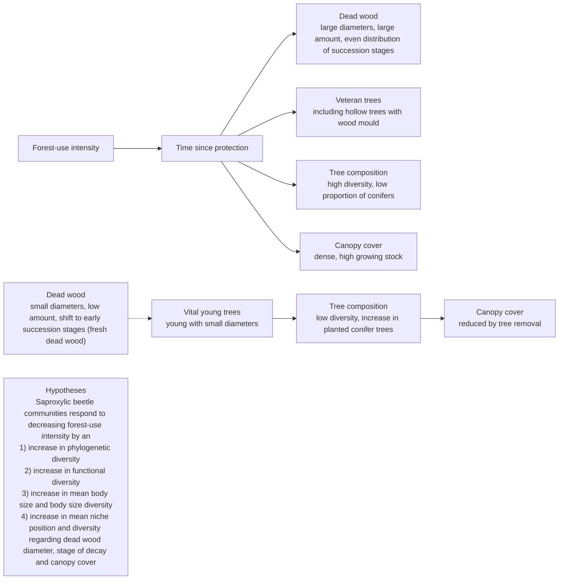

<!-- page 1 of 10 -->

Conservation Biology

Check for updates C

Contributed Paper

# Current Near-to-Nature Forest Management Effects on Functional Trait Composition of Saproxylic Beetles in Beech Forests

MARTIN M. GOSSNER,∗ ∗∗∗ THIBAULT LACHAT,† JORG BRUNET,‡ GUNNAR ISACSSON,§ ¨ CHRISTOPHE BOUGET,∗∗ HERVE BRUSTEL,†† ROLAND BRANDL,‡‡ WOLFGANG W. WEISSER, ´ AND JORG M ¨ ULLER ¨ ∗§§

∗Terrestrial Ecology, Department of Ecology and Ecosystem Management, Technische Universität Munchen, Hans-Carl-von-Carlowitz- ¨ Platz 2, 85354 Freising-Weihenstephan, Germany
†Swiss Federal Institute for Forest, Snow and Landscape Research WSL, Zurcherstrasse 111, 8903 Birmensdorf, Switzerland ¨
‡Swedish University of Agricultural Sciences, Southern Swedish Forest Research Centre, Alnarp, Sweden
§Swedish Forest Agency, P.O. Box 63, SE-281 21 Hässleholm, Sweden
∗∗National Research Institute of Science and Technology for Environment and Agriculture (Irstea), Domaine des Barres, Nogent-sur-Vernisson, France
††Universite de Toulouse, Ecole d’Ing ´ enieurs de Purpan, UMR 1201 Dynafor, 31076 Toulouse Cedex 3, France ´
‡‡Department of Animal Ecology, Faculty of Biology, Philipps-Universität Marburg, Karl-von-Frisch-Str. 8, 35032 Marburg, Germany
§§Bavarian Forest National Park, Freyunger Str. 2, 94481 Grafenau, Germany

**Abstract:** With the aim of wood production with negligible negative effects on biodiversity and ecosystem processes, a silvicultural practice of selective logging with natural regeneration has been implemented in European beech forests (Fagus sylvatica) during the last decades. Despite this near-to-nature strategy, species richness of various taxa is lower in these forests than in unmanaged forests. To develop guidelines to minimize the fundamental weaknesses in the current practice, we linked functional traits of saproxylic beetle species to ecosystem characteristics. We used continental-scale data from 8 European countries and regional-scale data from a large forest in southern Germany and forest-stand variables that represented a gradient of intensity of forest use to evaluate the effect of current near-to-nature management strategies on the functional diversity of saproxylic beetles. Forest-stand variables did not have a statistically significant effect on overall functional diversity, but they did significantly affect community mean and diversity of single functional traits. As the amount of dead wood increased the composition of assemblages shifted toward dominance of larger species and species preferring dead wood of large diameter and in advanced stages of decay. The mean amount of dead wood across plots in which most species occurred was from 20 to 60 m3/ha. Species occurring in plots with mean dead wood >60 m3/ha were consistently those inhabiting dead wood of large diameter and in advanced stages of decay. On the basis of our results, to make current wood-production practices in beech forests throughout Europe more conservation oriented (i.e., promoting biodiversity and ecosystem functioning), we recommend increasing the amount of dead wood to >20 m3/ha; not removing dead wood of large diameter (50 cm) and allowing more dead wood in advanced stages of decomposition to develop; and designating strict forest reserves, with their exceptionally high amounts of dead wood, that would serve as refuges for and sources of saproxylic habitat specialists.

**Keywords:** biodiversity, body size, conservation, dead wood, ecosystem functions, functional diversity, niche position, phylogenetic diversity

Efectos Actuales del Manejo Casi Natural de Bosques sobre la Composicion de Atributos Funcionales de Escarabajos ´ Saprox´ılicos en Bosques de Haya

<small>∗∗∗email martin.gossner@tum.de</small>

<small>Paper submitted July 17, 2012; revised manuscript accepted September 30, 2012.</small>

605

Conservation Biology, Volume 27, No. 3, 605–614

C 2013 Society for Conservation Biology

DOI: 10.1111/cobi.12023

<!-- page 2 of 10 -->

606

Functional Diversity of Beetles

**Resumen:** Con el objeto de producir madera con efectos negativos insignificantes sobre la biodiversidad y los procesos del ecosistema, durante las ultimas d ´ écadas se ha implementado una practica silv ´ ´ıcola de tala selectiva con regeneracion natural en bosques europeos de haya (Fagus sylvatica). No obstante esta ´ estrategia casi natural, la riqueza de especies de varios taxa es menor en estos bosques que en bosques no manejados. Para desarrollar directrices para minimizar las debilidades fundamentales en la practica ´ actual, relacionamos atributos funcionales de especies de escarabajos saprox´ılicos con las caracter´ısticas del ecosistema. Utilizamos datos a escala continental de 8 pa´ıses europeos y datos a escala regional de un bosque extenso en el sur de Alemania y variables de bosques que representaron un gradiente de intensidad del uso de bosques para evaluar el efecto de las estrategias de manejo casi naturales sobre la diversidad funcional de los escarabajos saprox´ılicos. Las variables de bosques no tuvieron un efecto significativo sobre la diversidad funcional total, pero afectaron significativamente la media y diversidad de atributos funcionales individuales. A medida que incremento la cantidad de madera muerta, la composici ´ on de los ensambles cambi ´ o hacia ´ dominancia de especies mayores y de especies que prefieren madera muerta de mayor diametro y con estadios ´ avanzados de descomposicion. La cantidad promedio de madera muerta en las parcelas en donde ocurri ´ o la ´ mayor parte de las especies fue de 20 – 60 m3/ha, Las especies que ocurrieron en parcelas con un promedio de madera muerta >60 m3/ha consistentemente fueron las que habitan en madera muerta de diametro ´ grande y con estadios avanzados de descomposicion. Con base en nuestros resultados, para que las pr ´ acticas ´ de produccion de madera en bosques de haya en Europa est ´ an m ´ as orientadas a la conservaci ´ on (i.e., ´ promuevan el funcionamiento de la biodiversidad y del ecosistema), recomendamos incrementar la cantidad de madera muerta a >20 m3/ha; no remover la madera muerta de diametro mayor a 50 cm y permitiendo ´ mas madera muerta en etapas de descomposici ´ on avanzadas; y dise ´ nar reservas forestales estrictas, con sus ˜ cantidades de madera muerta excepcionalmente altas, que podr´ıan funcionar como refugios para y como fuentes de especialistas de habitats saprox ´ ´ılicos.

**Palabras Clave:** Biodiversidad, conservacion, diversidad filogen ´ etica, diversidad funcional, funciones del eco- ´ sistema, posicion de nicho, tama ´ no corporal ˜

## Introduction

In Europe, modern forestry has substantially changed the species and age composition of forest fragments over the last 200 years, and extinctions of forest species have been documented (Speight 1989). To protect and promote biodiversity and ecosystem functions, forest authorities in Europe developed near-to-nature strategies to mitigate negative effects of logging, and these strategies are used widely throughout the world, although not necessarily commonly (Hunter & Schmiegelow 2010). One such strategy was established in the 1980s for the most widespread natural ecosystem type in Europe, beech (Fagus sylvatica) forest (Brunet et al. 2010). Near-to-nature forestry entails selective cutting, promoting native tree communities, and allowing natural regeneration (Johann 2006; Boncina 2011).

A combination of selective cutting in mature beech stands, with its shade tolerant trees, and natural regeneration is presumed to mimic the natural structure and regeneration process of old-growth beech forests. Despite such practices, forest authorities still must focus on wood production. Therefore, they regularly remove old and senescent trees (the so-called veteran trees), substantially reduce the amount of dead wood, and plant economically valuable conifers (Bauhus et al. 2009; Brunet et al. 2010) (Fig. 1). Logging generally reduces canopy cover and changes soil properties (Christensen et al. 2005; Durak 2010) (Fig. 1). These changes affect structural characteristics and key ecological processes in beech forests (Merino et al. 2008; Meyer & Schmidt 2011). Forest variables, such

as amount of dead wood and occurrence and age of old trees, effectively indicate intensity of forest use, which is more than a simple measure of the amount of wood removed (Bauhus et al. 2009) (Fig. 1).

The recycling of detritus is a key process in forest ecosystems, and it drives element cycling and productivity. Both the quantity and quality of detritus affect the diversity of decomposers and decomposition (Moore et al. 2004); thus, knowledge of the structural diversity of dead wood is needed to understand the effects of forest use on wood decomposition. However, it is difficult to measure the complex diversity of dead wood. Saproxylic beetles are, along with fungi, reliable indicators of many aspects of dead-wood ecology (Stokland et al. 2012). These beetles promote decomposition through mutualisms with fungi or microorganisms and by creating entry ports (Stokland et al. 2012). As bioengineers, some of them generate resources for other organisms and thus promote biodiversity and influence ecosystem functions (Zhou et al. 2006; Buse et al. 2008; Muller et al. 2008 ¨ a). For the most part, however, these important functional roles of saproxylic beetles have been ignored and research has focused on the correlation of their species richness to intensity of forest use.

If the focus were to shift from single species to species assemblages, functional diversity would become a critical parameter to evaluate (Pielou 1966) because it can be used to study the functional role of assemblages, functional redundancy, and the consequences of species loss in ecosystems (Petchey & Gaston 2006). Functional diversity is linked to phenotype and therefore species’ traits

Conservation Biology

Volume 27, No. 3, 2013

15231739, 2013, 3, Downloaded from https://conbio.onlinelibrary.wiley.com/doi/10.1111/cobi.12023 by Faculdade Medicina De Lisboa, Wiley Online Library on [31/10/2025]. See the Terms and Conditions (https://onlinelibrary.wiley.com/terms-and-conditions) on Wiley Online Library for rules of use; OA articles are governed by the applicable Creative Commons License

<!-- page 3 of 10 -->

Gossner et al.

607

flowchart

Figure 1. Conceptual framework showing the assumption of how intensity of logging with near-to-nature silvicultural practices in European beech forests may affect forest stand structures and the predicted shifts in functional trait composition of saproxylic beetle assemblages.

(Tilman 2001). One can analyze the change in functional diversity along climate or land-use gradients and correlate functional diversity to ecosystem processes (Cadotte et al. 2011; Ding et al. 2012). In the context of exploring the effects of land use, analyzing functional diversity may provide information on the suitability of saproxylic beetles as bioindicators, a possibility almost unmentioned in the existing literature. Most traits do not vary randomly across species; rather, they are correlated to evolutionary relatedness. Therefore, phylogenetic diversity is often used as a surrogate of functional diversity (Ding et al. 2012).

In managed beech forests, various taxonomic groups, particularly saproxylics, are lower in species richness and diversity and undergo considerable species turnover relative to species in unmanaged forests (Muller et al. 2008 ¨ b; Brunet et al. 2010; Lassauce et al. 2011). Even the near-to-nature forestry practices applied in beech forests reduce the amount and diameter of dead wood, amount of dead wood in later stages of decay, and number of veteran trees (Fig. 1). These structural changes may lead to shifts in the trait composition of saproxylic species assemblages, in particular traits associated with species’ preferred diameter and decay stage of dead wood. These traits are linked to feeding strategies, life-cycle duration, and contribution of assemblages to wood decay (Stokland et al. 2012). Reduced habitat availability and diversity may shift the mean trait composition of assemblages toward species that prefer dead wood of smaller diameter and earlier decay stages and reduce single-trait diversity (i.e., habitat

niche positions: dead-wood diameter, decay stage, and sun exposure). Body size is another functionally meaningful trait. The life cycle, especially the duration of larval development, of large-bodied beetles is relatively long; thus, these species rely on large pieces of dead wood because they provide a more stable environment (Foit 2010). Overall, reduced structural diversity of dead wood and increased intensity of forest use may lead to a decrease in functional and phylogenetic diversity (Bishop et al. 2009).

We investigated the effects of forest-use intensity on the occurrence of saproxylic beetle species and the composition of their assemblages with respect to their traits (body size and habitat niche positions). We used data from both a continental and a regional scale to test our hypotheses that less intense forestry practices result in higher phylogenetic and functional diversity; larger mean body size and body-size diversity; higher occurrence of species that prefer dead wood of large diameter and in advanced stages of decomposition and forests with closed canopies; and higher single-trait diversity with regard to habitat preferences (Fig. 1).

## Methods

## Study Areas and Sites

We used 2 data sets in our study: a European-wide data set of standardized trap samples (Muller et al. 2012) and ¨ regional data from intensive sampling in one beech forest of the Steigerwald in southern Germany. The latter data set was collected within a 15 × 15 km2 forest area that spanned a gradient of forest use from intensively managed forests to strict forest reserves (Muller et al. 2008 ¨ b) (Table 1). The data set from 8 European countries covered 75% of the distributional range of European Beech, from the Carpathians in the east to the Pyrenees in the west and north up to Sweden. We expanded the data set described by Muller et al. (2012) by 17 stands ¨ (41 sampling traps) in 3 regions of Germany, Schwäbische Alb, the Hainich-Dun, and the Schorfheide- ¨ Chorin.

## Beetle-Assemblage Data

Beetles were sampled with flight-interception traps placed 1.5 m above the ground during the growing season (mountains, May–September; lowlands, April–October) (Muller et al. 2012). The European data set consisted of ¨ samples of 1156 traps from 242 forest stands in 79 forest sites. The regional data were gathered from 69 circular plots of 0.1 ha that were separated by at least 100 m. There, an entomologist also used beating, sieving, and bark-peeling techniques on dead wood structures and visual inspection of trees and inflorescences to sample

Conservation Biology Volume 27, No. 3, 2013

15231739, 2013, 3, Downloaded from https://conbio.onlinelibrary.wiley.com/doi/10.1111/cobi.12023 by Faculdade Medicina De Lisboa, Wiley Online Library on [31/10/2025]. See the Terms and Conditions (https://onlinelibrary.wiley.com/terms-and-conditions) on Wiley Online Library for rules of use; OA articles are governed by the applicable Creative Commons License

<!-- page 4 of 10 -->

608

Functional Diversity of Beetles

Table 1. Predictor variables and information on the measurement units used in models of the Europe-wide and regional data sets of saproxylic beetles (details in Supporting Information).

<table><tr><td>Variable type</td><td>Variable</td><td>Europe</td><td>Regional (Steigerwald)</td></tr><tr><td rowspan="2">Geographical</td><td>Latitude</td><td>Northing (ETRS.  $1989^a$  LAEA  $projection^b$ )</td><td>-</td></tr><tr><td>Longitude</td><td>Easting (ETRS.  $1989^a$  LAEA  $projection^b$ )</td><td>-</td></tr><tr><td rowspan="3">Landscape (3-km radius)</td><td>Forest area</td><td> $CORINE^c$  types 311, 312, 313 (%)</td><td>-</td></tr><tr><td>Broad-leaf trees</td><td> $CORINE^c$  types  $311 + 50\%$  of 313, relative to total forest area (%)</td><td>-</td></tr><tr><td>Urban area</td><td>Proportion of traffic and settlements ( $CORINE^c$  types: 111,112, 141,142) (%)</td><td>-</td></tr><tr><td rowspan="2">Local climate (1-km radius)</td><td>Temperature</td><td>WorldClim Bio10, mean temperature of the warmest quarter (°C)</td><td>-</td></tr><tr><td>Precipitation</td><td>WorldClim Bio18; precipitation of the warmest quarter (mm)</td><td>-</td></tr><tr><td rowspan="5">Forest stand (1-ha surrounding)</td><td>Protection</td><td>Time since protection (years)</td><td>Yes/no</td></tr><tr><td>Veteran trees</td><td>Occurrence of trees &gt; 250 years (yes/no)</td><td>Age of oldest tree</td></tr><tr><td>Dead wood</td><td>Amount in 3 categories: low ( $0-29 \text{ m}^3 \text{ ha}^{-1}$ ), medium ( $30-70 \text{ m}^3 \text{ ha}^{-1}$ ), high ( $>70 \text{ m}^3 \text{ ha}^{-1}$ )</td><td>Amount  $\log(\text{m}^3 \text{ ha}^{-1})$ </td></tr><tr><td>Tree diversity</td><td>Number of tree genera</td><td rowspan="2">Number of tree genera (%)</td></tr><tr><td>Conifers</td><td>Occurrence (yes/no)</td></tr></table>

Abbreviations: aERTS, European Terrestrial Reference System; bLAEA, Lambert azimuthal equal-area projection; cCORINE, Pan-European project CORINE Land Cover (CLC) (CORINE 2006).

beetles in each plot. This additional sampling was performed in spring, summer, and fall over 2 weeks in each season for 1 h on each plot. All sampled individuals in both data sets were identified to species, except Staphylinidae and Pselaphidae in France. We omitted these families from analyses on the European scale. We classified beetles as saproxylic following reference lists from Germany cited in Muller et al. (2012). ¨

## Environmental Data

For the European-wide data set, we used variables that characterized geography, landscape, local climate, and forest stands as predictors of certain characteristics of the beetle assemblages (Table 1). For the regional data set, we used only forest-stand variables because the climate and landscape were similar among all plots.

We selected the forest-stand variables to represent a gradient of intensity of forest use (Fig. 1). On the basis of differences in the structure of the 2 data sets, it was not always possible to extract data on the same foreststand variables for subsequent analyses. Nevertheless, we attempted to use variables that had at least the same ecological meaning. As a descriptor of the protection status on the European-wide scale, we used time since protection because the protected areas were set aside up to 80 years ago. On the regional scale, all protected areas were set aside about 40 years ago; thus, we considered protection on a nominal scale (yes or no). For European data, the variable veteran trees describe the presence or absence of trees older than 250 years. For regional scale, we used the age of the oldest tree in a particular stand. We classified the amount of dead wood

as low $(0-29\  m ^3/ ha )$ , medium $(30 - 70\ m^{3}/ha)$ , and high $(>70\;\mathrm{m}^{3}/\mathrm{ha})$ for European data and as an absolute amount of dead wood for regional data. For both data sets, we measured tree diversity as the number of tree genera in a particular stand. Data on the proportion of conifers were not available for all forests. Therefore, we used the presence or absence of conifers as a categorical variable for the European data and the percentage of conifers as a continuous variable for the regional data (Table 1).

We used latitude and longitude as geographic variables. We estimated landscape characteristics in 3-km radius around the center of each stand primarily on the basis of data provided by CORINE (2006), a European-wide project mapping land use across most European countries. We extracted climate variables from WorldClim (resolution of 30 s) and calculated mean values in a 1- km radius to minimize bias introduced by rough terrain.

## Trait Characterization

We compiled information on 4 ecological traits for each species (Supporting Information): mean body size, diameter of dead wood in which a species was recorded, decay stage of the dead wood, and canopy cover of forests in which the species is known to occur. In his compilation, Moller (2009) provides semiquantitative in- ¨ formation on diameter, decay stage, and canopy cover across categories. We first extracted the occurrence of species across the following categories (axes): (1) diameter: <15 cm, 15–35 cm, >35 cm, and >70 cm; (2) decay stage: 0, alive; 1, freshly dead (1–2 years); 2, initiated decomposition (loose bark, tough sapwood); 3, advanced

Conservation Biology

Volume 27, No. 3, 2013

15231739, 2013, 3, Downloaded from https://conbio.onlinelibrary.wiley.com/doi/10.1111/cobi.12023 by Faculdade Medicina De Lisboa, Wiley Online Library on [31/10/2025]. See the Terms and Conditions (https://onlinelibrary.wiley.com/terms-and-conditions) on Wiley Online Library for rules of use; OA articles are governed by the applicable Creative Commons License

<!-- page 5 of 10 -->

Gossner et al.

609

decomposition (soft sapwood, partly tough hardwood); and 4, extremely decomposed and moldered; and (3) canopy cover: open, semiopen, and closed. Then, we estimated niche positions for each beetle species along these 3 axes on the basis of occurrence of species across these categories and weighting scores (0.5, very rarely used; 1, rarely used; 2, commonly used; 3, preferred; see Supporting Information for an example.

## Phylogeny

We constructed an approximate phylogeny of all sampled beetles to control for the relation between species in trait–environment correlations and to calculate phylo genetic diversity of assemblages. The current phylogeny of beetles is still under debate (Lawrence et al. 2011). Therefore, we used the genetic phylogeny provided by Hunt et al. (2007) as our base topology. We expanded this tree on the basis of phylogenetic relations of several subgroups and additional information from taxonomic classifications (for more details, see S4 and Fig. S4-1) to construct the tree topology. The final tree was calibrated with 24 calibration points from fossil records (Supporting Information) with the function bladj in the program phylocom. The resulting tree had branch lengths of millions of years (Webb et al. 2008).

## Data Analyses

To visualize the occurrence of saproxylic beetle species along gradients characterizing forest-use intensity in beech forests, we considered the first 2 axes of a canonical correspondence analysis (CCA) with the variables veteran trees, dead wood, tree diversity, and conifers available for both data sets. All these variables characterize aspects of forest-use intensity (Fig. 1). To evaluate which particular trait makes species susceptible to forest-use intensity, we modeled the positions of species along the axes versus their body size and their niche positions (regarding dead-wood diameter and decay stage, and canopy cover). In such an analysis, data points (species) may not be independent, which inflates the degrees of freedom (Garland et al. 1992). Therefore, we constructed a linear generalized least-squares model (GLS) with a correlation structure derived from our phylogenetic tree constructed using Pagel’s λ (Pagel 1999). Pagel’s λ is the degree of phylogenetic constraints from 0 (not constrained) to 1 (fully constrained) and was estimated by maximizing the likelihood of the model (Freckleton et al. 2002).

In a second approach, we characterized assemblages of saproxylic beetles to test our predictions (Fig. 1). We calculated the following characteristics on the basis of presence and absence data because the mass occurrence of a single species in some traps may bias the results. The phylogenetic diversity, based on the patristic distances extracted from the phylogeny, was calculated as the

effect size of the mean phylogenetic distance between co-occurring saproxylic species within each assemblage with the function ses.mpd in the add-on package picante. We calculated effect size on the basis of a null model with 999 randomizations by reshuffling the tip labels to achieve independence from species numbers (Webb et al. 2002). This null model retained the structure of the assemblage matrix of beetles and tested whether the phylogenetic composition of species within assemblages was random with respect to the phylogeny. Values >0 indicated overdispersion; values <0 indicated clumping (Pausas & Verdu 2010). Following the same procedure, we calculated the functional diversity as effect size on the basis of an Euclidian distance matrix created with standardized values of the 4 selected ecological traits. Additionally, we calculated the diversity values for each of these traits (hereafter body-size diversity, diameter diversity, decay diversity, and canopy diversity) and the mean values of all 4 traits of the assemblages (hereafter mean body size, etc.). The latter characterize the average of the trait space of the assemblages; the former characterize the dispersion around the average.

To test for effects of environmental variables on characteristics of saproxylic beetle assemblages, we used generalized linear mixed-effect models (lmer) with forest stand as a random factor to account for pseudoreplications on the European scale. On the regional scale, the residuals of multiple linear models were tested for spatial independence (Supporting Information).

## Results

Across both data sets, we recorded 752 saproxylic species. The Europen data set contained records of 456,638 individuals of 709 saproxylic beetle species (excluding Staphylinidae and Pselaphidae). The range of species caught per trap was 1–111. The regional data set contained records of 9303 individuals of 284 saproxylic beetle species, and the range of species richness was 11–48 species/plot.

In both data sets, the composition of the saproxylic beetle assemblages was most associated with 2 main gradients: a conifer axis and a dead-wood and veteran-tree axis (Fig. 2). We modeled the position of species along these 2 axes. For European data, the dead-wood diameter niche was significantly correlated with both of these ordination axes (λ 0.1–0.2) (Table 2). For regional data, decay niche was significantly correlated with the dead wood and veteran tree axis. In both models, the phylogenetic constraint was low (Table 2). Although not significant in our GLS, the diameter niche was correlated in univariate models with the dead-wood axis for regional data (Supporting Information). Furthermore, diameter niche and decay niche were significantly correlated (λ = 0.83, p < 0.001, R2 = 0.246).

Conservation Biology Volume 27, No. 3, 2013

15231739, 2013, 3, Downloaded from https://conbio.onlinelibrary.wiley.com/doi/10.1111/cobi.12023 by Faculdade Medicina De Lisboa, Wiley Online Library on [31/10/2025]. See the Terms and Conditions (https://onlinelibrary.wiley.com/terms-and-conditions) on Wiley Online Library for rules of use; OA articles are governed by the applicable Creative Commons License

<!-- page 6 of 10 -->

610

Functional Diversity of Beetles

| Variable | CCA1 (Species) | CCA2 (Species) |
| --- | --- | --- |
| CO | ~-8.5 | ~0.5 |
| TD | ~-4.5 | ~-1.0 |
| DTW | ~1.5 | ~3.5 |
| DT | ~1.5 | ~4.0 |
| VT | ~2.0 | ~7.5 |

Figure 2. Ordination plot resulting from canonical correspondence analysis of saproxylic beetles caught in 1156 flight-interception traps throughout Europe (large plot) and on 69 plots in the Steigerwald (regional scale) (small plot). Circles show the position of saproxylic beetle species (Europe 709 species, regional 284 species) relative to 4 forest-stand variables (VT, occurrence of veteran trees; DW, amount of dead wood; CO, occurrence of conifers; TD, tree diversity). The figure indicates 2 axes: conifer axis (European scale, CCA1, eigenvalue 0.128; regional scale, CCA2, eigenvalue 0.156) and a dead-wood and veteran-tree axis (European scale, CCA2, eigenvalue 0.084; regional scale, CCA1, eigenvalue 0.209).

The large effect of dead wood on the functional composition of saproxylic beetle assemblages was further illustrated by the traits of species that were positively correlated with the dead wood and veteran tree axis of the CCA for both data sets (especially diameter and decay niches [Supporting Information]). For none of the species the mean amount of dead wood across

plots in which it occurred was ${ < } 1 0 ~ \mathrm { m } ^ { 3 } / \mathrm { h a } ,$ although plots with such a low amount of dead wood were sampled (Fig. 3). The majority of species occurred on average in plots with an amount of dead wood of 20–60 m3/ha. Most species occurring on average on plots with an amount of dead wood $\text { > } 6 0 \text { m } ^ { 3 } / \text { h a }$ required dead wood of large diameter (approximately 50 cm) (Fig. 3) and in the late stages of decay. These species were either small or large.

Variables that characterized geography, landscape, and local climate affected saproxylic beetle assemblages in the European data set (symbols outside the confidence interval in Fig. 4; see also Supporting Information). When we controlled for these variables and compared the European results with the regional results, we found no support for our prediction that a decreasing intensity of forest use, as represented by the stand variables, results in increasing phylogenetic and functional diversity (Fig. 4 & Supporting Information).

In contrast, the analyses of single traits (Fig. 4 & Supporting Information) showed that the amount of dead wood was the forest-stand variable with the greatest effect on functional composition of saproxylic beetles independent of species richness. This result was highly consistent in both data sets. In line with our predictions, for both data sets, the mean body size (which did not increase with sample size [Supporting Information]), body-size diversity, and mean diameter increased significantly as the amount of dead wood increased. For the regional data set, the mean decay increased significantly as the amount of dead wood increased. In contrast to our predictions, for both data sets diameter diversity decreased as the amount of dead wood increased (Fig. 4 & Supporting Information). The increase in mean body size, body-size diversity, and mean diameter indicated that both large and small species preferring dead wood of large diameter occurred on plots with a large amount of dead wood (Supporting

Table 2. Results of a linear model of the relation of the canonical correspondence analysis (CCA) axis positions to body size, and the niche positions (dead-wood diameter, dead-wood decay stage, and canopy cover).a

<table><tr><td colspan="5">Europe-wide scale</td><td colspan="5">Regional scale</td></tr><tr><td rowspan="2">Trait</td><td colspan="2">conifer axis $CCA1 R^2 = 0.023, \lambda = 0.182$ </td><td colspan="2">dead wood/veteran tree axis CCA2 $R^2 = 0.067, \lambda = 0.099$ </td><td colspan="2">dead wood/veteran tree axis CCA1 $R^2 = 0.118, \lambda = -0.030$ </td><td colspan="2">conifer axis $CCA2 R^2 = 0.002, \lambda = 0.011$ </td><td rowspan="2">Trait mean(range)</td></tr><tr><td>estimate</td><td>P</td><td>estimate</td><td>p</td><td>estimate</td><td>p</td><td>estimate</td><td>p</td></tr><tr><td>Intercept</td><td>-0.302</td><td>0.303</td><td>-0.034</td><td>0.898</td><td>0.089</td><td>&lt; 0.001</td><td>0.149</td><td>0.275</td><td></td></tr><tr><td>Body size</td><td>-0.100</td><td>0.273</td><td>0.133</td><td>0.191</td><td>-0.117</td><td>0.172</td><td>-0.043</td><td>0.706</td><td>4.97(0.5-50 mm)</td></tr><tr><td>Diameter</td><td>0.262</td><td> $0.004^b$ </td><td>0.541</td><td> $<0.001^b$ </td><td>0.127</td><td>0.222</td><td>-0.059</td><td>0.652</td><td>2.35 (1-4)</td></tr><tr><td>Decay</td><td>0.116</td><td>0.263</td><td>0.131</td><td>0.265</td><td>0.462</td><td> $<0.001^b$ </td><td>0.011</td><td>0.938</td><td>2.99 (1-5)</td></tr><tr><td>Canopy cover</td><td>-0.014</td><td>0.846</td><td>0.012</td><td>0.892</td><td>&lt; -0.001</td><td>0.998</td><td>-0.004</td><td>0.976</td><td>1.71 (1-3)</td></tr></table>

aGeneralized least squares with a correlation structure derived from the phylogenetic tree of all sampled beetle species (752 species, see Supporting Information). We used Pagel’s λ (Pagel 1999) to correct for phylogenetic relatedness. Pagel’s λ was optimized by selecting the model maximizing the likelihood (Freckleton et al. 2002). Pagel’s λ indicates the degree of phylogenetic constraints from 0 (not constrained) to 1 (fully constrained). bSignificant at $p < 0 . 0 5 .$

Conservation Biology Volume 27, No. 3, 2013

15231739, 2013, 3, Downloaded from https://conbio.onlinelibrary.wiley.com/doi/10.1111/cobi.12023 by Faculdade Medicina De Lisboa, Wiley Online Library on [31/10/2025]. See the Terms and Conditions (https://onlinelibrary.wiley.com/terms-and-conditions) on Wiley Online Library for rules of use; OA articles are governed by the applicable Creative Commons License

<!-- page 7 of 10 -->

Gossner et al.

611

| Variable | Mean dead-wood amount \((m^{3}/ha)\) (range) | Value (range) |
| --- | --- | --- |
| Body size | 10~400 | 0~25 |
| Diameter (cm) | 10~400 | 8~85 |
| Decay stage | 10~400 | 0~3 |

Figure 3. Correlation between traits of saproxylic beetle species and the position of a single species on an axis of the amount of dead wood (measured with high resolution) on the regional scale (Steigerwald) (gray bars, frequency distribution of dead-wood amount). This axis was calculated as the mean value of log-transformed values of dead-wood amount across the plots on which a species occurred. We estimated niche positions for each beetle species along the diameter and decay stage axes (left-hand axis) on the basis of occurrence of species across categories known from literature (diameter: <15 cm, 15–35 cm, >35 cm, and >70 cm; decay stage: 0, alive; 1, freshly dead [1–2 years]; 2, initiated decomposition [loose bark, tough sapwood]; 3, advanced decomposition [soft sapwood, partly tough hardwood]; and 4 [extremely decomposed and moldered]) and weighting scores (0.5, very rarely used; 1, rarely used; 2, commonly used; 3, preferred). For illustration, the scales of the original classification of dead-wood diameter niche and dead-wood decay-stage niche are on the right-hand axis. All species that were sampled on at least 3 plots were included (n = 149 species).

Information). Thus, along the gradient of decreasing intensity of forest use, the number of large species increased and turnover of smaller species occurred.

## Discussion

Results of previous studies show that the amount of dead wood affects species richness of saproxylic beetles (Grove 2002; Muller & B ¨ utler 2010; Lassauce et al. 2011). ¨ We demonstrated for the first time that irrespective of the geographic scale and species richness, the amount of

dead wood (particularly of large diameter and in a late stage of decay stages) is an important biological legacy (i.e., a feature left after harvest, also, for example, large trees [Franklin et al. 2007]) that influence the functional composition of saproxylic beetles in beech forests. Therefore, the current strategy of wood production in beech forests, which avoids clearcutting and relies on natural regeneration processes but depresses dead wood to low amounts, is insufficient as a conservation-oriented management strategy.

Cross-species analyses are often characterized by large scatter (see $R ^ { 2 }$ values in Table 2). Therefore, we used an assembly-based approach for testing our predictions (Fig. 1). Assembly-based approaches are much more sensitive because they average across minor signals of species (Olalla-Tárraga et al. 2010). Our assembly-based approach based on functional traits revealed that as amount of dead wood increased, large and small species specialized on dead wood of large diameter entered the assemblages. This translated into an increase in bodysize diversity. In contrast, the diversity of the diameter niche decreased as the amount of dead wood increased, which indicates a dominance of species preferring dead wood of large diameter when there is a large amount of dead wood. Body size correlates well with life-history traits (Sibly et al. 2012). Larger species in particular are characterized by a long developmental phase and slow growth rates (Haack & Slansky 1987), which make them dependent on large pieces of dead wood (Brin et al. 2011). Although the volume of branches seems to be sufficient even for large-bodied beetles, the microhabitat requirements of these species may restrict them to large pieces (Stokland et al. 2012). The sensitivity of a few large species to increasing intensity of forest use has been documented (e.g., long-horned beetle [Cerambyx cerdo], a species discussed as an important ecosystem engineer because it produces large galleries) (Buse et al. 2007, 2008).

Our finding of an additional turnover of small-bodied species as the amount of dead wood increased showed that some small species are also specialists on dead wood of large diameter (e.g., Ropalodontus perforatus, Stenichnus godarti). This finding was highlighted by the results of our cross-species analyses, in which species occurring in stands with large amounts of dead wood had high demand for dead wood of large diameters and in late stages of decay (Fig. 3). One may argue that having very high amounts of dead wood would overlook the requirements of species that prefer dead wood of small diameter. However, such species are less susceptible to effects of intensity of forest use and benefit when dead wood is >20 m3/ha (Fig. 3).

Although the traits we studied are currently the best available for examining functional links between assemblages and the environment, our analyses were constrained because these variables are at best surrogates.

Conservation Biology Volume 27, No. 3, 2013

15231739, 2013, 3, Downloaded from https://conbio.onlinelibrary.wiley.com/doi/10.1111/cobi.12023 by Faculdade Medicina De Lisboa, Wiley Online Library on [31/10/2025]. See the Terms and Conditions (https://onlinelibrary.wiley.com/terms-and-conditions) on Wiley Online Library for rules of use; OA articles are governed by the applicable Creative Commons License

<!-- page 8 of 10 -->

612

Functional Diversity of Beetles

| Category | PhyI Div | FuncDiv | Body size | Diameter | Decay | Canopy |
| :--- | :--- | :--- | :--- | :--- | :--- | :--- |
| Geography::Latitude | ~2.5 | ~-1.5 | ~-1.5 | ~4.5 | ~2.0 | ~3.5 |
| Geography::Longitude | ~2.5 | ~3.5 | ~2.0 | ~3.0 | ~3.0 | ~4.5 |
| Landscape::Forest area | ~-2.5 | ~-1.5 | ~-1.5 | ~-1.5 | ~-1.5 | ~-1.5 |
| Landscape::Broad-leaf trees | ~2.5 | ~-1.5 | ~-1.5 | ~-1.5 | ~-1.5 | ~3.0 |
| Landscape::Urban area | ~-2.5 | ~-3.5 | ~-2.0 | ~-1.5 | ~-1.5 | ~-1.5 |
| Local climate::Temperature | ~2.5 | ~-1.5 | ~-1.5 | ~-1.5 | ~-1.5 | ~-3.0 |
| Local climate::Precipitation | ~2.5 | ~-1.5 | ~-1.5 | ~-1.5 | ~-1.5 | ~-1.5 |
| Forest stand::Protection | ~1.0 | ~-1.5 | ~-1.5 | ~-1.5 | ~-1.5 | ~-1.5 |
| Forest stand::Veteran trees | ~1.0 | ~-1.5 | ~-1.5 | ~-1.5 | ~-1.5 | ~-1.5 |
| Forest stand::Dead wood | ~2.0 | ~-1.5 | ~-1.5 | ~-1.5 | ~-1.5 | ~-1.5 |
| Forest stand::Tree diversity | ~1.5 | ~-1.5 | ~-1.5 | ~-1.5 | ~-1.5 | ~-1.5 |
| Forest stand::Conifers | ~-2.0 | ~-1.5 | ~-1.5 | ~-1.5 | ~-1.5 | ~-1.5 |

Figure 4. Results of linear regression analyses of effects of predictor variables (geographic, landscape, regional climate [Europe-wide scale only], forest stand variables) on the functional composition of saproxylic beetle assemblages (effect sizes of phylogenetic diversity [PhylDiv] and functional diversity [FuncDiv], and single traits) fitted by the linear model function (lm) (regional scale, white symbols) and a linear mixed-effect model (lmer) with forest stand as a random factor (European scale, grey symbols). Single traits are the mean values and effect sizes of diversity (measured as dispersion with null models with 999 randomizations) of body size and dead-wood niche characteristics (diameter, decay, canopy cover). Analysis on the regional scale is based on the complete data set. Shaded areas indicate range of nonsignificant values (t values: European ±1.998; regional ±1.960). For detailed values, see Supporting Information.

One major future challenge is to collect more information on the biology of these species. For example, in a recent study, gut analysis of well-known species presumed to be predators revealed that fungi are a major food (Prikryl et al. 2012). Gut or stable-isotope analyses are promising tools for estimating the trophic niche of saproxylics more precisely (Bluthgen et al. 2003). ¨

In our analysis, phylogenetic diversity was not affected by forest-stand variables, which we used as surrogates for intensity of forest use. As species richness decreased with increasing intensity of forest use, species losses along this gradient occurred randomly across the phylogeny. Therefore, analyses of phylogenetic diversity do not seem to be a promising method for studying the assemblages of saproxylic beetles. Similarly, functional diversity seemed unaffected by forest-stand variables, even though single traits were affected. These results suggest that measures of functional diversity that combine several traits may mask important ecological effects, just as a pure diversity index may neglect the identity of species (Fleishman et al. 2006).

Veteran trees provided a higher diversity of decay niches only for the European data. On the one hand, this is consistent with previous findings that such trees provide resources for species of a broad range of successional stages (Speight 1989). On the other hand, in our assembly approach, one must keep in mind that only a

few of the species within the hyperdiverse community of saproxylic beetles are restricted to hollow veteran trees. Most of the saproxylic beetles living in veteran trees also develop in logs or snags (Speight 1989). In addition, the resolution of our measurement of veteran trees was low.

Although we did not find a strong effect of time since protection, in contrast to the findings of recent Europeanwide meta-analyses (Paillet et al. 2010), our data showed that most biological legacies increased as time since protection increased (e.g., dead wood and protection, r = 0.47) (Fig. 1). This indicates that the availability of resources is more important than protection only or time since protection and high amounts of dead wood are found mostly in strictly protected forests (Paillet et al. 2010). Furthermore, we assumed that the distribution of species across the sampled plots was in equilibrium with respect to the environmental variables. The low importance of time since protection indicated that equilibrium with respect to trait composition was reached within a very short time.

To what extent are our results for saproxylic beetle species and beech forests transferable to other taxa or ecosystems? In European forests, species richness of saproxylic beetles is correlated with species richness of other taxonomic groups (Paillet et al. 2010), such as wood-inhabiting fungi, which exhibit a similar diversity in how they use dead wood as a habitat and nutrient source,

Conservation Biology

Volume 27, No. 3, 2013

15231739, 2013, 3, Downloaded from https://conbio.onlinelibrary.wiley.com/doi/10.1111/cobi.12023 by Faculdade Medicina De Lisboa, Wiley Online Library on [31/10/2025]. See the Terms and Conditions (https://onlinelibrary.wiley.com/terms-and-conditions) on Wiley Online Library for rules of use; OA articles are governed by the applicable Creative Commons License

<!-- page 9 of 10 -->

Gossner et al.

613

and carabid beetles, bryophytes, and lichens, which use dead wood for colonization or shelter. Due to the increase in habitat diversity as the amount of dead wood increases (Muller & B ¨ utler 2010), we expect the functional-trait ¨ composition of these groups in temperate forests will also change as the amount of dead wood changes (Heilmann-Clausen & Christensen 2004; Stokland et al. 2012). The transferability of our results from European beech forests to other biomes or ecosystems may be more complicated. Beech forests are shady and characterized by gap regeneration. In forests characterized by more open canopies, the patterns of traits and forest-stand variables may differ, in particular in boreal forests, which are dominated by conifers and regularly suffer stand-replacing disturbances such as fire. Thus, species richness (Lassauce et al. 2011) and trait characteristics of saproxylic beetles may respond differently to intensity of forest use in boreal forests.

Our most important conclusion is that the composition of saproxylic beetle assemblages along a gradient of increasing amount of dead wood affected not only species richness, but also the functional composition of assemblages. What does this mean, other than more dead wood should be left in the forest? Analyses of the functional traits illuminated the qualitative weakness of current forestry practices—not only is a higher amount of dead wood needed, but more dead wood of large diameter and in advanced stages of decay is needed. This underlines the value of functional traits as indicators of structures or processes of ecosystems that are difficult to measure. Furthermore, our functional approach leads to useful recommendations for improving the cost-effectiveness and conservation value of current silvicultural practices in European beech forests: (1) increase the amount of dead wood in managed stands from the current $5-10\; m ^3/ h  a ^{-1}$ to $\mathrm{>20~m^{3}/ha^{-1}}$ , (2) because economic pressures often preclude the accumulation of higher amounts of dead wood, forest managers should in particular conserve dead wood of large diameter (approximately 50 cm) and allow more dead wood in advanced stages of decomposition to develop, and (3) designate strict forest reserves—the only area in which high amounts of dead wood $\scriptstyle ( > 6 0   \mathbf { m } ^ { 3 }$ ha $^ { - 1 } )$ can accumulate to create refuges and source pools for habitat specialists. We suggest expansion of rules of thumb to more quantitative recommendations for deadwood management that balance the trade-off between economy and ecology in managed forests.

## Acknowledgments

We thank F. Kohler, H. Bussler, U. Bense, T. Blick, W. ¨ Dorow, U. Schulte, U. Gehlhar, P. Balcar, K. Vanderkerkhove, D. Murat, M. K. Obrist, K. Schiegg-Pasinelli, V. Chumak, A. Brin, Y. Paillet, F. Gosselin, T. Noblecourt, B. Nusillard, and L. Valladares for providing data. We are

grateful to K. A. Brune for linguistic revision. Comprehensive data from 3 regions in Germany were gathered within the German Research Foundation Priority Program 1374 Infrastructure-Biodiversity-Exploratories (WE 3018/9-1). This study was financially supported by the German Federal Agency for Nature Conservation.

## Supporting Information

Tests for spatial independence (Appendix S1), climate and landscape variables (Appendix S2), species list and traits (Appendix S3), species’ phylogenies (Appendix S4), relation of body size and niche positions of species to intensity of forest use (Appendix S5), results of linearregression analyses (Appendix S6), correlation of individuals and mean body size (Appendix S7), correlation of effect sizes of single traits (Appendix S8), correlation of amount of dead wood and mean body size and niche positions (Appendix S9), correlation of amount of dead wood and maximum diameter (Appendix S10), and Supporting Information references (Appendix S11) are available online. The authors are solely responsible for the content and functionality of these materials. Queries (other than absence of the material) should be directed to the corresponding author.

## Literature Cited

- Bauhus, J., K. Puettmann, and C. Messier. 2009. Silviculture for oldgrowth attributes. Forest Ecology and Management 258:525–537.
- Bishop, D. J., C. G. Majka, S. Bondrup-Nielsen, and S. B. Peck. 2009. Deadwood and saproxylic beetle diversity in naturally disturbed and managed spruce forests in Nova Scotia. Zookeys 22: Special Issue 309–340.
- Bluthgen, N., G. Gebauer, and K. Fiedler. 2003. Disentangling a rainfor- ¨ est food web using stable isotopes: dietary diversity in a species-rich ant community. Oecologia 137:426–435.
- Boncina, A. 2011. Conceptual approaches to integrate nature conservation into forest management: a Central European perspective. International Forestry Review 13:13–22.
- Brin, A., C. Bouget, H. Brustel, and H. Jactel. 2011. Diameter of downed woody debris does matter for saproxylic beetle assemblages in temperate oak and pine forests. Journal of Insect Conservation 15:653–669.
- Brunet, J., O. Fritz, and G. Richnau. 2010. Biodiversity in European ¨ beech forests—a review with recommendations for sustainable forest management. Ecological Bulletins 53:77–94.
- Buse, J., T. Ranius, and T. Assmann. 2008. An endangered longhorn beetle associated with old oaks and its possible role as an ecosystem engineer. Conservation Biology 22:329–337.
- Buse, J., B. Schroder, and T. Assmann. 2007. Modelling habitat and spa- ¨ tial distribution of an endangered longhorn beetle—a case study for saproxylic insect conservation. Biological Conservation 137:372–381.
- Cadotte, M. W., K. Carscadden, and N. Mirotchnick. 2011. Beyond species: functional diversity and the maintenance of ecological processes and services. Journal of Applied Ecology 48:1079–1087.

Conservation Biology Volume 27, No. 3, 2013

15231739, 2013, 3, Downloaded from https://conbio.onlinelibrary.wiley.com/doi/10.1111/cobi.12023 by Faculdade Medicina De Lisboa, Wiley Online Library on [31/10/2025]. See the Terms and Conditions (https://onlinelibrary.wiley.com/terms-and-conditions) on Wiley Online Library for rules of use; OA articles are governed by the applicable Creative Commons License

<!-- page 10 of 10 -->

614

Functional Diversity of Beetles

- Christensen, M., et al. 2005. Dead wood in European beech (Fagus sylvatica) forest reserves. Forest Ecology and Management 210:267–282.
- CORINE. 2006. Pan-European project CORINE land cover (CLC). Available from http://www.corine.dfd.dlr.de (accessed January 2012).
- Ding, Y., R. G. Zang, S. G. Letcher, S. R. Liu, and F. L. He. 2012. Disturbance regime changes the trait distribution, phylogenetic structure and community assembly of tropical rain forests. Oikos 121:1263–1270.
- Durak, T. 2010. Long-term trends in vegetation changes of managed versus unmanaged eastern Carpathian beech forests. Forest Ecology and Management 260:1333–1344.
- Fleishman, E., R. F. Noss, and B. R. Noon. 2006. Utility and limitations of species richness metrics for conservation planning. Ecological Indicators 6:543–553.
- Foit, J. 2010. Distribution of early-arriving saproxylic beetles on standing dead Scots pine trees. Agricultural and Forest Entomology 12:133–141.
- Franklin, J. F., R. J. Mitchell, and B. J. Palik. 2007. Natural disturbance and stand development principles for ecological forestry. General technical report NRS-19. U.S. Department of Agriculture, Forest Service, Northern Research Station, Newtown Square, PA.
- Freckleton, R. P., P. H. Harvey, and A. M. Pagel. 2002. Phylogenetic analysis and comparative data: a test and review of evidence. The American Naturalist 160:712–726.
- Garland, T., P. H. Harvey, and A. R. Ives. 1992. Procedures for the analysis of comparative data using phylogenetically independent contrasts. Systematic Biology 41:18–32.
- Grove, S. J. 2002. Saproxylic insect ecology and the sustainable management of forests. Annual Review of Ecology and Systematics 33:1–23.
- Haack, R. A., and F. J. Slansky. 1987. Nutritional ecology of woodfeeding Coleoptera, Lepidoptera and Hymenoptera. Pages 449–486 in F. J. Slansky and J. G. Rodriguez, editors. Nutritional ecology of insects, mites, spiders and related invertebrates. John Wiley & Sons, London.
- Heilmann-Clausen, J., and M. Christensen. 2004. Does size matter? On the importance of various dead wood fractions for fungal diversity in Danish beech forests. Forest Ecology and Management 201:105–117.
- Hunt, T., et al. 2007. A comprehensive phylogeny of beetles reveals the evolutionary origins of a superradiation. Science 318: 1913–1916.
- Hunter, M.L., and F. Schmiegelow. 2010. Wildlife, forests and forestry: principles of managing forests for biological diversity. Prentice Hall, Englewood Cliffs, NJ.
- Johann, E. 2006. Historical development of nature-based forestry in Central Europe. Pages 1–17 in J. Diaci, editor. Nature-based forestry in Central Europe: alternatives to industrial forestry and strict preservation, Ljubljana. Department of Forestry and Renewable Forest Resources, Biotechnical Faculty, Ljubljana, Slovenia.
- Lassauce, A., Y. Paillet, H. Jactel, and C. Bouget. 2011. Deadwood as a surrogate for forest biodiversity: meta-analysis of correlations between deadwood volume and species richness of saproxylic organisms. Ecological Indicators 11:1027–1039.
- Lawrence, J. F., A. Ślipinski, A. E. Seago, M. K. Thayer, A. F. Newton, ´ and A. E. Marvaldi. 2011. Phylogeny of the Coleoptera based on morphological characters of adults and larvae. Annales Zoologici 61:1–217.
- Merino, A., C. Real, and M. A. Rodriguez-Guitian. 2008. Nutrient status of managed and natural forest fragments of Fagus sylvatica in southern Europe. Forest Ecology and Management 255:3691–3699.

- Meyer, P., and M. Schmidt. 2011. Accumulation of dead wood in abandoned beech (Fagus sylvatica L.) forests in northwestern Germany. Forest Ecology and Management 261:342–352.
- Moller, G. 2009. Struktur- und Substratbindung holzbewohnender In- ¨ sekten, Schwerpunkt Coleoptera – Käfer. Dissertation zur Erlangung des akademischen Grades des Doktors der Naturwissenschaften (Dr. rer. nat.), Freie Universität, Berlin.
- Moore, J. C., et al. 2004. Detritus, trophic dynamics and biodiversity. Ecology Letters 7:584–600.
- Muller, J., et al. 2012. Implications from large-scale spatial diversity pat- ¨ terns of saproxylic beetles for the conservation of European Beech forests. Insect Conservation and Diversity. doi: 10.1111/j.1752-4598.2012.00200.x
- Muller, J., H. Bussler, M. M. Gossner, T. Rettelbach, and P. Duelli. 2008 ¨ a. The European spruce bark beetle Ips typographus in a national park: from pest to keystone species. Biodiversity and Conservation 17:2979–3001.
- Muller, J., H. Bussler, and T. Kneib. 2008 ¨ b. Saproxylic beetle assemblages related to silvicultural management intensity and stand structures in a beech forest in Southern Germany. Journal of Insect Conservation 12:107–124.
- Muller, J., and R. B ¨ utler. 2010. A review of habitat thresholds for dead ¨ wood: a baseline for management recommendations in European forests. European Journal of Forest Research 129:981–992.
- Olalla-Tárraga, M. A., L. M. Bini, J. A. F. Diniz-Filho, and M. ´ A. ´ Rodr´ıguez. 2010. Cross-species and assemblage-based approaches to Bergmann’s rule and the biogeography of body size in Plethodon salamanders of eastern North America. Ecography 33:362–368.
- Pagel, M. 1999. Inferring the historical patterns of biological evolution. Nature 401:877–884.
- Paillet, Y., et al. 2010. Biodiversity differences between managed and unmanaged forests: meta-analysis of species richness in Europe. Conservation Biology 24:101–112.
- Pausas, J. G., and M. Verdu. 2010. The jungle of methods for evaluating phenotypic and phylogenetic structure of communities. BioScience 60:614–625.
- Petchey, O. L., and K. J. Gaston. 2006. Functional diversity: back to basics and looking forward. Ecology Letters 9:741–758.
- Pielou, E. C. 1966. Species-diversity and pattern-diversity in the study of ecological succession. Journal of Theoretical Biology 10:370–383.
- Prikryl, Z. B., M. Turcani, and J. Horak. 2012. Sharing the same space: foraging behaviour of saproxylic beetles in relation to dietary components of morphologically similar larvae. Ecological Entomology 37:117–123.
- Sibly, R., J. H. Brown, and A. Kodric-Brown. 2012. Metabolic ecology: a scaling approach. John Wiley & Sons, Oxford, United Kingdom.
- Speight, M. C. D. 1989. Saproxylic invertebrates and their conservation. Council of Europe, Nature and Environment Series 42:1–79.
- Stokland, J., J. Siitonen, and B. G. Jonsson. 2012. Biodiversity in dead wood. Cambridge University Press, Cambridge, United Kingdom.
- Tilman, D. G. 2001. Functional diversity. Encyclopedia of Biodiversity 3:109–120.
- Webb, C. O., D. D. Ackerly, and S. W. Kembel. 2008. Phylocom: software for the analysis of phylogenetic community structure and trait evolution. Bioinformatics 24:2098–2100.
- Webb, C. O., D. D. Ackerly, M. A. McPeek, and M. J. Donoghue. 2002. Phylogenies and community ecology. Annual Review of Ecology and Systematics 33:475–505.
- Zhou, G. Y., S. G. Liu, Z. Li, D. Q. Zhang, X. L. Tang, C. Y. Zhou, J. H. Yan, and J. M. Mo. 2006. Old-growth forests can accumulate carbon in soils. Science 314:1417.

Conservation Biology

Volume 27, No. 3, 2013

15231739, 2013, 3, Downloaded from https://conbio.onlinelibrary.wiley.com/doi/10.1111/cobi.12023 by Faculdade Medicina De Lisboa, Wiley Online Library on [31/10/2025]. See the Terms and Conditions (https://onlinelibrary.wiley.com/terms-and-conditions) on Wiley Online Library for rules of use; OA articles are governed by the applicable Creative Commons License

<!-- ===== Complementary: Gossner2013_S1.docx.md ===== -->

<!-- page 1 of 4 -->

**Supporting Information**

**Appendix S1: Test for spatial independence**

**Figure S1-1:** Spline (cross)-correlograms with average autocorrelation coefficient and 95% confidence bands (function *spline.correlog* in the package ncf within R; Bjørnstad & Falck 2001) for the residuals of the regional linear models shown in Fig. 2. (a) Phylogenetic diversity, (b) functional diversity, (c) body size diversity, (d) mean body size, (e) dead-wood diameter niche diversity, (f) mean dead-wood diameter niche, (g) dead-wood decay diversity, (h) mean dead-wood decay niche, (i) canopy cover niche diversity, (j) mean canopy cover niche. All diversity measures are effect sizes from null models (see Material and methods).

<!-- page 2 of 4 -->

**Appendix S2: Climate and landscape variables**

As geographic variables, latitude and longitude were used as standardized Gauss-Krueger coordinates. Landscape characteristics (radius 3 km around the center of each stand) were estimated using the Europe-wide land-cover mapping project CORINE (<a href="http://www.corine.dfd.dlr.de"><u>http://www.corine.dfd.dlr.de</u></a>), which used satellite remote-sensing images at a scale of 1:100,000. Land-use information comprises 44 categories, which were used to calculate the following variables (for CORINE types, see Table 1). 1) To characterize the fragmentation, we calculated the proportion of forest. 2) As an indicator of the severity of the transformation of remaining forests to conifer plantations in the originally beech-dominated forest landscape under study, we calculated the proportion of broad-leaf trees relative to the extent of forest. 3) For the extent of human settlements as an indicator for increasing management pressure, we calculated the proportion of traffic and settlements. For Switzerland, the variables were taken from www.swisstopo.admin.ch; for Ukraine, the variables were estimated from Google Earth aerial photos.

Climate variables were extracted from WorldClim with a resolution of 30 seconds and calculated as a mean value within 1 km radius; a larger radius would lead to inaccurate values for sites in rough terrain (Hijmans et al. 2005). We selected bio1, bio10, bio 12, and bio18 as ecologically meaningful variables. Each of the pairs of temperature and precipitation were highly correlated. Therefore, we decided to use the mean temperature (bio10) and precipitation of the warmest month (bio18) because they are related to the most important part of the life cycle of beetles.

**Appendix S3: Species list and traits**

Niche positions for each species were derived from data published by Möller (2009). Diameter was classified as < 15 cm, 15–35 cm, > 35 cm, and > 70 cm. Decay was classified in 5 classes from 0 (alive) to 4 (class 4 equates to class 4/5 in Albrecht 1990). Canopy cover was classified as sunny, semi-sunny, and shady. The increasing occurrence of a species in one or several of this ordinal classes was scored as 0.5 (very rare), 1 (rare), 2 (common), and 3 (preferred). Based on these values, we calculated for each species a weighted score for each niche value. As an example, we provide the calculation of dead-wood decay niche position of the stag beetle *Lucanus cervus* as follows:

<table><thead><tr><th>
Decay stage:
</th><th>
0
</th><th>
1
</th><th>
2
</th><th>
3
</th><th>
4/5
</th></tr><tr><th>
Decay class:
</th><th>
1
</th><th>
2
</th><th>
3
</th><th>
4
</th><th>
5
</th></tr><tr><th>
Ordinal score:
</th><th>
0
</th><th>
0
</th><th>
3
</th><th>
2
</th><th>
0
</th></tr><tr><th>
Calculation of niche position:
</th><th colspan="5">
(0×1 + 0×2 + 3×3 + 2×4 + 0×5)/5
</th></tr><tr><th>
Dead-wood decay niche position:
</th><th colspan="5">
3.4
</th></tr></thead></table>

The complete list of species recorded and their species traits are shown in Table S3-1.

**Table S3-1:** The species trait body size (mm) and the niche positions dead-wood diameter, dead-wood decay, and canopy cover of saproxylic beetle species used in the present study.

<table><thead><tr><th>
<strong>Family</strong>
</th><th>
<strong>Species</strong>
</th><th>
<strong>Body size</strong>
</th><th>
<strong>Diameter</strong>
</th><th>
<strong>Decay</strong>
</th><th>
<strong>Canopy cover</strong>
</th></tr><tr><th>
CARABIDAE
</th><th>
<em>Tachyta nana</em>
</th><th>
2.00
</th><th>
2.50
</th><th>
2.83
</th><th>
1.00
</th></tr><tr><th>
RHYSODIDAE
</th><th>
<em>Rhysodes sulcatus</em>
</th><th>
7.00
</th><th>
3.00
</th><th>
3.40
</th><th>
1.80
</th></tr><tr><th>
HISTERIDAE
</th><th>
<em>Plegaderus vulneratus</em>
</th><th>
1.00
</th><th>
2.29
</th><th>
2.00
</th><th>
1.50
</th></tr><tr><th>
HISTERIDAE
</th><th>
<em>Plegaderus caesus</em>
</th><th>
1.00
</th><th>
3.00
</th><th>
4.00
</th><th>
1.83
</th></tr><tr><th>
HISTERIDAE
</th><th>
<em>Plegaderus dissectus</em>
</th><th>
1.00
</th><th>
2.50
</th><th>
4.00
</th><th>
2.40
</th></tr><tr><th>
HISTERIDAE
</th><th>
<em>Abraeus granulum</em>
</th><th>
1.00
</th><th>
3.00
</th><th>
4.00
</th><th>
2.40
</th></tr><tr><th>
HISTERIDAE
</th><th>
<em>Abraeus parvulus</em>
</th><th>
1.00
</th><th>
3.80
</th><th>
4.00
</th><th>
1.40
</th></tr><tr><th>
HISTERIDAE
</th><th>
<em>Abraeus perpusillus</em>
</th><th>
1.00
</th><th>
3.20
</th><th>
4.00
</th><th>
2.00
</th></tr><tr><th>
HISTERIDAE
</th><th>
<em>Acritus minutus</em>
</th><th>
1.00
</th><th>
2.80
</th><th>
2.25
</th><th>
1.00
</th></tr><tr><th>
HISTERIDAE
</th><th>
<em>Aeletes atomarius</em>
</th><th>
1.00
</th><th>
3.80
</th><th>
4.00
</th><th>
1.50
</th></tr><tr><th>
HISTERIDAE
</th><th>
<em>Dendrophilus punctatus</em>
</th><th>
4.00
</th><th>
4.00
</th><th>
4.60
</th><th>
2.00
</th></tr><tr><th>
HISTERIDAE
</th><th>
<em>Paromalus flavicornis</em>
</th><th>
1.00
</th><th>
3.00
</th><th>
3.43
</th><th>
2.40
</th></tr><tr><th>
HISTERIDAE
</th><th>
<em>Paromalus parallelepipedus</em>
</th><th>
2.00
</th><th>
2.50
</th><th>
2.00
</th><th>
1.40
</th></tr><tr><th>
HISTERIDAE
</th><th>
<em>Hololepta plana</em>
</th><th>
8.00
</th><th>
3.00
</th><th>
2.40
</th><th>
1.40
</th></tr><tr><th>
HISTERIDAE
</th><th>
<em>Platysoma compressum</em>
</th><th>
3.00
</th><th>
3.00
</th><th>
2.40
</th><th>
1.25
</th></tr><tr><th>
HISTERIDAE
</th><th>
<em>Eblisia minor</em>
</th><th>
3.00
</th><th>
3.00
</th><th>
3.50
</th><th>
1.25
</th></tr><tr><th>
SPHAERITIDAE
</th><th>
<em>Sphaerites glabratus</em>
</th><th>
6.00
</th><th>
2.50
</th><th>
3.20
</th><th>
2.00
</th></tr><tr><th>
CHOLEVIDAE
</th><th>
<em>Nemadus colonoides</em>
</th><th>
1.00
</th><th>
4.00
</th><th>
4.75
</th><th>
1.80
</th></tr><tr><th>
LEIODIDAE
</th><th>
<em>Anisotoma humeralis</em>
</th><th>
3.00
</th><th>
2.50
</th><th>
4.00
</th><th>
2.40
</th></tr><tr><th>
LEIODIDAE
</th><th>
<em>Anisotoma castanea</em>
</th><th>
3.00
</th><th>
2.50
</th><th>
4.00
</th><th>
2.40
</th></tr><tr><th>
LEIODIDAE
</th><th>
<em>Anisotoma glabra</em>
</th><th>
3.00
</th><th>
3.00
</th><th>
4.00
</th><th>
2.40
</th></tr><tr><th>
LEIODIDAE
</th><th>
<em>Anisotoma orbicularis</em>
</th><th>
2.00
</th><th>
2.50
</th><th>
4.00
</th><th>
2.40
</th></tr><tr><th>
LEIODIDAE
</th><th>
<em>Liodopria serricornis</em>
</th><th>
2.00
</th><th>
2.29
</th><th>
4.00
</th><th>
2.60
</th></tr><tr><th>
LEIODIDAE
</th><th>
<em>Agathidium nigripenne</em>
</th><th>
3.00
</th><th>
2.00
</th><th>
3.00
</th><th>
2.00
</th></tr><tr><th>
SCYDMAENIDAE
</th><th>
<em>Euthiconus conicicollis</em>
</th><th>
1.00
</th><th>
3.20
</th><th>
4.20
</th><th>
2.50
</th></tr><tr><th>
SCYDMAENIDAE
</th><th>
<em>Neuraphes carinatus</em>
</th><th>
1.00
</th><th>
3.00
</th><th>
3.89
</th><th>
2.17
</th></tr><tr><th>
SCYDMAENIDAE
</th><th>
<em>Neuraphes ruthenus</em>
</th><th>
1.00
</th><th>
2.29
</th><th>
4.00
</th><th>
2.50
</th></tr><tr><th>
SCYDMAENIDAE
</th><th>
<em>Neuraphes plicicollis</em>
</th><th>
1.00
</th><th>
2.71
</th><th>
4.00
</th><th>
2.50
</th></tr><tr><th>
SCYDMAENIDAE
</th><th>
<em>Scydmoraphes sparshalli</em>
</th><th>
1.00
</th><th>
2.29
</th><th>
4.00
</th><th>
2.50
</th></tr><tr><th>
SCYDMAENIDAE
</th><th>
<em>Scydmoraphes minutus</em>
</th><th>
1.00
</th><th>
3.00
</th><th>
4.00
</th><th>
2.00
</th></tr><tr><th>
SCYDMAENIDAE
</th><th>
<em>Stenichnus godarti</em>
</th><th>
1.00
</th><th>
3.20
</th><th>
4.00
</th><th>
1.80
</th></tr><tr><th>
SCYDMAENIDAE
</th><th>
<em>Stenichnus bicolor</em>
</th><th>
1.00
</th><th>
3.00
</th><th>
3.17
</th><th>
1.60
</th></tr><tr><th>
SCYDMAENIDAE
</th><th>
<em>Microscydmus minimus</em>
</th><th>
0.70
</th><th>
3.00
</th><th>
4.50
</th><th>
2.00
</th></tr><tr><th>
SCYDMAENIDAE
</th><th>
<em>Euconnus pragensis</em>
</th><th>
1.00
</th><th>
3.50
</th><th>
4.50
</th><th>
2.20
</th></tr><tr><th>
SCYDMAENIDAE
</th><th>
<em>Scydmaenus perrisii</em>
</th><th>
1.00
</th><th>
3.80
</th><th>
4.00
</th><th>
1.60
</th></tr><tr><th>
SCYDMAENIDAE
</th><th>
<em>Scydmaenus hellwigii</em>
</th><th>
1.00
</th><th>
3.50
</th><th>
4.00
</th><th>
1.40
</th></tr><tr><th>
PTILIIDAE
</th><th>
<em>Nossidium pilosellum</em>
</th><th>
1.00
</th><th>
4.00
</th><th>
4.50
</th><th>
2.00
</th></tr><tr><th>
PTILIIDAE
</th><th>
<em>Ptenidium gressneri</em>
</th><th>
0.90
</th><th>
4.00
</th><th>
4.50
</th><th>
2.60
</th></tr><tr><th>
PTILIIDAE
</th><th>
<em>Ptenidium turgidum</em>
</th><th>
0.90
</th><th>
3.00
</th><th>
4.00
</th><th>
2.60
</th></tr><tr><th>
PTILIIDAE
</th><th>
<em>Micridium halidaii</em>
</th><th>
0.60
</th><th>
3.20
</th><th>
4.40
</th><th>
2.50
</th></tr><tr><th>
PTILIIDAE
</th><th>
<em>Ptinella limbata</em>
</th><th>
0.80
</th><th>
2.50
</th><th>
4.00
</th><th>
2.50
</th></tr><tr><th>
PTILIIDAE
</th><th>
<em>Ptinella aptera</em>
</th><th>
0.80
</th><th>
2.50
</th><th>
4.00
</th><th>
2.50
</th></tr><tr><th>
PTILIIDAE
</th><th>
<em>Ptinella tenella</em>
</th><th>
0.50
</th><th>
2.50
</th><th>
4.00
</th><th>
2.50
</th></tr><tr><th>
PTILIIDAE
</th><th>
<em>Ptinella errabunda</em>
</th><th>
0.80
</th><th>
2.50
</th><th>
4.00
</th><th>
2.50
</th></tr><tr><th>
PTILIIDAE
</th><th>
<em>Pteryx suturalis</em>
</th><th>
0.80
</th><th>
3.00
</th><th>
4.13
</th><th>
2.50
</th></tr><tr><th>
PTILIIDAE
</th><th>
<em>Baeocrara variolosa</em>
</th><th>
0.90
</th><th>
2.29
</th><th>
4.50
</th><th>
2.50
</th></tr><tr><th>
STAPHYLINIDAE
</th><th>
<em>Scaphidium quadrimaculatum</em>
</th><th>
5.00
</th><th>
2.33
</th><th>
4.00
</th><th>
2.60
</th></tr><tr><th>
STAPHYLINIDAE
</th><th>
<em>Scaphisoma agaricinum</em>
</th><th>
1.00
</th><th>
2.33
</th><th>
4.00
</th><th>
2.60
</th></tr><tr><th>
STAPHYLINIDAE
</th><th>
<em>Scaphisoma boreale</em>
</th><th>
2.50
</th><th>
3.00
</th><th>
4.60
</th><th>
2.60
</th></tr><tr><th>
STAPHYLINIDAE
</th><th>
<em>Phloeocharis subtilissima</em>
</th><th>
1.00
</th><th>
2.33
</th><th>
3.00
</th><th>
1.50
</th></tr><tr><th>
STAPHYLINIDAE
</th><th>
<em>Acrulia inflata</em>
</th><th>
2.00
</th><th>
2.60
</th><th>
3.67
</th><th>
2.50
</th></tr><tr><th>
STAPHYLINIDAE
</th><th>
<em>Phyllodrepa melanocephala</em>
</th><th>
4.00
</th><th>
3.40
</th><th>
4.00
</th><th>
2.00
</th></tr><tr><th>
STAPHYLINIDAE
</th><th>
<em>Hapalaraea pygmaea</em>
</th><th>
2.00
</th><th>
3.75
</th><th>
4.00
</th><th>
2.00
</th></tr><tr><th>
STAPHYLINIDAE
</th><th>
<em>Phloeonomus punctipennis</em>
</th><th>
1.00
</th><th>
2.00
</th><th>
2.50
</th><th>
1.50
</th></tr><tr><th>
STAPHYLINIDAE
</th><th>
<em>Nudobius lentus</em>
</th><th>
7.00
</th><th>
2.60
</th><th>
2.25
</th><th>
1.60
</th></tr><tr><th>
STAPHYLINIDAE
</th><th>
<em>Atrecus affinis</em>
</th><th>
6.00
</th><th>
2.60
</th><th>
4.00
</th><th>
2.60
</th></tr><tr><th>
STAPHYLINIDAE
</th><th>
<em>Hesperus rufipennis</em>
</th><th>
9.00
</th><th>
3.75
</th><th>
4.50
</th><th>
2.00
</th></tr><tr><th>
STAPHYLINIDAE
</th><th>
<em>Gabrius splendidulus</em>
</th><th>
5.00
</th><th>
2.60
</th><th>
3.71
</th><th>
2.50
</th></tr><tr><th>
STAPHYLINIDAE
</th><th>
<em>Velleius dilatatus</em>
</th><th>
19.00
</th><th>
3.75
</th><th>
4.60
</th><th>
1.60
</th></tr><tr><th>
STAPHYLINIDAE
</th><th>
<em>Quedius truncicola</em>
</th><th>
11.00
</th><th>
3.75
</th><th>
4.50
</th><th>
2.17
</th></tr><tr><th>
STAPHYLINIDAE
</th><th>
<em>Quedius microps</em>
</th><th>
4.00
</th><th>
3.40
</th><th>
4.00
</th><th>
2.25
</th></tr><tr><th>
STAPHYLINIDAE
</th><th>
<em>Quedius brevicornis</em>
</th><th>
10.00
</th><th>
3.75
</th><th>
4.50
</th><th>
2.00
</th></tr><tr><th>
STAPHYLINIDAE
</th><th>
<em>Quedius maurus</em>
</th><th>
7.00
</th><th>
2.33
</th><th>
4.60
</th><th>
2.17
</th></tr><tr><th>
STAPHYLINIDAE
</th><th>
<em>Quedius xanthopus</em>
</th><th>
8.00
</th><th>
2.67
</th><th>
3.67
</th><th>
2.40
</th></tr><tr><th>
STAPHYLINIDAE
</th><th>
<em>Sepedophilus testaceus</em>
</th><th>
4.00
</th><th>
2.33
</th><th>
4.13
</th><th>
2.00
</th></tr><tr><th>
STAPHYLINIDAE
</th><th>
<em>Gyrophaena minima</em>
</th><th>
1.00
</th><th>
2.60
</th><th>
3.67
</th><th>
2.40
</th></tr><tr><th>
STAPHYLINIDAE
</th><th>
<em>Gyrophaena strictula</em>
</th><th>
1.00
</th><th>
2.60
</th><th>
3.25
</th><th>
2.17
</th></tr><tr><th>
STAPHYLINIDAE
</th><th>
<em>Gyrophaena boleti</em>
</th><th>
1.00
</th><th>
2.60
</th><th>
3.25
</th><th>
2.40
</th></tr><tr><th>
STAPHYLINIDAE
</th><th>
<em>Agaricochara latissima</em>
</th><th>
1.00
</th><th>
2.60
</th><th>
3.25
</th><th>
2.40
</th></tr><tr><th>
STAPHYLINIDAE
</th><th>
<em>Placusa depressa</em>
</th><th>
2.00
</th><th>
2.60
</th><th>
2.25
</th><th>
1.50
</th></tr><tr><th>
STAPHYLINIDAE
</th><th>
<em>Placusa tachyporoides</em>
</th><th>
2.00
</th><th>
2.60
</th><th>
1.60
</th><th>
1.60
</th></tr><tr><th>
STAPHYLINIDAE
</th><th>
<em>Anomognathus cuspidatus</em>
</th><th>
1.00
</th><th>
2.33
</th><th>
2.75
</th><th>
1.60
</th></tr><tr><th>
STAPHYLINIDAE
</th><th>
<em>Leptusa pulchella</em>
</th><th>
2.00
</th><th>
2.60
</th><th>
3.80
</th><th>
1.83
</th></tr><tr><th>
STAPHYLINIDAE
</th><th>
<em>Leptusa fumida</em>
</th><th>
2.00
</th><th>
2.60
</th><th>
3.80
</th><th>
2.50
</th></tr><tr><th>
STAPHYLINIDAE
</th><th>
<em>Euryusa castanoptera</em>
</th><th>
3.00
</th><th>
3.00
</th><th>
2.00
</th><th>
1.75
</th></tr><tr><th>
STAPHYLINIDAE
</th><th>
<em>Euryusa optabilis</em>
</th><th>
2.00
</th><th>
3.00
</th><th>
4.00
</th><th>
1.50
</th></tr><tr><th>
STAPHYLINIDAE
</th><th>
<em>Bolitochara obliqua</em>
</th><th>
3.00
</th><th>
2.33
</th><th>
3.25
</th><th>
2.50
</th></tr><tr><th>
STAPHYLINIDAE
</th><th>
<em>Bolitochara lucida</em>
</th><th>
4.00
</th><th>
2.33
</th><th>
3.83
</th><th>
2.50
</th></tr><tr><th>
STAPHYLINIDAE
</th><th>
<em>Dinaraea aequata</em>
</th><th>
2.00
</th><th>
2.60
</th><th>
3.50
</th><th>
2.50
</th></tr><tr><th>
STAPHYLINIDAE
</th><th>
<em>Dadobia immersa</em>
</th><th>
1.00
</th><th>
1.25
</th><th>
2.50
</th><th>
1.40
</th></tr><tr><th>
STAPHYLINIDAE
</th><th>
<em>Atheta picipes</em>
</th><th>
2.00
</th><th>
3.00
</th><th>
3.25
</th><th>
2.17
</th></tr><tr><th>
STAPHYLINIDAE
</th><th>
<em>Phloeopora testacea</em>
</th><th>
2.00
</th><th>
2.00
</th><th>
2.25
</th><th>
1.50
</th></tr><tr><th>
STAPHYLINIDAE
</th><th>
<em>Phloeopora corticalis</em>
</th><th>
2.00
</th><th>
2.00
</th><th>
2.25
</th><th>
1.50
</th></tr><tr><th>
STAPHYLINIDAE
</th><th>
<em>Phloeopora scribae</em>
</th><th>
2.00
</th><th>
2.00
</th><th>
2.25
</th><th>
1.50
</th></tr><tr><th>
STAPHYLINIDAE
</th><th>
<em>Ischnoglossa prolixa</em>
</th><th>
2.00
</th><th>
2.33
</th><th>
3.25
</th><th>
2.00
</th></tr><tr><th>
PSELAPHIDAE
</th><th>
<em>Bibloporus bicolor</em>
</th><th>
1.00
</th><th>
3.00
</th><th>
3.40
</th><th>
2.40
</th></tr><tr><th>
PSELAPHIDAE
</th><th>
<em>Euplectus nanus</em>
</th><th>
1.00
</th><th>
3.00
</th><th>
4.00
</th><th>
2.20
</th></tr><tr><th>
PSELAPHIDAE
</th><th>
<em>Euplectus karsteni</em>
</th><th>
1.00
</th><th>
3.00
</th><th>
4.13
</th><th>
1.80
</th></tr><tr><th>
PSELAPHIDAE
</th><th>
<em>Euplectus fauveli</em>
</th><th>
1.00
</th><th>
3.40
</th><th>
4.33
</th><th>
2.00
</th></tr><tr><th>
PSELAPHIDAE
</th><th>
<em>Plectophloeus fischeri</em>
</th><th>
1.00
</th><th>
3.00
</th><th>
4.17
</th><th>
2.50
</th></tr><tr><th>
LYCIDAE
</th><th>
<em>Dictyopterus aurora</em>
</th><th>
10.00
</th><th>
2.50
</th><th>
4.00
</th><th>
2.40
</th></tr><tr><th>
LYCIDAE
</th><th>
<em>Pyropterus nigroruber</em>
</th><th>
8.00
</th><th>
2.50
</th><th>
4.00
</th><th>
1.50
</th></tr><tr><th>
LYCIDAE
</th><th>
<em>Platycis minutus</em>
</th><th>
7.00
</th><th>
2.50
</th><th>
4.00
</th><th>
2.40
</th></tr><tr><th>
LYCIDAE
</th><th>
<em>Platycis cosnardi</em>
</th><th>
7.00
</th><th>
3.80
</th><th>
3.60
</th><th>
2.50
</th></tr><tr><th>
LYCIDAE
</th><th>
<em>Lygistopterus sanguineus</em>
</th><th>
9.00
</th><th>
2.50
</th><th>
3.50
</th><th>
1.40
</th></tr><tr><th>
CANTHARIDAE
</th><th>
<em>Malthinus punctatus</em>
</th><th>
5.00
</th><th>
2.29
</th><th>
3.20
</th><th>
1.67
</th></tr><tr><th>
CANTHARIDAE
</th><th>
<em>Malthinus seriepunctatus</em>
</th><th>
4.00
</th><th>
2.29
</th><th>
3.20
</th><th>
1.67
</th></tr><tr><th>
CANTHARIDAE
</th><th>
<em>Malthinus fasciatus</em>
</th><th>
4.00
</th><th>
2.29
</th><th>
3.20
</th><th>
1.67
</th></tr><tr><th>
CANTHARIDAE
</th><th>
<em>Malthinus balteatus</em>
</th><th>
3.00
</th><th>
2.29
</th><th>
3.20
</th><th>
1.67
</th></tr><tr><th>
CANTHARIDAE
</th><th>
<em>Malthinus facialis</em>
</th><th>
3.00
</th><th>
2.29
</th><th>
3.20
</th><th>
1.67
</th></tr><tr><th>
CANTHARIDAE
</th><th>
<em>Malthinus biguttatus</em>
</th><th>
5.00
</th><th>
2.29
</th><th>
3.20
</th><th>
1.67
</th></tr><tr><th>
CANTHARIDAE
</th><th>
<em>Malthinus frontalis</em>
</th><th>
4.00
</th><th>
2.29
</th><th>
3.20
</th><th>
1.67
</th></tr><tr><th>
CANTHARIDAE
</th><th>
<em>Malthodes flavoguttatus</em>
</th><th>
4.00
</th><th>
2.29
</th><th>
3.20
</th><th>
1.67
</th></tr><tr><th>
CANTHARIDAE
</th><th>
<em>Malthodes dispar</em>
</th><th>
4.00
</th><th>
2.29
</th><th>
3.20
</th><th>
1.67
</th></tr><tr><th>
CANTHARIDAE
</th><th>
<em>Malthodes maurus</em>
</th><th>
3.00
</th><th>
2.29
</th><th>
3.20
</th><th>
1.67
</th></tr><tr><th>
CANTHARIDAE
</th><th>
<em>Malthodes fuscus</em>
</th><th>
4.00
</th><th>
2.29
</th><th>
3.20
</th><th>
1.67
</th></tr><tr><th>
CANTHARIDAE
</th><th>
<em>Malthodes spretus</em>
</th><th>
4.00
</th><th>
2.29
</th><th>
3.20
</th><th>
1.67
</th></tr><tr><th>
CANTHARIDAE
</th><th>
<em>Malthodes alpicola</em>
</th><th>
4.00
</th><th>
2.29
</th><th>
3.20
</th><th>
1.67
</th></tr><tr><th>
CANTHARIDAE
</th><th>
<em>Malthodes guttifer</em>
</th><th>
4.00
</th><th>
2.29
</th><th>
3.20
</th><th>
1.67
</th></tr><tr><th>
CANTHARIDAE
</th><th>
<em>Malthodes marginatus</em>
</th><th>
4.00
</th><th>
2.29
</th><th>
3.20
</th><th>
1.50
</th></tr><tr><th>
CANTHARIDAE
</th><th>
<em>Malthodes mysticus</em>
</th><th>
4.00
</th><th>
2.29
</th><th>
3.20
</th><th>
1.67
</th></tr><tr><th>
CANTHARIDAE
</th><th>
<em>Malthodes hexacanthus</em>
</th><th>
2.00
</th><th>
2.29
</th><th>
3.20
</th><th>
1.67
</th></tr><tr><th>
CANTHARIDAE
</th><th>
<em>Malthodes pumilus</em>
</th><th>
1.00
</th><th>
2.29
</th><th>
3.20
</th><th>
1.50
</th></tr><tr><th>
CANTHARIDAE
</th><th>
<em>Malthodes spathifer</em>
</th><th>
3.00
</th><th>
2.29
</th><th>
3.20
</th><th>
1.50
</th></tr><tr><th>
CANTHARIDAE
</th><th>
<em>Malthodes crassicornis</em>
</th><th>
2.00
</th><th>
2.29
</th><th>
3.20
</th><th>
1.67
</th></tr><tr><th>
CANTHARIDAE
</th><th>
<em>Malthodes holdhausi</em>
</th><th>
2.00
</th><th>
2.29
</th><th>
3.20
</th><th>
1.75
</th></tr><tr><th>
CANTHARIDAE
</th><th>
<em>Malthodes brevicollis</em>
</th><th>
2.00
</th><th>
2.29
</th><th>
3.20
</th><th>
1.67
</th></tr><tr><th>
MALACHIIDAE
</th><th>
<em>Hypebaeus flavipes</em>
</th><th>
1.00
</th><th>
3.20
</th><th>
3.50
</th><th>
1.50
</th></tr><tr><th>
MALACHIIDAE
</th><th>
<em>Malachius bipustulatus</em>
</th><th>
5.00
</th><th>
2.29
</th><th>
3.20
</th><th>
1.50
</th></tr><tr><th>
MELYRIDAE
</th><th>
<em>Aplocnemus impressus</em>
</th><th>
4.00
</th><th>
3.20
</th><th>
3.25
</th><th>
1.50
</th></tr><tr><th>
MELYRIDAE
</th><th>
<em>Aplocnemus nigricornis</em>
</th><th>
4.00
</th><th>
2.29
</th><th>
2.50
</th><th>
1.50
</th></tr><tr><th>
MELYRIDAE
</th><th>
<em>Aplocnemus tarsalis</em>
</th><th>
5.00
</th><th>
2.29
</th><th>
2.50
</th><th>
1.50
</th></tr><tr><th>
MELYRIDAE
</th><th>
<em>Aplocnemus alpestris</em>
</th><th>
5.00
</th><th>
2.29
</th><th>
2.50
</th><th>
1.50
</th></tr><tr><th>
MELYRIDAE
</th><th>
<em>Trichoceble floralis</em>
</th><th>
5.00
</th><th>
2.71
</th><th>
2.75
</th><th>
1.00
</th></tr><tr><th>
MELYRIDAE
</th><th>
<em>Dasytes niger</em>
</th><th>
4.00
</th><th>
2.29
</th><th>
3.20
</th><th>
1.00
</th></tr><tr><th>
MELYRIDAE
</th><th>
<em>Dasytes obscurus</em>
</th><th>
5.00
</th><th>
1.86
</th><th>
3.20
</th><th>
1.50
</th></tr><tr><th>
MELYRIDAE
</th><th>
<em>Dasytes cyaneus</em>
</th><th>
5.00
</th><th>
1.86
</th><th>
3.20
</th><th>
2.00
</th></tr><tr><th>
MELYRIDAE
</th><th>
<em>Dasytes virens</em>
</th><th>
4.00
</th><th>
1.86
</th><th>
3.20
</th><th>
1.50
</th></tr><tr><th>
MELYRIDAE
</th><th>
<em>Dasytes plumbeus</em>
</th><th>
4.00
</th><th>
1.86
</th><th>
3.20
</th><th>
1.50
</th></tr><tr><th>
MELYRIDAE
</th><th>
<em>Dasytes aeratus</em>
</th><th>
4.00
</th><th>
1.86
</th><th>
3.20
</th><th>
1.00
</th></tr><tr><th>
MELYRIDAE
</th><th>
<em>Dasytes fusculus</em>
</th><th>
4.00
</th><th>
1.86
</th><th>
3.20
</th><th>
1.00
</th></tr><tr><th>
CLERIDAE
</th><th>
<em>Tillus elongatus</em>
</th><th>
8.00
</th><th>
2.71
</th><th>
3.00
</th><th>
1.50
</th></tr><tr><th>
CLERIDAE
</th><th>
<em>Opilo mollis</em>
</th><th>
10.00
</th><th>
2.50
</th><th>
3.00
</th><th>
1.50
</th></tr><tr><th>
CLERIDAE
</th><th>
<em>Thanasimus formicarius</em>
</th><th>
8.00
</th><th>
2.29
</th><th>
2.25
</th><th>
1.50
</th></tr><tr><th>
CLERIDAE
</th><th>
<em>Thanasimus rufipes</em>
</th><th>
6.00
</th><th>
2.00
</th><th>
2.25
</th><th>
1.40
</th></tr><tr><th>
CLERIDAE
</th><th>
<em>Thanasimus pectoralis</em>
</th><th>
6.00
</th><th>
2.29
</th><th>
2.25
</th><th>
1.40
</th></tr><tr><th>
CLERIDAE
</th><th>
<em>Clerus mutillarius</em>
</th><th>
12.00
</th><th>
3.00
</th><th>
2.00
</th><th>
1.40
</th></tr><tr><th>
CLERIDAE
</th><th>
<em>Dermestoides sanguinicollis</em>
</th><th>
8.00
</th><th>
3.80
</th><th>
3.00
</th><th>
1.40
</th></tr><tr><th>
TROGOSSITIDAE
</th><th>
<em>Nemosoma elongatum</em>
</th><th>
5.00
</th><th>
2.00
</th><th>
2.00
</th><th>
1.40
</th></tr><tr><th>
TROGOSSITIDAE
</th><th>
<em>Tenebroides fuscus</em>
</th><th>
8.00
</th><th>
2.71
</th><th>
2.80
</th><th>
1.40
</th></tr><tr><th>
PELTIDAE
</th><th>
<em>Peltis grossa</em>
</th><th>
15.00
</th><th>
3.00
</th><th>
3.40
</th><th>
1.40
</th></tr><tr><th>
PELTIDAE
</th><th>
<em>Ostoma ferruginea</em>
</th><th>
8.00
</th><th>
3.00
</th><th>
3.40
</th><th>
1.40
</th></tr><tr><th>
PELTIDAE
</th><th>
<em>Thymalus limbatus</em>
</th><th>
6.00
</th><th>
2.50
</th><th>
3.25
</th><th>
2.00
</th></tr><tr><th>
LOPHOCATERIDAE
</th><th>
<em>Grynocharis oblonga</em>
</th><th>
6.00
</th><th>
3.00
</th><th>
3.00
</th><th>
1.50
</th></tr><tr><th>
LYMEXYLONIDAE
</th><th>
<em>Hylecoetus dermestoides</em>
</th><th>
12.00
</th><th>
3.00
</th><th>
2.00
</th><th>
1.50
</th></tr><tr><th>
LYMEXYLONIDAE
</th><th>
<em>Hylecoetus flabellicornis</em>
</th><th>
8.00
</th><th>
3.00
</th><th>
2.00
</th><th>
1.80
</th></tr><tr><th>
LYMEXYLONIDAE
</th><th>
<em>Lymexylon navale</em>
</th><th>
11.00
</th><th>
3.00
</th><th>
2.00
</th><th>
1.40
</th></tr><tr><th>
ELATERIDAE
</th><th>
<em>Ampedus sinuatus</em>
</th><th>
8.00
</th><th>
3.00
</th><th>
3.40
</th><th>
1.50
</th></tr><tr><th>
ELATERIDAE
</th><th>
<em>Ampedus erythrogonus</em>
</th><th>
6.00
</th><th>
3.50
</th><th>
3.86
</th><th>
2.50
</th></tr><tr><th>
ELATERIDAE
</th><th>
<em>Ampedus rufipennis</em>
</th><th>
11.00
</th><th>
3.00
</th><th>
3.40
</th><th>
1.50
</th></tr><tr><th>
ELATERIDAE
</th><th>
<em>Ampedus balteatus</em>
</th><th>
8.00
</th><th>
2.50
</th><th>
3.40
</th><th>
1.50
</th></tr><tr><th>
ELATERIDAE
</th><th>
<em>Ampedus praeustus</em>
</th><th>
11.00
</th><th>
3.50
</th><th>
3.40
</th><th>
1.40
</th></tr><tr><th>
ELATERIDAE
</th><th>
<em>Ampedus aethiops</em>
</th><th>
10.00
</th><th>
2.50
</th><th>
3.40
</th><th>
1.50
</th></tr><tr><th>
ELATERIDAE
</th><th>
<em>Ampedus nigerrimus</em>
</th><th>
9.00
</th><th>
3.00
</th><th>
3.50
</th><th>
2.50
</th></tr><tr><th>
ELATERIDAE
</th><th>
<em>Ampedus sanguineus</em>
</th><th>
14.00
</th><th>
3.00
</th><th>
3.40
</th><th>
1.50
</th></tr><tr><th>
ELATERIDAE
</th><th>
<em>Ampedus cinnabarinus</em>
</th><th>
13.00
</th><th>
3.00
</th><th>
3.40
</th><th>
1.40
</th></tr><tr><th>
ELATERIDAE
</th><th>
<em>Ampedus pomonae</em>
</th><th>
9.00
</th><th>
2.00
</th><th>
3.50
</th><th>
1.00
</th></tr><tr><th>
ELATERIDAE
</th><th>
<em>Ampedus sanguinolentus</em>
</th><th>
10.00
</th><th>
2.29
</th><th>
3.40
</th><th>
2.00
</th></tr><tr><th>
ELATERIDAE
</th><th>
<em>Ampedus pomorum</em>
</th><th>
10.00
</th><th>
2.50
</th><th>
3.67
</th><th>
2.00
</th></tr><tr><th>
ELATERIDAE
</th><th>
<em>Ampedus quercicola</em>
</th><th>
10.00
</th><th>
2.50
</th><th>
3.40
</th><th>
1.50
</th></tr><tr><th>
ELATERIDAE
</th><th>
<em>Ampedus nigroflavus</em>
</th><th>
11.00
</th><th>
3.00
</th><th>
3.40
</th><th>
1.40
</th></tr><tr><th>
ELATERIDAE
</th><th>
<em>Ampedus elongatulus</em>
</th><th>
7.00
</th><th>
2.50
</th><th>
3.67
</th><th>
1.50
</th></tr><tr><th>
ELATERIDAE
</th><th>
<em>Ampedus melanurus</em>
</th><th>
8.00
</th><th>
3.00
</th><th>
3.40
</th><th>
1.50
</th></tr><tr><th>
ELATERIDAE
</th><th>
<em>Ampedus elegantulus</em>
</th><th>
9.00
</th><th>
3.50
</th><th>
3.40
</th><th>
2.50
</th></tr><tr><th>
ELATERIDAE
</th><th>
<em>Ampedus nigrinus</em>
</th><th>
8.00
</th><th>
2.50
</th><th>
3.67
</th><th>
2.50
</th></tr><tr><th>
ELATERIDAE
</th><th>
<em>Ampedus auripes</em>
</th><th>
9.00
</th><th>
3.00
</th><th>
3.40
</th><th>
1.50
</th></tr><tr><th>
ELATERIDAE
</th><th>
<em>Brachygonus megerlei</em>
</th><th>
10.00
</th><th>
3.80
</th><th>
4.60
</th><th>
1.80
</th></tr><tr><th>
ELATERIDAE
</th><th>
<em>Ischnodes sanguinicollis</em>
</th><th>
9.00
</th><th>
4.00
</th><th>
5.00
</th><th>
2.17
</th></tr><tr><th>
ELATERIDAE
</th><th>
<em>Procraerus tibialis</em>
</th><th>
8.00
</th><th>
3.00
</th><th>
3.40
</th><th>
1.50
</th></tr><tr><th>
ELATERIDAE
</th><th>
<em>Elater ferrugineus</em>
</th><th>
20.00
</th><th>
4.00
</th><th>
5.00
</th><th>
1.83
</th></tr><tr><th>
ELATERIDAE
</th><th>
<em>Melanotus rufipes</em>
</th><th>
15.00
</th><th>
3.00
</th><th>
3.67
</th><th>
2.40
</th></tr><tr><th>
ELATERIDAE
</th><th>
<em>Melanotus castanipes</em>
</th><th>
17.00
</th><th>
3.00
</th><th>
3.67
</th><th>
2.40
</th></tr><tr><th>
ELATERIDAE
</th><th>
<em>Melanotus crassicollis</em>
</th><th>
15.00
</th><th>
2.50
</th><th>
3.88
</th><th>
1.40
</th></tr><tr><th>
ELATERIDAE
</th><th>
<em>Lacon lepidopterus</em>
</th><th>
15.00
</th><th>
3.00
</th><th>
3.40
</th><th>
1.00
</th></tr><tr><th>
ELATERIDAE
</th><th>
<em>Lacon querceus</em>
</th><th>
10.00
</th><th>
3.80
</th><th>
3.40
</th><th>
1.80
</th></tr><tr><th>
ELATERIDAE
</th><th>
<em>Anostirus purpureus</em>
</th><th>
11.00
</th><th>
2.50
</th><th>
3.40
</th><th>
1.40
</th></tr><tr><th>
ELATERIDAE
</th><th>
<em>Anostirus castaneus</em>
</th><th>
9.00
</th><th>
2.50
</th><th>
3.40
</th><th>
1.40
</th></tr><tr><th>
ELATERIDAE
</th><th>
<em>Anostirus sulphuripennis</em>
</th><th>
11.00
</th><th>
2.50
</th><th>
3.40
</th><th>
1.40
</th></tr><tr><th>
ELATERIDAE
</th><th>
<em>Calambus bipustulatus</em>
</th><th>
7.00
</th><th>
2.71
</th><th>
3.50
</th><th>
1.50
</th></tr><tr><th>
ELATERIDAE
</th><th>
<em>Hypoganus inunctus</em>
</th><th>
9.00
</th><th>
3.00
</th><th>
3.40
</th><th>
1.60
</th></tr><tr><th>
ELATERIDAE
</th><th>
<em>Denticollis rubens</em>
</th><th>
13.00
</th><th>
2.29
</th><th>
3.40
</th><th>
2.60
</th></tr><tr><th>
ELATERIDAE
</th><th>
<em>Denticollis linearis</em>
</th><th>
10.00
</th><th>
2.50
</th><th>
3.40
</th><th>
2.50
</th></tr><tr><th>
ELATERIDAE
</th><th>
<em>Diacanthous undulatus</em>
</th><th>
15.00
</th><th>
3.00
</th><th>
3.40
</th><th>
2.50
</th></tr><tr><th>
ELATERIDAE
</th><th>
<em>Stenagostus rhombeus</em>
</th><th>
18.00
</th><th>
2.71
</th><th>
3.40
</th><th>
1.60
</th></tr><tr><th>
ELATERIDAE
</th><th>
<em>Crepidophorus mutilatus</em>
</th><th>
14.00
</th><th>
3.80
</th><th>
4.60
</th><th>
1.80
</th></tr><tr><th>
CEROPHYTIDAE
</th><th>
<em>Cerophytum elateroides</em>
</th><th>
6.00
</th><th>
3.50
</th><th>
3.50
</th><th>
1.50
</th></tr><tr><th>
EUCNEMIDAE
</th><th>
<em>Melasis buprestoides</em>
</th><th>
7.00
</th><th>
2.29
</th><th>
3.00
</th><th>
1.40
</th></tr><tr><th>
EUCNEMIDAE
</th><th>
<em>Isorhipis melasoides</em>
</th><th>
9.00
</th><th>
3.00
</th><th>
2.00
</th><th>
1.40
</th></tr><tr><th>
EUCNEMIDAE
</th><th>
<em>Isorhipis marmottani</em>
</th><th>
6.00
</th><th>
2.29
</th><th>
3.00
</th><th>
1.50
</th></tr><tr><th>
EUCNEMIDAE
</th><th>
<em>Eucnemis capucina</em>
</th><th>
5.00
</th><th>
3.80
</th><th>
3.50
</th><th>
1.50
</th></tr><tr><th>
EUCNEMIDAE
</th><th>
<em>Dromaeolus barnabita</em>
</th><th>
5.00
</th><th>
2.29
</th><th>
3.60
</th><th>
1.00
</th></tr><tr><th>
EUCNEMIDAE
</th><th>
<em>Dirhagus pygmaeus</em>
</th><th>
5.00
</th><th>
2.29
</th><th>
3.50
</th><th>
2.00
</th></tr><tr><th>
EUCNEMIDAE
</th><th>
<em>Dirhagus lepidus</em>
</th><th>
5.00
</th><th>
2.29
</th><th>
3.50
</th><th>
2.25
</th></tr><tr><th>
EUCNEMIDAE
</th><th>
<em>Nematodes filum</em>
</th><th>
5.00
</th><th>
3.00
</th><th>
3.00
</th><th>
1.00
</th></tr><tr><th>
EUCNEMIDAE
</th><th>
<em>Epiphanis cornutus</em>
</th><th>
5.00
</th><th>
2.50
</th><th>
3.50
</th><th>
1.50
</th></tr><tr><th>
EUCNEMIDAE
</th><th>
<em>Hylis olexai</em>
</th><th>
4.00
</th><th>
3.00
</th><th>
3.50
</th><th>
1.50
</th></tr><tr><th>
EUCNEMIDAE
</th><th>
<em>Hylis cariniceps</em>
</th><th>
5.00
</th><th>
2.29
</th><th>
3.50
</th><th>
2.17
</th></tr><tr><th>
EUCNEMIDAE
</th><th>
<em>Hylis foveicollis</em>
</th><th>
5.00
</th><th>
2.29
</th><th>
3.50
</th><th>
1.80
</th></tr><tr><th>
EUCNEMIDAE
</th><th>
<em>Hylis procerulus</em>
</th><th>
4.00
</th><th>
2.50
</th><th>
3.50
</th><th>
1.50
</th></tr><tr><th>
EUCNEMIDAE
</th><th>
<em>Xylophilus corticalis</em>
</th><th>
5.00
</th><th>
2.71
</th><th>
3.50
</th><th>
1.40
</th></tr><tr><th>
EUCNEMIDAE
</th><th>
<em>Xylophilus testaceus</em>
</th><th>
3.00
</th><th>
2.71
</th><th>
3.50
</th><th>
1.40
</th></tr><tr><th>
LISSOMIDAE
</th><th>
<em>Drapetes cinctus</em>
</th><th>
4.00
</th><th>
2.50
</th><th>
3.50
</th><th>
1.00
</th></tr><tr><th>
BUPRESTIDAE
</th><th>
<em>Melanophila acuminata</em>
</th><th>
9.00
</th><th>
2.00
</th><th>
1.75
</th><th>
1.00
</th></tr><tr><th>
BUPRESTIDAE
</th><th>
<em>Anthaxia salicis</em>
</th><th>
6.00
</th><th>
1.20
</th><th>
2.00
</th><th>
1.00
</th></tr><tr><th>
BUPRESTIDAE
</th><th>
<em>Anthaxia nitidula</em>
</th><th>
6.00
</th><th>
1.00
</th><th>
1.75
</th><th>
1.40
</th></tr><tr><th>
BUPRESTIDAE
</th><th>
<em>Anthaxia quadripunctata</em>
</th><th>
6.00
</th><th>
1.20
</th><th>
1.75
</th><th>
1.00
</th></tr><tr><th>
BUPRESTIDAE
</th><th>
<em>Chrysobothris affinis</em>
</th><th>
12.00
</th><th>
2.50
</th><th>
2.00
</th><th>
1.00
</th></tr><tr><th>
BUPRESTIDAE
</th><th>
<em>Agrilus biguttatus</em>
</th><th>
10.00
</th><th>
2.50
</th><th>
1.60
</th><th>
1.40
</th></tr><tr><th>
BUPRESTIDAE
</th><th>
<em>Agrilus laticornis</em>
</th><th>
5.00
</th><th>
1.20
</th><th>
1.75
</th><th>
1.40
</th></tr><tr><th>
BUPRESTIDAE
</th><th>
<em>Agrilus obscuricollis</em>
</th><th>
4.00
</th><th>
1.00
</th><th>
2.00
</th><th>
1.40
</th></tr><tr><th>
BUPRESTIDAE
</th><th>
<em>Agrilus angustulus</em>
</th><th>
5.00
</th><th>
1.00
</th><th>
2.00
</th><th>
1.40
</th></tr><tr><th>
BUPRESTIDAE
</th><th>
<em>Agrilus sulcicollis</em>
</th><th>
7.00
</th><th>
2.00
</th><th>
1.75
</th><th>
1.40
</th></tr><tr><th>
BUPRESTIDAE
</th><th>
<em>Agrilus olivicolor</em>
</th><th>
4.00
</th><th>
1.00
</th><th>
2.00
</th><th>
1.40
</th></tr><tr><th>
BUPRESTIDAE
</th><th>
<em>Agrilus viridis</em>
</th><th>
7.00
</th><th>
1.80
</th><th>
1.75
</th><th>
1.40
</th></tr><tr><th>
BUPRESTIDAE
</th><th>
<em>Agrilus auricollis</em>
</th><th>
7.00
</th><th>
1.00
</th><th>
1.75
</th><th>
1.00
</th></tr><tr><th>
CLAMBIDAE
</th><th>
<em>Calyptomerus alpestris</em>
</th><th>
1.00
</th><th>
1.20
</th><th>
3.29
</th><th>
2.00
</th></tr><tr><th>
SCIRTIDAE
</th><th>
<em>Prionocyphon serricornis</em>
</th><th>
4.00
</th><th>
3.00
</th><th>
3.00
</th><th>
2.50
</th></tr><tr><th>
DERMESTIDAE
</th><th>
<em>Attagenus schaefferi</em>
</th><th>
4.00
</th><th>
3.50
</th><th>
4.20
</th><th>
1.50
</th></tr><tr><th>
DERMESTIDAE
</th><th>
<em>Attagenus punctatus</em>
</th><th>
4.00
</th><th>
3.80
</th><th>
3.50
</th><th>
1.40
</th></tr><tr><th>
DERMESTIDAE
</th><th>
<em>Globicornis nigripes</em>
</th><th>
2.00
</th><th>
3.20
</th><th>
3.50
</th><th>
1.40
</th></tr><tr><th>
DERMESTIDAE
</th><th>
<em>Globicornis corticalis</em>
</th><th>
3.00
</th><th>
3.20
</th><th>
3.50
</th><th>
1.40
</th></tr><tr><th>
DERMESTIDAE
</th><th>
<em>Megatoma undata</em>
</th><th>
5.00
</th><th>
3.00
</th><th>
3.50
</th><th>
1.50
</th></tr><tr><th>
DERMESTIDAE
</th><th>
<em>Trinodes hirtus</em>
</th><th>
2.00
</th><th>
3.80
</th><th>
3.50
</th><th>
1.75
</th></tr><tr><th>
NOSODENDRIDAE
</th><th>
<em>Nosodendron fasciculare</em>
</th><th>
4.00
</th><th>
3.00
</th><th>
1.50
</th><th>
1.83
</th></tr><tr><th>
BOTHRIDERIDAE
</th><th>
<em>Teredus cylindricus</em>
</th><th>
4.00
</th><th>
3.20
</th><th>
2.50
</th><th>
2.00
</th></tr><tr><th>
BOTHRIDERIDAE
</th><th>
<em>Oxylaemus cylindricus</em>
</th><th>
3.00
</th><th>
3.00
</th><th>
2.00
</th><th>
1.50
</th></tr><tr><th>
BOTHRIDERIDAE
</th><th>
<em>Oxylaemus variolosus</em>
</th><th>
3.00
</th><th>
3.80
</th><th>
4.13
</th><th>
2.00
</th></tr><tr><th>
CERYLONIDAE
</th><th>
<em>Philothermus evanescens</em>
</th><th>
2.00
</th><th>
3.00
</th><th>
4.00
</th><th>
2.40
</th></tr><tr><th>
CERYLONIDAE
</th><th>
<em>Cerylon fagi</em>
</th><th>
2.00
</th><th>
3.00
</th><th>
3.67
</th><th>
2.50
</th></tr><tr><th>
CERYLONIDAE
</th><th>
<em>Cerylon histeroides</em>
</th><th>
2.00
</th><th>
2.50
</th><th>
3.67
</th><th>
2.50
</th></tr><tr><th>
CERYLONIDAE
</th><th>
<em>Cerylon ferrugineum</em>
</th><th>
1.00
</th><th>
2.50
</th><th>
2.40
</th><th>
1.50
</th></tr><tr><th>
CERYLONIDAE
</th><th>
<em>Cerylon deplanatum</em>
</th><th>
1.00
</th><th>
2.50
</th><th>
2.00
</th><th>
1.40
</th></tr><tr><th>
NITIDULIDAE
</th><th>
<em>Soronia oblonga</em>
</th><th>
6.00
</th><th>
2.50
</th><th>
1.50
</th><th>
2.00
</th></tr><tr><th>
NITIDULIDAE
</th><th>
<em>Carpophilus sexpustulatus</em>
</th><th>
2.00
</th><th>
2.29
</th><th>
1.60
</th><th>
1.50
</th></tr><tr><th>
NITIDULIDAE
</th><th>
<em>Epuraea guttata</em>
</th><th>
3.00
</th><th>
3.00
</th><th>
1.14
</th><th>
2.00
</th></tr><tr><th>
NITIDULIDAE
</th><th>
<em>Epuraea fuscicollis</em>
</th><th>
3.00
</th><th>
3.00
</th><th>
1.14
</th><th>
2.00
</th></tr><tr><th>
NITIDULIDAE
</th><th>
<em>Epuraea neglecta</em>
</th><th>
2.00
</th><th>
2.20
</th><th>
1.60
</th><th>
1.60
</th></tr><tr><th>
NITIDULIDAE
</th><th>
<em>Epuraea pallescens</em>
</th><th>
2.00
</th><th>
2.00
</th><th>
1.60
</th><th>
1.60
</th></tr><tr><th>
NITIDULIDAE
</th><th>
<em>Epuraea laeviuscula</em>
</th><th>
3.00
</th><th>
2.50
</th><th>
2.00
</th><th>
1.40
</th></tr><tr><th>
NITIDULIDAE
</th><th>
<em>Epuraea deubeli</em>
</th><th>
2.00
</th><th>
3.00
</th><th>
2.00
</th><th>
1.50
</th></tr><tr><th>
NITIDULIDAE
</th><th>
<em>Epuraea thoracica</em>
</th><th>
3.00
</th><th>
1.80
</th><th>
2.00
</th><th>
1.50
</th></tr><tr><th>
NITIDULIDAE
</th><th>
<em>Epuraea angustula</em>
</th><th>
2.00
</th><th>
2.50
</th><th>
2.00
</th><th>
1.40
</th></tr><tr><th>
NITIDULIDAE
</th><th>
<em>Epuraea boreella</em>
</th><th>
2.00
</th><th>
2.00
</th><th>
2.00
</th><th>
1.50
</th></tr><tr><th>
NITIDULIDAE
</th><th>
<em>Epuraea marseuli</em>
</th><th>
3.00
</th><th>
2.20
</th><th>
2.25
</th><th>
1.50
</th></tr><tr><th>
NITIDULIDAE
</th><th>
<em>Epuraea pygmaea</em>
</th><th>
2.00
</th><th>
2.00
</th><th>
2.00
</th><th></th></tr><tr><th>
NITIDULIDAE
</th><th>
<em>Epuraea longula</em>
</th><th>
2.00
</th><th>
2.20
</th><th>
1.60
</th><th>
1.60
</th></tr><tr><th>
NITIDULIDAE
</th><th>
<em>Epuraea binotata</em>
</th><th>
2.00
</th><th>
1.20
</th><th>
2.25
</th><th>
2.00
</th></tr><tr><th>
NITIDULIDAE
</th><th>
<em>Epuraea terminalis</em>
</th><th>
3.00
</th><th>
2.00
</th><th>
1.75
</th><th>
1.60
</th></tr><tr><th>
NITIDULIDAE
</th><th>
<em>Epuraea biguttata</em>
</th><th>
3.00
</th><th>
2.80
</th><th>
1.83
</th><th>
1.50
</th></tr><tr><th>
NITIDULIDAE
</th><th>
<em>Epuraea variegata</em>
</th><th>
2.00
</th><th>
2.50
</th><th>
3.40
</th><th>
2.50
</th></tr><tr><th>
NITIDULIDAE
</th><th>
<em>Epuraea muehli</em>
</th><th>
2.00
</th><th>
1.20
</th><th>
2.00
</th><th>
1.50
</th></tr><tr><th>
NITIDULIDAE
</th><th>
<em>Epuraea silacea</em>
</th><th>
3.00
</th><th>
3.00
</th><th>
3.40
</th><th>
2.17
</th></tr><tr><th>
NITIDULIDAE
</th><th>
<em>Epuraea rufomarginata</em>
</th><th>
3.00
</th><th>
1.20
</th><th>
2.00
</th><th>
1.60
</th></tr><tr><th>
NITIDULIDAE
</th><th>
<em>Amphotis marginata</em>
</th><th>
4.00
</th><th>
4.00
</th><th>
4.00
</th><th>
1.50
</th></tr><tr><th>
NITIDULIDAE
</th><th>
<em>Ipidia binotata</em>
</th><th>
4.00
</th><th>
3.00
</th><th>
2.50
</th><th>
1.50
</th></tr><tr><th>
NITIDULIDAE
</th><th>
<em>Cyllodes ater</em>
</th><th>
4.00
</th><th>
3.00
</th><th>
2.60
</th><th>
1.60
</th></tr><tr><th>
NITIDULIDAE
</th><th>
<em>Cychramus variegatus</em>
</th><th>
6.00
</th><th>
3.00
</th><th>
3.40
</th><th>
2.00
</th></tr><tr><th>
NITIDULIDAE
</th><th>
<em>Cychramus luteus</em>
</th><th>
4.00
</th><th>
2.50
</th><th>
3.40
</th><th>
2.00
</th></tr><tr><th>
NITIDULIDAE
</th><th>
<em>Cryptarcha strigata</em>
</th><th>
3.00
</th><th>
2.50
</th><th>
1.14
</th><th>
2.00
</th></tr><tr><th>
NITIDULIDAE
</th><th>
<em>Cryptarcha undata</em>
</th><th>
2.00
</th><th>
2.50
</th><th>
1.14
</th><th>
2.00
</th></tr><tr><th>
NITIDULIDAE
</th><th>
<em>Glischrochilus quadriguttatus</em>
</th><th>
4.00
</th><th>
2.20
</th><th>
1.50
</th><th>
1.60
</th></tr><tr><th>
NITIDULIDAE
</th><th>
<em>Glischrochilus quadripunctatus</em>
</th><th>
4.00
</th><th>
2.29
</th><th>
2.00
</th><th>
1.50
</th></tr><tr><th>
NITIDULIDAE
</th><th>
<em>Pityophagus ferrugineus</em>
</th><th>
5.00
</th><th>
2.50
</th><th>
2.00
</th><th>
1.50
</th></tr><tr><th>
MONOTOMIDAE
</th><th>
<em>Rhizophagus grandis</em>
</th><th>
5.00
</th><th>
3.00
</th><th>
2.00
</th><th>
1.50
</th></tr><tr><th>
MONOTOMIDAE
</th><th>
<em>Rhizophagus depressus</em>
</th><th>
3.00
</th><th>
2.50
</th><th>
2.00
</th><th>
1.40
</th></tr><tr><th>
MONOTOMIDAE
</th><th>
<em>Rhizophagus ferrugineus</em>
</th><th>
3.00
</th><th>
2.50
</th><th>
2.00
</th><th>
2.00
</th></tr><tr><th>
MONOTOMIDAE
</th><th>
<em>Rhizophagus parallelocollis</em>
</th><th>
3.00
</th><th>
2.29
</th><th>
3.50
</th><th>
2.60
</th></tr><tr><th>
MONOTOMIDAE
</th><th>
<em>Rhizophagus perforatus</em>
</th><th>
3.00
</th><th>
2.50
</th><th>
2.00
</th><th>
1.60
</th></tr><tr><th>
MONOTOMIDAE
</th><th>
<em>Rhizophagus picipes</em>
</th><th>
3.00
</th><th>
2.00
</th><th>
2.25
</th><th>
1.50
</th></tr><tr><th>
MONOTOMIDAE
</th><th>
<em>Rhizophagus dispar</em>
</th><th>
3.00
</th><th>
2.50
</th><th>
2.50
</th><th>
1.60
</th></tr><tr><th>
MONOTOMIDAE
</th><th>
<em>Rhizophagus bipustulatus</em>
</th><th>
2.00
</th><th>
2.50
</th><th>
2.50
</th><th>
1.60
</th></tr><tr><th>
MONOTOMIDAE
</th><th>
<em>Rhizophagus nitidulus</em>
</th><th>
3.00
</th><th>
2.29
</th><th>
2.80
</th><th>
2.00
</th></tr><tr><th>
MONOTOMIDAE
</th><th>
<em>Rhizophagus brancsiki</em>
</th><th>
4.00
</th><th>
2.67
</th><th>
4.17
</th><th>
3.00
</th></tr><tr><th>
MONOTOMIDAE
</th><th>
<em>Rhizophagus parvulus</em>
</th><th>
2.00
</th><th>
3.00
</th><th>
1.60
</th><th>
1.60
</th></tr><tr><th>
MONOTOMIDAE
</th><th>
<em>Rhizophagus cribratus</em>
</th><th>
3.00
</th><th>
3.00
</th><th>
2.71
</th><th>
2.40
</th></tr><tr><th>
MONOTOMIDAE
</th><th>
<em>Cyanostolus aeneus</em>
</th><th>
2.00
</th><th>
2.00
</th><th>
2.00
</th><th>
1.50
</th></tr><tr><th>
CUCUJIDAE
</th><th>
<em>Cucujus cinnaberinus</em>
</th><th>
13.00
</th><th>
3.00
</th><th>
2.40
</th><th>
1.50
</th></tr><tr><th>
CUCUJIDAE
</th><th>
<em>Pediacus depressus</em>
</th><th>
4.00
</th><th>
2.50
</th><th>
2.00
</th><th>
1.50
</th></tr><tr><th>
CUCUJIDAE
</th><th>
<em>Pediacus dermestoides</em>
</th><th>
4.00
</th><th>
2.50
</th><th>
2.00
</th><th>
1.00
</th></tr><tr><th>
SILVANIDAE
</th><th>
<em>Silvanus bidentatus</em>
</th><th>
3.00
</th><th>
2.50
</th><th>
2.00
</th><th>
1.40
</th></tr><tr><th>
SILVANIDAE
</th><th>
<em>Silvanus unidentatus</em>
</th><th>
2.00
</th><th>
2.00
</th><th>
2.00
</th><th>
1.40
</th></tr><tr><th>
SILVANIDAE
</th><th>
<em>Silvanoprus fagi</em>
</th><th>
2.00
</th><th>
1.00
</th><th>
2.00
</th><th>
1.50
</th></tr><tr><th>
SILVANIDAE
</th><th>
<em>Uleiota planata</em>
</th><th>
5.00
</th><th>
2.00
</th><th>
2.50
</th><th>
1.50
</th></tr><tr><th>
SILVANIDAE
</th><th>
<em>Dendrophagus crenatus</em>
</th><th>
6.00
</th><th>
2.00
</th><th>
2.50
</th><th>
1.50
</th></tr><tr><th>
PHLOEOSTICHIDAE
</th><th>
<em>Phloeostichus denticollis</em>
</th><th>
4.00
</th><th>
2.29
</th><th>
1.50
</th><th>
1.50
</th></tr><tr><th>
EROTYLIDAE
</th><th>
<em>Tritoma bipustulata</em>
</th><th>
3.00
</th><th>
2.50
</th><th>
3.40
</th><th>
1.50
</th></tr><tr><th>
EROTYLIDAE
</th><th>
<em>Triplax aenea</em>
</th><th>
3.00
</th><th>
3.00
</th><th>
3.40
</th><th>
1.50
</th></tr><tr><th>
EROTYLIDAE
</th><th>
<em>Triplax elongata</em>
</th><th>
6.00
</th><th>
3.00
</th><th>
3.00
</th><th>
2.00
</th></tr><tr><th>
EROTYLIDAE
</th><th>
<em>Triplax russica</em>
</th><th>
5.00
</th><th>
3.00
</th><th>
3.40
</th><th>
2.17
</th></tr><tr><th>
EROTYLIDAE
</th><th>
<em>Triplax scutellaris</em>
</th><th>
5.00
</th><th>
3.00
</th><th>
3.40
</th><th>
2.00
</th></tr><tr><th>
EROTYLIDAE
</th><th>
<em>Triplax carpathica</em>
</th><th>
4.00
</th><th>
3.00
</th><th>
3.40
</th><th>
2.67
</th></tr><tr><th>
EROTYLIDAE
</th><th>
<em>Triplax lepida</em>
</th><th>
4.00
</th><th>
2.00
</th><th>
3.40
</th><th>
2.40
</th></tr><tr><th>
EROTYLIDAE
</th><th>
<em>Triplax rufipes</em>
</th><th>
4.00
</th><th>
2.29
</th><th>
3.40
</th><th>
2.40
</th></tr><tr><th>
EROTYLIDAE
</th><th>
<em>Triplax collaris</em>
</th><th>
3.00
</th><th>
2.50
</th><th>
3.40
</th><th>
2.40
</th></tr><tr><th>
EROTYLIDAE
</th><th>
<em>Dacne rufifrons</em>
</th><th>
2.00
</th><th>
3.00
</th><th>
3.17
</th><th>
1.75
</th></tr><tr><th>
EROTYLIDAE
</th><th>
<em>Dacne bipustulata</em>
</th><th>
2.00
</th><th>
2.50
</th><th>
3.17
</th><th>
1.50
</th></tr><tr><th>
BIPHYLLIDAE
</th><th>
<em>Diplocoelus fagi</em>
</th><th>
3.00
</th><th>
2.29
</th><th>
2.50
</th><th>
1.50
</th></tr><tr><th>
CRYPTOPHAGIDAE
</th><th>
<em>Henoticus serratus</em>
</th><th>
2.00
</th><th>
2.50
</th><th>
2.83
</th><th>
2.00
</th></tr><tr><th>
CRYPTOPHAGIDAE
</th><th>
<em>Pteryngium crenatum</em>
</th><th>
1.00
</th><th>
2.50
</th><th>
3.00
</th><th>
2.00
</th></tr><tr><th>
CRYPTOPHAGIDAE
</th><th>
<em>Cryptophagus cylindrus</em>
</th><th>
1.00
</th><th>
1.00
</th><th>
2.00
</th><th>
1.00
</th></tr><tr><th>
CRYPTOPHAGIDAE
</th><th>
<em>Cryptophagus lysholmi</em>
</th><th>
2.00
</th><th>
3.00
</th><th>
4.17
</th><th></th></tr><tr><th>
CRYPTOPHAGIDAE
</th><th>
<em>Cryptophagus subdepressus</em>
</th><th>
2.00
</th><th>
1.50
</th><th>
2.50
</th><th>
2.00
</th></tr><tr><th>
CRYPTOPHAGIDAE
</th><th>
<em>Cryptophagus micaceus</em>
</th><th>
2.00
</th><th>
3.80
</th><th>
4.60
</th><th>
1.50
</th></tr><tr><th>
CRYPTOPHAGIDAE
</th><th>
<em>Cryptophagus labilis</em>
</th><th>
2.00
</th><th>
3.00
</th><th>
4.00
</th><th>
1.50
</th></tr><tr><th>
CRYPTOPHAGIDAE
</th><th>
<em>Cryptophagus intermedius</em>
</th><th>
2.00
</th><th>
1.86
</th><th>
3.20
</th><th>
1.50
</th></tr><tr><th>
CRYPTOPHAGIDAE
</th><th>
<em>Cryptophagus dorsalis</em>
</th><th>
2.00
</th><th>
3.20
</th><th>
4.00
</th><th>
1.50
</th></tr><tr><th>
CRYPTOPHAGIDAE
</th><th>
<em>Cryptophagus corticinus</em>
</th><th>
2.00
</th><th>
2.00
</th><th>
2.00
</th><th>
1.40
</th></tr><tr><th>
CRYPTOPHAGIDAE
</th><th>
<em>Micrambe abietis</em>
</th><th>
2.00
</th><th>
1.00
</th><th>
2.00
</th><th>
1.50
</th></tr><tr><th>
CRYPTOPHAGIDAE
</th><th>
<em>Caenoscelis ferruginea</em>
</th><th>
1.00
</th><th>
2.29
</th><th>
4.00
</th><th>
2.50
</th></tr><tr><th>
CRYPTOPHAGIDAE
</th><th>
<em>Caenoscelis sibirica</em>
</th><th>
2.00
</th><th>
2.29
</th><th>
4.00
</th><th>
2.50
</th></tr><tr><th>
CRYPTOPHAGIDAE
</th><th>
<em>Atomaria ornata</em>
</th><th>
1.00
</th><th>
1.00
</th><th>
2.00
</th><th>
2.25
</th></tr><tr><th>
CRYPTOPHAGIDAE
</th><th>
<em>Atomaria turgida</em>
</th><th>
1.00
</th><th>
1.00
</th><th>
2.00
</th><th>
2.00
</th></tr><tr><th>
CRYPTOPHAGIDAE
</th><th>
<em>Atomaria diluta</em>
</th><th>
1.00
</th><th>
2.00
</th><th>
3.29
</th><th>
2.50
</th></tr><tr><th>
CRYPTOPHAGIDAE
</th><th>
<em>Atomaria alpina</em>
</th><th>
1.00
</th><th>
2.50
</th><th>
3.25
</th><th>
2.50
</th></tr><tr><th>
CRYPTOPHAGIDAE
</th><th>
<em>Atomaria elongatula</em>
</th><th>
1.00
</th><th>
3.00
</th><th>
3.80
</th><th>
2.50
</th></tr><tr><th>
CRYPTOPHAGIDAE
</th><th>
<em>Atomaria pulchra</em>
</th><th>
1.00
</th><th>
1.20
</th><th>
2.00
</th><th>
1.67
</th></tr><tr><th>
CRYPTOPHAGIDAE
</th><th>
<em>Atomaria atrata</em>
</th><th>
1.00
</th><th>
1.00
</th><th>
2.00
</th><th>
1.40
</th></tr><tr><th>
CRYPTOPHAGIDAE
</th><th>
<em>Atomaria procerula</em>
</th><th>
2.00
</th><th>
1.00
</th><th>
2.00
</th><th>
1.50
</th></tr><tr><th>
CRYPTOPHAGIDAE
</th><th>
<em>Atomaria bella</em>
</th><th>
1.00
</th><th>
2.00
</th><th>
3.00
</th><th>
2.50
</th></tr><tr><th>
CRYPTOPHAGIDAE
</th><th>
<em>Atomaria lohsei</em>
</th><th>
1.00
</th><th>
1.20
</th><th>
2.00
</th><th>
1.50
</th></tr><tr><th>
LAEMOPHLOEIDAE
</th><th>
<em>Laemophloeus monilis</em>
</th><th>
3.00
</th><th>
2.29
</th><th>
2.50
</th><th>
1.50
</th></tr><tr><th>
LAEMOPHLOEIDAE
</th><th>
<em>Laemophloeus kraussi</em>
</th><th>
3.00
</th><th>
1.20
</th><th>
2.25
</th><th>
1.40
</th></tr><tr><th>
LAEMOPHLOEIDAE
</th><th>
<em>Placonotus testaceus</em>
</th><th>
2.00
</th><th>
2.20
</th><th>
2.50
</th><th>
1.00
</th></tr><tr><th>
LAEMOPHLOEIDAE
</th><th>
<em>Notolaemus unifasciatus</em>
</th><th>
1.00
</th><th>
2.00
</th><th>
2.00
</th><th>
1.50
</th></tr><tr><th>
LAEMOPHLOEIDAE
</th><th>
<em>Cryptolestes duplicatus</em>
</th><th>
1.00
</th><th>
2.00
</th><th>
1.75
</th><th>
1.60
</th></tr><tr><th>
LAEMOPHLOEIDAE
</th><th>
<em>Cryptolestes spartii</em>
</th><th>
1.00
</th><th>
1.80
</th><th>
2.25
</th><th>
1.00
</th></tr><tr><th>
LAEMOPHLOEIDAE
</th><th>
<em>Leptophloeus alternans</em>
</th><th>
2.00
</th><th>
1.20
</th><th>
2.00
</th><th>
1.00
</th></tr><tr><th>
LAEMOPHLOEIDAE
</th><th>
<em>Lathropus sepicola</em>
</th><th>
1.00
</th><th>
2.50
</th><th>
2.40
</th><th>
1.00
</th></tr><tr><th>
LATRIDIIDAE
</th><th>
<em>Latridius hirtus</em>
</th><th>
1.00
</th><th>
2.20
</th><th>
4.00
</th><th>
2.17
</th></tr><tr><th>
LATRIDIIDAE
</th><th>
<em>Latridius consimilis</em>
</th><th>
1.00
</th><th>
3.00
</th><th>
3.71
</th><th>
1.75
</th></tr><tr><th>
LATRIDIIDAE
</th><th>
<em>Latridius brevicollis</em>
</th><th>
2.00
</th><th>
3.00
</th><th>
4.00
</th><th>
2.00
</th></tr><tr><th>
LATRIDIIDAE
</th><th>
<em>Enicmus brevicornis</em>
</th><th>
1.00
</th><th>
1.86
</th><th>
2.50
</th><th>
1.50
</th></tr><tr><th>
LATRIDIIDAE
</th><th>
<em>Enicmus fungicola</em>
</th><th>
1.00
</th><th>
2.50
</th><th>
3.75
</th><th>
1.83
</th></tr><tr><th>
LATRIDIIDAE
</th><th>
<em>Enicmus planipennis</em>
</th><th>
1.00
</th><th>
2.00
</th><th>
3.50
</th><th>
1.75
</th></tr><tr><th>
LATRIDIIDAE
</th><th>
<em>Enicmus testaceus</em>
</th><th>
1.00
</th><th>
1.67
</th><th>
3.00
</th><th>
2.25
</th></tr><tr><th>
LATRIDIIDAE
</th><th>
<em>Enicmus atriceps</em>
</th><th>
1.00
</th><th>
1.86
</th><th>
3.00
</th><th>
2.25
</th></tr><tr><th>
LATRIDIIDAE
</th><th>
<em>Stephostethus pandellei</em>
</th><th>
2.00
</th><th>
2.00
</th><th>
2.40
</th><th>
2.00
</th></tr><tr><th>
LATRIDIIDAE
</th><th>
<em>Stephostethus alternans</em>
</th><th>
2.00
</th><th>
1.50
</th><th>
3.00
</th><th>
2.40
</th></tr><tr><th>
LATRIDIIDAE
</th><th>
<em>Stephostethus rugicollis</em>
</th><th>
1.00
</th><th>
1.00
</th><th>
2.50
</th><th>
2.00
</th></tr><tr><th>
LATRIDIIDAE
</th><th>
<em>Corticaria abietorum</em>
</th><th>
1.00
</th><th>
1.00
</th><th>
2.25
</th><th>
2.00
</th></tr><tr><th>
LATRIDIIDAE
</th><th>
<em>Corticaria linearis</em>
</th><th>
1.00
</th><th>
1.00
</th><th>
2.25
</th><th>
1.75
</th></tr><tr><th>
LATRIDIIDAE
</th><th>
<em>Corticaria polypori</em>
</th><th>
1.00
</th><th>
3.80
</th><th>
4.00
</th><th>
1.50
</th></tr><tr><th>
LATRIDIIDAE
</th><th>
<em>Corticaria alleni</em>
</th><th>
1.00
</th><th>
3.20
</th><th>
3.80
</th><th>
1.50
</th></tr><tr><th>
LATRIDIIDAE
</th><th>
<em>Corticaria longicollis</em>
</th><th>
1.00
</th><th>
3.00
</th><th>
4.29
</th><th>
1.50
</th></tr><tr><th>
LATRIDIIDAE
</th><th>
<em>Corticarina lambiana</em>
</th><th>
1.00
</th><th>
1.20
</th><th>
2.50
</th><th></th></tr><tr><th>
MYCETOPHAGIDAE
</th><th>
<em>Eulagius filicornis</em>
</th><th>
4.00
</th><th>
2.15
</th><th>
2.60
</th><th>
2.60
</th></tr><tr><th>
MYCETOPHAGIDAE
</th><th>
<em>Triphyllus bicolor</em>
</th><th>
3.00
</th><th>
3.00
</th><th>
3.50
</th><th>
2.40
</th></tr><tr><th>
MYCETOPHAGIDAE
</th><th>
<em>Litargus connexus</em>
</th><th>
2.00
</th><th>
2.29
</th><th>
2.75
</th><th>
1.50
</th></tr><tr><th>
MYCETOPHAGIDAE
</th><th>
<em>Litargus balteatus</em>
</th><th>
2.00
</th><th>
2.00
</th><th>
3.00
</th><th>
1.50
</th></tr><tr><th>
MYCETOPHAGIDAE
</th><th>
<em>Mycetophagus quadripustulatus</em>
</th><th>
5.00
</th><th>
2.50
</th><th>
3.40
</th><th>
2.40
</th></tr><tr><th>
MYCETOPHAGIDAE
</th><th>
<em>Mycetophagus ater</em>
</th><th>
5.00
</th><th>
3.00
</th><th>
3.80
</th><th>
1.75
</th></tr><tr><th>
MYCETOPHAGIDAE
</th><th>
<em>Mycetophagus piceus</em>
</th><th>
4.00
</th><th>
3.00
</th><th>
3.50
</th><th>
1.83
</th></tr><tr><th>
MYCETOPHAGIDAE
</th><th>
<em>Mycetophagus salicis</em>
</th><th>
4.00
</th><th>
3.00
</th><th>
3.50
</th><th>
1.83
</th></tr><tr><th>
MYCETOPHAGIDAE
</th><th>
<em>Mycetophagus decempunctatus</em>
</th><th>
4.00
</th><th>
3.00
</th><th>
3.00
</th><th>
2.00
</th></tr><tr><th>
MYCETOPHAGIDAE
</th><th>
<em>Mycetophagus atomarius</em>
</th><th>
4.00
</th><th>
2.00
</th><th>
3.17
</th><th>
2.40
</th></tr><tr><th>
MYCETOPHAGIDAE
</th><th>
<em>Mycetophagus quadriguttatus</em>
</th><th>
4.00
</th><th>
3.75
</th><th>
4.50
</th><th>
1.50
</th></tr><tr><th>
MYCETOPHAGIDAE
</th><th>
<em>Mycetophagus multipunctatus</em>
</th><th>
4.00
</th><th>
2.50
</th><th>
3.50
</th><th>
2.17
</th></tr><tr><th>
MYCETOPHAGIDAE
</th><th>
<em>Mycetophagus fulvicollis</em>
</th><th>
4.00
</th><th>
3.00
</th><th>
3.80
</th><th>
2.00
</th></tr><tr><th>
MYCETOPHAGIDAE
</th><th>
<em>Mycetophagus populi</em>
</th><th>
4.00
</th><th>
3.80
</th><th>
3.60
</th><th>
2.00
</th></tr><tr><th>
COLYDIIDAE
</th><th>
<em>Pycnomerus terebrans</em>
</th><th>
4.00
</th><th>
3.80
</th><th>
4.00
</th><th>
1.50
</th></tr><tr><th>
COLYDIIDAE
</th><th>
<em>Endophloeus markovichianus</em>
</th><th>
6.00
</th><th>
2.29
</th><th>
2.83
</th><th>
1.40
</th></tr><tr><th>
COLYDIIDAE
</th><th>
<em>Coxelus pictus</em>
</th><th>
2.00
</th><th>
1.50
</th><th>
3.40
</th><th>
1.50
</th></tr><tr><th>
COLYDIIDAE
</th><th>
<em>Synchita humeralis</em>
</th><th>
3.00
</th><th>
2.29
</th><th>
3.25
</th><th>
1.50
</th></tr><tr><th>
COLYDIIDAE
</th><th>
<em>Synchita separanda</em>
</th><th>
4.00
</th><th>
3.00
</th><th>
3.00
</th><th>
1.50
</th></tr><tr><th>
COLYDIIDAE
</th><th>
<em>Cicones variegatus</em>
</th><th>
2.00
</th><th>
3.00
</th><th>
3.40
</th><th>
2.17
</th></tr><tr><th>
COLYDIIDAE
</th><th>
<em>Cicones undatus</em>
</th><th>
2.00
</th><th>
1.80
</th><th>
3.25
</th><th>
1.60
</th></tr><tr><th>
COLYDIIDAE
</th><th>
<em>Bitoma crenata</em>
</th><th>
3.00
</th><th>
2.50
</th><th>
2.50
</th><th>
1.00
</th></tr><tr><th>
COLYDIIDAE
</th><th>
<em>Colydium elongatum</em>
</th><th>
6.00
</th><th>
2.50
</th><th>
2.00
</th><th>
1.40
</th></tr><tr><th>
CORYLOPHIDAE
</th><th>
<em>Sacium pusillum</em>
</th><th>
1.00
</th><th>
2.50
</th><th>
3.00
</th><th>
1.50
</th></tr><tr><th>
CORYLOPHIDAE
</th><th>
<em>Arthrolips obscurus</em>
</th><th>
1.00
</th><th>
2.29
</th><th>
3.50
</th><th>
1.50
</th></tr><tr><th>
CORYLOPHIDAE
</th><th>
<em>Orthoperus punctulatus</em>
</th><th>
1.00
</th><th>
1.67
</th><th>
3.29
</th><th>
2.20
</th></tr><tr><th>
CORYLOPHIDAE
</th><th>
<em>Orthoperus atomus</em>
</th><th>
0.90
</th><th>
1.86
</th><th>
3.29
</th><th>
2.20
</th></tr><tr><th>
CORYLOPHIDAE
</th><th>
<em>Orthoperus mundus</em>
</th><th>
0.90
</th><th>
1.67
</th><th>
3.29
</th><th>
2.20
</th></tr><tr><th>
CORYLOPHIDAE
</th><th>
<em>Orthoperus brunnipes</em>
</th><th>
0.90
</th><th>
1.86
</th><th>
3.29
</th><th>
2.20
</th></tr><tr><th>
CORYLOPHIDAE
</th><th>
<em>Orthoperus nigrescens</em>
</th><th>
0.80
</th><th>
1.67
</th><th>
3.29
</th><th>
2.20
</th></tr><tr><th>
ENDOMYCHIDAE
</th><th>
<em>Symbiotes latus</em>
</th><th>
2.00
</th><th>
3.20
</th><th>
3.60
</th><th>
2.17
</th></tr><tr><th>
ENDOMYCHIDAE
</th><th>
<em>Symbiotes gibberosus</em>
</th><th>
1.00
</th><th>
3.20
</th><th>
3.60
</th><th>
2.17
</th></tr><tr><th>
ENDOMYCHIDAE
</th><th>
<em>Symbiotes armatus</em>
</th><th>
2.00
</th><th>
3.50
</th><th>
4.00
</th><th>
1.00
</th></tr><tr><th>
ENDOMYCHIDAE
</th><th>
<em>Leiesthes seminigra</em>
</th><th>
2.00
</th><th>
3.80
</th><th>
3.80
</th><th>
1.40
</th></tr><tr><th>
ENDOMYCHIDAE
</th><th>
<em>Mycetina cruciata</em>
</th><th>
4.00
</th><th>
3.00
</th><th>
3.50
</th><th>
2.40
</th></tr><tr><th>
ENDOMYCHIDAE
</th><th>
<em>Endomychus coccineus</em>
</th><th>
5.00
</th><th>
2.29
</th><th>
3.40
</th><th>
2.17
</th></tr><tr><th>
ASPIDIPHORIDAE
</th><th>
<em>Sphindus dubius</em>
</th><th>
1.00
</th><th>
2.50
</th><th>
4.00
</th><th>
1.50
</th></tr><tr><th>
ASPIDIPHORIDAE
</th><th>
<em>Arpidiphorus orbiculatus</em>
</th><th>
1.00
</th><th>
2.50
</th><th>
4.00
</th><th>
1.50
</th></tr><tr><th>
CISIDAE
</th><th>
<em>Octotemnus glabriculus</em>
</th><th>
1.00
</th><th>
2.50
</th><th>
3.40
</th><th>
2.50
</th></tr><tr><th>
CISIDAE
</th><th>
<em>Ropalodontus perforatus</em>
</th><th>
2.00
</th><th>
2.67
</th><th>
3.25
</th><th>
1.40
</th></tr><tr><th>
CISIDAE
</th><th>
<em>Wagaicis wagai</em>
</th><th>
1.00
</th><th>
2.50
</th><th>
3.25
</th><th>
1.50
</th></tr><tr><th>
CISIDAE
</th><th>
<em>Sulcacis affinis</em>
</th><th>
1.00
</th><th>
2.50
</th><th>
3.40
</th><th>
1.50
</th></tr><tr><th>
CISIDAE
</th><th>
<em>Sulcacis bidentulus</em>
</th><th>
1.00
</th><th>
3.00
</th><th>
3.25
</th><th>
1.50
</th></tr><tr><th>
CISIDAE
</th><th>
<em>Sulcacis fronticornis</em>
</th><th>
1.00
</th><th>
2.50
</th><th>
3.40
</th><th>
1.40
</th></tr><tr><th>
CISIDAE
</th><th>
<em>Cis lineatocribratus</em>
</th><th>
1.00
</th><th>
2.50
</th><th>
3.40
</th><th>
2.60
</th></tr><tr><th>
CISIDAE
</th><th>
<em>Cis nitidus</em>
</th><th>
1.00
</th><th>
2.50
</th><th>
3.40
</th><th>
2.50
</th></tr><tr><th>
CISIDAE
</th><th>
<em>Cis jacquemartii</em>
</th><th>
1.00
</th><th>
2.50
</th><th>
3.25
</th><th>
2.00
</th></tr><tr><th>
CISIDAE
</th><th>
<em>Cis glabratus</em>
</th><th>
1.00
</th><th>
2.50
</th><th>
3.25
</th><th>
2.00
</th></tr><tr><th>
CISIDAE
</th><th>
<em>Cis comptus</em>
</th><th>
2.00
</th><th>
2.50
</th><th>
3.25
</th><th>
1.40
</th></tr><tr><th>
CISIDAE
</th><th>
<em>Cis hispidus</em>
</th><th>
2.00
</th><th>
2.50
</th><th>
3.25
</th><th>
1.67
</th></tr><tr><th>
CISIDAE
</th><th>
<em>Cis setiger</em>
</th><th>
2.00
</th><th>
2.50
</th><th>
3.25
</th><th>
1.50
</th></tr><tr><th>
CISIDAE
</th><th>
<em>Cis micans</em>
</th><th>
2.00
</th><th>
2.50
</th><th>
3.25
</th><th>
1.50
</th></tr><tr><th>
CISIDAE
</th><th>
<em>Cis boleti</em>
</th><th>
3.00
</th><th>
2.50
</th><th>
3.40
</th><th>
1.75
</th></tr><tr><th>
CISIDAE
</th><th>
<em>Cis rugulosus</em>
</th><th>
3.00
</th><th>
2.50
</th><th>
3.25
</th><th>
1.50
</th></tr><tr><th>
CISIDAE
</th><th>
<em>Cis quadridens</em>
</th><th>
1.00
</th><th>
2.50
</th><th>
3.25
</th><th>
2.00
</th></tr><tr><th>
CISIDAE
</th><th>
<em>Cis punctulatus</em>
</th><th>
2.00
</th><th>
2.20
</th><th>
3.25
</th><th>
1.50
</th></tr><tr><th>
CISIDAE
</th><th>
<em>Cis fagi</em>
</th><th>
1.00
</th><th>
2.50
</th><th>
3.25
</th><th>
1.50
</th></tr><tr><th>
CISIDAE
</th><th>
<em>Cis castaneus</em>
</th><th>
1.00
</th><th>
2.50
</th><th>
3.40
</th><th>
1.67
</th></tr><tr><th>
CISIDAE
</th><th>
<em>Cis dentatus</em>
</th><th>
2.00
</th><th>
2.50
</th><th>
3.25
</th><th>
1.50
</th></tr><tr><th>
CISIDAE
</th><th>
<em>Cis bidentatus</em>
</th><th>
2.00
</th><th>
3.00
</th><th>
3.40
</th><th>
2.50
</th></tr><tr><th>
CISIDAE
</th><th>
<em>Cis fissicornis</em>
</th><th>
1.00
</th><th>
2.50
</th><th>
3.25
</th><th>
1.40
</th></tr><tr><th>
CISIDAE
</th><th>
<em>Orthocis alni</em>
</th><th>
2.00
</th><th>
1.00
</th><th>
2.75
</th><th>
2.00
</th></tr><tr><th>
CISIDAE
</th><th>
<em>Orthocis pygmaeus</em>
</th><th>
1.00
</th><th>
1.86
</th><th>
3.00
</th><th>
1.00
</th></tr><tr><th>
CISIDAE
</th><th>
<em>Orthocis vestitus</em>
</th><th>
1.00
</th><th>
1.86
</th><th>
3.00
</th><th>
1.40
</th></tr><tr><th>
CISIDAE
</th><th>
<em>Orthocis festivus</em>
</th><th>
2.00
</th><th>
1.86
</th><th>
3.00
</th><th>
1.75
</th></tr><tr><th>
CISIDAE
</th><th>
<em>Orthocis lucasi</em>
</th><th>
2.00
</th><th>
2.50
</th><th>
2.25
</th><th>
1.00
</th></tr><tr><th>
CISIDAE
</th><th>
<em>Ennearthron cornutum</em>
</th><th>
1.00
</th><th>
2.29
</th><th>
3.40
</th><th>
1.75
</th></tr><tr><th>
CISIDAE
</th><th>
<em>Hadreule elongatulum</em>
</th><th>
1.00
</th><th>
3.00
</th><th>
3.43
</th><th>
1.00
</th></tr><tr><th>
LYCTIDAE
</th><th>
<em>Lyctus brunneus</em>
</th><th>
5.00
</th><th>
2.50
</th><th>
2.50
</th><th>
1.00
</th></tr><tr><th>
BOSTRICHIDAE
</th><th>
<em>Bostrichus capucinus</em>
</th><th>
10.00
</th><th>
1.50
</th><th>
2.40
</th><th>
1.00
</th></tr><tr><th>
BOSTRICHIDAE
</th><th>
<em>Xylopertha retusa</em>
</th><th>
4.00
</th><th>
1.00
</th><th>
2.00
</th><th>
1.40
</th></tr><tr><th>
ANOBIIDAE
</th><th>
<em>Dorcatoma androgyna</em>
</th><th>
2.00
</th><th>
4.00
</th><th>
3.67
</th><th>
2.50
</th></tr><tr><th>
ANOBIIDAE
</th><th>
<em>Hedobia imperialis</em>
</th><th>
4.00
</th><th>
1.86
</th><th>
3.00
</th><th>
1.50
</th></tr><tr><th>
ANOBIIDAE
</th><th>
<em>Grynobius planus</em>
</th><th>
5.00
</th><th>
2.29
</th><th>
3.00
</th><th>
1.50
</th></tr><tr><th>
ANOBIIDAE
</th><th>
<em>Dryophilus anobioides</em>
</th><th>
2.00
</th><th>
1.00
</th><th>
2.50
</th><th></th></tr><tr><th>
ANOBIIDAE
</th><th>
<em>Dryophilus pusillus</em>
</th><th>
2.00
</th><th>
1.00
</th><th>
2.50
</th><th>
1.50
</th></tr><tr><th>
ANOBIIDAE
</th><th>
<em>Ochina ptinoides</em>
</th><th>
3.00
</th><th>
1.00
</th><th>
3.00
</th><th>
1.40
</th></tr><tr><th>
ANOBIIDAE
</th><th>
<em>Xestobium plumbeum</em>
</th><th>
4.00
</th><th>
1.00
</th><th>
2.50
</th><th>
2.00
</th></tr><tr><th>
ANOBIIDAE
</th><th>
<em>Xestobium rufovillosum</em>
</th><th>
7.00
</th><th>
3.00
</th><th>
3.25
</th><th>
2.00
</th></tr><tr><th>
ANOBIIDAE
</th><th>
<em>Xestobium austriacum</em>
</th><th>
7.00
</th><th>
2.29
</th><th>
3.00
</th><th>
1.80
</th></tr><tr><th>
ANOBIIDAE
</th><th>
<em>Episernus granulatus</em>
</th><th>
3.00
</th><th>
1.00
</th><th>
2.33
</th><th>
1.50
</th></tr><tr><th>
ANOBIIDAE
</th><th>
<em>Ernobius nigrinus</em>
</th><th>
3.00
</th><th>
1.00
</th><th>
1.86
</th><th>
1.50
</th></tr><tr><th>
ANOBIIDAE
</th><th>
<em>Ernobius longicornis</em>
</th><th>
3.00
</th><th>
1.00
</th><th>
1.86
</th><th>
1.50
</th></tr><tr><th>
ANOBIIDAE
</th><th>
<em>Ernobius abietinus</em>
</th><th>
3.00
</th><th>
1.00
</th><th>
1.86
</th><th>
1.50
</th></tr><tr><th>
ANOBIIDAE
</th><th>
<em>Ernobius abietis</em>
</th><th>
3.00
</th><th>
1.00
</th><th>
1.86
</th><th>
1.50
</th></tr><tr><th>
ANOBIIDAE
</th><th>
<em>Ernobius mollis</em>
</th><th>
4.00
</th><th>
1.20
</th><th>
2.50
</th><th>
1.50
</th></tr><tr><th>
ANOBIIDAE
</th><th>
<em>Oligomerus brunneus</em>
</th><th>
5.00
</th><th>
3.00
</th><th>
3.00
</th><th>
1.40
</th></tr><tr><th>
ANOBIIDAE
</th><th>
<em>Gastrallus immarginatus</em>
</th><th>
2.00
</th><th>
3.00
</th><th>
2.00
</th><th>
1.40
</th></tr><tr><th>
ANOBIIDAE
</th><th>
<em>Gastrallus laevigatus</em>
</th><th>
2.00
</th><th>
1.20
</th><th>
2.25
</th><th>
1.40
</th></tr><tr><th>
ANOBIIDAE
</th><th>
<em>Anobium punctatum</em>
</th><th>
3.00
</th><th>
2.50
</th><th>
3.00
</th><th>
1.50
</th></tr><tr><th>
ANOBIIDAE
</th><th>
<em>Anobium hederae</em>
</th><th>
3.00
</th><th>
1.00
</th><th>
3.00
</th><th>
1.40
</th></tr><tr><th>
ANOBIIDAE
</th><th>
<em>Anobium inexspectatum</em>
</th><th>
3.00
</th><th>
1.00
</th><th>
3.00
</th><th>
1.40
</th></tr><tr><th>
ANOBIIDAE
</th><th>
<em>Anobium nitidum</em>
</th><th>
3.00
</th><th>
3.00
</th><th>
3.00
</th><th>
1.67
</th></tr><tr><th>
ANOBIIDAE
</th><th>
<em>Anobium costatum</em>
</th><th>
4.00
</th><th>
1.00
</th><th>
2.50
</th><th>
2.00
</th></tr><tr><th>
ANOBIIDAE
</th><th>
<em>Anobium fulvicorne</em>
</th><th>
3.00
</th><th>
1.20
</th><th>
2.50
</th><th>
2.00
</th></tr><tr><th>
ANOBIIDAE
</th><th>
<em>Anobium rufipes</em>
</th><th>
5.00
</th><th>
1.80
</th><th>
3.00
</th><th>
1.50
</th></tr><tr><th>
ANOBIIDAE
</th><th>
<em>Anobium emarginatum</em>
</th><th>
4.00
</th><th>
2.20
</th><th>
1.80
</th><th>
1.50
</th></tr><tr><th>
ANOBIIDAE
</th><th>
<em>Anobium denticolle</em>
</th><th>
5.00
</th><th>
2.50
</th><th>
3.00
</th><th>
1.50
</th></tr><tr><th>
ANOBIIDAE
</th><th>
<em>Anobium pertinax</em>
</th><th>
5.00
</th><th>
3.00
</th><th>
3.00
</th><th>
1.50
</th></tr><tr><th>
ANOBIIDAE
</th><th>
<em>Priobium carpini</em>
</th><th>
4.00
</th><th>
2.71
</th><th>
3.25
</th><th>
1.40
</th></tr><tr><th>
ANOBIIDAE
</th><th>
<em>Ptilinus pectinicornis</em>
</th><th>
4.00
</th><th>
2.50
</th><th>
3.00
</th><th>
1.50
</th></tr><tr><th>
ANOBIIDAE
</th><th>
<em>Ptilinus fuscus</em>
</th><th>
4.00
</th><th>
3.00
</th><th>
3.00
</th><th>
1.50
</th></tr><tr><th>
ANOBIIDAE
</th><th>
<em>Mesocoelopus niger</em>
</th><th>
3.00
</th><th>
1.00
</th><th>
3.00
</th><th>
1.40
</th></tr><tr><th>
ANOBIIDAE
</th><th>
<em>Dorcatoma flavicornis</em>
</th><th>
2.00
</th><th>
3.80
</th><th>
3.40
</th><th>
1.80
</th></tr><tr><th>
ANOBIIDAE
</th><th>
<em>Dorcatoma setosella</em>
</th><th>
2.00
</th><th>
3.00
</th><th>
3.00
</th><th>
1.60
</th></tr><tr><th>
ANOBIIDAE
</th><th>
<em>Dorcatoma chrysomelina</em>
</th><th>
2.00
</th><th>
3.80
</th><th>
3.40
</th><th>
1.80
</th></tr><tr><th>
ANOBIIDAE
</th><th>
<em>Dorcatoma substriata</em>
</th><th>
2.00
</th><th>
2.50
</th><th>
3.25
</th><th>
1.60
</th></tr><tr><th>
ANOBIIDAE
</th><th>
<em>Dorcatoma minor</em>
</th><th>
2.00
</th><th>
3.00
</th><th>
3.25
</th><th>
1.50
</th></tr><tr><th>
ANOBIIDAE
</th><th>
<em>Dorcatoma punctulata</em>
</th><th>
2.00
</th><th>
3.00
</th><th>
3.25
</th><th>
2.00
</th></tr><tr><th>
ANOBIIDAE
</th><th>
<em>Dorcatoma dresdensis</em>
</th><th>
3.00
</th><th>
2.50
</th><th>
3.25
</th><th>
1.50
</th></tr><tr><th>
ANOBIIDAE
</th><th>
<em>Dorcatoma robusta</em>
</th><th>
4.00
</th><th>
3.00
</th><th>
3.25
</th><th>
1.50
</th></tr><tr><th>
PTINIDAE
</th><th>
<em>Ptinus rufipes</em>
</th><th>
3.00
</th><th>
1.86
</th><th>
3.00
</th><th>
1.50
</th></tr><tr><th>
OEDEMERIDAE
</th><th>
<em>Calopus serraticornis</em>
</th><th>
19.00
</th><th>
2.29
</th><th>
3.40
</th><th>
2.50
</th></tr><tr><th>
OEDEMERIDAE
</th><th>
<em>Nacerdes melanura</em>
</th><th>
11.00
</th><th>
2.50
</th><th>
3.40
</th><th>
1.50
</th></tr><tr><th>
OEDEMERIDAE
</th><th>
<em>Nacerdes carniolica</em>
</th><th>
13.00
</th><th>
2.50
</th><th>
3.50
</th><th>
1.50
</th></tr><tr><th>
OEDEMERIDAE
</th><th>
<em>Chrysanthia viridissima</em>
</th><th>
8.00
</th><th>
1.20
</th><th>
3.40
</th><th>
1.50
</th></tr><tr><th>
OEDEMERIDAE
</th><th>
<em>Chrysanthia nigricornis</em>
</th><th>
6.00
</th><th>
1.20
</th><th>
3.40
</th><th>
1.50
</th></tr><tr><th>
OEDEMERIDAE
</th><th>
<em>Ischnomera sanguinicollis</em>
</th><th>
10.00
</th><th>
3.80
</th><th>
3.40
</th><th>
2.00
</th></tr><tr><th>
OEDEMERIDAE
</th><th>
<em>Ischnomera caerulea</em>
</th><th>
8.00
</th><th>
3.00
</th><th>
3.40
</th><th>
2.00
</th></tr><tr><th>
OEDEMERIDAE
</th><th>
<em>Ischnomera cyanea</em>
</th><th>
8.00
</th><th>
3.00
</th><th>
3.40
</th><th>
2.00
</th></tr><tr><th>
OEDEMERIDAE
</th><th>
<em>Ischnomera cinerascens</em>
</th><th>
8.00
</th><th>
3.00
</th><th>
3.40
</th><th>
2.00
</th></tr><tr><th>
SALPINGIDAE
</th><th>
<em>Lissodema cursor</em>
</th><th>
3.00
</th><th>
1.00
</th><th>
2.25
</th><th>
1.50
</th></tr><tr><th>
SALPINGIDAE
</th><th>
<em>Lissodema denticolle</em>
</th><th>
2.00
</th><th>
1.40
</th><th>
2.25
</th><th>
1.50
</th></tr><tr><th>
SALPINGIDAE
</th><th>
<em>Rabocerus foveolatus</em>
</th><th>
3.00
</th><th>
1.20
</th><th>
2.00
</th><th>
1.50
</th></tr><tr><th>
SALPINGIDAE
</th><th>
<em>Rabocerus gabrieli</em>
</th><th>
3.00
</th><th>
1.80
</th><th>
2.00
</th><th>
1.50
</th></tr><tr><th>
SALPINGIDAE
</th><th>
<em>Sphaeriestes castaneus</em>
</th><th>
3.00
</th><th>
1.20
</th><th>
2.00
</th><th>
1.50
</th></tr><tr><th>
SALPINGIDAE
</th><th>
<em>Vincenzellus ruficollis</em>
</th><th>
3.00
</th><th>
2.00
</th><th>
2.40
</th><th>
2.40
</th></tr><tr><th>
SALPINGIDAE
</th><th>
<em>Salpingus planirostris</em>
</th><th>
3.00
</th><th>
2.00
</th><th>
2.25
</th><th>
2.00
</th></tr><tr><th>
SALPINGIDAE
</th><th>
<em>Salpingus ruficollis</em>
</th><th>
3.00
</th><th>
2.00
</th><th>
2.25
</th><th>
2.00
</th></tr><tr><th>
PROSTOMIDAE
</th><th>
<em>Prostomis mandibularis</em>
</th><th>
5.00
</th><th>
3.00
</th><th>
3.50
</th><th>
2.60
</th></tr><tr><th>
PYROCHROIDAE
</th><th>
<em>Pyrochroa coccinea</em>
</th><th>
16.00
</th><th>
3.00
</th><th>
2.40
</th><th>
2.00
</th></tr><tr><th>
PYROCHROIDAE
</th><th>
<em>Pyrochroa serraticornis</em>
</th><th>
12.00
</th><th>
2.50
</th><th>
2.40
</th><th>
2.00
</th></tr><tr><th>
PYROCHROIDAE
</th><th>
<em>Schizotus pectinicornis</em>
</th><th>
8.00
</th><th>
1.20
</th><th>
2.50
</th><th>
2.00
</th></tr><tr><th>
SCRAPTIIDAE
</th><th>
<em>Scraptia fuscula</em>
</th><th>
2.00
</th><th>
2.71
</th><th>
4.13
</th><th>
1.50
</th></tr><tr><th>
SCRAPTIIDAE
</th><th>
<em>Cyrtanaspis phalerata</em>
</th><th>
3.00
</th><th>
1.86
</th><th>
4.00
</th><th>
1.50
</th></tr><tr><th>
SCRAPTIIDAE
</th><th>
<em>Anaspis humeralis</em>
</th><th>
2.00
</th><th>
2.29
</th><th>
4.00
</th><th>
1.50
</th></tr><tr><th>
SCRAPTIIDAE
</th><th>
<em>Anaspis lurida</em>
</th><th>
3.00
</th><th>
2.29
</th><th>
4.00
</th><th>
1.50
</th></tr><tr><th>
SCRAPTIIDAE
</th><th>
<em>Anaspis frontalis</em>
</th><th>
3.00
</th><th>
2.29
</th><th>
4.00
</th><th>
1.50
</th></tr><tr><th>
SCRAPTIIDAE
</th><th>
<em>Anaspis maculata</em>
</th><th>
2.00
</th><th>
2.29
</th><th>
4.00
</th><th>
1.50
</th></tr><tr><th>
SCRAPTIIDAE
</th><th>
<em>Anaspis marginicollis</em>
</th><th>
3.00
</th><th>
2.29
</th><th>
4.00
</th><th>
1.50
</th></tr><tr><th>
SCRAPTIIDAE
</th><th>
<em>Anaspis thoracica</em>
</th><th>
2.00
</th><th>
2.29
</th><th>
4.00
</th><th>
1.50
</th></tr><tr><th>
SCRAPTIIDAE
</th><th>
<em>Anaspis ruficollis</em>
</th><th>
2.00
</th><th>
2.29
</th><th>
4.00
</th><th>
1.50
</th></tr><tr><th>
SCRAPTIIDAE
</th><th>
<em>Anaspis regimbarti</em>
</th><th>
3.00
</th><th>
2.29
</th><th>
4.00
</th><th>
1.50
</th></tr><tr><th>
SCRAPTIIDAE
</th><th>
<em>Anaspis garneysi</em>
</th><th>
3.00
</th><th>
2.15
</th><th>
4.00
</th><th>
2.00
</th></tr><tr><th>
SCRAPTIIDAE
</th><th>
<em>Anaspis rufilabris</em>
</th><th>
2.00
</th><th>
2.29
</th><th>
4.00
</th><th>
1.50
</th></tr><tr><th>
SCRAPTIIDAE
</th><th>
<em>Anaspis costai</em>
</th><th>
3.00
</th><th>
2.29
</th><th>
4.00
</th><th>
1.50
</th></tr><tr><th>
SCRAPTIIDAE
</th><th>
<em>Anaspis flava</em>
</th><th>
3.00
</th><th>
2.29
</th><th>
4.00
</th><th>
1.50
</th></tr><tr><th>
SCRAPTIIDAE
</th><th>
<em>Anaspis varians</em>
</th><th>
2.00
</th><th>
2.29
</th><th>
4.00
</th><th>
1.40
</th></tr><tr><th>
ADERIDAE
</th><th>
<em>Aderus populneus</em>
</th><th>
2.00
</th><th>
4.00
</th><th>
4.50
</th><th>
1.50
</th></tr><tr><th>
ADERIDAE
</th><th>
<em>Euglenes pygmaeus</em>
</th><th>
2.00
</th><th>
3.80
</th><th>
4.00
</th><th>
1.50
</th></tr><tr><th>
ADERIDAE
</th><th>
<em>Euglenes oculatus</em>
</th><th>
2.00
</th><th>
3.80
</th><th>
4.00
</th><th>
1.50
</th></tr><tr><th>
ADERIDAE
</th><th>
<em>Anidorus nigrinus</em>
</th><th>
2.00
</th><th>
1.20
</th><th>
3.50
</th><th>
1.50
</th></tr><tr><th>
RHIPIPHORIDAE
</th><th>
<em>Pelecotoma fennica</em>
</th><th>
4.00
</th><th>
3.00
</th><th>
3.00
</th><th>
1.40
</th></tr><tr><th>
MORDELLIDAE
</th><th>
<em>Tomoxia bucephala</em>
</th><th>
7.00
</th><th>
2.29
</th><th>
3.00
</th><th>
1.40
</th></tr><tr><th>
MORDELLIDAE
</th><th>
<em>Variimorda villosa</em>
</th><th>
7.00
</th><th>
2.33
</th><th>
3.00
</th><th>
1.40
</th></tr><tr><th>
MORDELLIDAE
</th><th>
<em>Mordella huetheri</em>
</th><th>
6.00
</th><th>
2.29
</th><th>
3.00
</th><th>
1.40
</th></tr><tr><th>
MORDELLIDAE
</th><th>
<em>Mordella aculeata</em>
</th><th>
6.00
</th><th>
2.29
</th><th>
3.00
</th><th>
1.40
</th></tr><tr><th>
MORDELLIDAE
</th><th>
<em>Mordella brachyura</em>
</th><th>
6.00
</th><th>
2.29
</th><th>
3.00
</th><th>
1.40
</th></tr><tr><th>
MORDELLIDAE
</th><th>
<em>Mordella holomelaena</em>
</th><th>
7.00
</th><th>
2.29
</th><th>
3.00
</th><th>
1.40
</th></tr><tr><th>
MORDELLIDAE
</th><th>
<em>Curtimorda maculosa</em>
</th><th>
4.00
</th><th>
3.00
</th><th>
3.50
</th><th>
1.00
</th></tr><tr><th>
MORDELLIDAE
</th><th>
<em>Mordellistena neuwaldeggiana</em>
</th><th>
3.00
</th><th>
2.29
</th><th>
3.50
</th><th>
2.50
</th></tr><tr><th>
MORDELLIDAE
</th><th>
<em>Mordellistena variegata</em>
</th><th>
4.00
</th><th>
2.29
</th><th>
3.50
</th><th>
1.75
</th></tr><tr><th>
MORDELLIDAE
</th><th>
<em>Mordellochroa abdominalis</em>
</th><th>
5.00
</th><th>
2.29
</th><th>
3.50
</th><th>
1.75
</th></tr><tr><th>
MELANDRYIDAE
</th><th>
<em>Mycetoma suturale</em>
</th><th>
7.00
</th><th>
2.50
</th><th>
3.25
</th><th>
2.50
</th></tr><tr><th>
MELANDRYIDAE
</th><th>
<em>Hallomenus binotatus</em>
</th><th>
4.00
</th><th>
2.50
</th><th>
3.40
</th><th>
2.00
</th></tr><tr><th>
MELANDRYIDAE
</th><th>
<em>Orchesia micans</em>
</th><th>
4.00
</th><th>
2.50
</th><th>
3.25
</th><th>
2.17
</th></tr><tr><th>
MELANDRYIDAE
</th><th>
<em>Orchesia luteipalpis</em>
</th><th>
4.00
</th><th>
2.50
</th><th>
3.25
</th><th>
2.40
</th></tr><tr><th>
MELANDRYIDAE
</th><th>
<em>Orchesia minor</em>
</th><th>
3.00
</th><th>
1.00
</th><th>
3.40
</th><th>
2.00
</th></tr><tr><th>
MELANDRYIDAE
</th><th>
<em>Orchesia fasciata</em>
</th><th>
3.00
</th><th>
1.20
</th><th>
3.40
</th><th>
2.00
</th></tr><tr><th>
MELANDRYIDAE
</th><th>
<em>Orchesia undulata</em>
</th><th>
4.00
</th><th>
2.50
</th><th>
3.50
</th><th>
2.50
</th></tr><tr><th>
MELANDRYIDAE
</th><th>
<em>Orchesia blandula</em>
</th><th>
3.00
</th><th>
1.90
</th><th>
3.25
</th><th>
2.40
</th></tr><tr><th>
MELANDRYIDAE
</th><th>
<em>Anisoxya fuscula</em>
</th><th>
3.00
</th><th>
1.00
</th><th>
3.00
</th><th>
1.50
</th></tr><tr><th>
MELANDRYIDAE
</th><th>
<em>Abdera affinis</em>
</th><th>
3.00
</th><th>
2.29
</th><th>
3.25
</th><th>
1.60
</th></tr><tr><th>
MELANDRYIDAE
</th><th>
<em>Abdera flexuosa</em>
</th><th>
3.00
</th><th>
2.29
</th><th>
3.25
</th><th>
2.40
</th></tr><tr><th>
MELANDRYIDAE
</th><th>
<em>Abdera quadrifasciata</em>
</th><th>
3.00
</th><th>
1.00
</th><th>
3.00
</th><th>
1.50
</th></tr><tr><th>
MELANDRYIDAE
</th><th>
<em>Dircaea australis</em>
</th><th>
10.00
</th><th>
3.00
</th><th>
3.40
</th><th>
1.80
</th></tr><tr><th>
MELANDRYIDAE
</th><th>
<em>Phloiotrya rufipes</em>
</th><th>
7.00
</th><th>
1.20
</th><th>
3.40
</th><th>
1.75
</th></tr><tr><th>
MELANDRYIDAE
</th><th>
<em>Phloiotrya vaudoueri</em>
</th><th>
9.00
</th><th>
2.20
</th><th>
3.00
</th><th>
1.50
</th></tr><tr><th>
MELANDRYIDAE
</th><th>
<em>Xylita laevigata</em>
</th><th>
8.00
</th><th>
2.50
</th><th>
3.50
</th><th>
2.00
</th></tr><tr><th>
MELANDRYIDAE
</th><th>
<em>Xylita livida</em>
</th><th>
5.00
</th><th>
2.50
</th><th>
3.50
</th><th>
1.50
</th></tr><tr><th>
MELANDRYIDAE
</th><th>
<em>Serropalpus barbatus</em>
</th><th>
13.00
</th><th>
2.20
</th><th>
2.25
</th><th>
2.00
</th></tr><tr><th>
MELANDRYIDAE
</th><th>
<em>Hypulus quercinus</em>
</th><th>
5.00
</th><th>
2.29
</th><th>
3.50
</th><th>
2.50
</th></tr><tr><th>
MELANDRYIDAE
</th><th>
<em>Melandrya caraboides</em>
</th><th>
13.00
</th><th>
2.29
</th><th>
3.40
</th><th>
1.60
</th></tr><tr><th>
MELANDRYIDAE
</th><th>
<em>Melandrya barbata</em>
</th><th>
10.00
</th><th>
2.29
</th><th>
3.40
</th><th>
2.40
</th></tr><tr><th>
MELANDRYIDAE
</th><th>
<em>Melandrya dubia</em>
</th><th>
13.00
</th><th>
2.29
</th><th>
3.40
</th><th>
2.00
</th></tr><tr><th>
MELANDRYIDAE
</th><th>
<em>Conopalpus testaceus</em>
</th><th>
6.00
</th><th>
1.20
</th><th>
3.40
</th><th>
2.00
</th></tr><tr><th>
MELANDRYIDAE
</th><th>
<em>Conopalpus brevicollis</em>
</th><th>
3.00
</th><th>
1.00
</th><th>
3.50
</th><th>
2.00
</th></tr><tr><th>
MELANDRYIDAE
</th><th>
<em>Osphya bipunctata</em>
</th><th>
8.00
</th><th>
1.20
</th><th>
3.25
</th><th>
2.50
</th></tr><tr><th>
TETRATOMIDAE
</th><th>
<em>Tetratoma fungorum</em>
</th><th>
4.00
</th><th>
3.00
</th><th>
3.40
</th><th>
2.00
</th></tr><tr><th>
TETRATOMIDAE
</th><th>
<em>Tetratoma desmarestii</em>
</th><th>
3.00
</th><th>
1.67
</th><th>
3.00
</th><th>
1.60
</th></tr><tr><th>
TETRATOMIDAE
</th><th>
<em>Tetratoma ancora</em>
</th><th>
3.00
</th><th>
1.86
</th><th>
3.00
</th><th>
2.50
</th></tr><tr><th>
ALLECULIDAE
</th><th>
<em>Allecula morio</em>
</th><th>
7.00
</th><th>
3.50
</th><th>
4.60
</th><th>
1.50
</th></tr><tr><th>
ALLECULIDAE
</th><th>
<em>Allecula rhenana</em>
</th><th>
8.00
</th><th>
3.50
</th><th>
4.60
</th><th>
1.50
</th></tr><tr><th>
ALLECULIDAE
</th><th>
<em>Prionychus ater</em>
</th><th>
13.00
</th><th>
4.00
</th><th>
4.60
</th><th>
2.00
</th></tr><tr><th>
ALLECULIDAE
</th><th>
<em>Prionychus melanarius</em>
</th><th>
11.00
</th><th>
3.20
</th><th>
4.29
</th><th>
1.40
</th></tr><tr><th>
ALLECULIDAE
</th><th>
<em>Pseudocistela ceramboides</em>
</th><th>
11.00
</th><th>
3.20
</th><th>
4.29
</th><th>
1.50
</th></tr><tr><th>
ALLECULIDAE
</th><th>
<em>Mycetochara flavipes</em>
</th><th>
5.00
</th><th>
2.71
</th><th>
3.83
</th><th>
1.50
</th></tr><tr><th>
ALLECULIDAE
</th><th>
<em>Mycetochara axillaris</em>
</th><th>
7.00
</th><th>
3.80
</th><th>
4.17
</th><th>
1.80
</th></tr><tr><th>
ALLECULIDAE
</th><th>
<em>Mycetochara humeralis</em>
</th><th>
4.00
</th><th>
3.80
</th><th>
4.17
</th><th>
1.50
</th></tr><tr><th>
ALLECULIDAE
</th><th>
<em>Mycetochara linearis</em>
</th><th>
5.00
</th><th>
3.00
</th><th>
4.29
</th><th>
1.50
</th></tr><tr><th>
TENEBRIONIDAE
</th><th>
<em>Bolitophagus reticulatus</em>
</th><th>
6.00
</th><th>
3.00
</th><th>
3.33
</th><th>
1.60
</th></tr><tr><th>
TENEBRIONIDAE
</th><th>
<em>Bolitophagus interruptus</em>
</th><th>
4.00
</th><th>
3.00
</th><th>
3.33
</th><th>
1.50
</th></tr><tr><th>
TENEBRIONIDAE
</th><th>
<em>Eledona agricola</em>
</th><th>
2.00
</th><th>
3.00
</th><th>
3.40
</th><th>
2.00
</th></tr><tr><th>
TENEBRIONIDAE
</th><th>
<em>Diaperis boleti</em>
</th><th>
7.00
</th><th>
2.50
</th><th>
3.40
</th><th>
1.75
</th></tr><tr><th>
TENEBRIONIDAE
</th><th>
<em>Neomida haemorrhoidalis</em>
</th><th>
5.00
</th><th>
3.00
</th><th>
2.60
</th><th>
2.00
</th></tr><tr><th>
TENEBRIONIDAE
</th><th>
<em>Scaphidema metallicum</em>
</th><th>
7.00
</th><th>
2.29
</th><th>
3.80
</th><th>
2.50
</th></tr><tr><th>
TENEBRIONIDAE
</th><th>
<em>Platydema violaceum</em>
</th><th>
6.00
</th><th>
2.60
</th><th>
3.40
</th><th>
2.00
</th></tr><tr><th>
TENEBRIONIDAE
</th><th>
<em>Platydema dejeanii</em>
</th><th>
5.00
</th><th>
2.50
</th><th>
3.40
</th><th>
1.40
</th></tr><tr><th>
TENEBRIONIDAE
</th><th>
<em>Pentaphyllus testaceus</em>
</th><th>
1.00
</th><th>
3.80
</th><th>
4.40
</th><th>
1.50
</th></tr><tr><th>
TENEBRIONIDAE
</th><th>
<em>Corticeus unicolor</em>
</th><th>
6.00
</th><th>
3.00
</th><th>
2.50
</th><th>
2.17
</th></tr><tr><th>
TENEBRIONIDAE
</th><th>
<em>Corticeus bicolor</em>
</th><th>
3.00
</th><th>
2.20
</th><th>
2.25
</th><th>
1.50
</th></tr><tr><th>
TENEBRIONIDAE
</th><th>
<em>Corticeus bicoloroides</em>
</th><th>
3.00
</th><th>
3.80
</th><th>
3.80
</th><th>
1.50
</th></tr><tr><th>
TENEBRIONIDAE
</th><th>
<em>Corticeus fasciatus</em>
</th><th>
3.00
</th><th>
3.80
</th><th>
3.00
</th><th>
1.40
</th></tr><tr><th>
TENEBRIONIDAE
</th><th>
<em>Diaclina fagi</em>
</th><th>
4.00
</th><th>
3.00
</th><th>
3.50
</th><th>
1.00
</th></tr><tr><th>
TENEBRIONIDAE
</th><th>
<em>Uloma culinaris</em>
</th><th>
10.00
</th><th>
3.00
</th><th>
3.40
</th><th>
1.50
</th></tr><tr><th>
TENEBRIONIDAE
</th><th>
<em>Uloma rufa</em>
</th><th>
8.00
</th><th>
2.50
</th><th>
3.40
</th><th>
1.33
</th></tr><tr><th>
TENEBRIONIDAE
</th><th>
<em>Stenomax aeneus</em>
</th><th>
14.00
</th><th>
3.00
</th><th>
3.50
</th><th>
1.75
</th></tr><tr><th>
SCARABAEIDAE
</th><th>
<em>Cetonia aurata</em>
</th><th>
17.00
</th><th>
3.00
</th><th>
4.00
</th><th>
1.00
</th></tr><tr><th>
SCARABAEIDAE
</th><th>
<em>Protaetia lugubris</em>
</th><th>
22.00
</th><th>
3.80
</th><th>
4.20
</th><th>
1.80
</th></tr><tr><th>
SCARABAEIDAE
</th><th>
<em>Valgus hemipterus</em>
</th><th>
7.00
</th><th>
2.50
</th><th>
3.50
</th><th>
1.50
</th></tr><tr><th>
SCARABAEIDAE
</th><th>
<em>Osmoderma eremita</em>
</th><th>
27.00
</th><th>
3.50
</th><th>
4.20
</th><th>
1.80
</th></tr><tr><th>
SCARABAEIDAE
</th><th>
<em>Gnorimus nobilis</em>
</th><th>
16.00
</th><th>
3.80
</th><th>
4.20
</th><th>
1.50
</th></tr><tr><th>
SCARABAEIDAE
</th><th>
<em>Trichius fasciatus</em>
</th><th>
10.00
</th><th>
2.50
</th><th>
3.50
</th><th>
1.50
</th></tr><tr><th>
LUCANIDAE
</th><th>
<em>Lucanus cervus</em>
</th><th>
50.00
</th><th>
3.00
</th><th>
3.40
</th><th>
1.40
</th></tr><tr><th>
LUCANIDAE
</th><th>
<em>Dorcus parallelipipedus</em>
</th><th>
25.00
</th><th>
3.00
</th><th>
3.40
</th><th>
1.50
</th></tr><tr><th>
LUCANIDAE
</th><th>
<em>Platycerus caprea</em>
</th><th>
14.00
</th><th>
2.00
</th><th>
3.40
</th><th>
2.00
</th></tr><tr><th>
LUCANIDAE
</th><th>
<em>Platycerus caraboides</em>
</th><th>
11.00
</th><th>
2.00
</th><th>
3.40
</th><th>
2.00
</th></tr><tr><th>
LUCANIDAE
</th><th>
<em>Ceruchus chrysomelinus</em>
</th><th>
13.00
</th><th>
3.00
</th><th>
3.25
</th><th>
2.50
</th></tr><tr><th>
LUCANIDAE
</th><th>
<em>Sinodendron cylindricum</em>
</th><th>
14.00
</th><th>
3.00
</th><th>
3.25
</th><th>
2.20
</th></tr><tr><th>
CERAMBYCIDAE
</th><th>
<em>Leiopus linnei</em>
</th><th>
8.00
</th><th>
1.20
</th><th>
2.00
</th><th>
1.50
</th></tr><tr><th>
CERAMBYCIDAE
</th><th>
<em>Megopis scabricornis</em>
</th><th>
40.00
</th><th>
3.20
</th><th>
2.80
</th><th>
1.40
</th></tr><tr><th>
CERAMBYCIDAE
</th><th>
<em>Prionus coriarius</em>
</th><th>
31.00
</th><th>
3.00
</th><th>
3.00
</th><th>
1.80
</th></tr><tr><th>
CERAMBYCIDAE
</th><th>
<em>Spondylis buprestoides</em>
</th><th>
18.00
</th><th>
2.50
</th><th>
2.75
</th><th>
1.80
</th></tr><tr><th>
CERAMBYCIDAE
</th><th>
<em>Arhopalus rusticus</em>
</th><th>
20.00
</th><th>
2.50
</th><th>
2.50
</th><th>
1.50
</th></tr><tr><th>
CERAMBYCIDAE
</th><th>
<em>Tetropium castaneum</em>
</th><th>
13.00
</th><th>
2.20
</th><th>
2.00
</th><th>
1.50
</th></tr><tr><th>
CERAMBYCIDAE
</th><th>
<em>Tetropium fuscum</em>
</th><th>
12.00
</th><th>
2.20
</th><th>
2.00
</th><th>
1.50
</th></tr><tr><th>
CERAMBYCIDAE
</th><th>
<em>Rhagium bifasciatum</em>
</th><th>
17.00
</th><th>
2.50
</th><th>
3.40
</th><th>
2.50
</th></tr><tr><th>
CERAMBYCIDAE
</th><th>
<em>Rhagium sycophanta</em>
</th><th>
18.00
</th><th>
3.00
</th><th>
2.00
</th><th>
1.50
</th></tr><tr><th>
CERAMBYCIDAE
</th><th>
<em>Rhagium mordax</em>
</th><th>
17.00
</th><th>
2.50
</th><th>
2.25
</th><th>
1.50
</th></tr><tr><th>
CERAMBYCIDAE
</th><th>
<em>Rhagium inquisitor</em>
</th><th>
15.00
</th><th>
2.50
</th><th>
2.40
</th><th>
1.80
</th></tr><tr><th>
CERAMBYCIDAE
</th><th>
<em>Oxymirus cursor</em>
</th><th>
23.00
</th><th>
2.50
</th><th>
3.60
</th><th>
1.80
</th></tr><tr><th>
CERAMBYCIDAE
</th><th>
<em>Stenocorus meridianus</em>
</th><th>
20.00
</th><th>
2.29
</th><th>
3.40
</th><th>
1.83
</th></tr><tr><th>
CERAMBYCIDAE
</th><th>
<em>Evodinus clathratus</em>
</th><th>
11.00
</th><th>
1.80
</th><th>
3.00
</th><th>
1.50
</th></tr><tr><th>
CERAMBYCIDAE
</th><th>
<em>Gaurotes virginea</em>
</th><th>
10.00
</th><th>
2.29
</th><th>
3.40
</th><th>
1.50
</th></tr><tr><th>
CERAMBYCIDAE
</th><th>
<em>Dinoptera collaris</em>
</th><th>
8.00
</th><th>
1.20
</th><th>
3.50
</th><th>
1.50
</th></tr><tr><th>
CERAMBYCIDAE
</th><th>
<em>Pidonia lurida</em>
</th><th>
10.00
</th><th>
2.50
</th><th>
3.40
</th><th>
2.00
</th></tr><tr><th>
CERAMBYCIDAE
</th><th>
<em>Cortodera femorata</em>
</th><th>
9.00
</th><th>
1.00
</th><th>
3.00
</th><th>
1.50
</th></tr><tr><th>
CERAMBYCIDAE
</th><th>
<em>Cortodera humeralis</em>
</th><th>
9.00
</th><th>
1.20
</th><th>
3.50
</th><th>
1.50
</th></tr><tr><th>
CERAMBYCIDAE
</th><th>
<em>Grammoptera ustulata</em>
</th><th>
7.00
</th><th>
1.00
</th><th>
3.00
</th><th>
1.50
</th></tr><tr><th>
CERAMBYCIDAE
</th><th>
<em>Grammoptera ruficornis</em>
</th><th>
5.00
</th><th>
1.00
</th><th>
2.75
</th><th>
1.40
</th></tr><tr><th>
CERAMBYCIDAE
</th><th>
<em>Grammoptera abdominalis</em>
</th><th>
7.00
</th><th>
1.00
</th><th>
3.00
</th><th>
1.50
</th></tr><tr><th>
CERAMBYCIDAE
</th><th>
<em>Alosterna tabacicolor</em>
</th><th>
7.00
</th><th>
2.50
</th><th>
3.60
</th><th>
2.50
</th></tr><tr><th>
CERAMBYCIDAE
</th><th>
<em>Leptura aurulenta</em>
</th><th>
18.00
</th><th>
3.00
</th><th>
3.25
</th><th>
1.40
</th></tr><tr><th>
CERAMBYCIDAE
</th><th>
<em>Leptura quadrifasciata</em>
</th><th>
15.00
</th><th>
2.50
</th><th>
3.25
</th><th>
1.50
</th></tr><tr><th>
CERAMBYCIDAE
</th><th>
<em>Leptura maculata</em>
</th><th>
17.00
</th><th>
2.50
</th><th>
3.25
</th><th>
1.50
</th></tr><tr><th>
CERAMBYCIDAE
</th><th>
<em>Leptura aethiops</em>
</th><th>
12.00
</th><th>
2.00
</th><th>
3.00
</th><th>
1.50
</th></tr><tr><th>
CERAMBYCIDAE
</th><th>
<em>Anoplodera sexguttata</em>
</th><th>
9.00
</th><th>
2.50
</th><th>
3.40
</th><th>
2.50
</th></tr><tr><th>
CERAMBYCIDAE
</th><th>
<em>Corymbia maculicornis</em>
</th><th>
9.00
</th><th>
2.50
</th><th>
3.50
</th><th>
1.80
</th></tr><tr><th>
CERAMBYCIDAE
</th><th>
<em>Corymbia rubra</em>
</th><th>
14.00
</th><th>
2.50
</th><th>
3.50
</th><th>
1.50
</th></tr><tr><th>
CERAMBYCIDAE
</th><th>
<em>Corymbia scutellata</em>
</th><th>
17.00
</th><th>
3.00
</th><th>
3.40
</th><th>
1.40
</th></tr><tr><th>
CERAMBYCIDAE
</th><th>
<em>Anastrangalia sanguinolenta</em>
</th><th>
10.00
</th><th>
2.29
</th><th>
3.50
</th><th>
1.50
</th></tr><tr><th>
CERAMBYCIDAE
</th><th>
<em>Anastrangalia dubia</em>
</th><th>
12.00
</th><th>
2.50
</th><th>
3.00
</th><th>
1.50
</th></tr><tr><th>
CERAMBYCIDAE
</th><th>
<em>Judolia sexmaculata</em>
</th><th>
11.00
</th><th>
2.29
</th><th>
3.40
</th><th>
2.50
</th></tr><tr><th>
CERAMBYCIDAE
</th><th>
<em>Pachytodes cerambyciformis</em>
</th><th>
9.00
</th><th>
2.29
</th><th>
3.17
</th><th>
1.80
</th></tr><tr><th>
CERAMBYCIDAE
</th><th>
<em>Stenurella melanura</em>
</th><th>
7.00
</th><th>
1.00
</th><th>
3.40
</th><th>
1.50
</th></tr><tr><th>
CERAMBYCIDAE
</th><th>
<em>Stenurella nigra</em>
</th><th>
7.00
</th><th>
1.00
</th><th>
3.40
</th><th>
1.50
</th></tr><tr><th>
CERAMBYCIDAE
</th><th>
<em>Cerambyx scopolii</em>
</th><th>
22.00
</th><th>
2.29
</th><th>
2.00
</th><th>
1.40
</th></tr><tr><th>
CERAMBYCIDAE
</th><th>
<em>Obrium brunneum</em>
</th><th>
5.00
</th><th>
1.00
</th><th>
2.00
</th><th>
1.50
</th></tr><tr><th>
CERAMBYCIDAE
</th><th>
<em>Molorchus minor</em>
</th><th>
11.00
</th><th>
1.20
</th><th>
2.00
</th><th>
1.50
</th></tr><tr><th>
CERAMBYCIDAE
</th><th>
<em>Molorchus umbellatarum</em>
</th><th>
6.00
</th><th>
1.00
</th><th>
2.00
</th><th>
1.50
</th></tr><tr><th>
CERAMBYCIDAE
</th><th>
<em>Callimus angulatus</em>
</th><th>
8.00
</th><th>
1.00
</th><th>
3.00
</th><th>
1.40
</th></tr><tr><th>
CERAMBYCIDAE
</th><th>
<em>Aromia moschata</em>
</th><th>
23.00
</th><th>
1.80
</th><th>
1.25
</th><th>
1.40
</th></tr><tr><th>
CERAMBYCIDAE
</th><th>
<em>Rosalia alpina</em>
</th><th>
26.00
</th><th>
3.00
</th><th>
2.75
</th><th>
1.40
</th></tr><tr><th>
CERAMBYCIDAE
</th><th>
<em>Pyrrhidium sanguineum</em>
</th><th>
10.00
</th><th>
1.90
</th><th>
2.00
</th><th>
1.40
</th></tr><tr><th>
CERAMBYCIDAE
</th><th>
<em>Phymatodes testaceus</em>
</th><th>
12.00
</th><th>
2.29
</th><th>
2.00
</th><th>
1.50
</th></tr><tr><th>
CERAMBYCIDAE
</th><th>
<em>Phymatodes pusillus</em>
</th><th>
7.00
</th><th>
1.00
</th><th>
2.00
</th><th>
1.00
</th></tr><tr><th>
CERAMBYCIDAE
</th><th>
<em>Phymatodes alni</em>
</th><th>
5.00
</th><th>
1.00
</th><th>
2.00
</th><th>
1.50
</th></tr><tr><th>
CERAMBYCIDAE
</th><th>
<em>Xylotrechus antilope</em>
</th><th>
11.00
</th><th>
1.20
</th><th>
2.00
</th><th>
1.00
</th></tr><tr><th>
CERAMBYCIDAE
</th><th>
<em>Clytus arietis</em>
</th><th>
10.00
</th><th>
2.00
</th><th>
2.50
</th><th>
1.50
</th></tr><tr><th>
CERAMBYCIDAE
</th><th>
<em>Clytus lama</em>
</th><th>
11.00
</th><th>
1.50
</th><th>
2.00
</th><th>
1.40
</th></tr><tr><th>
CERAMBYCIDAE
</th><th>
<em>Plagionotus detritus</em>
</th><th>
14.00
</th><th>
3.00
</th><th>
2.00
</th><th>
1.00
</th></tr><tr><th>
CERAMBYCIDAE
</th><th>
<em>Plagionotus arcuatus</em>
</th><th>
13.00
</th><th>
3.00
</th><th>
2.00
</th><th>
1.00
</th></tr><tr><th>
CERAMBYCIDAE
</th><th>
<em>Anaglyptus mysticus</em>
</th><th>
9.00
</th><th>
1.86
</th><th>
2.75
</th><th>
1.50
</th></tr><tr><th>
CERAMBYCIDAE
</th><th>
<em>Monochamus sutor</em>
</th><th>
19.00
</th><th>
2.00
</th><th>
2.00
</th><th>
1.00
</th></tr><tr><th>
CERAMBYCIDAE
</th><th>
<em>Mesosa nebulosa</em>
</th><th>
12.00
</th><th>
1.20
</th><th>
2.00
</th><th>
1.50
</th></tr><tr><th>
CERAMBYCIDAE
</th><th>
<em>Pogonocherus hispidulus</em>
</th><th>
6.00
</th><th>
1.00
</th><th>
2.25
</th><th>
2.00
</th></tr><tr><th>
CERAMBYCIDAE
</th><th>
<em>Pogonocherus hispidus</em>
</th><th>
6.00
</th><th>
1.00
</th><th>
2.25
</th><th>
2.00
</th></tr><tr><th>
CERAMBYCIDAE
</th><th>
<em>Pogonocherus fasciculatus</em>
</th><th>
6.00
</th><th>
1.00
</th><th>
2.00
</th><th>
1.50
</th></tr><tr><th>
CERAMBYCIDAE
</th><th>
<em>Leiopus nebulosus</em>
</th><th>
8.00
</th><th>
1.20
</th><th>
2.00
</th><th>
1.50
</th></tr><tr><th>
CERAMBYCIDAE
</th><th>
<em>Exocentrus adspersus</em>
</th><th>
6.00
</th><th>
1.00
</th><th>
2.00
</th><th>
1.40
</th></tr><tr><th>
CERAMBYCIDAE
</th><th>
<em>Exocentrus lusitanus</em>
</th><th>
5.00
</th><th>
1.00
</th><th>
2.75
</th><th>
1.50
</th></tr><tr><th>
CERAMBYCIDAE
</th><th>
<em>Saperda populnea</em>
</th><th>
12.00
</th><th>
1.00
</th><th>
1.00
</th><th>
1.00
</th></tr><tr><th>
CERAMBYCIDAE
</th><th>
<em>Saperda scalaris</em>
</th><th>
15.00
</th><th>
2.00
</th><th>
2.00
</th><th>
1.50
</th></tr><tr><th>
CERAMBYCIDAE
</th><th>
<em>Stenostola dubia</em>
</th><th>
11.00
</th><th>
1.00
</th><th>
3.00
</th><th>
1.50
</th></tr><tr><th>
CERAMBYCIDAE
</th><th>
<em>Tetrops praeustus</em>
</th><th>
4.00
</th><th>
1.00
</th><th>
2.50
</th><th>
1.50
</th></tr><tr><th>
ANTHRIBIDAE
</th><th>
<em>Platyrhinus resinosus</em>
</th><th>
11.00
</th><th>
2.29
</th><th>
3.00
</th><th>
1.40
</th></tr><tr><th>
ANTHRIBIDAE
</th><th>
<em>Tropideres albirostris</em>
</th><th>
4.00
</th><th>
1.20
</th><th>
2.25
</th><th>
1.40
</th></tr><tr><th>
ANTHRIBIDAE
</th><th>
<em>Phaeochrotes cinctus</em>
</th><th>
2.00
</th><th>
1.00
</th><th>
2.50
</th><th>
1.50
</th></tr><tr><th>
ANTHRIBIDAE
</th><th>
<em>Enedreutes sepicola</em>
</th><th>
3.00
</th><th>
1.00
</th><th>
3.25
</th><th>
1.50
</th></tr><tr><th>
ANTHRIBIDAE
</th><th>
<em>Dissoleucas niveirostris</em>
</th><th>
3.00
</th><th>
1.00
</th><th>
3.00
</th><th>
1.40
</th></tr><tr><th>
ANTHRIBIDAE
</th><th>
<em>Anthribus albinus</em>
</th><th>
9.00
</th><th>
1.86
</th><th>
3.00
</th><th>
1.75
</th></tr><tr><th>
ANTHRIBIDAE
</th><th>
<em>Opanthribus tessellatus</em>
</th><th>
2.00
</th><th>
1.00
</th><th>
3.00
</th><th>
1.40
</th></tr><tr><th>
ANTHRIBIDAE
</th><th>
<em>Choragus horni</em>
</th><th>
1.00
</th><th>
2.29
</th><th>
3.00
</th><th>
2.00
</th></tr><tr><th>
ANTHRIBIDAE
</th><th>
<em>Choragus sheppardi</em>
</th><th>
2.00
</th><th>
2.29
</th><th>
3.00
</th><th>
2.00
</th></tr><tr><th>
SCOLYTIDAE
</th><th>
<em>Cyclorhipidion bodoanus</em>
</th><th>
2.00
</th><th>
2.50
</th><th>
2.00
</th><th>
1.50
</th></tr><tr><th>
SCOLYTIDAE
</th><th>
<em>Crypturgus subcribosus</em>
</th><th>
1.00
</th><th>
2.00
</th><th>
2.00
</th><th>
1.00
</th></tr><tr><th>
SCOLYTIDAE
</th><th>
<em>Scolytus rugulosus</em>
</th><th>
2.00
</th><th>
1.20
</th><th>
1.75
</th><th>
1.50
</th></tr><tr><th>
SCOLYTIDAE
</th><th>
<em>Scolytus intricatus</em>
</th><th>
3.00
</th><th>
1.20
</th><th>
1.75
</th><th>
1.50
</th></tr><tr><th>
SCOLYTIDAE
</th><th>
<em>Scolytus mali</em>
</th><th>
3.00
</th><th>
1.80
</th><th>
1.75
</th><th>
1.40
</th></tr><tr><th>
SCOLYTIDAE
</th><th>
<em>Scolytus carpini</em>
</th><th>
2.00
</th><th>
1.20
</th><th>
2.00
</th><th>
1.50
</th></tr><tr><th>
SCOLYTIDAE
</th><th>
<em>Scolytus laevis</em>
</th><th>
4.00
</th><th>
1.20
</th><th>
1.75
</th><th>
1.00
</th></tr><tr><th>
SCOLYTIDAE
</th><th>
<em>Scolytus scolytus</em>
</th><th>
4.00
</th><th>
2.29
</th><th>
1.75
</th><th>
1.50
</th></tr><tr><th>
SCOLYTIDAE
</th><th>
<em>Scolytus multistriatus</em>
</th><th>
2.00
</th><th>
1.67
</th><th>
1.75
</th><th>
1.40
</th></tr><tr><th>
SCOLYTIDAE
</th><th>
<em>Phthorophloeus spinulosus</em>
</th><th>
2.00
</th><th>
1.00
</th><th>
2.00
</th><th>
1.40
</th></tr><tr><th>
SCOLYTIDAE
</th><th>
<em>Phloeophthorus rhododactylus</em>
</th><th>
1.00
</th><th>
1.00
</th><th>
2.00
</th><th>
1.00
</th></tr><tr><th>
SCOLYTIDAE
</th><th>
<em>Hylastes ater</em>
</th><th>
4.00
</th><th>
2.50
</th><th>
2.00
</th><th>
1.50
</th></tr><tr><th>
SCOLYTIDAE
</th><th>
<em>Hylastes brunneus</em>
</th><th>
4.00
</th><th>
2.50
</th><th>
2.00
</th><th>
1.50
</th></tr><tr><th>
SCOLYTIDAE
</th><th>
<em>Hylastes opacus</em>
</th><th>
3.00
</th><th>
2.50
</th><th>
2.00
</th><th>
1.40
</th></tr><tr><th>
SCOLYTIDAE
</th><th>
<em>Hylastes cunicularius</em>
</th><th>
3.00
</th><th>
2.50
</th><th>
2.00
</th><th>
1.50
</th></tr><tr><th>
SCOLYTIDAE
</th><th>
<em>Hylastes linearis</em>
</th><th>
3.00
</th><th>
2.50
</th><th>
2.00
</th><th>
1.50
</th></tr><tr><th>
SCOLYTIDAE
</th><th>
<em>Hylastes attenuatus</em>
</th><th>
2.00
</th><th>
1.80
</th><th>
2.00
</th><th>
1.50
</th></tr><tr><th>
SCOLYTIDAE
</th><th>
<em>Hylastes angustatus</em>
</th><th>
3.00
</th><th>
2.50
</th><th>
2.00
</th><th>
1.50
</th></tr><tr><th>
SCOLYTIDAE
</th><th>
<em>Hylurgops glabratus</em>
</th><th>
4.00
</th><th>
2.50
</th><th>
2.00
</th><th>
2.20
</th></tr><tr><th>
SCOLYTIDAE
</th><th>
<em>Hylurgops palliatus</em>
</th><th>
2.00
</th><th>
2.50
</th><th>
2.00
</th><th>
2.20
</th></tr><tr><th>
SCOLYTIDAE
</th><th>
<em>Tomicus piniperda</em>
</th><th>
4.00
</th><th>
2.29
</th><th>
1.75
</th><th>
1.50
</th></tr><tr><th>
SCOLYTIDAE
</th><th>
<em>Hylurgus ligniperda</em>
</th><th>
5.00
</th><th>
2.50
</th><th>
2.00
</th><th>
1.40
</th></tr><tr><th>
SCOLYTIDAE
</th><th>
<em>Polygraphus grandiclava</em>
</th><th>
2.00
</th><th>
1.20
</th><th>
2.00
</th><th>
1.50
</th></tr><tr><th>
SCOLYTIDAE
</th><th>
<em>Polygraphus poligraphus</em>
</th><th>
2.00
</th><th>
1.80
</th><th>
2.00
</th><th>
1.50
</th></tr><tr><th>
SCOLYTIDAE
</th><th>
<em>Hylesinus crenatus</em>
</th><th>
5.00
</th><th>
3.00
</th><th>
2.00
</th><th>
1.50
</th></tr><tr><th>
SCOLYTIDAE
</th><th>
<em>Hylesinus oleiperda</em>
</th><th>
2.00
</th><th>
1.20
</th><th>
2.00
</th><th>
1.50
</th></tr><tr><th>
SCOLYTIDAE
</th><th>
<em>Leperisinus fraxini</em>
</th><th>
3.00
</th><th>
2.71
</th><th>
2.00
</th><th>
1.50
</th></tr><tr><th>
SCOLYTIDAE
</th><th>
<em>Leperisinus orni</em>
</th><th>
2.00
</th><th>
1.00
</th><th>
2.00
</th><th>
1.50
</th></tr><tr><th>
SCOLYTIDAE
</th><th>
<em>Kissophagus hederae</em>
</th><th>
2.00
</th><th>
1.00
</th><th>
2.00
</th><th>
1.00
</th></tr><tr><th>
SCOLYTIDAE
</th><th>
<em>Xylechinus pilosus</em>
</th><th>
2.00
</th><th>
2.17
</th><th>
2.00
</th><th>
1.40
</th></tr><tr><th>
SCOLYTIDAE
</th><th>
<em>Phloeosinus thujae</em>
</th><th>
1.00
</th><th>
1.00
</th><th>
1.75
</th><th>
1.00
</th></tr><tr><th>
SCOLYTIDAE
</th><th>
<em>Crypturgus cinereus</em>
</th><th>
1.00
</th><th>
2.20
</th><th>
2.00
</th><th>
2.00
</th></tr><tr><th>
SCOLYTIDAE
</th><th>
<em>Crypturgus hispidulus</em>
</th><th>
1.00
</th><th>
2.20
</th><th>
2.00
</th><th>
2.00
</th></tr><tr><th>
SCOLYTIDAE
</th><th>
<em>Crypturgus pusillus</em>
</th><th>
1.00
</th><th>
1.20
</th><th>
2.00
</th><th>
1.00
</th></tr><tr><th>
SCOLYTIDAE
</th><th>
<em>Lymantor coryli</em>
</th><th>
2.00
</th><th>
1.00
</th><th>
3.00
</th><th>
2.00
</th></tr><tr><th>
SCOLYTIDAE
</th><th>
<em>Xylocleptes bispinus</em>
</th><th>
2.00
</th><th>
1.00
</th><th>
2.00
</th><th>
1.50
</th></tr><tr><th>
SCOLYTIDAE
</th><th>
<em>Dryocoetes autographus</em>
</th><th>
3.00
</th><th>
2.40
</th><th>
2.00
</th><th>
1.60
</th></tr><tr><th>
SCOLYTIDAE
</th><th>
<em>Dryocoetes hectographus</em>
</th><th>
3.00
</th><th>
2.00
</th><th>
2.00
</th><th></th></tr><tr><th>
SCOLYTIDAE
</th><th>
<em>Dryocoetes villosus</em>
</th><th>
3.00
</th><th>
3.00
</th><th>
2.00
</th><th>
1.60
</th></tr><tr><th>
SCOLYTIDAE
</th><th>
<em>Cryphalus piceae</em>
</th><th>
1.00
</th><th>
1.00
</th><th>
2.00
</th><th>
1.00
</th></tr><tr><th>
SCOLYTIDAE
</th><th>
<em>Cryphalus intermedius</em>
</th><th>
1.00
</th><th>
1.00
</th><th>
2.00
</th><th>
1.00
</th></tr><tr><th>
SCOLYTIDAE
</th><th>
<em>Cryphalus abietis</em>
</th><th>
1.00
</th><th>
1.00
</th><th>
2.00
</th><th>
1.00
</th></tr><tr><th>
SCOLYTIDAE
</th><th>
<em>Ernoporicus fagi</em>
</th><th>
1.00
</th><th>
1.00
</th><th>
2.00
</th><th>
1.50
</th></tr><tr><th>
SCOLYTIDAE
</th><th>
<em>Ernoporicus caucasicus</em>
</th><th>
1.00
</th><th>
1.20
</th><th>
2.00
</th><th>
1.50
</th></tr><tr><th>
SCOLYTIDAE
</th><th>
<em>Ernoporus tiliae</em>
</th><th>
1.00
</th><th>
1.00
</th><th>
2.00
</th><th>
1.50
</th></tr><tr><th>
SCOLYTIDAE
</th><th>
<em>Pityophthorus exsculptus</em>
</th><th>
1.00
</th><th>
1.00
</th><th>
2.00
</th><th>
1.50
</th></tr><tr><th>
SCOLYTIDAE
</th><th>
<em>Pityophthorus pityographus</em>
</th><th>
1.00
</th><th>
1.00
</th><th>
1.75
</th><th>
1.50
</th></tr><tr><th>
SCOLYTIDAE
</th><th>
<em>Pityophthorus pubescens</em>
</th><th>
1.00
</th><th>
1.00
</th><th>
2.00
</th><th>
1.50
</th></tr><tr><th>
SCOLYTIDAE
</th><th>
<em>Pityophthorus lichtensteini</em>
</th><th>
1.00
</th><th>
1.00
</th><th>
2.00
</th><th>
1.50
</th></tr><tr><th>
SCOLYTIDAE
</th><th>
<em>Gnathotrichus materiarius</em>
</th><th>
3.00
</th><th>
2.20
</th><th>
2.00
</th><th>
1.50
</th></tr><tr><th>
SCOLYTIDAE
</th><th>
<em>Taphrorychus bicolor</em>
</th><th>
2.00
</th><th>
1.80
</th><th>
2.00
</th><th>
1.50
</th></tr><tr><th>
SCOLYTIDAE
</th><th>
<em>Taphrorychus villifrons</em>
</th><th>
2.00
</th><th>
2.29
</th><th>
2.00
</th><th>
1.50
</th></tr><tr><th>
SCOLYTIDAE
</th><th>
<em>Pityogenes chalcographus</em>
</th><th>
2.00
</th><th>
1.67
</th><th>
1.75
</th><th>
1.40
</th></tr><tr><th>
SCOLYTIDAE
</th><th>
<em>Pityogenes quadridens</em>
</th><th>
1.00
</th><th>
1.00
</th><th>
2.00
</th><th>
1.40
</th></tr><tr><th>
SCOLYTIDAE
</th><th>
<em>Pityogenes bidentatus</em>
</th><th>
2.00
</th><th>
1.00
</th><th>
2.00
</th><th>
1.40
</th></tr><tr><th>
SCOLYTIDAE
</th><th>
<em>Pityokteines spinidens</em>
</th><th>
2.00
</th><th>
2.20
</th><th>
1.75
</th><th>
1.50
</th></tr><tr><th>
SCOLYTIDAE
</th><th>
<em>Pityokteines curvidens</em>
</th><th>
2.00
</th><th>
2.50
</th><th>
1.75
</th><th>
1.40
</th></tr><tr><th>
SCOLYTIDAE
</th><th>
<em>Orthotomicus suturalis</em>
</th><th>
2.00
</th><th>
2.00
</th><th>
2.00
</th><th>
1.00
</th></tr><tr><th>
SCOLYTIDAE
</th><th>
<em>Orthotomicus laricis</em>
</th><th>
3.00
</th><th>
1.80
</th><th>
2.00
</th><th>
1.50
</th></tr><tr><th>
SCOLYTIDAE
</th><th>
<em>Ips typographus</em>
</th><th>
4.00
</th><th>
2.50
</th><th>
1.75
</th><th>
1.50
</th></tr><tr><th>
SCOLYTIDAE
</th><th>
<em>Ips cembrae</em>
</th><th>
5.00
</th><th>
2.17
</th><th>
1.75
</th><th>
1.40
</th></tr><tr><th>
SCOLYTIDAE
</th><th>
<em>Ips sexdentatus</em>
</th><th>
6.00
</th><th>
2.29
</th><th>
1.75
</th><th>
1.40
</th></tr><tr><th>
SCOLYTIDAE
</th><th>
<em>Xyleborus dispar</em>
</th><th>
1.00
</th><th>
2.00
</th><th>
2.00
</th><th>
1.50
</th></tr><tr><th>
SCOLYTIDAE
</th><th>
<em>Xyleborus saxeseni</em>
</th><th>
2.00
</th><th>
2.29
</th><th>
2.00
</th><th>
1.50
</th></tr><tr><th>
SCOLYTIDAE
</th><th>
<em>Xyleborus monographus</em>
</th><th>
2.00
</th><th>
2.50
</th><th>
2.00
</th><th>
1.40
</th></tr><tr><th>
SCOLYTIDAE
</th><th>
<em>Xyleborus dryographus</em>
</th><th>
2.00
</th><th>
2.50
</th><th>
2.00
</th><th>
1.50
</th></tr><tr><th>
SCOLYTIDAE
</th><th>
<em>Xyleborus germanus</em>
</th><th>
1.00
</th><th>
2.20
</th><th>
2.00
</th><th>
1.50
</th></tr><tr><th>
SCOLYTIDAE
</th><th>
<em>Xyleborus alni</em>
</th><th>
2.00
</th><th>
2.50
</th><th>
2.00
</th><th>
1.50
</th></tr><tr><th>
SCOLYTIDAE
</th><th>
<em>Xyloterus domesticus</em>
</th><th>
3.00
</th><th>
2.50
</th><th>
2.00
</th><th>
1.60
</th></tr><tr><th>
SCOLYTIDAE
</th><th>
<em>Xyloterus signatus</em>
</th><th>
3.00
</th><th>
2.50
</th><th>
2.00
</th><th>
1.50
</th></tr><tr><th>
SCOLYTIDAE
</th><th>
<em>Xyloterus lineatus</em>
</th><th>
3.00
</th><th>
2.29
</th><th>
2.00
</th><th>
1.50
</th></tr><tr><th>
SCOLYTIDAE
</th><th>
<em>Xyloterus laevae</em>
</th><th>
3.00
</th><th>
2.50
</th><th>
2.00
</th><th>
1.50
</th></tr><tr><th>
PLATYPODIDAE
</th><th>
<em>Platypus cylindrus</em>
</th><th>
5.00
</th><th>
2.80
</th><th>
2.00
</th><th>
1.40
</th></tr><tr><th>
PLATYPODIDAE
</th><th>
<em>Platypus oxyurus</em>
</th><th>
5.00
</th><th>
2.80
</th><th>
2.00
</th><th>
1.50
</th></tr><tr><th>
CURCULIONIDAE
</th><th>
<em>Cossonus parallelepipedus</em>
</th><th>
5.00
</th><th>
3.80
</th><th>
3.00
</th><th>
2.00
</th></tr><tr><th>
CURCULIONIDAE
</th><th>
<em>Cossonus linearis</em>
</th><th>
5.00
</th><th>
3.00
</th><th>
3.00
</th><th>
2.00
</th></tr><tr><th>
CURCULIONIDAE
</th><th>
<em>Rhyncolus elongatus</em>
</th><th>
4.00
</th><th>
3.00
</th><th>
3.00
</th><th>
1.50
</th></tr><tr><th>
CURCULIONIDAE
</th><th>
<em>Rhyncolus sculpturatus</em>
</th><th>
4.00
</th><th>
2.71
</th><th>
3.00
</th><th>
1.50
</th></tr><tr><th>
CURCULIONIDAE
</th><th>
<em>Rhyncolus ater</em>
</th><th>
3.00
</th><th>
2.29
</th><th>
3.00
</th><th>
2.40
</th></tr><tr><th>
CURCULIONIDAE
</th><th>
<em>Phloeophagus lignarius</em>
</th><th>
3.00
</th><th>
3.00
</th><th>
3.00
</th><th>
2.00
</th></tr><tr><th>
CURCULIONIDAE
</th><th>
<em>Phloeophagus thomsoni</em>
</th><th>
3.00
</th><th>
3.80
</th><th>
3.00
</th><th>
2.17
</th></tr><tr><th>
CURCULIONIDAE
</th><th>
<em>Stereocorynes truncorum</em>
</th><th>
2.00
</th><th>
3.00
</th><th>
3.00
</th><th>
2.00
</th></tr><tr><th>
CURCULIONIDAE
</th><th>
<em>Pissodes piceae</em>
</th><th>
8.00
</th><th>
2.20
</th><th>
2.00
</th><th>
1.40
</th></tr><tr><th>
CURCULIONIDAE
</th><th>
<em>Magdalis armigera</em>
</th><th>
3.00
</th><th>
1.00
</th><th>
2.00
</th><th>
1.40
</th></tr><tr><th>
CURCULIONIDAE
</th><th>
<em>Magdalis phlegmatica</em>
</th><th>
4.00
</th><th>
1.00
</th><th>
2.00
</th><th>
1.40
</th></tr><tr><th>
CURCULIONIDAE
</th><th>
<em>Magdalis nitida</em>
</th><th>
4.00
</th><th>
1.00
</th><th>
2.00
</th><th>
1.40
</th></tr><tr><th>
CURCULIONIDAE
</th><th>
<em>Magdalis duplicata</em>
</th><th>
3.00
</th><th>
1.00
</th><th>
2.00
</th><th>
1.40
</th></tr><tr><th>
CURCULIONIDAE
</th><th>
<em>Trachodes hispidus</em>
</th><th>
3.00
</th><th>
1.00
</th><th>
3.50
</th><th>
2.25
</th></tr><tr><th>
CURCULIONIDAE
</th><th>
<em>Hylobius abietis</em>
</th><th>
10.00
</th><th>
2.50
</th><th>
2.00
</th><th>
1.50
</th></tr><tr><th>
CURCULIONIDAE
</th><th>
<em>Dryophthorus corticalis</em>
</th><th>
3.00
</th><th>
3.80
</th><th>
3.40
</th><th>
1.50
</th></tr><tr><th>
CURCULIONIDAE
</th><th>
<em>Camptorhinus statua</em>
</th><th>
7.00
</th><th>
3.00
</th><th>
2.00
</th><th>
1.00
</th></tr><tr><th>
CURCULIONIDAE
</th><th>
<em>Acalles roboris</em>
</th><th>
3.00
</th><th>
1.20
</th><th>
3.25
</th><th>
2.00
</th></tr><tr><th>
CURCULIONIDAE
</th><th>
<em>Acalles pyrenaeus</em>
</th><th>
3.00
</th><th>
1.20
</th><th>
3.25
</th><th>
2.00
</th></tr><tr><th>
CURCULIONIDAE
</th><th>
<em>Acalles camelus</em>
</th><th>
2.00
</th><th>
2.00
</th><th>
3.25
</th><th>
2.50
</th></tr><tr><th>
CURCULIONIDAE
</th><th>
<em>Acalles parvulus</em>
</th><th>
2.00
</th><th>
1.20
</th><th>
3.25
</th><th>
2.00
</th></tr><tr><th>
CURCULIONIDAE
</th><th>
<em>Acalles dubius</em>
</th><th>
2.00
</th><th>
1.20
</th><th>
3.25
</th><th>
2.00
</th></tr><tr><th>
CURCULIONIDAE
</th><th>
<em>Acalles lemur</em>
</th><th>
2.00
</th><th>
1.20
</th><th>
3.25
</th><th>
2.00
</th></tr><tr><th>
CURCULIONIDAE
</th><th>
<em>Acalles echinatus</em>
</th><th>
2.00
</th><th>
1.20
</th><th>
3.25
</th><th>
2.00
</th></tr><tr><th>
CURCULIONIDAE
</th><th>
<em>Acalles commutatus</em>
</th><th>
2.00
</th><th>
1.20
</th><th>
3.25
</th><th>
2.33
</th></tr><tr><th>
CURCULIONIDAE
</th><th>
<em>Acalles micros</em>
</th><th>
1.00
</th><th>
1.20
</th><th>
3.25
</th><th>
2.33
</th></tr><tr><th>
CURCULIONIDAE
</th><th>
<em>Acalles ptinoides</em>
</th><th>
2.00
</th><th>
1.20
</th><th>
3.25
</th><th>
1.50
</th></tr><tr><th>
CURCULIONIDAE
</th><th>
<em>Acalles hypocrita</em>
</th><th>
4.00
</th><th>
1.20
</th><th>
3.25
</th><th>
2.00
</th></tr><tr><th>
CURCULIONIDAE
</th><th>
<em>Acallocrates denticollis</em>
</th><th>
4.00
</th><th>
1.20
</th><th>
3.25
</th><th>
2.00
</th></tr></thead></table>

**Appendix S4: Phylogeny**

**Figure S4-1:** Final phylogenetic tree of the 752 saproxylic beetle species sampled in the study. The tree was constructed using the topology provided in the phylogeny of Hunt et al. (2007) as a basic tree. The topology was expanded with the phylogenies of subgroups and with taxonomical information (see Material and methods). The final tree was calibrated with 24 fossil records. Note: To read the species name, zoom in.

We constructed a phylogenetic tree of the sampled saproxylic beetles to control for relationships of species in trait-environment correlations and to calculate the phylogenetic diversity of assemblages. The current phylogeny of beetles is still under debate (Hunt et al. 2007; Lawrence et al. 2011). Therefore, we decided to use the most comprehensive genetic phylogeny provided by Hunt et al. (2007) as a basic topology. We expanded this tree using higher-resolution topology of several subgroups (for Ciidae Buder et al. 2008; for Scolytinae Bussler et al. 2011; for Curculionidae Jordal et al. 2011; for Elateridae Kundrata & Bocak 2011), and we used additional information from taxonomic classification following the Catalogue of the Palaearctic Coleoptera (Löbl & Smetana 2003-2011). We constructed a tree using the function *as.phylo* in the add-on package *ape* (Paradis et al. 2004) within the framework of R version 2.13.1 (RDevelopmentCoreTeam 2011). The final tree topology was calibrated using 24 calibration points (Table S4-1) for certain nodes using the function *bladj* in the add-on package *phylocom* (Webb et al. 2008).

**Table S4-1:** Calibration points used in the phylogenetic tree predicted from fossil records.

<table><thead><tr><th>
<strong>Age (million years) </strong>
</th><th>
<strong>Taxon</strong>
</th><th>
<strong>Reference</strong>
</th></tr><tr><th>
285
</th><th>
Oldest beetle
</th><th>
(Hunt et al. 2007)
</th></tr><tr><th>
150.8 ± 4.0
</th><th>
Scarabaeoidea
</th><th>
(Hunt et al. 2007)
</th></tr><tr><th>
216.5 ± 2.0
</th><th>
Staphylinidae 
</th><th>
(Hunt et al. 2007)
</th></tr><tr><th>
196.5 ± 1.0
</th><th>
Elateridae 
</th><th>
(Hunt et al. 2007)
</th></tr><tr><th>
95
</th><th>
Bostrichiformia 
</th><th>
(Grimaldi &amp; Engels 2003)
</th></tr><tr><th>
80
</th><th>
Oldest Ripihoridae 
</th><th>
(Grimaldi &amp; Engels 2003)
</th></tr><tr><th>
181
</th><th>
Tenebrionoidea 
</th><th>
(Wang &amp; Zhang 2011)
</th></tr><tr><th>
150.8
</th><th>
Chrysomelidae 
</th><th>
(Hunt et al. 2007)
</th></tr><tr><th>
150
</th><th>
Mordellidae 
</th><th>
(Hunt et al. 2007)
</th></tr><tr><th>
130
</th><th>
Scolytinae 
</th><th>
(Kirejtshuk et al. 2009)
</th></tr><tr><th>
80
</th><th>
Cryptophagidae
</th><th>
(Zherikhin 1977)
</th></tr><tr><th>
37
</th><th>
<em>Cryphalus </em>
</th><th>
(Kirejtshuk 2009)
</th></tr><tr><th>
31
</th><th>
<em>Dryoecoetus </em>
</th><th>
(Kirejtshuk 2009)
</th></tr><tr><th>
37
</th><th>
<em>Taphrorychus </em>
</th><th>
(Kirejtshuk 2009)
</th></tr><tr><th>
20
</th><th>
<em>Gnathotrichus  </em>
</th><th>
(Kirejtshuk 2009)
</th></tr><tr><th>
37
</th><th>
<em>Ips</em>
</th><th>
(Kirejtshuk 2009)
</th></tr><tr><th>
37
</th><th>
<em>Tomicus </em>
</th><th>
(Kirejtshuk 2009)
</th></tr><tr><th>
20
</th><th>
<em>Pitophterus </em>
</th><th>
(Kirejtshuk 2009)
</th></tr><tr><th>
37
</th><th>
<em>Hylastes </em>
</th><th>
(Kirejtshuk 2009)
</th></tr><tr><th>
31
</th><th>
<em>Hylesinus </em>
</th><th>
(Kirejtshuk 2009)
</th></tr><tr><th>
37
</th><th>
<em>Hylurgops </em>
</th><th>
(Kirejtshuk 2009)
</th></tr><tr><th>
20
</th><th>
<em>Scolytus </em>
</th><th>
(Kirejtshuk 2009)
</th></tr><tr><th>
37
</th><th>
<em>Xyleborus </em>
</th><th>
(Kirejtshuk 2009)
</th></tr><tr><th>
37
</th><th>
<em>Xylechinus </em>
</th><th>
(Kirejtshuk 2009)
</th></tr></thead></table>

**Appendix S5: Relationship of body size and niche positions of species to forest-use intensity**

**Figure S5-1:** Correlation of body size and niche position of species (Europe-wide scale: 704 species, regional scale: 284 species) and forest-use intensity extracted from the first two CCA axes (conifer axis: CCA1 on the Europe-wide scale and CCA2 on the regional scale; dead wood/veteran tree axis: CCA2 on the Europe-wide scale and CCA1 on the regional scale). Significant correlations (p < 0.05) are indicated by a regression line.

<!-- page 3 of 4 -->

**Appendix S6: Results of linear regression analysis**

**Table S6-1:** Results of a generalized linear mixed effect model (lmer) using the forest stand as random factor and showing the effects of predictor variables on overall phylogenetic and functional diversity and the diversity of single traits. Predictor variables included geographic, landscape, local climate, and local habitat variables. Single traits on the Europe-wide scale included body size, dead-wood diameter niche, dead-wood decay niche, and canopy cover niche. Standardized effect sizes for the mean pairwise distance (dispersion) were used as response variable. Significant values (p < 0.05) are in bold, and marginally not significant values (p < 0.10) are in bold italics. Note that R²-values were calculated based on fixed effects only.

<table><thead><tr><th rowspan="2">
<strong>Variable type</strong>
</th><th rowspan="2">
<strong>Variable</strong>
</th><th></th><th colspan="2">
<strong>Phylogenetic diversity </strong>
</th><th></th><th colspan="2">
<strong>Functional diversity </strong>
</th><th></th><th colspan="2">
<strong>Body size</strong>
</th><th></th><th colspan="2">
<strong>Diameter niche</strong>
</th><th></th><th colspan="2">
<strong>Decay niche</strong>
</th><th></th><th colspan="2">
<strong>Canopy cover niche</strong>
</th></tr><tr><th></th><th>
<strong>z-value</strong>
</th><th>
<strong>p-value</strong>
</th><th></th><th>
<strong>z-value</strong>
</th><th>
<strong>p-value</strong>
</th><th></th><th>
<strong>z-value</strong>
</th><th>
<strong>p-value</strong>
</th><th></th><th>
<strong>z-value</strong>
</th><th>
<strong>p-value</strong>
</th><th></th><th>
<strong>z-value</strong>
</th><th>
<strong>p-value</strong>
</th><th></th><th>
<strong>z-value</strong>
</th><th>
<strong>p-value</strong>
</th></tr><tr><th>
<strong>Intercept</strong>
</th><th></th><th></th><th>
<strong>−11.11</strong>
</th><th>
<strong>&lt;0.001</strong>
</th><th></th><th>
<strong>−20.14</strong>
</th><th>
<strong>&lt;0.001</strong>
</th><th></th><th>
<strong>−5.361</strong>
</th><th>
<strong>&lt;0.001</strong>
</th><th></th><th>
<strong>−20.87</strong>
</th><th>
<strong>&lt;0.001</strong>
</th><th></th><th>
<strong>−10.00</strong>
</th><th>
<strong>&lt;0.001</strong>
</th><th></th><th>
<strong>−6.300</strong>
</th><th>
<strong>&lt;0.001</strong>
</th></tr><tr><th rowspan="2">
<strong>Geographic </strong>
</th><th>
<strong>Latitude</strong>
</th><th></th><th>
1.395
</th><th>
0.163
</th><th></th><th>
−1.122
</th><th>
0.262
</th><th></th><th>
−0.838
</th><th>
0.402
</th><th></th><th>
<strong>−2.225</strong>
</th><th>
<strong>0.026</strong>
</th><th></th><th>
−0.438
</th><th>
0.661
</th><th></th><th>
1.436
</th><th>
0.151
</th></tr><tr><th>
<strong>Longitude</strong>
</th><th></th><th>
<strong>2.714</strong>
</th><th>
<strong>0.007</strong>
</th><th></th><th>
<strong>3.787</strong>
</th><th>
<strong>&lt;0.001</strong>
</th><th></th><th>
<strong>2.404</strong>
</th><th>
<strong>0.016</strong>
</th><th></th><th>
<strong>2.347</strong>
</th><th>
<strong>0.019</strong>
</th><th></th><th>
<strong>−2.479</strong>
</th><th>
<strong>0.013</strong>
</th><th></th><th>
<strong>5.652</strong>
</th><th>
<strong>&lt;0.001</strong>
</th></tr><tr><th rowspan="3">
<strong>Landscape</strong>
</th><th>
<strong>Forest area</strong>
</th><th></th><th>
<strong>−2.112</strong>
</th><th>
<strong>0.035</strong>
</th><th></th><th>
−0.683
</th><th>
0.494
</th><th></th><th>
0.222
</th><th>
0.825
</th><th></th><th>
−0.729
</th><th>
0.466
</th><th></th><th>
<strong>−2.308</strong>
</th><th>
<strong>0.021</strong>
</th><th></th><th>
0.839
</th><th>
0.401
</th></tr><tr><th>
<strong>Broad-leaf trees</strong>
</th><th></th><th>
<strong>2.659</strong>
</th><th>
<strong>0.008</strong>
</th><th></th><th>
−0.400
</th><th>
0.689
</th><th></th><th>
<strong>−2.053</strong>
</th><th>
<strong>0.040</strong>
</th><th></th><th>
−1.421
</th><th>
0.155
</th><th></th><th>
−0.978
</th><th>
0.328
</th><th></th><th>
<strong>5.058</strong>
</th><th>
<strong>&lt;0.001</strong>
</th></tr><tr><th>
<strong>Urban area</strong>
</th><th></th><th>
−1.222
</th><th>
0.222
</th><th></th><th>
<strong>−3.118</strong>
</th><th>
<strong>0.002</strong>
</th><th></th><th>
<strong>−3.759</strong>
</th><th>
<strong>&lt;0.001</strong>
</th><th></th><th>
<strong>−2.629</strong>
</th><th>
<strong>0.009</strong>
</th><th></th><th>
−0.283
</th><th>
0.777
</th><th></th><th>
−0.614
</th><th>
0.539
</th></tr><tr><th rowspan="2">
<strong>Local climate</strong>
</th><th>
<strong>Temperature</strong>
</th><th></th><th>
<strong>2.643</strong>
</th><th>
<strong>0.008</strong>
</th><th></th><th>
<strong>−2.003</strong>
</th><th>
<strong>0.045</strong>
</th><th></th><th>
0.427
</th><th>
0.670
</th><th></th><th>
<strong>−3.017</strong>
</th><th>
<strong>0.003</strong>
</th><th></th><th>
0.061
</th><th>
0.951
</th><th></th><th>
<strong>−2.630</strong>
</th><th>
<strong>0.009</strong>
</th></tr><tr><th>
<strong>Precipitation</strong>
</th><th></th><th>
<strong>1.978</strong>
</th><th>
<strong>0.048</strong>
</th><th></th><th>
0.270
</th><th>
0.787
</th><th></th><th>
−0.449
</th><th>
0.654
</th><th></th><th>
0.124
</th><th>
0.902
</th><th></th><th>
−0.821
</th><th>
0.412
</th><th></th><th>
<strong><em>1.723</em></strong>
</th><th>
<strong><em>0.085</em></strong>
</th></tr><tr><th rowspan="5">
<strong>Local habitat</strong>
</th><th>
<strong>Protection</strong>
</th><th></th><th>
0.951
</th><th>
0.342
</th><th></th><th>
−0.608
</th><th>
0.543
</th><th></th><th>
−0.756
</th><th>
0.450
</th><th></th><th>
−1.050
</th><th>
0.294
</th><th></th><th>
1.157
</th><th>
0.247
</th><th></th><th>
0.310
</th><th>
0.756
</th></tr><tr><th>
<strong>Veteran trees</strong>
</th><th></th><th>
0.266
</th><th>
0.791
</th><th></th><th>
1.614
</th><th>
0.107
</th><th></th><th>
1.604
</th><th>
0.109
</th><th></th><th>
1.520
</th><th>
0.128
</th><th></th><th>
−1.341
</th><th>
0.180
</th><th></th><th>
1.513
</th><th>
0.130
</th></tr><tr><th>
<strong>Dead wood</strong>
</th><th></th><th>
−1.555
</th><th>
0.120
</th><th></th><th>
−0.641
</th><th>
0.522
</th><th></th><th>
<strong>3.588</strong>
</th><th>
<strong>&lt;0.001</strong>
</th><th></th><th>
<strong>−3.993</strong>
</th><th>
<strong>&lt;0.001</strong>
</th><th></th><th>
−1.536
</th><th>
0.124
</th><th></th><th>
−1.133
</th><th>
0.257
</th></tr><tr><th>
<strong>Tree diversity</strong>
</th><th></th><th>
1.604
</th><th>
0.109
</th><th></th><th>
0.769
</th><th>
0.442
</th><th></th><th>
−0.020
</th><th>
0.984
</th><th></th><th>
<strong>2.362</strong>
</th><th>
<strong>0.018</strong>
</th><th></th><th>
0.479
</th><th>
0.632
</th><th></th><th>
−0.830
</th><th>
0.407
</th></tr><tr><th>
<strong>Conifers</strong>
</th><th></th><th>
−1.375
</th><th>
0.169
</th><th></th><th>
−0.444
</th><th>
0.657
</th><th></th><th>
−0.335
</th><th>
0.737
</th><th></th><th>
−0.019
</th><th>
0.985
</th><th></th><th>
0.277
</th><th>
0.781
</th><th></th><th>
1.042
</th><th>
0.297
</th></tr><tr><th colspan="2">
<strong>Multiple R²</strong>
</th><th></th><th colspan="2">
<strong>0.134</strong>
</th><th></th><th colspan="2">
<strong>0.109</strong>
</th><th></th><th colspan="2">
<strong>0.488</strong>
</th><th></th><th colspan="2">
<strong>0.181</strong>
</th><th></th><th colspan="2">
<strong>0.032</strong>
</th><th></th><th colspan="2">
<strong>0.156</strong>
</th></tr></thead></table>

**Table S6-2:** Results of a generalized linear mixed effect model (lmer) using the forest stand as random factor and showing the effects of predictor variables. Predictor variables included geographic, landscape, local climate, and local habitat variables. Single traits on the Europe-wide scale included mean body size and position at the niche axis of dead-wood diameter, dead-wood decay stage, and canopy cover. Significant values (p < 0.05) are in bold; marginally not significant values (p < 0.10) are in bold italics. Note that R²-values were calculated based on fixed effects only.

<table><thead><tr><th rowspan="2">
<strong>Variable type</strong>
</th><th rowspan="2">
<strong>Variable</strong>
</th><th></th><th colspan="2">
<strong>Body size</strong>
</th><th></th><th colspan="2">
<strong>Diameter niche axis</strong>
</th><th></th><th colspan="2">
<strong>Decay niche axis</strong>
</th><th></th><th colspan="2">
<strong>Canopy cover niche axis</strong>
</th></tr><tr><th></th><th>
<strong>z-value</strong>
</th><th>
<strong>p-value</strong>
</th><th></th><th>
<strong>z-value</strong>
</th><th>
<strong>p-value</strong>
</th><th></th><th>
<strong>z-value</strong>
</th><th>
<strong>p-value</strong>
</th><th></th><th>
<strong>z-value</strong>
</th><th>
<strong>p-value</strong>
</th></tr><tr><th rowspan="2">
<strong>Geographic </strong>
</th><th>
<strong>Latitude</strong>
</th><th></th><th>
<strong>−2.043</strong>
</th><th>
<strong>0.041</strong>
</th><th></th><th>
<strong>5.315</strong>
</th><th>
<strong>&lt;0.001</strong>
</th><th></th><th>
<strong>2.747</strong>
</th><th>
<strong>0.006</strong>
</th><th></th><th>
<strong>3.794</strong>
</th><th>
<strong>&lt;0.001</strong>
</th></tr><tr><th>
<strong>Longitude</strong>
</th><th></th><th>
<strong>3.703</strong>
</th><th>
<strong>&lt;0.001</strong>
</th><th></th><th>
0.194
</th><th>
0.846
</th><th></th><th>
<strong>3.934</strong>
</th><th>
<strong>&lt;0.001</strong>
</th><th></th><th>
<strong><em>1.887</em></strong>
</th><th>
<strong><em>0.059</em></strong>
</th></tr><tr><th rowspan="3">
<strong>Landscape</strong>
</th><th>
<strong>Forest area</strong>
</th><th></th><th>
−0.153
</th><th>
0.878
</th><th></th><th>
<strong>−2.718</strong>
</th><th>
<strong>0.007</strong>
</th><th></th><th>
<strong><em>−1.727</em></strong>
</th><th>
<strong><em>0.084</em></strong>
</th><th></th><th>
0.340
</th><th>
0.734
</th></tr><tr><th>
<strong>Broad-leaf trees</strong>
</th><th></th><th>
<strong>−2.484</strong>
</th><th>
<strong>0.013</strong>
</th><th></th><th>
−0.037
</th><th>
0.971
</th><th></th><th>
1.567
</th><th>
0.117
</th><th></th><th>
<strong>4.528</strong>
</th><th>
<strong>&lt;0.001</strong>
</th></tr><tr><th>
<strong>Urban area</strong>
</th><th></th><th>
<strong><em>−1.947</em></strong>
</th><th>
<strong><em>0.052</em></strong>
</th><th></th><th>
<strong><em>1.718</em></strong>
</th><th>
<strong><em>0.086</em></strong>
</th><th></th><th>
−0.151
</th><th>
0.880
</th><th></th><th>
−0.982
</th><th>
0.326
</th></tr><tr><th rowspan="2">
<strong>Local climate</strong>
</th><th>
<strong>Temperature</strong>
</th><th></th><th>
0.816
</th><th>
0.415
</th><th></th><th>
<strong>3.464</strong>
</th><th>
<strong>&lt;0.001</strong>
</th><th></th><th>
<strong><em>1.934</em></strong>
</th><th>
<strong><em>0.053</em></strong>
</th><th></th><th>
0.737
</th><th>
0.461
</th></tr><tr><th>
<strong>Precipitation</strong>
</th><th></th><th>
−1.480
</th><th>
0.139
</th><th></th><th>
1.070
</th><th>
0.285
</th><th></th><th>
<strong>2.411</strong>
</th><th>
<strong>0.016</strong>
</th><th></th><th>
<strong>5.729</strong>
</th><th>
<strong>&lt;0.001</strong>
</th></tr><tr><th rowspan="5">
<strong>Local habitat</strong>
</th><th>
<strong>Protection</strong>
</th><th></th><th>
0.168
</th><th>
0.866
</th><th></th><th>
<strong>3.913</strong>
</th><th>
<strong>&lt;0.001</strong>
</th><th></th><th>
1.098
</th><th>
0.272
</th><th></th><th>
0.780
</th><th>
0.435
</th></tr><tr><th>
<strong>Veteran trees</strong>
</th><th></th><th>
0.716
</th><th>
0.474
</th><th></th><th>
<strong><em>1.843</em></strong>
</th><th>
<strong><em>0.065</em></strong>
</th><th></th><th>
<strong>2.976</strong>
</th><th>
<strong>0.003</strong>
</th><th></th><th>
<strong>2.112</strong>
</th><th>
<strong>0.035</strong>
</th></tr><tr><th>
<strong>Dead wood</strong>
</th><th></th><th>
<strong>3.797</strong>
</th><th>
<strong>&lt;0.001</strong>
</th><th></th><th>
<strong>3.053</strong>
</th><th>
<strong>0.002</strong>
</th><th></th><th>
0.769
</th><th>
0.442
</th><th></th><th>
<strong>−2.103</strong>
</th><th>
<strong>0.035</strong>
</th></tr><tr><th>
<strong>Tree diversity</strong>
</th><th></th><th>
−0.046
</th><th>
0.963
</th><th></th><th>
−0.478
</th><th>
0.632
</th><th></th><th>
−1.535
</th><th>
0.125
</th><th></th><th>
1.503
</th><th>
0.133
</th></tr><tr><th>
<strong>Conifers</strong>
</th><th></th><th>
−0.729
</th><th>
0.466
</th><th></th><th>
0.481
</th><th>
0.631
</th><th></th><th>
1.623
</th><th>
0.105
</th><th></th><th>
0.152
</th><th>
0.879
</th></tr><tr><th colspan="2">
<strong>Multiple R²</strong>
</th><th></th><th colspan="2">
<strong>0.108</strong>
</th><th></th><th colspan="2">
<strong>0.334</strong>
</th><th></th><th colspan="2">
<strong>0.139</strong>
</th><th></th><th colspan="2">
<strong>0.169</strong>
</th></tr></thead></table>

**Table S6-3:** Results of linear regression analyses fitted by the linear model function (lm) showing the effects of predictor variables on overall phylogenetic and functional diversity as well as diversity of single traits. Single traits on the regional scale included body size, dead-wood diameter niche, dead-wood decay niche, and canopy cover niche. Standardized effect sizes for the mean pairwise distance (dispersion) were used as response variable. For all these measurements, significant z-values above zero indicate trend from clumping to overdispersion of the assemblage characteristic along the respective predictor, and values below zero indicate the opposite (Pausas & Verdu 2010). Significant values (p < 0.05) are in bold; marginally not significant values (p < 0.10) are in bold italics.

<table><thead><tr><th></th><th></th><th colspan="2">
<strong>Phylogenetic</strong>
</th><th></th><th colspan="2">
<strong>Functional</strong>
</th><th></th><th colspan="2">
<strong>Body size</strong>
</th><th></th><th colspan="2">
<strong>Diameter</strong>
</th><th></th><th colspan="2">
<strong>Decay</strong>
</th><th></th><th colspan="2">
<strong>Canopy cover</strong>
</th></tr><tr><th>
<strong>Variable</strong>
</th><th></th><th>
<strong>t-value</strong>
</th><th>
<strong>p-value</strong>
</th><th></th><th>
<strong>t-value</strong>
</th><th>
<strong>p-value</strong>
</th><th></th><th>
<strong>t-value</strong>
</th><th>
<strong>p-value</strong>
</th><th></th><th>
<strong>t-value</strong>
</th><th>
<strong>p-value</strong>
</th><th></th><th>
<strong>t-value</strong>
</th><th>
<strong>p-value</strong>
</th><th></th><th>
<strong>t-value</strong>
</th><th>
<strong>p-value</strong>
</th></tr><tr><th>
<strong>Intercept</strong>
</th><th></th><th>
<strong>−2.812</strong>
</th><th>
<strong>0.007</strong>
</th><th></th><th>
−1.266
</th><th>
0.210
</th><th></th><th>
−0.237
</th><th>
0.813
</th><th></th><th>
−0.323
</th><th>
0.748
</th><th></th><th>
−0.387
</th><th>
0.700
</th><th></th><th>
−1.951
</th><th>
0.056
</th></tr><tr><th>
<strong>Protection</strong>
</th><th></th><th>
0.682
</th><th>
0.498
</th><th></th><th>
0.391
</th><th>
0.697
</th><th></th><th>
−0.485
</th><th>
0.630
</th><th></th><th>
0.209
</th><th>
0.836
</th><th></th><th>
<strong>2.101</strong>
</th><th>
<strong>0.040</strong>
</th><th></th><th>
−0.025
</th><th>
0.980
</th></tr><tr><th>
<strong>Veteran trees</strong>
</th><th></th><th>
0.546
</th><th>
0.587
</th><th></th><th>
−0.606
</th><th>
0.546
</th><th></th><th>
−1.114
</th><th>
0.270
</th><th></th><th>
0.444
</th><th>
0.659
</th><th></th><th>
−0.398
</th><th>
0.692
</th><th></th><th>
0.249
</th><th>
0.804
</th></tr><tr><th>
<strong>Dead wood </strong>
</th><th></th><th>
<strong><em>1.788</em></strong>
</th><th>
<strong><em>0.079</em></strong>
</th><th></th><th>
0.470
</th><th>
0.640
</th><th></th><th>
<strong>2.538</strong>
</th><th>
<strong>0.014</strong>
</th><th></th><th>
<strong>−2.598</strong>
</th><th>
<strong>0.012</strong>
</th><th></th><th>
−1.409
</th><th>
0.164
</th><th></th><th>
1.641
</th><th>
0.106
</th></tr><tr><th>
<strong>Tree diversity</strong>
</th><th></th><th>
0.234
</th><th>
0.816
</th><th></th><th>
−0.804
</th><th>
0.424
</th><th></th><th>
−1.057
</th><th>
0.295
</th><th></th><th>
0.778
</th><th>
0.439
</th><th></th><th>
−0.870
</th><th>
0.388
</th><th></th><th>
−0.295
</th><th>
0.769
</th></tr><tr><th>
<strong>Conifers</strong>
</th><th></th><th>
−1.602
</th><th>
0.114
</th><th></th><th>
−0.998
</th><th>
0.322
</th><th></th><th>
−1.662
</th><th>
0.102
</th><th></th><th>
0.373
</th><th>
0.710
</th><th></th><th>
0.690
</th><th>
0.493
</th><th></th><th>
−0.821
</th><th>
0.415
</th></tr><tr><th>
<strong>Multiple R²</strong>
</th><th></th><th colspan="2">
<strong>0.181</strong>
</th><th></th><th colspan="2">
<strong>0.041</strong>
</th><th></th><th colspan="2">
<strong>0.068</strong>
</th><th></th><th colspan="2">
<strong>0.050</strong>
</th><th></th><th colspan="2">
<strong>0.042</strong>
</th><th></th><th colspan="2">
<strong>0.027</strong>
</th></tr></thead></table>

**Table S6-4:** Results of linear regression analyses fitted by the linear model function (lm) showing the effects of predictor variables on mean body size and mean position at the niche axis of dead-wood diameter, dead-wood decay stage, and canopy cover on the regional scale. Analysis is based on the complete data set (flight-interception traps, hand collection). Significant values (p < 0.05) are in bold; marginally not significant values (p < 0.10) are in bold italics.

<table><thead><tr><th></th><th></th><th colspan="2">
<strong>Body size</strong>
</th><th></th><th colspan="2">
<strong>Diameter niche axis</strong>
</th><th></th><th colspan="2">
<strong>Decay niche axis</strong>
</th><th></th><th colspan="2">
<strong>Canopy cover niche axis</strong>
</th></tr><tr><th>
<strong>Variable</strong>
</th><th></th><th>
<strong>t-value</strong>
</th><th>
<strong>p-value</strong>
</th><th></th><th>
<strong>t-value</strong>
</th><th>
<strong>p-value</strong>
</th><th></th><th>
<strong>t-value</strong>
</th><th>
<strong>p-value</strong>
</th><th></th><th>
<strong>t-value</strong>
</th><th>
<strong>p-value</strong>
</th></tr><tr><th>
<strong>Protection</strong>
</th><th></th><th>
−1.127
</th><th>
0.264
</th><th></th><th>
1.550
</th><th>
0.126
</th><th></th><th>
0.646
</th><th>
0.521
</th><th></th><th>
0.878
</th><th>
0.383
</th></tr><tr><th>
<strong>Veteran trees</strong>
</th><th></th><th>
−0.600
</th><th>
0.550
</th><th></th><th>
0.542
</th><th>
0.590
</th><th></th><th>
0.721
</th><th>
0.474
</th><th></th><th>
−0.271
</th><th>
0.787
</th></tr><tr><th>
<strong>Dead wood </strong>
</th><th></th><th>
<strong>2.798</strong>
</th><th>
<strong>0.007</strong>
</th><th></th><th>
<strong>2.751</strong>
</th><th>
<strong>0.008</strong>
</th><th></th><th>
<strong>2.766</strong>
</th><th>
<strong>0.007</strong>
</th><th></th><th>
1.599
</th><th>
0.115
</th></tr><tr><th>
<strong>Tree diversity</strong>
</th><th></th><th>
−0.276
</th><th>
0.784
</th><th></th><th>
−0.146
</th><th>
0.885
</th><th></th><th>
0.101
</th><th>
0.920
</th><th></th><th>
−0.279
</th><th>
0.781
</th></tr><tr><th>
<strong>Conifers</strong>
</th><th></th><th>
−0.985
</th><th>
0.329
</th><th></th><th>
<strong><em>−1.844</em></strong>
</th><th>
<strong><em>0.070</em></strong>
</th><th></th><th>
−0.744
</th><th>
0.460
</th><th></th><th>
−0.395
</th><th>
0.694
</th></tr><tr><th>
<strong>Multiple R²</strong>
</th><th></th><th colspan="2">
<strong>0.123</strong>
</th><th></th><th colspan="2">
<strong>0.438</strong>
</th><th></th><th colspan="2">
<strong>0.313</strong>
</th><th></th><th colspan="2">
<strong>0.128</strong>
</th></tr></thead></table>

<!-- page 4 of 4 -->

**Appendix S7: Correlation of individuals and mean body size**

**Figure S7-1:** Relationship between mean body size and individuals of saproxylic beetles sampled in a particular trap. Mean body sizes decreased with increasing number of individuals sampled per trap. Pearson's product-moment correlation: t = −3.2, df = 1154, p = 0.001, R² = 0.009.

**Appendix S8: Correlation of effect sizes of single traits**

**Figure S8-1**: Correlation plots of the standardized effect size for the mean pairwise distance for the functional diversity based on a Euclidian distance matrix for each trait (see Materials and methods for details). For all these measurements, values above zero indicate overdispersion of the assemblage characteristic, and values below zero indicate clumping of the characteristic (Pausas & Verdu 2010). Significant correlations (p < 0.05) are indicated by a regression line. Each data point represents one plot on the Europe-wide scale (1,156 in total).

**Appendix S9: Correlation of dead-wood amount and mean body size and niche positions**

**Figure S9-1**: Correlation of dead-wood amount and mean body size and mean niche positions of saproxylic beetle assemblages. The gray symbols show data per plots of the regional study in the Steigerwald. The black symbols indicate the mean values of the three dead-wood classes of the Europe-wide study. For illustration, the scales of the original classification of dead-wood diameter, dead-wood decay stage, and canopy cover niche are given on the right y-axis.

**Appendix S10: Correlation of dead-wood amount and maximum dead-wood diameter**

**Figure S10-1:** Correlation of dead-wood amount and maximum diameter of logs of 242 circular sampling plots of the regional study in the Steigerwald. Note that structural parameters were assessed on a higher number of plots than beetle assemblages. Pearson's product-moment correlation: t = 11, df = 240, p < 0.001, R² = 0.37.

**Appendix S11: Supporting information references**

Albrecht, L. 1990. Grundlagen, Ziele und Methodik der waldökologischen Forschung in Naturwaldreservaten. Schriftenreihe Naturwaldreservate in Bayern **1**:1-221.

Bjørnstad, O. N., and W. Falck. 2001. Nonparametric spatial covariance functions: estimation and testing. Environmental and Ecological Statistics **8**:53-70.

Buder, G., C. Grossmann, A. Hundsdörfer, and K.-D. Klass. 2008. A Contribution to the Phylogeny of the Ciidae and its Relationships with Other Cucujoid and Tenebrionoid Beetles (Coleoptera: Cucujiformia). Arthropod Systematics & Phylogeny **66**:165 -190.

Bussler, H., C. Bouget, H. Brustel, M. Brändle, V. Riedinger, R. Brandl, and J. Müller. 2011. Abundance and pest classification of scolytid species (Coleoptera: Curculionidae, Scolytinae) follow different patterns. Forest Ecology and Management **262**:1887-1894.

Grimaldi, D., and M. S. Engels 2003. Evolution of Insects. Cambridge University Press, New York, USA.

Hijmans, R. J., S. E. Cameron, J. L. Parra, P. G. Jones, and A. Jarvis. 2005. Very high resolution interpolated climate surface for global land areas. International Journal of Climatology **25**:1965-1978.

Hunt, T., et al. 2007. A comprehensive phylogeny of beetles reveals the evolutionary origins of a superradiation. Science **318**:1913-1916.

Jordal, B. H., A. S. Sequeira, and A. I. Cognato. 2011. The age and phylogeny of wood boring weevils and the origin of subsociality. Molecular Phylogenetics and Evolution **59**:708-724.

Kirejtshuk, A. G. 2009. Family Scolytidae Latr., 1804 - bark beetles: Atlas of extinct groups of beetles bark beetle. .

Kirejtshuk, A. G., D. Azar, R. Beaver, M. Mandelshtam, and A. Nel. 2009. The most ancient bark beetle known: a new tribe, genus and species from Lebanese amber (Coleoptera, Curculionidae, Scolytinae). Systematic Ecology **31**:101-112.

Kundrata, R., and L. Bocak. 2011. The phylogeny and limits of Elateridae (Insecta, Coleoptera): is there a common tendency of click beetles to soft-bodiedness and neoteny? Zoologica Scripta **40**:364-378.

Lawrence, J. F., A. Ślipiński, A. E. Seago, M. K. Thayer, A. F. Newton, and A. E. Marvaldi. 2011. Phylogeny of the Coleoptera Based on Morphological Characters of Adults and Larvae. Annales Zoologici **61**:1-217.

Löbl, I., and A. Smetana, editors. 2003-2011. Catalogue of the Palearctic Coleoptera Volume I-VI. Apollo Books, Stenstrup.

Möller, G. 2009. Struktur- und Substratbindung holzbewohnender Insekten, Schwerpunkt Coleoptera - Käfer. Page 284. Fachbereich Biologie, Chemie, Pharmazie. Freien Universität Berlin, Berlin.

Paradis, E., J. Claude, and K. Strimmer. 2004. APE: analyses of phylogenetics and evolution in R language. Bioinformatics **20**:289-290.

Pausas, J. G., and M. Verdu. 2010. The Jungle of Methods for Evaluating Phenotypic and Phylogenetic Structure of Communities. Bioscience **60**:614-625.

RDevelopmentCoreTeam. 2011. R: A language and environment for statistical computing. R Foundation for Statistical Computing, Vienna, Austria.

Wang, B., and H. Zhang. 2011. The oldest Tenebrionoidea (Coleoptera) from the Middle Jurassic of China. Journal of Paleontology **85**:266-270.

Webb, C. O., D. D. Ackerly, and S. W. Kembel. 2008. Phylocom: software for the analysis of phylogenetic community structure and trait evolution. Bioinformatics **24**:2098-2100.

Zherikhin, V. V. 1977. Families Cerophytidae, Acanthocnemidae, Cryptophagidae, Lathridiidae, Attelabidae, Curculionidae. Pages 130-182 in B. B. Rohdendorf, editor. Mesozoic Coleoptera, Moscow: Nauka.