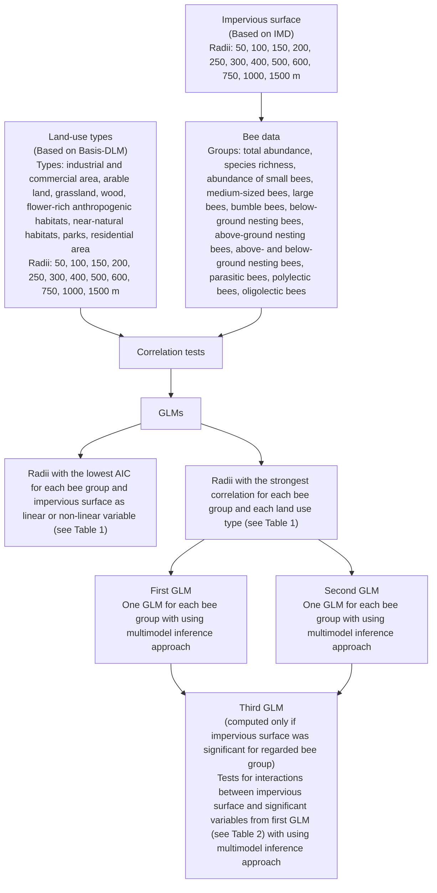

<!-- page 1 of 19 -->

Landsc Ecol (2023) 38:2981–2999

https://doi.org/10.1007/s10980-023-01755-2

RESEARCH ARTICLE

Check for updates

# Urban wild bees benefit from flower‑rich anthropogenic land use depending on bee trait and scale

**Monika Weber  · Tim Diekötter  · Anke C. Dietzsch  · Silvio Erler** Henri Grei[l](http://orcid.org/0000-0003-4501-1689)  · Tobias Jütte  **· André Krahner  · Jens Pistorius**

Received: 9 February 2023 / Accepted: 14 August 2023 / Published online: 3 September 2023

© The Author(s) 2023

## Abstract

Context Wild bees are important pollinators for wild and cultivated plants. Besides other causes, their decline has been linked to land-use change such as urbanisation. In contrast, urban habitats are discussed as potential wild bee refuges.

Objectives To expand our understanding of cities as wild bee habitats, bee responses to urban land-use types with varying foraging and nesting resources were analysed.

Methods Wild bees were sampled with pan traps at 49 study sites in a Central European city. Effects of land-use types on wild bees were examined at 12

**Supplementary Information** The online version contains supplementary material available at [https://doi.org/10.1007/s10980-023-01755-2](https://doi.org/10.1007/s10980-023-01755-2).

M. Weber (\*) · A. C. Dietzsch · S. Erler · H. Greil ·

T. Jütte · A. Krahner · J. Pistorius

Institute for Bee Protection, Julius Kühn Institute (JKI) –

Federal Research Centre for Cultivated Plants, Messeweg 11/12, 38104 Braunschweig, Germany

e-mail: monika.weber@julius-kuehn.de

A. Krahner

e-mail: andre.krahner@julius-kuehn.de

M. Weber · T. Diekötter

Department of Landscape Ecology, Institute for Natural Resource Conservation, Kiel University, Kiel, Germany

S. Erler

Zoological Institute, Technische Universität Braunschweig, Braunschweig, Germany

scales ranging from 50 to 1500  m from sampling points. For analyses, bees were grouped according to their traits (e.g., size, nesting and pollen-collecting behaviour) to account for species-specific requirements.

Results Land-use types significantly affected wild bees covering all investigated scales. Anthropogenically managed flower-rich habitats, i.e., long-term allotments and cemeteries, were beneficial for most wild bee groups within varying scales between 200 and 600  m. Impervious surface affected only some of the investigated wild bee groups, mostly in a unimodal manner within a 100 m scale.

Conclusions This study shows that it is recommended for future investigations to take different scales and different bee traits into account when assessing urban habitat quality for bees. In particular, the non-linear response to impervious surface indicates positive edge effects between urban core and rural areas. Conservation measures and implementation management to support wild bees in urban areas should consider the results on scale and land use to meet species-specific demands effectively.

**Keywords** Garden · Functional diversity · Lifehistory characteristics · Conservation · Landscape effects · Urban ecology

1 3

<!-- page 2 of 19 -->

2982

Landsc Ecol (2023) 38:2981–2999

## Introduction

An increasing number of studies reported a signifi cant insect decline (e.g., Hallmann et  al. 2017; Seibold et  al. 2019). Wild bees as essential pollinators of many wild and cultivated plants (Klein et al. 2018) are no exception (Powney et  al. 2019; Zattara and Aizen 2021). Decreasing resource diversity, pesticides, pathogens, and climate change are identified drivers of wild bee decline (Potts et  al. 2010; Wagner 2020). However, land-use change with resulting habitat loss and fragmentation are assumed to be most important (Potts et  al. 2010). Urbanisation, one of the most profound types of land-use change, is often mentioned to be detrimental to wild bees (Hernandez et  al. 2009; Bates et  al. 2011; Wenzel et  al. 2020). Yet, urban areas may also represent refuges for wild bees (Sirohi et al. 2015; Hall et al. 2017; Theodorou et al. 2020) and a diversity of cultivated crops, for example, in gardens or long-term allotments may benefit from a diversity of bees (Matteson and Lang ellotto 2009; Lowenstein et  al. 2015). To maximise the potential of cities as wild bee habitat, it is essential to better  understand the effects of urban landuse types (e.g., long-term allotments, parks, arable land, and impervious surface) on the urban wild bee community.

Numerous studies investigated wild bee response to urbanisation. Besides comparisons between different categories of urbanisation like urban, suburban, and rural areas (e.g., Bates et  al. 2011; Sirohi et  al. 2015; Twerd and Banaszak-Cibicka 2019), some studies used a gradient of increasing urbanisation based on land use (e.g., Fortel et  al. 2014; Geslin et  al. 2016). Proportions of land-use types around sampling sites were mostly investigated within one or few radii (e.g., Fortel et  al. 2014; Geslin et  al. 2016; Burdine and McCluney 2019), or one radius out of many was selected for further investigations (e.g., Winfree et al. 2007; Theodorou et  al. 2016). For agricultural landscapes, however, it was shown that different wild bees are affected by land use at different scales (Steffan-Dewenter et al. 2002; Tscheulin et al. 2011; Pascual 2022) and this effect depends on scale and bee trait (Tscheulin et  al. 2011; Hellwig et  al. 2022). This seems plausible, as different wild bees require different resources and vary in their flight and dispersal distances (Gathmann and Tscharntke 2002; Carvell

et al. 2017). Therefore, it is likely that wild bees in urban areas with different traits, such as size, nesting, and pollen-collecting behaviour, also respond to different land use at different scales.

In urban areas, impervious surface is the most frequently examined land use, often used as a measure of urbanisation (e.g., Fortel et  al. 2014; Geslin et  al. 2016; Burdine and McCluney 2019). Mostly it is tested for a linear response (e.g., Geslin et  al. 2016; Burdine and McCluney 2019; but see Fortel et  al. 2014). In urban habitats, the most complex landscape is at low to intermediate percentage of impervious surface, which suggests a non-linear unimodal response of wild bees (cf., Tscharntke et  al. 2012). The findings of Fortel et al. (2014) and Wenzel et al. (2020) support this hypothesis (but see Bates et  al. 2011). Interacting effects are also likely, as Burdine and McCluney (2019) found an amplification of the negative effect of impervious surface on wild bee abundance with increasing canopy and a reduction of the negative effect of impervious surface on wild bee diversity with increasing flower abundance.

The research questions addressed in this study are: (i) At which most important spatial scale do varying urban land uses affect wild bees with different traits? (ii) Do wild bees with different traits respond in a non-linear manner to impervious surface? (iii) How does impervious surface interact with other factors in shaping local bee communities?

To address these questions, the responses of bees with different body sizes, nesting, and pollen-collecting behaviour to eight urban land-use types with varying nesting and foraging resources and impervious surface were examined. Therefore, a data set of bees captured at 49 study sites in Braunschweig, northern Germany, was analysed evaluating land-use types at 12 spatial scales ranging from 50 to 1500 m around sampling points.

## Methods

The study was conducted in Braunschweig, Lower Saxony, Germany (Fig.  1). With almost 250,000 inhabitants and an area of around 193  km2 (Stadt Braunschweig - Referat Stadtentwicklung, Statistik, Vorhabenplanung 2021), Braunschweig is located in the northern foreland of the Harz mountains. The mean annual precipitation is 637  mm and the mean

1 3

<!-- page 3 of 19 -->

Landsc Ecol (2023) 38:2981–2999

2983

annual temperature is $9 . 5 ~ ^ { \circ } \mathbf { C }$ (Deutscher Wetterdienst 2020).

## Study sites

As study sites, municipally managed sites with vegetation ranging from utility and ornamental turf to landscape lawns and succession areas were selected to be distributed across the entire administrative area of Braunschweig and thus maximize urban gradients across study sites. Site selection was based on a digital map of municipally managed sites and aerial photos using a geographic information system (GIS). It was ensured that a 20 × 20  m square for the vegetation survey could be fitted into each site (see “Vegetation characteristics” section) to enable comparability of local conditions. At each of the 49 study sites, one sampling point in a sunny spot, preferably remote from public activity, was surveyed with a handheld GPS device during first bee sampling. The mean

minimum distance between sampling points was 941 m (range 158 to 2711 m) (Fig. 1).

## Bee sampling

Wild bees were sampled with pan traps of three different colours slightly modified from Krahner et  al. (2021). Pan traps with a diameter of 23  cm and a volume of 2.3 l were primed with white acrylic resin paint (sparvar 1315) on both the outside and inside and afterwards sprayed with blue (sparvar 3107), yellow (sparvar 3104), respective white (sparvar 3103) fluorescent acrylic resin paint (Spray-Color GmbH, Merzenich, Germany). At each site, three pan traps (one in each colour) were installed in a triangle around the sampling point with 3  m distance to the sampling point and a distance of 4.6  m  between traps. Traps were fixed at the local flower level and filled with around 1.5 l soapy water. After 24 h, the trapping liquid was poured over a sieve with around 1.5  mm mesh size. Bees were sampled three times

Fig. 1   Sampling point locations within Braunschweig. Green point in the inset map shows the location of Braunschweig within Germany. City border and digital orthophoto (DOP): © GeoBasis-DE / BKG 2023; Terms of use: [http://sg.geodatenzentrum.de/web\_public/nutzungsbedingungen.pdf](http://sg.geodatenzentrum.de/web_public/nutzungsbedingungen.pdf)

| Species Richness | Color |
| --- | --- |
| 1 | Yellow |
| 5 | Yellow |
| 10 | Orange |
| 15 | Orange |
| 20 | Orange |
| 23 | Red |

1 3

<!-- page 4 of 19 -->

2984

Landsc Ecol (2023) 38:2981–2999

in 2019 covering their main flight period and minimising impacts on bee populations. Sampling of the sites in each round was split over several days with the most suitable forecasted weather conditions. The first sampling (spring) was run from 16 April to 15 May with a daily maximum temperature of at least 15  °C and a sunshine duration of at least 7  h; the second sampling (early summer) from 13 to 20 June (daily maximum temperature: at least 24  °C, sunshine duration: at least 9  h); and the third sampling (late summer) from 13 to 21 August (daily maximum temperature: at least $2 0 \; ^ { \circ } \mathbf { C } ,$ sunshine duration: at least 5 h) (Deutscher Wetterdienst 2021). Separate weather information for each sampling location could not be estimated.

Bees were pinned, labelled and identified to species level. Taxonomy followed Scheuchl and Willner (2016). Five specimens (two Andrena, two Lasioglossum, one Hylaeus) could not be identified to species level and were therefore included only in analyses where genus information was sufficient. Two specimens differed slightly from Megachile maritima and could not be identified for sure. This species was not used in analyses of specialisation (see Online Resource ESM1 for more details). Honey bees (Apis mellifera) were excluded from all analyses.

## Vegetation characteristics

To take differences of sampling locations into account, vegetation characteristics recorded during the vegetation surveys were included in analyses. Vegetation surveys were conducted once following each of the three bee samplings at the study site; in spring from 30 April to 15 May, early summer from 11 June to 10 July and in late summer from 28 August to 24 September. Due to a high level of public activity on some sampling sites, an easily reproducible method without permanent markings was used. Starting from the bee sampling point, 10  m were measured in each cardinal direction and then completed to squares. In each of the four resulting 10 × 10 m quadrants, the proportion of different ground cover was estimated. Here, the mean proportion of canopy cover in early summer was used as a measure of shading.

In each of the four quadrants, a sub-square of 1 × 1 m was chosen for more detailed vegetation mapping. At each vegetation survey, the locations with the highest species richness of flowering plants and

the highest flower cover within the quadrants were selected as sub-squares. Within sub-squares, flowering herbs and shrubs were identified to species level, using image-based identification books or the Flora Incognita app (Mäder et  al. 2021). In data analyses, two measures based on flowering plant species were included: (i) Species richness of flowering plants (herbs and shrubs) accumulated over the three vegetation surveys as a measure of resource variety, and (ii) percentage of flowering plant species with more than one detection during the three surveys as a measure of resource constancy. Vegetation structure of the investigated study sites varied, e.g., depending on mowing frequency. Therefore, mean percentage of vegetation cover at 50 to 100 cm height estimated in the sub-squares in early summer was also included in analyses.

## Landscape data

Landscape data were generated from the vector-based digital basis landscape model (Basis-DLM) of 2019 (Federal Agency for Cartography and Geodesy 2019) and from the High Resolution Layer Imperviousness Density (IMD) of 2018 (Copernicus Land Monitoring Service 2020), a raster layer providing the percentage of imperviousness with a resolution of 10 m.

From the Basis-DLM, spatial information on residential area surface, combined use area, area with specific functional characteristic, industrial and commercial area, long-term allotments, parks, public parks, cemeteries, arable land, grassland, wood, copse, heath, and unproductive area were used (translations according to Afflerbach and Kunze 2006 and Working Group of State Agencies for Nature Conservation and Landscape Management Working Team “Landscape reconnaissance” 2002; explanations are available in German at Arbeitsgemeinschaft der Vermessungsverwaltungen der Länder der Bundesrepublik Deutschland 2018). Due to the low area coverage of some of the used land-use types (e.g., cemeteries), some land-use types were combined: long-term allotments and cemeteries as anthropogenically managed flower-rich areas to flower-rich anthropogenic habitats; copse, heath, and unproductive area as mostly not anthropogenically managed areas dominated by native plants to near-natural habitats; parks and public parks to parks; and residential area surface, combined use area, and area with specific functional

1 3

<!-- page 5 of 19 -->

Landsc Ecol (2023) 38:2981–2999

2985

characteristic to residential area (see Online Resource ESM2 Table ESM2.00.01).

Mean flight distances of wild bees range from 59 to 121  m (Hofmann et  al. 2020) and documented maximal foraging distances of most wild bee species ranges from 300 to 1500  m (Zurbuchen and Müller 2012). Therefore, land-use types were evaluated in 50, 100, 150, 200, 250, 300, 400, 500, 600, 750, 1000, and 1500 m radii around sampling points.

The proportion of different land-use types based on the Basis-DLM as well as impervious surface based on the raster layer were calculated with QGIS 3.8.2-Zanzibar (QGIS Development Team 2019). This software uses regular polygons to approximate a circular buffer. Here, polygons with 36 edges were used.

## Species traits

Wild bee data were pooled over the whole year. In addition to wild bee total abundance and species richness, wild bees were grouped according to their body size, nesting and pollen-collecting behaviour (Online Resource ESM1). For each species group, the abundance per sampling point was examined, as declines caused by habitat changes can be observed earlier in abundance than in species richness (Hull et al. 2015).

Information on bee species traits were taken from Westrich (2018) and missing information completed with Amiet et  al. (2001, 2010, 2014) (body size), Scheuchl and Willner (2016) (nesting and pollen-collecting behaviour), and Hagen and Aichhorn (2003) (nesting behaviour of bumble bees). As body sizes are usually given as ranges, bees were categorised as it follows: small bee species as always being smaller than 10 mm (4–9 mm), large species as always being larger than at least 10 mm (10–23 mm), and mediumsized bees as species whose individuals can range from smaller than 10 mm up to at least 10 mm (e.g., 6–10  mm or 9–14  mm). Body size of bumble bees varies markedly within species (e.g., Bombus hypnorum worker 8–18  mm, Hagen and Aichhorn 2003), thus they were grouped into their own size category.

Regarding nesting behaviour, bee species were grouped into below-ground nesting, above-ground nesting, above- and below-ground nesting (species which can use both opportunities), and parasitic bees (social parasitic or cleptoparasitic). Parasitic bees were categorised separately, as they do not depend

on flower resources within a certain radius to collect food for their offspring and do not need to return to their nest.

Most of the species in this study which build their nest in escarpments of loess, of other sediments or in rock crevices, are cavity-nesting species. These species also use wall crevices and nesting boxes, which are common nesting sites in urban habitats, and were therefore categorised as above-ground nesting.

For pollen-collecting behaviour, bee species were grouped into polylectic, oligolectic, and parasitic bees.

## Statistical analyses

Statistical analyses were conducted in R version 3.6.1 (R Core Team 2019). For each response variable (total wild bee abundance, wild bee species richness and abundance within each wild bee group), two to three generalized linear models (GLM) were computed, using the function “glmmTMB” of the package “glmmTMB” version 1.0.2.1 (Brooks et al. 2017) (Fig. 2).

In preparation for the first GLM, Pearson correlation coefficients were calculated for the response variable and the proportional area of each of the eight land-use types based on the Basis-DLM for each of the twelve radii. For each land-use type, the radius associated with the largest absolute value of correlation coefficient was selected for the first GLM (Table 1, Fig. 2, Online Resource ESM2) to identify the most relevant radius (cf. Steffan-Dewenter et  al. 2002). Proportion of land-use types in the selected radii did not show any collinearity (r < 0.7 for all tests). The most appropriate error distribution for the first GLM, which contained the proportional area of the eight land-use types and vegetation characteristics, was chosen according to the findings of Payne et  al. (2018). For all response variables, negative binomial error distribution with linear parametrisation was used, except for medium sized bees, where negative binomial error distribution with quadratic parametrisation was used.

To determine relevant factors influencing bees at different scales, the multimodel inference approach was applied (Burnham and Anderson 2002). Therefore, a list of candidate models with all possible model combinations based on the global model was created with the function “dredge” of the package

1 3

<!-- page 6 of 19 -->

2986

Landsc Ecol (2023) 38:2981–2999

Fig. 2   Flowchart of the statistical analyses. Two different methods were used to find the radius where different land-use types or impervious surface had the strongest effect on the regarded bee group. For the land-use types based on the Basis-DLM, correlation tests were used. For impervious surface based on IMD, GLMs were used to also be able to test for non-linear effects

flowchart

“MuMIn” version 1.43.17 (Bartoń 2020) and ranked by Second-order Akaike Information Criterion $( \mathrm { A I C } _ { \mathrm { c } } )$ . All models with a $\Delta \mathrm { A I C } _ { \mathrm { c } }   <   2$ to the model with the lowest $\mathrm { A I C _ { c } }$ were selected for model averaging (Burnham and Anderson 2002). Model averaging was conducted with the function “model.avg” of the package “MuMIn” version 1.43.17 (Bartoń 2020) (Online Resource ESM2). All explanatory variables with a p-value ≤ 0.05 in the more conservative full average (Grueber et  al. 2011) are reported with p-values and estimates. Importance of significant

explanatory variables, using the sum of Akaike weights (Σwi) over all candidate models including the respective variable, was also calculated (function “importance” package “MuMIn” version 1.43.17, Bartoń 2020) (Online Resource ESM2).

For the second GLM, 24 GLMs with impervious surface as a linear variable or with impervious surface as a linear and quadratic variable were run using the same error distributions as in the first model to select the explanatory variables for impervious surface (Table  1, Fig.  2, Online Resource ESM2). The

1 3

<!-- page 7 of 19 -->

Landsc Ecol (2023) 38:2981–2999

2987

hness and trait dependent abu Table1Radii [m] with the highest absolute value of calculated Pearson correlation coefficients between proportion of different land-use types and total wild bee abundance, spe

<table><tr><td rowspan="2">Land-use type</td><td colspan="12">Response variable</td></tr><tr><td>Total abundance</td><td>Species richness</td><td>Small bees</td><td>Medium-sized bees</td><td>Large bees</td><td>Bumble bees</td><td>Below-ground nest-ing bees</td><td>Above-ground nest-ing bees</td><td>Above- and below-ground nest-ing bees</td><td>Parasitic bees</td><td>Polylectic bees</td><td>Oligolectic bees</td></tr><tr><td>Industrial and commercial area</td><td>1500</td><td>50</td><td>50</td><td>250</td><td>400</td><td>1500</td><td>1500</td><td>50</td><td>1500</td><td>200</td><td>1500</td><td>600</td></tr><tr><td>Arable land</td><td>400</td><td>150</td><td>750</td><td>400</td><td>50</td><td>1000</td><td>400</td><td>300</td><td>750</td><td>1500</td><td>400</td><td>50</td></tr><tr><td>Grassland</td><td>1500</td><td>1500</td><td>1500</td><td>1500</td><td>250</td><td>500</td><td>1500</td><td>500</td><td>1500</td><td>1500</td><td>1500</td><td>1000</td></tr><tr><td>Wood</td><td>1000</td><td>100</td><td>150</td><td>50</td><td>1000</td><td>1500</td><td>1000</td><td>100</td><td>1500</td><td>1500</td><td>1000</td><td>1000</td></tr><tr><td>Flower-rich anthropogenic habitats</td><td>250</td><td>400</td><td>400</td><td>200</td><td>400</td><td>250</td><td>500</td><td>250</td><td>250</td><td>600</td><td>250</td><td>750</td></tr><tr><td>Near-natural habitats</td><td>1500</td><td>1500</td><td>1500</td><td>250</td><td>200</td><td>50</td><td>250</td><td>400</td><td>50</td><td>50</td><td>1500</td><td>400</td></tr><tr><td>Parks</td><td>300</td><td>1500</td><td>1500</td><td>300</td><td>200</td><td>50</td><td>600</td><td>1000</td><td>100</td><td>1500</td><td>1500</td><td>1500</td></tr><tr><td>Residential area</td><td>1500</td><td>1500</td><td>1500</td><td>1500</td><td>600</td><td>1500</td><td>1500</td><td>500</td><td>1500</td><td>1500</td><td>1500</td><td>600</td></tr><tr><td>Impervious surface</td><td> $100^b$ </td><td> $100^b$ </td><td> $1500^a$ </td><td> $100^b$ </td><td> $100^b$ </td><td> $1500^a$ </td><td> $300^a$ </td><td> $100^b$ </td><td> $1500^a$ </td><td> $1500^a$ </td><td> $100^b$ </td><td> $50^b$ </td></tr></table>

selection are shown (cf. Online Resource ESM2). The given radii were used in the GLMs examining the effects of different land-use types on wild bees For impervious surface, radii [m] and kind of model (linear variable onlya or linear and quadratic variableb) of impervious surface with the lowest AIC in the GLMs used for

1 3

<!-- page 8 of 19 -->

2988

Landsc Ecol (2023) 38:2981–2999

combination of radius and explanatory variables of the GLM with the lowest Akaike information criterion (AIC) was used for setting up the second GLM, which also included the vegetation characteristics. The model was fitted with the same error distribution as in the first model, except of the model examining below-ground nesting bees. Here, overdispersion occurred and the model was refitted with negative binomial error distribution with quadratic parameterisation. Relevant factors were identified via the multimodel inference approach (Burnham and Anderson 2002) as described above (Online Resource ESM2).

The third GLM was created only if impervious surface showed a significant effect in the second GLM (Fig. 2). First, all significant explanatory landuse variables of the first and the second GLM were tested for collinearity. If r > 0.7, the variable from the first GLM was excluded as the focus was on interactions between impervious surface and other variables. The error distribution of the first GLM was used here again. The multimodel inference approach (Burnham and Anderson 2002) was used as described above. In no case, a significant interaction was observed in the full average (Online Resource ESM2).

Figures were created with the original data and fitted values with 95% confidence intervals computed with the function “allEffects” of the package “effects” version 4.2-0 (Fox 2003; Fox and Weisberg 2019). For illustration, the model that contained only the significant explanatory variables was used, if it had a $\Delta \mathrm { A I C } _ { \mathrm { c } }   <   2$ to the model with the lowest $\mathbf { A } \mathbf { I } \mathbf { C } _ { \mathrm { c } } ,$ otherwise the model with the lowest $\mathrm { A I C _ { c } }$ containing all significant explanatory variables was used. This model as well as the two models with the lowest $\mathrm { A I C _ { c } }$ were assessed for appropriateness via testing for zero-inflation with the function “testZeroInflation”, plotting standardized residuals versus fitted values with the function “plotResiduals”, and quantile–quantile plots with the function “plotQQunif” (last three: package “DHARMa” version 0.3.3.0, Hartig 2020). The models were also tested for spatial autocorrelation of the residuals using the function “Moran.I” of the package “ape” version 5.4-1 (Paradis and Schliep 2019). Only in two models, examining the eight different land-use types, spatial autocorrelation was noticed. For bumble bees, the model with the lowest $\mathbf { A } \mathbf { I } \mathbf { C } _ { \mathrm { c } } ,$ which contained significant explanatory variables only, showed spatial autocorrelation $( \mathtt { p }   =   0 . 0 2 3 )$ as well as the model for above- and below-ground

nesting bees, which contained significant variables only $( \mathtt { p }   =   0 . 0 0 4 )$ . This suggests a spatial autocorrelated factor not considered in both models (Dormann et al. 2007).

## Results

In total, 1589 wild bee specimens of 102 species or morphospecies belonging to 16 genera were sampled, representing 30.2% of the wild bee species occurring in Lower Saxony (Theunert 2002). The number of sampled wild bees varied between spring (1080 specimens), early summer (330 specimens), and late summer (179 specimens). Mean abundance of wild bees per sampling point pooled over the whole year was 32.4 (range 6–121) and mean species richness was 12.7 (range 1–23) (Fig.  1). Overall, 426 large bee specimens of 26 species, 697 medium-sized bee specimens of 30 species, 281 small bee specimens of 37 species, and 180 bumble bee specimens of 9 species were sampled. Regarding nesting behaviour, 56 species with 1143 specimens were below-ground nesting, 23 species with 228 specimens were aboveground nesting, 7 species with 150 specimens use above- and below-ground nesting sites, and 15 species with 61 specimens were parasitic (social parasitic or cleptoparasitic). In terms of pollen-collecting behaviour, 20 species with 213 specimens prefer an oligolectic diet and 66 species with 1308 specimens were polylectic (Online Resource ESM1).

## Total abundance and species richness

Proportion of flower-rich anthropogenic habitats had a significant positive effect on both, abundance within a 250 m radius (Table 2; Fig. 3a) and species richness within a 400 m radius (Table 2; Fig. 3b).

Proportion of impervious surface had a significant non-linear unimodal effect on species richness within a 100 m radius (Table 2; Fig. 4a). There was no interacting effect between impervious surface and landuse types detectable as well as for all other tested bee traits (see Online Resource ESM2).

## Body size

For abundance of small bees, only the local vegetation characteristic species richness of flowering

1 3

<!-- page 9 of 19 -->

Landsc Ecol (2023) 38:2981–2999

2989

Table 2   Significant effects of proportion of land-use types and local vegetation characteristics on studied bee groups with spatial scale, estimate, p-value of the full average of model averaging, and sum of Akaike weights (Σwi) (cf. Online Resource

ESM2).  Vegetation characteristics were included in the first GLM examining the effect of eight different land-use types on urban wild bees and in the second GLM examining the effect of impervious surface on bees

<table><tr><td>Response variable</td><td>Land-use type</td><td>Scale</td><td>Estimate</td><td> $\Sigma w_i$ </td><td>p-value</td></tr><tr><td>Total abundance</td><td>Flower-rich anthropogenic habitats</td><td>250 m</td><td>2.840</td><td>0.94</td><td>0.001</td></tr><tr><td rowspan="2">Species richness</td><td>Flower-rich anthropogenic habitats</td><td>400 m</td><td>2.375</td><td>0.97</td><td>&lt;0.001</td></tr><tr><td>Impervious surfaceb</td><td>100 m</td><td>Linear 2.175Quadratic -4.116</td><td>Linear 0.80Quadratic 0.85</td><td>Linear 0.011Quadratic 0.009</td></tr><tr><td>Small bees</td><td>Species richness of flowering plants</td><td>Local</td><td>First GLM 0.049</td><td>First GLM 0.79</td><td>First GLM 0.022</td></tr><tr><td rowspan="4">Medium-sized bees</td><td>Flower-rich anthropogenic habitats</td><td>200 m</td><td>3.524</td><td>0.79</td><td>0.021</td></tr><tr><td>Parks</td><td>300 m</td><td>-3.886</td><td>0.80</td><td>0.003</td></tr><tr><td>Grassland</td><td>1500 m</td><td>-5.322</td><td>0.77</td><td>0.008</td></tr><tr><td>Impervious surfaceb</td><td>100 m</td><td>Linear 4.072Quadratic -9.140</td><td>Linear 0.62Quadratic 0.77</td><td>Linear 0.077Quadratic 0.026</td></tr><tr><td>Large bees</td><td>Flower-rich anthropogenic habitats</td><td>400 m</td><td>4.148</td><td>0.78</td><td>0.003</td></tr><tr><td rowspan="3">Bumble bees</td><td>Residential area</td><td>1500 m</td><td>2.880</td><td>0.93</td><td>0.005</td></tr><tr><td>Impervious surfacea</td><td>1500 m</td><td>2.637</td><td>0.99</td><td>&lt;0.001</td></tr><tr><td>Canopy cover</td><td>Local</td><td>First GLM -2.468Second GLM -2.835</td><td>First GLM 0.79Second GLM 0.89</td><td>First GLM 0.039Second GLM 0.024</td></tr><tr><td rowspan="2">Below-ground nesting bees</td><td>Flower-rich anthropogenic habitats</td><td>500 m</td><td>4.151</td><td>0.71</td><td>0.011</td></tr><tr><td>Parks</td><td>600 m</td><td>-3.797</td><td>0.74</td><td>0.013</td></tr><tr><td rowspan="3">Above-ground nesting bees</td><td>Flower-rich anthropogenic habitats</td><td>250 m</td><td>4.913</td><td>0.92</td><td>&lt;0.001</td></tr><tr><td>Residential area</td><td>500 m</td><td>1.833</td><td>0.92</td><td>0.002</td></tr><tr><td>Impervious surfaceb</td><td>100 m</td><td>Linear 8.746Quadratic -14.598</td><td>Linear 0.99Quadratic 0.99</td><td>Linear 0.001Quadratic 0.007</td></tr><tr><td rowspan="3">Above- and below-ground nesting bees</td><td>Residential area</td><td>1500 m</td><td>2.392</td><td>0.79</td><td>0.007</td></tr><tr><td>Impervious surfacea</td><td>1500 m</td><td>2.581</td><td>0.99</td><td>&lt;0.001</td></tr><tr><td>Canopy cover</td><td>Local</td><td>First GLM -3.254Second GLM -3.540</td><td>First GLM 0.83Second GLM 0.95</td><td>First GLM 0.019Second GLM 0.012</td></tr><tr><td>Parasitic bees</td><td>Flower-rich anthropogenic habitats</td><td>600 m</td><td>6.959</td><td>0.75</td><td>0.005</td></tr><tr><td rowspan="3">Polylectic bees</td><td>Flower-rich anthropogenic habitats</td><td>250 m</td><td>3.158</td><td>0.98</td><td>&lt;0.001</td></tr><tr><td>Parks</td><td>300 m</td><td>-1.748</td><td>0.50</td><td>0.033</td></tr><tr><td>Grassland</td><td>1500 m</td><td>-3.306</td><td>0.63</td><td>0.007</td></tr><tr><td rowspan="3">Oligolectic bees</td><td>Grassland</td><td>1000 m</td><td>3.559</td><td>0.81</td><td>0.023</td></tr><tr><td>Impervious surfaceb</td><td>50 m</td><td>Linear 9.347Quadratic -15.747</td><td>Linear 0.84Quadratic 0.85</td><td>Linear &lt;0.001Quadratic 0.007</td></tr><tr><td>Canopy cover</td><td>Local</td><td>Second GLM -4.090</td><td>Second GLM 0.70</td><td>Second GLM 0.029</td></tr></table>

Proportion of impervious surface affected some examined bee groups in a lineara or a unimodal mannerb

1 3

<!-- page 10 of 19 -->

2990

Landsc Ecol (2023) 38:2981–2999

Fig. 3   Effects of the land-use type percentage of flower-rich anthropogenic habitats within different scales (a, b, d–f) and the vegetation characteristic species richness of flowering plants (c) on wild bees with 95% confidence intervals. a Wild bee total abundance within a 250  m radius; b wild bee species richness within a 400 m radius; c abundance of small bees (pale blue); d abundance of medium-sized bees within a 200 m

radius (light blue), abundance of large bees within a 400  m radius (blue); e abundance of below-ground nesting bees within a 500 m radius (dark red), abundance of above-ground nesting bees within a 250  m radius (orange); f abundance of polylectic bees within a 250  m radius (green), abundance of parasitic bees within a 600  m radius (dark green). All y-axis are log10-transformed except for b

plants had a significant positive effect (Table  2; Fig.  3c). Abundance of medium-sized bees increased with proportion of flower-rich anthropogenic habitat within a 200  m radius (Table  2;

Fig.  3d), and decreased with proportion of parks within a 300 m radius (Table 2; Fig. 5a), as well as with proportion of grassland within a 1500 m radius (Table  2; Fig.  5b). Only proportion of flower-rich

1 3

<!-- page 11 of 19 -->

Landsc Ecol (2023) 38:2981–2999

2991

Fig. 4   Effects of percentage of impervious surface within different radii on wild bees with 95% confidence intervals. a Wild bee species richness within a 100 m radius; b abundance of medium-sized bees within a 100 m radius; c abundance of bumble bees within a 1500  m radius; d abundance of above-

anthropogenic habitat within a 400  m radius had a significant positive effect on abundance of large bees (Table 2; Fig. 3d). Abundance of bumble bees increased with proportion of residential area within a 1500  m radius (Table  2; Fig.  5c) and decreased with the local vegetation characteristic proportion of canopy cover (Table 2; Fig. 5d).

ground nesting bees within a 100  m radius; e abundance of above- and below-ground nesting bees within a 1500 m radius; f abundance of oligolectic bees within a 50  m radius. All y-axis are log10-transformed except for a

Proportion of impervious surface significantly affected medium-sized bees and bumble bees. Medium-sized bees showed a non-linear unimodal response within a 100  m radius (Table  2; Fig.  4b), while bumble bees were positively affected within a 1500 m radius (Table 2; Fig. 4c). As in the previous

1 3

<!-- page 12 of 19 -->

2992

Landsc Ecol (2023) 38:2981–2999

Fig. 5   Effects of different land-use types within different radii and vegetation characteristics on abundance of wild bee groups with 95% confidence intervals. a Effect of percentage of parks within a 300 m radius on abundance of polylectic bees (green), within a 600  m radius on abundance of below-ground nesting bees (dark red), and within a 300 m radius on abundance of medium-sized bees (light blue); b effect of percentage of grassland within a 1500  m radius on abundance of polylectic bees (green), on abundance of medium-sized bees (light blue), and within a 1000 m radius on abundance of oligolectic bees

(light green); c effect of percentage of residential area within a 500  m radius on abundance of above-ground nesting bees (orange) and within a 1500 m radius on abundance of bumble bees (dark blue); d effect of percentage of canopy cover on abundance of bumble bees (dark blue) and abundance of oligolectic bees (light green); e effect of percentage of residential area within a 1500 m radius on abundance of above- and below-ground nesting bees (dark orange); f effect of percentage of canopy cover on abundance of above- and below-ground nesting bees (dark orange). All y-axis are log10-transformed

1 3

<!-- page 13 of 19 -->

Landsc Ecol (2023) 38:2981–2999

2993

GLM, proportion of canopy cover was also significant for bumble bee abundance (Table 2).

## Nesting behaviour

Proportion of flower-rich anthropogenic habitats had a significant positive effect on the abundance of below-ground nesting bees within a 500  m radius (Table 2; Fig. 3e), above-ground nesting bees within a 250 m radius (Table 2; Fig. 3e), and parasitic bees within a 600 m radius (Table 2; Fig. 3f). Abundance of below-ground nesting bees decreased with proportion of parks within a 600  m radius (Table  2; Fig. 5a). Proportion of residential area had a significant positive effect on abundance of above-ground nesting bees within a 500 m radius (Table 2; Fig. 5c) and above- and below-ground nesting bees within a 1500  m radius (Table  2; Fig.  5e). Abundance of above- and below-ground nesting bees decreased with proportion of canopy cover (Table 2; Fig. 5f).

Proportion of impervious surface had a non-linear unimodal effect on abundance of above-ground nesting bees within a 100  m radius (Table  2; Fig.  4d). Abundance of above- and below-ground nesting bees increased with proportion of impervious surface within a 1500  m radius (Table  2; Fig.  4e) and decreased with proportion of canopy cover (Table 2).

## Pollen‑collecting behaviour

Abundance of polylectic bees increased with proportion of flower-rich anthropogenic habitat within a 250  m radius (Table  2; Fig.  3f) and decreased with proportion of parks within a 300 m radius (Table 2; Fig.  5a). Proportion of grassland negatively influenced abundance of polylectic bees within a 1500 m radius (Table  2; Fig.  5b), but increased abundance of oligolectic bees within a 1000 m radius (Table 2; Fig. 5b).

Abundance of oligolectic bees showed a non-linear unimodal response to proportion of impervious surface within a 50 m radius (Table 2; Fig. 4f) and was negatively affected by proportion of canopy cover (Table 2; Fig. 5d).

## Discussion

Foraging‑dependent effects of land‑use types on wild bees

The most important land-use type supporting the urban wild bee community was proportion of flowerrich anthropogenic habitats, composed of long-term allotments and cemeteries. This factor had a positive effect on almost all investigated bee groups, showing the utmost importance of flower-rich anthropogenic managed habitats for urban wild bees. The positive effect of allotments for bees has been shown before (Baldock et al. 2019) with higher abundance of bees in allotments compared to most other urban land uses, whereas bee species richness was not affected. In the current study, both, bee species richness and total bee abundance, benefited from proportion of flower-rich anthropogenic habitat within a 400 m and 250  m radius, respectively. The difference in scales is presumably showing the difference between the mean dispersal range of the trapped bee species (species richness) and the smaller mean foraging range of the trapped individual bees (abundance). The dispersal distance of solitary wild bees is largely unknown and observations range from sedentary behaviour to several kilometres even for the same species (Franzén et al. 2009). The maximum foraging distance for all bees in this study estimated with the formula of Gathmann and Tscharntke (2002) is 364 m (estimated mean body size among all bee individuals: 10.9 mm). As the formula of Gathmann and Tscharntke (2002) estimates the maximum foraging distance from the nesting site, it is not surprising that the scale of 250 m determined here for total wild bee abundance is lower.

The consistency with the results from Gathmann and Tscharntke (2002) is also evident among bees of different size. Small bees (estimated mean body size of all individuals: 6.1  mm; calculated maximum foraging distance: \~ 101  m) were not affected by any examined land-use type. Flower-rich anthropogenic habitats in the current study may have been too far away for small bees, where short foraging distances can explain the dependence on the local vegetation characteristic species richness of flowering plants. Medium-sized bees (estimated mean body size of all individuals: 10.2  mm; calculated maximum foraging distance: \~ 326  m) and large bees (estimated mean body size of all individuals:

1 3

<!-- page 14 of 19 -->

2994

Landsc Ecol (2023) 38:2981–2999

13.1  mm; calculated maximum foraging distance: \~ 484  m) were influenced by proportion of flower-rich anthropogenic habitats within a 200  m and 400  m radius, respectively. For medium-sized and large bees again, the calculated foraging ranges are slightly larger than the scales observed in the present study. This shows that bees of different sizes can dwell in urban habitats if sufficient flowers are available within their flight radius.

The largest relevant radius observed for flowerrich anthropogenic habitats was 600  m, within which abundance of parasitic bees increased with proportion of this land-use type. As parasitic bees do not need to forage pollen for their offspring and return to the nest, a larger scale seems realistic. However, previous studies, based on observation of marked individuals, showed varying findings for activity ranges. Sick (1993) assumed a large range of action for Sphecodes females. For Nomada females, Gebhardt and Röhr (1987) observed the same individuals at the same host aggregation on consecutive days.

While polylectic bees increased in their abundance with the proportion of flower-rich anthropogenic habitats within a 250  m radius, oligolectic bees did not benefit from an increased proportion of this landuse type. Possibly, the latter, more specialised bees are not attracted by non-native ornamental and crop plants often used in long-term allotments (Baldock et  al. 2019) and cemeteries, but favour native flowers of grassland. Thus, oligolectic bees seem unlikely to benefit from urbanisation. However, the radius of 1000  m, within which the effect of grassland cover on oligolectic bees was observed, is much larger than expected, as the foraging ranges of oligolectic bees do not differ from polylectic bees (Gathmann and Tscharntke 2002). Nonetheless this scale corresponds well with the maximum foraging distance experimentally tested for the oligolectic Chelostoma rapunculi (Zurbuchen et  al. 2010) and the findings of Hellwig et al. (2022), who showed a positive effect of grassland within scales between 500 and 5000 m in agricultural areas on Red List solitary wild bee species, which are often oligolectic.

Another explanation for the positive effect of grassland on oligolectic bees might be that they are competitively inferior to polylectic species and thus displaced to lower quality habitats. This hypothesis is supported by the negative impact of proportion of

grassland on polylectic and medium-sized bees within the 1500  m radius. However, with 19.6% of species and 13.4% of specimens, the proportion of oligolectic bees in this study was only slightly lower than on set-aside fields (20.9% of species, Steffan-Dewenter and Tscharntke 2001) but higher than in other urban areas like Poznań (15% of species, 10% of specimens, Banaszak-Cibicka and Zmihorski 2012).

Nesting‑dependent effects of land‑use types on wild bees

Abundance of below-ground nesting, polylectic, and medium-sized bees were all three negatively affected by proportion of parks, composed of parks and public parks, within a 600  m radius for below-ground nesting bees and a 300  m radius for polylectic and medium-sized bees. This was unexpected as especially below-ground nesting bees can be observed often nesting at managed green spaces and dominate the wild bee community of parks in e.g., Paris (Geslin et  al. 2015). Possibly, bees using nesting sites in parks are affected by disturbance like trampling or mowing (Matteson et  al. 2008) so that parks could be a sink rather than a source for bees and therefore may currently be less beneficial for below-ground nesting bees. Disturbance of hosts as a limiting factor may also explain rarity of parasitic bees in the pre-sent study, as disturbance within habitats is expected to be first detectable in cleptoparasite abundance and diversity (Sheffield et  al. 2013). Low proportion of parasitic bees was also observed in other urban areas (e.g., New York, Matteson et  al. 2008; Paris, Geslin et  al. 2015; Poznań, Banaszak-Cibicka et  al. 2018). In the current study, percentage of parasitic bees with 14.7% of species and 3.8% of specimens was small compared to semi-natural habitats like calcareous grassland (26.5% of species, 15.2% of specimens, Hopfenmüller et al. 2014), but is comparable in species richness and higher in abundance compared to other European cities like Poznań (12% of species, 0.9% of specimens, Banaszak-Cibicka and Zmihorski 2012) or Lyon (17% of species, Fortel et  al. 2014). However, the low proportion of parasitic species and specimens in this study might also be attributed to the sampling method (pan traps). Banaszak-Cibicka et al. (2018), Banaszak-Cibicka and Zmihorski (2012), and Fortel et  al. (2014) used a combination of pan traps and hand netting, whereas Hopfenmüller et al. (2014)

1 3

<!-- page 15 of 19 -->

Landsc Ecol (2023) 38:2981–2999

2995

used hand netting only, a method with which a significantly larger number of individuals of parasitic species can be caught (Krahner et al. 2021).

The positive effect of proportion of residential area on above-ground nesting bees within a 500 m radius is consistent with the results of previous studies (e.g., Cane et al. 2006; Fitch et al. 2019), where benefit for cavity-nesting bees is explained with enhanced nesting opportunities in urban matrix. Also most of the bumble bees and corresponding above- and belowground nesting bees recorded in this study (here 98% of above- and below-ground nesting bee individuals were bumble bees) can use nesting sites in urban landscapes (Hagen and Aichhorn 2003). This may explain their positive response to the proportion of residential area, which is consistent with Theodorou et al. (2016) (but see Ahrné et al. 2009). The largest radius of 1500  m within both bee groups responded to residential area is within the known foraging range of 250  to  3000  m for different bumble bee species (Westphal et  al. 2006). Besides landscape composition, competition may be another explanation for the observed scale. Absence of competition with a dominant bumble bee species was one of the main factors explaining bumble bee species richness within parks (McFrederick and Lebuhn 2006) and colony density has been shown to decline with percentage of paved surface (Conflitti et al. 2022). Therefore, high proportion of residential area might cause isolation and thus release from competition and may have the strongest effect on bumble bee abundance at dispersal distance. The dispersal distance of young bumble bee queens was found to be about 1000 to 1500 m (Carvell et al. 2017).

## Effect of impervious surface on wild bees

In the Basis-DLM used in this study, both, buildings and surrounding area are not separated and thus the land use residential area also includes e.g., domestic gardens. However, proportion of residential area was correlated with proportion of impervious surface within the 1500  m radius (r = 0.79) and there was a significant positive effect of impervious surface on bumble bees and correspondingly above- and belowground nesting bees within the same radius. Surprisingly, only bumble bees and above- and belowground nesting bees showed a significant linear response to proportion of impervious surface. There

are unexpectedly few other bee groups responding to this often-investigated land-use type, which are species richness  and abundance of medium-sized bees, above-ground nesting bees, and oligolectic bees. All of them showed a non-linear unimodal response within the 100 m radius, except for oligolectic bees, which responded within the 50 m radius. Thus, urban landscapes may be comparable to agricultural landscapes, where high diversity is expected mainly in complex landscapes (Tscharntke et al. 2012). In contrast to the results for proportion of residential area in the current study and in Geslin et al. (2016), abundance of above-ground nesting bees also showed a unimodal response to impervious surface, which is consistent with findings of Fortel et al. (2014). These findings might be explained by edge effects between urban and rural habitats where areas of moderate percentage of impervious surface may act as ecotone between both habitats, resulting in a non-linear unimodal response. Wenzel et  al. (2020) highlighted in their review that suburban habitats or urban sprawl with 20 to 50% impervious surface favour pollinators. This was explained by the high proportion and connectivity of beneficial habitats and the intermediate disturbance hypothesis (Wenzel et  al. 2020). Therefore, preserving or creating unsealed areas in cities can provide habitats for wild bees.

## Scale dependency

The calculated Pearson correlation coefficients and AIC (Online Resource ESM2) show the importance of taking different spatial scales into account as already shown for proportion of seminatural habitats in agricultural areas (Steffan-Dewenter et  al. 2002) and Mediterranean olive groves (Tscheulin et al. 2011). Here, the strongest observed correlation between wild bee group and proportion of land-use types ranged from the minimum to the maximum investigated scale for most land-use types and for most investigated bee groups (Table  1). Not all of them showed a significant effect, but also the landuse types for which a significant effect was found differed in their scales. For example, bumble bees were influenced by factors ranging from local vegetation characteristics up to the 1500  m radius. The radii within which proportion of flower-rich anthropogenic habitats were shown to have significant effects ranged from 200 to 600 m and also demonstrate the

1 3

<!-- page 16 of 19 -->

2996

Landsc Ecol (2023) 38:2981–2999

importance of examining different scales. In this study, radii up to 1500 m and only one radius for each land-use type and bee group were examined, while studies in agricultural landscapes showed that bees can be influenced by landscape factors at multiple scales and up to a 10 km radius (Hellwig et al. 2022), a scale larger than the city of Braunschweig.

## Conclusions

The present study shows that urban areas can be habitats for many different wild bees with anthropogenically managed flower-rich habitats such as long-term allotments and cemeteries being the most important land-use type. Preserving or even increasing anthropogenic flower-rich habitats in cities can support most wild bee species recorded in this study. Above-ground nesting bees and bumble bees benefitted from residential area, presumably due to availability of nesting opportunities. However, the unfavourable effect of parks on below-ground nesting bees, medium-sized bees and polylectic bees combined with the low proportion of parasitic bees indicates the need for developing a park management with less disturbance and an inclusion of bee supporting measures within this land-use type.

Not all wild bees showed a response to land-use types specific to urban areas. Oligolectic bees, for instance, were positively influenced by proportion of grassland at a large scale, indicating habitat requirements rarely occurring in the city itself.

The scale of land-use composition seems to be a central factor for urban bee community, as bees with different traits were affected at different scales ranging from local to the maximum investigated radius. For supporting measures, all observed scales should be considered.

Only six of the 12 examined response variables (see Table  2) were influenced by the proportion of impervious surface, and most of them responded in a non-linear manner. This raises doubt whether impervious surface is an appropriate proxy for investigating the effect of urbanisation, especially if it is used as a linear variable. The observed unimodal response within a consistent scale may indicate beneficial edge effects between the urban core and the rural surrounding.

**Acknowledgements** We are grateful to the local government of the city of Braunschweig (Fachbereich Stadtgrün und Sport) for permission to conduct the monitoring on their sites, and the Lower Saxon State Department for Waterway, Coastal and Nature Conservation for permission to sample wild bees. Benjamin Arlt helped with data collection, pinning of bees and first species identification of bumble bees. We thank Christian Schmid-Egger for identification of the main part of wild bees and Michael W. Strohbach for helpful references to geographic data. Harmen P. Hendriksma, Doreen Gabriel and Felix Klaus gave valuable statistical support. Many thanks to the helping hands in field and laboratory: Aline Brosch, Jana Deierling, Nike Freund, Michelle Grote, Dennis Leer, Fredrik Mühlberger, Magdalena Podjaski, and Katharina Schildt. Further, we want to thank Dieter Weber, Harmen P. Hendriksma, Jeroen Everaars, Volker M. Freiherr von Seckendorff, and two anonymous reviewers for helpful comments and suggestions that improved earlier versions of the manuscript.

**Author contributions** Conceptualisation: ACD, HG, TJ, AK, JP; methodology: MW, TD, ACD, SE, TJ, AK; Formal analysis and investigation: MW; data curation: AK; writing— original draft preparation: MW; visualisation: MW, SE; writing—review and editing: TD, ACD, SE, TJ, AK, JP; project administration: HG; resources and supervision: JP.

**Funding** Open Access funding enabled and organized by Projekt DEAL. No funding was received for conducting this study.

**Data availability** The datasets generated during the current study are available on reasonable request.

## Declarations

**Competing interests** The authors have no relevant financial or non-financial interests to disclose.

**Open Access** This article is licensed under a Creative Commons Attribution 4.0 International License, which permits use, sharing, adaptation, distribution and reproduction in any medium or format, as long as you give appropriate credit to the original author(s) and the source, provide a link to the Creative Commons licence, and indicate if changes were made. The images or other third party material in this article are included in the article’s Creative Commons licence, unless indicated otherwise in a credit line to the material. If material is not included in the article’s Creative Commons licence and your intended use is not permitted by statutory regulation or exceeds the permitted use, you will need to obtain permission directly from the copyright holder. To view a copy of this licence, visit [http://creativecommons.org/licenses/by/4.0/](http://creativecommons.org/licenses/by/4.0/).

## References

Afflerbach S, Kunze W (2006) Documentation on the Modelling of Geoinformation of Official Surveying and

1 3

<!-- page 17 of 19 -->

Landsc Ecol (2023) 38:2981–2999

2997

- Mapping (GeoInfoDok): Chapter  5 Technical applications of the basic schema Section  5.4 Explanations on ATKIS®. [https://www.adv-online.de/](https://www.adv-online.de/). Accessed Jan 2022
- Ahrné K, Bengtsson J, Elmqvist T (2009) Bumble bees (Bombus spp) along a gradient of increasing urbanization. PLoS ONE 4(5):e5574
- Amiet F, Herrmann M, Müller A, Neumeyer R (2001) Apidae 3: Halictus, Lasioglossum. Fauna helvetica, vol 6. Centre Suisse de Cartographie de la Faune, Neuchâtel
- Amiet F, Herrmann M, Müller A, Neumeyer R (2010) Apidae 6: Andrena, Melitturga, Panurginus, Panurgus. Fauna helvetica, vol 26. Centre Suisse de Cartographie de la Faune, Neuchâtel
- Amiet F, Müller A, Neumeyer R (2014) Apidae 2: Colletes, Dufourea, Hylaeus, Nomia, Nomioides, Rhophitoides, Rhophites, Sphecodes, Systropha. Fauna helvetica, vol 4. Centre Suisse de Cartographie de la Faune, Neuchâtel
- Arbeitsgemeinschaft der Vermessungsverwaltungen der Länder der Bundesrepublik Deutschland (AdV) (2018) Dokumentation zur Medellierung der Geoinformationen des amtlichen Vermessungswesens: ATKIS-Objektartenkatalog Basis-DLM. Version 7.1 rc.1. [https://www.adv-online.de/icc/extdeu/nav/a63/binarywriterservlet?imgUid=9201016e-7efa-8461-e336-b6951fa2e0c9&uBasVariant=11111111-1111-1111-1111-111111111111](https://www.adv-online.de/icc/extdeu/nav/a63/binarywriterservlet?imgUid=9201016e-7efa-8461-e336-b6951fa2e0c9&uBasVariant=11111111-1111-1111-1111-111111111111). Accessed Dec 2021
- Baldock KCR, Goddard MA, Hicks DM, Kunin WE, Mitschunas N, Morse H, Osgathorpe LM, Potts SG, Robertson KM, Scott AV, Staniczenko PPA, Stone GN, Vaughan IP, Memmott J (2019) A systems approach reveals urban pollinator hotspots and conservation opportunities. Nat Ecol Evol 3(3):363–373
- Banaszak-Cibicka W, Zmihorski M (2012) Wild bees along an urban gradient: winners and losers. J Insect Conserv 16(3):331–343
- Banaszak-Cibicka W, Twerd L, Fliszkiewicz M, Giejdasz K, Langowska A (2018) City parks vs. natural areas—is it possible to preserve a natural level of bee richness and abundance in a city park? Urban Ecosyst 21(4):599–613
- Bartoń K (2020) MuMIn: multi-model inference
- Bates AJ, Sadler JP, Fairbrass AJ, Falk SJ, Hale JD, Matthews TJ (2011) Changing bee and hoverfly pollinator assemblages along an urban-rural gradient. PLoS ONE 6(8):e23459
- Brooks ME, Kristensen K, van Benthem KJ, Magnusson A, Berg CW, Nielsen A, Skaug HJ, Maechler M, Bolker BM (2017) glmmTMB balances speed and flexibility among packages for zero-inflated generalized linear mixed modeling. R J 9(2):378–400
- Burdine JD, McCluney KE (2019) Interactive effects of urbanization and local habitat characteristics influence bee communities and flower visitation rates. Oecologia 190(4):715–723
- Burnham KP, Anderson DR (2002) Model selection and multimodel inference: a practical information-theoretic approach. Springer, New York
- Cane JH, Minckley RL, Kervin LJ, Roulston TH, Williams NM (2006) Complex responses within a desert bee guild (Hymenoptera: Apiformes) to urban habitat fragmentation. Ecol Appl 16(2):632–644
- Carvell C, Bourke AFG, Dreier S, Freeman SN, Hulmes S, Jordan WC, Redhead JW, Sumner S, Wang J, Heard MS

- (2017) Bumblebee family lineage survival is enhanced in high-quality landscapes. Nature 543(7646):547–549
- Conflitti IM, Arshad Imrit M, Morrison B, Sharma S, Colla SR, Zayed A (2022) Bees in the six: determinants of bumblebee habitat quality in urban landscapes. Ecol Evol 12(3):e8667
- Copernicus Land Monitoring Service (2020) High Resolution Layer: Imperviousness Density (IMD) 2018. [https://land.copernicus.eu/pan-european/high-resolution-layers/imperviousness/status-maps/imperviousness-density-2018](https://land.copernicus.eu/pan-european/high-resolution-layers/imperviousness/status-maps/imperviousness-density-2018).Accessed July 2021
- Deutscher Wetterdienst (DWD) (2020) Climate Data Center (CDC): Multi-annual station means for the climate normal reference period 1981–2010, forcurrent station location and for reference station location. [https://opendata.dwd.de/climate\_environment/CDC/observations\_germany/climate/multi\_annual/mean\_81-10/](https://opendata.dwd.de/climate_environment/CDC/observations_germany/climate/multi_annual/mean_81-10/). Accessed Dec 2021
- Deutscher Wetterdienst (DWD) (2021) Climate Data Center (CDC): Historical daily station observations (temperature, pressure, precipitation, sunshine duration, etc.) for Germany. [https://opendata.dwd.de/climate\_environment/CDC/observations\_germany/climate/daily/kl/historical/](https://opendata.dwd.de/climate_environment/CDC/observations_germany/climate/daily/kl/historical/).Accessed Feb 2022
- Dormann CF, McPherson JM, Araújo MB, Bivand R, Bolliger J, Carl G, Davies RG, Hirzel A, Jetz W, Kissling WD, Kühn I, Ohlemüller R, Peres-Neto PR, Reineking B, Schröder B, Schurr FM, Wilson R (2007) Methods to account for spatial autocorrelation in the analysis of species distributional data: a review. Ecography 30(5):609–628
- Federal Agency for Cartography and Geodesy (BKG) (2019) Digital basis landscape model (Basis-DLM). Federal Agency for Cartography and Geodesy (BKG)
- Fitch G, Wilson CJ, Glaum P, Vaidya C, Simao M-C, Jamieson MA (2019) Does urbanization favour exotic bee species? Implications for the conservation of native bees in cities. Biol Lett 15(12):20190574
- Fortel L, Henry M, Guilbaud L, Guirao AL, Kuhlmann M, Mouret H, Rollin O, Vaissière BE (2014) Decreasing abundance, increasing diversity and changing structure of the wild bee community (Hymenoptera: Anthophila) along an urbanization gradient. PLoS ONE 9(8):e104679
- Fox J (2003) Effect displays in R for generalised linear models. J Stat Softw 8(15):1–27
- Fox J, Weisberg S (2019) An R companion to applied regression. SAGE, Los Angeles
- Franzén M, Larsson M, Nilsson S (2009) Small local population sizes and high habitat patch fidelity in a specialised solitary bee. J Insect Conserv 13(1):89–95
- Gathmann A, Tscharntke T (2002) Foraging ranges of solitary bees. J Anim Ecol 71(5):757–764
- Gebhardt M, Röhr G (1987) Zur Bionomie der Sandbienen Andrena clarkella (Kirby), A. cineraria (L), A. fuscipes (Kirby) und ihrer Kuckucksbienen (Hymenoptera: Apoidea). Drosera 1987(2):89–114
- Geslin B, Le Féon V, Kuhlmann M, Vaissière BE, Dajoz I (2015) The bee fauna of large parks in downtown Paris, France. Ann Soc Entomol France 51(5–6):487–493
- Geslin B, Le Feon V, Folschweiller M, Flacher F, Carmignac D, Motard E, Perret S, Dajoz I (2016) The proportion of

1 3

<!-- page 18 of 19 -->

2998

Landsc Ecol (2023) 38:2981–2999

- impervious surfaces at the landscape scale structures wild bee assemblages in a densely populated region. Ecol Evol 6(18):6599–6615
- Grueber CE, Nakagawa S, Laws RJ, Jamieson IG (2011) Multi-model inference in ecology and evolution: challenges and solutions. J Evol Biol 24(4):699–711
- Hall DM, Camilo GR, Tonietto RK, Ollerton J, Ahrné K, Arduser M, Ascher JS, Baldock KCR, Fowler R, Frankie G, Goulson D, Gunnarsson B, Hanley ME, Jackson JI, Langellotto G, Lowenstein D, Minor ES, Philpott SM, Potts SG, Sirohi MH, Spevak EM, Stone GN, Threlfall CG (2017) The city as a refuge for insect pollinators. Conserv Biol 31(1):24–29
- Hallmann CA, Sorg M, Jongejans E, Siepel H, Hofland N, Schwan H, Stenmans W, Müller A, Sumser H, Hörren T, Goulson D, de Kroon H (2017) More than 75 percent decline over 27 years in total flying insect biomass in protected areas. PLoS ONE 12(10):e0185809
- Hartig F (2020) DHARMa: residual diagnostics for hierarchical (multi-level/mixed) regression models
- Hellwig N, Schubert LF, Kirmer A, Tischew S, Dieker P (2022) Effects of wildflower strips, landscape structure and agricultural practices on wild bee assemblages—a matter of data resolution and spatial scale? Agric Esosyst Environ 326:107764
- Hernandez JL, Frankie GW, Thorp RW (2009) Ecology of urban bees: a review of current knowledge and directions for future study. Cities Environ 2(1):3
- Hofmann MM, Fleischmann A, Renner SS (2020) Foraging distances in six species of solitary bees with body lengths of 6 to 15 mm, inferred from individual tagging, suggest 150 m-rule-of-thumb for flower strip distances. J Hymenopt Res 77:105–117
- Hopfenmüller S, Steffan-Dewenter I, Holzschuh A (2014) Trait-specific responses of wild bee communities to landscape composition, configuration and local factors. PLoS ONE 9(8):e104439
- Hull PM, Darroch SAF, Erwin DH (2015) Rarity in mass extinctions and the future of ecosystems. Nature 528(7582):345–351
- Klein A-M, Boreux V, Fornoff F, Mupepele A-C, Pufal G (2018) Relevance of wild and managed bees for human well-being. Curr Opin Insect Sci 26:82–88
- Krahner A, Schmidt J, Maixner M, Porten M, Schmitt T (2021) Evaluation of four different methods for assessing bee diversity as ecological indicators of agro-ecosystems. Ecol Indic 125:107573
- Lowenstein DM, Matteson KC, Minor ES (2015) Diversity of wild bees supports pollination services in an urbanized landscape. Oecologia 179(3):811–821
- Mäder P, Boho D, Rzanny M, Seeland M, Wittich HC, Deggelmann A, Wäldchen J (2021) The Flora Incognita app— Interactive plant species identification. Methods Ecol Evol 12(7):1335–1342
- Matteson KC, Langellotto GA (2009) Bumble bee abundance in New York city community gardens: implications for urban agriculture. Cities Environ 2(1):5
- Matteson KC, Ascher JS, Langellotto GA (2008) Bee richness and abundance in New York City urban gardens. Ann Entomol Soc Am 101(1):140–150

- McFrederick QS, Lebuhn G (2006) Are urban parks refuges for bumble bees Bombus spp. (Hymenoptera: Apidae)? Biol Conserv 129(3):372–382
- Paradis E, Schliep K (2019) ape 5.0: an environment for modern phylogenetics and evolutionary analyses in R. Bioinformatics 35(3):526–528
- Pascual S (2022) Landscape composition and configuration affect bees in the olive agroecosystem. J Appl Entomol 146(1–2):1–18
- Payne EH, Gebregziabher M, Hardin JW, Ramakrishnan V, Egede LE (2018) An empirical approach to determine a threshold for assessing overdispersion in Poisson and negative binomial models for count data. Commun Stat 47(6):1722–1738
- Potts SG, Biesmeijer JC, Kremen C, Neumann P, Schweiger O, Kunin WE (2010) Global pollinator declines: trends, impacts and drivers. Trends Ecol Evol 25(6):345–353
- Powney GD, Carvell C, Edwards M, Morris RKA, Roy HE, Woodcock BA, Isaac NJB (2019) Widespread losses of pollinating insects in Britain. Nat Commun 10(1):1018
- QGIS Development Team (2019) QGIS: a free and open source geographic information system
- R Core Team (2019) R: A language and environment for statistical computing. R Foundation for Statistical Computing, Vienna
- Scheuchl E, Willner W (2016) Taschenlexikon der Wildbienen Mitteleuropas: Alle Arten im Porträt. Quelle & Meyer Verlag, Wiebelsheim
- Seibold S, Gossner MM, Simons NK, Blüthgen N, Müller J, Ambarlı D, Ammer C, Bauhus J, Fischer M, Habel JC, Linsenmair KE, Nauss T, Penone C, Prati D, Schall P, Schulze E-D, Vogt J, Wöllauer S, Weisser WW (2019) Arthropod decline in grasslands and forests is associated with landscape-level drivers. Nature 574(7780):671–674
- Sheffield CS, Pindar A, Packer L, Kevan PG (2013) The potential of cleptoparasitic bees as indicator taxa for assessing bee communities. Apidologie 44(5):501–510
- Sick M (1993) Auffinden und olfaktorisches Erkennen von Wirtsnestern durch Kuckucksbienen (Gattung Sphecodes, Halictidae) und deren verwandschaftliche Beziehungen zu den Wirtsbienen. Dissertation, Tübingen
- Sirohi MH, Jackson J, Edwards M, Ollerton J (2015) Diversity and abundance of solitary and primitively eusocial bees in an urban centre: a case study from Northampton (England). J Insect Conserv 19(3):487–500
- Stadt Braunschweig - Referat Stadtentwicklung, Statistik, Vorhabenplanung (2021) Stadt Braunschweig: Kurzportrait. Stand 02.12.2021. [https://www.braunschweig.de/politik\_verwaltung/fb\_institutionen/fachbereiche\_referate/ref0120/stadtforschung/BS-KUPO-2021-12-02\_c.pdf](https://www.braunschweig.de/politik_verwaltung/fb_institutionen/fachbereiche_referate/ref0120/stadtforschung/BS-KUPO-2021-12-02_c.pdf).Accessed Dec 2021
- Steffan-Dewenter I, Tscharntke T (2001) Succession of bee communities on fallows. Ecography 24(1):83–93
- Steffan-Dewenter I, Munzenberg U, Burger C, Thies C, Tscharntke T (2002) Scale-dependent effects of landscape context on three pollinator guilds. Ecology 83(5):1421
- Theodorou P, Radzevičiūtė R, Settele J, Schweiger O, Murray TE, Paxton RJ (2016) Pollination services enhanced with urbanization despite increasing pollinator parasitism. Proc R Soc B 283:20160561

1 3

<!-- page 19 of 19 -->

Landsc Ecol (2023) 38:2981–2999

2999

- Theodorou P, Radzevičiūtė R, Lentendu G, Kahnt B, Husemann M, Bleidorn C, Settele J, Schweiger O, Grosse I, Wubet T, Murray TE, Paxton RJ (2020) Urban areas as hotspots for bees and pollination but not a panacea for all insects. Nat Commun 11(1):e0185809
- Theunert R (2002) Rote Liste der in Niedersachsen und Bremen gefährdeten Wildbienen mit Gesamtartenverzeichnis: 1. Fassung, Stand: 1. März 2002. Informationsdienst Naturschutz Niedersachsen 22(3):138–160
- Tscharntke T, Tylianakis JM, Rand TA, Didham RK, Fahrig L, Batáry P, Bengtsson J, Clough Y, Crist TO, Dormann CF, Ewers RM, Fründ J, Holt RD, Holzschuh A, Klein AM, Kleijn D, Kremen C, Landis DA, Laurance W, Lindenmayer D, Scherber C, Sodhi N, Steffan-Dewenter I, Thies C, van der Putten WH, Westphal C (2012) Landscape moderation of biodiversity patterns and processes—eight hypotheses. Biol Rev 87(3):661–685
- Tscheulin T, Neokosmidis L, Petanidou T, Settele J (2011) Influence of landscape context on the abundance and diversity of bees in Mediterranean olive groves. Bull Entomol Res 101(5):557–564
- Twerd L, Banaszak-Cibicka W (2019) Wastelands: their attractiveness and importance for preserving the diversity of wild bees in urban areas. J Insect Conserv 23(3):573–588
- von Hagen E, Aichhorn A (2003) Hummeln: Bestimmen, ansiedeln, vermehren, schützen; Angaben über die nur in den Alpen vorkommenden Hummelarten von Ambros Aichhorn, Goldegg; Bestimmungsschlüssel für lebende Tiere und nach Farben. Fauna-Verlag, Nottuln
- Wagner DL (2020) Insect declines in the anthropocene. Annu Rev Entomol 65:457–480
- Wenzel A, Grass I, Belavadi VV, Tscharntke T (2020) How urbanization is driving pollinator diversity and pollination—a systematic review. Biol Conserv 241:108321
- Westphal C, Steffan-Dewenter I, Tscharntke T (2006) Bumblebees experience landscapes at different spatial

- scales: possible implications for coexistence. Oecologia 149(2):289–300
- Westrich P (2018) Die Wildbienen Deutschlands. Eugen Ulmer KG, Stuttgart
- Winfree R, Griswold T, Kremen C (2007) Effect of human disturbance on bee communities in a forested ecosystem. Conserv Biol 21(1):213–223
- Working Group of State Agencies for Nature Conservation and Landscape Management Working Team “Landscape reconnaissance” (2002) A System for the Survey of Biotope and Land Use Types (Survey Guide): Standard Biotope and Land Use Types for FCIR Aerial Photograph Supported Biotope and Land Use Survey for the Federal Republic of Germany. Schriftenreihe für Landschaftspflege und Naturschutz, vols 73. Federal Agency for Nature Conservation, Bonn-Bad Godesberg
- Zattara EE, Aizen MA (2021) Worldwide occurrence records suggest a global decline in bee species richness. One Earth 4(1):114–123
- Zurbuchen A, Müller A (eds) (2012) Wildbienenschutz: Von der Wissenschaft zur Praxis. Bristol-Schriftenreihe, Band 33. Haupt, Bern, Stuttgart, Wien
- Zurbuchen A, Cheesman S, Klaiber J, Müller A, Hein S, Dorn S (2010) Long foraging distances impose high costs on offspring production in solitary bees. J Anim Ecol 79(3):674–681

**Publisher’s Note** Springer Nature remains neutral with regard to jurisdictional claims in published maps and institutional affiliations.

1 3